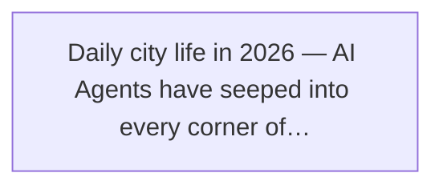
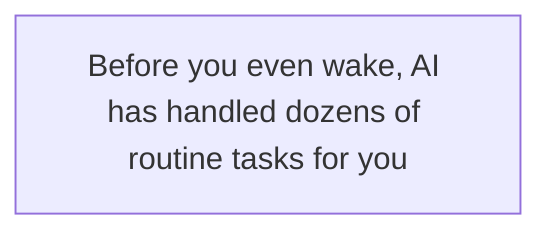
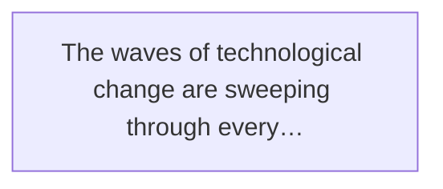
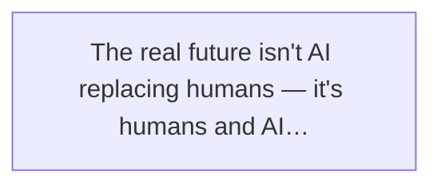
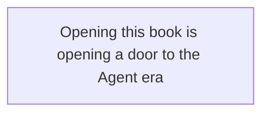
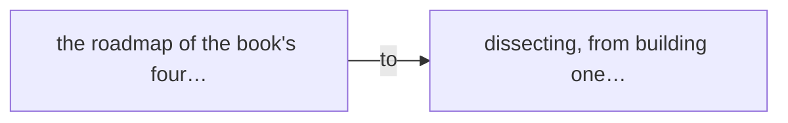

The Self-Driving Era: A Brief History of Agent Evolution

From Prompt to self-evolving organizations, an evolutionary saga of AI Agents

Prologue · Have You Gotten in the Car Yet?

↓ Scroll down to start reading ↓

> Figure: Daily city life in 2026 — AI Agents have seeped into every corner of everyday life

Have you ever woken up to find the world no longer the one you fell asleep in?

No alien invasion, no earth-shattering event. It's just that **AI has quietly taken over more than half your daily work, and you haven't even noticed.**

## 1. Magic in the Early Morning

Let's wind the clock back to an ordinary morning in 2026.

At 7 a.m. your smart curtains slide open and sunlight spills gently into the bedroom. Nothing new there — that existed five years ago. But what you don't know is that while you were still dreaming, your AI assistant had already done all of this for you:

> Figure: Before you even wake, AI has handled dozens of routine tasks for you

- 4:32 a.m. — It replied to three emails from overseas partners, with better phrasing than you'd have managed yourself.
- 5:15 a.m. — It found a bug that had been hiding in the codebase for two weeks, and auto-generated a fix plus a test case.
- 6:00 a.m. — It reshuffled today's schedule, pushing the unimportant meetings to the afternoon.
- 6:40 a.m. — It drafted the project weekly report you're due to hand in, just waiting for your sign-off.
- 6:55 a.m. — It warned you of rain, suggested an umbrella, and booked your ride.

And you? You just stretched, glanced at the "80% of today's to-dos handled" notice on your phone, and got up to brush your teeth.

You won't even think it's a big deal. Just like none of us thinks "a phone that connects to the internet" is a big deal today.

> Any sufficiently advanced technology is indistinguishable from magic.
> — Arthur C. Clarke

But have you ever asked yourself: how did all this happen?

Just a few years ago, AI was only a "chatbot." You asked a question, it gave an answer. It wouldn't act on its own, wouldn't figure out the next step, and certainly wouldn't arrange your whole day for you.

Back then you had to feed it instructions one at a time, like a commander. It was like a new intern — smart, sure, but it wouldn't move an inch unless you pushed it.

Now it has become your "digital employee." No, more than one. It's a whole team: some write code, some organize materials, some talk to clients, and some are dedicated to quality checks. They work around the clock, out of sight.

**This shift is the birth of the Agent.**

## 2. This Is Not Sci-Fi — It's Happening Right Now

I know what you might be thinking: "Sounds grand. Is any of it real?"

I get it completely. Because three years ago, so was I.

In 2023 everyone was playing with ChatGPT. The hottest term then was "Prompt Engineering." The internet was flooded with "universal prompt templates," as if a few magic phrases could make AI do anything.

I bought several "prompt courses" myself. To be honest, they helped — but only so much. It's like learning a few everyday foreign phrases: you can chat a bit, but you're not going to do simultaneous interpretation with them.

The real change came in the second half of 2024. Suddenly, AI wasn't just "good at chatting" — it started "getting things done."

> Figure: The waves of technological change are sweeping through every industry. Are you ready?

Programming led the way. GitHub launched Copilot Workspace, OpenAI launched Codex, Anthropic launched Claude Code. These tools no longer just "complete a line of code" — they understand the whole project structure, can read files, write code, run tests, fix bugs, and even open pull requests on their own.

Then came the office. AI Agents sprang up like bamboo shoots after rain: some tidy meeting notes and auto-generate to-dos, some analyze data and produce reports, some reply to email and follow up automatically, and a few can even run market research and hand you a full report.

By 2025, "Agent" had jumped from insider jargon to a staple of tech headlines. And here in 2026, it has quietly entered ordinary people's daily lives.

**Did you know?**

In 2023 an average developer wrote about 300 lines of code a day. In 2026, the same developer, with Agent tools, can "produce" over 3,000 lines a day — but 90% of those aren't typed by hand; they're written by Agents the developer "directs."

This isn't a distant future. It's now.

## 3. The Era Always Eliminates Those Who Refuse to Change

Hearing all this, you'll likely have one of two reactions.

One: "Wow, amazing! I want to learn too!"

The other: "I'm done for. AI is going to replace me. I'll be unemployed."

If you're the first type, congratulations — this book is written for you.

If you're the second, I want to tell you: **don't panic.**

History has proven countless times that every technological revolution eliminates some people but makes others. When the steam engine arrived, hand weavers panicked. When the car arrived, carriage drivers panicked. When the computer arrived, typists panicked.

But in the end, those who learned to use the new technology all lived better than before.

> Figure: The real future isn't AI replacing humans — it's humans and AI walking side by side

AI won't replace you. But **those who use AI will absolutely replace those who don't.**

This isn't fearmongering. It's a fact unfolding as we speak.

I've seen many examples around me:

- An independent developer who used to take half a year to ship one product alone now ships a complete product in two months with three Agents.
- An operations manager who used to spend three days on an event plan now lets Agents draft ten options, picks the best, and tweaks it — done in half a day.
- A startup founder who used to need a five-person team now runs the same work with a few Agents, cutting costs to a fifth of the original.

These people aren't geniuses or tech wizards. They just **learned to "drive" AI one step earlier than others.**

Change never comes by waiting — it comes by embracing it.
You don't have to outrun AI, but you do have to outrun the people still standing on the sidelines.

## 4. This Book Takes You from Zero to One on Agents

After all that, a bunch of questions are probably forming in your head: "What exactly is an Agent? How do I learn it? Where do I start?"

That's why I wrote this book.

There's no shortage of Agent content today, but it splits into two kinds. One is too technical — papers, formulas, code, enough to give a layperson a headache. The other is too hand-wavy — "AGI," "the singularity is near," exciting to hear but leaving you with no idea what to actually do.

This book is different.

> Figure: Opening this book is opening a door to the Agent era

I won't pile grand concepts on you, and I won't debate philosophy. I want to do one thing: **explain Agents to you from zero to one in the plainest language — where they came from, how they work, and how you use them.**

To make it click, I came up with a perfect analogy:

**An Agent is a self-driving "smart car."**

Wait — what do you mean?

Hold on — that's exactly what Chapter 1 unpacks in detail. I'll leave you hanging for now. All I'll say is this: with the "smart car" metaphor, you'll grasp every core concept of an Agent at once — the brain, memory, context, tools, Harness, observability, self-evolution.

And you'll find that those lofty technical terms are basically the same as things you run into driving every day.

## 5. How to Read This Book

### 📚 Reading Guide

🚗

**Part One: The Evolutionary History**

Follow the path from Prompt to Auto-Organization and see how Agents evolved step by step.

**Part Two: Architecture in Detail**

Take the Agent apart and see how each component works.

**Part Three: Hands-On Cases**

Build an Agent of your own, from theory to deployment.

**Part Four: Organization and Evolution**

From a single car to a fleet — explore the possibilities of future self-evolving AI organizations.

> Figure: The roadmap of the book's four parts — from understanding to dissecting, from building one to assembling a team

I've designed the book in four layers. Pick how to read it based on where you are:

### If you're a complete beginner

Start at Part One and read chapter by chapter, no skipping. I promise: if you can use a smartphone, you can understand everything here. Finish Part One and you can play "AI expert" in front of your friends.

### If you already use AI tools

Focus on Part Two and Part Three. Trust me, you'll finish with a "so that's how it works" feeling — fuzzy concepts snap into focus, and your AI skills jump a level.

### If you're a developer or product manager

Read the whole book closely, especially Parts Three and Four. Many of the ideas and cases here may change how you build products.

### If you're a founder or manager

Read the prologue, Part One, and Part Four first. They'll give you a big-picture grasp of the Agent era, so you can make strategic calls with more confidence.

**Reading tip**

Don't rush to finish it all at once. A chapter a day, even a section a day, is enough. The key is to read and think at the same time: can I apply this to my work or life? Read with questions, and you'll get the most out of it.

## 6. Change Starts Right Now

Writing this far, I want to tell you something from the heart.

I'm no expert, no big shot. I'm just an ordinary tech worker, like you — excited and anxious at once in this fast-changing era.

Excited because our generation is lucky enough to witness what may be the deepest technological revolution in human history.

Anxious because I'm afraid of falling behind, afraid of being left by the times.

But then I realized one thing: **anxiety is useless; action is what works.**

Rather than scrolling "AI evolved again" headlines every day in a panic, settle down, spend some time, and actually understand this thing.

Understand it, and the panic goes away.

Understand it, and you'll know how to make it work for you.

Understand it, and you're no longer the one pushed by the times, but the one **riding the wave forward.**

Change starts right now, the moment you opened this book.
Let AI become our self-driving system, traveling with us.

That's the prologue.

Next chapter, we officially set off — I'll use the perfect "smart car" metaphor to help you grasp once and for all what an Agent really is. Trust me, the way you look at AI will be completely different.

**Ready? Buckle up, we're leaving!**

← Back to Contents  Ch.1: What Is an Agent? →

The Self-Driving Era: A Brief History of Agent Evolution © 2026

An evolutionary saga of AI Agents, from Prompt to self-evolving organizations
