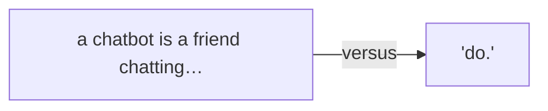
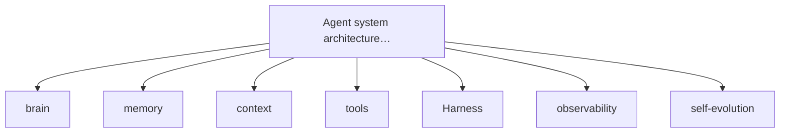
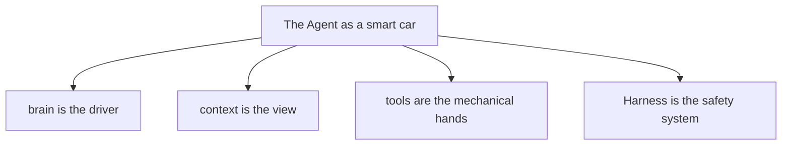
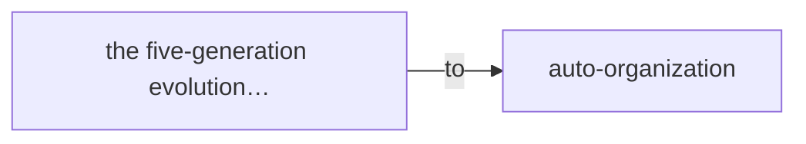
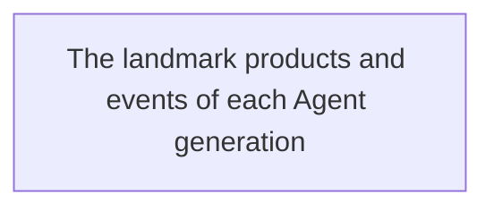
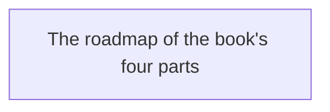

# Part One · Evolutionary History

A "Smart Car" That Drives Itself

If I asked you, "What is an Agent?" you might say, "It's that AI that does things on its own, right?"

That answer isn't wrong, but it isn't precise enough.

Definitions of "Agent" are all over the place. Some call it "an AI that acts autonomously," some "an LLM plus tools," others "the new paradigm of next-generation software."

All true, but too abstract.

In this chapter I'll give you an explanation **anyone can understand.** And I promise: after this chapter, you'll never forget what an Agent is for the rest of your life.

Because I'm going to compare an Agent to — **a smart car that drives itself.**

## 1.1 From Chatbot to Agent: More Than Just Chatting

Before we get into Agents, let's talk about their "predecessor" — the Chatbot.

You're no stranger to Chatbots. From the early Siri and Xiaodu, to the ChatGPT craze of 2022, to the smart customer service on your phone — they're all Chatbots.

A Chatbot's trait is simple: **you ask one thing, it answers one thing.**

You ask "what's the weather like today," and it tells you temperature and precipitation odds. You ask "help me write a leave request email," and it taps out a paragraph. You ask "how do I fix this bug," and it gives you some code and a line of thinking.

But — it **won't actually do it.**

It won't really check the weather sensor downstairs, won't really send that email for you, won't really open your codebase and fix the bug.

It only "talks," it doesn't "do."

> Figure: A Chatbot is a friend chatting in the passenger seat; an Agent is the driver taking the wheel — the essential difference is "talk" versus "do."

ChatGPT is a friend riding shotgun, chatting with you.
An Agent is the driver taking the wheel.

Remember this metaphor. It's your first key to understanding Agents.

Picture the scene:

You get in a car; a friend sits in the passenger seat. You say "I'm going to the office," and he starts chatting: "Which way?" "Might be traffic today." "Take the elevated road?" He talks a good game, but **the wheel is in your hands** — you drive.

That's a Chatbot. It gives advice, ideas, writing — but **you're the one actually doing the work.**

But what if you get into a self-driving car?

You just say "I'm going to the office" and close your eyes to rest. The car decides the route, works the gas and brakes, dodges obstacles, and delivers you to the destination.

That's an Agent. It doesn't just chat with you — it **really does the work.**

### From "you ask, I answer" to "go do it yourself"

This is a leap in kind, not just in degree.

Why? Because the moment AI starts "doing," a whole new set of questions appears:

- What can it see? (field of view)
- What tools can it use? (capability boundary)
- How does it know the task is done? (goal setting)
- Who stops it when it's wrong? (safety control)
- What should it do next after finishing? (flow continuation)
- How does it remember what it did last time? (memory system)

These questions didn't exist in the Chatbot era. You were doing the work; AI just ran its mouth.

But in the Agent era, none of them can be dodged. Because you've handed over the "steering wheel" — even if only partly.

**One-line summary**

A Chatbot's essence is "answering questions"; an Agent's essence is "completing tasks." One word apart, worlds apart.

The clearest example:

You say to a Chatbot, "Check if there are any bugs in the project." It gives you a pile of advice: "Look at the logs, run the tests, check the error messages…"

You say the same thing to an Agent. It opens your project directly, reads the log files, runs the tests, locates the error, even drafts a fix — then tells you: "I found 3 bugs, the fix is ready, take a look."

See the difference?

One **teaches you how**; the other **just does it for you.**

That's why the Agent is called "the next era of AI." It went from "all talk" to "all action."

## 1.2 The Agent's "Organs": The Full Build of a Smart Car

Now you know an Agent is "an AI that does things on its own." But how does it actually work?

Time to take it apart.

I said an Agent is like a smart car. That wasn't off the cuff — every core component of an Agent maps onto a smart car.

> Figure: Agent system architecture panorama — brain, memory, context, tools, Harness, observability, self-evolution

Let's "disassemble" it piece by piece and see what organs an Agent really has.

### Brain (Model): the decision center

If an Agent is a smart car, then **the LLM is its brain.**

Just as a human driver makes decisions with the brain — judging red light or green, whether to change lanes, gas or brake — every Agent decision is made by the LLM.

The LLM is the Agent's "driver." It reads information, understands the task, makes a plan, and renders judgment.

Early LLMs could only handle text, like a driver who reads only road signs. Today's multimodal LLMs can see images, hear sound, understand video — like a driver with full sight and hearing, who reads road conditions, recognizes pedestrians, and understands traffic signs.

🔬 Insider's note

Strictly, the LLM is just one component of the Agent. But it's the most central one — everything else serves it. Without the LLM, the Agent has no "soul." That's why people say "Agent = LLM + everything else."

### 🧩 Memory (Memory / RAG): the hippocampus and the knowledge base

Ever talked to someone who forgot what you said the second before?

Early AI was like that. Every conversation was a "brand-new start"; it didn't remember what you said last time.

But an Agent is different. It has memory.

Agent memory comes in two kinds:

**Short-term memory** — like remembering "the car ahead just signaled right." It lives in the current conversation context and vanishes when the task ends.

**Long-term memory** — like remembering "how to get to work every day." It's stored in an external knowledge base or database, and can be recalled next time a similar task comes up. This is the RAG (Retrieval-Augmented Generation) technique you keep hearing about — when the Agent needs it, it can "pull up" relevant info from the knowledge base.

In car terms, short-term memory is the live road condition on the windshield; long-term memory is the map data in the navigation system.

### Context: the windshield view

This is a very, very important concept — important enough that I'll spend a whole chapter on it later.

What is context? Simply: **how much information the Agent can see when it makes a decision.**

Back to driving.

If your windshield is tiny and you can only see a few meters ahead, you drive nervously, because you can't see far and can't react in time to surprises.

If your windshield is huge with a wide view, you drive more calmly — you can plan ahead and dodge congestion.

An Agent's context window is its "windshield view."

> Figure: The Agent as a smart car — brain is the driver, context is the view, tools are the mechanical hands, Harness is the safety system

The larger the context, the more an Agent can "see," and the more accurate its decisions. But bigger isn't always better — just as driving isn't about seeing farther, you also have to filter out irrelevant info, or your attention scatters.

**Key point**

The heart of context isn't "more is better," it's "just right." Too little and it guesses blindly; too much and noise drowns the signal; too stale and it reasons on false facts. That's the problem Context Engineering solves. (The term "Context Engineering" was popularized publicly by Shopify CEO Tobi Lütke in 2025 [9] and then became mainstream — this book follows that usage.)

### Tools: the mechanical hands and sensors

The brain and eyes aren't enough — the Agent also needs "hands" and "feet" to actually act.

Those hands and feet are the Tools.

What tools can an Agent use? You might be surprised:

📁

File operations

Read files, write files, edit code

🌐

Web search

Look up info, search, browse pages

Command execution

Run tests, compile, deploy

📧

Communication

Send email, send messages, schedule meetings

💾

Databases

Query data, write records, analyze

🤖

API calls

Connect to all kinds of third-party services

Tools are the Agent's interface to the real world. Without tools, an Agent is a strategist who "talks a good game on paper" — sounds brilliant, but can't do a thing.

With tools, the Agent can finally "get its hands dirty."

### Harness: driving school + traffic rules + navigation

Now we come to the **most overlooked yet most important** concept in the Agent world — Harness.

Literally, "harness" means the gear or seatbelt you strap on. In the Agent field it's translated as "驾驭系统" (driving/control system) or "engineering scaffold."

What does it mean?

Imagine: you have a high-performance smart car, huge horsepower, blazing speed. But no steering wheel, no brakes, no traffic rules, no navigation — would you dare ride in it?

Of course not.

Harness is the Agent world's "steering wheel, brakes, traffic rules, and navigation." What it solves is: **how to make the Agent work safely, reliably, and under control.**

What does Harness actually govern?

- **Permission control**: which files the Agent can edit, which it can't touch — like a car that can't drive onto the sidewalk.
- **Behavior constraints**: the rules the Agent must obey — like traffic law, red means stop, green means go.
- **Verification**: how to tell if the Agent did it right or wrong — like the annual inspection and safety check.
- **Human takeover points**: when it must stop and ask a person — like a human driver taking over in complex conditions.
- **Failure recovery**: what to do when it breaks — like airbags and emergency braking.

An Agent without a Harness is a sports car with no brakes —
the faster it goes, the worse it crashes.

Let me tell you straight: a lot of people's understanding of Agents stops at "LLM plus tools." That's dead wrong.

**What truly decides whether an Agent is usable, good to use, and safe to use isn't how smart the LLM is — it's how complete the Harness is.**

The LLM sets the Agent's "ceiling of capability"; the Harness sets its "floor of safety."

Capability without a floor is too dangerous to use, no matter how strong.

### 📹 Observability / Auditability: dashcam + black box

When you drive, don't you install a dashcam?

Why? Because if there's an accident, you need to know what happened and who's responsible.

An Agent is the same.

When an Agent finishes a task, you need to know how it did it, which tools it used, what went wrong in between, and why it made that decision.

That's Observability and Auditability.

Observability answers "what is it doing" — like the dashboard showing speed, RPM, fuel in real time.

Auditability answers "what did it do" — like the black box recording every operation, so you can trace back after something breaks.

It looks useless day to day, but the moment something goes wrong, it's your lifeline.

### 🔄 Self-evolution: the old hand who drives better with time

Last, and coolest — an Agent can evolve itself.

A rookie driver's first time on the road might stall, drift over the line, freeze up. But after a year, he's an old hand — calm in every situation.

An Agent is the same.

It can learn from every task: how did I do it last time? What worked? What failed? How do I improve next time?

This "gets better the more you use it" trait is the Agent's self-evolution ability.

Of course, today's self-evolution is still primitive — more "accumulation of memory and experience" than true "self-improvement." But the direction is set: **an Agent gets smarter and knows you better the more it's used.**

**Core of this chapter**

Agent = brain (LLM) + memory (short + long) + view (context) + hands/feet (tools) + safety system (Harness) + dashcam (observability) + learning (self-evolution). Drop any one, and it's not a complete Agent.

### 🧩 Seven parts, one system

By now you might think: "Wow, an Agent is complicated — seven parts!"

It really isn't. Because those seven parts don't work in isolation; they're an organic whole.

Here's an analogy.

When you drive, your eyes read the road (context), your brain decides (LLM), your hands work the wheel and gas (tools), the navigation map tells you the way (memory), traffic rules and brakes keep you out of trouble (Harness), the dashcam records your driving (observability), and the more you drive the better you get (self-evolution).

All of these work at the same time, not one after another.

An Agent is the same. Those seven components work together to form a complete, do-things Agent. Leave out any one and you have a problem:

- No brain — a headless fly, just bouncing around blindly.
- No memory — starts from zero every time, never learns.
- No context — like driving blindfolded; you'd be lucky not to crash.
- No tools — all talk, no action, accomplishes nothing.
- No Harness — like a car with no brakes; the faster it goes, the more dangerous.
- No observability — a black box; when something breaks you won't know why.
- No self-evolution — forever a rookie, never getting smarter.

🔑 Key insight

A lot of people's understanding of Agents stops at "LLM + tools." That's like understanding a car as "engine + wheels." Not wrong, but far from enough. A roadworthy car needs much more — brakes, dashboard, seatbelts, lights, wipers… leave out any one and it won't run.

## 1.3 The Road of Evolution: From "Hand-Crank Start" to "Full Autopilot"

An Agent wasn't built in a day.

Just as the car evolved from "hand-cranked vintage jalopy" to "fully autonomous smart car," the Agent has gone through five generations.

These five generations don't replace each other — they **stack** on top of each other, like how a modern car still has a steering wheel and brakes, but on top of that adds an autopilot system.

> Figure: The five-generation evolution timeline of Agent technology — from Prompt Engineering to Auto-Organization

Let's follow the timeline and see what each generation actually solved.

**First generation**

#### Prompt Engineering — the hand crank

2022–2023 · Representative product: ChatGPT

This is where it all began. You had to "crank the handle" yourself — write a prompt, and the AI moves once. You say one thing, it does one step; you don't push it, it sits there. Like the earliest cars, where every start meant getting out and cranking for ages.

**Second generation**

#### Context Engineering — adding navigation

2023–2024 · Representative tech: RAG, vector databases

A crank isn't enough — you also have to tell it the way. Context Engineering gives the AI a "map": it can see project docs, history, related material, instead of guessing from nothing. But the wheel is still in your hands; it just sees more clearly.

**Third generation**

#### Harness Engineering — adding brakes and a steering wheel

2024–2025 · Representative products: Claude Code, GitHub Copilot Workspace

The AI got tools and could really act. But acting also meant causing trouble — deleting files, running wrong commands, introducing bugs. So the Harness appeared: brakes, steering wheel, dashboard, airbags. It went from "can do things" to "can do things safely."

**Fourth generation**

#### Loop Engineering — it runs on its own

2025–2026 · Representative concepts: Agent Loop, Automations

This is the crucial leap. In the Harness era, the AI stopped after one task and waited for your next instruction. In the Loop era, it runs itself — discovers tasks, executes them, verifies results, records state, then enters the next round. Like cruise control plus auto-navigation: set the destination and it drives.

**Fifth generation**

#### Auto-Organization — teaming up into a fleet

2026 and beyond · Representative concepts: Multi-Agent, Agent Swarms

One car is fast, but a fleet carries more. Auto-Organization goes from "single car" to "fleet": multiple Agents divide labor and collaborate — some write code, some run tests, some review — they auto-team, auto-collaborate, even auto-evolve new organizational forms.

> Figure: The landmark products and events of each Agent generation

### The core difference between generations

By now you're probably wondering: what exactly separates these five generations?

Here's a table to make it clear:

| Generation | Core question | Human role | Analogy |
|-|-|-|-|
| Prompt | How to state the need clearly | Commander | Hand crank — moves only when told |
| Context | What info to let it see | Pathfinder | Give it a map, it finds its own way |
| Harness | What it can and can't do | Safety officer | Add brakes, wheel, traffic rules |
| Loop | How to keep it running | Supervisor | Cruise control, it runs itself |
| Auto-Org | How to team up, how to evolve | Governor | Fleet formation, self-organizing evolution |

**A key realization**

The five generations don't replace each other; they stack. Just as a self-driving car still has a wheel and brakes, an Agent system with Loop and Auto-Organization still has Prompt and Context as its most basic components. New paradigms don't kill the old — they wrap the old into a bigger system.

### A true story: from "writing prompts" to "building systems"

Enough theory. Let me tell you a real story.

A friend of mine, Xiaoming, is an independent developer. Back in 2023 he was obsessed with Prompt Engineering. He kept a notebook dedicated to collecting "magic prompts" — "universal translator prompt," "top product-manager prompt," "senior architect prompt"… over a hundred of them.

Back then he'd tell anyone: "You know, an AI's ceiling depends on how good your prompt is."

By 2024 he started writing code with Claude Code. At first he kept the old habit — polishing every prompt carefully, trying to make the AI understand in one sentence.

But slowly he noticed something was off.

Every new session, he had to re-explain the project structure, coding style, test commands… and the AI kept making the same mistakes, like forgetting to activate the virtual environment, or editing unrelated files on a whim.

Later he got smart: he dropped an `AGENTS.md` file in the project root with all the rules — project structure, coding conventions, which directories to never touch, the test commands, how to debug when something breaks…

The effect was immediate. The AI's dumb mistakes dropped by 80%.

After that he started tinkering with more: configuring tools the AI could call, setting which commands run automatically and which need confirmation, writing dedicated code-review prompts…

By the second half of 2025, his whole way of working had changed.

Now, every morning when he opens his laptop, the first thing isn't writing code or prompts. It's reviewing what the Agent produced overnight: which bugs were found, which tests failed, which features have a first draft, which issues need his call.

His job went from "writing code" to "setting rules, drawing boundaries, making decisions."

The real change wasn't that AI got stronger,
but that your way of using AI changed.
From "the one who writes prompts" to "the one who designs systems."

Xiaoming's story isn't special. It's one of thousands happening right now.

And the path he walked — from Prompt to Context to Harness to Loop — is a miniature of Agent evolution.

You might still be in the first generation, puzzling over how to write a good prompt. That's fine; everyone started there.

But here's what I want to tell you: **this is only the start. A wider world lies ahead.**

### Why you need to know this

You might think: "I just want to use AI. What's the point of understanding all this?"

Plenty of point. More than one.

#### First, stop wasting money

AI products today come in every flavor, all calling themselves "Agent." But if you know the five generations, you can see through them at a glance:

- Some "Agents" are just reskinned Chatbots — still stuck in generation one.
- Some add a knowledge base and can query docs — roughly generation two.
- Some can write code and run commands for you — that's generation three.
- Some auto-discover tasks, auto-execute, auto-log — generation four.
- Multi-Agent collaboration and self-organization — that's generation five, still rare today.

Next time someone brags "our Agent is amazing," just hold these five generations up to their face — real or fake, one test tells. No more falling for marketing copy.

#### Second, pick the right learning path

A lot of people learn AI scattershot — a prompt trick today, a RAG tutorial tomorrow, then chase whatever new framework is trending the day after.

They learn a pile of stuff and still feel scrambled in the head.

But if you know the evolutionary thread, you get a clear map: where you are now, what to learn next, what's foundational and must be solid, what's advanced and can wait.

**Learning tip**

Don't skip grades. If you can't even write a decent Prompt, don't rush into multi-agent systems. Lock down the early generations first, then build up layer by layer. A weak foundation brings everything down.

#### Third, read the trend of the times

Last, and most important — understanding this evolutionary path lets you see where the future points.

Where is Agent tech right now? Where's the next breakthrough? Which directions have real promise, and which are just flash-in-the-pan hype?

When you look down from the height of evolution, these questions get a lot clearer.

And whoever can read the trend always has one more edge than those who can't.

## 1.4 Where This Book Takes You

That covers the main points of Chapter 1.

But I bet you feel two things now: on one hand, "Agent is pretty interesting"; on the other, "it still hasn't been fully explained."

Exactly — that's the point of Chapter 1: **to give you a map, so you know where you are and where you're going.**

The details we'll take slowly, later.

> Figure: The roadmap of the book's four parts

The book splits into four parts, taking you from beginner to master, from watching the show to seeing the mechanism:

🚗 **Part One: Where Agent came from**

Ch. 1–3 · Evolutionary history

We follow the timeline from Prompt Engineering all the way to Auto-Organization. You'll see how the Agent evolved from "one sentence" into "a system that runs itself." Why did each generation appear? What problem did it solve? What new problem did it leave? Finish this part and your understanding beats 90% of people.

****Part Two: Take the Agent apart and look inside****

Ch. 4–7 · Architecture in detail

We'll dismantle the Agent and explain it component by component. How does the brain work? How is memory stored? How is context managed? How are tools called? How is the Harness designed? How does observability work? How is self-evolution achieved? Finish this part and you move from "watching the show" to "seeing the mechanism."

****Part Three: Build an Agent of your own****

Ch. 8–10 · Hands-on cases

All talk and no action is useless. In this part we'll actually build several working Agents — from the simplest personal assistant, to a coding Agent that writes code, to a workflow Agent that handles complex tasks. Finish this part and you won't just understand; you'll be able to build one.

****Part Four: The smart fleet of the future****

Ch. 11–12 · Organization and evolution

Finally, we look to the future. When there's not one Agent but dozens, hundreds — what happens? How do they collaborate? How do they organize? How do they evolve? What new abilities emerge? What role does the human play? Finish this part and you'll imagine the future anew.

From understanding to dissecting, from building one to assembling a team —
that's our journey.

That's Chapter 1.

One heads-up, so you don't get confused later: Chapter 1 raised the "five-generation" timeline, but what comes next is a bit like taking the car apart in reverse — we'll dismantle the smart car piece by piece, from the brakes and steering wheel (Harness), to the engine (the LLM brain), to memory and tools. The order of parts won't always match the timeline — don't worry; once the car is taken apart, you'll see the main thread was there all along.

If you're still hungry after reading this — congratulations, the Agent has hooked you. Next chapter we officially hit the road of evolution, starting from the very beginning: Prompt Engineering.

You might say: "What's there to talk about with Prompt? Isn't it just writing prompts?"

Hey, don't underestimate it. Prompt may be the first generation, but it's the foundation of everything after. And **far fewer people truly understand Prompt than you'd think.**

Want to know the essence of Prompt Engineering? We'll find out next chapter.

**Buckle up — next stop: the golden age of Prompt.**

← Prologue: The Future Is Here  Ch.2: The Golden Age of Prompt →

The Self-Driving Era: A Brief History of Agent Evolution © 2026

An evolutionary saga of AI Agents, from Prompt to self-evolving organizations
