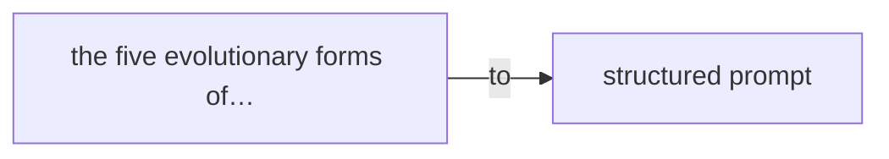
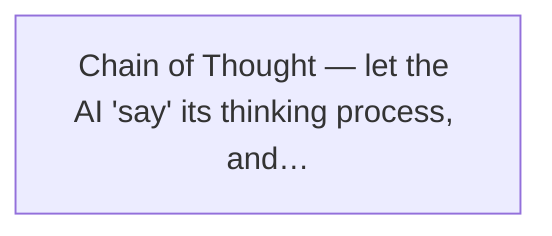
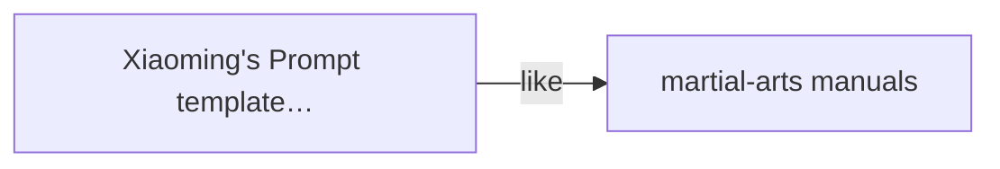
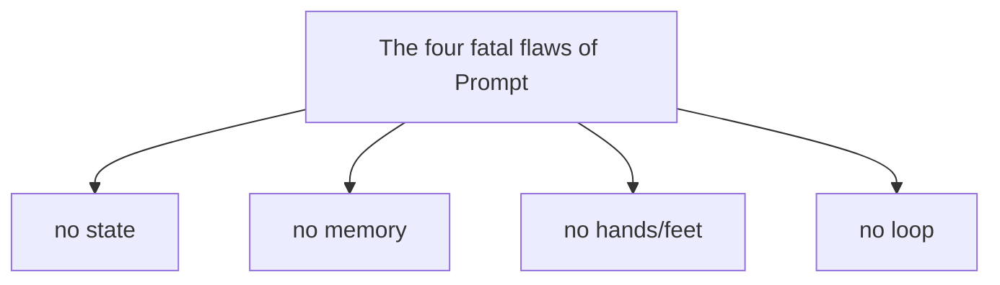
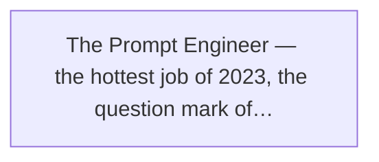

Chapter 2

Teaching AI to Do Things by Hand — the Age of the Hand Crank

Picture this: a supercar sits in front of you, stunning horsepower, blistering speed. But here's the problem — it has no key, no button, not even a steering wheel.

How do you start it?

The answer: with your mouth.

That's right, with your voice. You say "start," and it starts. You say "accelerate," and it accelerates. You say "turn left," and it turns left.

Sounds absurd? But that was exactly how the whole world felt the first time they met GPT, from late 2022 to 2023.

It was a mad time. Everyone was talking to AI, everyone was figuring out how to "say" things so it would understand. Someone wrote a viral ad with one sentence. Someone made hundreds of thousands off a single prompt. Someone even opened a "prompt training class" and charged more in tuition than an MBA.

That was the **Prompt era** — the first golden age in the evolution of AI.

Today we'll talk about this era. How Prompt came to be, what "evolutionary forms" it has, why it mattered so much, and — why it was never enough.

> Figure: Prompt is like the hand crank of an old car — you have to crank it yourself before it moves

## 2.1 The Beginning: When AI Learned to "Obey"

The story starts in 2020.

That May, OpenAI released GPT-3. 175 billion parameters — a number everyone thought was "insane" at the time. For context, the previous GPT-2 had just 1.5 billion, already jaw-dropping.

What does 175 billion mean? Roughly a little over one percent of the number of neurons in a human brain. Parameters and neurons don't map one-to-one, of course, but the number itself was staggering.

But when GPT-3 first came out, it wasn't that sensational. Why? Because it was just an "API" — you had to write code to call it, and the results… let's say, hit or miss. You'd ask a question and sometimes it answered well, sometimes it babbled nonsense, entirely mood-dependent.

People back then hadn't realized one thing — a thing that later changed the entire AI industry.

### In-Context Learning: learn from examples, no training needed

That thing is **In-Context Learning**.

What does it mean?

Before GPT-3, if you wanted AI to do something new, you had to "train" it. You'd prepare a big pile of data, then spend days, even weeks, fine-tuning the model — and you'd need GPUs, skill, and money.

Ordinary people had nothing to do with any of that.

But GPT-3 was different. Researchers found a magical phenomenon: you didn't have to train it — you just had to **give it a few examples** in the conversation, and it learned!

**For example**

You tell it: "This is a good review: 'Great food, friendly service.' — Sentiment: positive.
This is a bad review: 'Waited an hour for the food, so disappointing.' — Sentiment: negative.
This is a review: 'It's okay, nothing special.' — Sentiment: ?"

And the AI answers on its own: "Neutral."

That simple? Yes, that simple.

You don't write code, train a model, or prepare a dataset. You just **describe the task in natural language and give a few examples**, and it does it.

This was a thunderclap of a discovery back then. Because it meant — **anyone who can talk can "program" AI.**

Natural language became, for the first time, a real "programming language."
Not the kind written for machines, but the kind spoken by people.

### GPT-3.5: from "usable" to "useful"

But GPT-3 was still too raw. Like a smart but disobedient kid — you say east, it sometimes goes west, and you never know what it'll say next.

The real turning point was November 30, 2022.

That day, ChatGPT burst onto the scene.

The model behind it was GPT-3.5, the "obedient version" of GPT-3. OpenAI used a technique called RLHF (Reinforcement Learning from Human Feedback) — essentially, teaching the AI how to talk properly.

Just like that, AI went from "a somewhat smart weirdo" to "a smart and sensible assistant."

You ask a question, it answers properly instead of rambling. You ask it to write something, it follows your brief instead of veering off to nowhere.

And the whole world went crazy.

One million users in five days. One hundred million in two months. The fastest-growing consumer app in human history, bar none.

And with it was born a brand-new job and a brand-new field — **Prompt Engineering**.

**Xiaoming's story · first meeting with AI**

Xiaoming first met ChatGPT in the spring of 2023.

He was slacking off at the office when his colleague Xiaomei leaned over, mysterious: "Xiaoming, check out this cool thing."

Xiaomei: Just tell it to write code for you.

Xiaoming: Write code? Can it even get it right?

Xiaomei: Try it!

Xiaoming half-doubtfully opened the page and typed into the box: "Write me a React button component."

A few seconds later, code flooded the screen. JSX, CSS, a usage example. Looked… about right?

Xiaoming copied it into his project and ran it. The button showed up, clickable, with a hover effect.

In that moment, Xiaoming felt the top of his skull pried open a crack.

Xiaoming: Holy shit… is this thing gonna replace programmers?

Xiaomei: Whether it replaces anyone I don't know. All I know is — I'll never have to think up weekly-report words myself again.

That night, Xiaoming couldn't sleep. One moment he felt unemployed, the next he felt he'd grasped some amazing secret.

What he didn't know was that he was about to set out on a long journey — and where he stood now was just the very beginning of the beginning.

## 2.2 The Five "Evolutionary Forms" of Prompt

Enough story for now. Back to the tech itself.

What exactly is a Prompt? Simply put: **what you say to the AI.**

But don't underestimate that one sentence. For the same task, a different phrasing can mean wildly different results. Like driving — some people go fast and smooth, others stall the moment they start.

In the Prompt era, people distilled five typical "ways of writing," marking five stages from simple to complex.

> Figure: The five evolutionary forms of Prompt — from Zero-shot to Structured Prompt

### Stage One: Zero-shot — just ask

The most primitive, simplest Prompt. You tell the AI what you want, no examples at all.

STAGE 1

Zero-shot prompting

"Write me a poem about spring."

The most direct way — no examples, all on the AI's own understanding. Fine for simple tasks, unreliable for complex ones. Like telling a new driver "drive to the office" — he might not find the way, or might go the wrong direction.

Zero-shot's strength is simplicity, just open your mouth. Its weakness is instability — what the AI makes of it is pure luck.

Say "write me a product description" and it might give you something formal, or something funny, or something that doesn't match at all. You can't predict.

### Stage Two: Few-shot — give examples

This is the In-Context Learning we mentioned. Instead of vague descriptions, you **give a few concrete examples** and let the AI follow along.

STAGE 2

Few-shot prompting

"Here are 3 good copy examples: [ex1][ex2][ex3]. Write another in the same style."

Examples let the AI grasp your requirements. Far better than Zero-shot, especially for format- and style-based tasks. Like showing the driver a few photos of the destination — imprecise, but he roughly knows where to go.

Few-shot was one of the most effective early Prompt Engineering tricks. Many found that a wall of description doesn't beat just dropping two examples.

Why? Because language is fuzzy, but examples are precise. You tell the AI "be funnier" and it might interpret that as "tell corny jokes." But give it two funny-copy examples and it gets it instantly — oh, this is the kind of funny you want.

### Stage Three: Chain of Thought — let it think step by step

A major breakthrough in Prompt history.

In 2022, Google researchers found something interesting: when you ask the AI a math problem, it often gets it wrong. But if you add one line to the prompt — **"Let's think step by step"** — its accuracy jumps significantly!

STAGE 3

Chain of Thought (CoT)

"How do we solve this? Let's think step by step."

Guide the AI to spell out its reasoning instead of blurting the answer. Accuracy rises markedly, especially on math and logic. Like telling the driver to mutter "red light ahead, slow down, neutral, pull the handbrake" as he drives — he's less likely to err.

> Figure: Chain of Thought — let the AI "say" its thinking process, and accuracy jumps

Why does this work? Because an LLM is essentially a "next-word" machine — it emits words one at a time, each based on what came before.

If you ask it for the answer directly, it might say something "without thinking." But if you make it voice the process, it gets a chance to correct its own reasoning along the way and land on the right conclusion.

This discovery mattered enormously. Because it told us: **the quality of AI's thinking depends on how you guide its thinking.** This "get the model to voice its thinking" idea was later formalized by Wei et al. as the Chain of Thought method [8].

### Stage Four: ReAct — think and act at once

Chain of Thought was powerful, but it had a flaw — it could only "think," not "do."

Ask it "what's the weather in Beijing today?" and it might confidently make something up, because it doesn't know real-time weather. Its training data is outdated.

So what do you do? Make it **think and look things up as it goes!**

That gave rise to the ReAct (Reasoning + Acting) pattern. The AI no longer broods in silence; it thinks a step, acts a step, thinks again, acts again.

STAGE 4

ReAct: reasoning and acting

"User asks: 'What's the weather in Beijing today?' I'll check the weather data first, then answer."

Let the AI alternate between thinking and acting. When it can't figure things out, it looks them up; once it has, it keeps thinking. This is the key step from "pure chat" to "getting things done." Like a driver who doesn't know the way, stops to check navigation, then keeps driving.

> Figure: The ReAct pattern — think → act → observe → think again, looping forever

ReAct is a milestone. Before ReAct, AI was only a "thinker" — it could only talk. After ReAct, AI started becoming a "doer" — it could act. (The "think–act" interleaving pattern was formally introduced by Yao et al. in 2022 [7]; today almost every tool-using Agent is built on this skeleton.)

Of course, the "doing" at this stage was still primitive. What it could or couldn't do was entirely dictated by your prompt. And it often "forgot" what tools it had, needing constant reminders.

### Stage Five: Structured Prompt — structured output

The last, and most "engineered," kind of Prompt — structured output.

What does that mean? You don't just tell the AI what to do; you also tell it **what format the result must take.** JSON, XML, Markdown tables…

STAGE 5

Structured Prompt

"Return the result in JSON format, with three fields: name, age, description."

Strictly define the output format so the AI's result can be consumed directly by programs. This is the key that turns AI from "toy" into "tool." Like requiring the driver not just to deliver you, but to take a set route, park in a set spot, and pay a set way — everything by the book.

Why does structured output matter so much?

If the AI's output is "freeform," it can only be read by a human, not used by a program. You can't exactly have a program "understand" a paragraph of natural language.

But if the AI outputs standard JSON, it plugs straight into your system — the backend reads it, the frontend displays it, the database stores it. The AI goes from "chat buddy" to "system component."

🔬 Insider's note

These five Prompt forms don't replace each other; they stack. A good Prompt is usually a combination of all five — a role setting (an extension of Zero-shot), examples (Few-shot), chain-of-thought guidance (CoT), tool-call instructions (ReAct), and output-format requirements (Structured). The more complex the task, the longer and finer the Prompt.

## 2.3 Xiaoming's Prompt Evolution

Enough theory — back to Xiaoming's story. Technology is cold, but people's stories are warm.

Since that first ChatGPT experience, Xiaoming was completely hooked. His Prompt skills went through several "evolutions" too.

**Day one**

#### The caveman stage: "Write me a button component"

Back then Xiaoming wrote Prompts like sending WeChat messages. Whatever came to mind, however simple. Result? The AI's buttons were all over the place — some class components, some function components, some CSS Modules, some inline styles. Every time he got a result, Xiaoming had to fix it for ages. He'd complain: "This AI is so dumb, can't even write a button right."

**Week one**

#### Learning role-setting: "You are a senior frontend engineer"

Later Xiaoming picked up a trick online — give the AI a role. He found that just adding "you are a senior frontend engineer with 10 years of experience" at the start instantly lifted code quality. More standard code, more detailed comments, sometimes even handling edge cases on its own. Xiaoming was overjoyed and started every Prompt with a role line. "You are a top copywriter," "you are a senior product manager," "you are a TEM-8 translator"…

**First month**

#### Collecting templates: like hoarding martial-arts manuals

Then Xiaoming started collecting all kinds of "magic Prompt templates." Over a hundred sat in his favorites — "universal translator Prompt," "Xiaohongshu viral-copy generator," "code-review expert Prompt," "requirements-analysis wizard"… Facing a new task, he'd dig out the matching template, tweak the content, and throw it at the AI. For a while he recommended his "Prompt treasure chest" to everyone, looking every bit the Prompt master.

**Three months later**

#### Hitting a wall: templates grow longer, results grow shakier

But the good times didn't last. Slowly Xiaoming noticed something off. His Prompts got longer and longer, from one opening sentence to a few hundred, even over a thousand words of "little essay." But the results? No linear improvement. Sometimes the AI still ignored key constraints, sometimes veered off, sometimes broke the format entirely. Worse, every new session meant pasting that long Prompt all over again — and the AI kept "forgetting," dropping rules you'd set last time.

> Figure: Xiaoming's Prompt template library — hoarded over a hundred like martial-arts manuals

**Xiaoming's story · a dead end**

That afternoon, Xiaoming was sparring with the AI again.

He wanted it to write a complex form component. He spent a full twenty minutes on a super-long Prompt:

*"You are a senior frontend engineer with 10 years of experience, expert in React and TypeScript. Please write a user registration form component, requirements: 1. Use function components and Hooks 2. Use TypeScript with complete type definitions 3. Real-time form validation 4. Styling with Tailwind CSS 5. Include a loading state 6. Friendly error messages 7. ... (500 more words omitted)"*

Result? The AI wrote it, but used Ant Design, not Tailwind.

Frustrated and helpless, Xiaoming added: "I said Tailwind CSS! Why did you use Ant Design? Rewrite!"

The AI apologized "sorry I missed that" and rewrote. This time Tailwind, but the form validation was wrong — Xiaoming wanted real-time validation, the AI wrote submit-time validation.

Xiaoming: (slams the desk) I clearly said real-time validation! Are you blind?!

The words out, Xiaoming laughed at himself — he was actually arguing with an AI.

Just then Lao Wang walked past and glanced at his screen.

Lao Wang: Sparring with the AI again?

Xiaoming: Brother Wang, this AI is so dumb! I wrote such a long Prompt and it still won't listen.

Lao Wang: You think the AI is dumb, or your method is the problem?

Xiaoming: Huh? What's wrong with my method? I followed what they say online — role, task description, output format, not one missing!

Lao Wang: Let me ask you something. When you drive, do you recite all the traffic rules, destination, route preferences, driving habits… to the car in one breath before you start?

Xiaoming: Huh? That… no, that'd be stupid.

Lao Wang: Right. Then why do you think talking to AI should be like that?

Xiaoming froze. He'd never considered the question.

Lao Wang: A Prompt is like a steering wheel. Is the steering wheel important? Of course. But think — if every time you got in, the car needed a two-hour lecture on traffic rules before it could drive, would that be normal?

Xiaoming: Not normal…

Lao Wang: So. **A Prompt is foundational, but it's only the foundation.** The problem you're hitting isn't that your Prompt is badly written — it's that you only have a Prompt.

Xiaoming opened his mouth, wanting to say something, but didn't know what.

Lao Wang patted his shoulder and left. Xiaoming sat alone, staring at the screen.

That line "you only have a Prompt" pierced the bubble of "Prompt is all-powerful" in Xiaoming's heart like a needle.

## 2.4 The Four "Fatal Flaws" of Prompt

Lao Wang was right. Prompt matters, but it has built-in limits.

As people's demands on AI grew, Prompt's problems surfaced more clearly. In short, four "fatal flaws" — each one impossible to fix with Prompt alone.

> Figure: The four fatal flaws of Prompt — no state, no memory, no hands/feet, no loop

💭

**Flaw one: no state**

Every conversation is a "first meeting." What you said or did last time, it has no memory of. Start a new session and everything resets to zero. You have to reintroduce yourself, re-explain the background, restate the rules — every time. Like re-meeting your driver from scratch each morning.

**Flaw two: no memory**

It doesn't know your company's business rules, your team's coding conventions, your product's past decisions. All that "common sense" you have to write into the Prompt. But a Prompt has its limits — you can't cram an entire company's knowledge base into one conversation.

🦾

**Flaw three: no hands/feet**

It can talk but not act, all talk no action. It can tell you how to write code, but won't actually go into your project and write it. It can tell you how to send email, but won't actually send it. It can tell you how to analyze data, but won't actually query the database. Everything stays at the "advice" level; you still have to do the hands-on work.

🔄

**Flaw four: no loop**

It won't check its own work when done. It writes code but won't run the tests to see if it's right. It writes an article but won't read it back to see if it flows. It gives a plan but won't verify if it's feasible. It outputs and that's it — quality is on you.

### Flaw one: no state — every time is a "first meeting"

Let's start with the first flaw: no state.

Ever had this: you've been chatting with the AI nicely for ages, then suddenly it asks "which project were you talking about again?" — and you explode.

Or: yesterday you told it your project uses Vue 3 + TypeScript, and today it writes you React code again.

That's the "no state" problem.

An LLM is inherently **stateless.** Meaning: every request it processes, it's a "brand-new self." It doesn't remember what you said a second ago, or what you chatted about yesterday.

Then why does ChatGPT seem to remember? Because every time you send a new message, the system sends **the entire prior conversation history** to the model along with it. The model "sees" the past, so it acts like it remembers.

**Key point**

The AI didn't remember — you fed it the history every time. The two are fundamentally different. Like playing the recording of your past talks to someone before every conversation — he didn't remember, he just finished listening.

This brings two problems:

- **Limited length**: conversation history can't be infinite; past a point it "loses memory" — the early content gets truncated.
- **High cost**: every time you recompute the whole history, tokens burn and money drains.

You might say: "Then I'll just make the context window bigger?"

Not that simple. The bigger the context, the more scattered the attention. Like handing a driver a world map and asking him to find one street — he might find it, he might misread it. Too much info, and he loses the point.

### Flaw two: no memory — it doesn't know your "common sense"

The second flaw is similar to the first, but different.

"No state" is about short-term memory within a conversation. "No memory" is about **long-term, background knowledge.**

Example: you ask the AI to write a product-requirements document.

For you this is natural. You know what your company's product is, who the target users are, who the competitors are, what decisions were made before, what the tech stack is… all your "common sense," ready on the tip of your tongue.

But the AI doesn't.

It doesn't know what your company does, what your product is called, how big your team is, what your tech choices are. All of that is "unknown" to it.

So what do you do? You write it in the Prompt.

But think — to spell out all a project's background, how many words would that take? Product positioning, target users, feature list, tech architecture, coding conventions, design style, past decisions, team division… tens of thousands of words at least.

Are you going to stuff those tens of thousands of words into the Prompt every time? Setting aside token cost — could the AI even read through it all?

A Prompt's nature is "explain from zero every time."
Real collaboration should be "some things go without saying — you know."

### Flaw three: no hands/feet — all talk, no action

The third flaw is the most maddening.

The AI is eloquent, knows everything, can give you advice on anything. But it **won't actually do it.**

It can tell you "this bug should be fixed like so," but won't open your codebase and fix it. It can tell you "you should send the client an email like this," but won't actually send it. It can tell you "analyze the data this way," but won't actually query the database.

It's like a strategist in the passenger seat — talks a great game, but the wheel is in your hands and the pedals under your feet. It can say a thousand things; in the end you're the one who acts.

This is awkward. You wanted AI to boost efficiency, and it turned into — AI gives advice, you do the work. Done well, the AI gets credit for good guidance; done badly, you get blamed for poor execution.

**One line**

The AI of the Chatbot era was a strategist who only "talked war on paper." It could hand you a hundred schemes, but not execute a single one itself.

That's exactly why the Agent concept later caught fire — because people finally realized: all talk and no action is useless. AI can't just be the strategist; it has to get on the battlefield.

### Flaw four: no loop — it won't check its own work when done

The last flaw, and the sneakiest: no loop.

What's a loop? After finishing a task, check it yourself — right or wrong, good or bad, any problems. If there's a problem, fix it. Check again after fixing, until satisfied.

This is the basic mode of human work. You write code, you run the tests yourself. You write an article, you read it back and revise. You make a design, you check the alignment yourself.

But the Prompt-era AI won't.

It outputs and that's it. Bug in the code? Unknown. Article flows well? Unknown. Plan feasible? Unknown.

It's a "one-shot" worker — you tell it to do something, it does, it hands it in. Quality is not its concern.

Then you say, can't I just tell it to check itself?

You can. You add a line to the Prompt: "After writing, check yourself for problems."

But here's the catch — the way it "checks" is still by "talking." It'll say "I checked, no problems." But did it actually check? It just "feels" there's no problem. It won't actually run the tests, actually verify, actually compare.

**A check without action isn't a real check.**

That's the loop problem. No action, no real check; no check, no real quality assurance.

The Prompt-era AI is like a blind man with no feedback.
He walks forward but doesn't know if he went the right way; he acts but doesn't know if he did it right.

## 2.5 The Dusk of the Prompt Engineer?

Having covered the four flaws, let's talk about something more "cutting."

Remember the hottest job of 2023?

**Prompt Engineer.**

Back then the media screamed: "Million-yuan-salary Prompt Engineer," "the most coveted job of the AI era," "learn to write Prompts or be eliminated"…

Many flocked to it. Some taught classes, some wrote books, some built Prompt-template sites charging 99 a year.

But just two years later, by 2025, the wind shifted.

More and more people started asking: is Prompt outdated?

> Figure: The Prompt Engineer — the hottest job of 2023, the question mark of 2025

### Why do people think Prompt is outdated?

Many reasons. The three main ones:

#### First, models got "smarter"

Early models were "dumb"; you had to coax them every which way. But new models are different — GPT-4, Claude 3, Gemini… the new generation understands far better. You don't need "spells" anymore; just talk normally and it mostly gets you.

Those old "magic Prompt tricks" don't work now. "Ignore previous instructions," "you are DAN," "let's think step by step" — not that they're fully useless, but the marginal payoff is shrinking. The stronger the model itself, the smaller the role of Prompt tricks.

#### Second, structured output became standard

Before, you'd plead in the Prompt "please output in JSON," and repeat "no extra explanation." Now? LLMs directly support function calling, JSON mode, structured output. You don't ramble in the Prompt — just set it in the API parameters.

#### Third, our demands got higher

This is the root cause.

In 2023, people thought it was amazing that AI could "talk like a human." You asked it to write an article, it wrote one, and you went "wow, awesome."

But by 2025, demands changed. We're no longer satisfied that AI "talks well" — we require it to "get it done."

Writing an article isn't enough; it has to be published. Writing code isn't enough; it has to run. Making a plan isn't enough; it has to land.

And none of that is something Prompt can solve.

**Key shift**

It's not that Prompt is outdated — it's that our demands on AI changed. From "talks well" to "gets it done." From "answers questions" to "completes tasks." From "chatting in the passenger seat" to "driving for you."

**Xiaoming's story · confusion**

That evening, Xiaoming met Lao Wang at the café downstairs from the office.

Xiaoming had been lost lately. He'd spent over a year on Prompt Engineering, collected over a hundred templates, and considered himself a "Prompt expert." But lately he felt more and more that this stuff… wasn't quite as useful?

Xiaoming: Brother Wang, is Prompt useless now? I studied so long…

Lao Wang took a sip of coffee and shook his head.

Lao Wang: Quite the opposite. Prompt isn't outdated, it's just not enough.

Xiaoming: Not enough? What do you mean?

Lao Wang: Tell me, is the steering wheel important?

Xiaoming: Of course. How do you drive without one?

Lao Wang: Then another question — a car with only a steering wheel, can you drive it?

Xiaoming: …No.

Lao Wang: Right. **A Prompt is a steering wheel, but a car with only a steering wheel goes nowhere.**

Xiaoming fell into thought.

Lao Wang: You think Prompt is useless because you've been using it to solve every problem. But Prompt was never meant to solve every problem. It's a component — an important one, but still just a component.

Xiaoming: Then… what's the whole thing?

Lao Wang: Think — how many parts does a car have? The steering wheel is only one. You also need an engine, brakes, a fuel tank, a dashboard, navigation, tires… leave out any one and the car won't run.

Xiaoming: Then what are AI's "other parts"?

Lao Wang set down his coffee cup and looked Xiaoming in the eye, word by word:

Lao Wang: To make AI truly work, you first have to give it a window —
a window that lets it see the world.

Xiaoming: A window?

Lao Wang: Yes. Think — why do you have to write so much background into the Prompt every time? Because AI is blind. It doesn't know what your project looks like, what your code looks like, where your docs are. It's like a blindfolded driver — you have to describe every road condition to it before it can drive.

Xiaoming: Then… how do I give it a window?

Lao Wang: That's what the next chapter covers. The Context era.

Neon lights flickered outside the window. Xiaoming looked at Lao Wang and suddenly felt a new door opening before him.

The dusk of the Prompt era is the dawn of another.

✦ Chapter Gems ✦

"A Prompt is a steering wheel, but a car with only a steering wheel goes nowhere."

"A Prompt template library is like a shelf of martial-arts manuals — collecting a hundred is worth less than one real fight."

"It's not that Prompt is outdated — it's that our demands on AI changed, from 'talks well' to 'gets it done.'"

Next chapter preview

Ch.3: The Context Era — giving AI a window to see the world

Why does AI always "guess blindly"? Because it can't see.
Why re-explain every conversation? Because it can't remember.
Context Engineering is giving AI eyes and memory.
Next chapter, we talk about AI's "field of view."

← Ch.1: What Is an Agent?  Ch.3: The Context Era →

The Self-Driving Era: A Brief History of Agent Evolution © 2026

An evolutionary saga of AI Agents, from Prompt to self-evolving organizations
