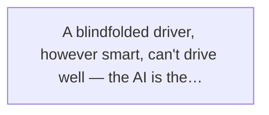
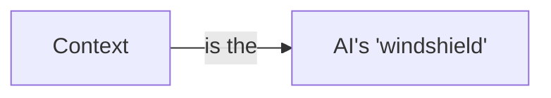
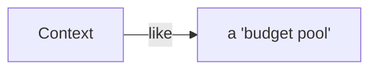
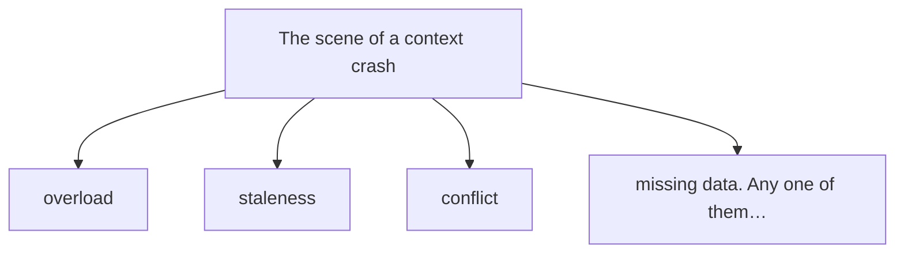
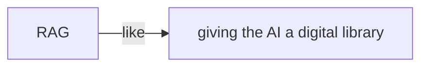
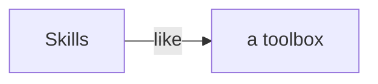

# Chapter 3

# Give the AI a Map — Visibility Determines Capability

If Prompt Engineering taught the AI *how to talk*, then Context Engineering teaches it *how to see the world*.

In the last chapter we talked about the golden age of prompts. Xiaoming learned how to write prompts and how to get the AI to understand what he wanted. For a while he believed that with good enough prompts, the AI could do anything.

Until the day he ran into a problem that changed his mind completely.

It was an ordinary Wednesday afternoon. Xiaoming sat frowning at his screen. A bizarre bug had crept into his project — the page would sometimes go blank, but a refresh would fix it. The bug appeared and vanished like a ghost, tormenting him for two full days.

He decided to ask the AI for help.

## 3.1 An Accidental Discovery: Same Prompt, Different Results

Xiaoming opened a fresh chat window and typed his usual kind of question:

📝 Experiment 1

**Question:** "Help me fix this bug. The page sometimes goes blank."

The AI answered fast, rattling off a long list: maybe a JavaScript error, maybe a CSS loading issue, maybe a failed network request, maybe a memory leak... from frontend to backend, from browser to server, more than a dozen possibilities.

Looking at these "correct but useless words," Xiaoming sighed. He had thought of all those possibilities himself. The question was — which one was it?

Not ready to give up, he opened another window. This time he did something different: he pasted in the error log, the relevant code files, even the results of his recent test runs, then asked the same question.

📝 Experiment 2

**Question:** "Here's the console error log, the code for the relevant component, and the results of the last three reproductions. Help me fix this bug — the page sometimes goes blank."

This time the AI's answer was completely different.

Instead of listing a dozen possibilities, it went straight to the problem: **in cases where an async component failed to load, the Error Boundary didn't handle it correctly, which crashed the whole page render.** It even gave the specific fix, and explained why a refresh seemed to solve it — after a refresh, the cache hit and the component loaded successfully.

Xiaoming stared at the screen, stunned.

Same problem, same AI. Why was the answer quality worlds apart?

He told Lao Wang about his discovery. Lao Wang listened, smiled faintly, and asked him a question:

**Lao Wang:** Suppose you're a mechanic and someone comes in and says "my car sometimes won't move." Could you tell them what's wrong on the spot?

**Xiaoming:** Of course not. At least I'd need to see the car, hear the engine, read the fault code.

**Lao Wang:** Exactly. So why did you expect the AI to find the bug from a single sentence — "the page goes blank"?

**Xiaoming:** Well... I thought the AI was smart and should know everything?

**Lao Wang:** Being smart is one thing; being able to *see* is another. A brilliant mechanic with a blindfold on can't fix a car. Neither can the AI.

The AI usually isn't unable to do the task — it just sees the world wrong.

That sentence hit Xiaoming like a bolt of lightning.

He had always assumed the AI's ability came from how "smart" it was — how big the model, how many parameters, how complete the training data. But this experiment showed him that whether the AI does a job well often **depends less on how smart it is than on how much it can see.**

Same AI, same question — give it different information and the answer quality is night and day.

This is the power of Context.

> Figure: A blindfolded driver, however smart, can't drive well — the AI is the same. Without context it's driving blind

## 3.2 What Is Context? — the AI's "Windshield"

That afternoon, Lao Wang gave Xiaoming an important lesson.

They sat in the break area. Lao Wang held his coffee and said, unhurried:

**Lao Wang:** Remember the metaphor I told you? An Agent is like a self-driving car.

**Xiaoming:** Sure do! The LLM is the brain, tools are the hands and feet, Harness is the brakes.

**Lao Wang:** So what is Context?

**Xiaoming:** Hmm... the navigation map?

**Lao Wang:** More fundamental than that. Context is the **windshield**.

**Xiaoming:** The windshield?

**Lao Wang:** Right. Picture it: what you can see through the windshield while sitting in the driver's seat decides how you drive. If the glass is smeared over and you can only see a sliver of road ahead, would you dare speed up? Dare to change lanes? No — because you can't see what's around you.

Lao Wang went on: Context is **everything the AI can "see" in a single round of decision-making.**

Note that word — "a single round." The AI doesn't see everything; its "field of view" is limited. Every time it answers, it can only see the bit of information you gave it, plus what it picked up during training.

> Figure: Context is the AI's "windshield" — what it can see decides what it can do

### Why a Bigger Context Window Makes the AI Look "Smarter"

Xiaoming caught on:

**Xiaoming:** So when LLM makers keep competing on "context window" size — 4K to 8K, 32K, 128K, even 1M... they're just competing on who has the bigger windshield?

**Lao Wang:** Exactly. Think about it: a car with a palm-sized windshield that shows only ten meters ahead will drive timidly, unable to react in time. But a car with a huge windshield that sees kilometers ahead drives far more calmly — it can plan and dodge ahead of time.

**Xiaoming:** So bigger context is always better?

**Lao Wang:** Ha. If you really believe that, you've fallen into another trap.

### But Bigger Isn't Always Better: More Information, More Noise

Lao Wang gave Xiaoming an example:

Say you're driving to an unfamiliar place. You have two choices:

- **Option A:** a normal windshield + a precise navigation system
- **Option B:** a 360-degree panoramic glass covered with ads, news feeds, social-media updates, stock tickers... all kinds of junk

Which do you pick?

**Xiaoming:** A, obviously! B has plenty of information but it's all noise — you can't drive properly with that.

**Lao Wang:** Bingo! The AI is the same. A bigger context window holds more, but if most of it is useless noise, it actually interferes with the AI's judgment. It's like that windshield plastered with ads — looks information-rich, but the things that matter get buried.

**Key insight**

Context size is not the goal — **context quality is.** A thousand irrelevant tokens are worth less than a hundred precise ones. Context Engineering is not about giving the AI *more* information; it's about giving it the *right* information.

Xiaoming nodded thoughtfully. He used to think a bigger context made the AI mightier, so he'd cram the whole project in every time. Now he saw that might be working against him.

Too little context, and the AI guesses blindly;
too much, and it loses focus;
too stale, and it drives backward.

## 3.3 The Three Core Questions of Context Engineering

"Since Context is so important, how do we get it right?" Xiaoming asked eagerly.

Lao Wang put down his coffee cup and raised three fingers:

**Lao Wang:** Context Engineering can be simple or complicated. At its core it's three questions: **what to put in? how much? and when?**

These three questions are the core of Context Engineering. Each one deserves careful thought.

### Question 1: What to Put In? — Which Materials Belong in the Context

This is the most basic and most important question. What information should your context hold?

Xiaoming's first approach was "throw in whatever comes to mind" — remember the error log, paste the log; remember the code, paste the code. The problem: **the information was scattered, and he kept missing what mattered.**

Lao Wang told him a good context should hold these kinds of information:

- **Ground Truth:** the most central, must-not-be-wrong information. The user's original requirements, the project's basic structure, key constraints. This is the foundation of the AI's decisions and must go in.
- **Relevant materials:** information directly tied to the current task. The error log and related code when fixing a bug; the references and existing content when writing docs. The stronger the relevance, the higher the priority.
- **Background:** information that helps the AI understand the situation. The project's tech stack, the team's coding conventions, decisions made earlier. This makes the AI's answers fit reality.
- **Examples and format:** if you have output-format requirements, give an example. "Output as JSON, like this example..." With or without an example, the output quality differs a lot.

**Tip**

To decide whether something belongs in the context, ask yourself one question: **"Without this information, can the AI complete the task correctly?"** If the answer is "no" or "probably wrong," put it in. If the answer is "barely matters," leave it out.

### Question 2: How Much? — Budgeting the Context

Context isn't infinite. Whether 8K or 128K, there's always a limit. And the bigger the context, the higher the cost and the slower the response.

That brings the second question: **within a limited budget, how do you allocate the space?**

> Figure: Context is like a "budget pool" — you have to be careful, leaving the space for the most valuable information

Lao Wang used an analogy: context is like the space in your suitcase. You go on a trip with one suitcase of fixed size; you have to decide what to pack and what to leave.

Some people want to bring everything — ten outfits, five pairs of shoes, every gadget stuffed in — until the suitcase bursts and the things they actually need have no room.

Others are shrewd — they pack only the essentials, each with a purpose, and still have spare room, so the trip is easier.

🔬 Insider's note

The "cost" of context isn't just money. Research shows that even when a model supports a very long context, its attention to the **middle** part drops — the so-called "lost in the middle" effect. Information at the start and end sticks better; stuff in the middle gets ignored. So it's not about cramming more in; it's about selecting and ordering.

### Question 3: When to Put It In? — All at Once vs. On Demand

The third question is more interesting: do you give the AI everything up front, or feed it as needed?

Xiaoming thought about it and said, "Obviously all at once — saves topping up later."

Lao Wang shook his head. "Wrong again."

**Lao Wang:** Driving to an unfamiliar city, would you print the entire city map and spread it across the windshield?

**Xiaoming:** Of course not — how would I see the road? Navigation only shows the map near my current position, and zooms in or out when needed.

**Lao Wang:** Precisely. The AI's context works the same way. **The best approach isn't stuffing everything in at once, but loading on demand — pulling out whatever is needed, when it's needed.**

**Xiaoming:** But... how does the AI know when it needs what?

**Lao Wang:** That's the most interesting part of Context Engineering. The simple approach is keyword retrieval — the AI says what it needs, you search for it. The advanced approach... we'll get to later.

Xiaoming was hooked, but he knew Lao Wang's habit of leaving things hanging — there had to be something better coming.

## 3.4 Xiaoming's "Context Crash" Live Demo

Theory is one thing; practice is another.

Over the next week, Xiaoming threw himself into Context Engineering. He soon found it easier said than done — he crashed on context far more often than he expected.

On Friday afternoon he found Lao Wang, looking dejected, and showed him his "crash log."

> Figure: The scene of a context crash — overload, staleness, conflict, missing data. Any one of them can drive the AI into a ditch

**Crash 1**

#### Stuffing the Whole Codebase In, So the AI Can't Find the Point

Xiaoming thought "more is better" and pasted in code from a dozen project files, asking the AI to optimize performance. The AI talked a lot but only about surface issues — the real bottleneck was somewhere obscure and the AI never noticed, because with so much information its attention scattered.

**Crash 2**

#### Stale Context, So the AI Reasons on Old Information

Xiaoming asked the AI to refactor a component. He gave it the old version's code; the AI gave a refactor plan. Xiaoming liked it and told the AI to keep going. But in between, Xiaoming had manually changed a few things without telling the AI. The AI kept reasoning from the old code, so what it produced didn't match the latest code at all.

**Crash 3**

#### Conflicting Information in the Context, So the AI Fights Itself

Xiaoming put two documents in the context: one, the product spec, said "the button should be blue"; the other, the design guidelines, said "primary buttons use brand orange." The AI agonized, then kept switching — blue one moment, orange the next. It started fighting itself.

**Crash 4**

#### Saving Tokens, So Key Information Was Left Out

This time Xiaoming learned his lesson and decided to "trim" the context. He figured the tech-stack doc didn't matter and left it out. The result: the AI wrote code using a library the project didn't even have. Xiaoming spent ages changing it before realizing — the project used Vue, but the AI wrote React code.

Lao Wang nearly spit out his coffee reading the "greatest hits" of crashes.

**Lao Wang:** Not bad, Xiaoming. In one week you collected all four classic context crashes. Efficient!

**Xiaoming:** Come on, Brother Wang, stop teasing. Teach me how to avoid these pits...

**Lao Wang:** Relax, everyone steps in them. You've stepped in them now, so you'll know to go around next time. Let me tell you an evolution story, and it'll all make sense.

## 3.5 From RAG to Skills: The "Evolution" of Context

Lao Wang said context management didn't appear overnight — it went through several generations, like a car's navigation system evolving from paper maps to electronic navigation to live-traffic navigation.

Context Engineering's evolution splits into roughly four stages:

📄

**First generation**

#### Manual paste: CTRL+C / CTRL+V by hand

The most primitive method. You copy in whatever you think matters. Simple and direct, but wholly dependent on human judgment — inefficient, easy to miss things, quality all over the place. Xiaoming started here.

**Second generation**

#### RAG retrieval: Give the AI a library

Store all your materials in a "knowledge base" ahead of time. When the AI needs something, it searches the base by keyword or semantic search, then stuffs the found information into the context. This is the RAG everyone talks about (Retrieval-Augmented Generation).

📋

**Third generation**

#### Rule files: AGENTS.md / CLAUDE.md

Some information is needed every time — project conventions, coding style, directory structure. Rather than retrieve it each time, write it in a fixed file that gets read at the start of every conversation. Like a car's user manual: read it before you drive, so you know the basic rules.

🧩

**Fourth generation**

#### Skills + MCP: modular and dynamic

Package knowledge into "skill modules" loaded only when needed, taking no space. Then connect to external data sources on the fly through the MCP protocol — the AI can read not just what's "in the car" but pull live data from "the cloud."

### RAG: Give the AI a Library

Lao Wang focused on RAG, since it's the most common way to manage context today.

RAG stands for Retrieval-Augmented Generation. The name sounds fancy, but the idea is simple:

> Figure: RAG is like giving the AI a digital library — look up whatever you need, then use it to answer the question

Picture a giant library holding all your documents, code, and knowledge. Someone asks a question. Instead of memorizing the whole library, you go find the few books related to the question, flip through them, find the answer, and answer.

That's what RAG does:

- **Store:** chop all your materials into small chunks and put them in a vector database (the "library")
- **Search:** after the user asks, search the vector database for the chunks most relevant to the question
- **Assemble:** join the found content with the user's question into a complete context
- **Answer:** send that complete context to the LLM and let it answer based on the information

**Why RAG blew up**

Because RAG solves several pain points at once: you don't have to stuff everything into context every time (saves tokens); you can update the knowledge base anytime (information doesn't go stale); and the AI's answers are grounded (you can trace the source). That's why RAG suddenly exploded in 2023 and became almost standard for AI apps.

### AGENTS.md: Read the "User Manual" Every Time You Get In

After RAG, Lao Wang showed Xiaoming a "small trick" — the project rule file.

Many Agent tools (Claude Code, Cursor) support a special file in the project root, usually called `AGENTS.md` or `CLAUDE.md`. Every time the AI takes on the project, it reads this file first to learn the basic rules.

What goes in this file?

- What the project does (one-line intro)
- What the tech stack is (frameworks, languages)
- How the project is structured (key directories and files)
- What the coding conventions are (naming style, code format)
- How to run tests, how to start, how to build
- What must not be touched (sensitive files, production config)
- How to troubleshoot (common issues and fixes)

**Lao Wang:** Don't underestimate this file. I've seen teams cut the AI's silly mistakes by 80% just by adding a few dozen lines.

**Xiaoming:** That magical? It's just an instruction file.

**Lao Wang:** Think about it — when a new teammate joins, do you hand them a project manual to read first, or let them flail around? The AI is that new teammate. If you don't tell it the rules, it guesses. A right guess is luck; a wrong guess is the norm.

### Skills: Modular Knowledge, Loaded on Demand

One step further up the ladder is Skills.

What are Skills? Simply, **package knowledge into independent "skill packs" that load only when needed.**

> Figure: Skills are like a toolbox — each skill is a separate tool, pulled out only when you need it

Lao Wang gave an example:

Say you have an Agent that sometimes writes code, sometimes writes docs, sometimes does data analysis. If you stuff all that knowledge into the context, it gets bloated, and most of it goes unused most of the time.

But with Skills? You have three skill packs:

- **coding.skill** — coding conventions, common patterns, testing methods
- **writing.skill** — doc templates, writing style, format requirements
- **analysis.skill** — analysis methods, data definitions, report templates

When the AI writes code, it loads coding.skill; when it writes docs, it loads writing.skill. The context then holds only the knowledge the current task needs — clean, precise, not bloated.

**Analogy**

If RAG is a library, Skills are a toolbox. The books in a library are "material"; the tools in a toolbox are "capability." Material is for looking up; capability is for doing. You don't carry the whole toolbox in your pocket, but you can grab whatever tool you need.

### MCP Servers: Connect to the Outside World Dynamically

Finally, Lao Wang mentioned something newer — MCP.

MCP stands for Model Context Protocol. It's like the AI's "USB port" — through it, the AI connects dynamically to all kinds of external data sources and pulls information live.

For example:

- Connect to your database — the AI can query tables directly, no need to export and paste
- Connect to your code repo — the AI can search code and read commit history directly
- Connect to your project management tool — the AI can see the task list and spec docs directly
- Connect to a search engine — the AI can look up the latest information live

**Lao Wang:** See, the evolution of context comes down to one line: **from "carry information by hand" to "find information automatically," from "stuff it all in" to "pull it out on demand."**

**Xiaoming:** Sounds like... the Agent is starting to manage its own context?

**Lao Wang:** Right. That's exactly where Context Engineering is heading — from humans managing context to the AI managing it. But before that, someone has to set up the rules and the system.

## 3.6 The Golden Rules of Context Engineering

After all that, Lao Wang summed up four golden rules of Context Engineering for Xiaoming. He said no matter how the tech evolves, these four never change.

> Figure: A good context is like a funnel — a lot goes in, but what you feed the AI must be the most precise part

**1**

#### Not the most, but just right

Many think a bigger context is always better. Not so. Too little, and the AI guesses; too much, and noise interferes. The best context is **not too much, not too little, but just right** — everything in it is useful, and every useful thing is in it. How do you judge "just right"? Look at the task: a simple one (translating a sentence) needs little context; a complex one (refactoring a module) needs more background.

**2**

#### Keep Ground Truth separate from process information

Not all context information matters equally. Some is "Ground Truth" — the user's original requirements, the project's basic rules, authoritative docs. These can't be wrong, or the whole direction skews. Some is "process information" — the AI's own reasoning, intermediate artifacts, trial-and-error logs. That's auxiliary; if it's wrong, you can fix it. When managing context, always keep these two apart. Put Ground Truth where the AI can see it and won't forget; process information can be trimmed, discarded, overwritten.

**3**

#### Stale context is more dangerous than no context

This is easy to miss. The AI doesn't know which information is latest and which is outdated. If you hand it an old version of the code, the requirements, the data, it will confidently talk nonsense based on that stale info — and sound very convincing doing it. So, **rather less information than wrong or stale information.** Before giving the AI context, ask yourself: is this still the latest?

**4**

#### To amplify something, put it in the context

The last one is interesting. Context isn't just "providing information"; it's also an "amplifier" — whatever you put in, the AI pays attention to. Want the AI to value something? Put it in the context, in a prominent spot. Care about code quality? Put the coding conventions in. Care about testing? Put the testing requirements in. Want the AI to focus on user experience? Put user feedback in. **Context is the AI's "attention director" — show it something, and that's what it focuses on.**

The essence of Context Engineering is
not to give the AI more information,
but to give it the right information.

### Xiaomei Joins In

Mid-conversation, the PM Xiaomei wandered over. She'd been using AI to write product docs lately, but always felt the AI's output was "missing something."

**Xiaomei:** What are you all talking about? So lively.

**Xiaoming:** We're talking about Context Engineering — how to feed information to the AI. Brother Wang is great at this. I feel like I'd been doing it all wrong.

**Xiaomei:** That impressive? Then let me ask something: when I have the AI write product docs, why is the output always so empty and generic? Fits anywhere, matches nowhere?

**Lao Wang:** What did you show it?

**Xiaomei:** I just said "write a product requirements doc for feature XX."

**Lao Wang:** And you didn't show it the user personas, the business background, the competitor analysis, the earlier product plan?

**Xiaomei:** Ah... I was supposed to give it those? I thought it knew everything.

**Lao Wang:** It knows general product methodology. It doesn't know your business, your users, your product positioning. Without that, it can only give you a generic template — looks professional, but doesn't match your reality.

**Xiaomei:** So that's it! I'll go organize all our product material and feed it to the AI!

Watching Xiaomei rush off, Xiaoming felt something too. Whether writing code or docs, the logic of Context Engineering is the same — **the world you show the AI is the answer you get back.**

## Chapter Summary

This chapter was about Context Engineering — giving the AI a map so it can "see clearly."

The core points:

- **The AI usually isn't unable to do the task — it just sees the world wrong.** Different information in, wildly different output quality.
- **Context is the AI's "windshield" — everything it can see in this round.** A bigger view makes it look smarter, but bigger isn't always better; too much information means more noise.
- **The three questions of Context Engineering: what to put in, how much, when.** Each needs careful design.
- **Four context crashes: overload, staleness, conflict, missing key info.** Any one can drive the AI into a ditch.
- **The evolution of context: manual paste → RAG retrieval → rule files → Skills + MCP.** From manual to automatic, from all-at-once to on-demand.
- **Four golden rules: just right is best, separate Ground Truth, stale is worse than none, amplify what you put in.**

**Quotable lines of this chapter**

"The AI usually isn't unable to do the task — it just sees the world wrong."
"Too little context, and the AI guesses blindly; too much, and it loses focus; too stale, and it drives backward."
"The essence of Context Engineering is not to give the AI more information, but to give it the right information."

### Next Chapter Preview

### A Car with Only a Windshield — Would You Ride In It?

After Context Engineering, Xiaoming felt he'd opened a door to a new world.

He said to Lao Wang, excited:

"So Context is that important! Then if I just get Context right, the AI will work perfectly?"

Lao Wang's face darkened at those words.

"Xiaoming, let me ask you something." His tone turned serious. "Have you ever seen a car with only a windshield and no brakes?"

Xiaoming paused. "A car with no brakes? Who'd dare ride in that?"

Lao Wang nodded, his gaze deepening:

"Then would you dare use an AI that can act on its own but has no constraints at all?"

Next chapter, we enter the Harness era — fitting the AI with brakes and a steering wheel.

← Ch.2: The Golden Age of Prompts  Ch.4: The Harness Era →

The Self-Driving Era: A Brief History of Agent Evolution © 2026

An evolutionary saga of AI Agents, from Prompt to self-evolving organizations
