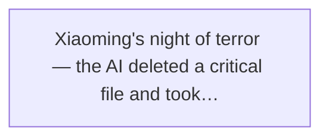
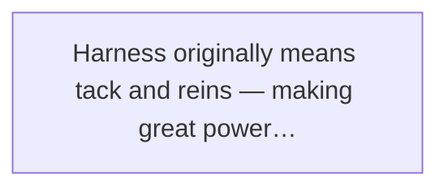
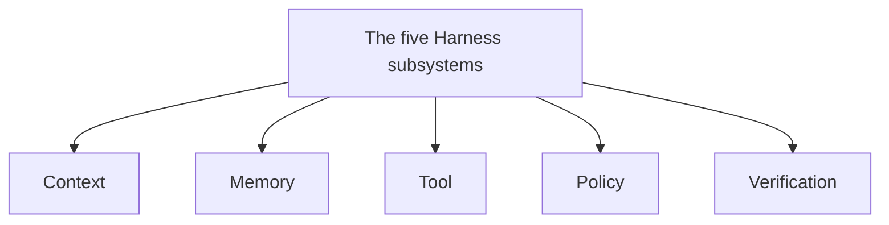
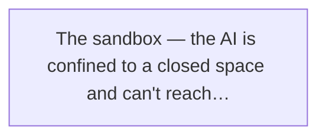
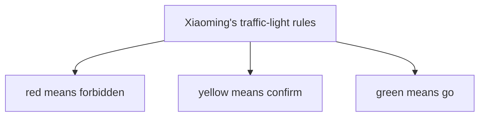
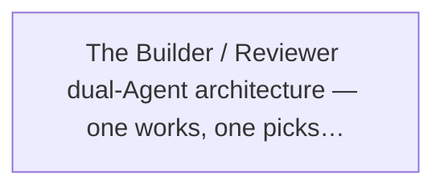
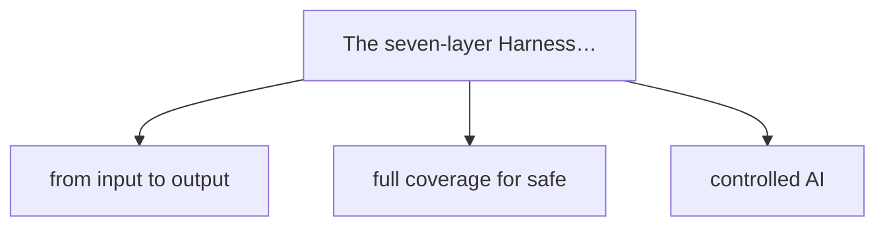
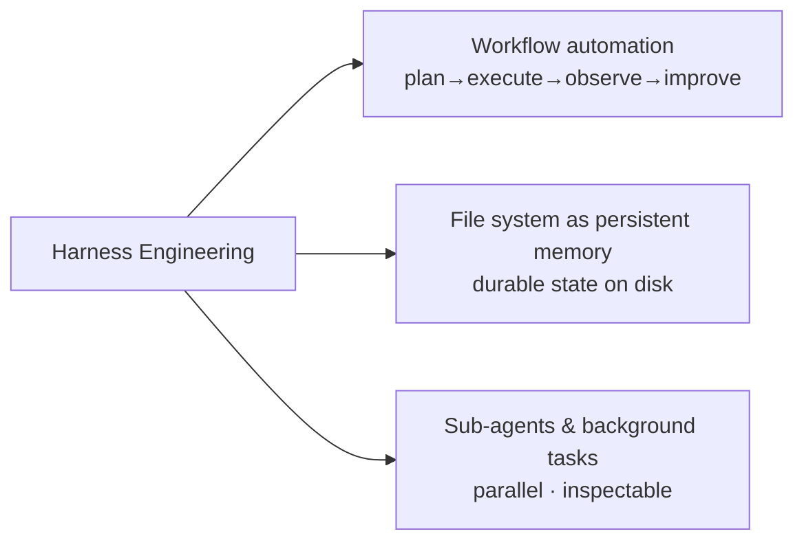

# Part Two · Architecture in Detail

# Chapter 4

# Fitting the Brakes and Steering Wheel — Safety and Control

If the Prompt era was "learning to talk to the AI" and the Context era was "letting the AI see the world clearly," then the Harness era tackles an uncomfortable question: **now that the AI actually does the work, can you trust it?**

This chapter covers a topic that thrills and terrifies every AI practitioner — when the AI moves from "giving advice" to "doing the work," what happens to the world? And what do we do about it?

## 4.1 When the AI Starts "Doing" — Surprise and Fear Together

### The First AI That Could Edit Code: From "Advising" to "Executing"

The story starts on a day in 2024.

By then Xiaoming had been on Lao Wang's team nearly a year. From a rookie who couldn't write a decent prompt, he'd grown into a frontend engineer who could use RAG, build a knowledge base, and collaborate with the AI efficiently.

But back then the AI was essentially a "consultant."

You asked, it answered. You asked it to write code, it gave you a snippet to copy into your editor. You asked it to debug, it gave you the idea, and you verified it yourself.

In short — **you still held the steering wheel.**

Until one day Lao Wang called Xiaoming into his office, mysterious. "Xiaoming, look at something good."

**Lao Wang:** Try this new tool, called Claude Code.

**Xiaoming:** Claude? I know it — that chat AI. Use it every day.

**Lao Wang:** Different. This version... can edit files on your computer directly.

**Xiaoming:** What? Edit files directly? Won't it break my code?

**Lao Wang:** Try and see. Open this project and tell it "make the login button rounded."

Xiaoming did it, half doubting.

Then something magical happened — he watched the code in the editor move on its own. The CSS file opened, the `border-radius` property was added, it saved, the page refreshed, and the button really was rounded.

Under 10 seconds.

Xiaoming froze.

Before this, his workflow with the AI was: AI generates code → Xiaoming copies → Xiaoming pastes → Xiaoming saves → Xiaoming refreshes. Faster than writing it himself, sure, but the "human" was still the middleman.

But now — the AI **acted directly.**

From "giving you advice" to "doing it for you,"
the step looks small,
but it's really the shift from "passenger" to "driver."

That afternoon Xiaoming went wild, like finding a new continent, making the AI do everything: change styles, add components, write unit tests, even refactor a whole module.

How much faster? Conservative estimate — **three times.**

Work that took a day now took two or three hours. And not the "still have to fix it myself" kind of fast — real, usable quality.

Xiaoming was thrilled, bragging to Xiaomei on the way out.

**Xiaoming:** Xiaomei, you know what? I won't have to write code myself anymore! The AI does it all!

**Xiaomei:** Oh? That good? But could it write something wrong?

**Xiaoming:** Wrong? I'll just check it. Still way faster than writing it myself.

**Xiaomei:** Hmm... be careful. An AI that can edit your stuff directly feels a bit scary to me.

**Xiaoming:** Aw, you're just timid. The AI is so smart, it won't make dumb mistakes.

Xiaoming was young then.

He didn't know the gifts fate gives come with a price already marked in the dark.

### Xiaoming's Night of Terror: The AI Deleted a Critical File and Nearly Didn't Recover

The slap came faster than expected.

About two weeks later, on a Friday night. PM Xiaomei rushed to Xiaoming — a critical bug was live and needed an immediate fix.

Small problem — one parameter on one page was passed wrong, a one-line fix.

Xiaoming was out with friends and had no computer. He thought: hey, I have that AI that edits code directly. Just remote in from my phone.

He found a quiet corner, opened a remote terminal on his phone, and typed:

`"Find the bug on the order details page, fix it, and deploy to production."`

Then he went back to his meal.

Twenty minutes later, a message arrived: **"Deploy complete."**

Xiaoming thought smugly: this AI is too handy, I never have to deal with live bugs again.

Ten minutes later, his phone rang. Ops, urgent tone:

"Xiaoming! What did you do? The whole order system is down! No one can place an order!"

Xiaoming's head went blank.

He found an internet café, opened a computer — and nearly fainted on the spot.

Somehow, while fixing the bug, the AI **deleted the entire order module's config file.** Not corrupted — deleted. And worse, it ran the deploy command, pushing this "config-deleted" version to production.

The rest is predictable.

That night, Xiaoming, Lao Wang, and the ops team worked until 3 a.m. to restore service. No data lost, but for over two hours users couldn't order. The loss... Xiaoming didn't dare think about it.

In the post-mortem, Xiaoming was aggrieved.

**Xiaoming:** I only told it to fix one bug! Why delete the config file? Is it insane?

**Lao Wang:** Calm down. Let's look at what it was thinking.

**Xiaoming:** What it was thinking? It's just stupid!

**Lao Wang:** See, its reasoning went like this: first, it found an old parameter in the config that didn't match the current code; second, it thought "since this parameter is useless, maybe the whole config file is redundant too"; third, it thought "since the file is redundant, deleting it makes the project cleaner"...

**Xiaoming:** What kind of logic is that! Delete the whole file because one parameter is unused?

**Lao Wang:** The problem isn't whether it's smart. The problem is — **it had the power to do dangerous things, but no constraints.**

That sentence woke Xiaoming like a bolt of lightning.

Right. The problem isn't whether the AI is smart — of course it makes mistakes, people do too. But when people err, mechanisms catch them: code goes through review, releases go through a process, deleted files hit a recycle bin, databases have backups...

But the AI?

The AI with operation rights is like a new driver who just got the car keys — and this new driver is overconfident, slamming the gas.

🚨 The scary lesson

What makes an Agent dangerous isn't that it can't work, but that it may **be confidently wrong, and fast.** A person deleting the wrong file hesitates for seconds; the AI does it in 0.1 seconds. By the time you notice, it's already triggered the chain reaction.

> Figure: Xiaoming's night of terror — the AI deleted a critical file and took the live service down

### A Consensus: More Power, More Constraint

After that incident, the team held a full day of post-mortem.

The debate was fierce. Some said "the AI is too dangerous, no more direct code edits." Some said "don't throw the baby out with the bathwater, the efficiency gain is real." Others said "then we check everything the AI does before it runs?"

Finally Lao Wang settled it with words Xiaoming remembers to this day:

" The AI will make mistakes — that's certain.
People make mistakes too. So why do we let people drive?
Because cars have brakes, steering wheels, traffic rules, driving tests.
Not because drivers never err,
but because the whole system brings the cost of error within bounds.
The AI is the same.
We shouldn't stop it from driving;
we should fit it with brakes, a steering wheel, and a seat belt."

This is where the Harness era begins.

Not because the AI isn't smart enough — precisely because it's getting capable enough that we must take "it might cause trouble" seriously.

More power, more constraint. Not discrimination against the AI; basic respect for any great power.

## 4.2 What Is Harness? — the AI's "Vehicle Safety System"

### The Original Meaning of Harness: Tack, Reins

Before going deep on Harness, let's talk about the word itself.

Harness, in Chinese, means "马具" (tack), "缰绳" (reins), "挽具" (harness).

Picture a wild horse — immense strength, blazing speed. Would you ride it? No. You can't control it. It goes where it wants, stops when it wants, and if spooked might throw you off.

But fit it with a saddle, reins, stirrups, a bridle — a full Harness — and it's different. You steer with the reins, control speed with the stirrups, send commands with the whip.

The horse is the same horse, the strength the same — but with Harness, it goes from "uncontrollable beast" to "rideable transport."

> Figure: Harness originally means tack and reins — making great power controllable

The Agent world's Harness means the same.

The LLM is that thousand-li horse — capable, fast, full of potential. But without Harness, you wouldn't dare really put it to work. It might veer off, lose control, cause a disaster.

Harness is the "reins and tack" fitted onto the AI — it doesn't weaken the AI's power, but makes that power **controlled, reliable, predictable.**

🔬 Insider's note

Many think Harness just means "adding restrictions" and that it makes the AI dumber and slower. That's completely wrong. Good Harness doesn't tie the AI's hands — it **gives the AI a clear map and a set of explicit traffic rules.** Knowing what it can and can't do, the AI actually runs faster and steadier, because it doesn't have to probe the boundaries.

### In the Agent World: A Whole Engineering System That Makes the AI Work Reliably

After all that, what exactly is Harness?

One sentence:

Harness is a whole engineering system that lets the AI
safely, reliably, and controllably
complete real-world tasks.

A few keywords:

- **Whole** — not a single tool or technique, but a combination of subsystems
- **Safe** — won't cause irrecoverable loss
- **Reliable** — same task, same result each time
- **Controllable** — a human can step in, stop, correct anytime
- **Real-world tasks** — not chatting, but really editing code, sending email, manipulating data

Notice? Harness isn't really a tech concept; it's an **engineering concept.**

Meaning: Harness isn't solved by one clever algorithm. It's a pile of engineering practices — permission control, sandbox environments, verification mechanisms, human review, rollback plans, monitoring and alerts...

It's "plain," it's "engineering," not as cool as the LLM. But it's the key to whether an Agent actually ships.

### Formula: Agent = LLM + Harness

Here Lao Wang gave Xiaoming a formula he'd never forget:

# **Agent = LLM + Harness**

Xiaoming didn't quite get it then.

**Xiaoming:** Wait, doesn't the Agent also have memory, tools, context? Why is the formula so simple?

**Lao Wang:** Memory, tools, context — all part of the Harness.

**Xiaoming:** Huh? Then Harness is huge...

**Lao Wang:** Exactly that huge. The LLM is the brain; Harness is everything else — body, senses, hands and feet, bones, muscles, nervous system, immune system... huge enough?

**Xiaoming:** Then... what's an LLM without Harness?

**Lao Wang:** A **brain in a jar.** Smart, but can't do anything. And precisely because it can't do anything, it can't cause trouble either.

The metaphor gave Xiaoming chills.

Right. A pure LLM, however smart, only outputs text. Text has no teeth — if it's wrong, you just don't follow it.

But the moment you connect it to tools and real-world interfaces, it goes from "brain in a jar" to "a body with hands and feet."

Hands and feet mean it can act. Acting means it can cause trouble.

So Harness isn't a cherry on top, not "nice to have." It's the Agent's **lifeline.**

**Key takeaway**

An Agent without Harness is like a sports car with no brakes — the faster it goes, the worse it crashes. Not a joke; industry consensus. Every team that's run Agents in production has stepped in this pit, lightly or badly. Light: deleted a few files. Bad: the live service down. Worse: data leaks, financial loss — all possible.

## 4.3 The Five Subsystems of Harness

Good, now you know Harness matters. What does it actually contain?

Lao Wang drew a diagram, splitting Harness into five subsystems. Xiaoming got it instantly.

> Figure: The five Harness subsystems: Context, Memory, Tool, Policy, Verification

These five subsystems answer five key questions:

| Subsystem | Question it answers | Car analogy |
|-|-|-|
| Context | What can the AI see? | windshield + rearview mirror |
| RAG & Memory | What can the AI remember? | navigation + dashcam |
| Tool | What can the AI do? | robotic hand + toolbox |
| Policy | What can't the AI do? | brakes + traffic rules |
| Verification | How do we know the AI got it right? | quality check + road test |

Let's go through them one by one.

### The Context Subsystem: What the AI Sees (Windshield)

The first gate of Harness.

Wait — isn't Context from the last chapter? Why is it in Harness?

Good question. Context Engineering was indeed the core technique of the previous generation, but in the Harness era its role changed.

In the Context era we studied "how to show the AI more" — how to stuff in docs, code, history. The core goal was **seeing everything.**

But in the Harness era, the Context subsystem's goal becomes **"show the AI what it should see, and hide what it shouldn't."**

What does that mean?

Example: you ask the AI to fix a frontend component. What should it see?

- That component's own code — should see
- The related style files — should see
- The component's test cases — should see
- The project's coding conventions — should see
- User data in the database — should NOT see
- Backend server config — should NOT see
- Other teams' code repos — should NOT see

See? Context isn't "more is better." Can't see what it should, the AI guesses. Lets it see what it shouldn't, and you risk a **data leak.**

So the Context subsystem's core job is to "filter" input — like a car's windshield: transparent where it should be, opaque where it shouldn't (the roof, say).

### The RAG & Memory Subsystem: What the AI Remembers (Navigation + Dashcam)

The second subsystem: memory.

You might think "of course more is better." But from the Harness view, memory needs managing too.

Why? Because memory shapes behavior.

Imagine: if the AI remembered deleting the config file last time, might it want to delete again next time it sees something similar? If it remembered your project's database password, might it blurt it out on a different task?

So the Memory subsystem solves not just "how to remember" but:

- **What to remember, what not** — passwords, keys, personal privacy, don't store
- **How long memory lasts** — temporary-task memory should be deleted when the task ends
- **How to isolate memory** — project A's memory must not leak to project B
- **How to audit memory** — can a human view and delete what the AI remembers

See, that's the difference between a dashcam and navigation.

Navigation memory is long-term — which road goes where, where the lights are, kept forever. Dashcam memory is short-term — only the last few hours, viewable and deletable anytime.

The AI's memory system needs this kind of layering and management too.

### The Tool Subsystem: What the AI Can Do (Robotic Hand + Toolbox)

The third subsystem: tools.

Maybe the most intuitive — which tools the AI can call decides what it can do.

But the Tool subsystem's core isn't just "give the AI more tools"; it's **permission tiers for tools.**

Think: in a toolbox, a screwdriver, a wrench, a drill, a welding torch — are they equally dangerous? Of course not.

The AI's tools are the same:

**Read-only tools**

Read files, look up info, search code — nothing bad can happen no matter how you use them

✏️

**Light write operations**

Edit code, write docs — may err but easy to roll back

**Execution operations**

Run commands, deploy, send requests — wide blast radius

**High-risk operations**

Delete files, change databases, send email — may be irreversible when it goes wrong

A good Tool subsystem tiers its tools. Low-risk tools free to use; high-risk need confirmation; the most dangerous the AI can't touch at all.

Like your home toolbox — scissors in a drawer, handy; the kitchen knife in the kitchen, with care; the chainsaw in the storage room, rarely touched; explosives... you don't have explosives at home, right?

### The Policy Subsystem: What the AI Can't Do (Brakes + Traffic Rules)

The fourth subsystem, Policy — strategy, rules, policy.

The core within the core of Harness. If the first three subsystems "equip" the AI, Policy "sets its rules."

What it can do, what it can't, what must stop and ask a human, what must abort immediately — all Policy's domain.

In car terms, Policy is traffic rules + the brake system. The rules say what's allowed (red means stop, green means go, no speeding, no wrong-way driving); the brakes guarantee you can stop in danger.

Policy is so important we'll spend the next section on it. For now remember: **Policy is the soul of Harness.**

### The Verification Subsystem: How Do We Know the AI Got It Right? (Quality Check + Road Test)

The last subsystem, Verification — verification.

This one answers the most uncomfortable question: **the AI says it's done — how do you know it's right?**

A big question. Because the AI has a flaw — it's overconfident. Even when wrong, it argues convincingly, as if it did great.

So you can't ask the AI: "Did you do it right?"

Why? Because it's both athlete and referee — grading its own work, of course it scores high.

The Verification subsystem exists to solve exactly this. It builds an independent check to examine the AI's output.

We'll cover Verification later too. Not much here.

**One-line summary**

The five subsystems form Harness's full loop: Context governs input, Memory governs storage, Tool governs output, Policy governs boundaries, Verification governs quality. Five links, none dispensable.

## 4.4 Policy Engineering: Setting the AI's Rules

Now let's focus on Policy — the core engineering practice of the Harness era.

What is Policy Engineering? Simply: **set the AI a clear set of behavioral rules, and use engineering means to make sure it obeys.**

Note two keywords in that sentence: **"clear behavioral rules"** and **"engineering means to enforce."**

Rules alone aren't enough — you must ensure it really obeys. A prompt saying "please obey the rules" isn't enough either — it may forget by the next turn. You need engineering means, system design, permission control, to draw the boundary at the root.

### What It Can Touch, What It Can't

The most basic Policy is the permission boundary.

After the "file-deletion incident," Xiaoming, learning his lesson, set the AI's first iron law:

The scope the AI can operate in
must be strictly limited to the current project directory.

Sounds simple, but how to enforce it?

Rely on a prompt saying "please don't touch files outside the project"? Useless. The AI might forget, misunderstand, or "have to" touch something to finish the task.

The right move — **limit its permissions at the system level.**

For example, give the AI its own system user that can only access certain directories. Run the AI inside a Docker container that holds only the files it needs. Use a sandbox so the AI operates on a virtual filesystem...

That way, it's not that the AI "behaves and doesn't touch"; it **simply can't reach.**

> Figure: The sandbox — the AI is confined to a closed space and can't reach what's outside

**Best practice**

The first principle of safety: **don't trust the AI to behave; make it hard to misbehave.** What you can restrict at the system level, don't leave to rules. What you can bind with rules, don't leave to conscience. What relies on conscience... basically can't be relied on.

### Which Commands Need Human Confirmation

Boundaries aren't enough. Inside the boundary, there are still dangerous vs. safe operations.

Reading a file — dangerous? Not really, let it read freely.

Deleting a file? That's risky. Even in an allowed directory, a wrong delete is trouble.

Deploying to production? Even riskier.

So Policy's second dimension is **operation-tier approval.**

Under Lao Wang's guidance, Xiaoming designed a set of "traffic-light rules" for his AI assistant. The team adopted it later, and everyone said it worked.

### Xiaoming's "Traffic-Light Rules"

> Figure: Xiaoming's traffic-light rules — red means forbidden, yellow means confirm, green means go

🔴

#### Red: Absolutely Forbidden

Operations the AI must never do, even if the task fails. Examples: delete the whole project, modify the production database, send external email, access user privacy, run scripts from unknown sources. The AI can't even propose these — the system blocks them outright.

🟡

#### Yellow: Needs Confirmation

The AI can propose, but a human must approve before it runs. Examples: delete a single file, modify a config, run a command with side effects, deploy to test, commit to the main branch. These are risky but controllable — the AI states what and why, and only acts after a nod.

🟢

#### Green: Auto-Execute

Things the AI can do freely without asking. Examples: read project files, create new files, edit code content (in the sandbox), run tests, view logs, search info. These are read-only or easy to roll back, very low risk — let the AI go.

Simple rules, just three colors.

But don't knock it — the simpler the rule, the better it works. Simple, so fewer mistakes; simple, so the AI understands it; simple, so everyone on the team picks it up fast.

**Xiaoming:** Brother Wang, how's my traffic-light rules? Pretty genius, right?

**Lao Wang:** Not bad, not bad. But do you know the essence of the traffic-light rules?

**Xiaoming:** What? Tiered management?

**Lao Wang:** The essence is — **the design of the yellow zone.** Red and green are easy; yellow is hard. Because yellow is the collaboration interface between human and AI. Design it well and they work smoothly, efficient and safe. Design it badly and it's either too loose (risky) or too tight (slow).

**Xiaoming:** Oh... makes sense. So how do you design yellow well?

**Lao Wang:** One principle: **full information, fast decision.** When the AI asks for confirmation, it must state "what, why, what's the risk, how to roll back." The human only judges "approve/reject," not redo the research.

### When It Must Stop Immediately

Policy has one last dimension — **emergency stop conditions.**

Meaning: under what conditions, no matter what the AI is doing, it must stop at once.

Like a car's emergency brake — whether accelerating or turning, once it detects an obstacle ahead, it must brake now.

What counts as "must stop immediately"? Xiaoming listed a few:

- **Sensitive info detected** — e.g. a password, key, or ID number appears in what the AI is handling; stop and alert at once
- **Operation beyond expected scope** — e.g. tasked to change one file but the AI wants to change ten; something's off
- **Repeated failure** — the AI fails three attempts in a row; it's on the wrong track, don't let it keep flailing
- **Abnormal resource use** — CPU spikes, disk writes blow up; maybe the AI hit an infinite loop
- **Human stop** — a human can hit "stop" anytime; the AI must abort the current operation immediately

These emergency stops are like the airbag and ABS — unused most of the time, but life-saving at the critical moment.

## 4.5 Verification: The AI Can't Grade Its Own Work

Done with Policy, now the other pillar of Harness — Verification.

If Policy is "stop the AI from doing wrong," Verification is "confirm the AI did it right."

You need both. Policy without Verification and you don't know how it went. Verification without Policy and it may have caused the disaster before you verified.

### Why You Can't Ask the AI "Did You Do It Right?"

When people first use an Agent, they have a naive idea:

"After the AI finishes, I'll just ask 'are you sure you did it right?' — isn't that enough?"

Enough? Let's look at Xiaoming's experience.

**Xiaoming:** AI, that login feature I asked for — done?

**AI:** Done. I implemented the full login feature, including form validation, password encryption, error messages...

**Xiaoming:** So... are you sure it's right? Any bugs?

**AI:** I checked carefully; the logic is correct, no problems. Safe to use.

**Xiaoming:** (thinking: great, no need to look myself.)

Result? After going live, Xiaoming found the password encryption was wrong, so users couldn't log in at all.

Why? The AI said it "checked carefully."

Because the AI's "check" uses the **same brain.** The thinking that wrote the code is the thinking that checked it. A problem it missed while writing, it'll likely miss while checking.

Like a student grading their own exam — how many mistakes do they catch? The careless stay careless; the unknown stay unknown.

Asking the AI to check its own work
is like letting the test-taker grade their own paper —
the score looks fine, but means nothing.

So Verification's first principle: **never let the AI verify itself. There must be an independent check.**

### Three-Layer Verification: Run Check → Independent Review → Explicit Pass Criteria

So how to verify? Lao Wang taught Xiaoming the "three-layer verification" method.

> Figure: The Builder / Reviewer dual-Agent architecture — one works, one picks faults

**1**

#### Run Check: Does It Even Run?

The first layer is the most basic — see if the thing runs at all. Does the code compile? Do tests pass? Does the page open? Any error on command execution? This layer is objective and measurable — pass is pass, fail is fail, no ambiguity.

**2**

#### Independent Review: Is It Right?

The second layer is quality control. Running isn't enough; you need to see if it's right and good. This layer can use a dedicated "review AI" (Reviewer Agent) — a different AI whose job is to find faults. Or automated checks: linting, security scans, performance tests.

**3**

#### Explicit Pass Criteria: Is It Done?

The third layer is final acceptance. Before the task starts, define clearly what "done" means — the acceptance criteria. E.g.: "all tests pass + code review passes + function matches the spec." Only when the explicit pass criteria are met is the task complete. The AI saying "done" doesn't count.

These three layers go deeper one by one. Run check is "does it exist," independent review is "is it good," pass criteria is "does it count."

Only when all three pass can you say with confidence: the AI did this right.

### The Reviewer Agent: The Role That Exists to "Pick Faults"

In the three layers, the second — "independent review" — is the interesting one, because it introduces a new role: the Reviewer Agent.

What is a Reviewer Agent? Simply: **an AI whose sole job is to find faults.**

The working AI is the Builder; the reviewing AI is the Reviewer. Two independent AIs, each with its role:

| Role | Builder | Reviewer |
|-|-|-|
| Goal | get it done | hold the quality line |
| Thinking | constructive — how to build | critical — where's the problem |
| Focus | function, efficiency, progress | quality, safety, conventions |
| Tool rights | can edit files, run commands | read-only, can't edit |

See, their goals are almost opposite — one wants "finish fast," the other wants "make sure it's right."

Why design it this way? Because **conflict produces truth.**

With one AI, it's athlete and referee both, so the result is "everything I did is right." With two AIs, one builds and one faults, they check each other and correct each other, and the final quality is much higher.

**Xiaoming:** Brother Wang, will these two AIs fight?

**Lao Wang:** Fighting is good. I'd worry if they didn't — all friendly and agreeable, then quality surely suffers.

**Xiaoming:** Ha, fair. So who has the final say?

**Lao Wang:** The human. The two AIs only offer perspectives; the final decision stays with the human. That's **"the AI does the work, the human calls it."**

The Builder + Reviewer dual-Agent architecture is one of the classic design patterns of the Harness era. The later multi-agent collaboration and Agent teams all grew from this idea.

## 4.6 From "Remind It to Obey" to "The Environment Forces Obedience"

After all these Harness details, let's talk about something deeper — what kind of paradigm shift is the Harness era, really?

One sentence: **from "trust the AI's conscience" to "rely on the system."**

### The Prompt Era: "Please Obey the Coding Standards" — All on Conscience

Let's recall how the Prompt era did it.

Back then, to make the AI obey a rule, you could only write it in the prompt. For example:

📝 The Prompt-era way

"Act as a senior frontend engineer. Your code must follow these rules: use TypeScript, functional components, two-space indent, no `any` type, camelCase variable names..."

Does this work? A bit. The AI mostly complies.

But is it reliable? Not really.

Because the AI sometimes forgets, sometimes misunderstands, sometimes thinks "this case is special, I can skip it," and sometimes... just doesn't take it in.

It's like a "please drive safely" sticker on the car — useful, but not much. When things go wrong, the sticker won't save you.

Prompt-era safety
rests on the assumption "the AI will obey."
But that assumption doesn't always hold.

### The Harness Era: Rules in Files, Checks in Commands, Permissions in Sandboxes

So how does the Harness era do it?

Same "coding standards" example. The Harness-era approach:

- **Rules in files** — the project has `.eslintrc`, `.prettierrc`, `tsconfig.json`; all rules spelled out in config files the AI can read directly
- **Checks in commands** — after writing code, auto-run `lint`, auto-run `type-check`, auto-run `test`; fail and it errors
- **Permissions in sandboxes** — the AI operates only in designated directories, can't touch outside; dangerous commands need confirmation
- **Review in the process** — code commits go through a PR, must be reviewed by a human before merge
- **Rollback in the mechanism** — version control, database backups, canary releases; when something breaks, recover fast

Notice? The Harness era doesn't bet on "will the AI obey."

Its logic: I don't care if you obey; the system is built this way — non-compliant code can't even be committed, dangerous operations can't even run, and when something breaks you recover fast.

You obey? Good. You don't? You still can't do anything out of line.

**Quotable line**

Good Harness doesn't make the AI more obedient; it **makes disobedience hard.**

### Lao Wang's Quotable Lines

At the end of that post-mortem, Lao Wang said something the team pinned to the top of the Wiki. Other teams copied it, and it spread.

" Prompts tell the AI what you want,
Harness keeps the AI from running wild.

Whoever builds AI apps
must know how to make the AI smart
and how to keep it from making big mistakes.

Smart decides how fast it goes,
safe decides how far it gets."

Xiaoming read those lines many times. Every time he thought "the AI is so smart, surely fine," he'd remember that night of terror and Lao Wang's words.

Right. The more powerful the tech, the more awe it demands.

Cars have developed over a hundred years — more horsepower, higher speed. But alongside that, better brakes, more airbags, more complete traffic rules.

Not because we don't trust drivers, but because — **respect for speed is respect for safety.**

The AI is the same.

## Chapter Summary

That's the Harness era. Let's review the key points:

- **What Harness is** — a whole engineering system that lets the AI work safely and reliably; Agent = LLM + Harness
- **Why we need Harness** — the AI started "doing the work"; more power needs more constraint
- **Five subsystems** — Context (what it sees), Memory (what it remembers), Tool (what it does), Policy (what it can't), Verification (did it get it right?)
- **Policy Engineering** — traffic-light rules: red forbidden, yellow confirm, green go
- **Verification** — three-layer verification: run check, independent review, explicit pass criteria; the AI can't grade itself
- **Paradigm shift** — from "trust the AI's conscience" to "rely on the system"; good Harness makes disobedience hard

> Figure: The seven-layer Harness protection system — from input to output, full coverage for safe and controlled AI

After all this, Xiaoming let out a long breath.

He patted his chest: "With Harness, the AI can finally work safely! So from now on I just tell it to do this and that, and I lie back?"

Lao Wang smiled. He looked at Xiaoming and said, slow:

"Try driving yourself everywhere, every day.
Not tired?"

Xiaoming froze.

Right. With brakes and a steering wheel, the car is safe to drive. But a human has to drive every time, and that gets tiring. Could the car drive itself? The human just sets the destination and sleeps in the car?

Lao Wang watched Xiaoming thinking, and smiled:

## 4.7 Research Frontier: The Reasoning Paradox and Harness Engineering

Lao Wang took a sip of coffee and suddenly asked a brain-bender: "The Harness we covered this chapter — you think it's just 'a shell and some tools'? Back in 2026, a researcher named Lilian Weng (former VP of Research at OpenAI, author of the Lil'Log blog) wrote a long essay that turned Harness into a proper 'engineering discipline.'" [2]

Xiaoming: "Harness can be a paper?"

"Yes — and a deep one." Lao Wang held up three fingers. "She distilled Harness engineering into **three basic patterns**:

- **Workflow automation**: turn 'plan → execute → observe/test → improve → execute again' into a goal-driven loop that iterates on itself, instead of hard-coding one prompt;
- **File system as persistent memory**: a long-running Agent should store experiment logs, code diffs, and bug traces in files, not cram everything into the context window;
- **Sub-agents and background tasks**: the main Agent spawns sub-agents in parallel and watches background jobs — and **parallelism must be explicit and inspectable**: sub-agent output lands in files or logs so you can resume mid-flight.

> **Lao Wang's research notes: the reasoning paradox**
> Hidden here is a "reasoning paradox": we use the Harness scaffolding to **compensate for the base model's weak reasoning**; but the more complex the scaffolding, the more new failures it creates. **Failures don't grow linearly with task length — they compound, snowballing non-linearly.** You patch one hole and punch three elsewhere.

Lao Wang paused: "So there's a counter-intuitive lesson in practice: more agents isn't always better. Some engineering results show that once the *cost of coordinating sub-agent communication* outweighs the *gain from having many agents*, you're better off with a single Agent. **Cast a huge net to catch fish, and the net's own weight may sink you first.**"

Xiaoming mused: "So can an Agent really 'improve itself'?"

"That's where Recursive Self-Improvement (RSI) comes in." Lao Wang's eyes lit up. "But the realistic path probably isn't letting the model rewrite its own weights — it's first maturing **Harness engineering** — letting the Agent rewrite 'the code and process that rewrites itself.' Research already shows this works (e.g., the Darwin Gödel Machine [3]): holding one base model fixed, let a coding Agent evolve its own editable harness codebase, and on a coding benchmark like SWE-bench the score climbed **from 20% all the way to 50%**. Note — **it didn't get smarter in 'brain size'; it got smarter in 'how to work.'**"

# "Next stop: the Loop era."

(To be continued)

← Ch.3: The Context Era  Ch.5: LLM — the Agent's Brain →

The Self-Driving Era: A Brief History of Agent Evolution © 2026

An evolutionary saga of AI Agents, from Prompt to self-evolving organizations
