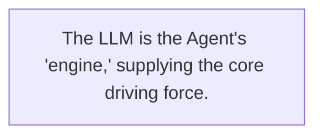
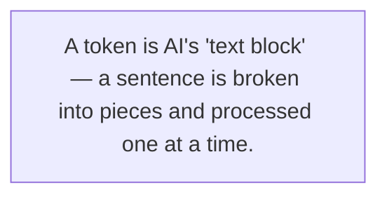
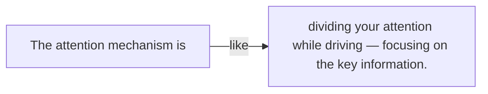
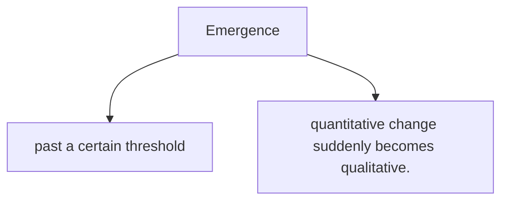
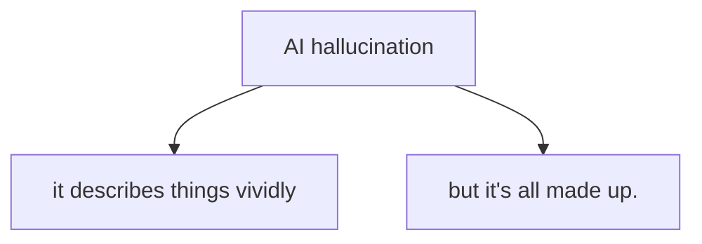
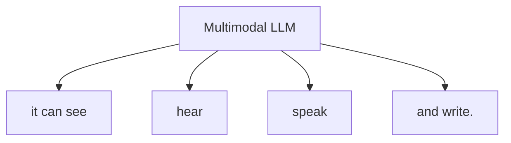
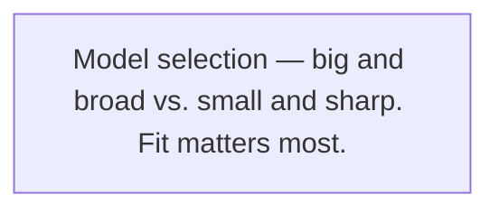

# Chapter 5

# The Agent's Engine

← Ch.4: The Harness Era  Ch.6: Memory Systems →

## In This Chapter

- 01 What Is an LLM? — the Agent's "Engine"
- 02 How Does an LLM Actually "Think"?
- 03 Where Does Reasoning Come From?
- 04 Where Are the Model's Limits?
- 05 Multimodality: When AI Does More Than Talk
- 06 Model Selection: "Big and Broad" or "Small and Sharp"?

One weekend afternoon, Xiaoming sat in the café downstairs from the office, turning a model car in his hands. It was the latest self-driving model, with a hood you could open to reveal a tiny, finely detailed engine.

"Lost in thought?" Lao Wang walked over with two coffees and sat down across from him.

Xiaoming looked up, eyes bright with curiosity. "Bro Wang, I keep coming back to one question. We've talked about the Agent's sensors, its perception system — the eyes and ears, like a car's. So what's the Agent's 'brain'? How does it think?"

Lao Wang smiled and slid the coffee toward him. "Good question. What are you holding?"

"A model car," Xiaoming held it up.

"And what's the most important part of a car?"

"The engine!" Xiaoming blurted out, then his eyes lit up. "Wait... you mean the LLM is the Agent's engine?"

Lao Wang nodded. "Exactly. And not just the engine — it's the whole car's 'brain.' Today let's dig into how this 'brain' actually works."

## 1. What Is an LLM? — the Agent's "Engine"

Lao Wang took the model, lifted the hood, and pointed at the little engine inside. "Look — whether a car runs fast, climbs hills, or hauls cargo comes down to this engine. Same with an Agent. Every intelligent thing it does is driven by one core component: the large language model, the LLM."

> Figure 5-1: The LLM is the Agent's "engine," supplying the core driving force.

### From GPT-3 to GPT-4 to Claude: what's actually evolving

"I keep hearing names like GPT-3, GPT-4, Claude," Xiaoming scratched his head. "What's the difference, really? Is it like an engine going from V6 to V8 to V12?"

"Nice analogy," Lao Wang nodded approvingly. "Let's trace the evolution."

**Lao Wang:** In 2020, GPT-3 appeared out of nowhere with 175 billion parameters. Everyone was stunned — an AI could write this fluently! But back then it was more of a "humanities student": fine at essays, hopeless at math.

**Xiaoming:** 175 billion? Just saying the number is scary...

**Lao Wang:** By 2023 GPT-4 arrived, with even more parameters and a broad jump in capability. It could write, solve problems, code, and understand images. Like going from natural aspiration to turbocharging — the power jumped more than one notch.

**Xiaoming:** What about Claude?

**Lao Wang:** Claude comes from a different company. Its standout trait is memory — it handles very long text in one go. Think of it like engines: some are built for acceleration, some for range. Each has its strengths.

Xiaoming was hooked. "So the models keep evolving, like engine tech keeps improving?"

"Right," Lao Wang said. "And far faster than you'd expect. The auto industry took over a hundred years to go from single-cylinder to multi-cylinder, from gasoline to hybrid to electric. The LLM? The Transformer architecture only appeared in 2017 — less than a decade ago — and it's already been through countless generations."

### What are parameters? Why do more parameters mean "smarter"

"Bro Wang, you keep saying 'parameters.' What exactly are they?" Xiaoming frowned. "And why does more of them make a model better?"

Lao Wang thought for a moment, pointing at the engine. "Look at this engine — lots of parts, right? Cylinders, pistons, crankshaft, valves... The more parts, the more complex the structure, the more power it can put out. Parameters are the LLM's 'parts.'"

"Parts?" Xiaoming still wasn't sure.

"Here's a simpler one," Lao Wang switched analogies. "Back in school, the more vocab you memorized, the more you could express. Parameters are a bit like the 'connection points' of knowledge in the AI's head. More parameters, more patterns and associations it can hold."

****Xiaoming's notes: what are parameters?****

Parameters = the "neuron connections" of an AI model
More parameters → the model learns and remembers more patterns → appears "smarter"
But more parameters → needs more compute → higher cost (like a big engine burns more fuel)

"Here's an example," Lao Wang went on. "A tiny model with a few million parameters might only handle simple Q&A, like a basic chatbot. But a model with hundreds of billions of parameters can write poetry, code, analyze data, even pass the bar exam."

"So more parameters is always better?" Xiaoming pressed.

Lao Wang shook his head, meaningfully. "Think of buying a car. Would you say bigger displacement is always better?"

Xiaoming thought. "Not really... A big engine has more power, but burns more fuel and costs more to maintain, and you never use that much power driving around the city."

"A bigger model is stronger, but costs more. Like engine displacement — bigger isn't always better. Fit matters most."

— Lao Wang

"You've got it exactly!" Lao Wang slapped the table. "Same with LLMs. More parameters means higher training and running costs. A hundred-billion-parameter model might burn a thousand times the compute of a million-parameter one every time it answers you. So picking the model size for an Agent is a real craft."

Xiaoming nodded thoughtfully. "Got it — like buying a car, the best one is the one that fits you. A small hatchback for errands, a big 4x4 for hauling."

"Teachable," Lao Wang laughed. "But don't treat parameters as magic, either. They're not sorcery, just numbers. What's amazing is how those numbers are organized to work."

## 2. How Does an LLM Actually "Think"?

By now Xiaoming's curiosity was fully lit. He leaned in. "Bro Wang, the thing I most want to know — how does an LLM actually 'think'? I ask a question, it rattles off a whole paragraph. What's going on inside?"

Lao Wang smiled mysteriously. "You might not believe it, but the LLM's 'thinking' is simple and not simple. Let's start with the simplest part."

### Token: AI's "text blocks"

"First, you need to know: AI doesn't recognize human writing."

"Huh? It can't read? Then how does it answer?" Xiaoming was lost.

"It doesn't recognize characters — it recognizes tokens. Think of a token as AI's 'text block.'" Lao Wang picked up a biscuit from the table and broke it into pieces. "Like this — a sentence gets split into chunks, and each chunk is a token."

> Figure 5-2: A token is AI's "text block" — a sentence is broken into pieces and processed one at a time.

"For instance," Lao Wang gave an example, "'I love Tiananmen Square in Beijing' might be split into four tokens: 'I,' 'love,' 'Beijing,' 'Tiananmen.' Each token maps to a number, and that's how AI 'understands' text."

Xiaoming lit up. "Oh! Like the building blocks we played with as kids — each block is a character or a word, and AI stacks them into sentences?"

"Something like that," Lao Wang nodded. "Though a bit more advanced. In English, a token might be half a word or a whole word. In Chinese, usually one or two characters. GPT-4 understands about 100,000 different tokens — like having 100,000 differently shaped blocks."

"100,000..." Xiaoming whistled. "How many things can it build with those?"

"Practically infinite," Lao Wang said. "But the real question is — how does it know which block comes next? That's the core technology."

### Transformer: attention is "what to focus on"

Xiaoming perked up. He knew the main event was coming.

"In 2017, Google published a paper called *Attention Is All You Need*," Lao Wang's tone turned solemn. "Translated: 'attention is all you need.' That paper proposed the Transformer architecture — you could call it the ancestor of every LLM today."

"Attention mechanism?" Xiaoming repeated. "Sounds abstract."

> Figure 5-3: The attention mechanism is like dividing your attention while driving — focusing on the key information.

"Let's use driving again," Lao Wang said. "Your eyes are on the road, but your attention isn't spread evenly, right? You focus more on the car ahead's brake lights, the car in the next lane, the traffic signs by the road. That's attention — putting limited energy on the most important information."

Xiaoming pictured his own driving and nodded. "Yeah, I do watch the front and the mirrors, not stare at the dashboard."

"The LLM's attention works the same," Lao Wang said. "When it sees a sentence, it assigns each word a different 'attention weight.' Take this sentence —

*Xiaoming parked his car in the garage because ____.*

"When the AI fills the blank, it focuses more on 'car,' 'park,' 'garage' — they're most tied to the blank. Words like 'Xiaoming,' 'his,' 'because' get lower weight."

"Makes sense..." Xiaoming stroked his chin.

**Lao Wang:** Better yet, an LLM has many layers of "attention heads," each focusing on something different. Some watch grammar, some semantics, some logic. Like driving — eyes on the road, ears on the nav, hands on the wheel, all at once.

**Xiaoming:** So... the Transformer is the tech that teaches AI "what to focus on"?

**Lao Wang:** Exactly! And it's "self-attention" — it finds relationships within the sentence itself. Like reading an article, you connect the context automatically instead of looking at each character in isolation.

### Predicting the next word: sounds simple, so why is it so powerful?

"Now you know tokens and attention," Lao Wang took a breath. "Next I'll tell you the LLM's most essential secret — it really only does one thing."

"What?" Xiaoming held his breath.

"At its core, an LLM is a supremely good 'conversation continuer' — except it's so good at it that people think it's thinking."

— Lao Wang's golden line

"'Conver... continuation'?" Xiaoming nearly spat his coffee. "That's it?"

"That's it," Lao Wang nodded seriously. "You give it a sentence, it predicts the next word. Then it adds that word in and predicts the next... One word at a time, until it piles up into a paragraph."

Xiaoming looked unconvinced. "No way. Just predicting the next word, and it's this capable? Then how does it do math? Write code? How does it..."

"Don't rush," Lao Wang waved him off. "Tell me, do you think 'continuing a conversation' is simple?"

"Not really..." Xiaoming thought. "If I say 'the weather today is,' I just add 'nice,' right?"

"Then how about this?" Lao Wang grinned slyly. "'Prove Fermat's Last Theorem, requiring ____.'"

Xiaoming choked.

"See, continuing is easy, but continuing correctly, continuing well, at a high level — that's hard," Lao Wang said. "When the LLM trained, it read almost all of humanity's books, articles, web pages, code. It learned, in every context, what word most likely comes next. When that prediction ability hits its peak, it looks like 'thinking.'"

Xiaoming was still fuzzy. "You mean it doesn't really understand — it just... guesses really well?"

"That's a philosophical question," Lao Wang shrugged. "What does 'really understand' even mean? How do you prove the me sitting next to you is actually thinking, and not just a very good conversation-continuer?"

Xiaoming opened his mouth, and found he couldn't answer.

"Okay, enough teasing," Lao Wang laughed. "Simply put, by predicting the next word, the LLM indirectly learns the patterns, knowledge, logic, even reasoning behind language. Like knowing three hundred Tang poems by heart — even if you can't write one, you can recite. But the LLM didn't read three hundred; it read three million, thirty million, three hundred million."

Xiaoming fell silent, then sighed. "So that's it... Sounds simple, but take something simple to the extreme and it becomes a miracle."

## 3. Where Does Reasoning Come From?

"Bro Wang," Xiaoming had another question. "If the LLM just predicts the next word, where does its reasoning come from? Solving math, analyzing complex problems — that's more than just continuing a chat."

"Good question," Lao Wang nodded approvingly. "It's one of the most magical things about LLMs — some abilities weren't taught by humans. They 'grew' on their own."

### Emergence: more parameters, and suddenly it can

"Grew on their own?" Xiaoming's eyes widened. "What do you mean?"

"It's called 'emergence' — Emergent Abilities. Simply put: when a model's parameters and training data pass a certain scale, it suddenly gains abilities that smaller models don't have. Like water hitting 100°C and suddenly becoming steam — quantitative change triggers qualitative change."

> Figure 5-4: Emergence — past a certain threshold, quantitative change suddenly becomes qualitative.

"For example," Lao Wang went on, "someone tested models of different sizes on 'add three numbers.' A small model scored about as well as a random guess. Below a certain parameter threshold, accuracy stayed low; but once you cross it, accuracy suddenly shoots up."

"Like a lightbulb switching on?" Xiaoming said.

"Exactly — that 'click' feeling," Lao Wang said. "And it's not just math. Many abilities emerge this way — translation, reasoning, writing, coding. The researchers didn't expect it; they just made the model bigger, and suddenly: wow, it can do this too?"

Xiaoming was captivated. "That's incredible... Like evolution — simple rules repeated endlessly, and complex life emerges."

"Nice analogy," Lao Wang said. "But emergence has its problems too. You don't know when it'll emerge with what ability, or whether the ability it does emerge with is reliable. That's why an LLM can seem like a genius one moment and an idiot the next."

### Chain of Thought (CoT): let the AI think step by step

"Beyond emergence, humans invented methods to spark the LLM's reasoning," Lao Wang said. "The most famous is 'Chain of Thought,' or CoT."

"Chain of thought?" Xiaoming repeated. "Sounds mystical."

"Not at all," Lao Wang laughed. "It just makes the AI spell out its reasoning. Here's an example —

*Direct ask: Xiaoming has 5 apples. He gives 2 to Xiaohong, then buys 3 more. How many apples does Xiaoming have now?*

*Direct answer: 6. (sometimes wrong)*

*CoT ask: Xiaoming has 5 apples. He gives 2 to Xiaohong, then buys 3 more. Think step by step about how many apples Xiaoming has now.*

*CoT answer: Xiaoming starts with 5 apples. After giving 2 to Xiaohong, 5−2=3. Then buying 3 more, 3+3=6. So the answer is 6. (accuracy much higher)*

"Why does that work?" Xiaoming was puzzled. "The answer's 6 either way. Why does making it think step by step raise accuracy?"

"Because the LLM predicts the next word," Lao Wang explained. "If you demand the answer directly, it has to jump from 'buys 3 more' straight to '6' — a gap, and prediction slips. But step by step, each step is tiny, so its next-word prediction is far more accurate."

**Xiaoming:** Oh! I get it! Like math homework — if you make the top student do a complex problem in his head, he might slip; but if you have him write it out on scratch paper, accuracy jumps.

**Lao Wang:** That's the idea! Chain of Thought is the LLM's "scratch paper." It writes out the intermediate steps; each step builds on what came before, so it's naturally more accurate.

**Xiaoming:** That trick is too good! From now on I'll tell the AI to "think step by step" every time.

**Lao Wang:** Haha, you can go further. There's "Tree of Thoughts" — let the AI explore several paths, then pick the best. And "Graph of Thoughts," even more complex. But for Agents, Chain of Thought is the most common and best value-for-money method. (Chain of Thought is no magic — it's a paper-backed engineering method: Wei et al. systematized it as Chain-of-Thought Prompting in 2022 [8], showing that "letting the model think step by step" reliably lifts accuracy.)

### Planning: from "say whatever comes to mind" to "think then act"

"Speaking of Agents," Xiaoming changed tack. "The LLM itself just says whatever comes up, but an Agent needs to *do* things. How does it go from 'continuing a chat' to 'making a plan'?"

"That's the essence of Agent tech," Lao Wang said. "The LLM alone really is just a chatterbox, but humans wrapped it in frameworks that turn 'say whatever' into 'think then act.'"

"What kind of frameworks?"

"Even the simplest — make it output in a fixed format," Lao Wang said. "You tell it: 'To complete a task, first analyze the goal, second list the plan, third execute, fourth check the result.' It follows that format."

Xiaoming's eyes lit up. "Like design patterns in coding? Give it a template, it fills in the content?"

"Sort of," Lao Wang said. "A more advanced version lets the LLM plan on its own. Take the ReAct framework — the model first thinks (Thought), then decides an action (Action), then observes the result (Observation), then thinks again, acts again... looping until the task is done."

Xiaoming thought. "Isn't that... how humans do things? Think about what to do, then do it, check the result, adjust, do the next step."

"Exactly!" Lao Wang said. "The core of an Agent is wrapping the LLM — this 'brain that only talks' — in a 'doing process.' So it can not just talk, but plan, execute, reflect."

Xiaoming sighed. "So that's it... I used to think an Agent was just calling the LLM's API. I didn't know there was so much depth."

"Calling the API is just the first step," Lao Wang said meaningfully. "Getting the LLM to pull its weight — that's the real craft. But — don't romanticize the LLM either. It's not omnipotent. It has plenty of limits."

## 4. Where Are the Model's Limits?

Lao Wang's words surprised Xiaoming. "Limits? There are things the LLM can't handle?"

"Of course — quite a few," Lao Wang said. "Even the best engine has its limits. You can't expect a car to fly, right? The LLM has its 'ceiling' too."

### Hallucination: why AI "lies with a straight face"

"First limit, and the most famous — hallucination. Simply: the AI lies with a straight face."

> Figure 5-5: AI hallucination — it describes things vividly, but it's all made up.

"I've hit this!" Xiaoming said eagerly. "Last time I asked the AI for an API's parameters. It described them so convincingly, but when I checked the official docs, that parameter didn't exist! I thought I'd remembered wrong..."

"That's hallucination," Lao Wang said. "The AI isn't 'lying' — lying means knowing the truth but saying falsehood on purpose. The AI genuinely 'thinks' it's right — or rather, it has no idea what's true or false."

"AI hallucination isn't 'lying.' It just continues the conversation too smoothly — so smoothly it invents things that don't exist."

— Lao Wang

"Why does this happen?" Xiaoming asked.

"Because its nature is predicting the next word,"

 Lao Wang said. "It doesn't care if a sentence is true, only if it 'sounds true.' If the context says a certain answer should follow, it follows without hesitation — even if the answer is fabricated."

Lao Wang gave an example: "Ask it 'Who wrote *Dream of the Red Chamber*?' and it says 'Cao Xueqin,' because that sentence appears countless times in training. But ask 'In chapter 120, who did Jia Baoyu meet in Suzhou' — it might start inventing, because it doesn't recall that fine a detail, but it *must* continue, so it just makes something up."

****Xiaoming's pitfall log: common hallucination scenarios****

1. Citing papers, books, or APIs that don't exist
2. Inventing names, places, events
3. Wrong calculations stated with total confidence
4. Wrong code explained with perfect logic

**Avoidance guide**: always verify key information, especially code, data, and facts.

### Knowledge cutoff: it doesn't know what happened after training

"Second limit — knowledge cutoff," Lao Wang continued. "An LLM's knowledge has an expiration date. It only knows what's in its training data. Anything after training ends, it doesn't know."

"Oh right!" Xiaoming smacked his forehead. "Last time I asked GPT-4 about recent movies, it said its knowledge cuts off at October 2023 and it didn't know anything after. I was confused..."

"Exactly," Lao Wang said. "The LLM is like a straight-A student frozen in time. It learned everything up to a certain point, but the world after that point is dark to it."

"So how do we fix it?" Xiaoming asked. "An Agent has to handle real-time things."

"That's why the Agent needs other abilities," Lao Wang laughed. "Like web search — let the Agent look up the latest info itself. Or tool calls — let it query databases, call APIs. The LLM does the 'thinking,' the tools do the 'fetching the latest,' and together it works."

### Math and logic: the LLM's "uneven strengths"

"Third limit — uneven strengths," Lao Wang said. "The LLM knows a little of everything, but some subjects it just can't master. Complex math, rigorous logic, precise debugging..."

"Math is weak?" Xiaoming was surprised. "But I've seen online that AI is great at math problems."

"Simple ones are fine; complex ones fail," Lao Wang said. "Especially multi-step exact calculations — the LLM easily slips on one intermediate step. And it can't catch the error, because it doesn't 'double-check.'"

Lao Wang paused. "Same with logic. Simple syllogisms are fine, but a very long logic chain and it drifts. That's why you can't fully rely on an LLM for important decisions — it might err on some critical logic step."

### Why "a bigger model" can't solve everything

"Then... can't we just make the model bigger?" Xiaoming asked. "More parameters, more power — wouldn't that solve these?"

Lao Wang shook his head. "Not so simple. First, bigger isn't always better —

**Cost**: training a hundred-billion-parameter model might cost tens of millions, even hundreds of millions. Not everyone can afford it.

**Diminishing returns**: double the parameters, and capability doesn't double. The higher you go, the harder gains get, the bigger the cost.

**Some problems aren't solved by stacking parameters**: hallucination, for instance. A bigger model still hallucinates. It's not a knowledge-volume problem, it's a mechanism problem.

**Inference speed**: bigger model, slower answers. You can't make users wait thirty seconds for one reply.

"So the industry consensus now," Lao Wang summed up, "is you can't solve everything with 'a bigger model.' You need 'better methods' — teach the Agent to use tools, to retrieve, to reflect, to plan. Like people: being smart isn't enough; you also need method, tools, experience."

Xiaoming nodded. "Got it. Like driving — a big engine isn't enough. You need a good transmission, good suspension, good brakes, and a driver who can actually drive."

"Precise!" Lao Wang gave a thumbs-up.

## 5. Multimodality: When AI Does More Than Talk

Mid-conversation, Xiaomei walked over with a milk tea. "What are you two so fired up about?"

"Talking LLMs," Xiaoming said. "Bro Wang says the LLM is the Agent's brain, but it only 'continues conversations.'"

Xiaomei snorted. "Conversation-continuing? Great metaphor. But today's AI does more than talk — it sees images, hears sound, even generates video."

"Right!" Lao Wang took over. "This is what we'll cover next — multimodality."

### From plain text to text and images

"What is multimodality?" Xiaoming asked.

"A 'modality' is a form of information," Lao Wang explained. "Text is one modality, images another, audio another, video yet another. Early LLMs handled only text, so they were 'single-modal.' Today's models handle several at once, so they're 'multimodal.'"

> Figure 5-6: Multimodal LLM — it can see, hear, speak, and write.

**Xiaomei:** Let me give an example. Last time I was doing a product prototype, I snapped a photo of a hand-drawn sketch and sent it straight to the AI. It actually understood what I'd drawn, and even wrote up the requirements doc for me!

**Xiaoming:** That good? How does it read an image?

**Lao Wang:** The principle is close to processing text. The image is cut into small patches; each patch becomes a "visual token," then the same Transformer architecture processes it. Like "translating" the image into a language the AI understands.

"Like a car evolving from only seeing the road, to reading road signs, hearing nav, recognizing pedestrians?" Xiaoming fell back on his old analogy.

"Spot on," Lao Wang said. "A car with only a camera just sees things. But add radar, lidar, a microphone, and it gathers far more — and drives safer. Multimodal AI is the same — see, hear, speak, and it's simply stronger."

### Visual understanding: what "seeing" means for AI

"AI seeing images matters far more than you'd guess," Xiaomei said seriously. "Before, AI only handled text, so what it could do was limited. Once it sees, the possibilities explode."

Xiaomei counted on her fingers:

**Product design**: snap a sketch, and AI generates a full design and requirements doc.

**Coding**: screenshot an interface, and AI writes the corresponding HTML/CSS.

**Data analysis**: hand it a chart, and it analyzes trends and anomalies.

**Troubleshooting**: screenshot an error, and it pinpoints the cause.

**Content creation**: generate copy, stories, poetry from images.

"And that's just images," Lao Wang added. "Add audio? AI understands speech, catches accents, even reads emotion. Add video? AI watches the content, understands what happened."

### What it means for Agents: see, hear, speak, act

"So what does multimodality concretely mean for Agents?" Xiaoming asked.

"It means the Agent went from 'blind' to 'normal,'" Lao Wang said. "Think — if an Agent only handles text, how does it operate your computer? How does it organize your photos? How does it edit your videos?"

Xiaoming thought. "True... if it can't see the screen, how does it know where to click?"

"Exactly," Lao Wang said. "Multimodality is the key step that brings Agents into the real world. The Agents that operate computers, build your slides, process images — they're all backed by multimodal LLMs."

Xiaomei added, "And the user experience changes completely. Before you could only type to the AI. Now you send images, stickers, voice — as natural as talking to a person. For a product, that's a huge experience lift."

Xiaoming sighed. "I used to think an Agent was just a chatbot. Now... its potential is way bigger than I thought."

"You haven't seen anything yet," Lao Wang laughed. "When models handle more modalities — sensing temperature, touch, smell — Agents will do even more. But that's further out."

## 6. Model Selection: "Big and Broad" or "Small and Sharp"?

Here Xiaoming thought of a practical question. "Bro Wang, sis Xiaomei — for our company's Agent, what model should we use? There are so many on the market, it's dizzying."

Lao Wang and Xiaomei exchanged a look and laughed.

"Good question," Lao Wang said. "Model selection is the Agent's first fork in the road. Pick right and you get double the result for half the effort; pick wrong and it's the reverse. Let's talk about how to choose."

> Figure 5-7: Model selection — big and broad vs. small and sharp. Fit matters most.

### Closed-source vs open-source

"First consideration: closed-source or open-source," Lao Wang said.

"What's closed-source? What's open-source?" Xiaoming asked.

"A closed-source model keeps its parameters and code private; you only call it through an API," Lao Wang explained. "Like GPT-4, Claude, ERNIE. Like buying a finished car — the factory built it, you just drive, but you can't take it apart and modify it."

"Open-source?" Xiaoming was naturally drawn to it.

"An open-source model publishes its parameters and code; you download, deploy, fine-tune, and modify it yourself," Lao Wang said. "Like Llama, Qwen, Mistral. Like buying a pile of car parts — assemble, modify, play however you want."

| Dimension | Closed-source | Open-source |
|-|-|-|
| How to use | Call an API | Self-host |
| Capability ceiling | High (top models are strong) | Medium (catching up fast) |
| Cost | Pay per call | Server + ops cost |
| Data privacy | Data goes to a third party | Data stays on your network |
| Customization | Limited (fine-tuning only) | Fully free |
| Ease of start | Easy — sign up and use | Complex — needs technical skill |

"So which should we pick?" Xiaoming asked.

"Depends," Lao Wang said. "If your team is small and you want to validate fast, use closed-source — simple and easy. If you have data-privacy needs, or volume so high the API bill hurts, consider open-source. Many companies mix: open-source for core scenarios, closed-source for the edges."

### General-purpose vs vertical models

"Second dimension: general-purpose or vertical," Xiaomei took over. "A general-purpose model knows a bit of everything, can chat about anything. A vertical model is trained for one domain — law, medicine, finance, code."

"Like the difference between a general car and a specialized vehicle?" Xiaoming said. "An SUV handles any road, but an off-roader off-roads better, a truck hauls more."

"Exactly," Xiaomei nodded. "A general model's strength is flexibility — it does any task. But in a specific domain it may lag a purpose-trained vertical model. Build a legal Agent, and a legal vertical model may beat the general one by a lot."

"So where do vertical models come from?" Xiaoming asked.

"Usually you keep training a general model on domain data," Lao Wang explained. "That's 'fine-tuning.' Like buying a plain car, then modifying it into a race car, or an RV, or an ambulance. Same base, more specialized purpose."

### Xiaoming's lesson: not bigger is better, fit matters most

"After all this," Lao Wang patted Xiaoming's shoulder, "what do you think matters most in picking a model?"

Xiaoming thought, then said seriously, "I think... not bigger, not pricier — fit matters most. Like buying a car: for a city commute, a small EV is enough; no need for a big off-roader. But for a construction site, hauling cargo, the little EV won't cut it."

"Choosing a model for an Agent is like picking an engine for a car. Bigger displacement isn't always better — fit matters most."

— Xiaoming's takeaway

"Well said!" Lao Wang and Xiaomei said in unison.

Lao Wang added, "When you actually choose, weigh these dimensions —

**Task complexity**: the more complex, the bigger the model. Simple classification or summarization — a small model is enough.

**Response speed**: speed-critical scenarios want a small model; no rush, a big one is fine.

**Cost budget**: big models are pricey, small ones cheap. Do the math so the month-end bill doesn't hurt.

**Data privacy**: can sensitive data leave the company? If not, consider self-hosted open-source.

**Customization needs**: do you need deep optimization for your business? If so, open-source + fine-tuning is more flexible.

Xiaomei added the product view: "One more thing matters — user experience. Sometimes a slightly weaker model, but fast and stable, gives a better experience. Users don't care what model you use; they care whether it's good and fast."

Xiaoming nodded, committing it all to memory. He remembered when he first learned frontend, he always chased the newest tech and flashiest effects, and ended up over-complicating projects. Later he learned fit matters most. Model selection is probably the same lesson.

## Suspense for This Chapter

The sun was setting, and the café thinned out. Xiaoming looked out the window, feeling he'd learned a lot today — from parameters to tokens, from attention to Chain of Thought, from hallucination to multimodality, he had a whole new picture of the LLM, this "brain."

Xiaoming nodded, sipped his now-cold coffee. "So that's how the LLM works. With a smart brain, the Agent can remember things now, right? Last time I talked to a chatbot for a while, and a bit later it forgot everything we'd said..."

Lao Wang smiled mysteriously and pointed at his own head. "You think everything you remember is stored in the brain? Wrong. Humans have a hippocampus; the Agent has its 'memory system' too. And its memory might be... far worse than you imagine."

Xiaoming's eyes went wide. "Far worse? What do you mean?"

Lao Wang stood, patted Xiaoming's shoulder. "Want to know? Next chapter we talk about the Agent's memory system — why AI is 'forgetful,' and how humans fix it."

**Next chapter preview: Memory System — why is the Agent "forgetful"?**

← Ch.4: The Harness Era  Ch.6: Memory Systems →
