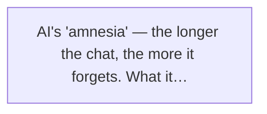
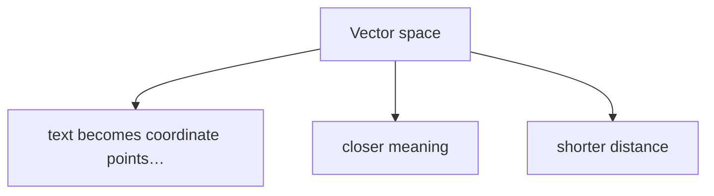
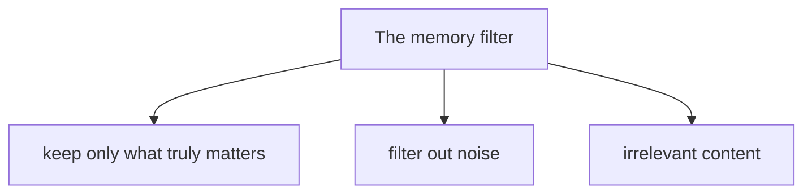
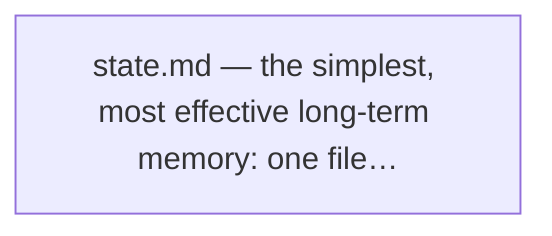
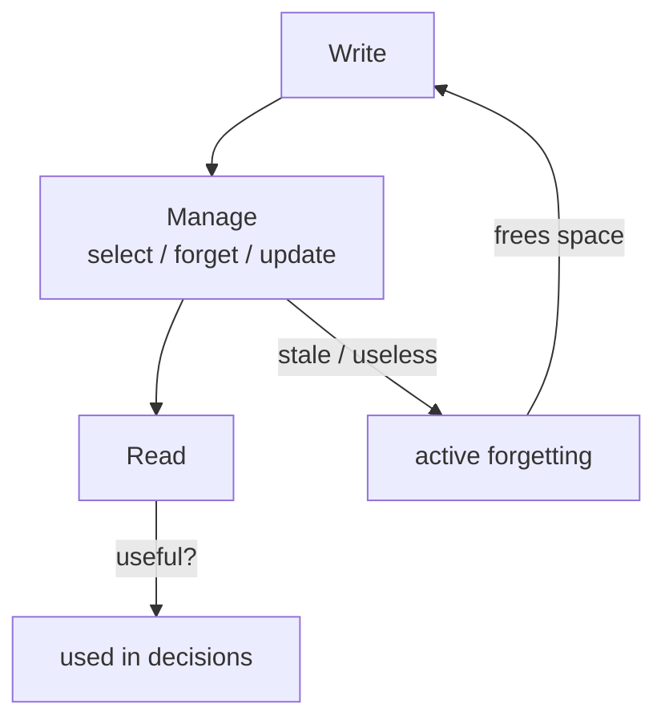

# Chapter 6

# The Agent's "Hippocampus" — Memory & RAG

If the brain is the Agent's driver, then memory is the driver's hippocampus. An Agent with no memory is like someone who wakes up with amnesia every day — looks smart, but every meeting feels like the first.

In this chapter we look at one of the Agent world's most central components — the memory system.

You might say: "What's there to talk about? Memory is just saving a chat log, right?"

Well, not really. The AI's memory system is far more complex than you'd think. It covers short-term memory, long-term memory, retrieval augmentation, vector databases, memory layering, memory engineering... behind every term sits a whole technical stack.

No rush — same rule as always. We start with Xiaoming's story.

## 6.1 Does AI "Lose Its Memory" Too? — The Pain of Memory

### Xiaoming's breaking point

Since studying Agent tech under Lao Wang, Xiaoming has improved fast. He understands the seven core components, and he built his own little project — a personal assistant Agent that writes code and looks up docs for him.

But recently Xiaoming hit something that broke him.

That afternoon, Xiaoming was debugging a frontend component. He said to his AI assistant:

**Xiaoming**

Help me look at this login form component. I want to add an email-validation feature — when the user finishes typing an email, check the format in real time.

**AI Assistant**

Sure, I'll implement it. First, we add an `onBlur` event to the form component, triggered when the user leaves the email field to run the validation...

The AI assistant rattled off a pile of code, and Xiaoming was happy with it. Then he asked:

**Xiaoming**

Right, the password also needs a strength check — at least 8 characters, with upper- and lower-case letters and a number.

**AI Assistant**

No problem, I can do the password-strength check with a regular expression...

Back and forth, they went about twenty-odd rounds. From form validation to error messages, from error messages to loading states, from loading states to accessibility... deeper and finer with every turn.

Then Xiaoming suddenly thought of a question:

**Xiaoming**

Wait, for that email validation we started with — did you use `onBlur` or `onChange`?

**AI Assistant**

Sorry, I'm not sure which email validation you mean. Could you give me more context?

Xiaoming froze.

"What do you mean 'which email validation'? The one we started with! Twenty minutes ago!"

He scrolled up through the chat history. While scrolling, he found something more terrifying — the AI had not only forgotten which event the original email validation used, it had nearly forgotten **they were even building a login form**.

The later replies went off the rails entirely. Xiaoming said "make the submit button blue," and the AI handed him code for a shopping-cart checkout button. Xiaoming said "we're building a login form," and the AI said "sure, let's create a login form" — as if those twenty-odd rounds had never happened.


> Figure: AI's "amnesia" — the longer the chat, the more it forgets. What it said a second ago is gone the next


Xiaoming was completely done. He ran to Lao Wang's desk, looking devastated:

**Xiaoming**

Bro Wang, is my AI getting dementia? By the end of the chat it forgot everything from the start! I talked to it for twenty-odd rounds about a login form, and it finally asked me "what form are you building"?!

**Lao Wang**

*(sips his tea)* Perfectly normal. What you hit is the most classic problem in the Agent world — **context window overflow**.

### Context window: how long is AI's "short-term memory"

Lao Wang put down his cup and started teaching.

"You know, a large language model has a key parameter called the **context window**. Simply put, it's how much text the AI can 'see' at once."

Xiaoming scratched his head. "Like... a person's short-term memory capacity?"

"Close enough," Lao Wang nodded. "Picture it as the car's windshield — the bigger the glass, the more road the driver sees. Too small, and you only see what's right in front. Big, and you see farther and wider."

Lao Wang gave Xiaoming a few examples:

- The earliest GPT-3 had a context window of only 2048 tokens (about 1500 Chinese characters) — like peeking at the road through a crack in the door
- GPT-3.5 expanded the window to 4K, later 16K — finally a real car window
- GPT-4 supported 8K and 32K — the windshield grew, the view opened up
- Claude started at 100K, then pushed to 200K — a panoramic sunroof, nothing hidden
- Some models now support 1M or even larger contexts — a 360-degree panoramic view

🔬 **Insider view**

What is a token? It's the basic unit an LLM uses to process text. One token is roughly 0.75 English words, or 1–2 Chinese characters. So 100K tokens is about 70,000–80,000 characters — roughly the length of a medium-length novel.

"Sounds like the window keeps growing," Xiaoming said. "Then why does my AI still forget?"

Lao Wang laughed. "Good question. The context window is growing, but you've ignored two problems."

#### Problem one: even a big window is finite

Even a 1M context window isn't infinite. Chat long enough and the history will fill it. Once you go past the window, the earliest content gets "squeezed out" — the AI can no longer see it.

It's like driving forward: roadside scenery keeps sliding off the top edge of the windshield — not because the scenery vanished, but because you drove past it and can't see it anymore.

#### Problem two: seeing far ≠ seeing clearly

This is the more critical point. Many people assume a bigger context window is always better, but in fact, **the bigger the window, the more the AI's attention to the middle content drops**.

Academics named this "**Lost in the Middle**." It means the AI remembers the start and end of the context fairly well, but easily "zones out" on the middle.

The context window is like the cheat sheet handed out in an exam —
the more you cram onto it, the harder it is to find the key points.

Xiaoming nodded along. "Yes! I've felt exactly that! Sometimes I dump a whole document into the AI and ask about one detail — it either can't find it or makes up an answer. So longer documents aren't automatically better."

"Of course not," Lao Wang said. "A good memory system isn't about remembering more, it's about **never forgetting what should stick, and not wasting space on what should go**. That's where memory-system design comes in."

****Golden line of this section****

"An Agent with no memory looks smart, but every time it's like rebooting with amnesia."

## 6.2 Two Types of Memory: Short-Term vs Long-Term

Lao Wang went on: "To understand the Agent's memory system, you first separate two kinds of memory — **short-term memory** and **long-term memory**."

### Short-term memory: the world inside the windshield

"What is short-term memory? It's everything in the current conversation. What you say, what the AI says, the documents you upload, the results from tool calls... all of it sits in the context window, visible to the AI at any moment."

Lao Wang returned to his favorite car analogy:

"Short-term memory is like the live road conditions you see through the windshield while driving. What color is the car ahead, is there a car in the next lane, are there traffic signs by the road — you see all of it clearly, because it's right in front of you."

"But," Lao Wang turned, "what's in the windshield changes in real time. Once you drive past, that tree, that pedestrian, that shop disappear from view. You don't keep staring at them — you watch the road ahead."

Short-term memory works the same. Its traits:

- **Fast** — it's right in the context, the AI uses it directly, no extra lookup
- **Small capacity** — limited by the context window, can't hold that much
- **Time-sensitive** — only relevant to the current task, gone once the task ends
- **Gets overwritten** — new content pushes the old out

### Long-term memory: the world inside the navigation map

"So what about long-term memory?" Xiaoming asked impatiently.

"Long-term memory is different," Lao Wang said. "It isn't stored in the context window — it's stored **outside**, in a database, a file system, a knowledge base. When needed, the AI can 'look it up,' pull the relevant info out, and drop it into the context window to use."

He kept with the car comparison:

"Long-term memory is like your navigation map. The map holds every road, building, and place in the country. While driving, you can't print the whole map into your head — and you don't need to. You just need to know where you're going, and the nav tells you the route."

"Say you're driving from Beijing to Shanghai. The map holds thousands of highways and millions of places, but the nav only marks the few roads you need. The rest you don't use, so you don't look at it."


> Figure: The memory system is like the Agent's "hippocampus": short-term memory is the windshield, long-term memory is the navigation map


Long-term memory's traits are the opposite of short-term:

- **Large capacity** — can hold hundreds of thousands, even millions of documents
- **Durable** — doesn't vanish when a conversation ends, persists across sessions
- **Needs retrieval** — can't be used directly, you find the relevant content first
- **Accumulates** — the longer you use it, the more memory, the stronger it gets

### One table to see both kinds of memory

| Dimension | Short-term (Context) | Long-term (Memory) |
|-|-|-|
| Storage location | Context window | External DB / knowledge base |
| Capacity | Small (thousands to millions of tokens) | Large (near-unlimited) |
| Access speed | Very fast (ready to use) | Fast (needs retrieval) |
| Retention | Session-level, gone when over | Persisted, survives sessions |
| Car analogy | Live road in the windshield | Road data in the nav map |
| Human analogy | Working memory / short-term | Long-term memory / knowledge base |
| Typical tech | Prompt stitching, context management | RAG, vector DB, knowledge base |

****In one line****

Short-term memory is "what you can see right now"; long-term memory is "what you know and can look up when needed." Together they make the complete memory system.

Xiaoming's eyes lit up. "I get it! So how does long-term memory actually work? How does the AI find what it needs from a huge pile of material?"

Lao Wang smiled faintly. "Good question. This brings us to the headline of the chapter — **RAG**."

## 6.3 What Is RAG? — Giving AI a "Library"

"RAG, three letters: Retrieval, Augmented, Generation."

Lao Wang wrote the three words on the whiteboard as he spoke.


> Figure: The RAG workflow: Query → Retrieve → Augment → Generate — look up first, then answer


### Understanding RAG with an "open-book exam"

"Let me give you an analogy and you'll get it," Lao Wang said. "Back in school, did you ever take an 'open-book exam'?"

"Yeah!" Xiaoming said at once. "Open-book exams are the best — you can flip through the book for answers!"

"Right," Lao Wang nodded. "A traditional AI is like a **closed-book exam** — it can only answer from what it memorized. Remember it, and it answers; forget it, and it guesses."

"And RAG? RAG gives the AI an **open-book exam** — it's allowed to flip through the book, look things up, and answer based on what it found."

Xiaoming slapped his thigh. "Damn! That's a perfect analogy! But how does it know which page to flip to?"

"Good question," Lao Wang said. "That's what Retrieval solves."

### The four-step RAG workflow

Lao Wang broke the workflow down step by step:

**1. Query**

The user asks a question, e.g.: "What is our company's annual-leave policy?"

**2. Retrieval**

The system goes to the knowledge base (that "library") and pulls the few passages most relevant to the question — say, the two pages about annual leave in the *Employee Handbook*.

**3. Augmented**

The retrieved content is placed into the LLM's context window alongside the user's question. It's like giving the AI the "open book" so it answers with the material in front of it.

**4. Generation**

The LLM generates an accurate answer based on the retrieved material. E.g.: "Per company policy, after one year of employment you get 5 annual-leave days, plus 1 day per additional year, capped at 15."

"Four words — **look up, then answer**," Lao Wang summed up. "First find the relevant material in the knowledge base, then hand the material and the question to the AI together, and let it answer from the material."

RAG doesn't make the AI "memorize" knowledge —
it teaches the AI to "look things up."

### Why not just fine-tune the model?

After hearing this, Xiaoming asked a sharp question:

**Xiaoming**

Bro Wang, here's what bugs me. Since we want the AI to know new knowledge, why not just use this material to 'train' or 'fine-tune' the model? Wouldn't that carve the knowledge into its brain? Why look it up every single time?

A flicker of approval crossed Lao Wang's eyes — the kid was starting to think.

"Excellent question," Lao Wang said. "Most people think this when they first meet RAG. But RAG and fine-tuning are two completely different approaches, each with its own fit."

He went on:

**First, cost**

Fine-tuning a large model takes massive compute and time. You want the model to remember the employee handbook — spend hundreds of thousands to fine-tune once, for a few dozen pages? That's like rebuilding your whole brain just to memorize one text. Way too expensive.

RAG? You just process the documents and drop them into a vector database. The cost is nearly zero.

**Second, updates**

Knowledge changes. The annual-leave policy might change next year; product docs update weekly; news shifts by the minute.

Fine-tune, and every update means re-training — by the time you finish, the knowledge is stale again.

RAG? You just update the relevant document in the knowledge base. Update today, usable tomorrow. Flexible.

**Third, accuracy**

After fine-tuning, you can't tell what the model "knows" versus what it doesn't. It may mix knowledge from different sources and produce "hallucinations" — confident-sounding but fabricated.

RAG's advantage is that **the answer is generated from retrieved material**. You can even have it cite which document, which page — traceable, far more trustworthy.

**Fourth, privacy**

Many companies' internal docs are confidential — you can't train a model on them. What if the model "learns" your secrets into its brain and slips them out answering someone else?

RAG is different. Data stays in your own database; it's pulled out temporarily when needed, then put back. Data never "leaves" your system — safe and controllable.

| Dimension | RAG (retrieval-augmented) | Fine-tuning |
|-|-|-|
| Analogy | Open-book exam, flip anytime | Rote memorization, carved into the brain |
| Cost | Low, nearly zero | High, needs heavy compute |
| Update speed | Real-time, instant | Needs re-training, slow cycle |
| Explainability | High, traceable to source doc | Low, black box, unknown origin |
| Data privacy | Data stays home, safe | Data enters model, leak risk |
| Best for | Knowledge bases, doc Q&A, live info | Style transfer, capability lift, behavior shaping |

****Best practice****

RAG and fine-tuning aren't mutually exclusive — they complement. The common best practice: **use RAG to manage knowledge, use fine-tuning to adjust style and behavior**. Like a person: good study habits (knows how to look things up) plus solid fundamentals (has been trained).

Xiaoming was riveted. Suddenly he thought of another question:

"Bro Wang, you said RAG's first step is 'retrieval' — the system finds the most relevant content from a pile of documents. But how does it find it? Surely not by reading them one by one?"

Lao Wang gave a thumbs-up. "Right to the point. To answer that, we need our next lead character — the **vector database**."

## 6.4 Vector Database: AI's "Memory Palace"

### What is a vector? — turning text into numbers

"Vector database... sounds deep," Xiaoming frowned.

"Don't let the name scare you," Lao Wang laughed. "I can explain it in one sentence."

He picked up a sticky note and wrote two words:

**apple** vs **banana**

"Xiaoming, question: are 'apple' and 'banana' close in meaning?"

"Of course — both fruit," Xiaoming answered without thinking.

"What about 'apple' and 'car'?"

"Totally different. One's food, one's transport."

"Right. You can judge whether two words are close because you understand their meaning. But a computer? Can it understand what 'apple' means?"

Xiaoming thought. "Probably... no? It only knows 0 and 1."

"Exactly," Lao Wang said. "So how do we let the computer also judge that 'apple' is close to 'banana' and far from 'car'?"

The answer: **turn text into numeric coordinates**.

### Semantic space: closer meaning, shorter distance

Lao Wang started sketching:

"Imagine a huge 'semantic space.' In this space, every word, every sentence, every passage has a coordinate point. Text with close meaning sits near each other; text with different meaning sits far apart."


> Figure: Vector space — text becomes coordinate points in a high-dimensional space; closer meaning, shorter distance


"For example, 'apple' and 'banana' are both fruit, so they sit close in space. 'Apple' and 'pear' sit even closer. But 'car,' 'house,' 'stock' land in another corner of the space."

"These coordinate points are called **vectors**. The process of turning text into vectors is called **embedding**."

Xiaoming's eyes lit up. "I get it! So at retrieval time, you turn the user's question into a vector too, then find the nearest points in the space — the documents those points map to are the most relevant to the question!"

"Exactly right!" Lao Wang said, pleased. "That's the core of vector search — **not matching identical words, but finding close meaning**."

### Vector database vs traditional database

"So what's the difference between a vector database and the MySQL, MongoDB we normally use?" Xiaoming asked again.

"A big one," Lao Wang said. "Let me show you with an example."

Say you have a library with ten thousand books. Someone asks: "I want books about love."

**Traditional database's approach**

It searches every book title for the characters "love." Results might be: *Love Story*, *The Psychology of Love*, *Jane Eyre* (wrong — no "love" in the title), *Pride and Prejudice* (also none)...

The result: **it finds titles with "love," but misses many love stories whose titles lack those two characters.**

**Vector database's approach**

It turns "I want books about love" into a vector, then finds the nearest book-vectors in the space.

Results might be: *Romeo and Juliet*, *Titanic*, *Before Sunrise*, *A Little Thing Called First Love*... it might even include *Dream of the Red Chamber* — because their **theme, emotion, content** all relate closely to "love," even if the word "love" appears nowhere in the title.

The traditional DB finds "literally identical" —
the vector DB finds "semantically close."

Xiaoming saw the light. "Damn! That's smart! Isn't that... understanding the meaning of the content?"

"You could put it that way," Lao Wang nodded. "It doesn't truly 'understand,' but through distance calculations in vector space, it achieves 'understanding semantics' in effect. That's why vector search is so powerful."

| Dimension | Traditional DB | Vector DB |
|-|-|-|
| Match style | Exact / keyword match | Semantic / similarity match |
| Search logic | Find "literally identical" | Find "semantically close" |
| Library analogy | Find by title / call number | Find by theme / content |
| Typical products | MySQL, PostgreSQL, MongoDB | Pinecone, Milvus, Chroma, Weaviate |
| Best for | Structured data, exact queries | Semantic search, RAG, recommendations |

### Core metrics of a vector database

"So how do you pick a vector database?" Xiaoming asked. "Any key metrics?"

"Mainly a few," Lao Wang counted on his fingers:

- **Vector dimension** — how many numbers the coordinate has. Higher dimension, stronger expressiveness, but slower compute. Common: 768, 1024, 1536, etc.
- **Retrieval speed** — how long to find the nearest neighbor among millions, tens of millions, even hundreds of millions of vectors. The most core performance metric.
- **Recall** — whether the results found are truly relevant. Speed and recall often trade off — faster usually means more relevant results missed.
- **Hybrid search** — can it do vector search and keyword search together. Today's RAG systems generally use "vector + keyword" hybrid search for the best result.
- **Metadata filtering** — can it add filters at search time, like "only search product docs" or "only the last month's content."

🔬 **Insider view**

The core tech of a vector database is "Approximate Nearest Neighbor" search (ANN). Why "approximate"? Because finding the exact nearest one among millions of vectors costs too much compute. So engineers invented algorithms (HNSW, IVF, PQ, and others) that trade a little accuracy for speed gains of orders of magnitude.

## 6.5 Memory Layering Strategy

"Now that we've covered RAG and vector databases, let's return to memory itself," Lao Wang pulled the topic back. "A complete Agent memory system isn't just 'short-term + long-term.' It needs finer layering."

"Like the human memory system — from sensory memory to working memory, from episodic to semantic, each layer with its own role."


> Figure: The memory pyramid — from sensory to semantic memory, four layers make the complete memory system


### Layer one: sensory memory

"The top layer is **sensory memory**," Lao Wang pointed at the pyramid's peak. "Smallest capacity, shortest retention, but fastest."

Sensory memory usually holds just the last few exchanges — say the last 5–10 turns. It's like the latest road conditions your eyes catch while driving — the car ahead just braked, a car in the right lane is merging — you react to that instantly.

- **Capacity**: smallest, usually just a few to a dozen exchanges
- **Speed**: fastest, directly in context
- **Retention**: shortest, may be pushed out after a few turns
- **Role**: keep the conversation coherent, so the AI knows what was just said

### Layer two: working memory

"Layer two is **working memory**. This is all the context tied to the current task."

Say Xiaoming is building a login form. Working memory then holds: project structure, component code, related docs, prior discussion, design description... everything tied to "finish the login form."

Working memory is like the current route your nav shows on a drive — it holds everything you need to complete that trip, but only that trip. Once you arrive, the route is useless.

- **Capacity**: medium, usually all info relevant to the current task
- **Speed**: fast, within the context window
- **Retention**: task-level, can be cleared after the task ends
- **Role**: support the current task, give the AI enough context to decide

### Layer three: episodic memory

"Layer three is **episodic memory**. These are past experiences and cases."

Say Xiaoming built a similar form component before, hit some pitfalls, summed up some lessons — that's episodic memory. Next time a similar task comes, he can pull the relevant experience from episodic memory and avoid repeating mistakes.

Episodic memory is like your driving experience — last time this road was jammed, that intersection hides a cop, that gas station is cheap — experiences accumulated in specific situations. Next time a similar situation appears, you judge better.

- **Capacity**: larger, can accumulate many past experiences
- **Speed**: medium, needs retrieval from long-term memory
- **Retention**: long-term, survives tasks and sessions
- **Role**: learn from history, avoid repeating mistakes, raise efficiency

### Layer four: semantic memory

"The bottom layer, also the largest — **semantic memory**."

Semantic memory is the knowledge base, facts, common sense. E.g.: JavaScript syntax rules, React's lifecycle, the company's coding standards, the product's feature docs... these are relatively stable, objective knowledge.

Semantic memory is like traffic law and maps — red means stop, green means go; Beijing is north of Shanghai; the Third Ring is a loop — objective facts that don't change because of which road you take today.

- **Capacity**: largest, nearly unlimited
- **Speed**: relatively slow, needs retrieval
- **Retention**: permanent, periodically updated
- **Role**: supply foundational knowledge and facts, guarantee answer accuracy

**Sensory memory** — last few exchanges · fastest

**Working memory** — current task context · fast

**Episodic memory** — past experiences and cases · medium speed

**Semantic memory** — knowledge-base facts · large capacity

### When to remember, what to remember, how long

"Bro Wang," Xiaoming raised his hand. "Layering makes sense, but how do you actually decide? What goes in which layer? How do you know when to remember, and for how long?"

"That's what Memory Engineering solves," Lao Wang said. "But before that, here's a simple judgment framework."

| Criterion | Sensory | Working | Episodic | Semantic |
|-|-|-|-|-|
| Directly tied to current chat? | Yes | Yes | No | No |
| Tied to current task? | - | Yes | Related but not current | General knowledge |
| Reusable experience? | - | - | Yes | Yes |
| Objective fact / knowledge? | - | - | - | Yes |
| How long to keep | Few turns | Task end | Months to years | Permanent (periodic update) |

****Three memory questions****

Every time you decide whether to remember something, ask three questions:
1. Will it be useful later? (If not, don't store it.)
2. How long will its value last? (Decides which layer.)
3. How much space does it take? (If too much, summarize it.)

## 6.6 Memory Engineering: How to Give AI a Good Memory

"Now for the most hands-on part — Memory Engineering," Lao Wang's tone turned serious. "This is one of the key technologies that decides whether an Agent is actually good to use."

"What is memory engineering? Simply: **use engineering methods to make the AI's memory adequate, usable, and not wasteful.**"

### Trick one: summary memory — when the chat is too long, summarize first

"First trick, also the most common — **summary memory**."

"What do you mean?" Xiaoming asked.

"Think," Lao Wang said. "If you chat 100 rounds and store every round, how much space is that? Next time you pull this memory, can you even fit it all into context?"

Xiaoming shook his head.

"So for longer conversations or lots of history, we can't store it all — we **summarize** first, distill the core info into shorter text."

He gave an example:

📝 **Summary example**

**Original chat** (~3000 chars): Xiaoming and the AI spent 20+ rounds on a login form, from email validation to password strength, from error messages to loading states, from accessibility to responsive design...

**Summary memory** (~200 chars): This session finished the login form component. Mainly implemented: 1) real-time email-format validation (onBlur); 2) password-strength check (8+ chars, upper/lower-case + digit); 3) unified error-message component; 4) loading-state handling; 5) accessibility support; 6) mobile responsive adaptation. Known issue: the password-strength algorithm has a performance problem in edge cases, needs optimization later.

"See," Lao Wang said, "3000 chars down to 200 — compressed 15x, but no core info lost. Next time you continue login-form work, just drop this summary into context — saves space, doesn't hurt understanding."

Good memory isn't word-for-word recall —
it's keeping the key points and forgetting the irrelevant details.

### Trick two: key-info extraction — not everything, only what matters

"Second trick — **key-info extraction**."

"Similar to summary, but tighter. Summary keeps the overall thread; key-info extraction grabs only the few core points."

Say you talked to a user for half an hour. The key info you'd extract might be:

- The user's name, role, company
- The user's core need
- The user's preferences (e.g. likes TypeScript, dislikes antd)
- What consensus you reached
- The next action plan

"As for the small talk, jokes, and analogies in between — those don't matter, don't store them."


> Figure: The memory filter — keep only what truly matters, filter out noise and irrelevant content


Lao Wang stressed: "This matters a lot. When building a memory system, many people fall into one trap — thinking more memory is better. But in fact, **remembering too much useless info interferes with the AI's judgment**. Like cluttering your head with trivia until the important things won't surface."

****Golden line of this chapter****

"A good memory system isn't about remembering more — it's about never forgetting what should stick, and not wasting space on what should go."

### Trick three: memory淘汰 (eviction) — delete old, useless memory

"Third trick — **memory eviction**."

"Memory needs evicting?" Xiaoming was surprised. "More isn't better?"

"Of course not," Lao Wang shook his head. "Think about yourself — do you remember what you wore on the first day of first grade? What you ate for lunch a month ago today?"

Xiaoming thought, and shook his head.

"See, the human brain doesn't remember everything either. Forgetting unimportant info is itself a protective mechanism — **forgetting, so you can better remember what matters**."

The AI's memory system is the same. You need an eviction mechanism that periodically clears stale, useless memory:

- **Time-based eviction** — memory not accessed past a threshold gets auto-deleted or archived
- **Importance scoring** — periodically let the AI score each memory's importance; drop the low ones
- **Version updates** — when new knowledge arrives, replace the old, stale knowledge
- **Deduplication/merge** — merge similar memories into one to cut redundancy

"It's like the photos on your phone," Lao Wang gave an example. "Thousands shot — you sort periodically: delete the blurry, merge the duplicates, back up the important, clear the useless. Otherwise storage fills up and even finding one photo is a pain."

### The simplest long-term memory: state.md

"After all these advanced tricks, here's the simplest but most practical one — **state.md**."

"What's that?" Xiaoming looked blank.

"state.md is just a file called state.md," Lao Wang laughed. "You put it in the project root, and write the project's current state, key info, and caveats. Every time the AI starts work, it reads this file first — isn't that the simplest long-term memory?"


> Figure: state.md — the simplest, most effective long-term memory: one file captures the project state


Lao Wang showed Xiaoming an example:

```
# Project Status
Project name: User Center frontend rebuild
Current stage: In development (~60% done)
Tech stack: React 18 + TypeScript + Tailwind CSS

## Done
- Login page (with email validation, password strength check)
- Registration page
- Profile display page

## In progress
- Account security settings page (in progress, ~50%)

## To do
- Notification settings
- Privacy settings
- Bind third-party accounts

## Key conventions
- Components use PascalCase
- Prefer Tailwind for styles, no custom CSS
- All pages must support mobile responsive
- Form validation uses react-hook-form + zod

## Known issues
- Password strength component performs poorly on slow networks
- Avatar upload error messages aren't friendly enough

## Next-session suggestions
- Continue the phone-binding feature on account security page
- Optimize the password strength component's performance
```

"See," Lao Wang said, "one simple file lays out the project's status, progress, conventions, issues, and next steps. The AI reads it before starting work and is immediately oriented — no need to re-explain the project every time."

"That's long-term memory!" Xiaoming sighed. "So simple! Why didn't I think of it?"

"Great truths are simple," Lao Wang laughed. "Many people jump straight to vector databases and RAG systems — those matter, sure — but for many simple cases, one state.md is enough. **Solving a problem with the simplest possible approach is the highest form of engineering skill.**"

****Practical advice****

When building a memory system, don't start with the most complex solution. Start simple: try state.md first; if that's not enough, add summary memory; if still not enough, add a vector database. Step by step, find the complexity that fits your scenario.

## Chapter Summary

That covers the main content of Chapter 6. Let's recap:

- **The pain of memory**: AI also "loses its memory" — the context window is finite, so long chats get forgotten; and the bigger the window, the easier the middle gets ignored
- **Two types of memory**: short-term (context window — fast but small) and long-term (external storage — large but needs retrieval)
- **RAG**: Retrieval-Augmented Generation — give the AI a "library," look up then answer; more flexible, cheaper, and more accurate than fine-tuning
- **Vector database**: turn text into numeric coordinates, retrieve by semantic similarity — finds "close in meaning," not "identical in wording"
- **Memory layering**: sensory → working → episodic → semantic, a four-layer pyramid
- **Memory Engineering**: summary memory, key-info extraction, memory eviction, state.md — use engineering to make memory efficient

An Agent with no memory is like a person with no history —
seemingly whole, but hollow inside.

After this chapter, Xiaoming felt another door open in the world before him. He said eagerly to Lao Wang:

**Xiaoming**

So AI's memory runs on RAG and vector databases! Then if I dump all the material in, it knows everything? I can ask it anything and it answers?

Lao Wang, instead of agreeing, shook his head.

**Lao Wang**

When you drive, do you take in every billboard, pedestrian, and shop on the street?

**Xiaoming**

Huh? Well... of course not. While driving I only watch the road, the cars, the traffic lights.

**Lao Wang**

Why?

**Xiaoming**

Because... too much to see, and you lose the key points. Information overload, and you crash easier.

**Lao Wang**

*(smiles meaningfully)* Exactly. AI is the same. **More information isn't automatically better — just enough is best.**

Xiaoming froze. He suddenly realized his earlier thinking was too simple.

Memory is only the foundation. Once you have memory, a more important question remains — **how to choose which information enters the AI's "field of view," and which gets filtered out.**

That is what we'll talk about next.

## 6.7 Research Frontier: The Memory Paradox — Why More Memory Makes an Agent More Confused

Lao Wang closed his laptop and swung the topic around: "Everything so far is 'how to make an Agent remember.' But after 2025, researchers found something counter-intuitive — **the more it remembers, the more confused it gets.**"

Xiaoming blinked: "Huh? Isn't more memory always better? A human brain works better stuffed with knowledge."

"Exactly the opposite." Lao Wang shook his head. "A 2026 survey, *Memory in the Age of AI Agents* [1] (fifty-plus authors across several universities) lays this out. It reclassifies Agent memory along three axes — 'form, function, dynamics' — and the conclusion stings: **the core tension of memory is that 'completeness' and 'usability' are mutually exclusive** — you want it to know everything, and it ends up useless at using any of it."

He turned the windshield of the toy car around, pointing at the stickers plastered all over it: "Like this windshield — cover it with navigation, to-do notes, photos. Can the driver still see the road? Memory is the same — **the fuller you pack it, the harder it is to find the one useful item.**"

> **Lao Wang's research notes: the memory paradox**
> Researchers call this the "memory paradox." Its deeper meaning: **memory management is fundamentally not 'storage' but 'control' — deciding what to remember, what to forget, when to pull it up.** It's an even-number control problem: between 'too little (amnesia)' and 'too much (confusion),' find a self-adjusting balance.

Lao Wang went on: "So notice — the industry no longer competes on 'who remembers most' but on 'who forgets smartest.' Products like AWS AgentCore Memory don't sell storage capacity; their pitch is **active forgetting** — clearing stale, useless memory to make room for what matters. OpenAI is building 'offline memory consolidation' — let the Agent 'sleep' (offline) and compress the day's chatter into essence."

Xiaoming mused: "So memory isn't a warehouse, it's a gardener?"

"Right! And there's a nastier trap." Lao Wang lowered his voice. "**Some memories are 'ghosts' — you think you remember, but you remembered wrong or muddled it**, and it decays on its own over time. Researchers call this 'ghost memory.' Even worse: you cram 'error-prevention prompts' into the context to fight hallucinations, and it backfires — slowing the Agent down and breeding new error patterns. They call that the 'safety tax.' **The harder you guard against errors, the more it may err in another way.**"

> Takeaway: the ultimate hard problem of memory isn't 'can it store' but 'should it store, and when to forget.' And that very question needs the 'reasoning' we cover next — **what to remember has to be judged by reasoning.**



**Next chapter: Context Engineering — managing the AI's "field of view."**

Buckle up. Next stop.

← Ch.5: LLM — the Agent's Brain  Ch.7: Context Engineering — Managing the Agent's "Field of View" →

The Self-Driving Era: A Brief History of Agent Evolution © 2026 — An evolutionary saga of AI Agents, from Prompt to self-evolving organizations
