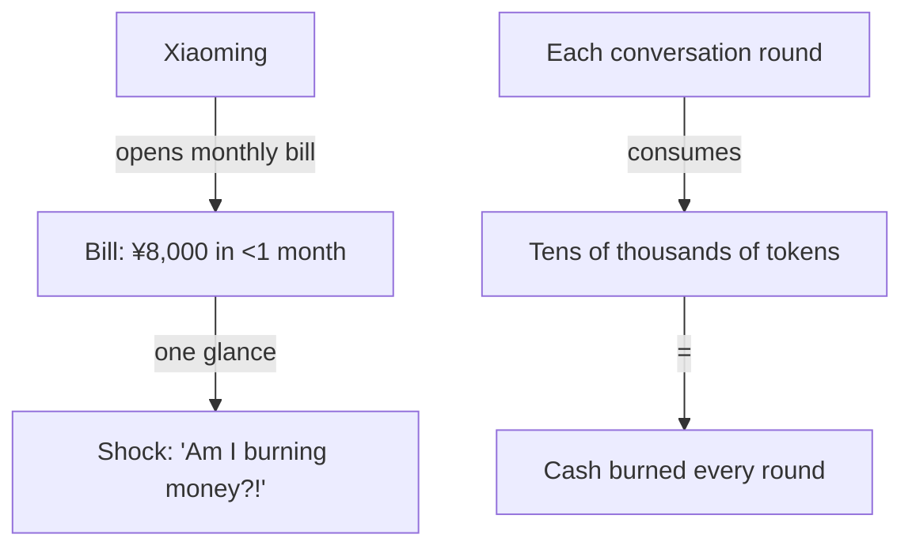
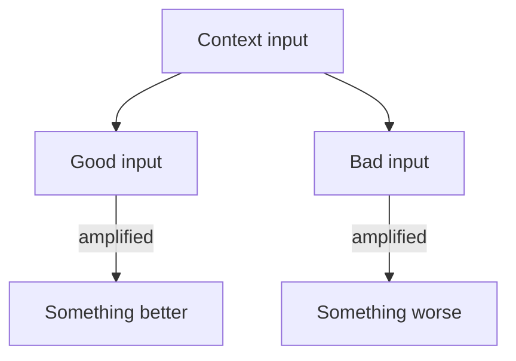
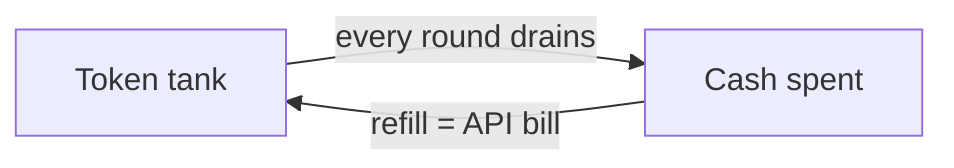
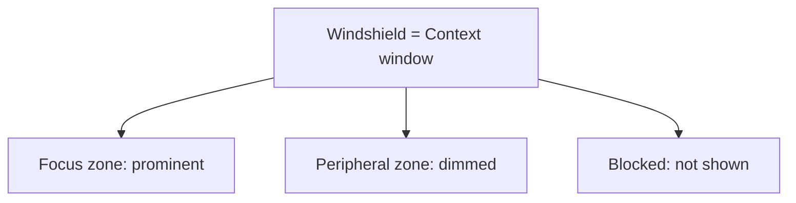
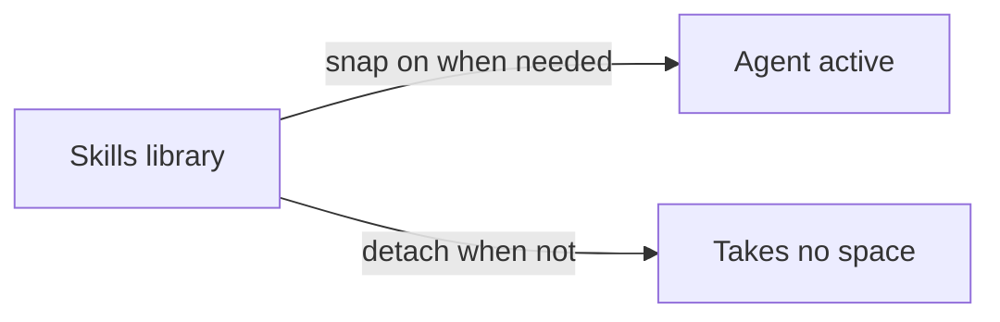
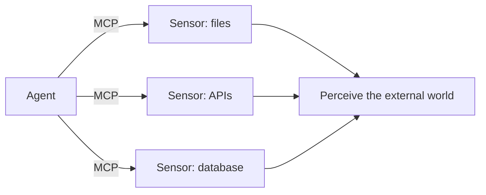
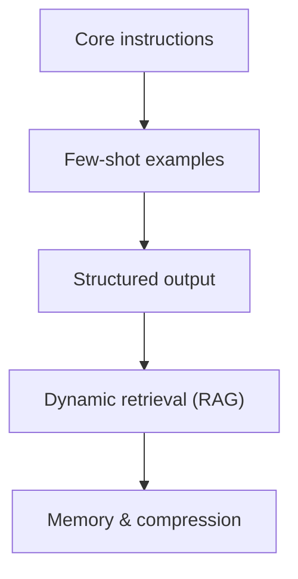

# Chapter 7

# Context Engineering: Not "the More the Better," but "Just Right"

If the LLM is the Agent's "brain," then context is its "field of vision." A brilliant brain is useless if it can't see. But here's the catch: bigger vision isn't better. A windshield that's too large lets in too much draft; too much clutter in your field of view distracts the driver. Context engineering is about installing a window that's just the right size.

## 1. Xiaoming's "Billing Nightmare"

It started on a dark, windy night.

At 11 p.m., Xiaoming was happily coding with his new Agent. After learning Prompt Engineering from Lao Wang and loading up various Skills, he felt his AI partner was getting smarter by the day. He'd drop it into a project, *snap* — a new feature would be written.

"Nice!" Xiaoming stretched and casually opened his AI provider's billing page to see how much he'd spent that month.

One look, and he nearly fell off his chair.


> Figure: Xiaoming's "billing nightmare" — every conversation round burning cash


**Xiaoming:** Eight thousand yuan?! Impossible! I've only been using it for less than a month! That's nearly three hundred a day — am I burning money or alchemizing pills?

Flustered, he opened the itemized bill and read line by line. What he found terrified him: every conversation with the Agent consumed a staggering number of tokens. Sometimes a simple question still burned tens of thousands of tokens.

"That can't be right..." Xiaoming scratched his head. "I say one sentence each time — how does that use so many tokens?"

He messaged Lao Wang late that night. He'd assumed Lao Wang was asleep, but the call came two minutes later.

**Lao Wang:** Xiaoming, did you stuff the entire project's code into the context?

**Xiaoming:** Of course! Isn't more context always better? I gave it every file so it fully understands the project and won't write wrong code!

**Lao Wang:** Sigh, you kid... Let me ask you: when you drive, do you paste the entire panoramic map of the road onto your windshield?

**Xiaoming:** Huh? How could I... the windshield is only so big. Paste it full and how would I see the road?

**Lao Wang:** Exactly! So the first lesson of context engineering is — **not "the more the better," but "just right."** Show it what it needs to see, and don't clutter it with what it doesn't. Your problem is you pasted the whole city map on the windshield.

After hanging up, Xiaoming was skeptical. He tweaked the Agent's context config — no longer loading every file, only the few relevant ones he needed to modify.

Early the next morning, he couldn't wait to test it. Something magical happened: responses came three times faster, and the code quality actually improved! Better still, token usage dropped to one-fifth of before.

"How... how is this possible?" Xiaoming was completely lost. "Less information, better results?"

Lao Wang laughed and asked Xiaoming to meet him at the café by the office that weekend — he'd give him a proper lesson on **context engineering**.

## 2. Context Is a "Two-Way Amplifier"

Saturday afternoon, the sun was just right. Lao Wang sipped his coffee and walked Xiaoming through the first core concept of context engineering.

### The good gets amplified, the bad gets amplified

**Lao Wang:** Xiaoming, do you know why less information gives better results? Context is fundamentally a **two-way amplifier**.

**Xiaoming:** Two-way amplifier? What do you mean?


> Figure: Context is a two-way amplifier — good input is amplified into something better, bad input into something worse


Lao Wang gave an example:

Imagine you have a sound system. You feed it a high-quality song, turn on the amplifier, and the sound becomes fuller and more moving. But feed it a song full of static, turn on the amplifier — what comes out isn't better music, it's harsher noise.

Context is that amplifier.

Context is a two-way amplifier: good engineering practice gets amplified, and rotten code structure gets amplified too.

Lao Wang told Xiaoming about two projects he'd lived through:

**The first project** had excellent code standards — clear naming, complete comments, clean layering, single responsibility per function. After the team brought in an AI coding assistant, productivity doubled. The AI not only wrote code in the existing style, it even proactively caught potential bugs, enforcing the standards more thoroughly than humans did.

**The second project** was legacy spaghetti — variables named `a`, `b`, `c`, two-thousand-line functions, copy-pasted duplicates everywhere, comments reading "don't change this, it'll crash." What happened? The AI got its hands on it and wrote code worse than the original. It learned every bad habit, and because it "studied" so diligently, it reproduced those rotten patterns even more thoroughly.

**Xiaoming:** Whoa... that scary? So the spaghetti project is hopeless?

**Lao Wang:** Not hopeless, but you can't just throw the whole pile at the AI. You clean it first — pick out the relevant, clean, correct information and feed that. That's what context engineering does: **show the AI good things and it produces good results; show it garbage and it produces worse garbage.**

### Bad code quality? The AI writes the bad pattern even worse

Lao Wang showed Xiaoming a real example.

One team wrote error handling carelessly — basically `try { ... } catch (e) { console.log(e) }`, catch the exception, log it, do nothing. They stuffed the whole codebase into the AI to add features, and the new code it produced used the exact same error-handling pattern, down to the unchanged log format.

"That's 'you become who you hang around,'" Lao Wang laughed. "The AI has no judgment; it only mimics the patterns in its context. Show it ten pieces of bad code and it writes the eleventh."

> ****Note****
>
> **Garbage In, Garbage Out** — that old AI adage still holds in the Context Engineering era. And because the LLM's "imitation ability" is so strong, what goes in as garbage can come out as even more, even more convincing garbage.

### Good engineering standards? The AI enforces them more thoroughly than people

On the flip side, if your context is full of high-quality code and clear standards, the AI will surprise you.

Lao Wang told another story: one team spent a week organizing their code standards, design principles, and best practices into a clean document, then put it in the Agent's system prompt. The result — the AI's code didn't just fully comply with the standards, it was more "standard" than what many veterans wrote. It never skipped error handling out of laziness, never broke layering for convenience, never forgot a comment.

**Lao Wang:** People writing code always have off days, lazy days, forgetful days. The AI doesn't — as long as the standards in the context are clear enough, it executes them every time. That's the positive force of context as an amplifier.

**Xiaoming:** So... the first step of context engineering is making sure what we show the AI is itself high quality?

**Lao Wang:** Exactly! That's why many teams do a round of code cleanup and standards work before bringing in AI. Not for the people, but to give the AI a good "learning environment." **The quality of your codebase sets the ceiling on what the AI can output.**

## 3. Budgeting Your Context

Having covered the two-way amplifier, Lao Wang pivoted back to Xiaoming's most pressing concern — money.

### Tokens are money: every conversation round burns cash

**Lao Wang:** Xiaoming, do you know how you spent that eight thousand?

**Xiaoming:** I just knew each conversation used a lot of tokens, but I never really studied how it's calculated...


> Figure: The context fuel gauge — tokens are money, and every conversation round burns cash


Lao Wang laid out the math:

- LLM billing is by token, and both input and output count.
- What's a token? Roughly one to one and a half Chinese characters, or about three-quarters of an English word.
- Every conversation round, you resend the **entire context history** to the model — not just the latest sentence.
- So the longer the context, the higher the cost of each round.
- And it's cumulative — by round 10, you've paid for the first 9 rounds ten times over.

Xiaoming's eyes went wide. "Wait! You're saying my sentence in round 10 — I've already paid for the first 9 rounds ten times?"

Lao Wang nodded. "Right. It's like every time you hail a cab, the driver re-drives the whole route from the start — every sentence you say, the model re-'reads' everything before it. So the longer the context, the higher the marginal cost."

> ****Xiaoming does the math****
>
> Say your context is 50,000 tokens, and each round costs about 0.5 yuan for input and 0.5 for output. Chat 50 rounds a day and that's 50 yuan. A month is 1,500 yuan. But keep the context under 10,000 tokens and the cost drops to one-fifth — just 300 yuan a month.

### A bigger context window isn't always better: overstuffing it actually hurts

**Lao Wang:** Money's one thing — you can always spend more. But the bigger problem is — **overstuff the context and results actually get worse.**

Xiaoming was lost again. "Huh? Isn't a big window a good thing? The vendors are all racing on window size! 128K, 200K, 1M... bigger is better!"

Lao Wang smiled and asked: "Xiaoming, in an exam, do you score higher open-book or closed-book?"

"Open-book, obviously!" Xiaoming answered without thinking.

"What if open-book means the whole library — a million books to find your answer in? Think you'd do better?"

Xiaoming froze.

**Lao Wang:** Same principle. A big context window doesn't mean the AI uses it well. Research shows that when context gets too long, models suffer from **"lost in the middle"** — they remember the beginning and end clearly but tend to ignore what's in the middle.

**Xiaoming:** Isn't that just like people... in class you only remember what the teacher said at the opening and the homework assigned at the end. What was in the middle again?

**Lao Wang:** Ha, exactly! So the second core principle of context engineering is — **a big window is a capability, but knowing how to use it is skill.** Like a car's top speed of 200 km/h doesn't mean you drive 200 on city streets.

### Xiaoming's "context fuel gauge": watching how much room is left

Lao Wang suggested Xiaoming install a "context fuel gauge" in his Agent — something that shows in real time how many tokens the current context has used and how much room is left.

"It's like watching the fuel gauge while driving," Lao Wang said. "You don't wait until the tank's dry to realize you're out of gas. You keep an eye on the level and plan ahead."

Lao Wang listed a few key "gauge marks" for Xiaoming:

**1. Safe zone: 0%–50%**

The context is plenty roomy, the AI's attention is focused, output quality is stable. Feel free to add content.

**2. Caution zone: 50%–70%**

Start paying attention. Consider compressing less important info, or summarizing older conversation.

**3. Danger zone: 70%–90%**

Time to act! Compress, summarize, clean up — move out the unimportant stuff and make sure key info isn't lost.

**4. Redline zone: above 90%**

A crash could happen any moment. The AI may start forgetting key info, output quality drops sharply. Clean up immediately.

### 128K, 200K, 1M... is a bigger window really better?

By now Xiaoming couldn't hold back the question that had been nagging him:

**Xiaoming:** Lao Wang, you say vendors are all competing on context windows — 32K to 128K, to 200K, to 1M, some even say 10M... is any of this actually useful?

**Lao Wang:** Useful, but not in the way you think. A big window's value isn't "stuff everything in," it's **"no need to shuffle things around constantly."** Like a big fuel tank — not so you fill it once and never refuel, but so you don't have to run to the gas station all the time.

Lao Wang explained two main values of a large context window:

**First, less "moving cost."** If the window is tiny, you constantly move old info out and new info in, and that moving itself burns compute and attention. A bigger window gives you more buffer.

**Second, long-document scenarios.** Some tasks are inherently long — reading a whole novel, analyzing a contract of dozens of pages, understanding a large codebase's architecture. Then a big window is a hard requirement. But even there you need context engineering — not swallowing the whole book whole, but organizing and retrieving strategically.

> ****Lao Wang's summary****
>
> A big window is the "ceiling capability"; context engineering is the "floor guarantee." A window can be huge, but unmanaged it's wasted; a small window, well managed, still works. **Like driving — how fast the car can go is the car's business; how steady you drive is yours.**

## 4. The Art of Organizing Context

Having covered "how much to put in," Lao Wang moved to "how to put it in."


> Figure: Good context is like a well-designed windshield interface — clear zones, prominent focus


### Order matters: the beginning and end stick best

**Lao Wang:** Xiaoming, have you noticed — when you read an article, you remember the opening and the ending best, and the middle slips away?

Xiaoming nodded. "Right! Same with memorizing vocabulary — 'abandon' sticks best, the last few leave an impression, the middle..."

"The AI is the same," Lao Wang said. "In psychology it's the 'Serial Position Effect' — the opening is 'primacy effect,' the ending is 'recency effect.' Large language models have it too."

**Xiaoming:** So that means... we should put the most important info at the very beginning and the very end?

**Lao Wang:** Precisely! The order of context isn't random. **System prompt goes first (primacy effect), the current task goes last (recency effect), supporting info goes in the middle.** That's why in an Agent's architecture, system instructions are always at the very top and the user's latest question is always at the bottom.

Lao Wang sketched a simple layered structure for Xiaoming:

****System instructions (System Prompt)****
Role definition, core rules, output format — put first so the AI sees them immediately.

📚 **Background knowledge (Context)**
Relevant docs, code snippets, conversation history — put in the middle as reference.

❓ **Current task (User Query)**
The user's latest question or instruction — put last, so the AI answers right after "reading" it.

### Structure: use XML tags, Markdown headings to divide zones

"Order alone isn't enough," Lao Wang went on. "You also have to let the AI know — which part is what. That's **structure**."

Lao Wang gave an example. If you pile a bunch of info together in a mess, the AI may not tell instructions from examples from data. But divide it clearly and the AI's comprehension accuracy jumps.

Common structuring methods:

- **XML tag zones:** wrap different parts in `<system>`, `<context>`, `<query>` tags.
- **Markdown headings:** use #, ##, ### to layer content at a glance.
- **Code-block wrapping:** wrap code in ``` to separate it from prose.
- **Clear dividers:** use --- or === to separate info blocks.

> ****Tip****
>
> Don't underestimate these "formats." To a person, format is just pretty. To an AI, format is a **road sign for understanding**. Clear structure helps the AI locate key info fast and reduces the chance of "reading the wrong line."

### Hierarchy: important info first, details later

Beyond order and structure, there's an important principle: **hierarchy**.

"What's hierarchy?" Xiaoming asked.

"Like writing an email," Lao Wang said. "Clear subject, key point up front, details after."

Like writing an email — clear subject, key point first, details later.

Lao Wang explained that good context organization is a "pyramid structure" — the core message on top, details unfolding layer by layer. Even if the AI only reads the first part, it catches the core meaning. If it needs more detail, it reads on.

Say you want the AI to modify a function. The context should be organized as:

1. **Layer one (core):** What to do? — "Modify the user login function to add phone-number login."
2. **Layer two (background):** Why? — "See attached PRD; goal is phone-number + verification-code login."
3. **Layer three (reference):** Where's the relevant code? — "Current login function is auth.js lines 23–56; the verification-code service is already implemented in sms.js."
4. **Layer four (detail):** Exact requirements? — "Must stay compatible with the original password login; error-code spec in section 4.2..."

**Xiaoming:** I get it! Lead with the conclusion, then background, then details. So even if the context runs out, the AI at least grabbed the core task.

**Lao Wang:** Right! That's the art of context engineering — **not "the more the better," but "just right." Show it what it needs to see, don't clutter it with what it doesn't.** And even if it can't read everything, it at least read the most important part.

## 5. Skills: Modular Context

Here Lao Wang suddenly asked Xiaoming: "You learned Skills before, right?"

Xiaoming nodded. "Learned it! Skills are reusable knowledge packages — description + docs + scripts, right?"

"Right," Lao Wang said. "But have you thought about what Skills essentially are?"

Xiaoming scratched his head. "Umm... tools? plugins?"


> Figure: Skills modularize knowledge like Lego bricks — snap them on when needed, they take no space when not


Lao Wang smiled. "Skills are essentially **modular context**."

### What is a Skill? — a reusable "knowledge package"

Lao Wang explained to Xiaoming:

Imagine, without Skills, every time you want the AI to do something complex, you have to manually stuff all the relevant knowledge, steps, and standards into the context. Like printing out the map every time you drive somewhere.

With Skills it's different. You package one domain's knowledge into a "knowledge package" and store it. Load it in when you need it; when you don't, it takes no context space.

Skills modularize knowledge like Lego bricks — snap them on when needed, they take no space when not.

### The three parts of a Skill: description + docs + script

Lao Wang said a complete Skill usually has three parts:

🏷️ **Description**
One sentence on what the Skill does and when to use it. Like the label on a Lego brick telling you it's a wheel or a window.

****Documentation****
Detailed usage, best practices, caveats. Like the Lego manual telling you how to build, where, and what tricks to use.

****Script****
Executable code or commands that perform the specific operation. Like the Lego brick itself — usable directly, effective once snapped on.

"Of these three, 'description' is the most critical," Lao Wang stressed. "Because the Agent relies on the description to decide — for the current task, should it call this Skill? A good description means the Agent calls the right Skill at the right time. A bad one and it either skips it when it should use it or abuses it when it shouldn't."

### Load on demand: takes no space when unused

"Load on demand" is a Skill's biggest advantage, Lao Wang said.

Imagine your Agent has 100 Skills. Load them all into context and how many tokens would that eat? But in practice, any given task probably uses only two or three.

So a good Agent architecture looks like this:

- The Agent's base context holds only every Skill's **description** (brief, usually one or two sentences).
- When the Agent judges a Skill is needed, it loads that Skill's **full docs and script**.
- After use, if not needed later, the detail can be "unloaded" from context.

**Xiaoming:** Oh! I get it! Like phone apps — you've got many installed but don't open them all at once. Open the one you need, close it when done. Saves memory and stays callable anytime.

**Lao Wang:** Spot on! Skills are the App Store of the Agent world. **The description is the app icon and blurb, the docs are the in-app help, the script is the app's function.** You don't keep every app open, but you know where to find them when needed.

### From "one big file" to "a pile of small modules"

Lao Wang said Skills bring more than token savings — they change how you think.

Before Skills, people managed context as "one big file" — stuff everything into one Prompt, the longer the better, the more complete the better. The result: painful to edit, painful to maintain, newcomers can't understand it, old hands forget it.

With Skills, people started managing knowledge modularly:

🧩 **Independent maintenance**
Each Skill can be developed, tested, updated on its own, no interference.

🔄 **Reuse and sharing**
A Skill written by one team can be used directly by another — no reinventing the wheel.

📦 **On-demand composition**
Different task scenarios load different Skill combinations, flexibly mixed.

📈 **Continuous evolution**
Skills keep iterating and improving, and the whole Agent's capability rises with them.

**Story**

Lao Wang said a team he knew started with all their code standards, review criteria, and deploy process written into one giant system prompt — several thousand tokens. Every time they changed one rule they had to be careful not to break another.

Later they split it into 20-plus Skills — one for code review, one for unit tests, one for deploy/release, one for docs... The result: context consumption dropped 60%, and each Skill could be maintained by a dedicated person, so quality actually went up.

"This is like going from monolith to microservices," Lao Wang concluded. "Context engineering is the same — **divide and conquer is the right path.**"

## 6. MCP: Connecting to the External World Dynamically

Having finished Skills, Lao Wang took a sip of coffee and dropped a new concept: "So do you know MCP?"

"MCP?" Xiaoming shook his head. "What's that?"


> Figure: MCP is like the various sensors on a car — letting the Agent perceive the external world, not just read local files


### What is MCP? — Model Context Protocol

"MCP, short for Model Context Protocol," Lao Wang explained. "Think of it as the Agent world's 'USB port.'"

"USB port?" Xiaoming was more confused.

**Lao Wang:** Right, USB port. Think about it — your computer has a USB port. Plug in a drive, mouse, keyboard, camera, printer... any device that meets the USB standard just works when plugged in. MCP is the same idea — a standard protocol that lets the Agent connect to all kinds of external data sources.

**Xiaoming:** Oh! I get it! It's the Agent's "universal interface," right?

**Lao Wang:** Exactly! Before MCP, if you wanted the Agent to connect to a database you wrote a custom integration; to check logs, another; to read Jira tickets, yet another. Every new thing meant rebuilding. **With MCP, if the other side supports the protocol, plug in and it works.**

### Why MCP: the Agent can't just read local files

**Xiaoming:** Then why do we need MCP? Can't the Agent just read local files?

Lao Wang laughed. "Xiaoming, think — is a smart car fine seeing only the road in front of the windshield?"

Xiaoming thought. "No... it also needs navigation, radar, a backup camera, tire-pressure monitoring..."

"Right!" Lao Wang slapped the table. "The Agent is the same. **Just reading local files is like a car with only a windshield — it sees the road ahead but not the traffic far off, not the car behind, not whether the tires have air.**"

Lao Wang listed external info an Agent often needs to connect to:

- **Databases:** user data, order data, config data... you can't export the whole DB to a file.
- **Log systems:** when production breaks, the Agent needs to query logs — you can't download them all locally.
- **Project management tools:** Jira, Trello, Feishu tasks... task status changes constantly.
- **Design files:** Figma, Sketch... dimensions, colors, spacing in UI designs.
- **API docs:** parameters, return values, error codes of third-party interfaces.
- **Knowledge bases:** Confluence, Notion, Feishu docs... the team's accumulated knowledge.

> ****Analogy****
>
> MCP is like the various sensors on a car — radar, camera, GPS, tire-pressure, rain sensor... each feeds the car a different dimension of info. **Without these sensors the car is "near-sighted," seeing only the tiny bit in front of it.**

### MCP Server: let the Agent connect to databases, query logs, read designs

"So how does MCP actually work?" Xiaoming asked curiously.

Lao Wang said the MCP architecture is simple, with three main roles:

🤖 **MCP Client (client)**
The Agent itself. It sends requests — "I want to query the user table in the database," "I want to read the recent error logs."

📡 **MCP Protocol (protocol)**
The standard communication protocol. Like the USB protocol — it specifies how to send requests, how to return data, what operations are supported.

🖥️ **MCP Server (server)**
The service that connects to a specific data source. Like a database MCP Server, a logs MCP Server, a Figma MCP Server.

"The cleverest part is this MCP Server," Lao Wang said. "Whatever you want the Agent to connect to, you write a corresponding MCP Server. Once written, every MCP-supporting Agent can use it. Like buying a USB card reader — every computer can use it."

Lao Wang gave Xiaoming examples:

- Write a **database MCP Server** — the Agent can query the database directly, no manual export.
- Write a **logs MCP Server** — the Agent can search and analyze logs directly, helping you troubleshoot.
- Write a **Figma MCP Server** — the Agent can read dimensions, colors, component info from designs directly.
- Write a **Jira MCP Server** — the Agent can check task status, create tickets, update progress directly.

**Xiaoming:** Wow... so the things the Agent can connect to become unlimited!

**Lao Wang:** Right! That's MCP's value — **it expands the Agent's field of vision from "local files" to "the whole world."** With the right MCP Server, the Agent can pull info from any system.

### How MCP relates to context engineering

**Xiaoming:** So what's the relationship between MCP and context engineering? MCP gives more info, doesn't that blow up the context?

Lao Wang nodded approvingly. "Good question! That's the essence of context engineering — **having the ability to fetch more info doesn't mean stuffing all of it in.**"

He explained that MCP provides the "channel to fetch info," but what info to grab, how much, and when — those are context engineering's job.

Like a car with GPS navigation: the nav doesn't display all of China's map on screen — it shows only the roads near your current position and the route ahead. MCP is that "navigation system"; context engineering is the "map zoom and filter."

> ****Key insight****
>
> MCP solves "can it see"; Context Engineering solves "what should it see." **One is capability, the other strategy; one expands the boundary, the other optimizes efficiency.** Together, the Agent sees broadly and accurately.

## 7. Advanced Context Engineering Techniques

By now it was getting dark. Lao Wang checked his watch. "Alright, the basics are covered. Let me give you a few advanced techniques as a bonus."


> Figure: Context engineering's multi-layer defense — optimized layer by layer, from core instructions to dynamic retrieval


### Context compression: summarize first when it's too long

"First technique, **context compression**," Lao Wang said. "Simply put — when something's too long, have the AI summarize it first, then put the summary into context."

Xiaoming's eyes lit up. "Oh! I like this move! Like a movie recap — a two-hour film in five minutes."

"Exactly that," Lao Wang laughed. "Say you have a 50-page requirements doc. You don't need all of it in context. Have the AI read it once and summarize '5 core requirements, 3 key constraints, 2 open questions,' then put that summary in context. Token cost might be one-tenth, but no key info lost."

Lao Wang added a few common compression approaches:

- **Summary compression:** boil a long doc down to a short abstract, keep the core meaning.
- **Key-info extraction:** pull only key entities — names, places, times, numbers.
- **Layered summarization:** summarize each paragraph, then each chapter, then the whole.
- **Conversation compression:** condense prior conversation history into a "what we've discussed" block.

### Dynamic retrieval: fetch the material when you need it

"Second technique, **dynamic retrieval** — what people call RAG (Retrieval-Augmented Generation)," Lao Wang said. "The core idea — don't carry all materials with you; go to the library when you need them."

Xiaoming nodded. "I know this! Vector databases, right?"

"Right, but not just vector databases," Lao Wang said. "The essence of dynamic retrieval is **'fetch on demand'** — whether vector search, keyword search, or database query, anything that 'brings in relevant info only when needed' counts as dynamic retrieval."

Lao Wang gave Xiaoming an example:

You have a knowledge base with 1,000 technical docs. You don't need all 1,000 in context. When a user asks, you search the base for the 3–5 most relevant, and put only those in context. Saves tokens and ensures the AI sees only relevant content.

> ****Lao Wang's analogy****
>
> Dynamic retrieval is like a car's **automatic headlights** — on at dusk, off at dawn. No need to keep them on, but they're there when needed. Context engineering is the "light sensor" — judging when to supplement info and what to supplement.

### Context caching: don't pay twice for repeated content

"Third technique, **context caching**," Lao Wang said. "This one saves serious money."

"Caching?" Xiaoming was puzzled. "How's that work?"

Lao Wang explained: "Every conversation round, you resend the whole context to the model. But a lot of that content never changes — system prompt, project background docs, loaded Skills... identical every round, yet you pay for them every round."

Xiaoming's eyes went wide. "Right! Isn't that double billing?"

"So many LLM vendors now offer 'context caching,'" Lao Wang said. "If a big chunk at the front of your context is the same as last round, that part is billed once or heavily discounted. Saves a lot."

**Xiaoming:** So how do I maximize caching?

**Lao Wang:** Simple — **put unchanging content first, changing content last.** System prompt, project standards — the basically unchanging stuff — go at the very front. Conversation history, current task — the stuff that changes every round — go at the back. Then the unchanging front gets cached and isn't billed repeatedly.

### Context audit: what did the AI actually see?

"Last technique, **context audit**," Lao Wang's tone turned serious. "Many people skip this, but it's very important."

"Context audit? Audit what?"

"Audit what the AI actually saw," Lao Wang said. "Ever had this — the AI answered wrong, you investigated, and found it 'misread' some info? Or worse — it saw info it shouldn't have?"

Xiaoming thought — actually yes. Last time he had the AI write code and it used a long-deprecated API. After digging, he found an old-version doc in the context and the AI wrote to that.

**Lao Wang:** Context audit means — **after every AI answer, you can trace: what info did it actually see this time? Was that info right? Complete? Out of date?** It's quality assurance and security assurance.

**Xiaoming:** Security assurance? What do you mean?

**Lao Wang:** Think — if your Agent can connect to a database, might it see users' private data? If it can query logs, might it see sensitive info? Context audit tells you — what data the AI saw this time, what tools it used, what actions it took. When something goes wrong, one check reveals all.

> ****Important****
>
> Context audit isn't an "optional feature" — it's a **must-have for production-grade Agents**. Like a car's dashcam — you might never need it, but when something happens, it's the only source of truth.

## 8. Xiaoming's New Understanding

By now the coffee had gone cold. Xiaoming leaned back, his brain stuffed full — yet unusually clear.

He used to think context was just "paste more into the chat box," the more the better. Now he saw the depth of it.

**Xiaoming's notes**

Xiaoming pulled out his notebook and organized what he'd learned:

- **Two-way amplifier:** Context amplifies the quality of input — good gets better, bad gets worse.
- **Budget management:** Tokens are money; always watch the "context fuel gauge."
- **Organization art:** order (beginning and end matter), structure (clear zones), hierarchy (key point first).
- **Skills modularization:** break knowledge into small modules, load on demand, unload when done.
- **MCP connects the world:** the Agent's USB port — connect whatever you want.
- **Four advanced moves:** compress, retrieve, cache, audit.

The art of context engineering isn't "the more the better," but "just right" — show it what it needs to see, don't clutter it with what it doesn't.

Xiaoming closed his notebook, full of feeling. He thought of that month's eight-thousand-yuan bill, of his "grand feat" of stuffing the whole project into context, and couldn't help laughing.

"Lao Wang, I learned so much today!" Xiaoming said sincerely. "So much depth in Context!"

✦ Chapter Gems ✦

"Context is a two-way amplifier: good engineering practice gets amplified, and rotten code structure gets amplified too."

"The art of context engineering isn't 'the more the better,' but 'just right' — show it what it needs to see, don't clutter it with what it doesn't."

"Skills modularize knowledge like Lego bricks — snap them on when needed, they take no space when not."

### Preview of next chapter

#### Would you ride in a car that only reads the map but can't press the gas?

After context engineering, Xiaoming felt his understanding had leveled up again. Watching the sunset out the window, a question hit him.

He said to Lao Wang excitedly:

"So much depth in Context! With a smart brain and a clear field of vision, can the Agent finally do real work?"

At those words, Lao Wang froze mid-sip, coffee cup in hand. He looked at Xiaoming, a mysterious smile at the corner of his mouth.

"Can see, can think, but still can't act," Lao Wang said slowly. "Ever seen a car that only reads the map but can't press the gas?"

Xiaoming froze.

Right! A car with a brain (the driver) and vision (the windshield), but no steering wheel, no gas, no brakes — it's just a decoration! It can plan routes, spot obstacles, but it can't move!

"Then... then what are the Agent's 'gas and steering wheel'?" Xiaoming asked urgently.

Lao Wang stood up, patted Xiaoming's shoulder, gaze toward the distance:

Next chapter, we give the Agent "hands and feet" — Tools and Plugins.

← Ch.6: Memory Systems  Ch.8: Tools & Plugins →

The Self-Driving Era: A Brief History of Agent Evolution © 2026 — An evolutionary saga of AI Agents, from Prompt to self-evolving organizations
