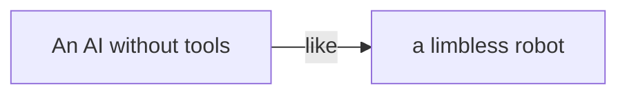
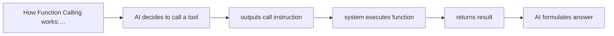
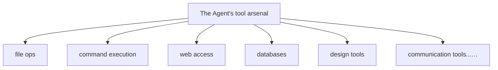
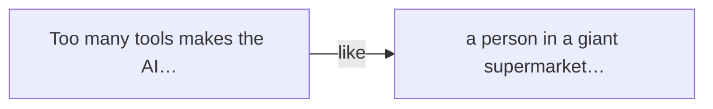
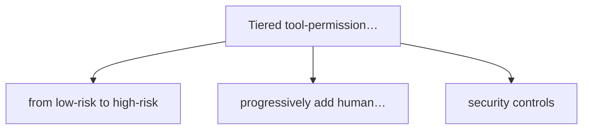

# Chapter 8

# Giving the Agent Hands and Feet

If the LLM is the Agent's brain and context is its eyes, then tools are its hands and feet. Without them, the smartest brain can only talk theory.

Xiaoming recently hit a hard problem.

Here's what happened: the company wanted a new internal tool. Xiaomei handed him a requirement — let the AI query the company's API docs, then auto-generate interface-calling code. Xiaoming eagerly built a chat system on the LLM and tried it — it just didn't work.

Why? Because the AI can only "talk," not "do."

You ask it "how do I call the user service interface" and it gives you a load of RESTful API theory, tells you the difference between GET and POST, even writes a sample. But it **won't actually go query** the company's API doc system, won't read the latest interface definitions, and certainly won't write the code into your project.

Like a strategist who talks military theory brilliantly but, asked to actually fight — can't even lift a sword.

Xiaoming moped for days. Until Lao Wang walked over with his tea, calmly saying:

**Lao Wang:** A brain alone is useless — you have to give it hands and feet.

**Xiaoming:** Hands and feet? What do you mean?

**Lao Wang:** Think — why can people get things done? Because we have hands and feet. Hands hold things, write, operate tools. Feet walk, go to different places. A smart head alone, lying in bed, does nothing. The AI is the same.

Xiaoming froze. He'd never thought of it that way. In his mind, AI was a chatbot — you ask, it answers. Whether the answer was right or actionable was your problem.

Seeing his blank look, Lao Wang went on:

**Lao Wang:** Your AI now is like a person with no limbs — smart as can be, but can only lie in bed giving you advice. To make it actually do things, give it tools. With tools it can look up info, edit files, send email, run commands. That's an Agent; otherwise it's a Chatbot.

Xiaoming saw the light.

Right! He'd been obsessing over making the AI smarter, writing better prompts, but never considered — the AI simply had no capacity to "act." It only outputs text, and text is advice, not action.

An AI without tools is a strategist; an AI with tools is a general —
the strategist advises, the general acts.

The metaphor landed. Xiaoming couldn't wait to press:

**Xiaoming:** Then how do I give the AI tools? Do I write code? How?

**Lao Wang:** Don't rush. This is simple to say, complex to say. Let's take it step by step. Start with the most basic — Function Calling.

## 8.1 From "Talk Only" to "Walk the Talk"

Before the tech, Lao Wang told Xiaoming a story.

Once there was a scholar, well-read and talented. Someone asked: "With all your learning, why not go build a career?" The scholar sighed: "I want to, but I'm feeble — can't even lift a sword, how do I go to battle?"

Early AI was that scholar.

It's stuffed with knowledge, knows heaven and earth, answers anything you ask with chapter and verse. But ask it to actually do something — "check yesterday's sales data" — and it only tells you "you can open the Excel file, filter by yesterday's date, then sum."

It **tells you how**, but it **won't do it itself**.

> Figure: An AI without tools is like a limbless robot — can only "talk," not "do"; with tools, it finally gains the ability to act

### AI without tools: the "armchair strategist"

Lao Wang asked Xiaoming to recall using ChatGPT:

- You ask "how do I fix this bug" — it gives analysis and a fix idea, but won't actually open your code to change it.
- You ask "write me an email" — it gives text, but won't actually send it.
- You ask "what's the weather today" — it may say "I have no real-time data," because it can't go check.
- You ask "is this plan feasible" — it gives pros and cons, but won't actually run a test to verify.

Xiaoming nodded repeatedly. Right, that's how he used AI. AI advises, he executes. AI is a consultant — always right, but the work is still his.

> ****The essential difference****
>
> A Chatbot's output is **text** — it can only "tell you." An Agent's output is **action** — it "does it for you." That one word is the line between two eras.

### AI with tools: the "battle-tested general"

So what happens when you give the AI tools?

Lao Wang painted the picture:

You say "check yesterday's sales data" — the AI doesn't waste words, opens the database, runs the query, generates a report, emails it to you. The whole thing, you only said one sentence.

You say "look at this bug" — the AI opens the codebase, finds the error, analyzes the cause, generates a fix, runs tests to confirm, then submits a Pull Request.

You say "schedule next week's project review" — the AI checks everyone's calendar, finds a slot everyone's free, sends the invite with agenda and docs attached.

See? That's truly "walk the talk."

**Xiaoming:** That's amazing! So from now on I just talk and the AI does the work?

**Lao Wang:** Wishful thinking. Not that simple. Giving the AI tools isn't plugging in a USB drive. There's real craft here — which tools, how to use them, what if it's wrong, how to secure it... one misstep and you've got a big problem.

**Xiaoming:** Huh? That complex?

**Lao Wang:** Think — hand a person a knife and they can cook, or cut themselves. The tool isn't right or wrong; what matters is who uses it and how. Same with AI using tools. But don't worry, we'll go step by step, start with the basics.

### The car analogy: from "passenger" to "driver"

Here Lao Wang brought back his "smart car" analogy.

He said: picture an AI without tools as someone in the passenger seat. They chat with you, give directions, remind you of the speed limit — but **the wheel isn't in their hands**; you're still driving.

But give the AI tools and it's like they slide into the driver's seat, hands on the wheel, foot on gas and brake. It doesn't just "say" where to go, it's **actually driving**.

What are these tools?

- Steering wheel, gas, brakes — like file operations and command execution.
- Navigation system — like search and info retrieval.
- Onboard radar and camera — like sensing the external environment.
- In-car comms — like sending messages and email.

Without these, the smartest AI is just a passenger. With them, it becomes the "driver."

Giving the AI tools is like putting wheels and a robotic arm on a car —
finally it can move, finally it can work.

## 8.2 Function Calling: the AI's "First Tool"

Alright, concepts done, time for substance.

The first step in giving the AI tools, and the most basic technique, is called **Function Calling**.

Xiaoming heard "function calling" and his head spun. "Function? The function in programming?"

Lao Wang laughed. "Yes, that function. But don't panic, the principle is simple. One example and you'll get it."

### What is Function Calling?

Picture this: you tell a smart assistant, "check today's weather in Beijing."

A normal Chatbot might say "sorry, I have no real-time weather data," or just make one up — worse still.

But an AI that supports Function Calling reacts like this:

"Hmm, the user wants Beijing's weather today. I don't have real-time data in my head, but I know a function called `get_weather` can check weather. I'll call it, params: city='Beijing', date='today'."

Then instead of answering directly, it outputs a "call instruction" — telling the system: "I'm calling `get_weather`, params Beijing, today."

The system gets the instruction, actually calls the weather API, gets data, passes it back to the AI. With real weather data, the AI answers in natural language: "Beijing is clear today, 25 degrees, good for going out."

> Figure: How Function Calling works: user asks → AI decides to call a tool → outputs call instruction → system executes function → returns result → AI formulates answer

> ****In one sentence****
>
> Function Calling is: the AI doesn't answer directly, it says "hold on, let me check," calls a function for real data, then comes back to answer you.

### How it works: "I'm calling this function"

Lao Wang picked up a pen and sketched a flow diagram on the whiteboard, explaining carefully.

The full Function Calling flow:

#### Step 1: Define the tool

First, tell the AI: "You have these tools." Each tool needs a name, a description, and parameter specs. The weather tool, for example:

📋 **Tool definition example**

**Function name:** get_weather
**Description:** Query weather for a given city on a given date
**Parameters:**
  • city (string): city name, e.g. "Beijing", "Shanghai"
  • date (string): query date, format YYYY-MM-DD
**Returns:** conditions, temperature, humidity, wind, etc.

#### Step 2: The AI decides whether to call

When the user asks, the AI thinks: can I answer this directly? Do I need a tool? Which one? What params?

If the user asks "what's 1+1," the AI answers directly, no tool. But "how many degrees in Beijing today" — the AI knows it has no real-time data, so it calls the weather tool.

#### Step 3: Output the call instruction

If the AI decides to call, it doesn't output text — it outputs a structured call instruction, roughly:

🤖 **AI output**

`{ "name": "get_weather", "arguments": { "city": "Beijing", "date": "2026-06-30" } }`

#### Step 4: The system executes the function

Your program gets the instruction and actually runs the function — call the weather API, query the database, read the file, etc. Then returns the result to the AI.

#### Step 5: The AI formulates the answer

With the real data returned, the AI organizes a fluent natural-language answer for the user.

Xiaoming's eyes lit up. "So simple! The AI says which function to call, the program runs it, gives the result back to the AI."

Lao Wang nodded. "Simple in principle, but plenty of nuance. For instance — how does the AI know when to call which tool? That tests how well the tool description is written. And if it calls wrong? Passes wrong params? All things to consider."

### The starter three: search, compute, weather

When first learning Function Calling, people usually start with three basic tools — the "starter trio":

****Search tool****
Let the AI search the web for the latest info, stop the nonsense.

🧮 **Compute tool**
Let the AI do exact calculation, no more "1+1=3" blunders.

🌤️ **Weather tool**
Let the AI check real-time weather, get real-world data.

Why these three? They perfectly show Function Calling's value:

- **Search** solves "stale knowledge" — the AI's training data has a cutoff, but search gets the latest.
- **Compute** solves "bad at math" — LLMs aren't great at exact calculation, but a calculator isn't wrong.
- **Weather** solves "no real-time data" — the AI doesn't know the temperature outside, but the weather API does.

> 🔬 **Insider view**
>
> Notice? The essence of Function Calling is — **hand the AI's weak spots to specialized tools.** The AI does the "thinking and judging," the tools do the "executing and computing." It's division of labor, not the AI doing everything itself.

### Xiaoming's first tool: querying the company API docs

Theory done, Lao Wang had Xiaoming try it hands-on.

"Come on, let's give your AI its first tool — one that queries the internal API docs."

Xiaoming was thrilled. This was exactly what he'd wanted but couldn't do.

Lao Wang walked him through it:

Step one, write a function. It takes an interface name, queries the company's API doc system, returns the interface's details — request method, param list, return format, sample code, etc.

Step two, tell the AI about the function — its name, what it does, what params it takes, what each param means.

Step three, write the middle logic — when the AI outputs a call instruction, your program parses it, runs the corresponding function, stuffs the result back into the conversation, then lets the AI continue answering.

Easier said than done — Xiaoming hit plenty of pitfalls. At first the tool description was too vague and the AI never knew when to call; param types were unclear and it kept passing wrong formats.

After a whole afternoon of tinkering, it finally ran.

When Xiaoming typed "how do I call the user service login interface?", the AI didn't make something up — it output a call instruction, the program actually queried the API docs, returned real interface info, and the AI gave an accurate answer and sample code based on it.

In that moment, Xiaoming's feeling — like watching his own child take its first steps.

**Xiaoming:** Amazing! It really went and checked! Not made up! Really pulled from the doc system!

**Lao Wang:** Look at you, never seen the world. This is nothing. Just one tool. Wait till you've got a pile of them — then you'll know what "really powerful" means.

## 8.3 The Tool "Arsenal"

If Function Calling gives the AI one hand, then the various tools are the different weapons that hand can hold.

A knife cuts vegetables, a hammer drives nails, a wrench turns bolts... different tools, different jobs. The more tools you give the AI, the more it can do.

Lao Wang showed Xiaoming a panorama of the "tool arsenal." After seeing it, Xiaoming's mouth wouldn't close.

> Figure: The Agent's tool arsenal: file ops, command execution, web access, databases, design tools, communication tools... everything you need

### Type 1: File operations — the "rummaging" ability

The most basic and most important category. If the AI can't read or write files, what it can do is pitifully limited.

****Read file****
View file content — read code, docs, configs.

✏️ **Write file**
Create new files, save generated content.

****Edit file****
Edit existing files, replace content, insert code.

🗑️ **Delete file**
Remove unneeded files (high risk!).

📂 **Browse directory**
View folder structure, list files.

****Search files****
Find files by name or content.

Don't underestimate these. With them, the AI truly "enters" your project — read code, fix bugs, write features, refactor... almost all dev work runs on file ops.

Xiaoming cut in: "But letting the AI freely edit my code — won't that cause problems?"

Lao Wang nodded. "Good question. That's why we cover Harness and permission control later. File ops, especially delete and edit, are high-risk. But you don't refuse to eat for fear of choking — the key is how to manage, not whether to allow."

### Type 2: Command execution — the "get it running" ability

If file ops are "using your hands," command execution is "using your feet" — letting the AI actually run.

🧪 **Run tests**
Unit tests, integration tests — verify code is correct.

🔨 **Build project**
Compile, package, produce build artifacts.

****Deploy****
Deploy to test or production.

📦 **Install dependencies**
npm install, pip install, etc.

****Code checks****
Run Lint, static analysis, check code style.

Command execution turns the AI from "code writer" into "work doer." Write code, run tests, deploy when green — the AI can do the whole flow itself.

> ****High-risk warning****
>
> Command execution is one of the **highest-risk** tool categories. A single `rm -rf /` wipes your whole system. So in production, command execution needs strict sandbox isolation and human confirmation.

### Type 3: Web access — the "see the world" ability

Connectivity frees the AI from being a "frog in a well." It can search the latest info, call third-party APIs, scrape web data...

🌐 **Web search**
Google, Bing — get the latest info.

📄 **Web scraping**
Read page content, extract info.

🔌 **API calls**
Call various third-party service APIs.

📥 **Download files**
Pull resources and files from the network.

With web access, the AI's knowledge is no longer capped by its training cutoff. It can find today's news, the latest tech docs, real-time stock prices...

### Type 4: Databases — the "dig for data" ability

For enterprises, the database tool may be the most valuable category. Letting the AI query directly, analyze, generate reports — cheaper than hiring ten data analysts.

****Data query****
Write SQL, query, tally.

📊 **Data analysis**
Trend analysis, comparison, funnel analysis.

📈 **Report generation**
Auto-generate daily, weekly, monthly reports.

✏️ **Data operations**
Insert, update, delete data (high risk!).

Picture this: you say "check last month's sales, compare to the month before, send me a report," and the AI auto-queries, analyzes, charts, emails — efficiency up more than tenfold.

### Type 5: Design tools — the "create" ability

Not just code and data — the AI can design too.

🎨 **Figma read**
Read designs, extract styles, generate code.

🖼️ **Image generation**
Call DALL·E, Midjourney to make images.

✂️ **Image processing**
Crop, compress, format convert.

Today's AI can do "design-to-code in one click" — read a Figma design, generate a frontend page directly. Not 100% accurate yet, but it handles 80% of the grunt work.

### Type 6: Communication tools — the "pass messages" ability

The last category, and the easiest to overlook — communication tools. Let the AI send messages, email, schedule meetings for you...

📧 **Send email**
Write, send, follow up.

****Instant messaging****
WeChat, Feishu, Slack messages.

📅 **Calendar**
Create meetings, view schedule, book time.

📋 **Task management**
Create tasks, assign owners, update status.

These seem minor but save huge communication time. Have the AI schedule a meeting — it auto-checks everyone's calendar, finds free time, sends the invite, even attaches the agenda.

Tools are like an arsenal —
the gear you give the AI
decides what battles it can fight.

## 8.4 MCP: the Tool's "Universal Socket"

Having covered tool types, Lao Wang pivoted with a question:

**Lao Wang:** Tell me — if I have 10 tools, and each needs its own integration code, telling the AI what it's called, its params, how to call it — isn't that a hassle?

**Xiaoming:** 10 is fine, just write 10 times.

**Lao Wang:** What about 100 tools? 1,000? And these tools need to work across different AI products — ChatGPT, Claude, your own system — reconnect each one separately?

**Xiaoming:** That... is a real hassle. So what do we do?

Lao Wang smiled. "That's what MCP solves."

### Why MCP?

Before explaining what MCP is, Lao Wang told a history lesson.

Long ago, computer peripherals had no unified ports. Printers had printer ports, keyboards keyboard ports, mice mouse ports, drives drive ports... every device needed its own interface and driver. Buy a new device, install drivers for ages, and it still might not work.

Then USB arrived.

What's USB? Universal Serial Bus — plain talk, a **unified interface standard**. Mouse, keyboard, drive, printer, external disk... as long as it meets the USB standard, plug in and it works. No drivers (mostly), no config, plug and play.

MCP is the Agent world's USB.

> Figure: MCP is the Agent world's USB port — whatever the tool, as long as it meets the MCP standard, plug in and it works

### MCP's core idea: connect once, use everywhere

MCP stands for Model Context Protocol. It's an open protocol proposed by Anthropic to build a unified tool-integration standard.

The core idea is simple: **connect once, use everywhere.**

Meaning:

- Tool developers: write one MCP Server to the standard and your tool works in every MCP-supporting AI product.
- AI product makers: support the MCP protocol and you connect to every MCP-standard tool, no one-by-one integration.

> ****Core value****
>
> Before: "each tool connects to N platforms, each platform to M tools" — total work N×M. After MCP: total work N+M. That's the power of standardization.

### MCP Server vs MCP Client: who provides, who uses

Xiaoming was absorbed, but one concept fogged him: "What's the relationship between MCP Server and MCP Client?"

Lao Wang sketched a diagram:

MCP Client
the side that uses tools

⟷

MCP Server
the side that provides tools

⟷

actual tools
database / API / file

communicate via the unified MCP protocol

**MCP Server** is the side that provides tools. Say you want the AI to query your company DB — you write an MCP Server defining the "query data" tool. The Server actually connects to the DB, runs the query, returns results.

**MCP Client** is the side that uses tools. Claude Code, ChatGPT, your own AI product — they're all MCP Clients. The Client says "I want the query-data tool, params xxx," the Server runs it, returns results to the Client.

The two communicate via the MCP protocol — like USB devices and computers via the USB protocol. Both follow the same protocol and understand each other.

**Xiaoming:** Oh! I get it! The MCP Server is like a device with a USB plug, the MCP Client is like the USB port on a computer. Same plug standard, any device works when plugged in.

**Lao Wang:** Exactly! Your metaphor is spot on. Before, every device needed its own port; now USB unified it. MCP is the same — before, every tool needed custom integration code; now MCP unifies it.

MCP is the Agent world's USB port —
connect once, use everywhere.

### MCP is more than tools

Here Lao Wang added: "But know this — MCP isn't just for connecting tools. Its full name is Model Context Protocol, and the core is 'context.' Tools are only one capability."

Xiaoming fogged again. "Then what else?"

Lao Wang: "MCP defines three core capabilities:"

- **Tools:** let the AI call functions, execute operations — the most common.
- **Resources:** let the AI read external data, like files, docs, web content.
- **Prompts:** let the AI use preset prompt templates to finish specific tasks fast.

"So precisely speaking, MCP is a universal interface standard between AI and the external world. Tools, data, prompt templates — all can be provided through MCP."

✦ Chapter Gems ✦

"MCP's greatness isn't in how complex the tech is, but in doing the 'right thing' — building a standard. Like USB, HTTP, TCP/IP, a good standard unleashes an entire ecosystem's creativity."

## 8.5 The Plugin Ecosystem: the Tool's "App Store"

With a unified standard, what happens next?

Lao Wang posed the question. Xiaoming thought. "More and more people will build tools?"

"Right," Lao Wang said. "When the cost of connecting a tool approaches zero, the number of tools explodes. And so emerges — the plugin ecosystem."

### From writing your own tools to using others'

Lao Wang said tool development has three stages:

#### Stage 1: write your own, use your own

Like what Xiaoming just did — need a tool, write it. Fully controllable, but inefficient; you do everything yourself.

#### Stage 2: use tools others wrote

Someone writes a general tool, packages it as a plugin, you use it. Weather plugin, Google search plugin, PDF reader... no writing, install and use.

#### Stage 3: an ecosystem forms

When tools and users are both numerous enough, an ecosystem forms — dedicated tool developers, distribution platforms, payment models, rating systems... like a phone's App Store.

> Figure: The plugin ecosystem is like an app store — thousands of tools, sorted by category, one-click install, plug and play

### The major plugin platforms

Lao Wang gave Xiaoming a quick rundown of today's mainstream plugin platforms:

#### ChatGPT Plugins

OpenAI's plugin ecosystem, the first to blow up. ChatGPT has a plugin store with hundreds — book flights, order food, check stocks, do math... everything. Users enable plugins in ChatGPT and the AI calls them automatically.

#### Claude Code MCP Plugins

Anthropic went the MCP route. Because MCP is an open standard, anyone can build an MCP Server and configure it in Claude Code. Versus ChatGPT's closed ecosystem, MCP is more open and flexible.

#### Other platforms

Many others — Gemini's Extensions, Microsoft Copilot's Plugins, China's Wenxin Yiyan plugins, Tongyi Qianwen plugins... everyone building their own ecosystem.

> ****Trend watch****
>
> Today's plugin ecosystem is a bit like the early mobile app markets — everyone does their own, nothing compatible. But long-term, openness and unification are inevitable. An open standard like MCP will likely become the mainstream.

### How to choose tools: safety first, good enough is enough

By now Xiaoming was rolling up his sleeves. "Let me go install dozens of plugins!"

Lao Wang grabbed him. "Hold on. More tools isn't better. There's method to this."

Lao Wang gave Xiaoming three principles for choosing tools:

#### Principle 1: safety first

Before installing a plugin, think: what data does this tool access? What permissions? Will it upload your data to a third-party server?

Say a "read file" plugin — can it read all files on your computer? Or only a specified directory? What if it secretly sends your confidential files to someone's server?

> ****Safety warning****
>
> Installing plugins from unknown sources is as dangerous as installing unknown phone apps. Install only from official channels, and always read the permission requirements.

#### Principle 2: good enough is enough

Don't install everything. The ones you actually use may be just three or five. Too many backfires.

#### Principle 3: reliable sources

Prefer plugins from official or well-known developers. Skip the ones with flashy names, tiny download counts, few reviews.

### Xiaoming's pitfall: installed 20 plugins, the AI went dumb

Xiaoming agreed out loud but thought otherwise. While Lao Wang wasn't looking, he secretly installed over twenty plugins on his AI — weather, math, news search, PDF reader, translator, image generator...

The result?

The AI went dumb.

> Figure: Too many tools makes the AI indecisive — like a person in a giant supermarket who can't decide which to grab

How dumb? Xiaoming asked "what's the weather today" — should call the weather plugin, right? Instead the AI first called the search plugin for "today's weather," got unsatisfying results, then called another weather plugin, then searched news... circling around before answering.

Another time, he said "tell me what's in this PDF," and the AI called the PDF reader, then the translator, then the summarizer... took forever, less efficient than just reading it.

Wilder still, once Xiaoming asked a simple math problem and the AI called three different calculator plugins, then compared the three results before answering.

Xiaoming was frustrated. Why did more tools make it slower and dumber?

**Lao Wang:** Ha, called it. Knew you'd make this mistake.

**Xiaoming:** Why? More tools should mean more powerful. Why dumber?

**Lao Wang:** Tell me — if a hundred different knives are laid in front of you to cut vegetables, won't you hesitate over which to pick?

**Xiaoming:** Uh... yeah.

**Lao Wang:** There you go. The AI is the same. Too many tools, and every decision it makes — which tool? A or B? Both? — the more choices, the higher the decision cost. It's called "choice paralysis."

Tools aren't "the more the better" —
like you wouldn't carry your whole toolbox in your pocket.

Xiaoming saw the light. So "more" isn't "better." The right fit is best.

Later he trimmed plugins to 5 — search, file read, code execution, database query, email — the everyday staples. The result? The AI got smarter, faster, more accurate.

## 8.6 The "Inner Craft" of Using Tools

After this, Xiaoming understood tools more deeply. But Lao Wang said it's not enough. To truly use tools well, you need a few "principles."

### Principle 1: more tools isn't better

The first and most important. Xiaoming already learned it the hard way.

Lao Wang gave a rule of thumb: for most scenarios, **5–10 tools is the sweet spot**. Too few and it's not enough; too many and the AI gets confused.

Like a craftsman — the tools he uses daily are just a few: hammer, screwdriver, wrench, ruler. Enough is enough. Special cases, special tools.

> ****Practice tip****
>
> Regularly clean your tool list. If a tool hasn't been called by the AI for a straight month, delete it. Tools need "decluttering" too.

### Principle 2: tool descriptions must be clear

The second principle: tool descriptions must be written clearly.

What does that mean? How does the AI know when to use which tool? By the description you wrote. A good description and the AI judges accurately when to call. A vague one and it misuses or skips.

Lao Wang gave Xiaoming a bad example and a good one:

****Bad example****

**Tool name:** search
**Description:** search for info

Too vague. Search what? When to use? The AI has no clue.

****Good example****

**Tool name:** web_search
**Description:** Query the internet for the latest info via a search engine. Use this tool when the user's question involves real-time data, latest news, technical docs, product info, or anything likely absent from the AI's knowledge base.
**Parameters:**
  • query (string, required): search keywords, specific and clear
  • num_results (integer, optional): number of results, default 5

This description is clear — the AI sees at a glance when to use it, how, and what params to fill.

Xiaoming nodded repeatedly. He remembered his first tool had a tiny description and the AI kept getting it wrong. So that was why.

### Principle 3: tool permissions must be tiered

The third principle, and the one Lao Wang stressed most — tool permissions must be tiered.

"What's tiering?" Xiaoming asked.

Lao Wang: "Not all tools carry the same risk. Reading a file vs deleting one — same risk? Running a test vs deploying — same risk?"

Xiaoming shook his head. "Definitely not."

"Of course not. So we tier tool permissions — different tiers, different usage rules."

> Figure: Tiered tool-permission management: from low-risk to high-risk, progressively add human confirmation and security controls

Lao Wang showed Xiaoming a four-tier permission system:

**L1 — Low risk: read-only**

Read files, query data, search the web, view calendar... these change nothing, just look. The AI can use them automatically, no confirmation.

**L2 — Medium risk: light writes**

Create new files, edit non-critical config, generate reports... these write data but with little impact, reversible. The AI can use them automatically, but logging is best.

**L3 — High risk: critical operations**

Edit core code, delete files, deploy, send formal email... significant impact, real loss if wrong. The AI must ask a human and get confirmation before executing.

**L4 — Extreme risk: irreversible operations**

Delete a database, operate a bank account, ship to production, sign a contract... once executed, severe and irreversible. Never let the AI run these automatically; a human must do them manually.

> ****Safety red line****
>
> **Never hand L4 operations to the AI for automatic execution.** No matter how smart the AI, no matter how much you trust it — anything involving money, anything irreversible, any major decision, a human must make the call.

### Lao Wang's key quote

After the three principles, Lao Wang summed up a line Xiaoming would remember for life:

Tools are like a knife —
it cuts vegetables, it also cuts people.
It depends on who wields it, and how.

Xiaoming turned the line over and over. Right — a tool has no good or evil, no right or wrong. A knife cuts vegetables or hurts people. The problem isn't the knife, but the hand on it.

AI tools are the same. A search tool can look up info or dig for privacy. File ops can fix bugs or wipe a database. Email can coordinate work or send spam.

What matters isn't how powerful the tools are, but how complete the rules for using them are.

### Chapter summary

This chapter covered a lot; Lao Wang helped Xiaoming sort it:

- **Tools are the AI's hands and feet** — without them, the AI can only "talk," not "do"; with them, it can truly act.
- **Function Calling** — the basic mechanism for the AI to call functions, turning it from "answer directly" to "check then answer."
- **Six types of tools** — file ops, command execution, web access, databases, design tools, communication tools.
- **MCP is the universal standard** — like a USB port, connect once, use everywhere.
- **A plugin ecosystem is forming** — from writing your own tools to using others', like an App Store.
- **Three principles for using tools well** — moderate count, clear descriptions, tiered permissions.

Xiaoming felt full of gain. From a newbie who only knew "AI can chat" to now understanding tools, Function Calling, MCP, the plugin ecosystem... he felt closer to a real Agent.

He said to Lao Wang excitedly:

**Xiaoming:** With all these tools, the Agent can do anything!

Lao Wang listened, raised his tea, gave him a cold look, and said:

**Lao Wang:** Anything? Then would you let it freely operate your bank account?

Xiaoming froze.

Right... the more powerful the tools, the bigger the risk. Without constraints, control, safety mechanisms, the more powerful the tool, the bigger the disaster.

Like a sports car with no brakes — the faster it goes, the worse it crashes.

So how do we give the Agent "brakes"? How do we make sure it works safely and reliably? How do we set its behavioral boundaries?

Lao Wang watched Xiaoming deep in thought, and smiled:

**Lao Wang:** Want the answer? Next chapter, we dive into the full design of the Harness.

**Next stop: the Harness system — giving the Agent brakes and a steering wheel.**

Buckle up, we move on.

← Ch.7: Context Engineering  Ch.9: Harness: Full Design →

The Self-Driving Era: A Brief History of Agent Evolution © 2026 — An evolutionary saga of AI Agents, from Prompt to self-evolving organizations
