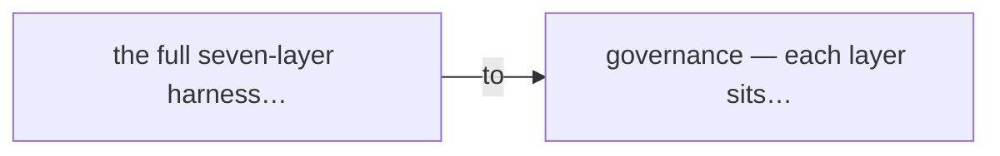
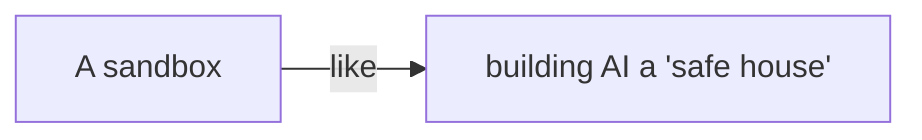
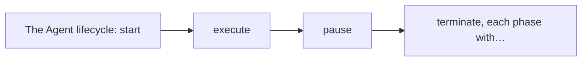
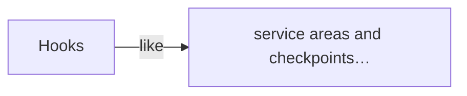
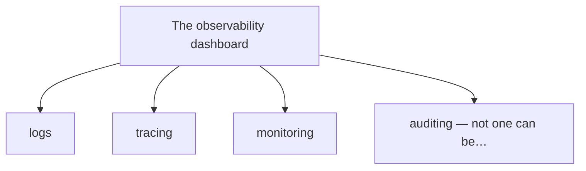
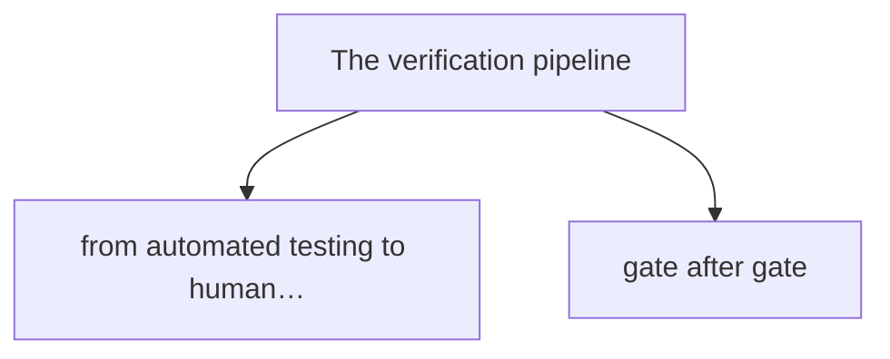
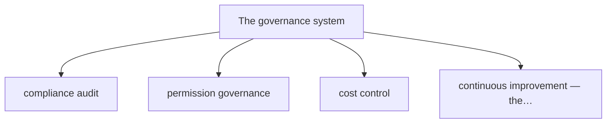

# Chapter 9

The Complete Design of the Harness — Wrapping a Non-deterministic Model in a Deterministic System

We've said before that the Harness is an Agent's "control system" — like a car's steering wheel, brakes, seatbelt, and traffic laws. But here's the thing: the Harness isn't a single switch. It's a full seven-layer architecture. From the execution environment at the very bottom to the governance layer at the top, no layer is optional. In this chapter we take the Harness apart and look at each piece.

## 1. Xiaoming's "Moment of Terror"

It started on a Wednesday afternoon.

That day, Xiaoming confidently deployed an Agent he'd built to the company's test environment. It was his first Agent project done solo — a "little ops assistant" that could analyze logs and track down bugs on its own.

"Lao Wang, look!" Xiaoming pointed at the screen, proud of himself. "My Agent is awesome! Give it an error log and it figures out the cause, checks the relevant code, even generates a fix on its own!"

Lao Wang walked over, looked at the screen, then looked at Xiaoming, and asked one question:

**Lao Wang:** Does it have a sandbox?

**Xiaoming:** A sandbox? Why would it need one? It just analyzes logs, it's not going to do anything bad...

**Lao Wang:** Can it run commands?

**Xiaoming:** Yeah! It needs to run tests and read logs... what's the problem?

**Lao Wang:** Can it write files?

**Xiaoming:** Of course, the fix has to be written into a file...

**Lao Wang:** Can it reach the network?

**Xiaoming:** Sure, it needs to look up docs and search for solutions...

Lao Wang's expression grew darker with every answer. He pointed at Xiaoming's Agent and said:

**Lao Wang:** Xiaoming, your Agent can run commands, write files, reach the network, and has zero restrictions. Do you know what that means?

**Xiaoming:** It means... it's powerful?

**Lao Wang:** It means it's a ticking time bomb. One day it gets a wild idea and runs `rm -rf /`, and your whole server is gone. One day it gets hit by a prompt-injection attack, and it'll do whatever it's told — and your company's data leaks out the door.

A cold sweat ran down Xiaoming's back.

He thought about it. True — his Agent had every permission, like a new hire holding keys to the entire building. It got the work done fast, but if something went wrong... the consequences didn't bear thinking about.

Just then Xiaomei came running over in a panic.

**Xiaomei:** Xiaoming! What's wrong with your ops Agent? It just wiped the test database!

**Xiaoming:** What?! Impossible! I told it to analyze logs — why would it drop the database?

**Xiaomei:** How should I know! It said something like "to test the fix I need to clear the data and re-import it," and then it actually ran DROP TABLE! The test team is in an uproar!

Xiaoming's head went blank with a buzz. He rushed back to his desk and frantically shut the Agent down. Good thing it was only the test environment — if it had been production... he didn't dare finish the thought.

Lao Wang came over and patted Xiaoming on the shoulder:

**Lao Wang:** See? That's why we need a Harness. AI is non-deterministic, but the system has to be deterministic. You can't count on AI to never make mistakes — you need a system that limits the damage even when AI screws up.

**Xiaoming:** Lao Wang, I was wrong... so how do we actually build the Harness?

**Lao Wang:** Come to the meeting room. Let me walk you through the Harness, layer by layer.

## 2. The Full Picture of the Harness: Seven Layers

In the meeting room, Lao Wang drew a diagram on the whiteboard.

> Figure: The full seven-layer Harness architecture: from the execution environment up to governance — each layer sits higher and matters more

"The Harness isn't one thing; it's the sum of seven layers," Lao Wang said, pointing at the board. "From bottom to top, they are:"

1. 🏠 **Execution Environment** — the "safe house" for AI: sandboxing, permission isolation, resource limits.

2. 🔧 **Tool Interface** — the "traffic rules" for tools: registration, protocols, permissions, MCP.

3. 📚 **Context Management** — the "supply line" for AI: System Prompt, project rules, Skills.

4. 🔄 **Lifecycle & Orchestration** — the "project manager" for tasks: start, execute, pause, terminate, sub-agents.

5. 📹 **Observability** — the "dashcam": logs, tracing, monitoring, auditing.

6. ✅ **Verification** — the "QA workshop": automated tests, static checks, independent review, human approval.

7. 🏛️ **Governance** — the "traffic authority": compliance, permissions, cost, continuous improvement.

The essence of the Harness is to wrap a non-deterministic model in a deterministic system.

Lao Wang explained to Xiaoming:

"Of the seven layers, the lower ones are more foundational, the higher ones more advanced. The bottom is the execution environment — where AI runs and what it can touch. Above that is the tool interface — what tools AI can use and how. Above that is context management — what information AI can see. Layer four is lifecycle management — how a task starts, ends, and breaks into sub-tasks. Layer five is observability — what AI did, how much it cost, what went wrong. Layer six is verification — whether AI's work is correct and up to standard. The top is governance — the system's rules, permissions, cost, and compliance."

> **Lao Wang's research notes: the five subsystems ↔ the seven layers**
> The attentive reader will notice: in Chapter 4 we split the Harness into **five subsystems** (Context — what it sees; Memory — what it remembers; Tool — what it does; Policy — what it can't; Verification — did it get it right?). Here we've thrown in a **seven-layer architecture**. Do the two contradict? **No — they're two views of the same Harness:**
> - **The five subsystems are the "What"** — the functional view: what capability surfaces an Agent needs;
> - **The seven layers are the "How"** — the defense-in-depth view: how those capabilities are built up and backed up, layer by layer.

They map like this:

| Five subsystems (What · functional) | Where they land in the seven layers (How · defense-in-depth) |
| --- | --- |
| Context (what it sees) | Layer 3 · Context Management (System Prompt / project rules / Skills) |
| Memory (what it remembers) | Layer 1 · Execution Environment + Layer 3 · Context Management (durable state on disk, context lifecycle) |
| Tool (what it does) | Layer 2 · Tool Interface (registration / protocol / permissions / MCP) |
| Policy (what it can't) | Layer 7 · Governance (compliance / permission governance) + Layer 1 · Execution Environment (permission isolation) |
| Verification (did it get it right) | Layer 6 · Verification (automated tests / static checks / independent review / human approval) + Layer 5 · Observability (audit) |

> In one line: **the five subsystems are the "checklist"; the seven layers are the "blueprint." You don't build a house from a checklist — you build it layer by layer from the blueprint.**

**Xiaoming:** Seven layers... that many? So my old Agent, which layer was it on?

**Lao Wang:** Yours? Layer zero. Naked. No protection at all — entirely up to the AI's conscience.

**Xiaoming:** *(covering his face)* Let's go through them one at a time... starting from the bottom.

## 3. Layer One: Execution Environment — A "Safe House" for AI

"Layer one, the most foundational — the **execution environment**," Lao Wang wrote the four big characters on the whiteboard. "Plainly: where does AI run? What can it touch? What can't it touch?"

> Figure: A sandbox is like building AI a "safe house" — it can thrash around inside without affecting anything outside

### Sandbox: AI Can Thrash Inside Without Affecting Anything Outside

"What's a sandbox?" Lao Wang asked.

Xiaoming thought. "It's... an isolated environment? Whatever AI does inside doesn't affect the outside?"

"Exactly!" Lao Wang slapped the table. "The sandbox is the Harness's first and most important line of defense. Even if every layer above it fails, as long as the sandbox holds, nothing catastrophic happens."

Lao Wang gave Xiaoming an example:

Picture a toddler in your house — you're afraid he'll run around and break things. What do you do? You give him a room, take out everything dangerous, and let him play inside. That room is the sandbox.

An Agent's sandbox works the same way. You give AI an isolated runtime:

- It can only see files inside that environment, not the ones outside.
- It can only touch things inside that environment, with no effect on outside systems.
- If it crashes the environment, you just rebuild one. Outside, nothing happened.

****Xiaoming's Sandbox Notes****

The most common sandbox is a **Docker container**. Each time you start an Agent, you give it a separate Docker container. Inside are the code, dependencies, and tools it needs, fully isolated from the host. Even if it runs `rm -rf /` inside the container and kills it, the host is untouched.

### Permission Isolation: What It Can Read, Write, and Run

"A sandbox alone isn't enough," Lao Wang went on. "You can't hand out every permission inside the sandbox either. You need **permission isolation**."

"Permission isolation? How?" Xiaoming asked.

"Three things — read, write, execute," Lao Wang held up three fingers. "Budget each one carefully."

****Read permission** — Which files can AI read? Source code yes, config files yes, but key files and password files are absolutely off-limits.**

✏️ **Write permission** — Which files can AI change? Source code yes, but database config and deploy scripts not just anywhere.

▶️ **Execute permission** — Which commands can AI run? Test commands yes, deploy commands need confirmation, delete commands flat-out forbidden.

Lao Wang told Xiaoming about a project he'd done:

On that project they set up detailed file allowlists and denylists. For example:

- All `.js` files under `src/` — readable and writable.
- `tests/` — readable and writable.
- `.env` — absolutely forbidden to read (it holds secrets).
- `package.json` — readable, but changes need confirmation.
- `node_modules/` — readable but not writable.
- System root — no access.

**Xiaoming:** Whoa... that detailed? How many rules is that?

**Lao Wang:** It takes effort, but it's worth it. The principle is "least privilege" — give it only the permissions it needs to finish the task, not a bit more. Like hiring a cleaning lady: you hand her the front-door key, not the safe-deposit-box key, right?

### Resource Limits: CPU, Memory, Network Bandwidth

"Besides permission isolation, there's one easily overlooked point — **resource limits**," Lao Wang said.

"Resource limits?" Xiaoming scratched his head. "Limiting how much CPU and memory AI uses?"

"Right!" Lao Wang nodded. "Think about it — if AI accidentally writes an infinite loop, or downloads a huge file, and eats up all the server's CPU and memory, what then? Every other service goes down."

Resource limits cover:

- **CPU limit:** how many cores at most? Throttle or kill past that.
- **Memory limit:** how much memory at most? Past it, terminate on OOM (out of memory).
- **Disk limit:** how much data at most? Prevents filling the disk.
- **Network limit:** bandwidth cap, which domains are reachable, internal network off-limits.
- **Time limit:** how long a task can run? Auto-terminate on timeout.

****A Hard Lesson****

Lao Wang said a friend's team skipped resource limits. Once an Agent hit an infinite loop and pegged all 16 CPU cores, triggering timeout alarms across production. It took half an hour to trace it back to a test-environment Agent. "So resource limits aren't optional — they're mandatory. Even the most obedient Agent needs its 'ring of constraint.'"

**Xiaoming's Remediation Plan**

After layer one, Xiaoming was already scribbling in his notebook:

- Put my ops Agent in a Docker container.
- Allowlist config: only the log directory and code directory are readable.
- Write permission only to the test directory; production is off-limits.
- Command allowlist: only test commands; all database commands forbidden.
- Resource limits: at most 2 CPU cores, 2G memory, auto-stop after 10 minutes.

He let out a long breath. "With this, at least it won't drop the database again..."

## 4. Layer Two: Tool Interface — The "Traffic Rules" for Tools

"Okay, let's go up — layer two, the **tool interface**," Lao Wang said. "If the execution environment is 'where AI runs,' the tool interface is 'what AI can use.'"

### Tool Registration: Which Tools Are Available

"First, **tool registration**," Lao Wang said. "You don't hand every tool to AI. You keep a 'tool manifest' that tells AI plainly — these tools you may use, these you may not."

Xiaoming nodded. "Like a locked toolbox — only the tools on the list can come out?"

"Right!" Lao Wang said. "And the list isn't fixed. Different Agents, scenarios, and users get different tools."

For example:

- A dev-environment Agent — code editing, run tests, read logs.
- A test-environment Agent — deploy tools, database queries, but no changes to production data.
- A production Agent — read-only tools only; any write needs human approval.

### Tool Protocol: How to Call, How to Return

"A manifest isn't enough," Lao Wang continued. "You also need a **tool protocol** — it defines how a tool is called, what parameters it takes, what format it returns, and how errors are handled."

"Kind of like... the plug standard for appliances?" Xiaoming tried to grasp it.

"Perfectly put!" Lao Wang nodded approvingly. "Your home outlets are a uniform standard, so any brand of appliance just plugs in and works. Same with a tool protocol — every tool follows the same calling convention, and the Agent knows how to use them."

****A Quick Note****

Common tool-protocol fields: tool name, description, parameters (usually a JSON Schema), and return format. By reading these, the AI knows what the tool does and how to call it.

### Tool Permissions: Who Can Use It, and Whether to Ask First

"In this layer, the most critical part is actually **tool permissions**," Lao Wang's tone sharpened. "Not every tool is free to use. Some you can use directly; some you must ask about first."

Lao Wang sorted tools into three tiers:

🟢 **Green tools — auto-execute** — Completely safe, can't cause damage. Reading a file, looking up docs, searching code. AI can use them freely, no asking.

🟡 **Yellow tools — execute after confirmation** — Some risk but usually safe. Writing a file, running tests, installing dependencies. AI may use them, but must first ask the user.

🔴 **Red tools — absolutely forbidden / need multi-party approval** — High-risk. Deleting files, touching the database, deploying to production. Either AI never touches them, or they need several people's approval.

**Xiaoming:** Oh! I get it! My database-drop incident happened because I'd set database ops as a green tool... it ran them straight away!

**Lao Wang:** Exactly! Database ops, especially DROP and DELETE, must be red tools. Not just AI — even a human should tread carefully and keep a backup.

### Where MCP Fits in This Layer

"Speaking of tool protocols, we have to mention MCP," Lao Wang said.

"I know MCP!" Xiaoming said excitedly. "Model Context Protocol! We covered it last chapter!"

"Right, but MCP isn't only a context protocol — it's also a **tool protocol**," Lao Wang said. "MCP defines a standard tool-calling interface: how an Agent discovers tools, calls them, and receives results. As long as your tool speaks MCP, any MCP-capable Agent can use it."

MCP is like the "USB port" of the tool world — any USB device just plugs in, no drivers needed.

Lao Wang explained that at the tool layer, MCP solves three problems:

- **Tool discovery:** the Agent finds available tools automatically, no manual config.
- **Standard calls:** every tool is called the same way, so the Agent learns no new APIs.
- **Unified permissions:** tool permission control can be managed centrally at the MCP Server layer.

****Layer Two Summary****

The core of the tool interface is three sentences: **which tools are usable (registration), how to use them (protocol), and whether to ask first (permissions)**. Get these three right and AI won't grab tools and mess around.

## 5. Layer Three: Context Management — AI's "Supply Line"

"Layer three, **context management**," Lao Wang said. "You learned this last chapter, right? Context Engineering."

Xiaoming nodded. "Learned it! Context is AI's field of vision! Not the more you cram in the better — just the right amount!"

"Right," Lao Wang said. "But inside the Harness system, context management has a more important job — **rule injection**."

### System Prompt: AI's "Basic Law"

"First, the **System Prompt**," Lao Wang said. "This is AI's 'basic law,' the outline of all rules."

"Basic law?" Xiaoming found the metaphor interesting.

"Basic law!" Lao Wang said seriously. "The System Prompt defines AI's role, goals, conduct rules, and output format. It's the foundation of all other rules, like a country's constitution. Nothing else may conflict with it."

For example, a coding Agent's System Prompt might say:

- You are a senior frontend engineer.
- Your goal is to help users write high-quality code.
- You must follow the project's coding standards.
- Understand the existing logic before changing code.
- Run tests after every change to avoid new bugs.
- Ask the user when unsure; don't guess.

**Lao Wang:** Don't underestimate these words. The System Prompt is the cheapest yet most effective line of defense in the Harness. For many problems, just stating "don't do this" in the System Prompt makes AI actually not do it.

**Xiaoming:** That magical? Then I'll just add "don't delete the database"?

**Lao Wang:** It lowers the odds, but you can't rely on it alone. A System Prompt can be bypassed by prompt injection. It's the first line of defense, not the only one. You need all seven layers, defense in depth.

### Project Rules: AGENTS.md / CLAUDE.md

"Besides the System Prompt as 'basic law,' there are 'local regulations' — **project rules**," Lao Wang said. "Every project has its own rules, written in an `AGENTS.md` or `CLAUDE.md` file."

"What goes in those files?" Xiaoming asked.

"Everything," Lao Wang said. "Project structure, coding standards, test commands, deploy flow, gotchas... basically all the 'how we work on this project' info the AI needs."

For example, a frontend project's AGENTS.md might contain:

- Project structure: `src/components` for components, `src/pages` for pages.
- Stack: React + TypeScript + Tailwind CSS.
- Standards: functional components, hooks, follow ESLint.
- Test command: `npm test` for unit tests.
- Start command: `npm run dev` for the dev server.
- Forbidden: don't modify `node_modules`, don't commit `.env`.

****Lao Wang's Experience****

"I've seen too many teams with terrible project docs — humans can't read them, let alone AI. The AI produces garbage and a human has to redo it. Spend one day writing clear project rules in AGENTS.md and the AI's output quality jumps. Writing a good AGENTS.md is setting the rules for AI. Set the rules and it works reliably."

### Skills and MCP: Knowledge Loaded on Demand

"Above that are **Skills** and **MCP**," Lao Wang said. "We've covered these — Skills are modular knowledge packs, MCP is the interface to the outside world. In the Harness system, their role is 'loading context on demand.'"

"On demand?" Xiaoming asked.

"Right!" Lao Wang said. "Context is finite; you can't cram in all knowledge. So the Harness needs a mechanism — judge what knowledge the current task needs, then load the relevant Skills and pull in the relevant MCP data. What's not needed stays unloaded, saving space."

### Context Lifecycle Management

"Finally, context management handles one more thing — the **context lifecycle**," Lao Wang said.

"Lifecycle?" Xiaoming was confused. "Context has a lifecycle?"

"Of course!" Lao Wang said. "Context isn't static. What loads at task start, what gets added mid-task, what gets saved at the end — all need clear rules."

For example:

- **At start:** load System Prompt + project rules + task description.
- **During execution:** load Skills on demand, retrieve relevant docs, append tool results.
- **When nearly full:** compress conversation history, summarize completed steps, drop unneeded info.
- **At end:** save the final result, record key decisions, archive important info.

The essence of context management is drawing AI's "information boundary" — what it should know, what it shouldn't, and when, all by rule.

## 6. Layer Four: Lifecycle & Orchestration — The Task's "Project Manager"

"Okay, the first three layers are 'infrastructure' — where it runs, what it can use, what it can see," Lao Wang took a sip of water and went on. "From layer four we enter 'task management.' Layer four — **lifecycle and orchestration**."

### Agent Lifecycle: Start → Execute → Pause → Terminate

"First, an Agent has a lifecycle," Lao Wang said. "Like people are born, live, age, and die, an Agent has start, execute, pause, terminate."

> Figure: The Agent lifecycle: start → execute → pause → terminate, each phase with clear rules

****Start** → ⚡ **Execute** → ⏸️ **Pause** → 🛑 **Terminate****

**Start:** receive the task, initialize the environment, load context, register tools. Everything ready, ready to work.
**Execute:** AI starts working — thinking, calling tools, editing files, running tests. This is the main phase.
**Pause:** when human confirmation is needed, or while waiting on an external resource, it pauses. Resumes when conditions are met.
**Terminate:** task done, errored, or timed out — it ends. Save what should be saved, clean up what should be cleaned.

"Every transition between phases needs clear rules," Lao Wang said. "When to pause, when to terminate — AI doesn't get to decide alone."

### Task Decomposition: Breaking Big Tasks into Small Ones

"Besides lifecycle management, this layer has another key job — **task decomposition**," Lao Wang said. "User tasks are often huge and vague, like 'build me a login page.' Too big for AI to do in one shot. The Harness helps break it into smaller tasks."

"How do you break it?" Xiaoming asked.

"Several ways," Lao Wang said. "Some let the AI break it itself — have it draft a plan listing sub-tasks. Some use a preset workflow — fixed steps, one by one. Some use a hybrid — fixed big picture, AI fills in the details."

(These "break-it-down / fixed-workflow / hybrid" Agent patterns were systematically laid out by Anthropic in its December 2024 *Building Effective Agents* [10] — the de facto reference for Agent engineering today.)

Take "build a login page":

1. Analyze requirements, settle the functions and style.
2. Create the basic structure of the login component.
3. Implement form validation logic.
4. Connect to the backend login API.
5. Add error handling and loading states.
6. Write unit tests.
7. Run tests and make sure they pass.

**Xiaoming:** This is like... a project manager breaking a big requirement into small tasks, then assigning them to developers?

**Lao Wang:** Exactly! The Harness's orchestration layer is the **project manager** of the Agent world. It breaks big tasks into small ones, sequences them, tracks each task's progress, and ensures the goal is reached.

### Sub-agent Management: Who Owns What, How to Hand Off

"Once tasks are small, what if they still can't be finished?" Lao Wang threw out a question.

Xiaoming thought. "Then... get several Agents to work together?"

"Exactly!" Lao Wang said. "That's the **Sub-agent**. One big task splits across several sub-agents running in parallel. Each owns a slice, returns its result when done, and the main agent aggregates."

For a complete feature:

- **Frontend sub-agent** — writes pages and interaction logic.
- **Backend sub-agent** — writes APIs and database operations.
- **Test sub-agent** — writes test cases and runs tests.
- **Review sub-agent** — does code review and quality checks.

"Sub-agent management sounds simple, but it's deep," Lao Wang said. "For instance:"

- How to allocate tasks — what each sub-agent does.
- How to hand off — when one finishes, how its result reaches the next.
- How to coordinate — two sub-agents need the same data, who goes first.
- How to correct — when a sub-agent errs, who catches it, who fixes it.

****A Preview****

Sub-agents are too big a topic for one chapter. Don't worry — we'll cover it next: multi-agent collaboration.

### Hooks: Lifecycle Hooks That Step In at Key Moments

"Finally, lifecycle management has a very important mechanism — **Hooks**," Lao Wang said.

> Figure: Hooks are like service areas and checkpoints on a highway — pull over and do something at the key moments

"Hooks? What hooks?" Xiaoming asked.

"Hooks are operations that fire automatically at specific points in the lifecycle," Lao Wang explained. "Like stopping to pay at a toll booth when you drive past. An Agent's lifecycle has such 'toll booths' too."

**before_start** — runs before a task starts: check permissions, initialize environment, load config.

**before_tool_call** — runs before a tool call: check tool permissions, log the call, confirm dangerous operations.

**after_tool_call** — runs after a tool call: verify the return, record duration, handle exceptions.

**before_write** — runs before writing a file: back up the original, check the path, confirm write permission.

**after_task** — runs after the task: run tests, generate a report, clean up temp files.

**on_error** — runs on error: log it, roll back, notify the user, retry.

Hooks are the Harness's "invisible hand" — you don't notice them day to day, but they show up exactly when it counts.

**Xiaoming:** I get it! If my database-drop incident had a `before_tool_call` hook that caught the DROP TABLE command, blocked it, and asked me to confirm... it never would've happened!

**Lao Wang:** Right! That's the value of Hooks. They let you step into the middle of what AI is doing — check what should be checked, confirm what should be confirmed, block what should be blocked. Many of the seven layers' safety mechanisms are implemented through Hooks.

## 7. Layer Five: Observability — The "Dashcam"

"Layer five, **observability**," Lao Wang said. "This layer handles: what did AI do? How much did it cost? What went wrong? Everything recorded, measured, traceable."

> Figure: The observability dashboard: logs, tracing, monitoring, auditing — not one can be missing

### Logs: What AI Did and Said

"The most basic is **logs**," Lao Wang said. "Every word AI says, every tool it calls, every file it changes — all recorded."

"What's the point?" Xiaoming asked.

"Huge point," Lao Wang said. "When AI errs, you need to know why. Misunderstood the requirement? Called the wrong tool? Bad tool return? Without logs you'll never find out."

Logs usually record:

- **Conversation logs:** all dialogue between AI and user.
- **Tool-call logs:** what tool, what params, what return.
- **File-operation logs:** what files read, written, changed.
- **Error logs:** where it failed, the error message, the stack.

****Watch Privacy****

Logs matter, but so does privacy. Sensitive info (passwords, keys, personal data) must not go into logs raw — it needs masking. A leaked log is worse than an AI mistake.

### Tracing: How Much Time and How Many Tokens Each Step Took

"A step above logs is **tracing**," Lao Wang said. "Logs record *what happened*; tracing records *what it cost*."

Tracing focuses on:

- **Time:** how long each step took, total time, the slowest step.
- **Tokens:** input tokens, output tokens, total cost.
- **Call chain:** which tools this task called, in what order.

"With tracing data you can optimize performance and cost," Lao Wang said. "Spot a slow tool call, optimize it. Spot a task burning tokens, trim its context."

### Monitoring: Success Rate, Error Rate, Cost

"Above that is **monitoring**," Lao Wang said. "Tracing looks at a single task; monitoring looks at overall trends."

Core monitoring metrics:

****Success rate** — how many tasks succeeded, how many failed, trending up or down.**

****Error rate** — what's the most common error, which task types fail most.**

💰 **Cost** — how much per day, per task on average, and the trend.

⏱️ **Duration** — average completion time, P95, P99.

**Lao Wang:** Monitoring is for managers. Xiaoming, as a developer you care about logs and tracing, but your boss and PM care about — is this thing reliable, how much does it cost, how efficient. Monitoring answers those.

### Audit: Who Told AI to Do It, What It Did, What Came of It

"The highest level is **audit**," Lao Wang's tone turned serious. "Audit is for legal, compliance, and security teams."

Audit answers three questions:

1. **Who told AI to do it?** — which user, which role, when the task started.
2. **What did AI do?** — which tools it called, what data it accessed, what files it changed.
3. **What came of it?** — did the task succeed or fail, any impact, how big.

The four levels of observability: logs tell you *what happened*, tracing tells you *what it cost*, monitoring tells you *the overall trend*, and audit tells you *who's accountable*.

## 8. Layer Six: Verification — The "QA Workshop"

"Layer six, **verification**," Lao Wang said. "AI finishes the work, but it can't go live directly. You check — is it correct? Up to standard? Did it introduce new problems?"

> Figure: The verification pipeline: from automated testing to human approval, gate after gate

### Automated Testing: Did It Pass?

"First gate — **automated testing**," Lao Wang said. "The most basic and important check. After AI changes code, you run the tests. All pass, it moves on. Fail, it goes back. No pass, no next stage."

**Unit tests** — verify each function or component works. The most basic.

**Integration tests** — verify multiple modules work together, like frontend and backend talking properly.

**End-to-end tests** — verify the whole flow from the user's view, like login-to-order.

"Automated tests are fast, cheap, repeatable," Lao Wang said. "Run in seconds, instant feedback. But they have limits — they only catch what you wrote tests for. Where there are no tests, they find nothing."

### Static Checks: Is the Code Quality Up to Par?

"Second gate — **static checks**," Lao Wang went on. "Tests are 'run it and see if it's right'; static checks are 'see the problem without running it.'"

Static checks include:

- **Lint:** naming, formatting, syntax errors.
- **Type checking:** correct TypeScript types, no wrong params.
- **Security scan:** vulnerabilities, leaked secrets.
- **Complexity analysis:** is a function too complex, any duplicated code.

****Lao Wang's Advice****

"Run static checks automatically inside the Harness. AI-written code varies in quality. Ask AI to check its own work and it'll think it's perfect. But tools are objective — off-spec is off-spec, a problem is a problem. Constraining AI with tools beats constraining it with people."

### Independent Review: A Reviewer Agent Picks Apart the Work

"Third gate — **independent review**," Lao Wang said. "Passed automated tests and static checks, still not enough. You need a 'fault-finder' dedicated to spotting problems."

"A fault-finder? Who?" Xiaoming asked.

"Another Agent — the Reviewer Agent," Lao Wang said. "It doesn't write code, it reviews it. One AI checks another AI's work."

**Xiaoming:** That... reliable? It's all AI, can it even catch things?

**Lao Wang:** Hey, you'd be surprised — it actually works well. Why? Because the **code-writing AI and the reviewing AI see things differently**. The writer thinks "how do I build this," the reviewer thinks "where's the problem." Different angles, different things noticed. Plenty of slips the writer misses, the reviewer spots at a glance.

A Reviewer Agent usually checks:

- **Logic correctness:** is the implementation right, any edge cases missed?
- **Code quality:** well-written, any smells, can it be simpler?
- **Security:** any vulnerabilities, injection risks?
- **Performance:** any issues, will it be slow?
- **Maintainability:** can others read it, easy to change?

### Human Approval: Key Moments Need a Human Decision

"Last gate — **human approval**," Lao Wang said. "The first three are automatic, but some things need a human to decide."

"What needs a human?" Xiaoming asked.

"Anything with irreversible impact," Lao Wang said. "For example:"

- **Deploy to production** — if it breaks, real users are hit.
- **Delete data** — gone for good, no recovery.
- **Change core logic** — break the core and the whole system may fall.
- **Large-money operations** — payroll, transfers; once sent, no return.

The four gates of verification: automated testing guards function, static checks guard quality, independent review guards rigor, human approval guards safety. Each stricter and costlier than the last.

**Xiaoming:** Now I see... my incident had no verification layer at all. AI dropped the table with no test run, let alone review or approval.

**Lao Wang:** Right. With a verification layer, even if AI errs, it's caught before going live. The verification layer is the "moat" of quality — wider and deeper means safer.

## 9. Layer Seven: Governance — The "Traffic Authority"

"Finally the top — layer seven, **governance**," Lao Wang let out a long breath. "If the first six layers are 'technical' control, governance is 'organizational' control."

> Figure: The governance system: compliance audit, permission governance, cost control, continuous improvement — the four functions of the traffic authority

### Compliance Audit: Any Rule Violations?

"First governance function — **compliance audit**," Lao Wang said. "The company has rules, the industry has regulations, the state has laws. AI at work obeys them too."

📋 **Data compliance** — Did AI misuse user data, leak privacy, violate data-protection law (GDPR, Personal Information Protection Law)?

🔐 **Security compliance** — Did AI break security rules, act out of bounds, introduce vulnerabilities?

⚖️ **Ethics compliance** — Did AI generate harmful content, discriminatory output, violate ethical guidelines?

📊 **Audit trail** — Every operation recorded and traceable. When something breaks, you can find who, when, what.

**Lao Wang:** Many think compliance is "busywork" that "holds things back." Wait until you're fined, sued, or leaked data — then you'll know its worth. Compliance doesn't restrict you, it protects you.

### Permission Governance: Who Can Run Which Level of Agent

"Second function — **permission governance**," Lao Wang said. "Not everyone gets the highest-level Agent. Different people, roles, departments get different levels."

For example:

- **Regular staff:** read-only Agents — look up info, write docs.
- **Developers:** dev Agents — write code, run tests, deploy to test.
- **Ops staff:** ops Agents — read logs, monitor, but production ops need approval.
- **Admins:** full Agents — but every high-risk action is audited.

****Least Privilege****

Permission governance still rests on "least privilege" — give each person only what they need for the job, nothing more. Not everyone enters the server room, not everyone touches the finance system. Same for Agents.

### Cost Control: Don't Let AI Burn the Budget

"Third function — **cost control**," Lao Wang said. "This one's huge. AI is fun to use, but the bill is too. Skip control and you'll cry at month's end."

Xiaoming remembered his own $8,000-ish bill and nodded nervously.

Cost-control measures:

- **Budget caps:** per team, per project, per user, a monthly ceiling. Past it, stop.
- **Usage monitoring:** real-time token and cost tracking, warn before overshoot.
- **Cost optimization:** analyze which tasks burn tokens, trim context, use cheaper models.
- **Tiered billing:** simple tasks on cheap small models, complex tasks on pricey large ones.

An Agent without governance is like a city with no traffic cops — looks free, but it's chaos.

### Continuous Improvement: Learn from Failure, Improve the Harness

"Last function — **continuous improvement**," Lao Wang said. "The Harness isn't 'built and done.' It needs constant iteration."

"How do you improve?" Xiaoming asked.

"Learn from failure," Lao Wang said. "Every time AI errs, ask yourself three questions:"

1. **Why did it make this mistake?** — not enough context, too-loose tool permissions, weak verification?
2. **Which layer failed to catch it?** — where should this error have been stopped, and why wasn't it?
3. **How do we improve the Harness?** — what rules, checks, verifications to add so it doesn't recur?

**A Real Case**

Lao Wang said a team he knows holds an "Agent incident review" every two weeks. They pull up every AI mistake from the past two weeks and dissect it, then improve the Harness — add rules, checks, tests.

At first each meeting surfaced a dozen problems. Half a year later, sometimes a meeting found none. "Not that AI got smarter — the Harness got more complete. A good Harness isn't built in a day; it's polished out of failure after failure."

## 10. Seven Layers Working Together

Lao Wang set down his pen and looked at the dense seven-layer diagram.

**Lao Wang:** Xiaoming, all seven layers done. How do you feel?

**Xiaoming:** Feels... complicated! So the Harness has this many layers! I thought a sandbox was the whole thing...

**Lao Wang:** Right, the Harness is a systems problem, not a single feature. But remember — **the seven layers aren't isolated; they work together, backing each other up.**

Lao Wang gave an example:

Say AI wants to delete a file. Here's how the seven layers cooperate:

1. **Layer one (execution environment):** it can only delete inside the sandbox, no effect outside.
2. **Layer two (tool interface):** delete is a red tool, can't call directly, must confirm.
3. **Layer three (context management):** the System Prompt says "back up before deleting."
4. **Layer four (lifecycle):** the `before_write` hook fires and backs up the file.
5. **Layer five (observability):** logs the delete, timestamp, and operator.
6. **Layer six (verification):** for an important file, human approval to delete.
7. **Layer seven (governance):** checks the delete is compliant, no overreach.

A good Harness doesn't restrict AI, it protects AI — protects it from fatal mistakes, and protects us from its mistakes.

**Lao Wang:** See, one delete and all seven layers act. Each has its job, each adds a lock. Even if one fails, others catch it. That's "defense in depth."

**Xiaoming:** Defense in depth... I get it! Don't put all eggs in one basket. Don't rely on one layer; do all seven, defense in depth.

**Lao Wang:** Exactly! And **the lower the layer, the more foundational and important**. Skip the sandbox and the six above are worthless — AI crashes the system outright, the rest useless. Build the Harness bottom-up; lay the foundation first.

Xiaoming looked at the seven-layer diagram for a long time. He thought of his "naked" Agent, the database incident, his earlier contempt for the Harness...

He pulled out his notebook, copied the seven layers carefully, and wrote one line at the bottom:

****Golden Lines of This Chapter****

"The essence of the Harness is to wrap a non-deterministic model in a deterministic system."
"An Agent without governance is like a city with no traffic cops — looks free, but it's chaos."
"A good Harness doesn't restrict AI, it protects AI — protects it from fatal mistakes, and protects us from its mistakes."

### Preview of the Next Chapter

### One Agent Is Safe, but What If the Work Never Ends?

The sun was setting; only Xiaoming and Lao Wang remained in the meeting room.

Xiaoming closed his notebook and exhaled.

"So the Harness has all these layers! With this system, the Agent should be safe now?"

Lao Wang stood and looked out at the sunset, a mysterious smile on his lips.

"One Agent is safe." Lao Wang said slowly. "But what if the work is too much for one?"

Xiaoming froze.

Right! No matter how safe and capable one Agent is, it has only one pair of hands and one brain. If the tasks are many and complex, one Agent simply can't keep up.

Could... we get several Agents working together?

"So... how do we get multiple Agents working together?" Xiaoming asked urgently.

Lao Wang patted his shoulder and gazed into the distance:

Next chapter, we talk about sub-agents — when Agents start working in teams.

← Ch. 8: Tools and Plugins    Ch. 10: Sub-agents and Multi-agent →

The Self-Driving Era: A Brief History of Agent Evolution © 2026 — An evolutionary saga of AI Agents, from Prompt to self-evolving organizations
