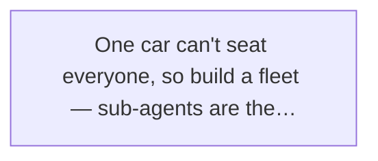
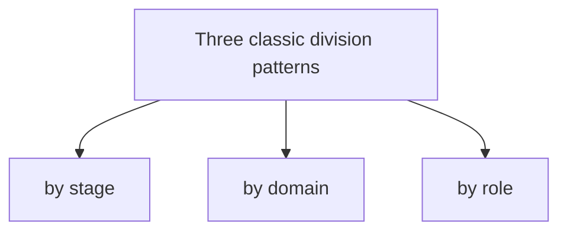
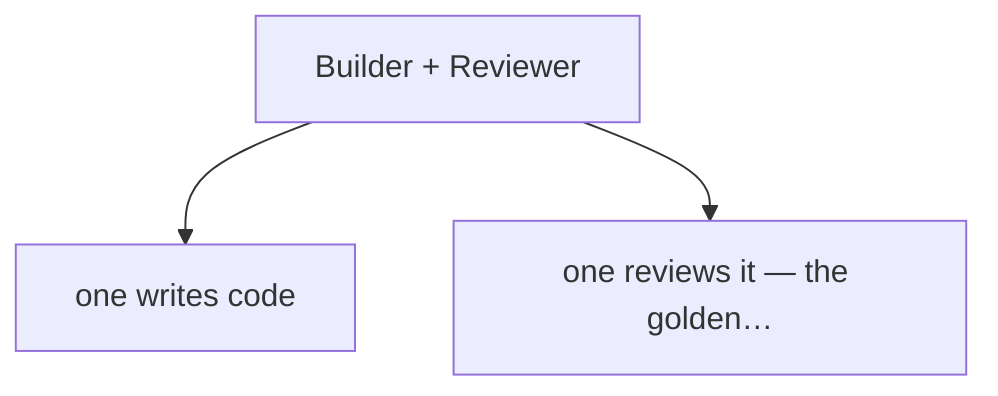
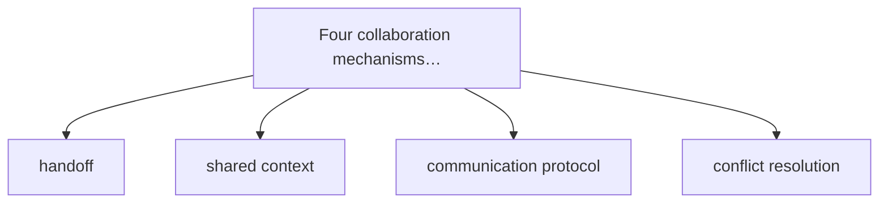
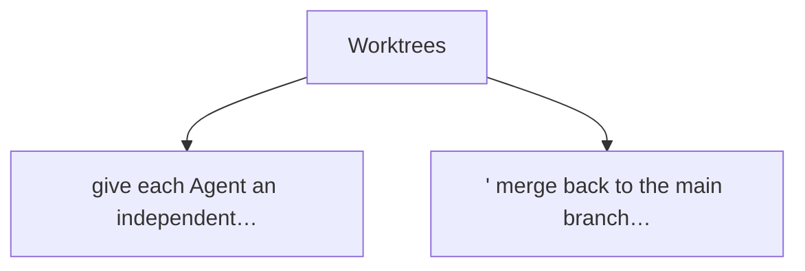
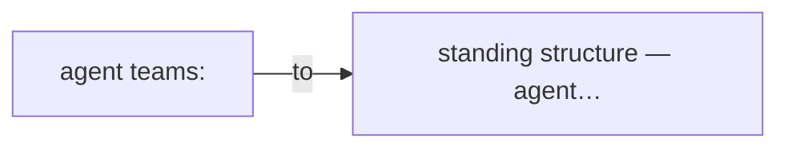
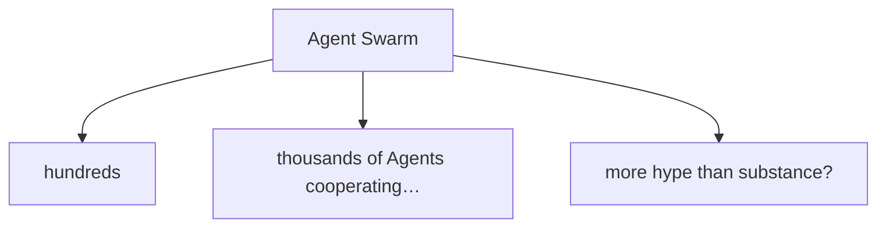

# Chapter 10

When One Can't Finish, Bring a Team (Sub-agents)

Ever get the feeling that no matter how good a single Agent is, there's always something it can't handle?

Xiaoming ran into exactly this lately.

The company wanted a new feature: an "auto weekly-report generator." Xiaomei's requirement was — employees do nothing, and the system pulls what everyone did this week from code commits, meeting notes, and the task board, shapes it into a polished weekly report, and posts it to the group chat before quitting time on Friday.

Xiaoming thumped his chest. "Easy, I'll have my Agent do it!"

Three days later, the Agent was still wrestling with the commit history.

Not that the Agent was dumb — the job was just messy. It needed a frontend page, a backend API, three different data sources, styling, and test cases. One Agent playing frontend engineer, backend engineer, tester, and PM all at once — of course it got lost.

Xiaoming scratched his head and went to Lao Wang. "Boss Wang, one Agent doesn't seem enough. This feature has too much going on — it keeps switching between frontend and backend, slow and sloppy."

Lao Wang laughed. "Just figuring that out? When one can't finish the work — bring a team."

Xiaoming's eyes lit up. "A team? You mean... several Agents working together?"

Lao Wang nodded. "Exactly. That's what we're talking about today — **sub-agents**."

## 10.1 Why Sub-agents?

### A Single Agent's Ability Is Limited

Before sub-agents, a hard truth: **no matter how capable, an Agent is limited.**

You might say: "No way, the LLM knows everything — astronomy to geography, frontend and backend alike."

True in theory, but "knowing" and "doing well" are different things.

Like asking a general practitioner to perform heart surgery — he might know the heart's basic structure, but would you let him cut? You'd want a cardiac surgeon, right?

Same with Agents. A general-purpose Agent can do a bit of everything, but nothing to the extreme. It has three built-in limits:

****Three Limitations****

**Limited context:** like human memory, an Agent's context window is finite. Frontend code, backend code, database schema, product specs, test cases all at once — it can't hold them, and if it does, it mixes them up.

**Limited attention:** an Agent can focus on one thing at a time. While writing frontend, it can't think about backend. Switching costs are high, and too much switching breeds errors.

**Limited expertise:** the LLM knows everything broadly, but a specialist Agent trained and configured for a domain will beat a general one. Like a pro photographer's shot beats a phone's.

Xiaoming nodded. "Makes sense. My Agent was like that — writing frontend, then backend, and halfway through it used a frontend variable name in the backend. Bugs everywhere."

Lao Wang said: "Exactly. Not that it's dumb, the job you gave it was too mixed. Asking one person to do five people's jobs — no wonder it failed."

### The Power of Division of Labor

So what to do? The answer: **divide the work.**

Division of labor is something human society has practiced for millennia.

In primitive times everyone did everything — hunting, gathering, clothes, houses, jack-of-all-trades. Then they noticed: some hunt well, some sew well, so let the good hunters hunt and the good sewers sew, then trade. Efficiency shot up.

That's the power of division. **Specialists beat generalists.**

Good sub-agent division lets each Agent do only what it's best at, then strings the pieces together through clean handoffs.

In software this is obvious. What real company has one person do it all? There are frontend, backend, test, and ops teams, each with its own job.

Why split so finely? Because each area runs deep; no one masters all. Frontend needs frameworks, performance, browser compatibility; backend needs databases, architecture, concurrency; testing needs methods and automation.

Same for Agents. Wanting one Agent to be frontend expert, backend expert, and test expert too — not impossible, but costly and not necessarily better.

Better to build a few specialist Agents: a frontend Agent for frontend, a backend Agent for backend, a test Agent for bugs. Each masters its slice, they cooperate — quality and speed both rise.

### The Car Metaphor: One Car Can't Seat Everyone, So Build a Fleet

Back to the self-driving-car metaphor.

We said one Agent is like a self-driving car. Tell it the destination and it drives there.

But what if your destination is moving house?

A sedan, however smart, can only carry so much. Sofa, fridge, washer, wardrobe — cram them all in? Impossible, one car won't fit.

So what do you do? **Build a fleet.**

A sedan for people, a van for furniture, a box truck for appliances, a minivan for odds and ends. Each with its role, all heading to the destination.

> Figure: One car can't seat everyone, so build a fleet — sub-agents are the Agent world's "fleet."

That's what a sub-agent is. When one Agent can't handle it, you send a team, each owning a slice, cooperating to finish.

Xiaoming mused. "So a sub-agent isn't something new, it's an organizational pattern? Like going from a solo freelancer to a company?"

Lao Wang laughed. "Good metaphor. From single Agent to multi-Agent is essentially upgrading from 'lone operator' to 'teamwork.'"

****In One Line****

Sub-agents don't make an Agent more "all-powerful"; through division of labor, a group of "specialists" finishes what one "generalist" cannot.

## 10.2 Sub-agent "Division Patterns"

Since we divide, how do we split?

Good question. Division isn't random cuts — bad cuts make things messier. Like a company with bad department lines, everyone bickers and efficiency drops.

In the sub-agent world, three patterns are common.

> Figure: Three classic division patterns: by stage, by domain, by role

### By Stage: Planner + Executor + Reviewer

The first split is by **work stage**.

Any complex thing breaks into three stages: figure out how, then do it, then check it.

Mapped to sub-agents, three roles:

- **Planner:** makes the plan. On receiving a task, analyzes the steps and their order. Doesn't do the work, only "thinks."
- **Executor:** does the actual work. The Planner says step one, the Executor does it, reports back, waits for the next instruction.
- **Reviewer:** checks quality. When the Executor finishes, the Reviewer checks for problems and whether it meets the bar. Problems get sent back; otherwise it passes.

Sound familiar? Exactly human work.

A boss takes a project, has the PM draft a plan (Planner), the dev team builds it (Executor), then the test team tests (Reviewer). Bugs go back to dev, then retest, then ship.

This pattern's strength is clear structure and clear accountability. Each Agent focuses on its segment, no need to own the whole. The Planner ignores implementation details; the Executor doesn't worry about direction; the Reviewer watches only quality.

🏭 **Assembly-Line Mode**

Dividing by stage is essentially an assembly line. The task enters left, passes planning, execution, review, exits right as a finished product. Each station owns its step.

### By Domain: Frontend Agent + Backend Agent + Test Agent

The second split is by **professional domain**.

Easier to grasp — your company's frontend, backend, and test groups are split by domain, aren't they?

Same in an Agent team:

- **Frontend Agent:** writes frontend. React, Vue, CSS, performance — its turf. Give it a design, it returns a pretty page.
- **Backend Agent:** writes backend. Schema design, APIs, architecture, tuning — its domain.
- **Test Agent:** writes test cases, runs tests, hunts bugs. Its eye sees only "is there a problem," born to fault-find.

This pattern's strength is **high specialization**. Each Agent goes deep in its domain; tools, knowledge base, and prompt are tuned for it. Same code, the frontend Agent writes better than a general one.

Xiaoming cut in. "So my weekly-report project could split like this? Frontend Agent for the page, backend Agent for the API, test Agent for functionality?"

Lao Wang nodded. "Absolutely. And it's the most common split — because it mirrors how human teams are organized, easy to grasp."

### By Role: Product Agent + Architect Agent + Dev Agent + Ops Agent

The third split is by **role and function**.

Here you might be puzzled: how's this different from by-domain?

The difference: by-domain splits "by tech stack," by-role splits "by responsibility."

For example, a PM and an architect may both not write code, but their roles differ entirely. The PM owns "what to build," the architect owns "how to build."

In a complete Agent team you can configure these roles:

****Product Agent** — requirement analysis, feature design, prioritization; knows "what."**

🏗️ **Architect Agent** — tech selection, system design, module breakdown; knows "how."

💻 **Dev Agent** — actual coding, turning design into runnable code.

🧪 **Test Agent** — quality assurance, bug-hunting, tests, release gate.

****Ops Agent** — deploy, monitor, incident response; keeps it running.**

See? A miniature internet company. Product, architecture, dev, test, ops, all in one line.

This pattern fits building a **complete product**, not a single feature. Say "build me a todo app" end to end — role division fits perfectly.

### More Isn't Better: Too-Fine Division Raises Coordination Cost

Xiaoming got excited. "Wow, so I'll spin up eight or ten Agents, each a slice — max efficiency?"

Lao Wang poured cold water. "Hold on. More people isn't always more power, and more Agents isn't always more efficient."

Agents aren't better by the dozen, just as teams aren't better by headcount — too many and coordination cost eats the gain.

Why? Because Agents must cooperate, and cooperation costs.

Think: two Agents, one communication channel. Five Agents, ten channels. Ten Agents, forty-five. More channels, more chance info gets garbled, more effort to coordinate.

****Note****

Every sub-agent added brings coordination cost. Handoffs, sync, conflict resolution — all take time and compute. Past a point, the gain from adding an Agent can't cover the added coordination cost.

That's why "three monks have no water" — not that more people is bad, but **bad organization with more people is worse**.

So how many Agents is right?

Lao Wang said: "No standard answer; depends on task complexity. Simple task, one Agent. Medium, two or three. Very complex, five or six is about the ceiling. Beyond that, think hard."

"One principle — **use as few as you can**. If one Agent suffices, don't use two. Only add people when one genuinely can't cope."

Xiaoming nodded. "Makes sense. Like our projects — more people isn't always faster; sometimes adding people slows it down."

## 10.3 Builder + Reviewer: The Classic Pair

After all the splits, Lao Wang shifted. "But if you're new to sub-agents, start simple — **a two-person combo**."

"Two people?" Xiaoming asked.

"Two. One works, one faults. That's the most classic, practical, and cost-effective sub-agent pattern — **Builder + Reviewer**."

> Figure: Builder + Reviewer: one writes code, one reviews it — the golden pairing of software development

### Builder: Gets the Work Done, Hits the Goal

First the Builder.

The Builder's job is simple — **produce the work**.

Give it a goal like "write a login page" and it grinds away — HTML, CSS, JavaScript, then hands it over.

The Builder's traits:

- **Action-oriented:** starts immediately, no dawdling. Gets the task, moves, fast.
- **Goal-driven:** only sees "finish the task," whatever's quickest and easiest.
- **Prone to carelessness:** charging ahead, it misses details. Unhandled edge cases, rough code — common.

Sound like the "action type" engineer on a team? Fast, but quality sometimes slips, needs someone to check.

### Reviewer: Finds Faults, Defaults to Doubt

Who checks? The Reviewer.

The Reviewer's job is the opposite of the Builder's — it doesn't work, it **fault-finds**.

The Builder throws code at the Reviewer. The Reviewer's first reaction isn't "is it good" but "is there a problem." Wearing "fault-finding glasses," it checks line by line:

- Any logic holes?
- Edge cases covered?
- Variable names clean?
- Security risks?
- Performance issues?
- Tests covered?

The Reviewer's mindset is — **default to doubt**. You say it's done? I don't believe it, I'll see for myself. Finding problems is my win; finding none is yours.

This "suspect everything" attitude sounds annoying, but it's vital for quality.

Never let the same Agent be both player and referee — like letting an exam-taker grade their own paper.

### Why Not the Same Agent as Player and Referee

Xiaoming asked: "Why split? Can't the Builder check itself?"

Lao Wang shook his head. "No. There's a psychology effect — 'you can't sharpen your own handle with your own knife.'"

"What?"

"Meaning, it's hard to see flaws in your own writing. When you wrote it, your brain already assumes 'this is right.' Re-checking, you follow your own logic and miss your own holes."

Xiaoming thought. "Seems true. I test my own code and it's always fine. Hand it to test and they find bugs in minutes."

"Exactly." Lao Wang said. "Not a capability issue, a **perspective issue**. The writer thinks 'how to implement,' the reviewer thinks 'where will it break.' Hard to hold both in one head."

Beyond perspective, a deeper reason — **conflict of interest**.

If the Builder reviews its own code, it's motivated to "pass fast." The work is its own; of course it wants less change, faster. Ask it to fault-find its own work — will it try?

Like grading your own exam — can you be fully objective? Hard. Human nature.

So split "doer" and "fault-finder." The Builder charges forward, the Reviewer hits the brakes. Push and pull, you get both speed and quality.

****A Quick Note****

In software engineering this is "Separation of Duties." Not just code review — many places use it. The person handling money and the person bookkeeping aren't the same, for fear of embezzlement.

### Xiaoming's Practice: Bug Rate Halved

After Lao Wang's lecture, Xiaoming went back to try.

He reworked his weekly-report project. No longer one Agent end to end; he made two: Builder-Frontend, writing frontend; Reviewer-Frontend, reviewing it.

The flow:

1. The main Agent breaks the requirement into small tasks.
2. Each task first goes to the Builder.
3. Builder finishes, hands code to the Reviewer.
4. Reviewer checks, lists problems.
5. If problems, send back to Builder to fix.
6. Fixed, resubmit to Reviewer.
7. Until Reviewer says "clean" — only then is the task done.

At first Xiaoming worried: "All this back-and-forth, won't it be slow?"

A week in, Xiaoming was stunned —

Yes, a bit slower, about 20% slower. But — **the bug rate dropped by more than half!**

Before, one Agent's code had Xiaoming finding 5 or 6 bugs per feature on average. Now Builder + Reviewer: about 2 bugs per feature. And most leftovers were requirement misunderstandings, not code bugs.

Xiaoming ran to Lao Wang. "Boss Wang, this is magic! Just one Reviewer and quality jumped this much!"

Lao Wang smiled. "Normal. Before, code shipped with no gate. Now one extra QA gate — quality has to rise. And the Reviewer specializes in this; its prompt teaches it to find bugs, far more skilled than the Builder."

"Is the 20% slowdown worth it?" Xiaoming asked.

"What do you think?" Lao Wang countered. "Before, after the Agent wrote code, didn't you spend ages testing and fixing bugs yourself? Did you count that time?"

Xiaoming slapped his forehead. "Right! How'd I forget. Before the Agent was fast, but my own bug-fixing time was huge. Now the Agent's a bit slower, but I'm spared. Overall, faster!"

Lao Wang nodded. "That's the beauty of Builder + Reviewer. One extra step looks like overhead, but overall it's more efficient — because **spending a little time on quality control up front beats reworking after things break**."

## 10.4 Sub-agent Collaboration Mechanisms

Division done, the bigger question — **how do they cooperate after the split?**

A team isn't people thrown together. It needs process, rules, communication, or it's scattered sand.

Same for sub-agents. Five Agents each doing their own, ignoring each other — guaranteed chaos. You need collaboration mechanisms.

> Figure: Four collaboration mechanisms for sub-agents: handoff, shared context, communication protocol, conflict resolution

### Handoff: How Tasks Pass Between Agents

First question: **how does a task pass from one Agent to another?**

Don't underestimate this. Bad handoff, nothing but pitfalls.

Like at work, colleague A does half and hands to B. If A just says "I'm done, you take it," B is lost — where are we, what's done, what's not, what traps, what's next?

Same between sub-agents. Handoff isn't tossing a ball; it needs a **structured handoff sheet**.

A good handoff includes at least:

📋 **Handoff Sheet**

**Task background:** what are we doing, what's the goal?
**Work done:** what I did, to what extent?
**Deliverables:** what files/code/docs I produced, where?
**To-dos:** what's next, priorities?
**Caveats:** what traps, what risks, what to watch?
**Open questions:** what's uncertain, needing the other's decision?

See? Exactly like a human team's "handoff doc."

Lao Wang said: "Handoff is where sub-agent collaboration breaks most often. Not that the Agent lacks ability, but **the info didn't get passed**. The previous Agent assumed the next knew; the next assumed the previous did — so neither did it."

"So handoffs must be **written, structured, with no fuzzy gaps**. Better one extra sentence than half a sentence short."

### Shared Context: Are They All Looking at the Same Material?

Second question: **how do multiple Agents stay consistent in what they see?**

Critical. If the frontend Agent sees requirement v1 and the backend sees v2, will their output match? No chance.

That's the "shared context" problem — all sub-agents should work from **one set of facts**.

How? Usually a few ways:

- **Single Source of Truth:** one "central repository" all Agents pull from. The requirement doc lives in one place; everyone reads that, no private versions.
- **Change broadcast:** if something changes, notify all relevant Agents. Requirement changed — tell frontend, backend, and test, not just one.
- **Context injection:** when assigning a task, inject all the context the sub-agent needs. Don't make it hunt — it'll hunt wrong.

Xiaoming cut in. "That's just our team's 'sync.' Requirement changes need a sync meeting; docs go in shared space, not everyone's own copy."

Lao Wang nodded. "Right. Every pitfall human teams hit, Agent teams hit too. Humans sync via meetings and docs; Agents via programs and protocols. Same essence."

### Communication Protocol: How Sub-agents Talk

Third question: **how do Agents communicate?**

You might say: "They're all LLMs, just chat in natural language?"

In theory yes, but in practice — **pure natural-language talk is inefficient and ambiguous**.

Like a company where all communication is chat, no email, no tickets, no docs — chaos. Words forgotten by tomorrow, misunderstandings with nowhere to appeal.

So sub-agents need a **communication protocol** — who talks to whom, in what format, how to ack, how to reply.

Common patterns:

| Pattern | Trait | When to use |
|-|-|-|
| Master-slave | all comms relayed through the main Agent; sub-agents don't talk directly | simple tasks, few sub-agents |
| Peer-to-peer | sub-agents talk directly; flexible but messy | complex collaboration, frequent talk |
| Blackboard | all write to one "blackboard," anyone reads | info-sharing tasks, multi-party |
| Message queue | send/receive via queue, async and decoupled | large Agent teams, high concurrency |

For beginners, **master-slave** is safest. All sub-agents talk only to the main Agent; no direct contact. Not the fastest, but clear, controllable, hard to break.

****Advice****

Start with master-slave. One boss (main Agent) manages a few subordinates (sub-agents): boss assigns, subordinates work and report. Simple, direct, low risk. Once skilled, try the complex patterns.

### Conflict Resolution: What If They Disagree?

Fourth question: **when Agents disagree, who decides?**

Xiaoming laughed. "Agents argue too?"

Lao Wang laughed. "Why not? With two or more Agents, disagreement comes. Builder says 'my way's fine,' Reviewer says 'no, bug here' — isn't that arguing?"

Xiaoming thought — fair point.

So when they disagree, there must be a ruling mechanism.

Common ways:

- **Main Agent decides:** simplest — rank wins. Sub-agents argue, the main Agent rules. Fast, but the main Agent may not know the details.
- **Vote:** multiple Agents vote, majority rules. Fits several same-role Agents — three Reviewers, two say bug, it's a bug.
- **Role priority:** different roles carry different weight. On quality, Reviewer's "no" is final, Builder doesn't overrule. On implementation, Builder has more say.
- **Human-in-the-loop:** truly stuck, ask a human. Most reliable, also slowest.

Lao Wang said: "In practice, usually a mix. Small issues resolved within the role; medium ones the main Agent rules; major or uncertain ones go to a human."

### The Main Agent's Role: Commander or Coordinator?

On the main Agent, Xiaoming asked: "So what does the main Agent actually do? Just issues orders?"

Lao Wang shook his head. "Not that simple. The main Agent's role depends on team size and task type."

If the team is small — two or three sub-agents — the main Agent is more a **commander**. It manages everything: how to split, who does what, when to hand off, how to resolve issues. It's PM, tech lead, and PM again.

But if the team grows — seven, a dozen sub-agents — the main Agent can't micro-manage. It must shift from "commander" to "**coordinator**."

A coordinator doesn't manage each sub-agent's work; it handles:

- Set the big direction and goals.
- Build the team structure and collaboration flow.
- Resolve conflicts between sub-agents.
- Coordinate resources and priorities.
- Control overall progress and quality.

See? Like a company's CEO. The CEO doesn't manage each employee's task; it sets strategy, builds the team, leads, sets the pace.

"So," Lao Wang concluded, "the main Agent's role isn't fixed. Smaller team, more 'executive leader'; larger team, more 'managerial leader.'"

## 10.5 Worktrees: Give Each Agent a "Workstation"

Done with collaboration, Lao Wang threw another question. "Xiaoming, if several Agents edit the same project's code at once, what happens?"

Xiaoming didn't hesitate. "Conflicts! Two Agents editing the same file, one overwrites the other's changes."

Lao Wang nodded. "Right. So for sub-agents to work together, division and collaboration aren't enough — you need **workspace isolation**."

"Workspace isolation?"

"Right. Each Agent needs its own 'desk'; they can't crowd one table."

> Figure: Worktrees: give each Agent an independent "workstation," merge back to the main branch when done

### What Is a Worktree? — An Independent Working Directory

The word Worktree comes from Git. Git has `git worktree`, letting you check out multiple branches in one repo, each with its own working directory.

Sounds twisty; plainly — **one project, several "copies" open at once, each on a different branch, no interference.**

Say your project's main branch is `main`. You can open a worktree `feature-login` for the login feature, and another `feature-payment` for payments. Two fully separate directories — you do login, I do payments, no conflict.

When each is done, merge back to main.

Borrowed into the Agent world, it means — **give each sub-agent an independent working directory**, let it work there, not directly on the main directory.

### Why Isolation: Multiple Editors of One File Collide

Why isolate? Can't they just work in one directory?

Really can't. Three reasons:

****Problems Without Isolation****

**File conflicts:** two Agents edit the same file; the later save overwrites the earlier. Like two editing one doc, you write, I write, only one version survives.
**State interference:** Agent A's half-written code gets read by Agent B, who builds on the half-finished version — guaranteed trouble.
**Unclear ownership:** when something breaks, who changed it? The file mixes several people's edits; who to blame?

Aren't these familiar? Human team development hits the same. That's why we need Git, branches, Pull Requests.

Agent teams are the same. And Agents need isolation more — they work far faster than humans, so they conflict far harder. A human takes minutes to edit a file; an Agent seconds. Two Agents running together spawn a dozen conflicts in minutes.

### Git Worktree: Isolate Workspaces with Branches

How to isolate concretely? Most commonly, Git Worktree.

The flow roughly:

1. Main Agent takes the task, cuts a new branch on the main repo, `task/xxx`.
2. Create a worktree per sub-agent, each a sub-branch, e.g. `task/xxx-frontend`, `task/xxx-backend`.
3. Each sub-agent works in its own worktree, editing its files.
4. Sub-agent finishes, commits its branch, opens a PR.
5. Reviewer Agent reviews; clean, merge to the task branch.
6. All sub-tasks done, main Agent merges the task branch to main.

See? Almost identical to human Git collaboration.

Xiaoming marveled. "This just copies our dev flow onto the Agents?"

Lao Wang smiled. "Exactly. Software engineering's decades of best practice didn't come free. Every pitfall human teams hit, Agent teams hit too. So borrowing proven collaboration patterns is the safest move."

****In One Line****

A Worktree isn't some black tech; it's the Agent world's "one desk per person." Each works at its desk, then submits the result to merge. Simple, clear, hard to break.

### Metaphor: Everyone Has a Desk, Merge to Main When Done

Let's use the office again.

Picture an office where several people build one project.

Without desks — they share one table, one doc. You write two lines, I write three, he deletes a paragraph. What's the doc like? Unreadable.

But with everyone at their own desk?

- Each works at their desk, on their own scratch paper.
- Finishes a part, thinks it's clean, copies it to the main doc.
- Before copying, asks a colleague to check for problems.
- Clean, then formally merge into the main doc.

Orderly now?

The Worktree is each Agent's "desk." The main branch is the "main doc." The Agent works at its desk; when it's about right, after review, merges into the main doc.

Xiaoming nodded. "Got it. A Worktree isn't complex — just an independent workspace per Agent, so they don't step on each other."

## 10.6 Agent Teams: From "Temp Workers" to "Standing Team"

By now Xiaoming was energized. He asked: "Boss Wang, are these sub-agents spun up per task, or a fixed team?"

Lao Wang gave a thumbs-up. "Good question. It touches the two forms of Agent teams — **ad-hoc sub-agents** and **standing teams**."

> Figure: Agent Teams: from ad-hoc grouping to standing structure — Agent teams are also "formalizing."

### Ad-hoc Sub-agents vs. Standing Teams

First, ad-hoc sub-agents.

What are they? **Created when there's a task, destroyed when it's done.**

Like temp workers on a site. Work comes, hire a batch. Done, they take pay and leave. Next work, hire again.

This form's strength is flexibility. Big task, hire more; small task, fewer. None to maintain when idle — cheap.

But the weakness is clear — **every time, re-forming from scratch**. Newcomers don't know the rules, the project background, how to cooperate. Early days are inefficient and error-prone.

What about standing teams?

A standing team is — **structure predefined; who owns what, who reports to whom, all fixed**. With or without tasks, the structure stands.

Like a company's permanent teams. Product, frontend, backend, test — fixed headcount. Work comes, all pitch in; idle, they study, optimize, build technical reserve.

This form's strength is **stable, efficient, well-rehearsed**. Together long enough, they know each other's habits and the flow; cooperation flows.

The weakness? Cost. Even idle, the team must be "kept" — Agent "keeping" is cheaper than humans, but config, maintenance, management still cost.

| Dimension | Ad-hoc sub-agent | Standing team |
|-|-|-|
| Flexibility | High, built on demand | Low, fixed headcount |
| Efficiency | Low, needs forming | High, well-rehearsed |
| Cost | Low, used then gone | Medium, needs maintenance |
| Quality stability | Unstable, luck-dependent | Stable, guaranteed |
| Best for | One-off tasks, exploration | Repeat work, long projects |

### Team Configuration: Who Owns What, Reports to Whom

A standing team needs careful structure design.

A typical software Agent team looks about like:

🏛️ Main Agent (Project Manager)
**Product Agent**
🏗️ Architect Agent
🧪 Test Lead
**Ops Agent**
💻 Frontend Agent A
💻 Frontend Agent B
⚙️ Backend Agent A
⚙️ Backend Agent B
🧪 Test Agent

See the resemblance to a human org chart?

Each role has clear duty and reporting:

- Main Agent oversees all, everyone reports to it.
- Product Agent owns requirements and feature design.
- Architect Agent owns tech choices and system design.
- Frontend, backend, test groups each have their slice.
- Ops Agent owns deploy and production stability.

Lao Wang said: "No standard team config; entirely your needs. A web team and a data team configure differently. The key — **duties clear, reporting clear**. Not everyone managing everyone, not no one managing anyone."

### Parallel Work: Multiple Sub-agents at Once

A standing team's big perk — **parallel work**.

Meaning, multiple sub-agents do different things at once, no waiting for one to finish before the next starts.

Building a new feature:

- Product Agent writes the requirement doc while Architect Agent does tech research.
- Frontend Agent writes the page while Backend Agent writes the API.
- Dev writes code while Test Agent writes test cases.

The whole project's cycle shrinks. Serial might take 10 days; parallel maybe 5.

Xiaoming's eyes lit. "This is the right way to open 'more hands, more power'!"

Lao Wang smiled. "Right. But parallel isn't automatic; it needs conditions."

What conditions?

- **Task splittable:** the task breaks into independent parts that don't clash. Strong dependencies — need the backend API before frontend can start — can't fully parallelize.
- **Interfaces first:** even parallel, agree on "interfaces" first. Frontend and backend settle the API shape, then each implements, or they won't match.
- **Timely sync:** parallel doesn't mean each alone. Sync progress and changes regularly, or find at the end everyone built something different — ugly.

### How to Avoid "Three Monks, No Water"

On parallel work, Xiaoming thought of another question. "Boss Wang, with more people, does 'three monks, no water' happen? Everyone thinks someone else will do it, so no one does?"

Lao Wang nodded. "Good question. More people do breed diffused responsibility. More Agents too."

How to avoid? Three points:

****Three Principles****

**1. Tasks to people, clear ownership:** every task needs a clear owner. Not "you all handle it" but "A owns this, B assists." Who to blame is plain.

**2. Transparent progress, regular sync:** what everyone's doing and where, all can see. A progress board, a daily standup — who's slacking is obvious.

**3. Result-oriented, clear rewards:** good work rewarded, bad punished. Agents have no feelings, but weight and priority can reflect it. Good Agents get more tasks next time; poor ones get fewer or dropped.

"Remember," Lao Wang said, "**a good team relies on mechanism, not conscience**. Human teams and Agent teams alike."

## 10.7 Agent Swarms: Is Swarm Intelligence Real?

Xiaoming suddenly remembered something. "Oh Boss Wang, I saw a term online — 'Agent Swarm,' hundreds of Agents working, swarm intelligence and all. Real?"

Lao Wang laughed. "That's the ultimate form of sub-agents — **Agent Swarm**."

> Figure: Agent Swarm: hundreds or thousands of Agents cooperating — future promise, or more hype than substance?

### What Is an Agent Swarm: Dozens or Hundreds Working Together

What's a Swarm? Literally "bee swarm" or "ant colony."

Ever watch ants? One ant is dumb, but a colony does complex things — shortest path to food, intricate nests, mass migrations. No one commands; all follow simple rules, yet the whole shows startling "intelligence."

That's "swarm intelligence" — **many simple individuals interacting by simple rules, emerging complex collective intelligence**.

Agent Swarm borrows this. Not one boss and many subordinates, but a mass of Agents, each following simple rules, finding and coordinating its own work, finishing complex tasks.

Sounds sci-fi?

More sci-fi: it's no longer a concept — people are doing it, with startling results.

### Cursor Built a Browser, Anthropic Built a C Compiler

Lao Wang gave two examples.

First, Cursor. You may know Cursor as an AI editor, but their team ran an experiment — **used many Agents cooperating to build a browser**.

Yes, a browser. Not a toy; a real one that runs web pages.

How? They spun up Agents — one wrote the HTML parser, one the CSS engine, one the JavaScript engine, one the network layer... dozens working at once, eventually assembling a working browser.

Xiaoming's jaw dropped. "That's insane! A browser is a massive project!"

"Pretty insane." Lao Wang said. "But don't marvel yet, here's the second."

Second, an Anthropic experiment — **used AI Agents to write a C compiler from scratch**.

A C compiler? One of computer science's hardest cores. Decades of top engineers built GCC and Clang to today's level.

Anthropic used an Agent Swarm — Agents dividing labor — to write a working C compiler from zero. Not as performant or mature as GCC, but functionally complete — it compiles C into an executable.

Xiaoming was speechless.

### Why These Tasks Worked: Clear Spec and Tests

After a while, Xiaoming recovered. "Boss Wang, that's amazing! So can Agent Swarms do anything now?"

Lao Wang shook his head. "Don't jump. Ever wonder — why did building a browser, writing a compiler, work?"

Xiaoming thought. "Because... the tasks are clear?"

"Right!" Lao Wang slapped the table. "That's the key. These tasks share two traits: **a clear spec, and clear tests**."

Meaning?

A C compiler has a crystal-clear spec — the C standard sits there, what each syntax means, plain. And clear tests — feed in code, run the compiled program, right or wrong shows at once.

A browser too. HTML, CSS, JavaScript all have W3C standards, clear. And tons of test cases verify each function.

In "clear spec, clear test" scenarios, Agent Swarms shine. Because:

- Each Agent knows what to build (spec is fixed).
- Right or wrong shows by test (test is fixed).
- Problems locate fast (which test failed points to which part).
- Highly parallel (each Agent implements one spec clause).

"Plainly," Lao Wang concluded, "these tasks are like Lego — each block's shape and connection predefined. A hundred people, each snaps one block, and it assembles complete. More people, faster."

### Enterprise Use Is Early: Don't Follow the Hype

"But —" Lao Wang turned. "If you think Agent Swarms are mature and ready for business, think again."

Why? Because **most real-world problems lack such clear specs and tests**.

Say you want a "product users love" — what's "love"? How defined, how tested? Unclear.

Say a "good marketing strategy" — what's "good"? High conversion? Brand lift? What's the standard?

Say a "viral article" — what's "viral"? 100k reads? How to measure content quality?

These have no standard answer, no clear spec, no automated test. You say it's right? Someone else says wrong.

Here, Agent Swarms struggle. If no one agrees "what the goal is," how divide, cooperate, verify?

****Reality Bites****

Today's successful Swarm cases cluster in "clear spec, auto-testable" fields — compilers, browsers, math proofs, game AI. Most enterprise business problems are fuzzy, open, no standard answer — Swarms can't land there yet.

And a more practical problem — **cost**.

One Agent run might cost cents. A hundred Agents? Tens of dollars a run. A thousand? Hundreds. And a Swarm doesn't run once — it iterates, trials, errors — cost climbs fast.

For an enterprise, do the returns cover the cost? Unclear.

So Lao Wang's advice:

The Agent Swarm is the future, but the future isn't here. Rather than chase the swarm hype, master a few sub-agents first. Build the foundation; when you truly need a swarm, it'll come naturally.

Xiaoming nodded. "Got it. Like martial arts — master the horse stance before dreaming of ultimate techniques."

Lao Wang laughed. "That metaphor is gold."

## Chapter Summary

This chapter covered sub-agents — "getting multiple Agents to work as a team."

We started with why sub-agents: a single Agent's three limits — limited context, limited attention, limited expertise. Division of labor is the best way past them.

Then three division patterns: by stage (Planner + Executor + Reviewer), by domain (frontend + backend + test), by role (product + architect + dev + test + ops). And we stressed — more Agents isn't better; too-fine division raises coordination cost.

Then the classic pair — Builder + Reviewer. One works, one faults. Why separate? You can't sharpen your own handle; player and referee in one body breeds trouble.

Then collaboration mechanisms: clear handoffs, shared context, communication protocols, conflict resolution. The main Agent's role shifts from "commander" to "coordinator" by team size.

Then Worktrees — an independent working directory per Agent, avoiding edit conflicts on the same file. Like everyone having their own desk.

Finally Agent Teams and Agent Swarms. From ad-hoc grouping to standing teams, from a few Agents to hundreds and thousands. And a cold splash — Swarms are cool, but enterprise use is early; don't follow the hype.

📝 **Golden Lines of This Chapter**

1. "Never let the same Agent be both player and referee — like letting an exam-taker grade their own paper."
2. "More Agents isn't better, just as more people isn't better — too many and coordination cost eats efficiency."
3. "Good sub-agent division lets each Agent do only what it's best at, then strings the pieces together through clean handoffs."

Walking out of the meeting room, Xiaoming rubbed his chin, thinking as he went:

"Sub-agents are powerful but complex. So many Agents working — when something breaks, who's to blame? How do I know what it actually did? I can't scan logs line by line every time something goes wrong."

Mid-thought, Lao Wang caught up from behind and heard Xiaoming's muttering.

Lao Wang nodded, his expression turning serious:

**Lao Wang:** Good question. A car needs a dashcam, a plane needs a black box. An Agent system needs its own "observability and audit" too.

Xiaoming froze. "Observability and audit? What's that?"

Lao Wang smiled mysteriously:

**Lao Wang:** Next chapter, we talk about observability and auditing. Then you'll know — no matter how fast and fierce an Agent works, without a "black box," you won't dare hand over the wheel.

The sunset spilled through the window down the corridor, stretching their shadows long. Xiaoming watched Lao Wang's back, suddenly feeling — the Agent world ran deeper than he'd imagined.

(End of chapter)

← Ch.9: Harness: Full Design    Ch.11: Observability and Auditing →

The Self-Driving Era: A Brief History of Agent Evolution © 2025
