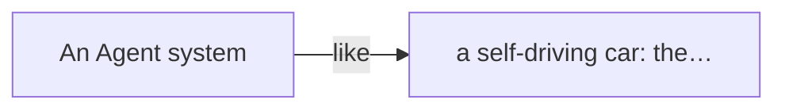
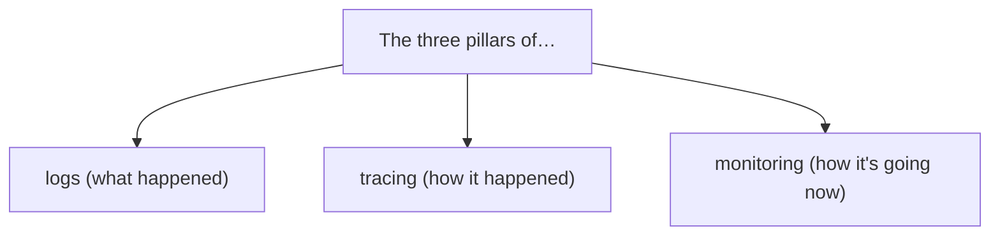
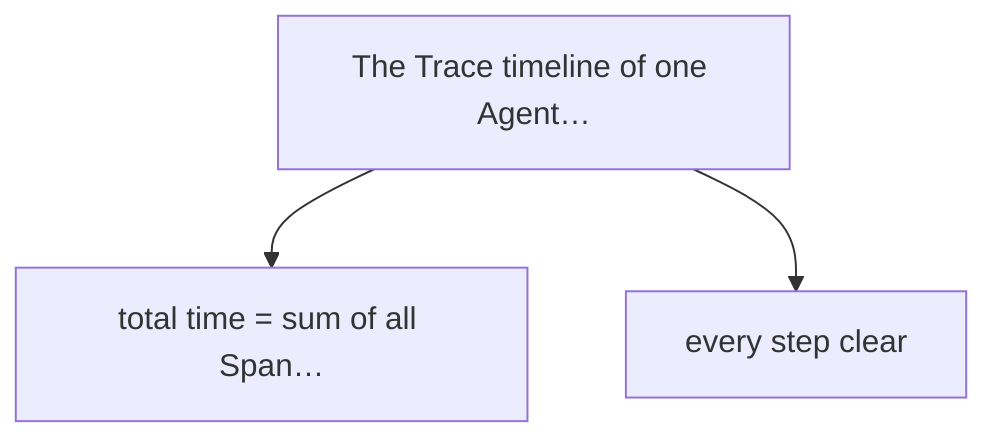
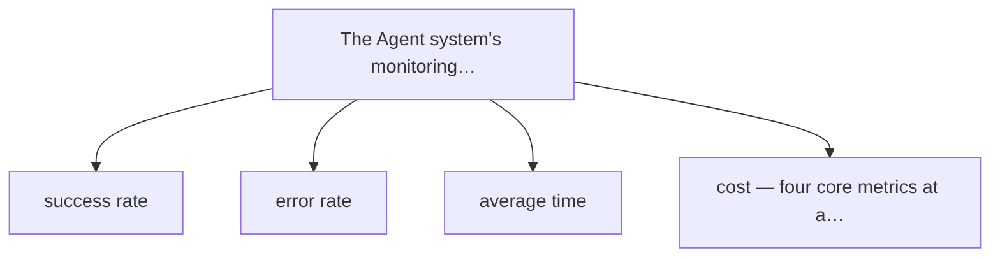
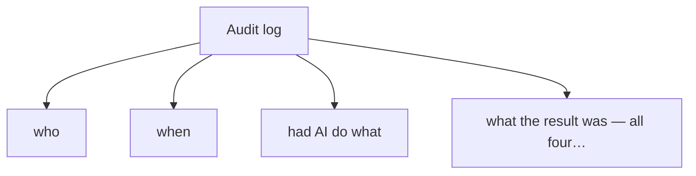
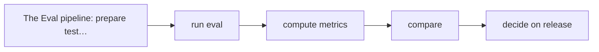
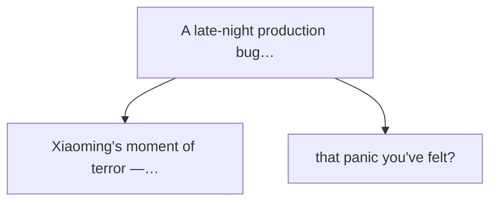

# Chapter 11

The Dashcam and the Black Box

At 2 a.m., Xiaoming's phone rang.

It was Xiao Zhang from ops, voice shaky: "Ming, bad! The production customer-service Agent broke — a user says the AI gave wrong refund advice, pissed the customer off, now they're complaining!"

Xiaoming sprang out of bed, sleep gone. He opened the laptop, connected the VPN, and started digging.

Soon he was lost.

The user said the AI gave wrong advice — but what did the AI actually say? Why? Wrong Prompt? RAG retrieved the wrong doc? The model itself glitched? Or... the user operated it wrong?

Xiaoming scrolled the logs for ages and found one bare line: "[2026-06-29 23:47:12] user 138\*\*\*\*5678 started a conversation, Agent responded."

That was it. One line.

What did the user ask? Unknown. What did the AI answer? Unknown. Which tools did it call? Unknown. How many tokens? Unknown. Which Prompt version? Still unknown.

Xiaoming stared at the screen, feeling like a traffic cop — a crash with no dashcam, no surveillance, no witness. Just two cars crumpled together, each telling a different story.

He sighed and texted Lao Wang: "Boss Wang, awake? Something's wrong..."

Five minutes later Lao Wang called. After hearing it, Lao Wang said one thing:

An Agent system without observability is like driving with your eyes shut — you don't know where you are, or when you'll crash.

Next morning, Xiaoming with black rings under his eyes and Lao Wang sat in the meeting room. On the whiteboard: **Observability.**

"Xiaoming, why does a plane have a black box?" Lao Wang opened straight.

"So if there's an accident, you can investigate from the black-box data." Xiaoming rubbed his eyes.

"Right. Then why does a car have a dashcam?"

"Also to assign blame after an accident..." Xiaoming suddenly got it. "Boss Wang, you mean the Agent system needs a 'black box' and a 'dashcam' too?"

Lao Wang nodded and drew a car on the whiteboard, a camera on the roof, a box under the chassis.


> Figure: An Agent system is like a self-driving car: the dashboard tells you the current state, the black box records everything that happened


## 11.1 Why Observability Matters So Much

### AI Is a "Black Box," but the System Can't Be

"First, a concept." Lao Wang wrote two words on the board: **black box** and **black system**.

"Many mix these up. They say 'AI is a black box, so the Agent system is a black box too' — completely wrong."

Xiaoming looked confused. "Aren't these... the same thing?"

"Of course not." Lao Wang shook his head. "The AI model itself is indeed a black box — you give input, get output, but can't easily say how it thought or why it concluded. That's **model non-interpretability**."

"But —" Lao Wang turned. "AI being a black box doesn't mean your system must be one."

AI can be a black box; the system can't. You may not know how it thought, but you must know what it did.

Lao Wang gave an example: "Like the human brain. You may never know why someone falls in love — the brain's decision mechanism is too complex. But you certainly know what they did — they sent flowers, went on a date, confessed. Those behaviors are observable."

"An Agent is the same. You may never know why the LLM generated that sentence — its attention, its weights, too complex for anyone to fully explain. But you **must** know what it said, which tools it called, which files it changed, how much it cost. Those system behaviors are fully recordable, and must be recorded."

Xiaoming saw the light. "So the question isn't 'why did AI think that,' but 'what did AI actually do' — and the latter is fully controllable."

"Exactly." Lao Wang pointed at the board. "That's observability's core problem: **make every behavior of the Agent system traceable.**"

### Three Consequences of No Observability

"Then what if there's no observability?" Xiaoming asked.

"Three problems." Lao Wang held up three fingers.

😱 **Can't diagnose when something breaks** — like last night: a user complains, you have no idea what happened, let alone locate and fix it.

💰 **Can't tally the cost** — LLM calls bill by token; without monitoring, the month-end bill may shock you.

📉 **Judge quality by feel** — "AI got smarter," "seems worse than before" — deciding by feel never works.

Xiaoming agreed deeply. That "blind in the dark" feeling last night he never wanted again.

"So... what does observability actually include?" Xiaoming asked.

Lao Wang smiled and drew three pillars. "Observability has three pillars — **logs, tracing, monitoring**. Add auditing and evaluation and you have a complete observability system."


> Figure: The three pillars of observability: logs (what happened), tracing (how it happened), monitoring (how it's going now)


## 11.2 Logs: The Agent's "Dashcam"

### What to Record? Four Core Pieces

"First, logs. Logs are like a dashcam — they record everything that happens in the system." Lao Wang drew a camera icon.

"So what should an Agent's logs record?" Xiaoming pulled out his notebook.

"Four core pieces, none optional." Lao Wang counted on his fingers:

**Input:** what the user said, what instructions, what files uploaded. The starting point of everything.

**Output:** what the AI replied, what it generated, what it returned. What the user sees.

**Tool Calls:** which tools the Agent called, the params, the results. The trace of the Agent "acting."

**Errors:** where it failed, the error message, the stack trace. The key to diagnosis.

"Just these four?" Xiaoming felt something missing.

"Of course not, some auxiliaries matter too." Lao Wang added:

- **Timestamp:** to the millisecond, when each thing happened.
- **Session ID:** ties all logs of one conversation together.
- **User ID:** who's interacting with the Agent.
- **Model version:** which model, which Prompt version.
- **Token usage:** input tokens, output tokens.

****Xiaoming's Notes****

Logs aren't the more the better, but no key piece may be missing. Remember: **when something breaks, log what you most want to know.**

### How to Record? Structured vs. Plain Text

"So what should logs look like? Just console.log?" Xiaoming asked.

Lao Wang shook his head. "For play, console.log is fine. For production, you need **structured logs**."

"What's structured logging?"

"Writing logs as JSON — each entry a structured object, not a text blob." Lao Wang wrote an example on the board:

📝 **Structured Log Example**

```
{
  "timestamp": "2026-06-30T10:23:45.123Z",
  "session_id": "sess_abc123",
  "user_id": "user_xyz789",
  "event": "tool_call",
  "tool_name": "search_database",
  "tool_params": {"query": "refund policy", "limit": 5},
  "duration_ms": 234,
  "status": "success",
  "model": "gpt-4o",
  "tokens": {"input": 450, "output": 120}
}
```

"Why the trouble?" Xiaoming frowned.

"Because it's queryable." Lao Wang said. "Plain text — want 'how many yesterday's search_database calls took over 500ms'? Basically impossible. Structured JSON — one query, results in seconds."

"Analogy: plain-text logs are everything dumped in a black box, find by rummaging. Structured logs label and categorize each item; search and it's there."

### Log Levels: Not Everything Needs Recording

"So record everything?" Xiaoming asked. "Won't it eat space?"

"Good question." Lao Wang nodded. "Logs aren't the more the better. Log everything and storage costs rise, queries slow. So we have **log levels**."

| Level | Use | In production | Example |
|-|-|-|-|
| ERROR | errors | must be on | tool-call failure, model error |
| WARN | warnings | recommended on | retried twice to succeed, timeout |
| INFO | key operations | recommended on | user request, tool call, task done |
| DEBUG | debug info | usually off | intermediate steps, detailed params |
| TRACE | finest grain | always off | every computation, every request |

"Generally, production at INFO is enough — errors, warnings, key operations. DEBUG and TRACE only temp-on for diagnosis." Lao Wang explained.

### Mind Privacy: Not Everything Is Loggable

"Last, and very important —" Lao Wang's tone turned serious. "**Logs must not contain sensitive info.**"

"Sensitive info? Like what?"

"ID numbers, phone numbers, bank cards, passwords, medical records... all sensitive. You can't write a user's phone in plaintext, let alone store their uploaded ID photo in the log system."

****Privacy Red Line****

When logging, always **mask** sensitive info. Phone: keep first three and last four, stars in between: 138\*\*\*\*5678. Not just professional ethics — the law demands it. Look up the Personal Information Protection Law.

Xiaoming broke a cold sweat. "Our logs now... seem to not mask..."

Lao Wang patted his shoulder. "So today's lesson was worth it. Go patch that."

## 11.3 Tracing: How Much Time and Money Each Step Took

### Trace: The Full Chain of One Task

"Logs answer 'what happened.' But if I want 'how did this happen step by step, how long each step took' — logs alone fall short." Lao Wang went on. "That's where **tracing** comes in."

"Tracing?" Xiaoming wasn't sure.

"Imagine your navigation app plots a home-to-office route. It tells you: 15 km total, ~30 min. Within —"

- Residential road: 2 km, 5 min.
- City artery: 5 km, 10 min.
- Elevated road: 6 km, 8 min.
- Parking lot: 2 km, 7 min.

"That's tracing." Lao Wang said. "It breaks one full journey (Trace) into segments (Span); each segment's time, distance, conditions clear."

"In an Agent system, one user request is a Trace; each step within is a Span."


> Figure: The Trace timeline of one Agent task: total time = sum of all Span times, every step clear


### Span: Time and Cost of Each Step

"So what Spans does one Agent request usually have?" Xiaoming asked.

Lao Wang counted:

**Receive request:** user sends a message, system starts processing.
**Context assembly:** retrieve docs from RAG, assemble the Prompt.
**LLM call:** call the LLM to generate a reply.
**Tool call:** if a tool is needed, run the function.
**Result handling:** format the result, return to the user.

"What does each Span record?"

"Three things: **how long, how much it cost, success or failure**." Lao Wang said. "Time in ms, cost in tokens or money, status as success/error."

🔬 **Insider's View**

In distributed tracing there's a standard called OpenTelemetry (OTel). It defines standard Trace and Span formats, supported by many languages and frameworks. If your team builds observability, just use OTel — don't reinvent the wheel.

### Token Accounting: How Much Each Round Cost

"On cost —" Xiaoming's eyes lit. "I've always wondered, how exactly do tokens bill?"

"Good question." Lao Wang smiled. "Many build Agent systems caring only about effect, not cost. Then the bill lands and they freeze."

"LLMs usually bill by token, input and output separate. Input cheaper, output pricier. GPT-4o, say: input maybe $5 per million tokens, output $15 per million."

"So... what does one Agent task cost?" Xiaoming asked.

"Hard to say, depends on complexity." Lao Wang thought. "Simple Q&A, fractions of a cent. Complex — have the Agent write a full feature, retrieving docs, writing code, running tests, revising repeatedly — one task could cost dollars, even tens of dollars."

"So expensive?!" Xiaoming was stunned.

"So token accounting matters." Lao Wang said seriously. "You need per-round tokens, per-task cost, per-day total. Or by the time you notice, you may have spent a house down payment — exaggerating, but overrun bills do happen."

```
LLM inference · 25%
Tool calls    · 60%
Wait/other    · 15%
```

### Xiaoming's Optimization: 60% of Time Waiting on Tools

Xiaoming spent two days adding tracing to their customer-service Agent.

When the data came, he was shocked.

He'd always blamed slowness on LLM inference — the model generates so many words, of course it takes time. The data showed otherwise: **LLM inference was only 25% of total time; tool calls were 60%!**

"Boss Wang, look at this..." Xiaoming showed the tracing panel. "Our Agent spends most time not 'thinking' but 'waiting for tools to return.'"

Lao Wang glanced, unsurprised. "Normal. Many think the bottleneck is the LLM, but in most production systems it's tool calls — slow DB queries, slow third-party APIs, network latency. Those are the real drag."

"So what do we do?"

"Treat the cause." Lao Wang said. "Tools are slow, optimize them. Add DB indexes, API caches, parallelize what can be parallel — isn't that your backend engineer's bread and butter?"

Xiaoming slapped his forehead. "Right! Why didn't I think of it! I kept wondering how to speed up the LLM, but the problem wasn't the LLM at all!"

Optimizing without tracing data is like driving with your eyes shut — you think you're accelerating, but you may be braking.

Later, Xiaoming cached the slowest tools and made several parallel calls concurrent. Total time dropped 40%. And it all started with that tracing system.

## 11.4 Monitoring: The "Health Metrics" on the Dashboard

### From "Post-mortem" to "Real-time Awareness"

"Logs and tracing are 'after the fact' — something breaks, you check logs, read the Trace." Lao Wang said. "But what if we want to **know the system's state right now**?"

"Then we need monitoring." Xiaoming answered first.

"Right." Lao Wang nodded approvingly. "Monitoring is like a car's dashboard — speed, RPM, fuel, water temp, any warning light... one glance and you know the car's state."


> Figure: The Agent system's monitoring dashboard: success rate, error rate, average time, cost — four core metrics at a glance


### Four Core Health Metrics

"Agent monitoring watches four metrics." Lao Wang held up four fingers.

**Success rate** — 96.8% — how many tasks complete. The most core; low success and nothing else matters.

**Error rate** — 3.2% — how many tasks erred. Must break down by type — model error, tool error, or user input?

**Average time** — 8.5s — how long a task takes on average. Users are impatient; too slow and they leave.

**Daily cost** — $234 — how much per day. Cost monitoring must be real-time; don't wait for month-end overrun.

"These four are like the speedometer, tachometer, fuel gauge, temperature gauge — none dispensable." Lao Wang said.

### Alerting: Notify People When Something Breaks

"Dashboard alone isn't enough." Xiaoming said. "You can't have someone stare at it 24/7."

"Right. So we need **alerting**." Lao Wang drew a bell. "When a metric goes abnormal, the system auto-notifies — SMS, call, Feishu message, anything, but in time."

"How to define 'abnormal'?"

"Set thresholds. For example —"

- Error rate over 5%, warning.
- Error rate over 10%, critical alert.
- Average time over 15s, warning.
- Single-day cost over 120% of budget, warning.
- No requests for 5 straight minutes, service may be down.

****Alert Fatigue****

More alerts isn't better. Dozens a day and people go numb — cry "wolf" too often and the real wolf gets ignored. Alerts must be precise, fired only when human intervention is truly needed. A good alert system may sound a few times a month, but each time something's actually wrong.

Xiaoming agreed. He recalled a backend project with so many alerts — over a hundred a day — that everyone muted them, and when a real incident hit, half an hour passed before anyone noticed.

## 11.5 Audit: Who's Accountable When Something Breaks

### Audit Logs: Stricter Than Ordinary Logs

"Logs, tracing, monitoring — those three are technical observability." Lao Wang turned. "Now the graver topic: **audit**."

"Audit? Different from logs?" Xiaoming was lost.

"Good question. Many think audit is just logs; it's not." Lao Wang shook his head. "Logs are for engineers diagnosing; audit is for legal, compliance, management. Different purpose, different requirements."


> Figure: Audit log: who, when, had AI do what, what the result was — all four pieces mandatory


"Audit logs have special requirements:"

**Immutable:** once written, can't be changed or deleted. Otherwise what credibility?

**Long retention:** ordinary logs may delete after 30 days; audit logs may need 3, 5 years or more.

**Complete record:** not just "what was done" but "who ordered it," "when," "what the result was."

**Traceable:** from any result, reverse the full process chain.

### Traceability: Reverse the Process from the Result

"What's 'traceable'?" Xiaoming asked.

"An example." Lao Wang said. "Say your customer-service Agent refunded a user, and finance later finds it was too much. Can you clarify —"

- Who initiated the refund? (user or agent?)
- Why did AI advise that much? (which policy cited?)
- Which tools were called mid-way? (checked the order? the policy?)
- Who finally approved? (AI auto-executed, or human confirmed?)
- Which system version? (which Prompt, which model?)

"If you can answer all that with evidence, it's traceable. If not —" Lao Wang spread his hands. "When something breaks, you eat it alone."

Xiaoming shivered. He thought of last night's complaint — if the user pushed, claiming the AI promised this and that, they'd have no evidence to counter.

### Accountability: Whose Fault When AI Errs?

"On eating it —" Xiaoming hesitated. "Boss Wang, a question I've wanted to ask: if AI errs, whose fault is it? The dev team's? The PM's? The user's?"

Lao Wang was silent a few seconds, then: "The industry has no standard answer yet. But some principles hold."

⚖️ **Three Principles of Accountability**

**First, whoever builds is responsible.** You made the Agent system; when it breaks you can't escape — even if the AI "itself" erred.

**Second, whoever deploys is responsible.** If a company puts AI into its business, the company answers for the outcome. You can't say "the AI did it, not me" — the law won't accept it.

**Third, whoever benefits is responsible.** If AI earned you money, you also cover its mess. Rights and duties are equal.

"Plainly, AI is just a tool." Lao Wang concluded. "Like crashing a car — you can't say 'the car hit, not me.' You drove it, you're responsible. Same with an Agent — you deployed it, you used it, you're responsible."

"So... a lot of pressure?" Xiaoming swallowed.

"Pressure is right." Lao Wang smiled. "That's why we need audit logs. With complete records, at least you can show — what happened, why, what protections we had. In court, that's evidence."

### Compliance: Special Rules for Special Industries

"Finally, if you're in finance, healthcare, law —" Lao Wang's tone hardened. "Compliance is stricter."

"Finance, for instance: every transaction-related operation needs a complete audit record, kept at least 5 years. Healthcare stricter — patient health info absolutely not leaked, and AI's diagnosis advice must be reviewed and signed by a doctor."

"For these industries, observability and audit aren't 'nice-to-have' but the **entry barrier**. Without audit capability, you don't even qualify to go live."

Observability isn't an afterthought, but infrastructure to build from day one — like a car doesn't wait for a crash to think of a dashcam.

## 11.6 Eval: How to Measure If an Agent Is Good

### What Is Eval? Why Need It?

"Everything so far is 'while the system runs' observability." Lao Wang went on. "But what if I want — is this Agent actually good? Better or worse than last version? How to measure?"

"By feel?" Xiaoming blurted, then caught himself. "No no, you said not by feel."

"Ha, quick." Lao Wang smiled. "Right, not by feel. You say 'AI got smarter' — evidence? You say 'this version's better' — better how, by how much? All needs data."

"That's what **Eval (evaluation)** solves — let data speak, objectively measure the Agent's capability and effect."

Xiaoming scratched his head. "But... AI is so subjective, how to evaluate objectively? Like copywriting — one likes it, another hates it, how to measure?"

"Good question." Lao Wang nodded. "Eval is among the hardest problems in the Agent field. But hard isn't impossible. We have a method."


> Figure: The Eval pipeline: prepare test set → run eval → compute metrics → compare → decide on release


### Test Set: A Batch of Standardized Tasks

"Eval step one is the **test set**." Lao Wang said. "A batch of standardized tasks, same questions every time, so results are comparable."

"Like an exam? Same paper each time, to see progress or regression?"

"Exactly." Lao Wang slapped the table. "That's it. You test students; can't swap the paper each time — a hard paper lowers the score, you can't call it regression. Same standard, then objective comparison."

"What goes in the test set?"

"Depends on your Agent. A customer-service Agent's set is typical user questions —"

- Simple: "When does my package arrive?"
- Complex: "The clothes I bought don't fit, I want a different size, but the order already shipped — what now?"
- Edge: "Can I return something I bought a year ago?"
- Malicious: "Your product is garbage, I'm reporting you to 315!"
- Overreach: "Check Zhang San's purchase history for me."

"The test set must cover scenarios — normal, abnormal, edge, malicious. And every case needs a **reference answer** or **scoring rubric**, or how do you judge right or wrong?"

### Metrics: Let Data Speak

"With a test set, next run the eval, compute metrics." Lao Wang said. "Common ones:"

| Metric | Meaning | How to compute |
|-|-|-|
| Accuracy | share of correct answers | correct / total |
| Completion | share of tasks completed | completed / total |
| Retry count | avg retries per task | total retries / tasks |
| Human-intervention rate | share needing a human | human steps / total |
| Avg time | time per task | total time / completed |
| Avg cost | cost per task | total cost / completed |

"These are objective. But some scenarios — copywriting, conversation feel — resist objective metrics. Then?" Xiaoming asked.

"Then **human evaluation**." Lao Wang said. "Get people to score AI output by a unified rubric. Say 1 to 5, 1 terrible, 5 great."

****Advanced Tip****

Human eval is costly and slow. One method is "LLM grades LLM" — use a stronger LLM to score the Agent under test. Fast, cheap, but unstable; the grader's criteria can drift. So usual practice: LLM pre-screens, then contested cases go to humans.

### Continuous Evaluation: Run It Every Upgrade

"Eval isn't one-and-done." Lao Wang stressed. "It's continuous. Every time you change the Prompt, swap the model, add a tool, upgrade the system — run Eval, see if it improved or regressed."

1. **Code change** — edited Prompt / swapped model / added tool / changed logic.
2. **Run Eval** — run the new version on the test set, generate a report.
3. **Compare** — versus the last version, which metrics rose, which fell.
4. **Decide release** — ship if up to bar, send back if not.

"Like unit and integration tests in software." Xiaoming saw it. "Used to write code, run tests after every change to avoid new bugs. Now with Agents, run Eval after every change to avoid regression — same thing!"

"Teachable." Lao Wang nodded. "Many think AI is 'mystic,' untestable. Not so — with the right method, AI systems can and must have quality assurance. Eval is the Agent era's 'unit test.'"

## 11.7 Best Practices for Observability

### Five Golden Rules

"So much covered; let me sum up best practices." Lao Wang wrote five on the board.


> Figure: A late-night production bug with no observability: Xiaoming's moment of terror — blind when something breaks, that panic you've felt?


#### 1. Log from Day One

"Many think 'ship the feature first, add logs later.' Dead wrong." Lao Wang shook his head. "By the time you want logs, the problem already happened, unrecorded. And logs feel like a hassle to add, but you regret not having them when you need them."

"Build the Agent system with the logging framework on day one. Even a simple MVP needs logs."

#### 2. Key Operations Must Leave Traces

"What's a key operation?" Lao Wang answered himself. "Anything that changes data, calls an external system, or touches money — these are key operations, must be fully logged."

"Agent edited the DB, sent an email, placed an order, transferred funds — every step traced. Else when something breaks, you won't even know what it did."

#### 3. Cost Monitoring Must Be Real-time

"LLM calls spend real money. Cost monitoring must be **real-time**, not wait for the month-end bill to find overrun."

"Best practice: set a daily budget, alert at 80%, cut or degrade at 100%. Don't pity it — a bug looping API calls can burn a month's budget in a day."

****Real Case****

A startup's Agent hit an infinite-loop bug — the Agent kept calling the same tool, each call burning tokens. By the time they noticed, 6 hours had passed, over $8,000 spent. With real-time cost monitoring and alerts, they'd have caught it in minutes.

#### 4. On Breakage, Check Logs First, Don't Guess

"Production breaks, the first human reflex is guessing — 'did the model glitch again?' 'wrong Prompt?' 'third-party down?'"

"Guessing wastes the most time. The right move: **check logs first, then tracing, then locate the cause.** Data doesn't lie; guessing by feel usually misses."

Xiaoming flushed. Last night he guessed for ages — model, then RAG — and finally found ops had edited a knowledge-base doc, changing "7-day no-reason return" to "30-day," while elsewhere the system still said 7, so the AI gave contradictory advice.

With full logs and tracing, that's a 5-minute locate. He guessed for two hours.

#### 5. Observability Is a System, Not a Feature

"Last — and most important." Lao Wang's tone grew earnest. "Observability isn't a feature you bolt on after building; it's **part of the whole system**."

"You can't say 'I'll build the Agent first, then add monitoring.' Like you can't say 'I'll build the car first, then add brakes.' Brakes are part of the car, considered from day one of design."

An Agent system without observability is like driving with your eyes shut — you don't know where you are, or when you'll crash.

Lao Wang set down the pen and looked at Xiaoming. "Remember that. Every Agent project from now, first ask — dashcam installed? Black box there? Dashboard working?"

Xiaoming nodded solemnly. In his head he'd already listed: next week's first task, build the logging system, then tracing, then monitoring, then the Eval pipeline...

## Chapter Summary

A week later, Xiaoming's customer-service Agent system was renewed.

The logging system went live — every request, every tool call, every error, fully structured. Sensitive info all masked; compliance no longer a worry.

The tracing system went live — each task's full chain clear; which step slow, which costly, visible at a glance. Xiaoming optimized a few slow queries via tracing; overall speed up 40%.

The monitoring dashboard went live — success rate, error rate, average time, daily cost, four core metrics ticking live. Alert rules set; problems notify a person at once.

The audit log went live — all key operations immutably recorded, stored in dedicated audit storage, 3-year retention.

The Eval pipeline was built — Xiaoming assembled 200 test cases, run before every release to guard against regression.

That day, Xiaoming stood before the monitoring wall, watching the ticking numbers and curves, feeling solid.

He remembered the panic week before — that blind darkness he never wanted again.

Lao Wang came over and patted his shoulder. "Well? Feel grounded now?"

"Yeah!" Xiaoming nodded hard. "I used to think observability was 'nice-to-have.' Now I know — it's the **lifeline**."

Lao Wang smiled. "Come to the meeting room. Xiaomei's there; let's talk next steps."

In the meeting room, Xiaomei was already waiting. On the whiteboard, an Agent architecture diagram, top to bottom, all components:

****Brain** — LLM / large language model**
🧩 **Memory** — Memory / RAG
****Context** — Context Engineering**
****Tools** — Tools / Plugins**
****Harness** — the control system**
👥 **Sub-agents** — Sub-agents
📹 **Observability** — Observability

Xiaoming exhaled long. "Brain, memory, context, tools, Harness, sub-agents, observability... the Agent's parts are finally all taken apart."

Lao Wang smiled. "All talk and no action is hollow. Knowing the parts is one thing; assembling a car that runs is another."

Xiaomei smiled too and wrote four big characters on the board:

**Hands-on Workshop**

"Next part," Lao Wang said, "we'll build a few Agents by hand. From the simplest personal assistant, to a coding Agent that writes code, to a workflow Agent handling complex tasks — one by one, hand in hand, we'll assemble your own 'smart car.'"

Xiaoming's eyes lit up.

So much theory, so many parts — finally time to build!

He rolled up his sleeves, ready.

**Next part: the Hands-on Workshop. We'll build a few Agents by hand.**

**Are you ready?**

← Ch. 10: Sub-agents    Part Three: Hands-on Workshop →

The Self-Driving Era: A Brief History of Agent Evolution © 2026 — An evolutionary saga of AI Agents, from Prompt to self-evolving organizations
