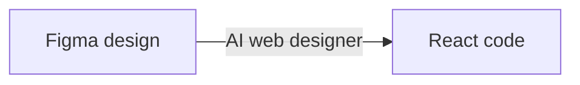
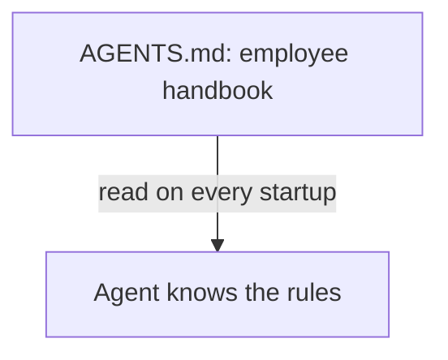
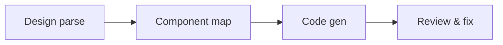
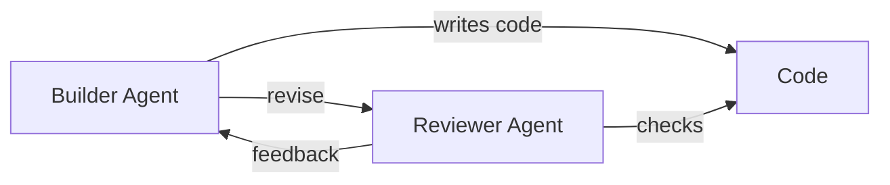
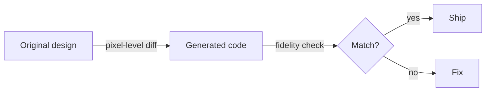
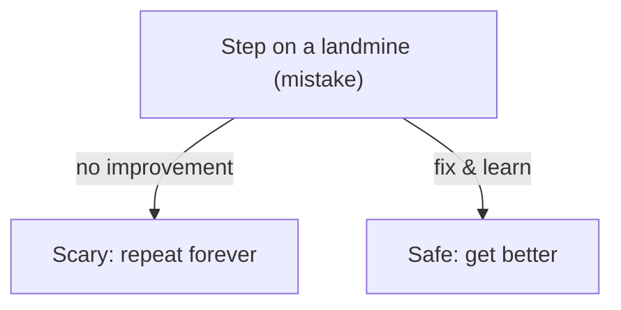
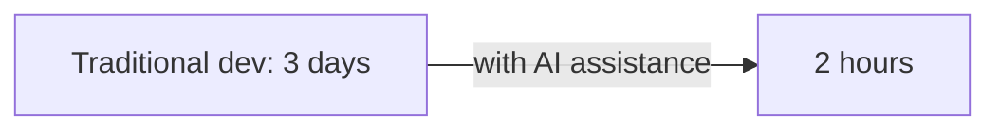

# Part Three · Hands-on Workshop

# Chapter 12

## From Figma to Code: An End-to-End Build

*Case study: the AI web designer*

After eleven chapters of theory, Xiaoming finally lost patience. "Lao Wang, all talk and no action is useless — can't we actually build something for real?" Lao Wang smiled. "Hold on. I'll get you started. Let's begin with the most common request there is — turning a design into code."

## 1. The request arrives: Xiaomei needs a campaign page

Monday, 9 a.m. Xiaoming had barely sat down with his coffee when Xiaomei came rushing over.

**Xiaomei:** Xiaoming! Emergency! We need a 618 campaign page live next Monday. The design is already in Figma — when can you deliver?

**Xiaoming:** (nearly spits out his coffee) Wait, next Monday? Today *is* Monday! You mean seven days?

**Xiaomei:** Not seven days — live next Monday! In between there's integration, testing, requirement changes… you know how it goes.

**Xiaoming:** (internally collapsing) Then… I'll try to get you a first draft by Friday…

After Xiaomei left, Xiaoming slumped in his chair and stared at the dense Figma file with a long sigh. This campaign page was no small thing: top nav, hero banner, countdown, product grid, coupons, rules, footer… a dozen modules large and small.

He knew the traditional flow by heart:

- **Day 1:** Designer produces the visual → frontend builds the skeleton → writes base styles.
- **Day 2:** Implements components one by one → finds the design is ambiguous → checks with the designer.
- **Day 3:** Keeps writing components → designer says change this → after changing it, says change that too.
- **Day 4:** Finally done → integrates the API → data format is wrong → rework.
- **Day 5:** Tunes responsiveness → mobile layout breaks → keeps fixing.
- **Weekend overtime:** Change requirements, tune details, run through QA.

"Every campaign page feels like a war," Xiaoming muttered to himself. "If only I could generate code straight from Figma…"

No sooner had he said it than his eyes lit up. Right! He'd been studying Agents lately. Why not build an **"AI web designer" Agent** that reads the Figma file directly and generates React code on its own?

The more he thought about it, the more excited he got. He didn't even finish his coffee — he ran straight to Lao Wang's desk.

**Xiaoming:** Lao Wang, Lao Wang! I've got a bold idea!

**Lao Wang:** (sips his tea slowly) Let's hear it.

**Xiaoming:** Xiaomei needs a 618 campaign page. I want to build an Agent that reads the Figma design directly and auto-generates React code! Wouldn't that turn days of work into a few hours?

**Lao Wang:** (puts down the cup, eyes lighting up) Hmm… not a bad idea. So how do you plan to do it?

**Xiaoming:** I… I'd just tell the LLM "turn this Figma design into React code," and that's it, right?

**Lao Wang:** (laughs out loud) Kid, you're still so green. You think one sentence gets it done? Then tell me: what stack does the generated code use? CSS or Tailwind for styling? How do you split components? What naming convention? How do you do responsiveness?

**Xiaoming:** (stunned) This… there's that much to it?

**Lao Wang:** Of course. Building an Agent is like building a car — you don't just bolt on an engine and expect it to drive. Come on, I'll walk you through it. We start with the basics — **defining the responsibility boundary**.


> Figure: The AI web designer — turning Figma designs into React code


## 2. Step one: define the Agent's "responsibility boundary"

Lao Wang pulled over a whiteboard and picked up a marker.

**Lao Wang:** Before you build any Agent, the first thing isn't writing code — it's figuring out clearly **what this Agent does, and what it does not do**. Driving is the same: you need to know where the destination is and where the car's performance limits are.

**Xiaoming:** You mean, draw a circle around the Agent first?

**Lao Wang:** Exactly! And draw it clearly. Most people fail at Agents because they expect too much — they want it to do everything, so it does nothing well.

Lao Wang drew a big circle on the whiteboard and wrote three lines inside it.

### What the Agent does

- **Read the Figma design:** Pull layer info, style data, and annotations through the Figma API.
- **Generate React components:** Translate the design into React + TypeScript + Tailwind CSS code.
- **Preserve visual fidelity:** Colors, fonts, spacing, and layout should match the design as closely as possible.
- **Produce responsive layouts:** Display correctly on desktop, tablet, and phone.
- **Basic interactivity:** Buttons have hover effects, carousels rotate, forms accept input.

### What the Agent must not do

**The forbidden list**

The Agent must never touch any of the following:

- **Change requirements:** Build exactly what the design specifies; don't alter content on its own.
- **Change the design:** Don't "improve" the design because you think it looks better.
- **Connect to backends:** Frontend only; use mock data instead of real APIs.
- **Complex business logic:** Ordering, payment, login — none of it.
- **Cross-page navigation:** Single page only; no routing, no multi-page.

**Xiaoming:** Why so many restrictions? Wouldn't it be better to let the Agent do more?

**Lao Wang:** Think about it — would you hand a newly licensed driver a truck for a long-haul trip? Same with an Agent: **the narrower the responsibility, the higher the success rate**. Get it good at one thing first, then add capabilities slowly.

**Xiaoming:** Makes sense… but how do we tell if it's doing well?

**Lao Wang:** Good question! That's step three — define the success criteria. Without standards, how do you know if the Agent is doing well?

### Define the success criteria

| Dimension | Pass | Excellent |
|-|-|-|
| Visual fidelity | > 80% | > 90% |
| Responsive layout | Works on desktop | Works on phone / tablet / desktop |
| Code quality | Runs | Clear structure, maintainable |
| Component split | Basic split | Reasonable granularity, reusable |
| Generation speed | < 4 hours | < 2 hours |

Xiaoming looked at the whiteboard, thoughtful. So building an Agent isn't a gut call — you think through the boundaries and goals first.

> From design to code, AI doesn't replace the designer. It becomes the "design executor."

## 3. Step two: build the Context — show the designer the right things

With the responsibility boundary clear, the next step is preparing the Agent's "context." Lao Wang said this is like hiring a new designer: you have to tell them the company's design spec, tech stack, and code style, or the work won't fit.

**Lao Wang:** Xiaoming, when a frontend engineer gets a requirement, what information does their brain need before they can start coding?

**Xiaoming:** Well… you need the design, obviously. Then the tech stack — React or Vue? What styling approach? Plus code conventions, file structure…

**Lao Wang:** Exactly! What a human needs to know, an Agent needs to know too. That's its "Context." Give it none of this and it can only guess.


> Figure: AGENTS.md — the Agent's "employee handbook," read on every startup


### Design spec: the designer's "aesthetic baseline"

Lao Wang said the design spec is the most important Context. Like every company has its own design language, the Agent needs to know this project's "aesthetic baseline."

- **Color system:** Primary, secondary, text, background, status colors… give hex values and usage.
- **Font spec:** What font for headings, what for body, size scale, line-height, weight.
- **Spacing system:** A 4px / 8px / 16px / 24px / 32px spacing scale.
- **Component library:** Is there an existing one? What do Button, Card, Input look like?
- **Radius and shadow:** How rounded? What shadow style?

### Tech stack: the engineer's "toolbox"

The design alone isn't enough — you also tell the Agent what to build with.

**Tech stack requirements**

```
// Framework: React 18+
// Language: TypeScript
// Styling: Tailwind CSS v3
// Component library: Ant Design 5.x
// Icons: @ant-design/icons
// Build tool: Vite
// Package manager: pnpm
// Other requirements:
// - Use functional components + Hooks
// - Use CSS Modules or Tailwind, not inline styles
// - Component files use the .tsx extension
// - Complete type definitions, no any
```

### Code conventions: the team's "traffic rules"

Code conventions matter too. Without them, every Agent writes in a different style — like every driver inventing their own rules, and the road turns to chaos.

- **File structure:** Where do components go? Styles? Type definitions?
- **Naming:** PascalCase for components? camelCase for variables? UPPER_SNAKE_CASE for constants?
- **Comments:** Where are comments required? What format?
- **Import order:** Third-party libraries first, then internal components?
- **Props order:** `className` first? `key` at the very front?

### Make it an AGENTS.md: read on every startup

**Lao Wang:** You don't want to stuff all this into the Prompt every time — too much hassle. The clean way is an **AGENTS.md** file at the project root.

**Xiaoming:** AGENTS.md? What kind of file is that?

**Lao Wang:** Just as a project's README.md is for humans, AGENTS.md is the "employee handbook" written specifically for the Agent. Every time the Agent starts, the first thing it does is read this file to learn all the project's conventions.

**Xiaoming:** Wow, that's a great idea! So what goes in it?

**Lao Wang:** Here, let me show you a template.

**AGENTS.md**

```
# AI Web Designer Agent Handbook

## Role
You are a professional frontend engineer who turns Figma designs into high-quality React component code.

## Core Principles
1. Fidelity first: implement strictly to the design, do not modify it on your own.
2. Code quality: clear structure, consistent naming, complete comments.
3. User experience: consider responsiveness, accessibility, interaction feedback.

## Tech Stack
- React 18 + TypeScript
- Tailwind CSS v3
- Ant Design 5.x
- Vite build

## Design Spec
- Primary: #1677ff
- Success: #52c41a
- Warning: #faad14
- Error: #ff4d4f
- Font: -apple-system, BlinkMacSystemFont, "Segoe UI"
- Base size: 14px
- Spacing: 4 / 8 / 12 / 16 / 24 / 32 / 48px

## File Structure
src/
  components/   # reusable components
    Header/
    Banner/
    ProductList/
    Footer/
  pages/        # page components
  types/        # type definitions
  utils/        # utility functions
  assets/       # static assets

## Code Conventions
- Component names: PascalCase (e.g. ProductCard)
- Functions/variables: camelCase (e.g. handleClick)
- Constants: UPPER_SNAKE_CASE (e.g. MAX_COUNT)
- Each component has a function comment above it
- Props must have complete TypeScript types
- Do not use the any type
```

> A good AGENTS.md beats a hundred ad-hoc Prompts — it is the Agent's "employee handbook."

## 4. Step three: attach the tools — the designer's "toolbox"

With context in place, the Agent still needs tools. Just as a designer needs Figma, Photoshop, and a slicing tool, and a frontend engineer needs VS Code, a browser, and debuggers, an Agent needs its own toolbox.

1. **Figma API** — Reads layer structure, style properties, and annotations from the design. The Agent's "eyes."
2. **File operations** — Creates component files, writes code, builds directory structure. The Agent's "hands."
3. **Browser preview** — Opens the result in a browser after code generation. The Agent's "mirror."
4. **Image download** — Pulls image assets from the design to local disk. The Agent's "mover."

### Figma API: the Agent's "eyes"

Figma exposes a rich API that can read almost everything about a design. Lao Wang listed the most useful endpoints:

- **GET /v1/files/:key** — Get the whole file structure: all pages, layers, components.
- **GET /v1/files/:key/nodes** — Get detailed info for specified nodes.
- **GET /v1/images/:key** — Get image export URLs for layers.
- **GET /v1/files/:key/styles** — Get all styles defined in the file.
- **GET /v1/files/:key/components** — Get the component library in the file.

**Tip:** Don't pull the entire Figma file at once — the payload is huge. First get the file structure, find the target page and Frame, then read details on demand. A human doesn't stare at the whole design at once either; they scan the whole first, then zoom into details.

### File operations: the Agent's "hands"

The Agent generates code — it has to write it to files. That needs file-operation tools:

- **Create directories:** Build folders per the structure in AGENTS.md.
- **Write files:** Write generated component code into `.tsx` files.
- **Read files:** Read existing files and edit them, rather than rewriting each time.
- **Rename/move:** Adjust the file structure.
- **Run commands:** Execute `npm run dev`, `npx tsc`, and the like.

### Browser preview: the Agent's "mirror"

After writing code you have to see if it's right — that's the browser-preview tool. Lao Wang said the advanced version can even take a screenshot and do a pixel-level comparison against the design.

**Xiaoming:** Pixel-level comparison? That good?

**Lao Wang:** Of course. Open the page with Playwright or Puppeteer, screenshot it, then compare against the design with a pixel tool to compute fidelity. We'll come back to that in quality assurance.

## 5. Step four: design the workflow — the full path from design to code

Context and tools are ready. The most important step comes next — **designing the workflow**. Lao Wang said this is like a car's navigation system: you plan the route from start to finish, or the Agent just wanders.


> Figure: The four-stage workflow from Figma design to code


Xiaoming's "AI web designer" Agent uses a four-stage workflow, like building a house: read the blueprint, break down the structure, build piece by piece, then do the finishing.

**Stage 1**

#### Analyze the design: understand it before you touch it

The first step with a design isn't writing code — it's "reading" the design. The Agent scans the whole thing first and works out:

- What are the main modules? (Header, Banner, product grid, Footer…)
- What's the overall layout? (vertical stack? side-by-side columns? grid?)
- What elements repeat? (button styles, card styles, heading styles…)
- What's an image, what's text, what's an icon?

Finally it outputs a "design analysis report" listing the modules and the layout structure.

**Xiaoming:** This step sounds redundant. Can't we just start?

**Lao Wang:** Don't you look at the design and gather your thoughts before coding? Humans need to think before acting — why would AI be exempt? **The more complex the task, the more you plan before you execute.** Dive in immediately and you'll find the structure is wrong halfway through, and rework is worse.

**Xiaoming:** (scratches his head) I guess that's true… I used to rewrite things halfway through all the time.

**Stage 2**

#### Break down components: how many steps to fit an elephant in a fridge

After analyzing the design, the second step is splitting the whole page into components. Like Lego — sort the bricks first so assembly is easy.

Principles for splitting components:

- **Big to small:** Split large blocks first (Header, Main, Footer), then the smaller components.
- **Reusability first:** Anything that repeats must become a component.
- **Single responsibility:** Each component does one thing.
- **Reasonable granularity:** Not too big (a component hundreds of lines long), not too small (a component per `div`).

For the 618 campaign page, the split looks roughly like this:

| Level | Component | Description |
|-|-|-|
| Page | ActivityPage | The whole campaign page, composing all sub-components |
| Block | Header / HeroBanner / ProductSection / CouponSection / Footer | Main blocks of the page |
| Component | ProductCard / CouponCard / CountDown / SectionTitle | Reusable base components |
| Element | Button / Tag / Price | Most basic UI elements |

**Stage 3**

#### Implement one by one: big to small, layout before details

Components are split — now implement them one at a time. The order matters:

- **Outer before inner:** Write the page layout and containers first, then fill in content.
- **Big before small:** Implement large block components first, then small element components.
- **Structure before style:** Get the HTML structure right first, then tune CSS.
- **Static before interactive:** Build the static display first, then add animation and interaction.

After implementing each component, the Agent does a "self-check": is the structure right? Is fidelity good enough? Any syntax errors? Only when it passes does it move to the next.

**Stage 4**

#### Integration: assemble, tune styles, make it responsive

All components are written — the last step is assembly and integration. Like a car that needs a road test after assembly.

- **Assemble the page:** Drop all components into ActivityPage and see the whole.
- **Adjust spacing:** Spacing between modules, padding — make it coherent.
- **Responsive adaptation:** Tune layout and styles for phone and tablet.
- **Interaction check:** Carousels, countdowns, pop-ups — do they work?
- **Full walkthrough:** Go top to bottom; anything missing or misaligned?

## 6. Step five: quality assurance — the Reviewer Agent accepts the work

The four stages done, the code is generated. But—

**Xiaoming:** Lao Wang, the code's generated. How do I know it's right? I can't read it line by line.

**Lao Wang:** Good question! That's why we need a second Agent — the **Reviewer Agent**. It specializes in checking the Builder Agent's work quality.

**Xiaoming:** One writes code, one reviews it? That's just like a real dev process!

**Lao Wang:** (laughs) The Agent world and the human world are the same. **The Builder sets the speed; the Reviewer sets the quality. You need both.**


> Figure: Builder writes, Reviewer checks — two Agents collaborating to guarantee quality


****Builder Agent** · the producer**

- Read the Figma design
- Break down the component structure
- Write the React code
- Implement styles and layout
- Assemble the full page

****Reviewer Agent** · the quality gate**

- Check visual fidelity
- Check code quality
- Check responsive layout
- Check accessibility
- Give revision suggestions

### Fidelity check: pixel-level comparison

Fidelity is the top metric. The Reviewer Agent opens the generated page with Playwright, screenshots it, and does a pixel-level comparison against the Figma export.


> Figure: Design vs. generated code — pixel-level comparison shows fidelity at a glance


- **Overall similarity:** Pixel overlap of the two images; higher is better.
- **Color difference:** Extract main colors, compare hex deviation.
- **Layout difference:** Detect whether element positions and sizes match.
- **Text difference:** OCR the text content and font sizes.

**Lesson:** Pixel comparison isn't "the stricter the better." Because of font rendering and anti-aliasing, even an identical design shows tiny screenshot differences. Generally set a pass threshold above 95% similarity, and have a human judge whether a diff region is a real problem.

### Code quality check: machines can lint too

Beyond visuals, the code itself needs checking. Most of this can be automated:

- **ESLint:** Check conventions and potential bugs.
- **TypeScript type check:** `npx tsc --noEmit` to catch type errors.
- **Maintainability score:** Tools compute cyclomatic complexity and code duplication.
- **Component-split reasonableness:** File size, number of props.
- **Comment completeness:** Are key bits commented?

### Responsive check: walk through multiple sizes

Pages aren't only seen on computers now — phones and tablets must adapt. The Reviewer Agent simulates different screen sizes:

| Device | Width | What to check |
|-|-|-|
| Desktop | 1440px | Overall layout, spacing, alignment |
| Tablet landscape | 1024px | Does the grid wrap correctly? |
| Tablet portrait | 768px | Does the layout switch to a single column? |
| Large phone | 428px | Do font size and spacing adapt? |
| Small phone | 375px | Is all content displayed? |

### Human confirmation: a human still makes the final call

**Xiaoming:** With the Reviewer Agent, do humans not need to do anything?

**Lao Wang:** Absolutely not. AI can check pixels and syntax, but it can't judge "does this design look good" or "does this interaction feel smooth." **The final decision stays with the human.**

**Xiaoming:** So what does the human mainly do?

**Lao Wang:** What humans do best — judgment, decisions, creativity. For example: fidelity is 92%, does it pass? Should we add this animation? Is this component split reasonable? These need a human call.

> The Builder sets the speed; the Reviewer sets the quality. You need both.

## 7. Xiaoming's pitfalls and fixes

Theory done, Xiaoming rolled up his sleeves and started building. But ideals are rich and reality is thin. The first version came back with a pile of problems.


> Figure: Stepping on a landmine isn't scary; what's scary is stepping on one and not improving


### Pitfall 1: messy Figma layer names the AI can't read

**Pitfall 1: chaotic layer naming**

Layer names in the design were a mess: "Frame 123," "Group 45," "Rectangle 7"… The AI had no idea which was a title, which a button, which a product image. The generated code ended up with variables like `frame123`, `group45` — terrible readability.

**Xiaoming:** Why is this designer so careless, not even renaming layers!

**Lao Wang:** Don't blame the designer — lots of companies are like this. Naming conventions are a good habit, but not everyone has it. What we do is solve the problem, not complain.

**Xiaoming:** How? We can't have the AI guessing.

**Lao Wang:** Guessing isn't impossible, just unreliable. The better way is to **build a "component mapping table."**

**Fix: component mapping table**

Lao Wang said you can first let the Agent analyze elements in the design and judge what component they are from visual features (shape, color, text content), then give them sensible names. For example:

- Rounded, has a background color, has text inside → probably a Button.
- Has an image, a title, a price → probably a ProductCard.
- Large font, bold, at the top of the page → probably a heading.
- Small font, gray, at the bottom → probably helper text.

Of course, the more reliable move is to push the design team toward proper naming and a component library. It's a win-win: designers find layers more easily, and the AI generates more accurate code.

### Pitfall 2: the generated code is too "heavy," full of useless divs

**Pitfall 2: div hell**

The AI's generated code was stuffed with meaningless nested divs — a simple button wrapped in three or four layers. Like a nested Russian doll, open one and there's another. Poor performance, impossible to maintain.

**Xiaoming:** This AI is so dumb — one `button` tag would do it, and it wrote me five divs!

**Lao Wang:** You can't blame it all on the AI. Figma layers are nested layer by layer; the AI translates the layer structure faithfully, so it naturally produces a pile of divs. The key is — **we teach the AI "semantic markup" and "lean structure."**

**Fix: structure-slimming rules**

- **Use semantic tags:** `header`, `nav`, `main`, `section`, `footer`, `button`, `article`… use them instead of `div` where you can.
- **Flatten the structure:** One layer is enough, don't use two; cut unnecessary nesting.
- **Use Flex/Grid sensibly:** Lay out with Flex or Grid, not a stack of divs.
- **Reviewer gate:** Have the Reviewer Agent specifically check "div nesting depth" and flag anything over 5 layers.

### Pitfall 3: fonts and colors always slightly off

**Pitfall 3: off by a pixel-level "little bit"**

It looks about right overall, but look closer and the color is always a hair off — the design says `#1677ff`, the code says `#1890ff`; the design font is 14px, the code is 13.5px; the design spacing is 16px, the code is 15.875px… Agony for a perfectionist.

**Xiaoming:** Why is it always a little off? Isn't the data from the Figma API exact?

**Lao Wang:** The data is exact, but the AI may "round" or "approximate" when generating code. For instance it thinks 15.875px looks ugly, so it changes it to 16px. Another case is precision loss converting color from RGB to HEX.

**Xiaoming:** So what do we do?

**Lao Wang:** Two ways: first, **demand exact values** in the Prompt; second, add a **pixel-compare-then-auto-fix** step — find what's wrong, auto-adjust the value, regenerate.

**Fix: exact fidelity + auto-fix**

- In AGENTS.md, state clearly: "All values must match the design exactly; no rounding or approximation."
- Build a design-token mapping: map the design's colors, font sizes, and spacing to the project's Design Tokens.
- When the Reviewer detects a diff, auto-compute the correction and have the Builder regenerate.
- Multiple rounds: once wrong, fix twice, three times, until fidelity meets the bar.

**Optimization lesson:** Building an Agent is like building a product — it won't be right the first time. The key is an **iterative mindset**: use it, find problems, then improve the Prompt, tools, and process. Every pitfall makes the Agent a little stronger.

## 8. Results: from design to launch in 2 hours

After a few rounds of iteration, Xiaoming's "AI web designer" finally ran end to end. When Xiaomei sent over the 618 campaign page's Figma link, Xiaoming took a deep breath and started the Agent.


> Figure: Traditional development, 3 days, vs. AI-assisted, 2 hours — a leap in efficiency


### Before and after: 3 days before, a first draft in 2 hours now

| Stage | Traditional | AI-assisted | Speedup |
|-|-|-|-|
| Analyze design | 2 hours | 5 min | 24× |
| Component split | 1 hour | 3 min | 20× |
| Write code | 16 hours | 60 min | 16× |
| Style tuning | 4 hours | 30 min | 8× |
| Responsive | 2 hours | 20 min | 6× |
| **Total (first draft)** | **~3 days** | **~2 hours** | **12×** |

**Xiaoming:** (staring at the generated page, disbelieving) This… it's done? Two hours?

**Lao Wang:** Don't celebrate yet — this is just the first draft. You still have to review it and have it fix what's wrong. But even with review and fixes, half a day is plenty.

**Xiaoming:** Amazing… I used to pull all-nighters on campaign pages, and now it's this easy?

### The human role changed: from "code writer" to "code reviewer"

Behind the efficiency gain is a shift in the human role. Xiaoming realized he was no longer the "code monkey" writing HTML and tweaking CSS every day — he'd become an **"AI project manager"**:

- **Before:** Write code → test it → fix bugs → work late into the night.
- **Now:** Assign the Agent tasks → check its output → tell it what to fix → give the final sign-off.

**Xiaoming:** Lao Wang, I suddenly feel… I went from a "manual laborer" to a "knowledge worker"?

**Lao Wang:** (nods) Well said. AI takes over the repetitive, mechanical, rule-bound work; humans do the judgment, decisions, creativity, and direction-setting. **It's not that humans got lazy — it's that humans put their energy into things that matter more.**

### Cost shift: dev cost dropped, but the bar for design specs rose

Lao Wang also warned Xiaoming not to see only the upside — watch the cost structure shift too.

**Note:** AI isn't a free lunch. Using AI lowers dev cost, but raises the bar for the **design spec**. The cleaner the design, the clearer the naming, the more complete the component library, the higher the quality of the AI's code. Conversely, if the design is a mess, the AI produces a mess too.

This is like self-driving — the better the roads, the clearer the lane markings, the more complete the traffic rules, the safer the autonomous driving. If the road is full of potholes, the markings are fuzzy, and pedestrians jaywalk, no autonomous driving can save you.

So after bringing in the AI web designer, the team actually has to care *more* about design specs and component libraries. It's a **invest-first, reap-later** process.

### Next-chapter preview

**Content-operations strike team**

The 618 campaign page launched smoothly, and Xiaoming was insufferably pleased with himself. Sipping his tea, he thought: one AI designer is already this powerful! What if I build a content Agent too — one that writes copy, makes posters, posts to the public account — and the two work together? Wouldn't efficiency double?

Xiaoming ran to tell Lao Wang his idea. Lao Wang smiled and said: "Two working together is fine, but do you know how to make them cooperate? Do they each do their own thing, or talk to each other? Who leads? Who covers the downside? Who's responsible when something goes wrong?"

Xiaoming froze. He really hadn't thought about any of that…

*Next chapter, Case Study 2: the content-operations strike team. When multiple Agents work together, what happens?*

← Ch.11: Observability and Auditing  Ch.13: Case Study 2: Content Production + Data Analysis →

The Self-Driving Era: A Brief History of Agent Evolution · Brought to you by AI Observation Lab

An evolutionary saga of AI Agents, from Prompt to self-evolving organizations
