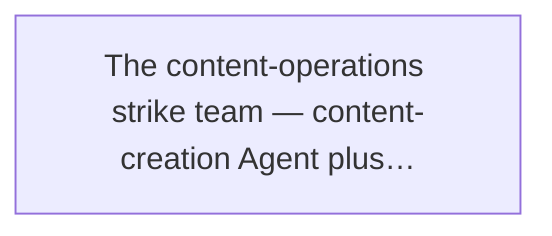
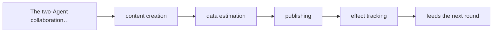
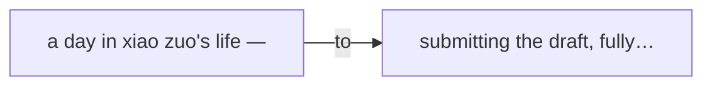
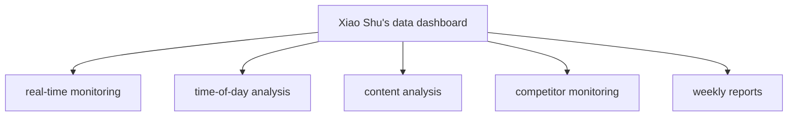
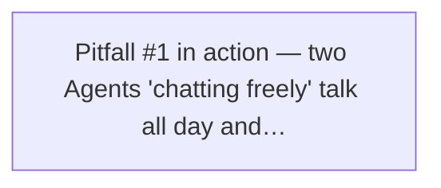
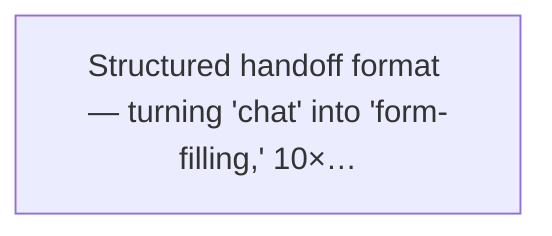
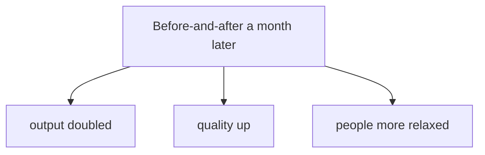

# Chapter 13

## Content Production + Data Analysis: Two-Agent Collaboration

If the last chapter's AI web designer was "one car on a trip," this chapter we'll do something spicier — assemble a fleet.

Have you ever wondered what happens when two Agents work together?

Is it 1+1=2? Or 1+1>2? Or do two "smart people" just get in each other's way, so 1+1<1?

This chapter uses a real scenario — content operations — to show what two-Agent collaboration actually looks like. The lead isn't Xiaoming or Lao Wang this time; it's our old friend Xiaomei.

Ready? Here's the story.

## 13.1 Xiaomei's new problem: not enough people for content ops

Monday, 9 a.m. Xiaomei burst into the office with two dark circles under her eyes.

She's the company's product manager, but recently the boss also dumped content operations on her. Simple reason — the company is young, the budget is tight, and saving one salary saves one salary.

So Xiaomei's daily life became this:

**Xiaomei** (to herself): "Monday I write the public-account post, Tuesday I make a poster, Wednesday I analyze last week's data, Thursday I write a short-video script, Friday I do the weekly report…"

"I do three people's jobs for one person's pay. Is that fair? Is that fair?!"

What crushed Xiaomei more was doing content "by feel."

What topic? — Whatever mood I'm in.
What headline? — Whichever looks most like a "hit."
When to post? — Before clock-off, when everyone's slacking off and scrolling.
How did it do? — After posting, a nervous wreck, refreshing the backend every ten minutes like a student waiting for exam results.

At lunch that day, Xiaomei ran into Xiaoming and Lao Wang in the cafeteria.

**Xiaomei:** Ugh, you guys… any way to make me work less? I feel completely drained.

**Xiaoming:** Huh? You're a product manager — what work could tire you out like this?

**Xiaomei:** Don't ask. The boss made me co-run content ops. Writing the public account, making posters, analyzing data every day… three people's jobs, and I'm turning into an octopus.

**Xiaoming:** (eyes lighting up) Content ops? Easy! Use an Agent!

**Xiaomei:** Agent? That "smart car" thing you told me about? Can it write articles for me?

**Xiaoming:** Writing articles is nothing! Let me tell you, it can do data analysis too. You just need to…

**Lao Wang:** (cuts Xiaoming off) Enough, stop overselling. Xiaomei, tell us your actual requirements first.

Xiaomei counted on her fingers:

- At least 3 public-account posts a week — topic, draft, layout, headline, the whole chain.
- Monitor data daily: reads, likes, shares, comments — see how things perform.
- One data report a week: what content is popular, what nobody reads.
- Ideally… give me some ideas on what to write next week.

Lao Wang listened, chin in hand, thinking.

**Lao Wang:** Hmm… this scenario is interesting. What you need isn't one Agent, but **two**.

**Xiaomei:** Two? One writes content, one does analysis?

**Lao Wang:** Exactly. And these two don't each do their own thing — they cooperate. The data one advises the content one; the content one, once written, gets the data one to estimate the effect.

**Xiaoming:** Wow! Two-Agent collaboration! I haven't tried that!

**Xiaomei:** (excited) Then… I'd go from "writing the draft" to "running the show"?

**Lao Wang:** You could say that. The goal is — **from topic to publish, end to end, the human only makes the final call.**

Xiaomei's eyes lit up. In that moment, she saw a glimmer of hope.

> Doing three people's jobs isn't because you're capable — it's because you haven't yet learned to let AI do them for you.

> Figure: The content-operations strike team — content-creation Agent plus data-analysis Agent, a two-pronged strike

## 13.2 Role setting: the two Agents' "division-of-labor agreement"

Enough talk. Xiaoming pulled Xiaomei along, and under Lao Wang's guidance they started designing the "content-operations strike team."

Step one, and the most important — **set the division of labor first.**

Lao Wang said the easiest mistake in multi-Agent work is jumping straight to code and APIs, only to find halfway through that nobody clarified "who does what." Two Agents grab the same task, or both think "that's not my job."

****Pitfall warning****

A lot of people building multi-Agent systems want them to "communicate freely" right away. Result? The two Agents chat for half an hour and get zero real work done. Remember: **unclear division, broken collaboration.**

After an afternoon of discussion, they gave the two Agents clear roles.

✍️ **Xiao Zuo** · Content-Creation Agent · Chief Content Officer

Owns the full content pipeline from topic to finished draft. One goal only — write content readers love and data rewards.

Hot-topic tracking · topic planning · article writing · headline tuning · layout suggestions · image plan

📊 **Xiao Shu** · Data-Analysis Agent · Data Insight Officer

Owns monitoring content data, analyzing effect, and giving decision support. Its goal — make every decision backed by data.

Real-time monitoring · data analysis · effect evaluation · topic suggestions · competitor monitoring · weekly reports

Xiaomei looked at the two "virtual employees'" bios and couldn't help laughing.

**Xiaomei:** Xiao Zuo and Xiao Shu… cute names. So how do they cooperate? They can't each do their own thing.

**Lao Wang:** Good question. This is the core of multi-Agent collaboration — **they don't "chat," they "hand off."**

**Xiaoming:** Hand off? What do you mean?

**Lao Wang:** Think about it — at a company, do two colleagues cooperate by texting on WeChat all day? No. They use a **handoff document** — A finishes, writes a handoff note for B, B carries on.

**Xiaomei:** (lightbulb) Oh! I get it! Like our ops flow — planning writes the plan and hands off to design, design finishes the artwork and hands off to dev, dev finishes and hands off to test…

**Lao Wang:** Exactly! Same with Agents. Don't let them free-chat — too inefficient. You give them a fixed **handoff format** — when to hand off, what to hand off, what format, who confirms.

**Golden quote 01**

The key to multi-Agent collaboration isn't making them "chat" — it's making them "hand off." A clear handoff format matters more than anything.

So they designed three "collaboration channels" for Xiao Zuo and Xiao Shu:

### Channel 1: data-driven topic selection

Every Monday morning, Xiao Shu sends Xiao Zuo a "topic proposal." It includes: what content type performed best last week, what hot topics to chase, what competitors are writing, what topics readers mentioned in comments.

Xiao Zuo uses this proposal, combined with its own hotspot scan, to set the week's topic direction.

### Channel 2: pre-publish data estimate

After Xiao Zuo finishes an article, it doesn't send it straight to Xiaomei — it first "cc's" Xiao Shu. Based on historical data, Xiao Shu estimates the article's read count and share rate, even giving feedback like "suggest changing the headline" or "this angle may not land well."

Xiao Zuo uses Xiao Shu's feedback for a final round of polish, then submits to Xiaomei for review.

### Channel 3: post-publish effect tracking

After an article goes live, Xiao Shu monitors the data in real time. If it does unusually well — say shares spike — Xiao Shu immediately tells Xiao Zuo: "This topic's good, write a few more!"

If it does unusually badly — say open rate is low — Xiao Shu tells Xiao Zuo: "This direction may be off; let's adjust."

> Figure: The two-Agent collaboration loop: data-driven topic selection → content creation → data estimation → publishing → effect tracking → feeds the next round

> The data Agent is the content Agent's "eyes"; the content Agent is the data Agent's "hands." The eyes see the direction, the hands execute it.

## 13.3 A day with Xiao Zuo: how a hit is born

Roles set, cooperation figured out. Now let's see how Xiao Zuo spends its day.

Xiaomei said writing one public-account post used to take her at least half a day, from topic to publish. Sometimes she'd agonize over a headline for an hour.

What about Xiao Zuo? How efficient is it?

Xiaoming gave Xiao Zuo a "daily workflow." Let's follow the timeline:

☀️ **9:00 a.m. — hotspot scan**

Scan hot topics and industry news across the web.

Xiao Zuo auto-visits major tech media, industry accounts, and trending lists, grabbing the day's hot topics. At the same time it filters for directions related to the business, using the "topic proposal" Xiao Shu gave yesterday.

This takes about 15 minutes. A human scrolling through would burn a whole morning.

🌤️ **10:00 a.m. — topic meeting**

Pick 3 candidate topics, send to Xiao Shu for scoring.

Xiao Zuo pulls 5 candidate topics from the hotspots, adds its own reasoning, and packages them to Xiao Shu. Xiao Shu scores each by historical data: estimated reads, estimated shares, brand-fit… Finally it picks the 3 highest-scoring as the week's candidates.

🌤️ **10:30 a.m. — kickoff**

Xiaomei makes the call on which to write today.

The 3 topics push to Xiaomei's phone, each with: theme, angle, estimated data, risk note. She just picks one — like an emperor flipping a name plaque.

Before, Xiaomei had to invent topics herself; now she only has to "choose" one.

☀️ **2:00 p.m. — draft**

Write the first draft + 3 alternative headlines.

Once the topic is set, Xiao Zuo writes the first draft: outline first, then fill, then polish. A 2,000-word article takes about an hour and a half.

After the body, it generates 5 headlines in different styles — suspense, numbers, pain-point — then has Xiao Shu score them with a "headline-attractiveness model" and pick the top 3.

🌅 **4:00 p.m. — layout + images**

Auto-layout + image suggestions.

Xiao Zuo follows the company's layout spec: auto-paragraph, bold key points, add quote boxes, insert subheadings. At the same time it gives 3–5 image suggestions based on the content — theme, style, even specific keywords.

If plugged into an AI image tool, it can generate the images directly.

🌆 **5:00 p.m. — submit for review**

Hand the final version to Xiaomei.

A complete "ready-to-publish package" is ready: body, 3 candidate headlines, layout style, image suggestions, data estimate.

Xiaomei only spends 10–15 minutes going through it — tweak wording, pick a headline, set the publish time — then she can clock off.

> Figure: A day in Xiao Zuo's life — from hot-topic scanning to submitting the draft, fully automated

**Xiaomei:** Wait, wait… this is too good. So what do I do? Just review for 10 minutes at 5 p.m. every day?

**Lao Wang:** Roughly. But don't celebrate too early — the review step is critical. What AI writes may have typos, factual errors, wrong tone. **The human's value is holding the line at the key nodes.**

**Xiaoming:** Right! Like a self-driving car — it drives itself day to day, but a human driver must take over in complex conditions.

**Xiaomei:** Hmm… I get it. I'm not "replaced" — I went from "writing drafts" to "being the editor-in-chief" — stopped working, started "gatekeeping."

**Lao Wang:** (laughs) That sums it up well. AI can write articles, but not the brand's soul; AI can crunch data, but not the brand's bottom line. **The human's value is holding the line at the key nodes.**

**Golden quote 03**

AI can crunch data, but not the brand's bottom line. The human's value is holding the line at the key nodes.

## 13.4 A day with Xiao Shu: the secrets behind the data

Done with Xiao Zuo, let's meet its partner — Xiao Shu.

If Xiao Zuo is the "soldier charging ahead," Xiao Shu is the "strategist behind the lines." It doesn't produce content, but it decides the content's direction.

Xiaomei said she used to look at data too, but always the same few numbers — reads, likes, shares. After looking? — "Oh, got it." Then back to whatever she was doing.

"I saw the data, but it was useless," Xiaomei said.

So what can Xiao Shu do differently?

### Real-time monitoring: more than "looking at numbers"

Xiao Shu monitors all content data 24/7. But it doesn't just stare — it has an "anomaly detection" mechanism.

****Example****

An article goes out; two hours later reads are already 2× last week's average — Xiao Shu immediately messages Xiaomei: "This one's doing unusually well, suggest a boost!"

Conversely, if four hours after publish the open rate is still under 5% — Xiao Shu warns: "This one's low, maybe the headline's off — want to swap the headline and repost?"

See — that's the value of data analysis: **not telling you "what," but telling you "what it means" and "what to do."**

### Time-of-day analysis: when is the best time to post

"What time should we post?" — maybe every ops person has agonized over this.

Some say 8 a.m. is good, people read on the commute. Some say noon, scrolling at lunch. Others say 9 p.m., a pre-sleep scroll.

Everyone has a theory.

Xiao Shu doesn't argue — it goes straight to the data.

It tallies the publish times and corresponding performance of all articles over the past 30 days, then computes the "optimal posting window." And it breaks it down — different content types have different best times.

****Real finding****

Xiaomei's company data showed: how-to articles do best posted Wednesday at 3 p.m. (office workers slacking off to learn), while opinion pieces do best Friday at 8 p.m. (pre-weekend wind-down, good for deep reads).

You can't guess a conclusion like that.

### Content analysis: what topics readers love most

This is Xiao Shu's core strength — it doesn't just see "which article did well," it analyzes "**why** this one did well."

It breaks each article into dimensions:

- **Topic:** technical how-to? industry opinion? product intro? user story?
- **Headline:** numeric? suspense? pain-point? contrast?
- **Structure:** list? story? debate?
- **Length:** short (1,000 words)? medium (2,000)? long (3,000+)?

Then it tells you: "Over the past 3 months, 'technical how-to + numeric headline + around 2,000 words' averaged the highest reads and best share rate."

That's not "content by feel" — that's **data-driven content production**.

### Competitor monitoring: what others are writing

Doing content, you can't work in a vacuum. You need to know what peers are doing.

Xiao Shu periodically monitors 10–20 competitor accounts — what they're posting lately, what's performing, what new plays to borrow.

But note — "borrow," not "copy." Xiao Shu's advice to Xiao Zuo is: "Competitors' 'AI tool reviews' angle is doing well lately; we can come at it from another angle — a 'beginner's guide' version."

### Weekly report: data summary + next-week suggestions

Every Sunday evening, Xiao Shu auto-generates a "content-ops weekly report" containing:

- Week overview: total reads, average open rate, average share rate…
- Data trend: up or down vs. last week? Why?
- Best/worst content: the 3 best and 2 worst, with reasons.
- Next-week suggestions: recommended topics, strategies to adjust, risks to watch.

Xiaomei opens this report Monday morning. Before, she'd spend half a day making it herself; now — one click and it's there.

> Figure: Xiao Shu's data dashboard — real-time monitoring, time-of-day analysis, content analysis, competitor monitoring, weekly reports

## 13.5 Two-Agent collaboration: the secret of 1+1 > 2

At this point you might say: "So one writes content, one watches data? Big deal?"

Well, you'd be wrong.

Xiao Zuo and Xiao Shu aren't a simple "division of labor." They **empower each other** — you make me better, I make you more precise.

That's the real power of multi-Agent collaboration.

### Data-driven topics: from "gut feel" to "evidence-based"

Before, Xiao Zuo picked topics by "I think readers will like it." But does "I think" work? — Nine times out of ten, no.

Now it's different. Xiao Shu tells Xiao Zuo:

**Xiao Shu** (virtual): "Over the past 30 days, the topic 'Agent hands-on cases' averaged 47% higher reads than other topics and 62% higher shares. Recommend focusing there this week."

"Also, readers keep mentioning in comments they 'want to know how to actually build it' — demand for hands-on content is high."

"Plus, competitor XX just posted 'I Wrote 100 Articles with AI' and it blew up. We can come at it from the 'lessons learned' angle for a differentiated version."

See — Xiao Shu doesn't "make the call" for Xiao Zuo; it gives **intelligence support**. With that intel, Xiao Zuo's content hits the mark far more often.

This is like war — the scout (Xiao Shu) maps the enemy's deployment, so the front-line commander (Xiao Zuo) can win precisely.

### Content feeds data: from "post-hoc analysis" to "real-time iteration"

In reverse, Xiao Zuo's content "feeds data" to Xiao Shu.

Every new article published adds a data point to Xiao Shu's database. More data → sharper analysis → better advice to Xiao Zuo → better content from Xiao Zuo…

Notice — this is a **positive loop**!

****Positive loop****

Good content → more data → sharper analysis → better advice → better content → …

Once this loop spins, content quality climbs higher and higher — and it's **automatic, accelerating**.

### Weekly retro: the two Agents "meet"

The most interesting part is the "weekly retro."

Every Monday morning, Xiao Zuo and Xiao Shu "hold a meeting" — not a real chat, but a full retro following a preset flow:

1. Xiao Shu reports first: how was last week's data? What worked? What didn't? Why?
2. Xiao Zuo responds: keep what worked, here's how I'll fix what didn't.
3. Xiao Shu gives next-week advice: recommended topics, new formats to try, risks to watch.
4. Xiao Zuo makes the next-week plan: how many posts, what, roughly when.
5. Finally, generate a "next-week content plan" and send to Xiaomei for confirmation.

Xiaomei said when she first saw this "auto-generated weekly plan," she got goosebumps.

**Xiaomei:** Ridiculous… I used to hold Monday topic meetings, debating with the team all morning, and what we settled on wasn't even as thorough as this.

**Lao Wang:** So you see, AI isn't here to steal jobs. It frees you from "low-value repetitive labor" so you can do what matters more.

**Xiaomei:** Then… what's my value now?

**Lao Wang:** You went from "writing content" to "**setting direction**." What to write and how — AI does. But **whether to write it, whether it's right, whether to publish** — you make the call.

**Xiaoming:** Right! Like a smart car — driving is AI's job, but where to go, which road, whether to stop — still the human's call.

## 13.6 The build: steps from zero to one

After all this upside, you'll want to ask: "Sounds great, but how do you actually build it? Hard?"

Lao Wang said building such a two-Agent system is hard and not hard. The key — **don't rush the code, think the flow through first.**

They spent two full days "talking on paper" — drawing the flowchart, fixing the handoff format, writing the Prompts — before they touched the build.

How, concretely? Five steps:

#### Step 1: Define each Agent's responsibilities and tools separately

Don't rush "collaboration" — get each Agent's individual responsibilities clear first.

For Xiao Zuo: what it can do (write drafts, craft headlines, lay out), what it can't (can't publish on its own, can't fabricate data), what tools it has (search, layout, image generation).

For Xiao Shu: what it monitors (reads, shares, comments), what it analyzes (topic, headline, timing), what it outputs (daily report, weekly report, topic proposals), what tools it has (data API, stats tools, competitor monitoring).

**This step's deliverable is two "job descriptions."**

#### Step 2: Build a shared "content knowledge base"

For two Agents to collaborate, they need a common "language" and "memory."

Like the company's brand tone — what can be said, what can't; what articles were published historically, how they did, who the competitors are…

This info can't be scattered; it goes in one "content knowledge base" both Agents pull from, so they speak "the same language" and don't talk past each other.

**This step's deliverable is a shared knowledge base (a vector DB or a document library).**

#### Step 3: Design the collaboration interface and handoff format

This is the critical step — define the "handoff format."

What format does Xiao Zuo use to "pass" things to Xiao Shu? What format does Xiao Shu use to "reply"?

Lao Wang's advice: **use JSON, not natural language.** Natural language is too loose — says it one way today, another tomorrow, and the Agent misreads it. JSON is structured: fixed fields, clear meaning, fewer slip-ups.

For example, Xiao Shu's "topic proposal" to Xiao Zuo can be defined with: topic name, background, estimated data, recommended angle, risk note, references.

**This step's deliverable is a "collaboration interface spec."**

#### Step 4: Set human approval nodes

Never go "fully automatic" — if something breaks, you'll pay for it.

In the whole flow, set "human checkpoints": topic needs human confirmation, draft needs human review, publish needs human approval. These checkpoints are your "brakes" and "steering wheel."

And approval shouldn't be complex — just a "pass/fail" choice plus an optional revision note. The simpler the approval, the more you'll use it; the more complex, the more it becomes decoration.

**This step's deliverable is an "approval flow list" — who approves what, where, within how long.**

#### Step 5: Run a week, tune on real data

System built — don't rush full rollout. Run a one-week "pilot."

That week, watch closely: where did it jam? What broke? What did the Agent misread? Any ambiguity in the handoff format?

In their first pilot week, Xiaoming's team rewrote several versions of Prompts and handoff formats daily. For instance, the "topic proposal" initially had no "risk note" field, so Xiao Zuo picked a highly controversial topic and nearly caused trouble. They added it fast.

**Remember: the first version is always "good enough to run"; the real optimization is in later iterations.**

****Lao Wang's experience****

A lot of people building multi-Agent systems want "full auto," "smart," "free communication" right away. Result — looks cool, totally unusable.

My advice: **build the "dumb" version first, then the "smart" one.** Lock the flow, lock the format, lock the handoff, get it running. Once stable, slowly add flexibility.

Like learning to drive — straight lines first, then lane changes, then complex conditions.

## 13.7 Pitfalls and lessons

At this point you might think "two-Agent collaboration" is too perfect — two AIs do the work, you just make the final call.

Not that easy!

Xiaoming's team hit countless pitfalls building this. In Xiaoming's words — "every step is a pit, and no two pits are alike."

Let's hear which pits they hit, so you don't step in them too.

**Pitfall 1: the two Agents "talk past each other," communication breaks down**

At first, Xiaoming let Xiao Zuo and Xiao Shu "communicate freely" — Xiao Zuo finishes, sends the article straight to Xiao Shu, and Xiao Shu says whatever.

Result? The two could "chat," but at rock-bottom efficiency. Xiao Zuo says "I think it's pretty good," Xiao Shu says "I think the data's so-so," then Xiao Zuo says "so what would you change?"… going back and forth, not one useful word.

Worse, once they actually debated "will AI replace humans" — a philosophy tangent, totally off track!

**Fix:** drop "free communication," switch to "structured handoff." Define the handoff's format, fields, meaning. What Xiao Zuo gives Xiao Shu must follow the format; Xiao Shu's feedback to Xiao Zuo must too.

One line — **don't let them chat, let them fill out a form.**

**Pitfall 2: the content Agent writes too "watery," padding word count**

Xiao Zuo's early articles made Xiaomei shake her head.

"It's not wrong, just not useful. Looks packed, but look closer and it's all filler. Like padding an essay in school."

This is a common disease of content Agents — they chase "completeness" and "fluency," not "usefulness." It writes 2,000 words, maybe 200 are useful.

Xiaoming first tried fixing it via Prompt — "write with depth, with substance, with insight…"

Useless. The AI says "sure, noted," and writes the same way.

**Fix:** add a "quality check" step to the content Agent.

Specifically: after Xiao Zuo's first draft, run a "QA checklist" — concrete case? data backing? actionable advice? repetition?

And change "word count" to "information density" — not "write 2,000 words" but "include at least 5 core points, each with a case."

Anything that fails QA gets sent back to rewrite.

**Pitfall 3: the data Agent analyzes a lot, but it's all hot air**

Xiao Shu wasn't trouble-free either.

At first its analysis reports looked beautiful — charts, dimensions, numbers. But Xiaomei's reaction was: "So what?"

"Reads up 15% — so what? What do I do?"

"This topic did well — so what? Write more of it? How much? How?"

Data was there, analysis was there, but **no action advice.** All "correct nonsense."

**Fix:** require "action advice" from the data Agent.

Simple rule — every analysis conclusion must be followed by at least one concrete action suggestion, and it must be executable, not empty talk like "improve content quality."

E.g., not "this topic did well" but "suggest 2 pieces on this topic next week, angles X and Y, target reads XX+."

Analysis without action advice is no analysis at all.

> Figure: Pitfall #1 in action — two Agents "chatting freely" talk all day and get nothing done

Beyond these three big pits, a pile of smaller ones:

- Knowledge base not updated in time, so the two Agents' info doesn't match.
- Too many approval nodes, the flow stalls and gets slower.
- Agents "invent data" — state numbers that don't exist.
- Chasing trends too hard, content drifts from brand tone.
- Clickbait tendency — data looks good, but the brand image drops.

Lao Wang said you'll almost certainly hit these. What matters isn't "avoiding pits" but **adjusting fast after you step in one.**

> No perfect system, only systems that keep iterating. A bad first version is fine — what matters is whether you can make it better.

> Figure: Structured handoff format — turning "chat" into "form-filling," 10× efficiency

## 13.8 Results: one person does a team's work

After all that difficulty, let's see the results.

A month after the system went live, how did it do?

In Xiaomei's words: "I leave at 5 p.m. sharp every day now, and the boss says I'm doing great."

Let's look at some numbers:

| | Before | After |
|-|-|-|
| Output | 2 posts/week | 5 posts + 2 short-video scripts / week |
| People | 1, working overtime | 1, off on time |
| Topic choice | By feel | Data-driven |
| Hit rate | ~10% | ~30% (3×) |

> Figure: Before-and-after a month later — output doubled, quality up, people more relaxed

### Output up: from "2 posts a week" to "5 posts + 2 short-video scripts"

Before, Xiaomei alone managed at most 2 public-account posts a week, flat out. Now? 5 posts + 2 short-video scripts, with time left for other things.

And quality didn't drop — it rose. Every article has data backing, multi-round QA, professional polish.

### Quality stable: hit rate up 3×

What's a "hit"? Xiaomei's company defines it as reads over 2× the average.

Before, maybe 1 in 10 posts was a hit — pure luck.

Now, about 1 in 3. Not better luck — **higher topic hit rate**, thanks to Xiao Shu's data backing.

### The human's value: from "writing machine" to "content director"

This is what hit Xiaomei hardest.

**Xiaomei:** "Before, my day was — think of a topic, write, revise, publish. I felt like a 'writing machine.'"

"Now? I spend 1 hour a day reviewing content. The rest of the time I'm thinking — is our content strategy right? Is the brand tone drifting? Are user needs changing? What's next quarter's content direction?"

"I went from 'doing the work' to 'thinking about the work.' That's what a product manager should do!"

**Lao Wang:** (nods) This is AI's real value — it doesn't replace you, it **upgrades** you. It frees you from low-value repetitive labor so you can do what matters more.

**Xiaoming:** Like cars replacing carriage drivers — but humans didn't lose their jobs, they did more important things. The carriage driver became a chauffeur, the chauffeur became a logistics manager, the logistics manager became a supply-chain director…

**Xiaomei:** (eyes sparkling) So… I'm a "content director" now?

**Lao Wang:** (laughs) You could say that. Except your team isn't human — it's two AI Agents.

****Chapter's core conclusion****

The key to two-Agent collaboration isn't "quantity" but "division" and "handoff."

Division must be clear — who does what, who doesn't, stated plainly.

Handoff must be structured — pass info in a fixed format, don't let them "free-chat."

The human role must upgrade — from "doing the work" to "gatekeeping" and "setting direction."

Get these three right, and 1+1 is always greater than 2.

## Chapter's golden quotes recap

**Golden quote 01**

The key to multi-Agent collaboration isn't making them "chat" — it's making them "hand off." A clear handoff format matters more than anything.

**Golden quote 02**

The data Agent is the content Agent's "eyes"; the content Agent is the data Agent's "hands." The eyes see the direction, the hands execute it.

**Golden quote 03**

AI can crunch data, but not the brand's bottom line. The human's value is holding the line at the key nodes.

## Next-chapter preview

Watching the backend numbers climb, Xiaomei was giddy like a child.

**Xiaomei:** Two Agents are already this powerful! So if I had 10 Agents, couldn't I do 10 people's work?

**Lao Wang:** (shakes his head) Quantity isn't the point — quality and reliability are. A test team isn't better just because it's bigger; method matters.

**Xiaoming:** (curious) Test team? Lao Wang, you mean…

**Lao Wang:** Exactly. Next chapter, let's talk — what if we use Agents for automated testing?

**Xiaoming:** (eyes lighting up) An automated testing army?!

**Next chapter, Case Study 3: the automated testing army.**

When testing meets Agents, what sparks fly? And what new problems arise when dozens of test Agents run at once?

We'll find out next chapter.

← Ch.12: Case Study 1: AI Web Designer  Ch.14: Case Study 3: Automated Testing Legion →

The Self-Driving Era: A Brief History of Agent Evolution © 2026

An evolutionary saga of AI Agents, from Prompt to self-evolving organizations
