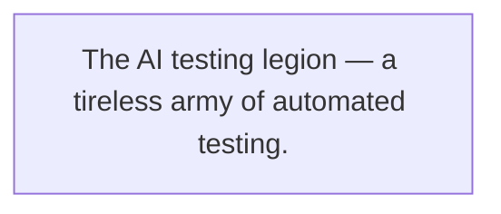
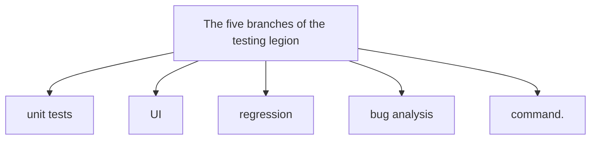
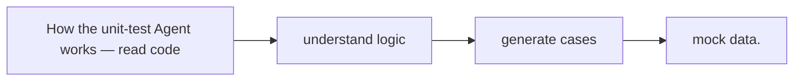
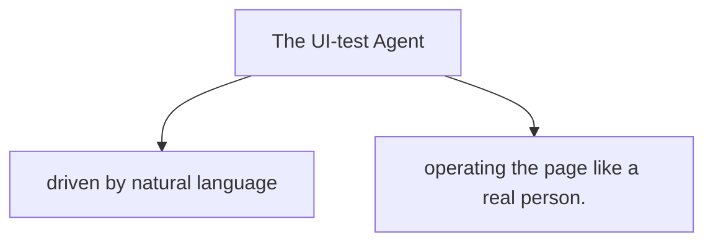
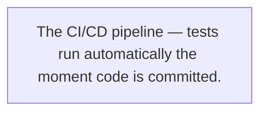
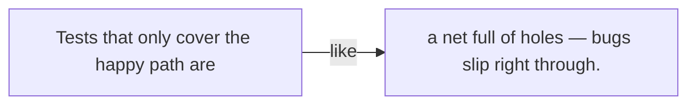
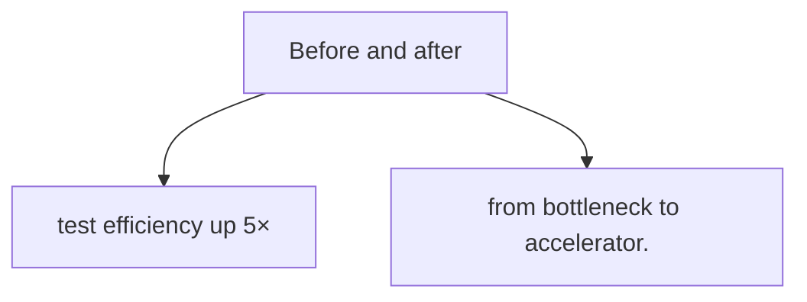

# Chapter 14

## AI Testers for Client and Web Apps

*The Self-Driving Era: A Brief History of Agent Evolution*

## 01 The pain of testing: every launch feels like a blind box

Friday, 6 p.m. Most people had left, but Xiaoming was still at his desk, head spinning at the dense test-case spreadsheet on his screen.

Tomorrow's the new release. This round of changes isn't huge but isn't small either — three new pages, two core APIs changed, a pile of style tweaks. By rights, all of it needs a full regression pass to make sure new code doesn't "break" old features.

But there just aren't enough hands.

The test team is two people — Xiao Li and an intern — and they're supposed to test hundreds of features in two days. Xiaoming, as frontend lead, got pulled in to test some pages too.

**Xiaoming:** Ugh, manual clicking again. This is my third pass on the login flow, eyes blurred.

Mid-complaint, Xiao Li walked over with her coffee, exhaustion written all over her face. Her dark circles were deeper than Xiaoming's — clearly a few late nights.

**Xiao Li:** You haven't seen anything yet. I've been testing since Monday, clicking hundreds of buttons a day, hands going numb. Worst part — every time I finish a round, dev changes something and I start over.

Xiao Li sat and opened her test-case spreadsheet. Xiaoming leaned in — a full 300+ rows, each a test point, from signup and login to payment and ordering, from homepage recommendations to the personal center. Every corner of the app.

**Xiao Li:** See? Just running this one sheet takes three days. And that's not counting edge cases and weird scenarios. Even after all that, I can't promise launch is clean — who knows what bug is hiding in some corner?

**Xiaoming:** So what do we do? We can't gamble every launch. My finger shakes every time I hit the deploy button.

Xiao Li gave a bitter smile and pointed at her monitor — a bug-tracking system, dense with red "unfixed" markers, making your scalp prickle.

**Xiao Li:** What can we do? Test overtime. Honestly, release day is what I fear most. I start anxiously a week ahead, terrified I'll miss something. And clicking the same things daily is so boring — lose focus for a second and you miss a test.

As the two sighed, Lao Wang strolled over with his tea, an "I knew this would happen" look on his face.

**Lao Wang:** Stuck on testing again? I told you — piling on human testers hits a wall sooner or later. More features, same few people; you can't work them to 996.

**Xiaoming:** Lao Wang, got a better idea? We tried automation — writing test scripts was harder than writing business code, and the moment the UI changed the scripts all broke. Maintenance cost was brutal.

**Lao Wang:** Traditional automation is like that. But now it's different — AI is here. Think about it: testing is basically repetitive labor. Click buttons in steps, enter data, check results. That's exactly what AI is good at.

Xiaoming's eyes lit up, then doubt crept in.

**Xiaoming:** AI can test? How? Have the AI click buttons?

**Lao Wang:** More than clicking. AI can write unit tests, do UI automation, run regression, even analyze bug causes. Picture it as a "testing legion" — different branches, each with its job, running 24/7, never tired.

Lao Wang opened a demo page on his laptop — an architecture diagram with several AI Agents lined up like an army.



> Figure 14-1: The AI testing legion — a tireless army of automated testing.


"AI is best at repetitive labor — it doesn't get bored, doesn't slack, doesn't let its guard down after the 100th run."

Looking at the diagram, Xiaoming and Xiao Li exchanged a glance, each seeing hope in the other's eyes. If such a "testing legion" existed, could they finally stop pulling all-nighters?

Xiao Li was practically bouncing — manual testing had tortured her for too long.

**Xiao Li:** Lao Wang, come on, how do we actually build this legion? I'll be the first guinea pig! My mouse hand is about to give out.

**Lao Wang:** Hold on, one step at a time. First understand the legion's "branches," then pick the easiest win to pilot.

## 02 The testing legion's "order of battle"

Lao Wang drew on the whiteboard, explaining as he went.

He said the AI testing legion isn't a single tool but several Agents with different jobs — like an army with infantry, cavalry, artillery, scouts, each handling its slice and combining into a full testing system.



> Figure 14-2: The five branches of the testing legion — unit tests, UI, regression, bug analysis, command.


### Unit-test Agent: the "infantry" of code quality

Lao Wang pointed at the first figure.

**Lao Wang:** This is the unit-test Agent, the infantry — most numerous, widest coverage. Simple job: read your code, understand the function logic, auto-generate unit test cases.

Xiaoming scratched his head.

**Xiaoming:** Unit tests? The thing that took our coverage from 30% to 80%? We wanted to do it, but writing them ate too much time — never got to it between feature work.

**Lao Wang:** That's why we let AI write them. Hand the code to the unit-test Agent and it spits out dozens of cases in minutes — normal, boundary, error cases, all covered. You just review and tweak. Before, 80% of the time went to writing cases, 20% to review; now it's reversed — 20% review, 80% saved.

### UI-test Agent: the "scout" simulating real users

Lao Wang pointed at the second figure, finger on a screen.

**Lao Wang:** This is the UI-test Agent, the scout — it simulates real user actions. You don't write complex scripts; you just tell it in plain language what to test — say, "open the login page, enter a wrong password, click login, it should show an error" — and it generates the test script and runs it for real in a browser.

Xiao Li's eyes lit up.

**Xiao Li:** This is great! Isn't that my daily grind? Clicking around, entering data, checking the page. If this Agent does it, I can do something more valuable.

**Lao Wang:** More than that. It does visual regression — screenshots each run, compares to the last, and spots a moved button, a wrong color, a misplaced text instantly. More reliable than human eyes.

### Regression-test Agent: the "shield bearer" holding the line

The third figure held up a big shield.

**Lao Wang:** The regression-test Agent, the shield bearer — it guards the baseline. Every code change, every release, it auto-runs all core cases to make sure old features weren't broken. Your regression took 3 days; this one might finish in 30 minutes.

At "30 minutes," Xiaoming and Xiao Li both inhaled sharply. Three days to thirty minutes — that's not a small jump.

### Bug-analysis Agent: the "detective" solving the case

The fourth figure wore a detective hat, magnifier in hand.

**Lao Wang:** The bug-analysis Agent, the team's detective. When a test fails, it doesn't just say "failed" and stop. It auto-collects logs, screenshots, environment info, analyzes the cause — code problem? or test problem? API changed? or bad data? — then writes a detailed report.

**Xiaoming:** That's incredible. Before, a bug meant test and dev going back and forth — test says dev's code is wrong, dev says the test environment is off. If AI pinpoints the cause, think of the communication cost saved.

### Command Agent: the "general" directing the whole

Finally, Lao Wang pointed at the figure in the middle with the general's hat.

**Lao Wang:** This is the command Agent, the legion's commander. It assigns tasks — which modules to test this round, which Agent to send, what priority; it aggregates results — collects each Agent's report into one overall test report; and it advises — where coverage is thin, where miss-risk is high, what to focus on next.

Xiao Li listened, rapt, and couldn't help asking:

**Xiao Li:** So with this command Agent, do we not need a test manager?

**Lao Wang:** (laughs) Not quite. The command Agent helps you work, not replaces you. It does the repetitive, tedious stuff so you can focus on what matters — test strategy, test architecture, quality risk. That's where a test engineer's value really shows.

Lao Wang paused and looked at them seriously.

"Test engineers won't be replaced by AI — but test engineers who don't use AI will be replaced by those who do."

The line landed like a hammer on Xiaoming and Xiao Li. The times change, the tools change; fall behind the rhythm and you're out.

## 03 The unit-test Agent: coverage from 30% to 80%

Enough talk. Lao Wang suggested starting simple — the unit-test Agent. Unit tests are fairly independent, need no complex environment, and show results fast.

Xiaoming picked the project's 10 most core utility functions — data processing, format validation, calculation logic — the bedrock of the project. But they'd been too busy; these functions' unit-test coverage had stayed low, around 30%.

**Xiaoming:** Let's start with these. Embarrassing to say, they've been live nearly a year with no unit tests. Every time I touch them I'm nervous, scared I'll break something.

Lao Wang nodded and opened the unit-test Agent's interface.

**Lao Wang:** Come on, paste one function's code in and see.

Xiaoming picked a trickier one — `formatPrice`, for formatting product prices. Simple and not simple: it handles integers, decimals, negatives, huge amounts, currency symbols, thousands separators. Too many boundary cases, so the unit tests kept getting deferred.

Xiaoming pasted the code and clicked "Generate Tests."



> Figure 14-3: How the unit-test Agent works — read code → understand logic → generate cases → mock data.


In just over ten seconds, a long string of test code appeared. Xiaoming leaned in, eyes wide.

```js
// 正常情况
test('formatPrice 格式化正数价格', () => { expect(formatPrice(9.99)).toBe('¥9.99'); });
test('formatPrice 格式化整数价格', () => { expect(formatPrice(100)).toBe('¥100.00'); });
// 边界情况
test('formatPrice 处理0元', () => { expect(formatPrice(0)).toBe('¥0.00'); });
test('formatPrice 处理负数价格', () => { expect(formatPrice(-50)).toBe('-¥50.00'); });
test('formatPrice 处理超大金额千分位', () => { expect(formatPrice(9999999.99)).toBe('¥9,999,999.99'); });
// 异常情况
test('formatPrice 传入null返回默认值', () => { expect(formatPrice(null)).toBe('¥0.00'); });
test('formatPrice 传入undefined返回默认值', () => { expect(formatPrice(undefined)).toBe('¥0.00'); });
test('formatPrice 传入非数字字符串', () => { expect(formatPrice('abc')).toBe('¥0.00'); });
```

**Xiaoming:** Whoa, that's thorough! Normal, boundary, error — even null, undefined, non-numeric strings. I wouldn't have thought of half of these.

**Lao Wang:** That's AI's edge. It has no blind spots — give it enough prompts and it finds the obscure cases. And notice it auto-generated mock data, so you don't build test data yourself.

Xiaoming looked closer and found cases he'd never considered — like what happens past two decimal places, or a numeric string passed in.

He ran the tests right away — and one actually caught a bug.

**Xiaoming:** Lao Wang, look! The huge-amount test failed. Turns out past ten million, the thousands separator breaks. This bug hid for nearly a year, nobody ever found it!

Xiaoming was startled and delighted — startled that such an old bug surfaced only today, delighted that AI scored on its first try.

Over the next few hours, Xiaoming fed all 10 core functions to the unit-test Agent. The result stunned him — AI generated over 200 test cases, 20+ per function on average. One run surfaced 5 hidden bugs.

And coverage jumped from 30% to 82%.

| | |
|-|-|
| 200+ | Test cases generated |
| 82% | Code coverage |
| 5 | Hidden bugs found |
| 2 hours | Total time |

**Xiaoming:** Ridiculous… if I'd written these myself it'd take a week. And I couldn't be this thorough — so many boundary cases I'd never see.

**Lao Wang:** But note — AI's tests aren't drop-in ready. You review, judge which cases are sound, which redundant, which need adding. AI is a tool; final quality control stays with the human.

Xiaoming agreed deeply. He found a few duplicated cases in the AI's output, and one or two that violated business logic — e.g., one test expected a negative price to return an empty string, but refunds are allowed in business, so negatives are normal. Those needed human adjustment.

But either way, the efficiency gain was real. Before, writing unit tests meant "starting from zero"; now it's "editing AI's results" — at least 70% less work.

## 04 The UI-test Agent: clicks around like a real person

The unit tests scored big; Xiao Li was eager too. She cared most about UI testing — most of her day is spent with pages.

**Xiao Li:** Xiaoming's unit tests are flying; when do I get UI testing? I really don't want to click buttons manually anymore.

**Lao Wang:** Hold on, coming. UI testing is a bit more complex than unit tests, but the principle is the same — you tell it what to test, it runs it.

Lao Wang opened the UI-test Agent's console. Unlike the unit-test Agent, this one had a browser window beside an input box.

**Lao Wang:** Here, Xiao Li, how do you normally test login? Describe the steps in plain language, in this box.

Xiao Li thought, then typed:

```
Test steps:
1. Open the login page
2. Enter the correct username "test_user"
3. Enter the wrong password "wrong_password"
4. Click the login button
5. Verify: page should show the red prompt "密码错误，请重新输入"
6. Verify: the password field should be cleared and auto-focused
```

**Lao Wang:** Good, that simple. Click "Generate and Run."

Xiao Li clicked, skeptical. The browser window beside it auto-opened the login page, then an invisible hand operated it — cursor jumped to the username field, typed "test_user," jumped to the password field, typed "wrong_password," then clicked login.

A second later, a red error prompt appeared. The console showed:

```
**Test passed**
- Error text correct: "密码错误，请重新输入"
- Error color correct: red #ff4d4f
- Password field cleared
- Password field focused
Time: 3.2s
```



> Figure 14-4: The UI-test Agent — driven by natural language, operating the page like a real person.


Xiao Li stared, jaw dropped.

**Xiao Li:** That's… it? I thought I'd write some complex script. Just a few sentences and it tested itself?

**Lao Wang:** That's the magic of AI. No need to learn Playwright, Cypress, or write CSS selectors — if you can speak human, you can write UI automation. The script behind it is generated for you; you don't even have to look.

Lao Wang clicked "View generated script" — a complete Playwright test: locating elements, waiting for load, assertions, all properly written.

**Xiao Li:** Amazing! But what if the page changes? Button moves, or copy changes — won't the tests all break again? That's why our old automation tools failed; UI changed and scripts died, maintenance cost higher than handwritten.

This was Xiao Li's biggest worry. She'd pushed automation before, but UI changed too often and maintenance cost killed it.

**Lao Wang:** Good question. This is the biggest difference between AI testing and traditional. Traditional testing is "dead" — you hard-code which button, which element; change it and it breaks. AI testing is "alive" — it understands your *intent*, not a dead element locator.

Lao Wang gave an example:

**Lao Wang:** Say "click the login button." A traditional script finds the element with id `login-btn`. If dev renames it `btn-login`, the script breaks. AI is different — it looks at the page: "hmm, this button says '登录,' id changed but it's still the login button" — and clicks it anyway.

Xiao Li nodded along.

Lao Wang went on: "And it does visual regression. Screenshots every run, compares to the baseline — an element off by 1px, a wrong color value, a changed font size, it catches all."

**Xiao Li:** That's so practical! We often hit cases where dev changed one style and broke another page's layout — invisible to the eye, users complain after launch. With visual comparison, that problem can't hide.

Lao Wang added that the UI-test Agent also does cross-browser testing. Chrome, Firefox, Safari, even mobile browsers — run in parallel, one case verified across N browsers at once.

Xiao Li was already rolling up her sleeves, planning to "translate" her 300+ manual cases into natural language, one by one, for the AI to run.

**Xiaoming:** Hey Xiao Li, don't rush full rollout. I heard from Lao Wang UI testing isn't magic — some scenarios need care. Complex interactions, canvas content, captcha — AI may not handle them. Pilot the stable, core scenarios first.

**Lao Wang:** Xiaoming's right. The UI-test Agent is powerful, not a silver bullet. Core flows, high-frequency pages — good for automation. Exploratory tests needing human judgment — still human. Human and AI together get the best result.

## 05 Regression-test automation: runs on every commit

Unit tests done, UI tests done — next, wire them into the dev flow. That's the regression-test Agent's job.

Lao Wang showed Xiaoming and Xiao Li a complete CI/CD flow.



> Figure 14-5: The CI/CD pipeline — tests run automatically the moment code is committed.


**Lao Wang:** Here's the flow: dev finishes code, commits to Git. The commit triggers the CI pipeline automatically. First the unit-test Agent runs all unit tests, then build, then deploy to the test environment, then the UI-test Agent runs all core-flow UI cases. Only when everything passes can it merge to main.

Xiaoming's eyes lit up.

**Xiaoming:** So after I commit, I don't wait for testers — the pipeline tests for me? Catch problems on the spot?

**Lao Wang:** Exactly. And if a test fails, the bug-analysis Agent auto-analyzes the cause — tells you if code broke it or the test needs updating. It also auto-generates a bug report — steps, screenshot, logs, environment — everything a dev needs to reproduce.

To prove it, Lao Wang had Xiaoming deliberately break a feature and commit.

Xiaoming grinned and changed the login API's return format — from `{ success: true }` to `{ code: 0, data: {...} }`. Without telling the frontend, this would surely break the page.

After committing, Xiaoming watched the pipeline nervously:

- **Minute 1:** Code pulled, dependencies installing.
- **Minute 3:** Unit tests start, all 200+ pass (they mock the API, unaffected).
- **Minute 5:** Build done, deployed to test env.
- **Minute 7:** UI tests start, page by page.
- **Minute 12:** UI test fails — login broken!

Right after, Xiaoming got a notification with a detailed failure report:

```
**Test failure report**
─────────────────────
Test case: Login - normal login
Failure time: 2024-06-15 15:30:22
Browser: Chrome 125.0
Failure cause analysis:
Login API return format changed; frontend can't parse it.
Expected format: { success: boolean, message: string }
Actual format: { code: number, data: object, msg: string }
Reproduction steps:
1. Open login page /login
2. Enter username test_user
3. Enter correct password 123456
4. Click login
5. No redirect, console error
Attachments:
📸 Failure screenshot: screenshot.png
📋 Console log: console.log
🌐 Network request: network.har
💻 Environment: env.json
```

Xiaoming stared at the report, quietly impressed. The analysis was spot-on — it even knew exactly how the API format changed, with a full evidence chain: screenshot, log, network request, environment.

**Xiaoming:** This report is more detailed than what I'd write. Before, a test bug report was often missing info — I'd have to ask how she operated, what browser, cleared cache? Now AI packages it all. So convenient.

**Xiao Li:** Saves me hassle too! Before, filing a bug meant writing steps, screenshotting, screen-recording, grabbing logs. Now none of that — I focus on the more complex, exploratory scenarios.

After two weeks of piloting, the team's regression efficiency changed completely.

Before, every release needed two test engineers and 3 days to run the full regression, often skipping edge modules for time.

Now, tests run automatically on every commit; full regression takes 30 minutes. And being automated, no worry about misses or labor cost — you can run several rounds a day.

| | |
|-|-|
| 3 days → 30 min | Regression test time |
| N times/day | Test execution frequency |
| 100% | Core-case coverage |
| 0 | Human misses (core flows) |

**Xiaoming:** Three days becoming thirty minutes… who'd believe it. I don't panic at launch anymore — whatever should be tested was tested at commit.

**Lao Wang:** That's the power of automation. But don't get cocky — testing doesn't exist to "pass." Its purpose is to find problems. If your tests are always green, either the product is too simple or the tests are too weak.

Lao Wang's words were a cold shower, sobering Xiaoming. Right — testing isn't a formality; the valuable tests are the ones that find problems.

## 06 The build: a guide to assembling the testing legion

Seeing the legion work so well, Xiaomei got restless. She found Lao Wang — her product team wanted one too, but didn't know where to start.

**Xiaomei:** Lao Wang, our team wants this AI testing legion. Do we just buy a system, or build our own? How long to land it?

**Lao Wang:** Don't rush the full set. A testing legion isn't built in a day — step by step. I'll give you a five-step plan, steady, lowest risk.

Lao Wang wrote five steps on the whiteboard:

1. **Step 1: Pilot the simplest scenario.** Don't aim for full-flow automation upfront. Pick the most painful, easiest-win point — unit-test generation. Unit tests need no complex environment, no other teams, you can do it alone, and the payoff is immediate — coverage up, bugs down, everyone sees value fast.
2. **Step 2: Set testing standards and acceptance criteria.** You need a yardstick for AI's tests — unit-test naming, coverage requirements, must-cover scenarios; UI-test granularity, screenshot-compare thresholds. Without standards, AI's output varies in quality and you can't trust it.
3. **Step 3: Add Agent types gradually.** Unit tests stable → add UI testing. UI testing working → add regression. Regression clean → add the bug-analysis Agent. One step at a time, each solid before the next. Don't bite off more than you can chew.
4. **Step 4: Plug into CI/CD, close the loop.** Testing can't be "run occasionally" — it must live in daily dev. Wire into CI/CD: auto-run on commit, block merge on failure, make testing the quality gate. That forms the "dev → test → feedback → fix" loop.
5. **Step 5: Keep optimizing, learn from missed bugs.** No perfect test system. Every missed bug found after launch is valuable learning. Feed those cases to the AI to learn, making test cases more complete. It's a perpetual iteration — never a "done" day.

**Xiaomei:** Sounds clear. Roughly how long to see results?

**Lao Wang:** Just step one — unit-test generation — you'll see results in a week. The full set takes one to two months. But the key isn't time, it's the human shift — the test team goes from "executor" to "strategist," the dev team from "fearing tests" to "depending on tests." That mindset shift matters more than the tech.

Xiao Li nodded deeply beside him. She'd felt it lately — before, her day was clicking through cases like a robot. Now, with AI helping, she's free of the repetition and has time to think deeper: where's the highest risk? How to optimize test strategy? How to cover more with fewer cases?

**Xiao Li:** Honestly, at first I was worried AI would take my job. Now I see it frees me from low-level labor to do something more valuable. I used to be a "test worker"; now I'm a "test designer."

## 07 Pitfalls and lessons

Of course, nothing new lands smoothly. Xiaoming's team hit plenty of pits building the legion.

That afternoon tea, the group compared notes on the pitfalls.

### Pitfall 1: AI's tests "test nothing"

Xiaoming spoke first.

**Xiaoming:** Mine first. When I started with the unit-test Agent, I was thrilled — coverage shot from 30% to 80%. Then we launched and still hit a bug. I went back to those tests — all happy path!

**Xiao Li:** What's happy path?

**Xiaoming:** Only testing the normal flow, every input valid, every condition ideal. Like testing login by only testing "correct username and password, login succeeds." What about errors? Wrong password? User doesn't exist? Network down? Skip those and high coverage is worthless.

**Pitfall description**

AI-generated cases skew toward the "normal path"; boundary and error scenarios are under-covered. Coverage looks high, but key paths aren't tested — like a net with holes too big, small fish slip through.



> Figure 14-6: Tests that only cover the happy path are like a net full of holes — bugs slip right through.


"AI's tests can have high coverage, but 'coverage' isn't 'coverage depth.' Running the happy path ten thousand times is useless."

**Lesson: require "boundary conditions" from AI**

Don't just dump code on AI and walk away. In the Prompt, explicitly require covering all boundary cases: null, max, min, bad input, network errors, concurrency. Keep a checklist, attach it every generation. And always review cases by hand, especially core modules.

### Pitfall 2: UI tests too fragile, break on any style change

Xiao Li took over — she hit a big one too.

**Xiao Li:** My UI tests had trouble. Last week design changed a button color, blue to dark blue, and every test touching that button failed. Another time dev renamed "提交" to "确认提交" and tests broke. I spent the whole day just updating cases.

**Pitfall description**

UI tests are too sensitive to UI changes — even a 1px shift, a color tweak, a copy change can fail them. With fast iteration and frequent UI changes, script maintenance cost gets so high it's not worth it.

**Lesson: visual intelligence + DOM, double verification**

Don't rely only on screenshot comparison for UI tests. Combine DOM-structure checks with visual checks: functional checks go through the DOM (e.g., "after click, navigate to page X"), visual checks through screenshot comparison (with a reasonable diff threshold — not "fail on 1px off"). And don't hard-match copy — use semantic matching. "确认提交" and "提交" mean the same, so it's not a failure.

### Pitfall 3: too many false positives, testers stop trusting AI

Lao Wang added a common one.

**Lao Wang:** Another pit many teams hit — false positives. The report says "10 bugs found," and a human looks — 9 are misreports. Over time, testers ignore the AI; the report comes and they don't even read it, so real bugs get missed too. That's the "boy who cried wolf" effect.

**Xiaoming:** Yes, us too. Sometimes the network lags a bit, the page hasn't loaded and AI starts clicking, so it reports failure. Sometimes test data got changed by someone else, also a failure. Too many of those and people think AI testing is unreliable.

**Pitfall description**

Too high a "false positive" (misreport) rate makes testers lose trust — they ignore failures, and real bugs slip by. The "wolf" cried too often, nobody believes it.

**Lesson: build trust via human sampling, cut false positives via optimization**

First control the false-positive rate — better to miss than to misreport; once trust collapses it's hard to rebuild. How? 1) Add retries — auto-rerun on failure to rule out flakiness. 2) Set reasonable waits and timeouts so the page loads before acting. 3) Build a human-sampling mechanism — check a few failures daily, feed misreports back to the AI to learn. Slowly accuracy rises and trust returns.

The three traded stories and lessons. Xiaoming found that though they hit many pits, each had a fix, and with the direction right, the problems were solvable step by step.

**Lao Wang:** Sum it up in one line: AI is a tool, not a replacement. It helps you work, but whether the work is good still needs human gatekeeping. Human and AI are partners, not opponents. Get the cooperation right and 1+1 > 2.

## 08 Results: testing goes from "bottleneck" to "accelerator"

After a month of rollout and tuning, the team's testing legion had taken shape.

At the monthly retro, Xiao Li, as test lead, reported the month's results.



> Figure 14-7: Before and after — test efficiency up 5×, from bottleneck to accelerator.


**Xiao Li:** Hi all, here's the AI testing legion's first month. Overall, better than expected.

Xiao Li opened the slides; the first page was a striking set of numbers:

| | |
|-|-|
| 5× | Test efficiency gain |
| 30% → 80% | Code coverage |
| down 40% | Production bug rate |
| 3 days → 30 min | Regression cycle |

**Xiao Li:** First, efficiency. Regression used to take 3 days, now 30 minutes. And being automated, we run anytime — three, five times a day. Dev gets feedback on commit, no waiting on test scheduling.

**Xiao Li:** Then quality. Coverage went 30% to 80%, core modules basically fully covered. Production bug rate dropped 40% month over month. Especially low-level errors — null pointers, bad formats, incompatible APIs — once common, now mostly caught by automation.

At this, everyone nodded. The devs felt it most — before, post-launch emergency fixes for small bugs were routine; now rarer, and people clock off on time more often.

**Xiao Li:** Last, our test team's change. Before, 80% of our time was manual regression — clicking around. Now 80% goes to test strategy, test architecture, exploratory testing — more valuable work. We're growing faster.

Xiao Li glanced at Lao Wang, gratitude in her eyes. A month ago she was a tester crushed by repetition; now she's leading a team on test architecture.

**Xiaomei:** Amazing! So we can iterate faster now? Before we waited on tests; now tests aren't the bottleneck — can we do biweekly, even weekly, iterations?

**Lao Wang:** In theory, yes. Tests automated, quality assured, iteration speed can rise. But watch — speed doesn't mean ignoring quality. Testing is one link in quality; code review, architecture, product planning matter too.

Xiaoming sat aside, reflective. Months ago he was a newbie who couldn't write a decent Prompt; following Lao Wang step by step, from the code-gen Agent, to the design Agent, to this testing legion, he'd watched AI change how dev works.

Suddenly a bold idea hit him.

✦ **Chapter to be continued** ✦

Xiaoming said excitedly: "The testing legion is incredible! What if I link the dev, test, design, and ops Agents together — wouldn't that be a complete 'intelligent team'?"

Lao Wang nodded, meaningfully: "The thinking is right. But a real team isn't a bunch of people in a room. It needs goals, division of labor, communication, evolution."

Xiaoming froze. Goals, division, communication, evolution… the words sound simple, but how do you get a swarm of AI Agents to do all that?

Next chapter, Case Study 4: Agent Mesh — building a self-evolving intelligent team.

← Ch.13: Case Study 2: Content Production + Data Analysis  Ch.15: Case Study 4: Agent Mesh →
