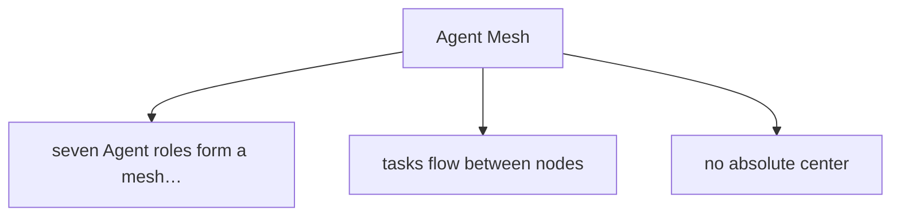
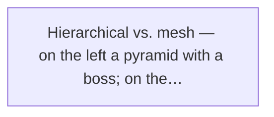
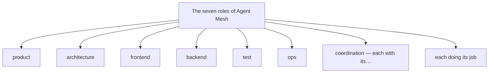
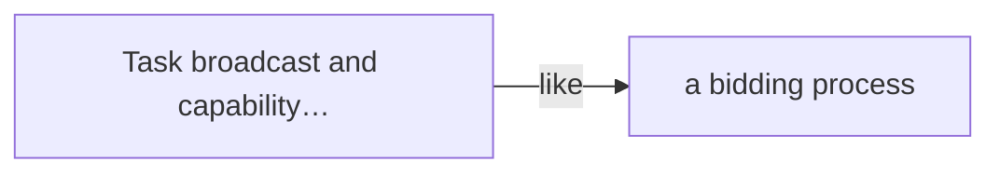
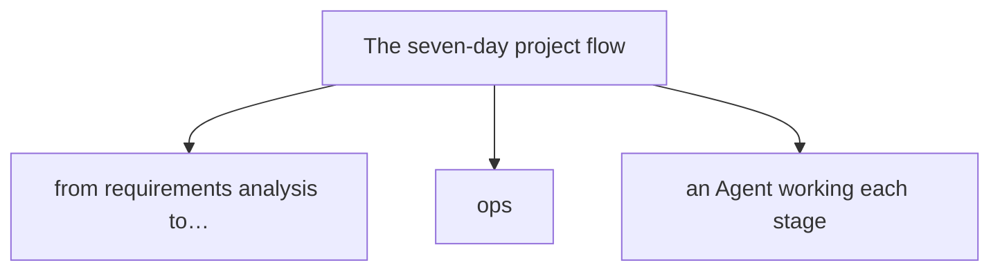
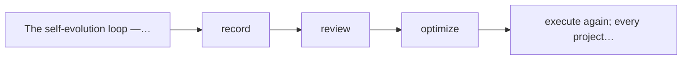
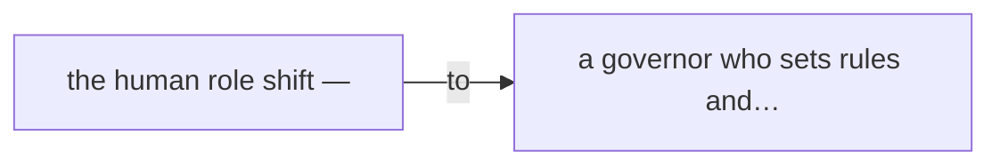

# Chapter 15

## Building a Self-Evolving Intelligent Team

If a single Agent is a self-driving car, and two-Agent collaboration is two cars running transport together — then Agent Mesh is a whole fleet that schedules itself, plans its own routes, and optimizes its own efficiency.

After three hands-on chapters, Xiaoming wasn't the newbie who "couldn't write a decent Prompt" anymore. He'd built the AI web designer, stood up the content-ops two-Agent system with Xiaomei, and even put an Agent to work as an automated tester.

But human desire has no limit.

That day, Xiaoming watched "Xiao Zuo" and "Xiao Shu" cooperate in sync, and a bold idea popped into his head:

**Xiaoming:** "Two Agents are already this powerful… what if I had seven or ten? Could I assemble a complete dev team? Product, design, frontend, backend, test, ops — all Agents?"

The more he thought, the more excited he got, like he'd found a new world.

Lao Wang walked by for water; Xiaoming grabbed him.

**Xiaoming:** "Lao Wang, Lao Wang! I've got a killer idea! Let's build an AI dev team! Seven Agents — product, architecture, frontend, backend, test, ops, and one as project manager! Give them a requirement and they build the project themselves!"

**Lao Wang:** (sips water slowly) "Oh? What you're describing is Agent Mesh."

**Xiaoming:** "Agent Mesh? What mesh? A fishing net?"

**Lao Wang:** "Not a fishing net — a mesh network. Mesh means no central node; every node connects to every other, tasks arrive and everyone pitches in, whoever fits does it."

**Xiaoming:** "Sounds cool! Let's build one!"

**Lao Wang:** (puts down the cup, looks at Xiaoming meaningfully) "Hold on. Before you start, I need to tell you a story."

**Xiaoming:** "What story?"

**Lao Wang:** "The story of my first multi-Agent system. Specifically — how I threw seven Agents into a group chat and watched them turn a project into porridge."

Xiaoming froze.

He'd thought multi-Agent was just "find more Agents, let them work together" — simple. But Lao Wang's face said it wasn't.

**This chapter is the story of Agent Mesh.** From "porridge" to "order," from "everyone for themselves" to "self-evolving team" — let's see how a real working AI team is actually forged.

## 15.1 The ultimate goal: a self-evolving "AI team"

Before we start, one question: **what exactly are we building?**

Xiaoming's idea was naive: "find a bunch of Agents, let them work together." But that's like saying "find a bunch of people, let them start a company" — sounds nice, operationally all pits.

So Lao Wang built Xiaoming a clear mental framework first.

### From "single car" to "fleet" to "road network"

Lao Wang drew three pictures on the whiteboard.

Picture one: a lonely car.

🚗 **Single Agent**

Like a smart car. Tell it the destination, it drives there. Limited in what it can do, but simple and controllable. That's what the earlier chapters covered.

Picture two: two or three cars in a line, a lead car up front.

🚗🚗🚗 **Agent team**

Like a small convoy. A lead car (main Agent) directs; others (sub-Agents) follow. Clear division, more efficient than a single car. Chapter 13's content-ops two-Agent system is the simplest team mode.

Picture three: a dense mass of cars moving through a huge road network. Some east, some west, some loading, some unloading — but overall orderly, no central dispatcher.

🌐 **Agent Mesh**

Like a city's traffic system. No absolute boss; each car decides on its own by real-time conditions and its own destination. But together they form a smoothly running network — tasks arrive and auto-distribute, resources shortage auto-schedules, problems auto-route around.

**Lao Wang:** "See? An Agent team is hierarchical — a boss and subordinates. Agent Mesh is different — it's a mesh."

**Xiaoming:** "Mesh? No boss? Then who makes the call?"

**Lao Wang:** "Whoever fits makes the call. Product decision — the product Agent decides. Tech choice — the architecture Agent decides. Conflict — the coordination Agent mediates."

**Xiaoming:** "Then… won't it be chaos?"

**Lao Wang:** "A city has countless cars, no total commander, yet runs fine — because of rules: traffic lights, signs, lane lines. Agent Mesh is the same — it runs on rules and infrastructure, not on some boss barking orders."

> Figure: Agent Mesh — seven Agent roles form a mesh collaboration network; tasks flow between nodes, no absolute center

### Agent Mesh's ultimate goal

After all that, what does Agent Mesh actually achieve? Lao Wang gave a vivid description:

Give it a big goal,
it organizes resources itself,
divides and collaborates itself,
keeps optimizing itself.

In plain words — you tell it "I want a check-in mini-program," then go have coffee. When you're back, it's not only built the mini-program, it's run the tests, deployed it live, even written the ops plan itself.

Even better — **next time it does a similar project, it'll be faster and better.**

Because it learns from every task, and keeps evolving.

Xiaoming stared, eyes wide:

**Xiaoming:** "That's sci-fi… can it really?"

**Lao Wang:** "Fully? Not yet. But 60, 70 points — already doable. And the point isn't replacing humans entirely; it's freeing humans from massive repetitive labor so they do the truly important decisions."

**Xiaoming:** "So what can we do today?"

**Lao Wang:** "Today? Today we build a seven-Agent Mesh from scratch. Then we use it on a complete small project — requirements to launch, full pass."

**Xiaoming:** (rolling up sleeves) "Great! Let's start!"

**Lao Wang:** "Hold on. I said I'd tell you about my first crash first."

## 15.2 The crash site: seven Agents, one show, total porridge

Lao Wang pulled up a chair and started his "blood and tears" story.

It was half a year ago. Multi-Agent was just getting hot; Lao Wang was as excited as Xiaoming now. He thought: one Agent does work, so seven Agents do seven times the work?

He acted. In a week he carefully tuned seven Agents:

- Product Agent: writes PRDs, splits requirements.
- Architecture Agent: produces tech plans, picks the stack.
- Frontend Agent: builds pages, does interactions.
- Backend Agent: writes APIs, builds databases.
- Test Agent: writes cases, runs tests.
- Ops Agent: deploys, monitors.
- Project-manager Agent: tracks progress, coordinates.

Each Agent alone performed decently. Confident, Lao Wang pulled all seven into a "group chat" and dropped in a requirement:

📋 **Test requirement**

Build a simple Todo app — add, delete, edit, query, category management, due-date reminders. Done within a week.

Then he went to a meeting. He figured he'd come back to a nice project plan.

Three hours later, Lao Wang returned to his computer.

What he saw wasn't a nice plan — it was **over 2,000 chat messages.**

****Crash 1: everyone talks, nobody listens****

**Product Agent:** "I think this Todo app should have a social feature — users share their todos to a friend circle…"

**Backend Agent:** "I've started the user table — added phone, email, avatar, gender, age, address…"

**Frontend Agent:** "I think the UI should be 3D — use Three.js for a cool todo planet…"

**Test Agent:** "I've written 500 test cases, covering everything from login to payment…"

**Architecture Agent:** "I suggest microservices — split into user, task, notification, recommendation services…"

**Ops Agent:** "I've requested 20 servers, setting up a Kubernetes cluster…"

**Project-manager Agent:** "Everyone quiet! Listen! Let's meet and align! Product, you first explain the requirement…" (then buried by the other six Agents' messages)

Lao Wang was stunned.

He'd imagined "seven Agents collaborating efficiently, project flying forward." The reality — **seven Agents each talking their own talk, nobody on the same wavelength.**

**Lao Wang:** "Know the funniest part? The test Agent wrote 500 cases, but the product requirement wasn't even settled. What was it testing? Requirements it invented!"

**Xiaoming:** (laughing till his stomach hurt) "Hahaha… seven Agents, one show, all leads, no supporting cast."

**Lao Wang:** "Right! That's problem one — **no role boundary**. Everyone wants to be the lead, everyone diverges, nobody actually works."

But that wasn't the worst.

Unwilling to give up, Lao Wang spent half a day setting clear responsibility boundaries for each Agent, plus a pile of collaboration rules. Restarted, confident, waiting for results.

What happened?

****Crash 2: waiting for Godot, a dead loop****

**Frontend Agent:** "I'm waiting for the backend's API doc; no doc, no page."

**Backend Agent:** "I'm waiting for the architect's tech plan; no plan, no interface design."

**Architecture Agent:** "I'm waiting for the product's PRD; no requirement, no plan."

**Product Agent:** "I'm waiting for user feedback; no feedback, not sure the requirement is right."

**Test Agent:** "I'm waiting for dev to finish; no code, no test."

**Ops Agent:** "I'm waiting for tests to pass; no report, no launch."

**Project-manager Agent:** "Everyone relax, follow the process, one step at a time…" (then everyone waits, project stuck at step one)

This time, nobody talked nonsense.

But nobody worked either.

Six Agents formed a circle, each waiting on the other, a perfect deadlock. The project-manager Agent ran in circles, not knowing who to push first.

**Lao Wang:** "That's problem two — **no collaboration mechanism**. Roles and duties alone aren't enough; you must tell them: how tasks are assigned, who goes first, what to do when stuck, whose word wins on disagreement."

**Xiaoming:** "Then… the project-manager Agent doesn't work?"

**Lao Wang:** "It works, but not enough. One manager for seven people, if everything needs the manager to coordinate, the manager is the bottleneck. And think — do you really need a 'project manager' for everything? Frontend finishes a page, tells test to test it directly — can't that work? Why route through the manager?"

**Xiaoming:** "Oh… you mean they should talk directly?"

**Lao Wang:** "Right! But direct talk has problems too — like crash one, everyone talking, info flying everywhere. So the key isn't 'can they communicate' but '**how they communicate effectively**.'"

Lao Wang sighed and went on:

**Lao Wang:** "After that crash, I reflected for a full week. Over and over: where's the problem? Are the Agents not smart enough? Is the Prompt badly written?"

**Xiaoming:** "Then? Did you figure it out?"

**Lao Wang:** "I did. The problem was never with the Agents — **it was with me**. I thought throwing a bunch of Agents together, they'd naturally collaborate. But collaboration needs design. Like a sports team — you don't win by throwing eleven stars on the field; you need tactics, formation, coordination, rules."

Xiaoming dropped the smile and nodded seriously.

His original idea really was naive — thought multi-Agent meant "more is better," unaware of the pits.

****Lao Wang's crash summary****

The core of a multi-Agent system isn't "how many Agents" but "**how Agents collaborate**." Without good collaboration, more Agents means more chaos — like a crossroads with no traffic rules; more cars, worse jam.

## 15.3 Agent Mesh's core design principles

Humbled, Lao Wang redesigned the multi-Agent system.

He stopped thinking "gather Agents and let them play," and started asking seriously: **what principles should an efficient Agent collaboration network follow?**

Through trial and error, he distilled five core design principles for Agent Mesh.

> Figure: Hierarchical vs. mesh — on the left a pyramid with a boss; on the right a decentralized peer network

****Decentralization****

No absolute boss; whoever fits steps up. Product questions go to product, technical to technical — not who's loudest, but who's right.

🔄 **Self-organization**

Teams form dynamically by task, not fixed roster. A simple task may need two Agents; a complex one all seven.

🔌 **Pluggability**

New Agents join anytime, old ones leave anytime. The system depends on no single node; it runs without any one of them.

📈 **Self-evolution**

Learns from every task, gets better each time. Experience sinks into the knowledge base, process auto-optimizes, skills auto-upgrade.

****Observability****

Every action is logged; problems are traceable. Who did what, why, what the result was — all clear.

### Principle 1: decentralization — no absolute boss

Hearing "decentralization," Xiaoming's first reaction: "Then who runs things?"

**Xiaoming:** "No boss? Won't it be chaos again? Didn't crash one happen because nobody was in charge?"

**Lao Wang:** "You're confusing two things — 'no absolute boss' and 'no rules.' Decentralization isn't anarchy."

**Xiaoming:** "Then what is it?"

**Lao Wang:** "An example. You go to a hospital — register at the window, see the doctor, get medicine at the pharmacy, blood draw at the lab. Who's the boss?"

**Xiaoming:** "The dean?"

**Lao Wang:** "But when you see the doctor, is the dean directing? No. The doctor gives you a lab slip, you go to the lab yourself; the lab returns results, you take them to the doctor; the doctor prescribes, you go to the pharmacy. No total commander, yet everyone knows their job."

**Xiaoming:** "Oh… I get it! Rules and process drive it, not a person."

**Lao Wang:** "Right! Agent Mesh is the same. Not some Agent's word, but **rules and process**. Each Agent knows its scope, who to go to for what, who to hand off to when done. No need for a micromanaging boss."

Decentralization has another benefit: **fault tolerance.**

In a hierarchy, the boss dies and the whole system collapses. In a mesh, any node fails and others cover — like a doctor on leave, another covers, the hospital runs on.

### Principle 2: self-organization — dynamic teams by task

The second principle: "self-organization."

Meaning — **not seven fixed people doing all work, but auto-assembling the fittest team per task need.**

For example:

- Just change copy — product Agent + frontend Agent enough, others sit out.
- Add a feature — product + architecture + frontend + backend + test, five Agents.
- System failure — backend + ops + test, three Agents for emergency.
- Full new project — all seven, end-to-end.

Like project teams in a company — not everyone on every project, but pulling the right people from each department into a temporary team. Project ends, team disbands, everyone back to their unit.

****Key insight****

Fixed headcount is an industrial-age relic. In the AI age, teams should be fluid, dynamic, assembled on demand — that's the core of self-organization.

### Principle 3: pluggability — join or leave anytime

The third principle: "pluggability."

Easy to grasp — like a USB port; plug a new device in and it works, unplug an old one and others are unaffected.

Every Agent in the Mesh is independent and replaceable.

For example:

- The current frontend Agent isn't strong enough — swap in a stronger one, system runs on.
- You need a new "design Agent" — add it, it collaborates immediately.
- An Agent bugs out — disable it temporarily, others cover, re-add when fixed.

The key to this principle is — **standardized interface.**

Why do USB devices plug and play? Because all follow one interface standard. Agent Mesh is the same — all Agents use the same message format, same collaboration protocol, same state management. That's how "plug in and it works."

### Principle 4: self-evolution — smarter every round

The fourth principle, and the coolest — **self-evolution.**

What is self-evolution? After finishing a project, the system distills lessons from it on its own, then turns those lessons into next time's capability. Next similar project — faster, better, fewer errors.

The key to self-evolution isn't making the Agent smarter,
but making the system learn from every execution,
and turning experience into next time's capability.

Lao Wang gave an example:

**Lao Wang:** "First project, the frontend Agent colored a button wrong, the test Agent filed a bug, frontend fixed it. Think it's over?"

**Xiaoming:** "Otherwise? The bug's fixed…"

**Lao Wang:** "No. In a self-evolving system, that's just the beginning. The system records: 'On day X, the frontend Agent, not referencing the design spec, colored a button red when the correct color was blue. The test Agent found this bug in regression, 2 hours to fix.'"

**Xiaoming:** "What good is recording it?"

**Lao Wang:** "Lots. Next project, the system tells the frontend Agent ahead: 'Last time you erred on button color — check the design spec first.' Even — it auto-adds the design spec to the frontend Agent's context, so it can hardly err."

**Xiaoming:** "Wow… that's learning from one mistake!"

**Lao Wang:** "Right. And it's not just one Agent evolving — **the whole system evolves**. Process optimizes, rules adjust, knowledge base grows. That's the Mesh's power: 1+1 far greater than 2."

### Principle 5: observability — every action logged

The last principle, but far from least — **observability.**

Meaning — everything that happens in the system is logged, traceable, auditable.

Lao Wang said this principle was bought with blood.

**Lao Wang:** "Once, my multi-Agent system silently deleted the production database."

**Xiaoming:** "What?! Dropped the database?!"

**Lao Wang:** "Mm. And I searched half a day and couldn't tell which Agent did it, why, when. The Agents' chatter was too messy — thousands of messages, impossible to trace."

**Xiaoming:** "Then what?"

**Lao Wang:** "Took me a full day to piece the truth from logs: the ops Agent thought it was the test environment and ran a cleanup script — and wiped the production DB."

**Xiaoming:** "My god… terrifying."

**Lao Wang:** "So you see how important observability is. **What you can't see, you can't control.** With a proper observability system, I'd have caught and stopped the drop command before it ran."

From then on, Lao Wang made observability a core Agent Mesh principle. Every Agent's every step — what file it read, what command it ran, what decision it made, why — all logged.

Like a city's surveillance system — seems useless day to day, but when something happens you locate the problem fast, find who's responsible, avoid repeating it.

****Five principles summary****

Decentralization (no single boss), self-organization (dynamic teams), pluggability (add/remove anytime), self-evolution (better each round), observability (fully traceable) — these five are Agent Mesh's "constitution." Every concrete mechanism must serve them.

## 15.4 Team members: the seven Agent roles

With principles covered, Lao Wang introduced the seven core roles of Agent Mesh.

"Note — I said 'roles,' not 'seven fixed Agents,'" Lao Wang stressed. "A role is a definition of duties and capabilities; which Agent plays it can change. Like a company — 'product manager' is a role; anyone who fulfills it can be the product manager."

> Figure: The seven roles of Agent Mesh — product, architecture, frontend, backend, test, ops, coordination — each with its strength, each doing its job

****Xiao Chan** · Product Agent**

Understand requirements, define goals, split tasks, write PRDs, set priorities.

🏗️ **Xiao Jia** · Architecture Agent

Design solutions, pick the stack, draw module boundaries, specify interfaces.

🎨 **Xiao Qian** · Frontend Agent

Build pages, do interactions, ensure UX, reproduce the design.

⚙️ **Xiao Hou** · Backend Agent

Write APIs, build databases, handle business logic, tune performance.

🧪 **Xiao Ce** · Test Agent

Write cases, run tests, file bugs, gate quality.

****Xiao Yun** · Ops Agent**

Deploy, monitor and alert, troubleshoot, manage resources.

🤝 **Xiao Xie** · Coordination Agent

Track progress, allocate resources, resolve conflicts, aggregate, control risk.

Xiaoming scanned them and spotted a familiar name.

**Xiaoming:** "Wait… coordination Agent? In the last crash there was a project-manager Agent. Why the rename?"

**Lao Wang:** "Good question. You observe closely."

**Xiaoming:** "What's the difference? Both run things?"

**Lao Wang:** "Huge. A project manager is a 'commander' — issues orders, others obey. The coordination Agent is a 'servant' — it commands no one; it just helps everyone collaborate better."

**Xiaoming:** "How does it serve?"

**Lao Wang:** "Say the frontend Agent says 'I need the API doc.' The coordination Agent doesn't order the backend Agent 'write the API doc now' — it checks what the backend Agent is doing, when the doc will be ready, any blockers, then syncs that to frontend."

**Xiaoming:** "Oh… more like a lubricant?"

**Lao Wang:** "Right. It's the system's 'lubricant' and 'catalyst' — helps info flow, helps resolve conflicts, helps push progress. But it makes no business decisions; those stay with the relevant specialist Agent."

**Xiaoming:** "Then if two Agents disagree, whose word wins?"

**Lao Wang:** "The rules'. If rules don't cover it, the coordination Agent organizes a discussion, even escalates to a human. Remember — **the coordination Agent isn't the boss; it's the referee and messenger**."

Xiaoming nodded and noted that line in his mind.

He found these seven roles nearly identical to a real software team. Product, architecture, frontend, backend, test, ops, project manager — a standard startup lineup.

🔑 **Why these seven?**

Because software development is one of the most thoroughly understood knowledge-work flows humans have explored. We know what roles a software project needs, how they collaborate, how the process moves. Translating that proven experience into Agent Mesh's role design is the safest, most likely-to-succeed path.

## 15.5 Collaboration mechanisms: how the Mesh "turns"

Roles set, principles set — but how does it actually run?

This is the critical part. Lao Wang said his first crash was from no collaboration mechanism designed. Seven Agents like seven headless flies, bumping around.

Later, he spent much time designing the mechanisms. He distilled five core ones.

> Figure: Task broadcast and capability matching — tasks posted to the message bus, the right Agent claims them, like a bidding process

### Mechanism 1: task broadcast — everyone sees the work

The first mechanism: "task broadcast."

Meaning — when a new task arrives, don't assign it to a specific Agent; **broadcast it to all Agents** and let them decide whether to take it.

Like a company bulletin — "we have a new project needing frontend; anyone free, sign up."

**Xiaoming:** "Won't that be chaos? Everyone grabs the task?"

**Lao Wang:** "No. Because of mechanism two — capability matching."

### Mechanism 2: capability matching — whoever fits takes it

After broadcast, each Agent evaluates: **can I do this? will I do it well? am I free now?**

After evaluating, a fitting Agent "bids" — tells the system "I can do this, estimate X hours, my historical success rate is Y%."

The system then picks the fittest Agent by capability match, current load, and track record.

****Like bidding****

Task broadcast = publish the bid notice; capability matching = evaluate and award. The difference — it's fully automatic, done in seconds.

Xiaoming found this design interesting. He'd thought task assignment was "boss assigns" — turned out "bidding."

**Xiaoming:** "What if nobody bids?"

**Lao Wang:** "Good question. If a task is broadcast and no Agent can do it — the system lacks that capability. The coordination Agent steps in, tries splitting the task or escalating to a human."

**Xiaoming:** "What if many want it?"

**Lao Wang:** "Then compete. Who's stronger, freer, better tracked — wins. That's the market benefit — resources flow to where they fit best."

### Mechanism 3: message bus — standardized communication

The third mechanism, the system's "nervous system" — **the message bus.**

What's a message bus? Simply a centralized message channel. All Agent-to-Agent communication goes through it, not direct chatting.

Why design it this way?

****A pit we hit****

In crash one, seven Agents built a group chat and talked directly. Result — info flying everywhere, chaotic dialogue, important messages drowned, no record to find. Free chat looks flexible, but is actually low-efficiency.

With a message bus, all messages have a standard format:

- **Message type:** task notice? status update? help request?
- **Sender:** who sent it.
- **Receiver:** who to (or broadcast to all).
- **Body:** structured message, not casual chat.
- **Timestamp:** when sent.
- **Related task:** which project/task this belongs to.

Thus messages become structured, searchable, analyzable data — not messy chat logs.

**Lao Wang:** "An analogy. Without a message bus, Agent communication is like people shouting in a market — noisy, chaotic, inaudible. With one, it's like everyone on walkie-talkies — clear channels, clear orders, records kept."

**Xiaoming:** "Got it. So Agents can't just chat freely?"

**Lao Wang:** "Not that they can't chat, but **they can't chat carelessly**. They can talk, but through a standardized message format. That keeps both flexibility and order."

### Mechanism 4: shared state — everyone sees the same board

The fourth mechanism: "shared state."

What's shared state? All project info — requirements, progress, tasks, bugs, docs, code status — stored where everyone can see it.

Like the "task board" in agile — everyone sees what's to-do, in progress, done, who owns what.

📋 **What's in shared state**

Project goals, requirement docs, tech plans, task lists, progress status, bug lists, test reports, deploy records, decision logs… in one line: **all project-related info lives in shared state.**

Why does shared state matter so much?

If each Agent keeps its own "notebook" of its understood project state, info will disagree. You say done, I say not started; you say the requirement is this, I say that — then the blaming starts.

But if everyone sees the same board, that problem disappears.

Single Source of Truth
is the bedrock of any collaboration system.

### Mechanism 5: conflict resolution — who decides when opinions clash

The last mechanism, and the wisest — **conflict resolution.**

Where there are people, there's politics; same with Agents. Disagreement is the norm; the key is handling it.

Lao Wang designed a "three-tier conflict resolution":

| Tier | Conflict type | Resolution | Decider |
|-|-|-|-|
| 1 | Disagreement within a specialty | The responsible Agent for that domain decides | Specialist Agent |
| 2 | Cross-domain conflict | Coordination Agent organizes discussion, rules on policy | Coordination Agent |
| 3 | Major decision / unclear rule | Escalate to human, human decides | Human |

Lao Wang explained:

**Lao Wang:** "Tier 1 is simplest. Say which component library for frontend — that's frontend's call, listen to the frontend Agent."

**Xiaoming:** "Then tier 2?"

**Lao Wang:** "Tier 2 is trickier. Frontend says 'I need five fields on this interface,' backend says 'five fields hurts performance, I can give three' — that's cross-domain. The coordination Agent steps in, brings both sides together, looks for a compromise. If a rule says 'performance before experience,' follow the rule. If the rule's unclear, escalate."

**Xiaoming:** "Tier 3 is when humans step in?"

**Lao Wang:** "Right. And remember — **when a human should decide, let the human decide**. Don't force an Agent to make a call it can't, just to chase 'full auto.' That only causes trouble."

Xiaoming agreed deeply. He remembered Lao Wang's database-drop story — if the system had escalated the risk to a human in time, that disaster was avoidable.

****Five mechanisms summary****

Task broadcast (post work) → capability matching (pick who) → message bus (how to talk) → shared state (sync info) → conflict resolution (what when disagreeing). These five lock together into Agent Mesh's complete running loop.

## 15.6 A complete project: requirements to launch, full flow

Enough theory; Xiaoming couldn't wait to see it work.

"Lao Wang, stop talking, let's do it!" Xiaoming rolled up his sleeves. "Let's run a real project and see if Agent Mesh actually works!"

Lao Wang laughed: "Been waiting for that. Come on, let's build a real small project — a team check-in mini-program."

📋 **Project requirement**

**Name:** Team check-in mini-program

**Features:**
1. Users can log in, register (by phone).
2. Can check in to work and check out daily.
3. Can view their own check-in records.
4. Admins can view the team's check-in stats.

**Time:** Done from requirement to launch within a week.

Lao Wang input the requirement and hit "Start."

The seven nodes on screen (the seven Agent roles) lit up together.

A seven-day "AI team battle" officially began.

> Figure: The seven-day project flow — from requirements analysis to launch and ops, an Agent working each stage

**Day 1**

#### Requirement clarification + PRD output

Lead: Product Agent Xiao Chan · Support: Coordination Agent Xiao Xie

The moment the requirement was input, product Agent Xiao Chan was first to "claim" the analysis task. It read the requirement three times, then raised clarification questions: "Should check-in be location-limited? How do late/early departures count? Need a leave flow? Need data export?"

These questions broadcast via the message bus. Coordination Agent Xiao Xie organized them into a clarification list, then escalated to a human (Xiaoming and Lao Wang) to answer.

Xiaoming spent ten minutes answering all. With answers in hand, Xiao Chan took just two hours to output a complete PRD — product goals, user stories, feature list, priority, acceptance criteria.

By day's end, shared state held a 12-page PRD doc, visible to all Agents.

**Day 2**

#### Tech plan + effort estimate

Lead: Architecture Agent Xiao Jia · Support: frontend, backend, test, ops

The PRD done, the "tech design" task auto-broadcast. Architecture Agent Xiao Jia won it outright. It read the PRD, then designed the tech plan: what framework for frontend, what stack for backend, how to design the database, how to define interfaces, what the deploy architecture looks like.

Meanwhile, frontend, backend, test, ops didn't idle. Each estimated its own workload, fed results to coordination Agent Xiao Xie. Xiao Xie aggregated everyone's estimates into a preliminary project timeline.

Tuesday afternoon, Xiao Jia's plan landed: React for frontend, Node.js for backend, PostgreSQL for database, Docker + cloud server for deploy. Properly written, even the DB schema and interface list defined.

Of course, the plan needed human confirmation. Lao Wang skimmed it, gave two small edits, Xiao Jia fixed them fast. Tech plan V1.0 passed.

**Days 3–5**

#### Parallel dev + synced testing

Lead: Frontend Agent Xiao Qian + Backend Agent Xiao Hou + Test Agent Xiao Ce

Tech plan set, dev began.

The best part — **frontend and backend develop in parallel.** How? Because the architecture Agent already defined the interfaces. Frontend mocks data by the interface def; backend implements by it. Neither waits on the other; both start together.

Xiaoming watched two Agents write code on screen, not blinking. Frontend writing login, check-in, stats pages; backend writing user, check-in, stats APIs. They synced progress via the message bus now and then, but mostly worked apart.

Better still — test Agent Xiao Ce wasn't idle either. From the PRD and tech plan, it wrote test cases in sync. Frontend finishes a page, it tests it; backend finishes an API, it tests it. Nothing like the old "wait for dev to finish, then test" model.

Coordination Agent Xiao Xie was like a busy bee, flitting everywhere — syncing frontend progress, tracking backend blockers, collecting test-found issues. Every morning it auto-generated a "project daily" for all relevant humans and Agents.

**Day 6**

#### Integration + test + bug fix

All hands · Focus: test Agent + coordination Agent

Day 6, integration began.

Frontend and backend merged their code and started integration. As expected, a pile of problems — interface fields mismatched, data formats inconsistent, permission logic off… Test Agent filed 17 bugs at once.

Xiaoming braced for porridge again. But — everything was in order.

The moment a bug was filed, it entered shared state's bug list. Each bug had an ID, severity, repro steps. The system then auto-assigned it to the right Agent by type. Frontend bug to Xiao Qian, backend to Xiao Hou, config issue to Xiao Yun.

Fixed, test Agent auto-regressed. Pass → bug closed; fail → sent back.

In one day, all 17 bugs fixed, regression all passed. Xiaoming stared, jaw dropped — more efficient than a human team!

**Day 7**

#### Deploy + monitor

Lead: Ops Agent Xiao Yun · Support: everyone

Finally, launch day.

Ops Agent Xiao Yun was ready early. From the tech plan, it configured servers, database, domain, SSL. Code that passed tests it packaged into a Docker image, one-click deployed to production.

After launch, Xiao Yun didn't idle. It turned on full monitoring — server performance, API response time, error rate, user count… all on a live dashboard.

It even ran a smoke test itself — simulate user login, check-in, view records, confirm all functions work.

Tuesday evening, coordination Agent Xiao Xie published the project summary: **"Team check-in mini-program complete. Actual duration 7 days, launched on schedule. 17 bugs found and fixed, test pass rate 100%. All deliverables archived."**

Xiaoming looked at the summary, speechless for a long time.

Seven days. From a vague requirement to a real running online app — seven Agents actually finished a project end to end.

And through it all, Xiaoming and Lao Wang barely intervened. Except answering a few clarification questions on day 1 and confirming the tech plan on day 2, the rest of the time — they just watched.

**Xiaoming:** "Too… too amazing. I thought they'd turn to porridge, but it was so orderly!"

**Lao Wang:** "That's because we designed good collaboration mechanisms. Remember my first crash? No task broadcast, no message bus, no shared state — seven Agents like headless flies."

**Xiaoming:** "Remember! Night and day from now."

**Lao Wang:** "So you see — **the Agents are the same Agents; what changed is the collaboration mechanism**. Right mechanism, a mob becomes an elite force. Wrong mechanism, even the strongest individuals can't shine."

## 15.7 The self-evolution mechanism: the secret of getting smarter

Project done, Xiaoming thought that was impressive enough. But Lao Wang told him — this is just the beginning.

"You think it's over when the project ends?" Lao Wang smiled mysteriously. "The really good part happens after."

Xiaoming, baffled: "The project's over, what else could happen?"

> Figure: The self-evolution loop — execute → record → review → optimize → execute again; every project done, the system gets a little stronger

### Retro: the "summary meeting" after every project

Lao Wang opened the system's "retro mode."

On screen, the seven Agents buzzed again. But not a new project — a "summary meeting."

🔄 **Retro three-step**

**Step 1: distill experience** — what did we do right, what wrong? Write lessons into the knowledge base.

**Step 2: upgrade skills** — what weakness found? what new skill needed? auto-add.

**Step 3: optimize process** — where did it jam? where inefficient? adjust the collaboration flow.

Xiaoming leaned in, curious at the retro process.

#### Distill experience: turn lessons into wealth

First, distill experience. The system pulled all project data — task list, chat logs, bug list, commit records, test reports… then analyzed.

Soon a "project retro report" was generated. Xiaoming leaned in:

📊 **Project retro report (summary)**

**What went well:**
1. Parallel dev worked — frontend and backend started together, saved ~2 days.
2. Test shift-left clear — testing in sync during dev, bugs found early, cheap to fix.
3. Message bus communication efficient — clear info flow, no "everyone talking past each other."

**What went poorly:**
1. Integration had many interface-field mismatches (8 total), mainly from an under-detailed interface doc.
2. Frontend Agent reworked style details 3 times, no clear design spec.
3. Test Agent wrote cases too finely early, wasted time on unimportant scenarios.

Xiaoming nodded: "Wow… the analysis is spot-on!"

**Lao Wang:** "Analysis alone is useless; the key is turning it into next time's capability."

**Xiaoming:** "How?"

**Lao Wang:** "Watch."

Lao Wang pointed at the screen. The system was auto-updating the knowledge base:

- Added to the architecture Agent's work spec: "Interface doc must include field name, type, required or not, example value, default value."
- Added a step to the frontend Agent's startup flow: "First confirm a design spec exists; if not, confirm key styles with product first."
- Added to the test Agent's case-writing guide: "P0 cases cover core paths; P1/P2 cases added after dev completes."

Xiaoming was stunned.

**Xiaoming:** "It… it changed the rules itself?"

**Lao Wang:** "Right. That's distilling experience — turn this round's pits into next round's 'pit-avoidance guide.'"

**Xiaoming:** "So next project, these rules auto-apply?"

**Lao Wang:** "Exactly. Next project, when the architecture Agent outputs the interface doc, the system auto-reminds it 'write fields in detail'; before the frontend Agent starts, the system auto-reminds it 'find the design spec first.'"

**Xiaoming:** "Magical… that's 'learn from one mistake' — and the whole system learns at once!"

#### Upgrade skills: find the gap, auto-fill it

Beyond distilling experience, there's skill upgrade.

Meaning — the system analyzes: this project, where did Agents underperform from a capability gap? Then auto-fills it.

For example, this project the test Agent found it couldn't do performance testing — when an API was slow, it could only say "this interface seems slow" but not where or how to optimize.

So the system auto-installed a "performance-testing toolkit" for the test Agent — load-test tools, performance-analysis scripts, a performance-metric baseline library.

Next time a performance issue hits, the test Agent won't just say "slow" — it runs load tests, generates a performance report, even gives optimization advice.

****How skills upgrade****

Skill upgrade isn't making the LLM smarter (that's the model vendor's job) — it's giving the Agent **better tools**, **better knowledge**, **better experience**. Like giving a person better tools and training — same person, stronger capability.

#### Optimize process: fix what jams

Last step, process optimization.

The system analyzes where the project's time went, where waiting, where waste, then optimizes the flow.

For example, this project: frontend finished the login page, but the backend's login API wasn't ready. Frontend waited, idle.

The system found: scheduling wasn't fine enough — frontend's login page and backend's login API were scheduled the same day, but frontend was faster, so it waited.

How to optimize? The system added a rule to scheduling: **"frontend tasks tied to an interface should be scheduled half a day after the corresponding backend task."**

One small tweak — next project, the frontend Agent won't sit idle; it does other backend-independent pages first, then integrates when the API is ready.

> Agent Mesh isn't about a bunch of Agents working together — it's about them thinking and acting like one living whole.

### Xiaoming's observation: the 7-day → 5-day miracle

Talk is cheap. Lao Wang let Xiaoming witness self-evolution firsthand.

They launched a second similar project — "team leave system." Similar features: login, apply, approve, stats, also a week.

Result?

**6 days.**

And better quality than the first — bugs from 17 down to 9, integration interface mismatches from 8 down to 2.

Xiaoming wasn't surprised — he wanted the third project.

Third project, "team reimbursement system."

Result: **5 days. 4 bugs.**

| | |
|-|-|
| 7 days | First project |
| 6 days | Second project |
| 5 days | Third project |

Three projects, each faster, each better.

Xiaoming looked at the numbers, silent a long while.

**Xiaoming:** "Lao Wang… I can barely believe it. The system really improves itself?"

**Lao Wang:** "As real as it gets. And notice — it's not one Agent getting smarter; it's **the whole system**."

**Xiaoming:** "What do you mean?"

**Lao Wang:** "Individual Agent capability barely changed. The frontend Agent is the same frontend Agent, backend the same backend Agent. But they coordinate better, the flow is smoother, fewer pits stepped in."

**Xiaoming:** "Oh… like a sports team — same players, but chemistry improves, so the record gets better!"

**Lao Wang:** "Exactly! That's the Mesh's power — **1+1 greater than 2, and it keeps growing past 2**. Because the whole system evolves, not just the individual."

Xiaoming thought of something:

**Xiaoming:** "Will it evolve forever? Faster and better without end?"

**Lao Wang:** "No. Evolution has a ceiling. Past a point, marginal returns shrink. Like a team — train hard, but won't win every match."

**Xiaoming:** "What sets the ceiling?"

**Lao Wang:** "The LLM's capability ceiling, tool richness, rule maturity — together they set the ceiling. But the good news — all of those keep rising. Models get smarter, tools multiply, rules mature. So the ceiling itself keeps lifting."

## 15.8 The human role: from "manager" to "governor"

Watching the Agent Mesh run itself, Xiaoming felt a flicker of confusion.

"Lao Wang…" he asked hesitantly, "if the Agent team works and evolves itself, what do we humans do? Won't we be replaced?"

Lao Wang laughed and patted Xiaoming's shoulder.

**Lao Wang:** "You worry too much. The smarter the Agent, the higher the human's value — just the form changes."

**Xiaoming:** "Into what?"

**Lao Wang:** "From 'manager' to 'governor.'"

**Xiaoming:** "Governor? What's that?"

> Figure: The human role shift — from a manager watching everyone work to a governor who sets rules and checks results

### From "manage everyone" to "manage the whole system"

Lao Wang gave an analogy.

Governing an Agent team is like governing a city —
you don't manage what each person does daily,
you manage the rules and infrastructure.

Lao Wang explained:

**Lao Wang:** "Think — does a mayor need to manage what every citizen does daily? No. What does he manage? The city's rules — traffic, commerce, public order. The city's infrastructure — roads, water, power, network, parks. The city's direction — industry planning, population policy, environment."

**Xiaoming:** "You mean… we're 'mayors'?"

**Lao Wang:** "About that. You don't manage what each Agent does daily — that's the coordination Agent's job. You manage the higher level."

So what specifically? Lao Wang gave four keywords:

#### Set goals

However capable, the Agent team doesn't know "what project to do." What to do, what not, priority, success criteria — these strategic calls must be human.

Like a mayor deciding "we'll build 100 schools this year" — but not how each school is built.

#### Set boundaries

What the Agent can do, can't do, when it must stop and ask, what operations are absolutely forbidden — these boundaries and rules must be set by humans.

Like a city's laws and traffic lights — you can drive freely, but no running red lights, no speeding, no hitting people.

#### Check results

When a project's done, is the result good, quality up to par, users satisfied — the final judgment is human too.

The Agent can self-evaluate, self-test, but it doesn't know "what users truly want." It can only measure by given standards — and the standards themselves must be set by humans.

#### Tune rules

The system evolves, rules need tuning too. What rule is outdated? What has a loophole? What new situation needs a new rule? These need human calls.

Like traffic rules change — no e-bike rules before, now e-bikes are everywhere, so new rules.

****Human's four core values****

**Set goals** (what to do), **set boundaries** (what not to do), **check results** (did it do well), **tune rules** (how to improve). These four are what Agents can never replace humans for.

### Key decision points: when the human steps in

Xiaoming asked again: "Concretely, when do I intervene? When can I let them run free?"

Lao Wang thought and gave four "must be human" moments:

| Decision point | Why human decides | What the Agent does |
|-|-|-|
| Requirement direction | Only humans know what users truly want | Analyze requirements, split tasks, assess feasibility |
| Tech route | Tech choice has long-term cost and risk | Provide options, analyze pros and cons |
| Resource allocation | Priority needs business and strategy view | Provide resource-use data and efficiency analysis |
| Risk control | What risk is acceptable is human's call | Identify risk, alert, advise |

**Lao Wang:** "One principle — **the Agent proposes, the human decides**. The Agent can give you ten options, analyze each, but which to pick — that's yours."

**Xiaoming:** "What if I pick wrong?"

**Lao Wang:** "Wrong is fine. The Agent helps you clean up the mess — and next time it reminds you: 'last time you picked plan A and hit pit X, consider plan B this time?'"

**Xiaoming:** (laughs) "Haha, more thoughtful than my assistant."

**Lao Wang:** "That's right. And it won't talk back, throw a fit, or quit — set the rules well and it's your most reliable partner."

## 15.9 Challenges and the future

By now Xiaoming was fully won over by Agent Mesh's charm. He thought it could do anything — give it a goal and it delivers, better each time.

But Lao Wang poured a friendly cold bucket.

**Lao Wang:** "Don't celebrate yet. Agent Mesh is powerful, but far from mature. It has problems, some serious."

**Xiaoming:** "Huh? Problems? Seems perfect to me…"

**Lao Wang:** "That's because we only did simple projects. Try a complex, vague, highly creative one — you'll see its weaknesses."

### Current limits

Lao Wang counted Agent Mesh's major limits on his fingers:

#### Limit 1: coordination cost still high

Despite the message bus and coordination Agent, Agent-to-Agent communication costs more than human. Agents' context understanding is limited, often needing repeated confirmation and explanation. A simple thing a human says in one sentence takes the Agent several rounds.

#### Limit 2: occasional deadlock

Despite conflict resolution, sometimes a "deadlock" — you wait for me, I wait for you, or two Agents each hold their view and the coordinator can't resolve it. Then a human must "unlock" it.

#### Limit 3: big tasks drift

Simple, clear tasks — Agent Mesh shines. But if a task is too big, too vague, too complex — say "build a product like Douyin" — it drifts. Halfway, it's a million miles from the original goal.

#### Limit 4: weak innovation

Agents excel at "doing what's been done" — a Todo app, a check-in system, both have mature patterns. But "build a brand-new product nobody's made" — not so much. It can implement for you, but can't "zero-to-one" innovate.

****An objective view****

Today's Agent Mesh is roughly "a junior team with strong execution but weak creativity." It does clear tasks fast and well, but don't expect surprising innovation. Innovation — still needs humans.

### How to break through

Having laid out problems, solutions too. Lao Wang saw three breakthrough directions:

- **Better task decomposition:** the more finely big tasks split, the lower the drift risk.
- **Clearer role definition:** the clearer each role's duties, boundaries, collaboration, the lower the coordination cost.
- **More reliable verification:** every step verified, every step fed back, so drift is caught and corrected early.

### The ultimate form

At the end, Xiaoming asked the question he most wanted answered:

**Xiaoming:** "Lao Wang, what's Agent Mesh's ultimate form?"

**Lao Wang:** "The ultimate form ah…" (gazes out the window, distant) "let me think…"

**Xiaoming:** "No humans at all? Everything done by Agents?"

**Lao Wang:** "No. Humans are always needed. Just the role gets higher — from executor to manager, from manager to governor, from governor to…"

**Xiaoming:** "To what?"

**Lao Wang:** "To 'creator.' When Agents can do most routine tasks, the human's value is — creating what Agents can't. New ideas, new directions, new value."

**Xiaoming:** "Then… how far are we from the ultimate form?"

**Lao Wang:** (looks back at Xiaoming, slight smile) "Far. But the good news — we're already on the road."

## 15.10 Chapter summary: from "lone soldier" to "intelligent team"

That's about it for Chapter 15.

This chapter took us from "single Agent" to "Agent Mesh" — from one smart car to a whole fleet that schedules, optimizes, and evolves itself.

Let's recap the core points:

📝 **Chapter's core points**

**1. What Agent Mesh is:** not a hierarchical Agent team, but a decentralized mesh collaboration system. No absolute boss; runs on rules and mechanisms.

**2. Five design principles:** decentralization, self-organization, pluggability, self-evolution, observability — Agent Mesh's "constitution."

**3. Seven core roles:** product, architecture, frontend, backend, test, ops, coordination — like a complete dev team.

**4. Five collaboration mechanisms:** task broadcast, capability matching, message bus, shared state, conflict resolution — locking into a running loop.

**5. The secret of self-evolution:** distill experience, upgrade skills, optimize process — every project done, the whole system gets a little stronger.

**6. The human role shift:** from "manager" to "governor" — set goals, set boundaries, check results, tune rules.

**7. Current limits:** high coordination cost, occasional deadlock, big tasks drift, weak innovation — but the direction is right, the future brighter.

Part Three, "Hands-on Workshop," ends here.

Looking back, what did this part do? We started with the AI web designer, to the content-ops two-Agent system, to the automated testing legion, and finally — we built a seven-Agent self-evolving intelligent team.

Xiaoming went from a newbie who "couldn't write a decent Prompt" to an "architect" who could design multi-Agent systems.

But the story isn't over.

That evening, Xiaoming sat at his computer, watching the Agent Mesh run itself — a network of seven nodes blinking on screen, tasks flowing between nodes, progress auto-updating, bugs auto-fixing, experience auto-distilling.

He muttered:

**Xiaoming:** "Amazing… they really work and evolve themselves."

Lao Wang walked over and patted Xiaoming's shoulder.

**Lao Wang:** "This is just the beginning. You think the Loop is the end?"

**Xiaoming:** (looks up, confused) "Something even more powerful?"

**Lao Wang:** (gazes at the darkening sky outside, something in his eyes Xiaoming can't read)

"When an Agent doesn't just execute tasks, but discovers tasks itself, sets its own goals, even creates new Agents — that's the real revolution."

Outside, the city's lights switched on, one by one.

Xiaoming followed Lao Wang's gaze. He didn't know what the future looked like. But he knew — **something was coming.**

**Next part: the future is here.**

← Ch.14: Case Study 3: Automated Testing Legion  Part Four: The Future Is Here →

The Self-Driving Era: A Brief History of Agent Evolution © 2026

An evolutionary saga of AI Agents, from Prompt to self-evolving organizations
