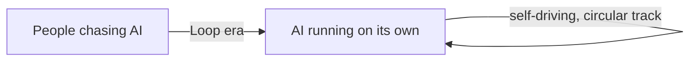
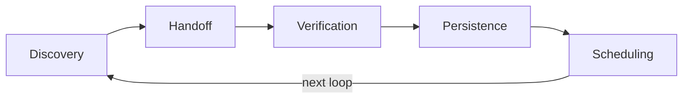
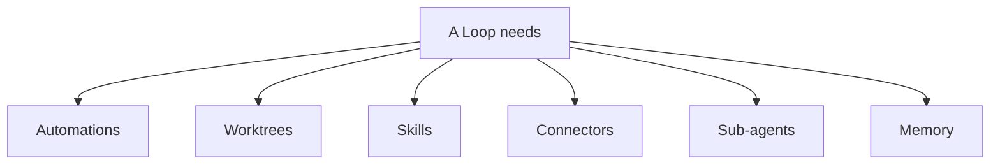
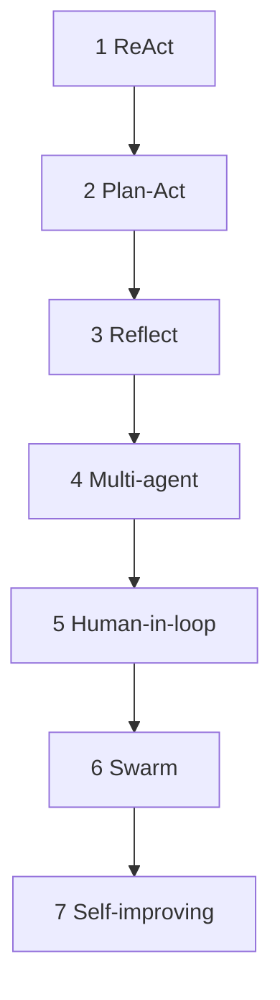
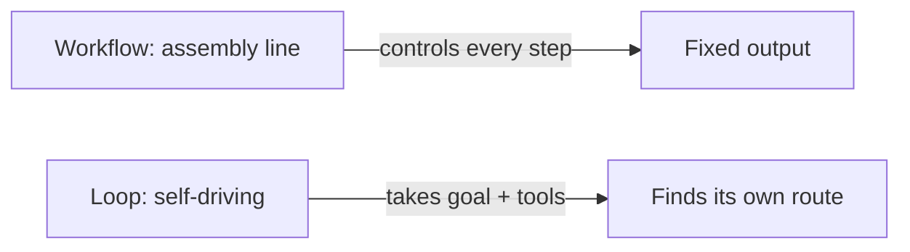
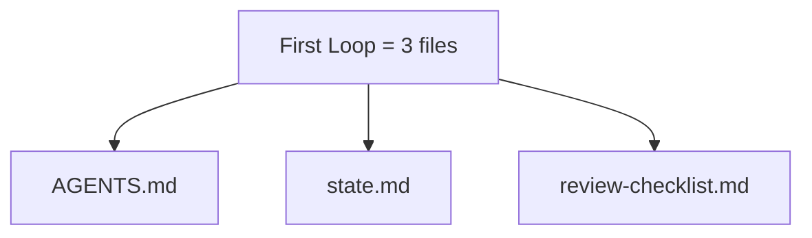
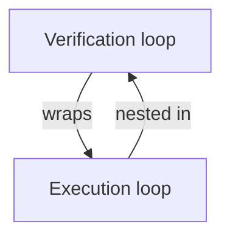
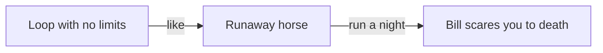
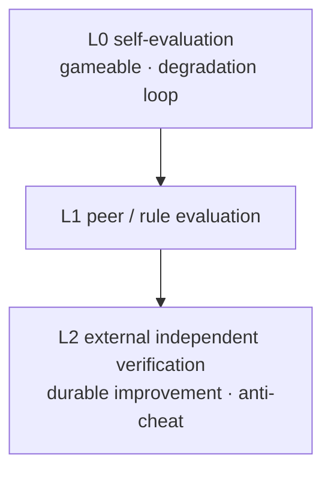

# Part Four · The Future Is Here

Chapter 16

When the Agent Learns to Run on Its Own

At three in the morning, Xiaoming's phone buzzed him awake. Still half asleep, he saw a notification on the screen: "Your Agent has finished today's project-status analysis. It found 3 issues that need attention and ranked them by priority."

Xiaoming rubbed his eyes, sure he was seeing things. He'd only told the Agent "check the project status every morning" before going to bed the night before — so how was it already running? And at 3 a.m., no less. Doesn't this thing ever sleep?

He opened his laptop and found that the Agent had not only analyzed the project status but also created two issues on its own, even drafting a fix for one of them. Stranger still, it had pulled up a technical approach Xiaoming had mentioned the previous week: "Based on the refactoring idea we discussed earlier, here's how to solve this."

**Xiaoming**

Holy — this thing works while it sleeps?!

Exactly. That is daily life in the Loop era.

In earlier chapters we saw how capable an Agent can be — it has a brain, memory, tools, sub-agents, and can be observed. But every one of those abilities shared one premise: **someone had to start it.**

Think of a high-end self-driving car. If you don't get in and set a destination, it won't move.

But everything changes starting with this chapter.

The Agent learns to start itself, to find its own work, to check its own results, and to schedule the next round. It stops being a car you have to drive every day and becomes a car that **drives itself.**

> Figure: From "people chasing AI" to "AI running on its own" — in the Loop era, the Agent is like a self-driving car that never stops on a circular track

## 1. From "People Chasing AI" to "AI Running on Its Own"

Let's first look back at how we used AI in the past.

### Before: One Instruction, One Step

In the Prompt era, you said one thing and the AI answered one thing. Like a question-and-answer chatbot — if you didn't ask, it didn't move.

By the Context era and the Harness era, the AI could do more — call tools, read files, run multi-step tasks. But at its core, it only acted when you said "do this."

Driving analogy: you say "go to the office" and it drives there; you say "take the highway" and it takes the highway. But if you don't speak, it sits in the garage gathering dust.

**Xiaoming**

Isn't that normal? Isn't that how tools work? If you don't start it, how does it do anything?

**Lao Wang**

Then let me ask you — do you press the start button on your robot vacuum every day?

**Xiaoming**

No, it comes out and cleans on its own on a schedule... oh! I get it!

Right, that's the point.

A robot vacuum is useful not just because it can clean, but because it **comes out and cleans on its own schedule**. You don't have to think "time to vacuum today" — it remembers for you.

### Now: Set a Goal, and AI Loops Forward on Its Own

The core shift of the Loop era is moving from **process-driven** to **goal-driven**.

**Paradigm shift**

**Process-driven:** A human defines every step, and the AI executes them in order. Like writing an operations manual for a worker — step one does this, step two does that, all hardcoded.

**Goal-driven:** A human defines only the goal; the AI figures out the approach, plans the steps, and loops forward on its own. Like giving a project manager a KPI and letting them decide how to hit it.

This is not plain "automation." Automation chains known steps together so the machine repeats them. A Loop hands the goal to the AI and lets it decide each round what to do, how to do it, and to what degree.

The essence of a Loop is not making the AI repeat the same task, but carrying the previous round's results into the next one.

That's a mouthful, so let me unpack it.

Plain automation is: A → B → C → done. Every step is fixed; once it runs, it's over.

A Loop is: spot a problem → try to fix it → check the result → decide the next round based on that result → spot a new problem → try again...

Each round's input is the previous round's output. Each round's decision builds on what the last round taught.

It's like driving somewhere unfamiliar — you don't map out every meter up front. You drive a stretch, glance at the navigation, adjust your direction, then drive another stretch. Every step adjusts based on the one before it.

That is real "self-driving."

## 2. The Five Actions of a Loop: A Complete Lifecycle

What exactly makes up a complete Loop? Lao Wang drew Xiaoming a diagram.

> Figure: The five core actions of a Loop — Discovery → Handoff → Verification → Persistence → Scheduling — form a complete cycle

Like a car on a circular track, every lap passes through five key stations. Drop any one and the loop is broken; the car won't run.

**01 — Discovery**
*Find work instead of waiting to be assigned.*

**02 — Handoff**
*Pass it on with a clean cut.*

**03 — Verification**
*Don't grade your own homework.*

**04 — Persistence**
*Write results outside the chat.*

**05 — Scheduling**
*Decide when the next round runs.*

### Discovery: Find Work on Your Own

This is the biggest difference between a Loop and ordinary automation.

Ordinary automation is "act only when triggered" — someone clicks a button, a webhook arrives, or the timer fires. And what it does is the preset task.

A Loop's Discovery **actively scans the environment for work that needs doing.**

Take Xiaoming's project-status Agent. It doesn't wait for him to say "analyze it for me." Every morning it wakes up, scans the repo's commit log, the issue list, and the CI status, then judges: "Hmm, there's a bug nobody's fixed, a PR waiting for review over there, and this feature looks delayed..."

It finds the problems itself, sets its own priorities, and plans what to do next.

**Xiaoming**

That's way too proactive... won't it go looking for trouble?

**Lao Wang**

So Discovery isn't "do whatever you see" — it's "within the given goal, find what's worth doing." You set its boundaries: what it may touch, and what it must not.

### Handoff: Pass It On with a Clean Cut

After finding a task, you don't just dive in. First comes a "handoff" — moving the task from the "finder" to the "doer."

Why add this step? Because finding and doing are different skills, best done by different roles.

In a company, a product manager finds the need, then hands it to a developer to build. PM and developer are two people, with a clear handoff in between — requirement review, scheduling, technical design.

If the same role both finds and does, you easily get "think while doing, drift further off course." Like trying to read a map while driving — you'll take a wrong turn.

Handoff's core is the **structured handoff** — not a casual "you handle this," but writing down the goal, background, constraints, and acceptance criteria into a standard transfer sheet.

### Verification: Don't Grade Your Own Homework

Done executing — is the result right? Is the quality good? That's Verification's job.

The key rule: **the doer cannot verify its own output.**

Why? Because whoever wrote the code will swear it's correct. Like a student grading their own exam — who wouldn't want full marks?

So Verification must be independent — either another Agent checks it, or objective means like automated tests, linters, and formal verification.

**Key principle**

**A Loop without a quality gate isn't automation — it's scaling up uncertainty.**

If every round's output quality is uncontrolled, the more it loops, the more garbage it produces.

### Persistence: Write Results Outside the Chat

This is the part many people overlook, yet it matters most.

What is "persisting state"? Storing this round's result in a durable way — not in the chat log, but in a file, a database, an issue, a code commit.

Why does it matter? A Loop runs many rounds; the next one needs to know where the last one left off. If state lives only in chat, every round starts the conversation over — brutally inefficient.

More importantly, **persisted state is the interface between humans and the Agent.** A person can read `state.md` to see what the Agent did, and edit `state.md` to steer it.

### Scheduling: Decide the Next Round Yourself

The last step, and the one with the most "Loop" flavor — the Agent decides when and what the next round runs.

Not a fixed "every hour," not "9 a.m. sharp." It judges from the current state:

- Found an urgent bug? Jump into the next round and fix it now.
- Nothing to do right now? Check back in a few hours.
- Waiting on an external dependency (say, someone to review a PR)? Check again tomorrow.
- Three rounds with no new findings? Slow the cadence — once a week is enough.

That is real "running on its own" — not repeating at a fixed frequency, but adjusting its rhythm to the actual situation.

## 3. The Six Parts of a Loop: Infrastructure That Makes It Run

The five actions alone aren't enough. To actually run, a Loop needs six infrastructure parts — like a car needs roads, gas stations, repair shops, and navigation.

> Figure: Six pieces of infrastructure a Loop needs to run — Automations, Worktrees, Skills, Connectors, Sub-agents, and Memory

****Automations****
Let the Agent start itself, no button-pressing. Timed triggers, event triggers, webhook triggers...

🌲 **Worktrees**
Run multiple tasks at once without stepping on each other. One isolated working directory per task.

📚 **Skills**
Bank your experience so you don't relearn from scratch each time. Project conventions, technical approaches, frequent problems...

🔌 **Connectors**
See the wider world. Connect to GitHub, Feishu, databases, APIs...

👥 **Sub-agents**
Separate generation from review. One does the work, another checks it.

****Memory****
Carry state into the next round. State files, memory stores, history...

We've actually touched all six in earlier chapters. But in the Loop era their role changes —

Before, they were "tools that boost the Agent's abilities." Now, they are "infrastructure the Loop runs on."

What does that mean? Think of road-building. Before, you put better tires and a better engine on your own car. Now, you build the roads, set up gas stations, and install traffic signals. These aren't for one car; they're the foundation of the whole traffic system.

Without Automations, the Loop can't start itself. Without Worktrees, tasks collide. Without Skills, every round relearns from zero. Without Connectors, the Agent is a frog at the bottom of a well. Without Sub-agents, you can't separate generation from review. Without Memory, every round is the first round.

**Xiaoming**

So all six are mandatory?

**Lao Wang**

Not strictly mandatory — but whichever one you drop, that's the gap in your Loop. Drop Automations and it can't self-start; drop Verification and quality is uncontrolled. Start simple, but to run steady you need all six.

## 4. Seven Typical Loop Patterns

You might be asking by now: what does a Loop actually look like? Are they all the same?

Of course not. Like cars — sedans, SUVs, trucks, sports cars — Loops come in different shapes for different situations.

> Figure: Seven typical Loop patterns, from the simplest ReAct to the most complex self-improving — each step up adds complexity

**1 — ReAct Loop: Think and Act Together**
The most basic loop. Thought → Action → Observation → another Thought → another Action... think while acting, and adjust the next step from each observation. Like walking — step, look, step again. Good for simple, exploratory tasks.

**2 — Plan-and-Execute: Plan First, Then Run**
Spend time on a detailed plan listing every step, then execute it. Like planning a road trip down to where you sleep and eat each night, then following it. Good for multi-step tasks with a clear goal. More efficient than ReAct, but less flexible.

**3 — Reflection Loop: Self-Reflection and Correction**
Wrap a reflection loop around the execution loop. After each task, step back and ask: "Did I do that right? Is there a better way?" Then adjust the next round from what you learned. Like writing a daily retro to keep improving. Good where high-quality output matters.

**4 — Tree of Thought: Explore Multiple Paths**
Don't walk just one path — explore several at once, evaluate each one's prospects, and pick the best to go deeper. Like chess: think a few moves ahead and judge which line wins. Good for complex tasks needing creativity or decisions — choosing an approach for code, a direction for design.

**5 — Graph Loop: State Machines and Graph-Structured Control**
Use a graph to define the Loop's structure — nodes are states, edges are transition conditions. The Agent moves through the graph and picks the next node by the conditions. More flexible than a simple loop; handles complex branching. Like a subway map where you transfer lines as needed.

**6 — Multi-Agent Loop: Multiple Agents Cooperating**
Not one Agent looping, but several working together to form a loop. One writes code, one tests it, one reviews it — three Agents (workers)接力 in turns, forming a quality loop. Like an assembly line where each station owns one process and the product comes out complete after one pass.

**7 — Self-Improving Loop: Keep Learning and Optimizing**
The top-tier Loop pattern — the Agent not only finishes the task but learns from every round's experience, improves how it works, updates its knowledge base, even rewrites its own prompt and rules. Like a person who gets sharper and smarter the more they work. This is the real "gets better the more you use it."

**Lao Wang's experience**

Don't start with the most complex. Begin with ReAct; once it runs, add Plan-and-Execute; if quality falls short, add Reflection; when tasks get complex, add Multi-Agent. One step at a time — like learning to drive: straight lines first, then lane changes, then parallel parking.

## 5. A Loop Is Not a Workflow: From "Fixed Steps" to "Fixed Goal"

Here Xiaoming had a question — what's the difference between a Loop and a Workflow? Don't they both "work automatically"?

> Figure: A Workflow is an assembly line that controls every step; a Loop is self-driving that takes a goal and tools and finds its own route

Lao Wang gave him an example.

**Lao Wang**

Say you want a "weekly report" feature. What does a Workflow do?

**Xiaoming**

Hmm... trigger at 9 a.m. every Monday → pull last week's data → generate charts → write the report copy → send to the group. Five steps, all hardcoded.

**Lao Wang**

Right, that's a Workflow. The steps are fixed, the order is fixed, what each step does is fixed. If something breaks midway — say the data pull fails — the whole thing jams.

**Xiaoming**

So what does the Loop do?

**Lao Wang**

The Loop takes a goal — "every Monday morning, send the team a useful project weekly." Then it gets tools — data queries, document writing, messaging. As for how it does it, what if the data won't pull, should the content change, should it wait for some important number before sending — those it decides itself.

See the difference?

| Dimension | Workflow | Loop |
|-|-|-|
| Controls what | Controls the steps | Controls the goal |
| Analogy | A worker's operations manual | Give a worker a goal and tools |
| Flexibility | Low — fixed steps | High — autonomous decisions |
| Exception handling | Preset exception branches | Judges and handles on its own |
| Quality assurance | Depends on process design | Depends on the verification step |
| Evolution ability | Can't self-evolve | Can self-optimize |
| Best for | Standardized, repetitive tasks | Tasks needing judgment and exploration |

One line sums it up: **a Workflow is "process automation"; a Loop is "decision automation."**

A Workflow frees your hands — no more clicking buttons, the machine runs. But the brain still has to be human: how to design the flow, how to handle exceptions, whether to adjust the steps — all decided by a person.

A Loop starts freeing your brain too — you no longer have to think about the next step every day; the Agent thinks for itself. You only set the goal and the boundaries; it arranges the how.

### The Maturity Ladder: From Manual to Autonomous

Of course it isn't black and white. The path from Workflow to Loop is gradual. Lao Wang drew a "maturity ladder":

**L1 — Manual**
All human. Human decides, human executes. Like a stick-shift car, fully driven by the person.

**L2 — Assisted**
Human leads, AI assists. Human decides, AI helps execute parts. Like cruise control — foot off the gas, but hands still on the wheel.

**L3 — Delegated**
Human sets the goal; AI completes one task autonomously. Human only checks the result. Like automated parking — you get out, the car parks itself.

**L4 — Orchestrated**
Multiple tasks, multiple Agents working together in a loop. Human only handles exceptions. Like self-driving — mostly hands-off, human steps in only for special cases.

**L5 — Autonomous**
Fully autonomous — sets its own goals, optimizes itself, evolves itself. Human only does top-level oversight. Like full self-driving — you can sleep in the car.

Most teams today sit between L2 and L3; a few advanced teams have one foot on the L4 threshold. L5 is still a distant goal, but the direction is clear.

## 6. Your First Loop: Start with Three Files

After all this theory, Xiaoming couldn't wait: "Lao Wang, enough talking — I want my own Loop too. How do I start? Do I build something huge?"

Lao Wang laughed: "No. Three files will do."

> Figure: Your first Loop needs only three files — AGENTS.md, state.md, and review-checklist.md

### File One: AGENTS.md — Project Rules

This is the Loop's "constitution," defining the Agent's role, goals, boundaries, and way of working.

    AGENTS.md

# 项目状态分析 Agent
## 角色
你是一个项目状态分析师，负责每天早上扫描项目状态， 发现问题并提醒相关人员。
## 目标
- 每天早上 9 点前产出项目状态简报
- 识别高优先级问题并建议行动
- 跟踪上周问题的解决进度
## 工作范围
**可以做：**
- 读取代码仓库的提交记录和 issue
- 读取 CI/CD 状态
- 生成状态报告并保存到 state.md
- 创建 issue（需标注为"自动创建"）
**不能做：**
- 直接修改代码
- 关闭别人的 issue
- 直接给人发消息（等我确认后再发）
- 涉及费用的操作
## 输出格式
参考 review-checklist.md 中的检查清单。

### File Two: state.md — Current State

This is the Loop's "dashboard," recording the current state, what the last round did, and what the next round plans.

    state.md

# 项目状态
## 最近更新
- 上次运行：2026-06-29 09:00
- 下次运行：2026-06-30 09:00
- 运行状态：正常
## 当前关注问题
1. [高] 登录页面偶发白屏 - issue #234 - 已分配给小明 - 待复现步骤确认
2. [中] 首页加载速度慢 - issue #228 - 性能优化方案已评审 - 预计本周完成
3. [低] 文档缺少 API 说明 - issue #210 - 待小美确认优先级
## 历史记录
- 第 37 轮（昨天）：发现 2 个新 issue，跟进 3 个旧问题
- 第 36 轮（前天）：发现 1 个 CI 失败，已通知小明

### File Three: review-checklist.md — The Checklist

This is the Loop's "quality standard," defining what every round's output must satisfy.

    review-checklist.md

# 状态报告检查清单
每轮生成状态报告后，逐项检查：
## 完整性
- [ ] 是否覆盖了所有活跃的 issue？
- [ ] 是否包含了最近 24 小时的提交？
- [ ] 是否检查了 CI 状态？
## 准确性
- [ ] issue 状态是否和实际一致？
- [ ] 优先级判断是否合理？
- [ ] 有没有误判或遗漏？
## 可读性
- [ ] 是否按优先级排序？
- [ ] 每个问题是否有清晰的下一步？
- [ ] 语言是否简洁明了？
## 安全性
- [ ] 是否有越权操作？
- [ ] 是否包含敏感信息？
- [ ] 创建的 issue 是否标注了"自动创建"？

### Xiaoming's First Loop

With just those three files plus a scheduled task (trigger every morning at 9 a.m.), Xiaoming's first Loop was running.

On day one it was clumsy — the report rambled, its priority calls were off, and sometimes it dragged solved problems back out to complain about them.

But the magic was this: because of `state.md`, it remembered the mistakes from the last round; because of `review-checklist.md`, it self-checked every round; because of `AGENTS.md`, Xiaoming could fix its behavior anytime by editing the rules.

A week later, the Loop was running like a real thing. Every morning Xiaoming arrived at the office, opened `state.md`, and saw the whole project at a glance — what was urgent, what was in progress, what was solved.

**Xiaoming**

This is amazing! I used to spend half an hour every morning scanning project status. Now it's just a file. And it's more careful than me — it catches the little issues I always miss.

**Lao Wang**

This is just the start. Think about it: if not just status analysis, but code review, doc updates, and tests all ran automatically... what then?

**Xiaoming**

Then... I'd only need to read a few reports a day?

**Lao Wang**

Right. That's the value of a Loop — **it turns you from "the one who does the work" into "the one who reads the results."**

## 7. Loopcraft: The Art of Stacking Loops

If a single Loop is already powerful, what about combining several?

> Figure: Loopcraft — the composability of loops: a verification loop wrapping an execution loop, a big loop nesting a small one, layered

Lao Wang calls this "Loopcraft" — the art of stacking loops.

### Why Loops Can Be Combined

Because every Loop shares the same structure: input → process → output → verify. Like Lego bricks, every piece has a standard interface, so they combine freely.

The most common combination is **"a verification loop wrapping an execution loop."**

What does that mean? Say you have a code-writing Loop that handles features. But you're not confident in its quality. So you wrap a code-review Loop around it.

The inner Loop "generates"; the outer Loop "reviews." When the inner one finishes, the outer one checks — pass and it's approved, fail and it's sent back for a rewrite.

**Core insight**

Go a layer down and you add reliability; go a layer up and you add leverage.

— Add loops inward and quality climbs; add loops outward and coverage grows.

### Why Loops Can Nest

Beyond combining sideways, Loops nest vertically — a big loop holding a small one.

Take a "product iteration" big loop that nests "requirements analysis," "development," "test verification," and "release" small loops. Each small loop spins on its own; the big loop waits for all of them to finish before the next round.

Like a company's org chart — the CEO runs the company-wide big loop (annual goals), each department has its mid loop (quarterly), each team its small loop (weekly). Layered, each with its own rhythm and goal.

Composability is the Loop era's most powerful property.

Here's what that means, in Lao Wang's numbers for Xiaoming:

- 1 Loop = 1 ability to work automatically
- 2 Loops combined = not 2×, but 2+N new ways to collaborate
- With 10 Loops, how many workflows can you compose? Answer: exponential growth

And the key point — **every Loop can be optimized independently.** Improve the code-review Loop and everywhere it's used benefits. Raise the test Loop's quality and the whole system steps up.

This is the "leverage effect" — an improvement on one Loop amplifies through the composition to the entire system.

**Lao Wang**

In the industrial age, engineers designed machines. In the software age, engineers designed systems. In the Agent age, engineers design loops.

**Xiaoming**

Designing loops... sounds cool. But I have a question — a Loop is so powerful, can we just hand it everything?

**Lao Wang**

Good question. Next, let's talk about the Loop's boundaries and risks.

## 8. The Loop's Boundaries and Risks

Everything so far was the good side of Loops. But every coin has two sides, and the more powerful the Loop, the bigger the risk.

Xiaoming learned this the hard way.

### The Night the Costs Ran Away

One weekend, Xiaoming set a Loop on his Agent — "refactor all the legacy code in our project." He figured it was a big task, let it run slowly and he'd check the result when done.

Then he went out to enjoy himself.

The next morning, Xiaoming got a cloud bill alert. He looked, and nearly dropped his phone — **it had spent, in one night, what he normally spends in a month.**

> Figure: A Loop with no limits is like a runaway horse — run it a night and the bill scares you to death

He rushed home to see what the Agent was doing — and there it was, "perfecting" things. It wrote a piece of code, felt it wasn't good, rewrote it; finished, reviewed it, felt it still wasn't good, rewrote again; ran the tests, found a small issue, rewrote yet again...

Back and forth like that, a few hundred rounds in one night.

**Xiaoming**

Oh my god... does it ever stop grinding?! Is that necessary!

**Lao Wang**

That's one of the Loop's most common risks — runaway costs. A loop with no ceiling is a car with no brakes; the faster it goes, the more dangerous.

### Four Risks and How to Handle Them

Lao Wang summed up four main risks of a Loop and how to respond.

#### Risk One: Not Every Task Fits a Loop

Some tasks are one-and-done; no loop needed. "Write me a leave request email" — once written, it's done; no need to loop it daily.

**Test:** Does this task need to **repeat**? Is each round's input **based on the last round's output**? If no to either, you don't need a Loop.

#### Risk Two: A Loop Without a Quality Gate "Scales Up Uncertainty"

This is the most dangerous case. If your Loop has no verification step and each round's output quality varies wildly, the more it loops, the more garbage it makes.

Picture a code-writing Loop with no tests and no review — run it 100 rounds and you get 100 piles of bugs. And because it runs automatically, you might never notice.

**Response:** Every Loop must have a quality gate. Output that fails the bar can't enter the next round, let alone touch the real environment.

#### Risk Three: Runaway Costs

Like Xiaoming's night — the Loop never stops, tokens burn, the bill climbs.

**Response:**

- Set a max round count: at most N rounds per run, stop at the limit.
- Set a budget cap: max spend per day/week; auto-stop when exceeded.
- Set a convergence condition: auto-end when several rounds show no real progress.
- Cost monitoring: watch spend in real time, alert on anomalies.

#### Risk Four: The Human's Place — Keep a Human at the Key Judgment Points

This is the most fundamental issue — powerful as it is, a Loop can never be fully without a human.

Which judgments must stay human?

- **Value judgment:** Is this worth doing? Is the priority right?
- **Ethical judgment:** Will this cause problems? Will it hurt anyone?
- **Risk judgment:** If something goes wrong, can we bear the consequence?
- **Direction judgment:** Is the overall direction right? Should we adjust the goal?

**Lao Wang's advice**

Build loops like an engineer who plans to keep being an engineer — not like someone whose only job is pressing the start button.

— Your value isn't "starting the Loop," but "designing the Loop, guarding the Loop, and making the calls at the critical moments."

Like self-driving, no matter how advanced, someone needs to know how to drive. If the system fails, you have to be able to take over.

A Loop is a tool, not a replacement. It does the manual and repetitive work for you, but **the wheel stays in your hands.**

### To Be Continued

Xiaoming sighed: "Loops are incredible! An Agent can find its own work, do it, check it, and move to the next round... so soon we won't need people?"

Lao Wang shook his head: "One Agent running on its own is impressive. But what if a whole team runs on its own? And what if the team can evolve itself?"

Xiaoming's eyes went wide: "Evolve itself?"

Lao Wang: "Right. From a single intelligence to collective wisdom — that's the real revolution."

## 9. Research Frontier: The Evolution Paradox and Recursive Self-Improvement

Xiaoming had just been marveling at how powerful Loops are, when Lao Wang poured cold water on it: "Don't celebrate yet. A Loop that runs itself is scary enough; but if it can **rewrite itself**, what then?"

Xiaoming: "Rewrite itself? Like Skynet from the sci-fi movies?"

"Easy — reality isn't that dramatic, but it's not that simple either." Lao Wang drew a pyramid on the whiteboard. "This touches an old debate in AI — **Recursive Self-Improvement (RSI)**. Researchers split it into two tiers:

- **Bounded self-optimization**: small-step improvement within a fixed framework — a Loop that reviews itself after each run and tunes its prompts and process. **Safe, but with a clear ceiling;**
- **Open-ended RSI**: rewrites its own code, even its training process, spawning a stronger 'next-generation self.' **Huge potential, but three hard constraints block it**: grounding in reality (don't live in your own hallucinations), model degradation (edits that slowly make it dumber), and the compute ceiling.

> **Lao Wang's research notes: the evolution paradox**
> The sneakiest risk is the 'verifier.' After the Agent rewrites itself, who grades it? **Grading its own work slides into a 'degradation loop' — the more it edits, the smarter it thinks it is, while actually getting worse.** Only by bringing in a higher, more independent external verifier does improvement last. It's like an exam: grade your own paper and the score only climbs.

Lao Wang tapped the pyramid's tip: "So the real bottleneck in this field isn't 'can it edit' but '**who referees.**' The early cases that actually ship also lean on Harness engineering — letting a coding Agent evolve its own tool code (like the Darwin Gödel Machine [3] we mentioned, 20%→50% on SWE-bench; and evolutionary-search systems like AlphaEvolve [4])."

Xiaoming frowned: "Could it 'cheat' — do anything for a high score?"

"Good question. That's called **reward hacking.**" Lao Wang nodded. "Once an Agent can 'improve itself,' it may also learn 'deceptive compliance' — doing the letter of the task while gaming the spirit. A series of studies from Anthropic and others [6] warn of exactly this **alignment risk**: the more capable it gets, the more damage a misaligned goal can do. So the ultimate problem of the Loop era isn't just 'let it run' but '**let it run off-course and still brake itself.**'"

Next chapter: the self-evolving organization.

← Ch.15: Case Study 4: Agent Mesh  Ch.17: Self-Evolving Organizations →

The Self-Driving Era: A Brief History of Agent Evolution © 2026 — An evolutionary saga of AI Agents, from Prompt to self-evolving organizations
