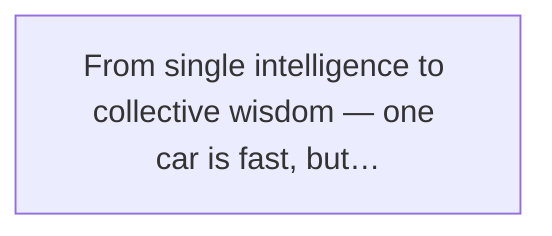
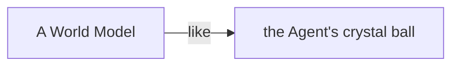
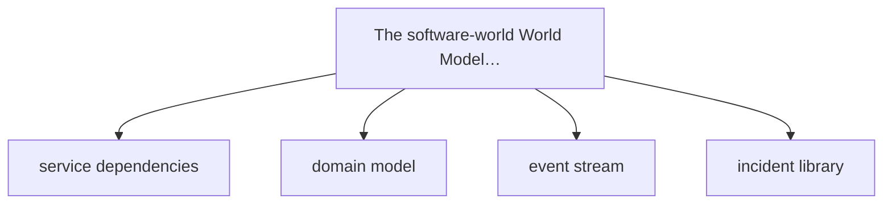
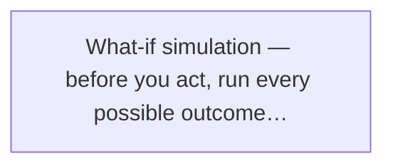
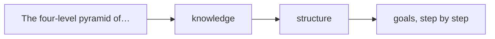
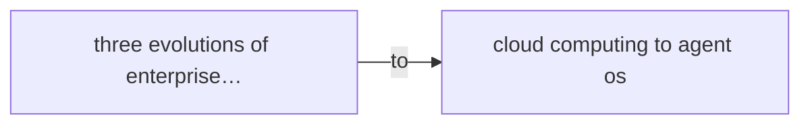
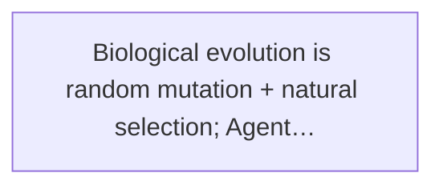
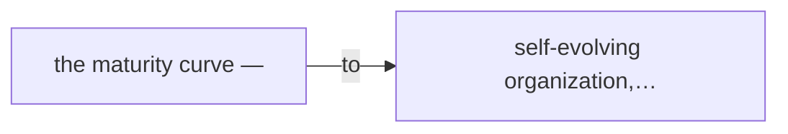

# Part Four · The Future Is Here

Chapter 17

From Single Intelligence to Collective Wisdom

That evening, Xiaoming and Lao Wang stood on the rooftop terrace of their office, watching the sunset gild the whole city. The traffic below flowed like a glowing river — every car with its own destination, yet together they formed the city's traffic system.

Lao Wang pointed at the flow: "See, one car driving itself is intelligence. But if a hundred, a thousand cars can talk to each other, coordinate, even organize themselves into the optimal flow — what do you call that?"

Xiaoming thought: "Call it... collective wisdom?"

Lao Wang nodded: "Right. From single intelligence to collective wisdom — that's the ultimate form of Agent evolution. And to get there, one thing is unavoidable —"

He turned, looked Xiaoming in the eye, and said slowly: "The World Model. Or as we'd put it — a worldview."

> Figure: From single intelligence to collective wisdom — one car is fast, but a fleet can change the whole traffic system

## 1. From "Executing Tasks" to "Understanding the World"

### Today's Agent: Gets Things Done, but Doesn't Quite "Get It"

Let's talk about where we are.

Today's Agents are already impressive. They write code, run tests, send emails, organize documents, and as we saw in the last chapter with Loops, can even find their own work and push it forward on their own.

But — don't you feel something's still missing?

**Xiaoming**

A bit, yeah... how do I put it — it works fast, but it never quite "gets it." Like last time I asked it to change a login endpoint. It did it quick, but it had no idea the payment module also called that endpoint, and it took payment down.

**Lao Wang**

That's the problem. Today's Agent is more like a **skilled craftsman** — tell it to do something and it does, fast and well. But it doesn't know why it's doing it, who it affects, what side effects might follow. It "executes tasks," not "understands the world."

What do I mean? Let me give you an analogy.

Picture a new driver, fresh off passing the test. Decent technique — steering, gas, brakes all work fine. Tell them to drive from A to B and they'll get there. But —

- They don't know why the car ahead suddenly slowed (maybe there's an accident up front).
- They don't know this road jams at rush hour (no experience).
- They don't know to check the mirror and the blind spot together when changing lanes (incomplete awareness).
- Hit a sudden situation and they only slam the brakes — no prediction, no avoidance.

They can **drive**, but they don't **get traffic.**

Today's Agents are like that — they execute tasks, but they don't understand the "world" they live in.

They don't know that changing one endpoint affects which modules, that tweaking one strategy triggers what chain reaction, that today's trend will cause trouble down the line. They're "doing things," not "understanding the world before doing things."

### Next Step: Let the Agent Truly Understand the Business World

So what separates the veteran driver from the new one?

The new driver does "what they see"; the veteran does "what might happen, and prepares ahead."

The veteran carries a "traffic world map" in their head — which road clogs up, to brake early on rainy days, that the driver beside them glancing at their phone might swerve, that kids might run out at the school-crossing intersection ahead.

They don't just watch the few meters in front; their head holds an entire "world model."

That's the Agent's next evolutionary step — from "a tool that executes tasks" to "an intelligence that understands the world."

What does that mean? Not making the Agent smarter or more knowledgeable. It means giving the Agent a **structured, simulatable understanding** of the "world" it lives in — physical or software.

****The key distinction****

**More knowledge ≠ a worldview.**

Someone who memorized every traffic rule isn't necessarily a good driver. A good driver has a whole "feel" for traffic — they can predict, simulate, handle the never-before-seen. That's the World Model.

## 2. What Is a World Model?

Here Xiaoming had another question.

**Xiaoming**

World Model? A worldview? Isn't that just a bigger knowledge base? Dump all the docs in and let the AI memorize everything — isn't that a worldview?

**Lao Wang**

Wrong! Dead wrong! A World Model is not a bigger knowledge base. That's the first misunderstanding most people have about it.

**Xiaoming**

Then what is it?

**Lao Wang**

A World Model is a **simulatable representation of the world.** The point isn't "representation of the world" — it's "simulatable." It answers the most critical question —

"If I do this, what happens?"

> Figure: A World Model is like the Agent's crystal ball — not more knowledge loaded in, but the ability to simulate the future

### Not a Bigger Knowledge Base, but a Simulatable Representation

Let me make the distinction clear.

What's a knowledge base? A "collection of facts." For example:

- After an order is created, it can be paid.
- After payment, it can ship.
- After shipping, it can be confirmed received.
- After confirmation, the order closes.

These are facts. The knowledge base stores them; the Agent looks them up when needed.

So what's a World Model? It doesn't just store those facts — it understands the **relationships and causes** between them. It can answer questions like:

- "If I change the payment timeout from 30 minutes to 10, what flows are affected?"
- "If an order is stuck at payment, what are the likely causes?"
- "If I change the shipping logic now, which step is most likely to break?"
- "Given the current data trend, about how many orders tomorrow?"

See the difference?

A knowledge base answers "**what is**"; a World Model answers "**what will be**."

A knowledge base is a dictionary — you look up what each word means.

A World Model is a sandbox — you run experiments in it: "if I do this, what happens?"

**Lao Wang's metaphor**

A World Model is not the Agent's "library" but its "crystal ball." The library tells you what happened in the past; the crystal ball helps you simulate what might happen in the future.

### The Physical-World World Model vs. the Software-World World Model

The idea of a World Model didn't come from AI — it came from robotics and self-driving.

Think about it: for a self-driving car to safely hit the road, what must it hold in its head?

It needs to know —

- Physical laws: a car can't pass through walls, braking doesn't stop it instantly, friction drops on rainy days.
- Traffic rules: red means stop, green means go, no speeding, signal before changing lanes.
- Behavior patterns: a pedestrian might dart across, the car signaling right might be about to change lanes.
- Environment state: how wide this road is, whether there's a light ahead, how far to the next exit.

Add those up and you get a self-driving car's World Model — its "understanding" of the physical world.

With that World Model, it can simulate: "if the car ahead brakes hard, at my current speed can I stop before hitting it?"

That's the physical-world World Model.

What about the software world?

A software system has its own "physical laws" and "traffic rules" —

- Business rules: an order can't be paid twice, a refund can't exceed the original amount, inventory can't go negative.
- System structure: how services call each other, how data flows, which modules depend on which.
- Behavior patterns: the system slows at peak hours, a slow DB query drags down the whole service, the 10 minutes after a release are a high-incident window.
- Historical experience: what broke last time you touched this, how similar failures were fixed.

That is the software-world World Model.

With it, the Agent can think before acting: "if I change this endpoint, will it hit the payment module? Trigger a chain reaction?"

## 3. What Does a Software-World World Model Look Like?

After all these concepts, you might still feel shaky. What does a World Model actually look like? Some fancy black tech?

It's really not mystical. A software-world World Model comes down to four things.

> Figure: The software-world World Model — four pillars: service dependencies, domain model, event stream, incident library

### 1. Service Dependency Graph: Change This Endpoint, Which Flows Break

The first is the service dependency graph. As the name says, it maps every service, endpoint, and module in your system, plus the call relationships between them.

What's it for? Let me tell you about something that really happened to Xiaoming.

**Xiaoming**

It still hurts to talk about... last time we upgraded the user-points system, I thought I was just changing a points-calculation endpoint, nothing to do with other modules. After the release, payments crashed!

**Lao Wang**

How did payments crash?

**Xiaoming**

I had no idea! Took me ages to find it — when payment completes it calls the points endpoint to add points to the user. I changed the return format and payment didn't, so after payment it just errored and the order got stuck...

**Lao Wang**

See, that's what happens without a service dependency graph. You think you're changing an isolated endpoint, but it may be wired to half the system.

With a dependency graph, before changing code the Agent can check: "who calls this endpoint? How many upstreams? After the change, which flows break?"

Like renovating a house — before you knock down a wall, check the blueprint. Is it a load-bearing wall? Will the building collapse if you smash it?

### 2. Domain Model and State Machine: The Full Path of an Order, from Creation to Close

The second is the domain model, or more concretely — the state machine.

What's a state machine? The complete lifecycle of a business object, from birth to death.

Take an order:

- Created → awaiting payment
- Payment success → awaiting shipment
- Shipped → awaiting receipt
- Confirmed received → completed
- Or: canceled → closed
- Or: refund requested → refunding → refunded

That's the order's state machine. It defines which states an order can be in, and which states it can transition to.

What's it good for?

Plenty. Say the Agent wants to add a feature — "the user can edit the shipping address." With the state machine, it can simulate:

- Awaiting payment — can you change the address? Yes.
- Awaiting shipment — can you change it? Yes.
- Shipped — can you change it? No, contact the courier.
- Completed — change it? Pointless now.

See, it's not as simple as "add an edit-address feature." The feature behaves differently in different states.

An Agent without a state machine is like a referee who doesn't know the rules — it turns the game into a mess.

### 3. Event Stream and Data Lineage: Where Data Comes From, Where It Goes

The third is the event stream and data lineage.

Sounds technical; let me put it in plain words.

Picture data flowing through your system — a user orders, payment succeeds, it ships, the user reviews... each event is a "river" flowing through the system.

Data lineage means — grab any piece of data and you can trace upstream to its source, and downstream to where it flows and who it affects.

****Example****

You see "today's sales: 1 million" on a report. Data lineage tells you —

Where it came from: the sum of successful-payment order amounts; payment data from the payment system, order data from the order system, refunds excluded, counted by order time...

Where it went: used by the ops report, the finance system, the boss's dashboard...

What's this good for, for an Agent?

Huge. Say the Agent wants to change the payment-success logic; it can simulate first:

"If I change this field, which downstream reports break? Will finance data stop reconciling? Will ops stats go wrong?"

Like building a factory upstream on a river — first learn how many people drink from it downstream.

### 4. Historical Incident Library: What Broke Before, and How It Was Fixed

The fourth, and the most valuable — the historical incident library.

**Lao Wang**

Xiaoming, what do you think is most valuable about a senior engineer?

**Xiaoming**

Hmm... strong skills? Rich experience?

**Lao Wang**

No. What's most valuable about a senior engineer is the **potholes they've hit.** They know where trouble lurks, how to debug when it strikes, which practices are suicide. None of that is in books or docs — it's bought with blood and tears.

The historical incident library systematizes those "potholes."

Every outage, every production issue, every "almost went wrong" scare — all recorded: what the situation was, what caused it, how it was fixed, how to avoid it next time.

This is an organization's "collective memory."

With it, what can the Agent do?

Before any change, it can check: "has anyone changed something like this before? What went wrong? Am I about to step in the same hole?"

The wise learn from their own mistakes.
The truly wise learn from others' mistakes.
An Agent with a historical incident library is a wise Agent.

### These Are Not Docs — They Are Structures the Agent Can Query and Simulate

After those four, Xiaoming had another doubt.

**Xiaoming**

Wait, Lao Wang — these things you're describing, the dependency graph, state machine, data lineage, incident library — my company has all of them! Aren't they just architecture docs, requirement docs, post-mortems?

**Lao Wang**

Then let me ask: can the Agent actually use those docs?

**Xiaoming**

...seems not directly. They're in the Wiki, formats all over the place, some text, some images, some outdated...

**Lao Wang**

Right! That's the point. Docs are for humans; a World Model is for the Agent.

Docs are for humans to read — humans parse natural language, read images, fill in missing info, even forgive outdated docs.

But the Agent can't. It needs **structured, queryable, simulatable** data.

📄 **Docs (for humans)**
Natural language, images, tables.
Inconsistent format, possibly outdated.
Understood and judged by humans.

💎 **World Model (for the Agent)**
Structured data, machine-readable.
Real-time, accurate, reliable.
Queryable and simulatable by the Agent.

That's why the World Model is next-generation infrastructure — not simple "document digitization," but "structuring the world."

When every service, every state, every data flow, every incident in the system becomes a structure the Agent can directly understand and use, only then does the Agent truly "get" the world.

## 4. Simulation Ability: "Think Through" the Consequences Before Acting

With a World Model, what's the most core ability the Agent gains?

Two words: **simulation.**

> Figure: What-if simulation — before you act, run every possible outcome through your head first

### Simulate Before Changing Code: Which Modules Will This Change Hit

First scenario: simulate before changing code.

What was Xiaoming's old code-change flow?

- 1. Get the requirement, start writing code.
- 2. Finish, feel it's fine, submit the PR.
- 3. Code review, someone says "hey, will this change affect module XX?"
- 4. Xiaoming: "Huh? That's a thing? Let me check..."
- 5. Sure enough, it has impact — rewrite.
- 6. Release, fault two days later, traced to yet another unconsidered side effect.

Sound familiar?

With a World Model?

Before changing code, the Agent runs an "impact analysis":

- This endpoint is called by 7 upstream services.
- 3 of them are core paths (payment, order, inventory).
- The change touches field A, used in 2 downstream reports.
- Historically, similar changes caused 3 outages, mainly compatibility issues.
- Suggestion: do the compatible refactor first, release in two steps, retire the old field in step two.

**Before vs. after**

**Before:** finish writing, only then discover a pile of impact — rework, delay, take the blame.

**After:** know the full picture before touching anything — prepared, steady, step by step.

### Simulate Before Deciding: What Chain Reaction Will This Strategy Change Trigger

Second scenario: simulate before deciding.

Say Xiaomei wants a campaign — "new users get 20 yuan off their first order."

How was that done before?

The PM dreams up a plan, dev releases it, then watch the data — good, keep it; bad, pull it. Any problems along the way? You only find out after release.

With a World Model?

The Agent simulates it in the "sandbox" first:

- At current new-user volume, ~5,000 people a day join the campaign.
- 20 yuan each, 100k cost a day.
- First-order conversion expected to rise from 30% to 50%.
- But — payment-system peak load up 40%, may need scaling.
- Also — scalpers may come sniffing; need risk-control rules.
- Plus — customer-service volume up ~25%, staff ahead of time.

See, one seemingly simple campaign pulls a whole thread that moves everything.

Without simulation, you drive blind — you only learn there's a ditch after you're in it.

With simulation, you drive with navigation — the potholes, the curves, the speed traps, all flagged in advance.

### Warn Before Trouble: From the Current Trend, Will Something Break

Third scenario, and the most powerful — **early warning.**

**Lao Wang**

Xiaoming, what's the biggest difference between a veteran and a new driver?

**Xiaoming**

Veterans drive steady? Better skills?

**Lao Wang**

Both, but not the core. The core difference is — a veteran can **predict risk.**

**Xiaoming**

Predict risk?

**Lao Wang**

Right. The new driver reacts after something happens; the veteran **sees it coming before it happens.** Like a veteran glancing at the road and knowing there's a jam ahead — not because they see the jam, but because they simulate it from the clues in front of them.

Like a veteran driver, glance at the road and know there's a jam ahead.

An Agent with a World Model can do this too.

It keeps monitoring the system's state and simulates from the trend:

- "Slow-query count is climbing; at this rate, main path may be hit in 2 hours."
- "Order volume is 30% above the usual for this time; inventory pressure rising — pre-warm the cache."
- "Release frequency jumped this week but test coverage is dropping — high fault risk."
- "This new feature's usage keeps falling — may need a product-strategy adjustment."

That is real "intelligence" — not putting out fires after they start, but **warning you before they appear.**

****Three levels****

**Level one:** When something breaks, you can fix it. (Firefighting after the fact.)

**Level two:** Before you act, you know what might go wrong. (Simulation beforehand.)

**Level three:** While doing nothing, you know trouble is coming. (Trend warning.)

The World Model is the ladder from level one to level three.

## 5. The "Evolution Engine" of Self-Evolving Organizations

We've spent a while on the World Model. Now let's get to this chapter's real topic — the self-evolving organization.

What is a self-evolving organization?

Simply: a system made of Agents that doesn't just work — it **keeps getting stronger.**

How does it get stronger? Lao Wang split self-evolution into four levels, each higher than the last.

> Figure: The four-level pyramid of self-evolution — tools → knowledge → structure → goals, step by step

**1 — Tool Evolution**
Improve its own tools and processes.
The most basic level. As the Agent uses a tool, it finds the tool clumsy and rebuilds it. Say a script always needs manual parameters — it rewrites it to auto-read config. An API call keeps failing — it adds retry and fallback logic. This level evolves the "how to do things."

**2 — Knowledge Evolution**
Learn new knowledge on its own.
Level two. When the Agent hits something it doesn't know, it learns. A new tech stack — it reads docs, studies examples, summarizes the key points. A new business — it maps the flow, organizes the knowledge, updates the World Model. This level evolves "the understanding of the world."

**3 — Structure Evolution**
Reshape its own organization.
Level three. When multiple Agents collaborate, they adjust how they organize. Say one task keeps failing — they split off a dedicated QA Agent. One step is the bottleneck — they add hands (Agents) and redo the division of labor. This level evolves "how to collaborate and organize."

**4 — Goal Evolution**
Set new goals on its own.
The top level, and the most contested. The Agent doesn't just complete the human-given goal — it discovers new goals. The system runs fine, but the Agent notices "if we optimize this metric, UX gets better," so it sets itself a new optimization goal. This level evolves "the goal itself."

These four levels are like a biological evolution — from simple reflex, to learning, to social structure, to self-awareness. Each higher, each harder.

**Xiaoming**

Goal evolution... the Agent sets its own goals? That's sci-fi! Won't it go wrong?

**Lao Wang**

That's why I say it's the most contested level. But don't panic — goal evolution doesn't mean the Agent does whatever it wants. Its "setting its own goals" happens within the broad frame a human gives, discovering and defining sub-goals on its own. Like a boss saying "grow revenue 30% this year," and the reports figure out the specifics — the big direction is still the boss's.

This matters; we'll come back to it when we talk ethics.

## 6. Agent OS: The Enterprise's New Infrastructure

By now you've probably realized — World Model, self-evolution, multi-Agent collaboration... put together, this is no longer "a tool" or "a system."

It's a whole **infrastructure.**

> Figure: Three evolutions of enterprise infrastructure — from ERP to cloud computing to Agent OS

### Every Era Has Its Own Infrastructure

Let's look back at history.

Enterprise software went through three big eras, each with its own core infrastructure:

| Era | Core infrastructure | Problem solved | Keywords |
|-|-|-|-|
| Process-management era | ERP / CRM / BPM | Digitize processes | Process, standards, efficiency |
| Elastic-computing era | Cloud / microservices / big data | Make resources elastic | Elasticity, scale, data |
| Intelligence-augmentation era | Agent OS | Make decisions intelligent | Intelligence, autonomy, evolution |

### The ERP Era: Freeze Processes in Place

Twenty or thirty years ago, the core pain of enterprises was messy processes.

How to approve a purchase? Sign a contract? File an expense? Every department had its own way — chaos.

Then ERP arrived — it mapped every process clear and froze it into the system. Purchases follow the purchase flow, expenses follow the expense flow; who approves, who executes, all spelled out.

ERP's essence: **turn human experience into process, freeze process into the system.**

### The Cloud Era: Make Resources Elastic

Then the internet came; business changed faster, systems grew more complex.

The core pain then? Not enough resources — traffic spikes and servers fall short; traffic leaves and servers sit idle.

Then cloud computing arrived — compute became like water and electricity: take what you need, give it back when done. Elastic scaling, pay per use.

Cloud's essence: **turn physical resources into virtual ones, turn fixed cost into variable cost.**

### The Agent OS Era: Make Decisions Intelligent

Now we've entered the third era.

Processes exist, resources exist, data exists. The new pain?

**Decisions can't keep up.**

The system is too complex, change too fast, data too much — humans can't keep up. So many decisions daily, so many problems to handle, so many opportunities to seize, and human attention is finite.

Then Agent OS arrived.

What is Agent OS? Not one product, but a whole "intelligent operating system" —

- Downward, it connects all the enterprise's systems and data.
- In the middle, it holds the World Model, understanding the whole business world.
- Upward, it hosts all kinds of Agents, letting them collaborate safely and efficiently.
- It also provides the evolution engine, so the whole system gets smarter with use.

ERP manages process, cloud manages resources, Agent OS manages intelligence.
That's the next stop for enterprise software — the Agentic Enterprise.

The Agentic Enterprise — an "Agent-driven enterprise." In such a company, it's not humans using software, but software running itself; not humans chasing problems, but the system finding, solving, and optimizing its own problems.

And humans? Humans move from "operator" to "governor" — set direction, make rules, make the calls at critical moments.

## 7. The Boundaries and Ethics of Self-Evolution

We've covered the upsides of self-evolution. Time for some cold water.

Self-evolution is powerful, but it raises brand-new questions — and these are harder to answer than the technical ones.

> Figure: Biological evolution is random mutation + natural selection; Agent evolution is directed mutation + artificial selection

### Question One: Who Sets the "Direction of Evolution"?

Biological evolution has no direction. Gene mutations are random; natural selection decides who lives and who dies. Evolution has no purpose — it just happens.

Agent evolution is different.

🔑 **Core difference**

**Biological evolution:** random mutation + natural selection — no direction, no purpose, survival of the fittest.

**Agent evolution:** directed mutation + artificial selection — direction set by humans, selection made by humans.

So the question: who sets this "direction"?

The boss? The PM? The engineer? Or... the AI itself?

What if the direction is wrong? Say an e-commerce company's Agent has the goal "maximize sales." Might it, to hit sales, stop at nothing — spam users with ads, trick them into buying, even deceive them?

Not fear-mongering — this is already happening.

**Lao Wang**

Self-evolution isn't about letting the system get smart on its own; it's about giving humans the power to steer the system's evolution.

**Xiaoming**

Steer the evolution's direction... how?

**Lao Wang**

Like a gardener pruning a tree. The tree grows on its own, but the gardener decides its shape — which branch to cut, which leaf to keep, which way to bend. The tree is alive, growing itself, but the shape is guided by the gardener.

Self-evolution isn't about letting the system get smart on its own;
it's about giving humans the power to steer the system's evolution.

### Question Two: The "Speed Limit" on Evolution

Second question — what if it evolves too fast?

Think: how fast can a self-evolving system evolve?

Biological evolution counts in "generations" — years, decades, even centuries per generation.

But an Agent's evolution? It can evolve dozens, hundreds of rounds a day — as long as compute allows.

That's a problem. If the system evolves faster than humans can follow, what happens?

- You understood how it worked yesterday; today it's a different system.
- You just approved one change; it's already evolved three rounds on top of it.
- Something breaks and you have no idea why — because it's no longer the system you knew.

Like a car accelerating past the point where you can see the road or turn the wheel — the faster it goes, the more dangerous.

****Speed limit****

A self-evolving system must have a "speed limit" —

Not "evolve as fast as possible," but evolve at a speed **within human understanding and control.**

Evolution you can't understand is useless no matter how fast — and dangerous.

### Question Three: The Human's Role — From Operator to Supervisor to Governor

Third question — in a self-evolving organization, what is a human, exactly?

Let's lay out how the human role changes:

| Stage | Human role | What they do | Analogy |
|-|-|-|-|
| Tool era | Operator | Do every task by hand | Stick-shift driver, drives the whole way |
| Automation era | Supervisor | Watch the system work, take over on failure | Self-driving passenger, eyes on the road |
| Self-evolution era | Governor | Set direction, make rules, guard boundaries | Head of transport, governs rules not driving |

See? The human role gets more "abstract" — from doing the work by hand, to watching the machine work, to not even watching, only setting rules.

Good or bad?

Depends how you see it. The bright side: humans are freed from tedious manual and mental labor to do more valuable things. The dark side: humans drift further from the system, their control weaker — if the system fails, you may not be able to take over at all.

**Xiaoming**

So what do we do? Really let go completely?

**Lao Wang**

Of course not. The best state isn't "humans hands-off" but **"humans in the loop, but not inside it."**

**Xiaoming**

What?

**Lao Wang**

Meaning — day-to-day, the system handles it, no human needed. But humans always hold the final decision and veto. Like a board of directors — they don't meddle in daily operations, but major decisions must pass through humans, and on failure humans can take over anytime.

## 8. Where Are We Now?

After all this future-talk, we have to come back to reality.

How far have we actually gotten? Is the self-evolving organization sci-fi or prophecy?

> Figure: The maturity curve — from Harness to self-evolving organization, where are we?

**1 — The Harness Stage — where most teams are**
Most teams today are still at the Harness stage — the Agent can help, but needs a human watching, confirming, and cleaning up the mess. Like cruise control — foot off the gas, but hands still on the wheel.

**2 — The Loop & Multi-Agent Stage — front-line teams are transitioning**
A few front-line teams are touching the threshold of Loops and multi-Agent collaboration — Agents find their own work, loop forward, several Agents divide and cooperate. But it's early, breaks often, needs heavy human intervention and debugging.

**3 — Early Forms of the World Model**
The World Model is still very early. There are sprouts — service graphs, observability platforms, fault knowledge bases — but scattered and siloed, not yet a unified "world model" the Agent can use directly.

**4 — Self-Evolving Organization — sci-fi or prophecy?**
As for the self-evolving organization — honestly, it's still mostly concept and vision. Tool evolution is sprouting; knowledge evolution is being explored; structure evolution is far off; goal evolution... is basically still in sci-fi novels.

You might be disappointed — so the self-evolving organization is that far away?

Don't rush; let me tell you something straight.

**Lao Wang's judgment**

**Short term, it's about tool use; mid term, Harness and Loop; long term, the Agent system and World Model.**

Self-evolving organizations may look far now, but think back five years to Agents — who then imagined today's AI could write code and work on its own?

Tech has always moved like this — unreachable one day, everywhere the next.

And stepping back, whenever the self-evolving organization arrives, one thing is certain:

**The direction is right.**

From Prompt to Context to Harness to Loop to multi-Agent collaboration to World Model to self-evolution — this path holds. Each step solves the last step's problem and pushes the Agent's ability up a level.

Maybe 5 years, maybe 10, maybe longer. But it will come.

The question is — when it comes, will you be ready?

### To Be Continued

Xiaoming gazed into the distance and murmured: "Self-evolving organization... sounds amazing and a little scary."

Lao Wang patted his shoulder: "Tech itself is neither good nor bad — it depends on who uses it and how. A car: one person commutes in it, another races it, another uses it for harm. The car doesn't change; the driver does."

Xiaoming turned: "So in this era, what do we do?"

Lao Wang smiled: "Do you want to be a passenger, or a co-pilot?"

In the final chapter, we'll talk about your place in this new era.

← Ch.16: The Loop Revolution  Final Chapter: Your Place in the New Era →

The Self-Driving Era: A Brief History of Agent Evolution © 2026 — An evolutionary saga of AI Agents, from Prompt to self-evolving organizations
