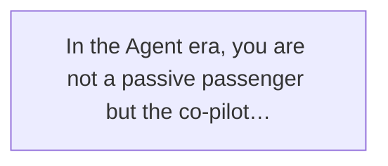
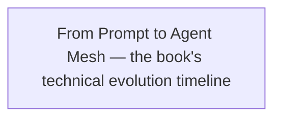
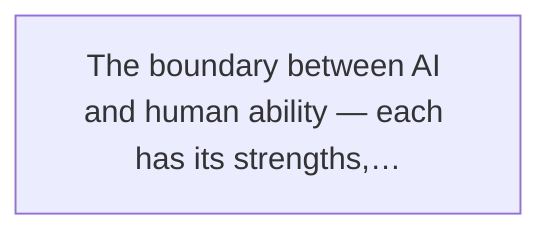
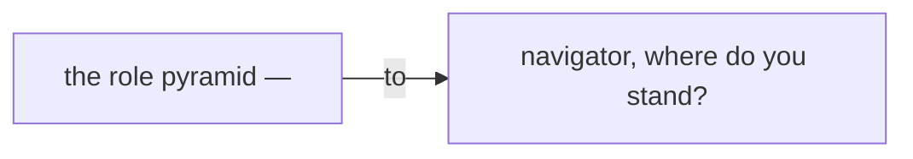
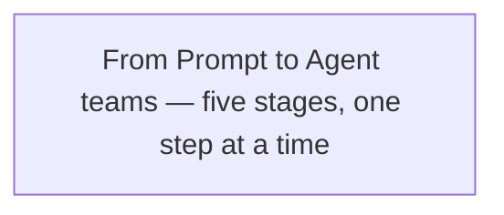
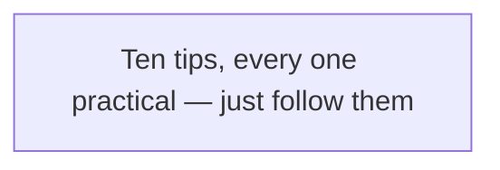
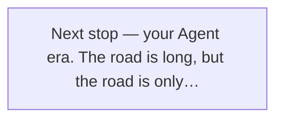
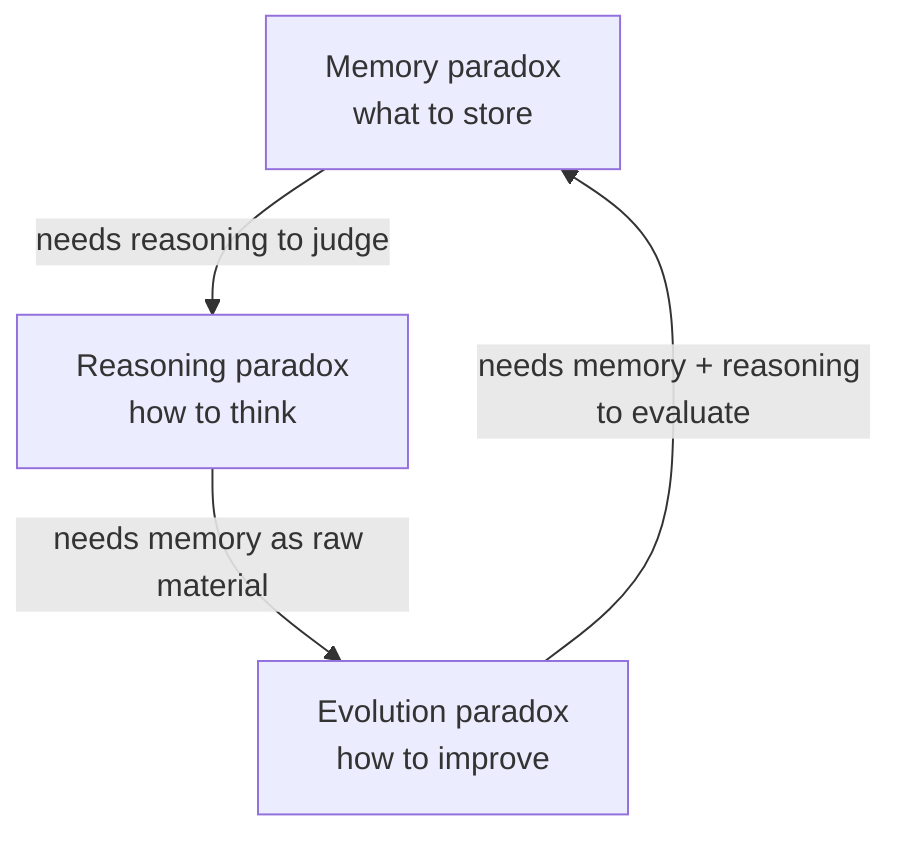

Final Chapter

The ultimate meaning of technology was never to replace people,
but to make us more human.

— Chapter 18 · End of Book —

We're near the end. From Chapter 1's "what is an Agent" to this last chapter, we've traveled a fair distance together. If you read straight through from Chapter 1 — thank you; you went further than most.

Before this final chapter, let me say something off the main track.

Have you noticed a pattern over the last couple of years? The conversation about AI has split into two extremes.

One camp says — "AI is going to replace everyone! Programmers will be unemployed! Copywriters! Designers!" They panic, certain the sky is falling.

The other says — "AI is a toy! It just makes stuff up! It can't even handle simple logic!" They sneer, sure it's all hype.

I've met plenty of both. The interesting part: often it's the same people — last year "AI is taking over," this year "AI is nothing special."

Why?

Because they both treat AI as a "thing" — either an all-powerful god or a useless piece of junk.

But if you finished this book, you should know — AI is neither god nor junk. **AI is a car. A self-driving car that needs a human at the wheel.**

The car won't decide where to go. It won't judge which route is more worthwhile. It won't take the blame for hitting someone.

Those are human jobs.

This last chapter, we drop the tech. We talk about people. About you. About **where human value lives** in this age of AI at full speed.

> Figure: In the Agent era, you are not a passive passenger but the co-pilot with hands on the wheel

## 18.1 How Far Have We Come? — A Summary of the Book

Before we get to human value, let's spend a moment looking back at the road we traveled.

Remember Chapter 1? We said an Agent is like a self-driving car. From there, the journey began.

### From Prompt to Loop: The Evolution of One Car

We started with the **Prompt era.** Back then AI was like a car that just learned to start — you had to tell it where to go, how to get there, which road, every step spelled out. You spoke, it moved.

What everyone cared about then: how to write prompts so AI obeyed, how to get higher-quality output. Prompt Engineering became the hottest skill.

Then the **Context era.** People found instructions alone weren't enough — AI also needed to "see" its surroundings. Like a car gaining a windshield and rear-view mirror — it could see the road and drive steadier.

RAG, knowledge bases, context windows, Skills — all to help AI "see more clearly." Context Engineering became the new keyword.

Then the **Harness era.** The car could drive, but fast driving meant crashes. So we needed seatbelts, brakes, airbags, traffic rules.

Permission control, behavior constraints, verification, human-takeover points — these Harness components decide whether an Agent can actually run in production.

Next, the **Loop era.** The car didn't just drive — it judged routes, avoided obstacles, planned trips itself. From "you point, it shoots" to "give it a destination, it drives there."

Observe, think, act, verify, adjust — this closed loop gave the Agent a real taste of "autonomy."

Finally, the **collective-intelligence era.** One car wasn't enough; we needed a fleet. Some scout, some haul, some repair, some command. They cooperate into an Agent Mesh.

> Figure: From Prompt to Agent Mesh — the book's technical evolution timeline

### From "AI Says" to "AI Does" to "AI Finds Its Own Work"

One line sums up the whole path:

From "AI says," to "AI does," to "AI finds its own work."

First-generation AI only **said.** You ask, it answers. However well it talks, it's just talk. You're still the one who does things.

Second-generation AI learned to **do.** It calls tools, executes actions, completes concrete tasks. Give it a goal and it really goes at it. Maybe badly, but at least it starts moving.

Third-generation AI starts to **find its own work.** It doesn't just execute your orders — it observes, spots problems, acts on its own. Like a real assistant — things you didn't think of, it thinks of; things you didn't arrange, it arranges.

This evolution moved shockingly fast.

Three years ago, people argued whether "Prompt" was even real engineering. Two years ago, the talk was "how big does the Context Window need to be." One year ago, "Agent" was still a niche term. Today, "Agent teams" are standard in many companies.

### Tech Changes, but the Human Role Keeps Changing

But — I want you to notice one thing.

Through the whole evolution, **what changed wasn't only the tech, but the human role.**

Prompt era, the human was the "instructor" — learn to talk to AI. Context era, the human was the "informant" — learn what to feed AI. Harness era, the human was the "safety officer" — learn to set AI's rules. Loop era, the human was the "designer" — learn to design AI's workflows. Collective era, the human was the "commander" — learn to organize an AI team.

So — as tech evolves, does the human have less to do?

No. **What the human does doesn't shrink; it changes.**

From manual work to mental work. From execution to decision. From the concrete to direction.

That's why I wrote this last chapter. Because many haven't realized — as Agents get more capable, **what decides your value is no longer how much you can do, but how much direction you can set.**

## 18.2 Where Does Human Value Live?

So let's face it: **in the Agent era, where does human value live?**

Lao Wang once said something to Xiaoming that I think is excellent. I'll share it with you.

AI can drive fast and steady, but where to go is for humans to decide.

Simple to hear, but deep underneath.

Let's compare: what is AI good at? What are humans good at? Get that clear and you'll stop worrying.

> Figure: The boundary between AI and human ability — each has its strengths, each its job

### What AI Is Good At: Repetitive Work, Information Processing, Speed, Scale

First, AI's strengths.

**One, repetitive work.** The same thing a hundred, a thousand, ten thousand times — AI doesn't tire, doesn't get bored, doesn't zone out, doesn't err (at least not from fatigue). Writing test cases, generating reports, organizing docs, answering FAQs — hand these to AI.

**Two, information processing.** AI reads a whole book, analyzes tens of thousands of rows, compares hundreds of options in seconds. Its information throughput is thousands of times a human's. Research, summarization, classification — it's faster than anyone.

**Three, speed.** AI doesn't sleep, eat, or rest. It works 24/7. One Agent's daily output can match a person's monthly.

**Four, scale.** A person does one thing at a time; a hundred Agents do a hundred things at once. And adding Agents costs far less than adding people.

These are AI's strong suits. And I'll tell you — in these areas, you will **never** beat AI.

Don't be sad. It's not you. It's like racing a car, out-calculating a calculator, out-seeing a telescope — you lose, and that's normal.

But that **doesn't mean** you have no value.

### What Humans Are Good At: Direction, Trade-offs, Creativity, Responsibility

So what are humans good at?

**One, direction.** AI can tell you the fastest route, but not *why* you're going there. It doesn't know you're rushing to meet someone important, or to a meeting that matters. It doesn't know you'd detour past the sea just to watch the sunset.

**Where to go** — only a human can answer that.

**Two, trade-offs.** Many life choices aren't "right vs. wrong" but "good vs. better." More time with family, or more time on career? Short-term gain, or long-term value? Play it safe, or take a risk?

AI can't make these. It doesn't know the scale in your heart.

**Three, creativity.** Not the "have AI generate an image" kind. I mean real creativity — making something truly new from nothing. Asking a question no one asked. Finding an angle no one found.

AI can recombine what exists, but rarely truly "creates" the never-seen. All its output builds on data it has seen. Real innovation usually lives outside the data.

**Four, responsibility.** The most important of all.

AI makes a decision — who's responsible? The prompt-writer? The model-trainer? The user?

Simple answer: **the human.**

A car hits someone — you can't say "the car was driving itself." An Agent errs — you can't say "the AI did it."

The final responsibility is always human.

And the very act of "being willing to take responsibility" is itself enormous value.

**Lao Wang's line**

"In the Agent era, what's most valuable isn't how much code you can write, but knowing which way to steer."

## 18.3 You Are the Co-Pilot, Not the Passenger

Now the core claim of this chapter — **you are the co-pilot, not the passenger.**

What does that mean?

In the Agent era, each of us chooses a role. By how much control you hold over AI, I divide people into four levels.

> Figure: The role pyramid — from passenger to navigator, where do you stand?

**Navigator**
Designs the whole system's architecture and direction.

**Driver**
Designs Loops and Harnesses themselves.

**Co-pilot**
Knows the road, can hit the brakes at the critical moment.

**Passenger**
Only uses AI to generate content, believes whatever AI says.

### Level One: The Passenger

What is a passenger?

Gets in, sits down, plays on the phone, sleeps. The car goes wherever; the driver says "we're here" and they get out.

In the AI age, a passenger is someone who:

- Only uses AI to generate content, believes whatever AI says.
- Doesn't know how AI works, and doesn't want to.
- Uses AI's output without checking it.
- When something breaks, blames AI: "why so dumb?"
- Anxious when AI advances; mocks when AI errs.

The passenger's problem? **They've handed their fate to someone else.**

You might say: "I just use AI a bit, not that serious, right?"

More serious than you think.

If you only use AI for a caption or a picture, sure, no big deal. But if you start using AI to make decisions, judgments, choices — and you can't even judge whether AI is right — then you've truly handed over the wheel.

**Whoever hands over the wheel ends up in the ditch.**

### Level Two: The Co-Pilot

What is a co-pilot?

Sits in the front seat, watches the road, the navigation, the dashboard. Knows where you are, where you're going, which road. If the driver errs, they speak up. If danger comes, they pull the handbrake.

In the AI age, a co-pilot is someone who:

- Knows AI's boundaries — what it's good at, what it isn't.
- Checks, verifies, and edits AI's output.
- Knows when to trust AI, when to doubt it.
- Can take over and drive at the critical moment.
- Owns the result instead of dumping the blame on AI.

You are the co-pilot, not the passenger.
The co-pilot knows the road and can hit the brakes when it matters.

That's why I made "co-pilot" this chapter's title. Because I think **this is the minimum standard everyone should reach.**

You don't have to be an expert, know how to code, or design Agent systems. But you should at least be a qualified co-pilot — know the road, and be able to hit the brakes when it counts.

How to be a good co-pilot? Simple — **stay clear-headed, stay skeptical, stay judgmental.**

### Level Three: The Driver

What is a driver?

Hands on the wheel, foot on gas and brake. How the car goes, how fast, which road — all their call. They don't just know the road; they can drive it.

In the AI age, a driver is someone who:

- Can design the Agent's workflow (Loop) themselves.
- Can build the safety system (Harness).
- Knows how to feed the Agent the right information (Context).
- Can tune the Agent's config for different tasks.
- Can debug, trace, and fix when something breaks.

If you're a developer, a PM, or anyone who needs to use AI deeply, I'd say reach at least the "driver" level.

Because only when you can drive yourself do you truly own freedom. Go where you want, leave when you want. You don't wait for someone else to drive, and you don't fear a wrong turn.

### Level Four: The Navigator

What is a navigator?

Doesn't drive, but decides the whole fleet's route. Reads the map, the weather, the road, then tells the fleet: our goal, which road, which dangers to avoid.

In the AI age, a navigator is someone who:

- Can design the whole Agent system's architecture and direction.
- Knows which problems fit an Agent, which don't.
- Can organize multiple Agents into a collaboration network.
- Can read AI's tech trends and plan ahead.
- Can balance tech, business, security, and cost.

The navigator is the highest level. No coding required, but you need vision, breadth, and judgment.

You may be wondering: "If I want to be a navigator, do I skip learning tech?"

No. **The best navigators usually started as the best drivers.**

If you can't drive, how do you know which road's good or bad? If you've never built an Agent, how do you know how to design the system?

So don't rush to be a navigator. Start as co-pilot, then driver; drive enough and you'll know how to navigate.

### Which Do You Want to Be?

Now a question for you: **which do you want to be?**

Passenger? Co-pilot? Driver? Navigator?

No right answer. Not everyone must be a navigator, and not everyone fits being a driver.

But one thing I'll tell you:

**Be at least a co-pilot.**

A passenger's fate sits in someone else's hands. A co-pilot's fate is at least half in their own.

In this age of runaway AI, being a passenger is the most dangerous. You think you're enjoying the ride; really, you've lost control.

Don't be a passenger. Be a co-pilot.

If you have bigger ambition — driver, navigator — all the better.

## 18.4 A Growth Path for Ordinary People

Since we're talking growth, how exactly do we walk it?

Many people jump straight to "I'll build an Agent system! I'll start an AI company!" — and after all that fuss can't even write a decent prompt.

Don't rush. Eat one bite at a time, walk one step at a time.

I've drawn a growth path for ordinary people — five stages. Check where you are now and where to head next.

> Figure: From Prompt to Agent teams — five stages, one step at a time

**Stage One**

#### Learn Prompts — Grip the Wheel
The starting point of everything. Learn to talk to AI — state your need clearly, guide it to the output you want, keep it from making things up. Don't underestimate prompts; plenty of people use AI for a year and still write terrible ones. Get prompts solid and the later road is easier.

**Stage Two**

#### Learn Context — Give the Right Information
Instructions aren't enough; you must give AI the right context. Like a windshield for driving — let AI "see" what it needs. This stage: build a knowledge base, do RAG, filter useful info, control context quality and cost. Context is leverage — same AI, different context, wildly different results.

**Stage Three**

#### Learn the Harness — Build the Safety System
Once AI actually does things, safety comes first. This stage: set permissions, add verification, design human-takeover points, monitor AI's behavior. Remember: Harness always beats features. A car with no brakes is more dangerous the faster it goes.

**Stage Four**

#### Learn the Loop — Let It Run Itself
With direction (Prompt), vision (Context), and safety (Harness), you can design a real Agent Loop. This stage: design the observe-think-act loop, define goals and stop conditions, let the Agent find and fix its own problems. Here you move from "AI user" to "Agent builder."

**Stage Five**

#### Learn Agent Teams — Work in Squads
One Agent's ability is limited; an Agent team's potential is not. This stage: assign roles to different Agents, make them cooperate, design the communication, manage the team's output and quality. Here you become a true "AI commander."

**Key point**

Don't rush, one step at a time. You don't need to reach stage five in a day. But you should at least know the road goes this way.

I've seen too many people jump straight to "multi-agent systems" who can't even handle a single Agent. Like riding a bike — you can't, yet you want to drive an F1. Not impossible, but you'll crash hard.

Steady and solid, one step at a time. Each step firm, and the road ahead smooths out.

And I'll tell you — even if you only reach stage two (learn Context), you're already ahead of 90% of people.

Because most haven't even cleared stage one (write a good prompt).

## 18.5 Three Abilities AI Can't Replace

After the growth path, the question everyone cares about: **what abilities will AI never learn?**

I've thought about this a long time.

A few years back people said "AI has no creativity" — then AI could draw, write novels, compose music. Later "AI has no logic" — then it did math, wrote code, reasoned. Then "AI has no emotion" — then it comforted people, wrote love letters, played therapist.

Every "human-only" line keeps getting crossed.

So is there anything AI will never learn?

I think yes. Three things.

> Figure: Xiaoming's growth — from code-writer to Agent-system designer

****Judgment****
Knows what matters, what doesn't.
Chooses amid ambiguity.

✨ **Taste**
Knows good from bad.
Picks the best from many options.

****Responsibility****
Owns the result, owns the decision.
Willing to bear the consequence.

### Judgment: Know What Matters, What Doesn't

The first ability is **judgment.**

What is judgment? The ability to choose even when information is incomplete and outcomes uncertain.

AI is good at "find the optimal solution given the conditions" — you state the rules, name the goal, it finds the best plan.

But most real-life problems have **no given conditions.**

You don't know all the information. You're unsure the rules won't change. You may not even know the goal until you think it through.

That's where judgment comes in.

Judgment isn't "the right answer" — it's "the ability to choose in uncertainty."

Judge whether this is worth doing. Whether this person is worth trusting. Whether this direction is worth the investment.

AI can give you data, analysis, advice. But **the moment of decision can only be human.**

### Taste: Know Good from Bad

The second ability is **taste.**

What is taste? Not whether you dress well or drink good coffee. I mean an intuition for "good vs. bad."

Same article — one person finds it great, another meh. Same design — one finds it ugly, another fine. Same code — one says beautiful, another says "runs, good enough."

That gap is taste.

AI can't learn taste. Because taste isn't learned from data; it grows from **experience.**

You've seen good things, so you know what good is. You've made good things, so you know how to make them. You've hit potholes, erred, failed — so you know what's truly good versus merely looks good.

Taste is a product of time. It lives in the books you've read, roads you've walked, people you've met, things you've done.

AI has none of that.

### Responsibility: Own the Result, Own the Decision

The third ability is **responsibility.**

The most important of all.

What is responsibility? The courage to say "I've got this."

Succeed, and don't gloat. Fail, and don't pass the buck.

AI will never have responsibility. Because it answers to nothing.

It outputs wrong info and won't apologize. It makes a wrong call and won't feel guilt. It causes loss and won't pay.

A human carries all that.

And people willing to carry it are always scarce.

Think — in your team, who's most trusted? Not always the best technician, not always the smartest. Often the **reliable** one — hand them something and you're at ease; when it breaks, they carry it.

That reliability is, at root, responsibility.

In the Agent era, responsibility grows more precious. As AI does more, **the person willing to own the result becomes more valuable.**

Judgment, taste, responsibility —
these three, AI will never learn.

## 18.6 Ten Tips for Beginners

Enough theory. To close, some concrete advice you can act on today.

If you're just starting with AI and Agents, keep these ten in mind.

> Figure: Ten tips, every one practical — just follow them

**1 — Anxiety is useless; action matters most**
Reading ten "AI will replace you" headlines a day beats less than using AI once. Anxiety solves nothing; action is the best cure. Roads are walked, not imagined.

**2 — Start small; don't build a big system first**
Don't aim at "general AI" on day one. Find one concrete problem at work or in life — organize a weekly report, reply to email, generate test cases — and solve it with AI. Small wins add up to big ones.

**3 — Prompts are the foundation; never outdated**
Don't skip prompts as too simple or basic. Prompts are your language with AI. If you can't speak clearly, how do you work together? Master prompts and you'll find many problems need no complex Agent at all.

**4 — Context is leverage; pick right, double the result**
Same AI, different context, wildly different results. Learning to filter info, organize knowledge, and build context is the highest-ROI way to raise AI's output quality. Remember: garbage in, garbage out.

**5 — Safety first; Harness always beats features**
Before letting an Agent do anything risky, build the safety first. Permission control, verification, rollback plans — invisible normally, lifesavers in a crisis. Rather fewer features than less safety.

**6 — Human in the loop; don't let go easily**
Human in the Loop — keep a human in the Agent's workflow. Key decisions, important nodes, risky actions — always someone to review and confirm. Don't chase "full automation"; that's the end goal, not the start.

**7 — Record and review; learn from failure**
When the Agent errs, don't just mutter "AI is so dumb" and move on. Record it: why did it fail? Prompt problem? Context problem? Harness gap? Every failure is a chance to improve.

**8 — Watch the cost; don't let the bill shock you**
Running an Agent costs money — API calls, compute, storage. One runaway Loop can burn thousands in a night. Get in the habit of reading the bill and controlling cost. The cheap solution is usually the sustainable one.

**9 — Talk to people; don't work in a vacuum**
AI moves too fast to chase alone. Join communities, follow the people who know, talk to peers — 99% of your problems, someone's already hit. Don't grind alone; stand on others' shoulders to see further.

**10 — Stay curious, but stay alert**
Stay curious about new tech; willing to try, willing to learn. But stay alert too — no blind worship, no total acceptance, always your own judgment. Curiosity moves you forward; alertness keeps you from crashing.

These ten aren't hard, but aren't easy either.

Do half and you're already ahead of most. Do all ten and congratulations — in this era you won't do badly.

## 18.7 Next Stop: Your Agent Era

With this, the book's technical content ends.

But I'll tell you — **this isn't the end, it's the start.**

Think where we stand now.

Agent tech is just beginning. Like the car when first invented — clattering, stalling, bad roads, hard to fuel. People then couldn't imagine that a century later the car would be everyone's necessity.

Agents are the same.

Today's Agent is still crude. It's silly, errs, drifts, jams. You'll often think "this thing is so dumb."

But trust me — **it will evolve. And faster than you imagine.**

> Figure: Next stop — your Agent era. The road is long, but the road is only beginning

In three years, Agents may be as common as phones today. Everyone with their own AI assistant, handling work, scheduling life, managing information.

In five years, Agent teams may be standard in companies. Every department, every team, even every person with their own AI squad.

In ten years, we may live in a wholly different world. Many things you think "must be human" today may be done by Agents then.

But —

However tech evolves, one thing won't change:

**The human is always the one who sets direction.**

AI can drive, but not why it's going there. An Agent can act, but not why it's doing this. Tech can run fast, but not where to run.

Those are always human matters.

### Xiaoming's New Journey

To close the story, back to Xiaoming.

Remember Chapter 1's Xiaoming? An ordinary frontend engineer, writing repetitive code, a little lost about the future, curious about AI and a little afraid.

Back then he thought an Agent was something distant and deep — for architects, algorithm engineers, the elites.

But now?

Xiaoming isn't that Xiaoming.

He learned to write good prompts, to have AI spin up code prototypes fast. He learned to build Context, to keep the project's knowledge base in order. He learned to build a Harness, to add safety checks at key nodes. He learned to design Loops, to have Agents run a whole workflow. He even started assembling Agent teams, dividing work among different Agents.

More importantly — **he moved from "code-writer" to "Agent-system designer."**

He no longer fears AI taking his job. Because he knows AI is just a tool. And he is the one who wields it.

His value is no longer "how many lines of code" but "knows what to have the Agent do, how to do it right, how to fix it when it breaks."

Xiaoming's story goes on.

And yours?

## 18.8 To the Future You

The book ends here.

Before we part, a few words to the future you.

### A Year From Now, Where Will You Be?

A year from today, where will you be?

Maybe you've mastered Agents, multiplied your productivity several times. Maybe you've built your own Agent team, doing things you once wouldn't dare imagine. Maybe you've switched into AI work and found your stride.

Or maybe — you haven't moved.

Bought the book, didn't read it. Bought the course, didn't watch. Collected tools, used none.

A year is short and long. But enough to remake a person.

I hope the future you thanks today's you — for opening this book, for starting, for not lying flat.

### Three Years On, What Will This Industry Look Like?

Three years on, what will AI be?

Honestly, I don't know.

Three years ago, no one expected AI to move this fast. Three years from now, no one knows what it'll become.

But I know one thing: **change will accelerate, past what you can imagine.**

Tech you admire today may be obsolete in three years. A job you think stable today may not exist. A skill you think safe today may be useless.

In such a time, what's the safest strategy?

Not learning one never-obsolete skill — there isn't one. But **learning to learn itself.**

Learn to pick up new things fast. Learn to find direction in change. Learn to judge in uncertainty.

That is the real "iron rice bowl."

### Ten Years On, How Will Life Differ?

Ten years on?

The world may be wholly unlike today's.

Maybe each of us has a personal AI assistant, handling everything from morning to night. Maybe most repetitive work is done by AI, leaving people time for what they truly want. Maybe education, health, transport, entertainment — every industry remade by AI.

But I believe some things never change.

**What never changes**

**The joy of creating** — the satisfaction of making something from nothing is something no AI can give.

**The warmth of connection** — the feeling of being with family, friends, loved ones is something no tech can replace.

**The pursuit of meaning** — why we live is a question only a human can answer.

However tech changes, human value doesn't.

Because human value was never "how much you can do." But "who you are" — a person with judgment, taste, and responsibility. A person who can create, connect, and pursue meaning.

These are what AI can never take.

The ultimate meaning of technology,
was never to replace people,
but to make us more human.

Xiaoming closed his laptop; the sky outside had lit up.

He remembered what Lao Wang once said.

He opened the computer; a new day began.

This time, he wasn't fighting alone.

By his side, a whole Agent team.

And he — was the co-pilot.

The road is long.

But the road is only beginning.

## 18.9 Research Frontier: The Triple Paradox — Why Memory, Reasoning, and Evolution Can't Be Pulled Apart

Before we close, one observation that researchers only really took seriously after 2025. We've taken apart the five generations, and added three research frontiers — memory, Harness, Loop. But notice: **they can't actually be pulled apart.**

There's a deep summary called the **"Triple Paradox"**:

- **The memory paradox**: an Agent gets more confused the more it remembers; memory is about "choosing," not "storing";
- **The reasoning paradox**: we use Harness scaffolding to patch the model's weak reasoning, but the more complex the scaffolding, the more failures it spawns;
- **The evolution paradox**: an Agent wants to improve itself, but it can't get past the gate of "who referees."

> **Lao Wang's parting research notes**
> The deeper relationship among the three is a **circular dependency**: what memory should store must be *judged by reasoning*; what reasoning feeds in must use *memory as raw material*; and evolution's steady improvement must use *both memory and reasoning as its evaluator*. **Optimize any one, and the weakness of the other two cancels it out** — which is why the real bottleneck of a mature Agent is no longer 'the model itself,' but these three things outside the model.

Xiaoming listened, then was quiet a moment: "So... the end of the Agent isn't some super-model, but a system that remembers, thinks, and corrects itself?"

"Right." Lao Wang smiled. "And don't forget the safety dimension — once an Agent can rewrite itself, 'don't let it take human control' (researchers call it 'disempowerment') gets pulled into this loop too. That's why this whole book uses the 'self-driving car' analogy: **real autonomous driving isn't about how powerful the engine is, but that the brakes, steering wheel, radar, and the human in the co-pilot seat who can take over at any moment — none of them can be missing.**"

— End of Book —

← Back to Contents  Next Book Preview: A Guide to Building AI-Native Teams →

The Self-Driving Era: A Brief History of Agent Evolution © 2026 — An evolutionary saga of AI Agents, from Prompt to self-evolving organizations
