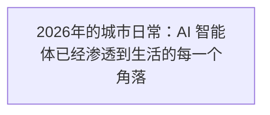
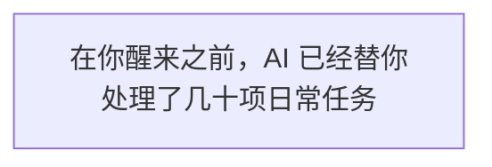
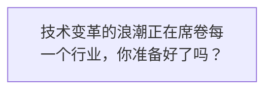
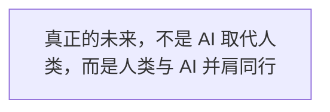
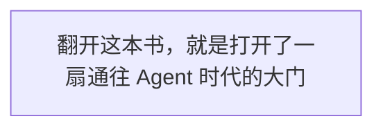
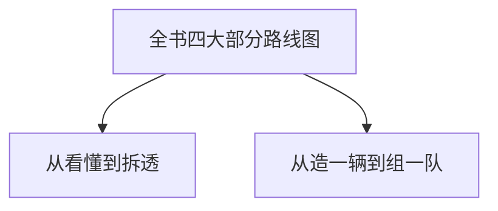

智驾时代：Agent 进化简史

从 Prompt 到自进化组织，一部 AI 智能体的演化史诗

序章 · 你上车了吗？

↓ 向下滚动开始阅读 ↓

> 图 1：2026年的城市日常：AI 智能体已经渗透到生活的每一个角落

你有没有想过，有一天你醒来，世界已经不是你睡着前的样子了？

不是说外星人入侵了，也不是说发生了什么惊天动地的大事。而是说——**AI 已经悄悄接管了你每天一半以上的工作，而你甚至还没意识到。**

## 一、清晨的魔法

让我们把时钟拨到 2026 年的某个普通早晨。

早上 7 点，你的智能窗帘缓缓拉开，阳光温柔地洒进卧室。这不是什么新鲜事——五年前就有了。但你不知道的是，在你还在做梦的时候，你的 AI 助理已经替你做完了这些事：

> 图 2：在你醒来之前，AI 已经替你处理了几十项日常任务

- 凌晨 4:32，它帮你回复了三封来自海外合作方的邮件，措辞比你自己写的还得体
- 凌晨 5:15，它发现了代码库里一个潜伏了两周的 Bug，并自动生成了修复方案和测试用例
- 早上 6:00，它根据你今天的日程重新安排了会议顺序，把不重要的会议挪到了下午
- 早上 6:40，它帮你写好了今天要交的项目周报初稿，只等你过目确认
- 早上 6:55，它提醒你今天要下雨，建议出门带伞，并自动帮你叫好了车

而你呢？你只是伸了个懒腰，看了一眼手机上的"今日待办已处理 80%"的提示，然后起床刷牙。

你甚至不会觉得这有什么了不起的。就像今天的我们不会觉得"手机能上网"有什么了不起的一样。

任何足够先进的技术，都与魔法无异。  
——阿瑟·克拉克

但你有没有想过一个问题：这一切是怎么发生的？

就在几年前，AI 还只是个"聊天机器人"。你问它一个问题，它给你一个答案。它不会主动做事，不会自己思考下一步，更不会替你安排好一整天。

那时候，你得像个指挥官一样，一条指令一条指令地喂给它。它就像个刚入职的实习生——聪明是聪明，但你不推它，它绝对不动。

而现在，它已经变成了你的"数字员工"。不，不止一个。它是一支团队：有负责写代码的，有负责整理资料的，有负责跟客户沟通的，还有专门负责检查质量的。它们在你看不见的地方，24 小时不间断地工作着。

**这个转变，就是 Agent 的诞生。**

## 二、这不是科幻，这是正在发生的现实

我知道你可能会想："说得这么玄乎，真的假的？"

我完全理解。因为三年前我也是这么想的。

2023 年的时候，大家都在玩 ChatGPT。那时候最时髦的词叫"Prompt Engineering"（提示词工程）。网上到处都是"万能提示词模板"，好像你掌握了几句咒语，就能让 AI 无所不能。

我也买过好几套"提示词课程"。说实话，有用，但用处有限。就像你学了几句常用外语，确实能跟老外聊两句，但你不可能靠这个去做同声传译。

真正的变化发生在 2024 年下半年。突然之间，AI 不只是"能聊天"了——它开始"能做事"了。

> 图 3：技术变革的浪潮正在席卷每一个行业，你准备好了吗？

先是编程领域。GitHub 推出了 Copilot Workspace，OpenAI 推出了 Codex，Anthropic 推出了 Claude Code。这些工具不再是"帮你补全一行代码"——它们能理解整个项目结构，能自己读文件、写代码、跑测试、修 Bug，甚至能自己创建 Pull Request。

然后是办公领域。各种 AI Agent 如雨后春笋般冒出来：有的能帮你整理会议纪要并自动生成待办，有的能帮你分析数据并生成报告，有的能帮你回复邮件还能自动跟进，有的甚至能帮你做市场调研并输出完整的调研报告。

到了 2025 年，"Agent"这个词已经从技术圈的黑话，变成了科技媒体的头条常客。而 2026 年的今天，它已经悄悄走进了普通人的日常生活。

**冷知识**

2023 年，一个普通开发者平均每天要写 300 行代码。2026 年，同样的开发者，通过 Agent 工具，每天能"产出"超过 3000 行代码——但其中 90% 都不是他们亲手敲的，而是他们"指挥" Agent 写的。

这不是遥远的未来。这就是现在。

## 三、时代永远在淘汰不愿意改变的人

听到这里，你可能有两种反应。

一种是："哇，好厉害！我也要学！"

另一种是："完了，AI 要取代我了，我要失业了。"

如果你是第一种，恭喜你——这本书就是为你写的。

如果你是第二种，我想对你说：**别慌。**

历史已经无数次证明，每一次技术革命都会淘汰一批人，但也会造就一批人。蒸汽机出现的时候，手工织布工人恐慌过；汽车出现的时候，马车夫恐慌过；电脑出现的时候，打字员恐慌过。

但最终，那些学会了使用新技术的人，都过得比以前更好。

> 图 4：真正的未来，不是 AI 取代人类，而是人类与 AI 并肩同行

AI 不会取代你。但**会用 AI 的人，一定会取代不会用 AI 的人。**

这不是危言耸听。这是正在发生的事实。

我身边已经有很多这样的例子了：

- 一个独立开发者，以前一个人做一个产品要半年，现在带着三个 Agent，两个月就能上线一个完整产品
- 一个运营经理，以前写一份活动方案要三天，现在让 Agent 先出十个方案，她只负责选最好的那个再微调，半天搞定
- 一个创业者，以前招 5 个人的团队才能做的事，现在自己加几个 Agent 就能运转，成本降到了原来的五分之一

这些人不是什么天才，也不是什么技术大牛。他们只是**比别人早一步学会了"驾驭"AI**而已。

改变从来不是等来的，而是主动拥抱的。  
你不一定要跑赢 AI，但你一定要跑赢那些还在观望的人。

## 四、这本书带你从 0 到 1 看懂 Agent

说了这么多，你脑子里大概已经冒出一串问号："Agent 到底是什么？我该怎么学？从哪儿开始？"

这就是我写这本书的原因。

现在关于 Agent 的内容不少，但要么是太技术化了——一堆论文、公式、代码，普通人看了头都大；要么是太玄乎了——什么"通用人工智能"、"奇点临近"，听着激动人心，但看完了你还是不知道该干嘛。

这本书不一样。

> 图 5：翻开这本书，就是打开了一扇通往 Agent 时代的大门

我不想给你讲一堆高大上的概念，也不想跟你讨论什么哲学问题。我只想做一件事：**用最通俗的语言，帮你从 0 到 1 搞懂 Agent——它是怎么来的、怎么工作的、你怎么用它。**

为了让你更容易理解，我想到了一个绝妙的比喻：

**Agent 就像一辆会自己开的"智能汽车"。**

等等，什么意思？

别急，这正是第 1 章要详细讲的内容。在这里我先卖个关子。我只能告诉你：用"智能汽车"这个比喻，你能把 Agent 的所有核心概念——大脑、记忆、上下文、工具、Harness、可观测、自进化——一次性全部理解。

而且你会发现，原来那些听起来高大上的技术术语，都跟你每天开车遇到的事情差不多。

## 五、这本书怎么读？

### 📚 本书阅读指南

🚗

第一部分：演化史

从 Prompt 到 Auto-Organization，看懂 Agent 是怎么一步步进化来的

第二部分：架构详解

拆开 Agent 的"五脏六腑"，看懂每个部件是怎么工作的

第三部分：实战案例

亲手造一辆属于你的 Agent，从理论到落地

第四部分：组织与进化

从单车到车队，探索未来 AI 自进化组织的可能性

> 图 6：全书四大部分路线图：从看懂到拆透，从造一辆到组一队

这本书我给它设计了四个层次，你可以根据自己的情况选择怎么读：

### 如果你是完全的小白

建议你从第一部分开始，老老实实一章一章读下去。我保证，只要你会用智能手机，就能看懂这本书里的所有内容。读完第一部分，你就能在朋友面前装一把"AI 达人"了。

### 如果你已经在用 AI 工具

你可以重点读第二部分和第三部分。读完之后你会有"原来如此"的感觉——以前很多模糊的概念会瞬间清晰，你使用 AI 的水平会直接上一个台阶。

### 如果你是开发者或产品经理

建议你全书精读，尤其关注第三部分和第四部分。这本书里的很多思路和案例，可能会直接改变你做产品的方式。

### 如果你是创业者或管理者

你可以先读序章、第一部分和第四部分。这些内容会帮你建立对 Agent 时代的全局认知，让你在做战略决策的时候更有底气。

**阅读建议**

不用追求一次读完。每天读一章，甚至一节，就足够了。关键是边读边想：这个概念能不能用到我的工作和生活里？带着问题读书，收获才最大。

## 六、改变就从当下开始

写到这里，我想跟你说几句实在话。

我不是什么专家，也不是什么大佬。我就是一个普通的科技从业者，跟你一样，在这个快速变化的时代里，一边兴奋，一边焦虑。

兴奋的是，我们这代人有幸亲眼见证一场可能是人类历史上最深刻的技术革命。

焦虑的是，生怕自己跟不上，生怕被时代甩下。

但后来我想明白了一件事：**焦虑没用，行动才有用。**

与其每天刷着"AI 又进化了"的新闻心慌，不如沉下心来，花一点时间，真正把这件事搞懂。

搞懂了，你就不慌了。

搞懂了，你就知道怎么用它来为自己服务了。

搞懂了，你就不是那个被时代推着走的人，而是那个**乘着时代浪潮前进**的人。

改变就从当下，就从你翻开这本书开始。  
让 AI 成为我们的智驾，与我们同行。

好了，序章就到这里。

下一章，我们正式启程——我会用"智能汽车"这个绝妙的比喻，帮你一次性搞懂 Agent 到底是什么。读完之后，你看待 AI 的方式会完全不一样。

**准备好了吗？系好安全带，我们出发！**

← 返回目录 第1章：Agent 是什么？ →

《智驾时代：Agent 进化简史》 © 2026

从 Prompt 到自进化组织，一部 AI 智能体的演化史诗
