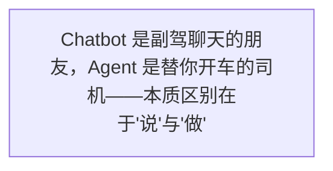
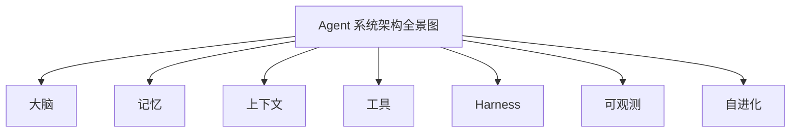
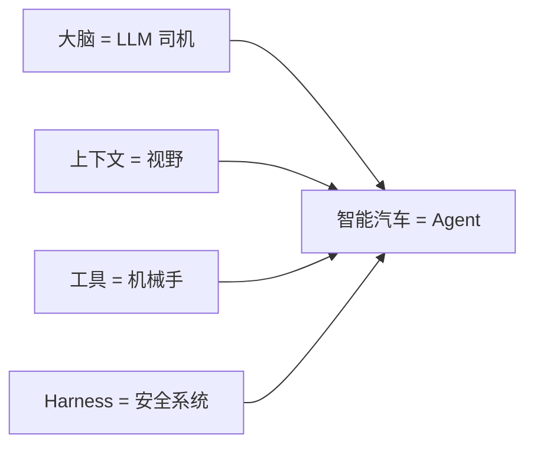
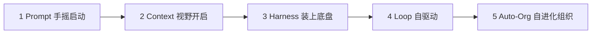
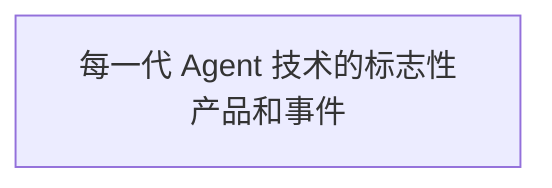
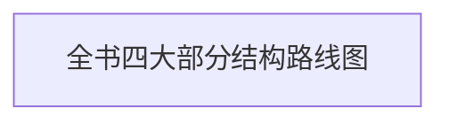

第一部分 · 演化史

一辆会自己开的"智能车"

如果我问你："Agent 是什么？"你可能会说："就是那个能自己做事的 AI 吧？"

这个回答没错，但不够准确。

市面上关于 Agent 的定义五花八门。有人说它是"能自主行动的 AI"，有人说它是"大模型加工具"，还有人说它是"下一代软件的新范式"。

这些说法都对，但都太抽象了。

在这一章里，我要给你一个**所有人都能听懂**的解释。而且我敢保证，看完这一章，你这辈子都不会忘记 Agent 是什么。

因为我要把 Agent 比作——**一辆会自己开的智能汽车。**

## 1.1 从 Chatbot 到 Agent：不止是聊天

在正式介绍 Agent 之前，我们先聊聊它的"前任"——Chatbot（聊天机器人）。

相信你对 Chatbot 一点都不陌生。从最早的 Siri、小度，到 2022 年爆火的 ChatGPT，再到你手机里的各种智能客服——它们都是 Chatbot。

Chatbot 的特点很简单：**你问一句，它答一句。**

你问它"今天天气怎么样"，它告诉你气温和降水概率。你问它"帮我写一封请假邮件"，它啪啪啪给你生成一段文字。你问它"这个 Bug 怎么修"，它给你一段代码和思路。

但是——它**不会真的去做**。

它不会真的去查你家楼下的天气传感器，不会真的帮你把邮件发出去，也不会真的打开你的代码库去改那个 Bug。

它只是"说"，而不是"做"。

> 图 1：Chatbot 是副驾聊天的朋友，Agent 是替你开车的司机——本质区别在于"说"与"做"

![图 1b：Chatbot 与 Agent 的本质对比——差的不只是")(assets/figures/fig_chatbot_vs_agent.svg)

ChatGPT 是坐在副驾陪你聊天的朋友，  
Agent 是替你开车的司机。

这个比喻你一定要记住。因为它是理解 Agent 的第一把钥匙。

想象一下这个场景：

你坐进一辆车，副驾坐着一个朋友。你说"我要去公司"，他开始跟你聊天："走哪条路呀？""今天可能堵车哦。""要不你走高架吧？"他说得头头是道，但**方向盘在你手里**，你得自己开。

这就是 Chatbot。它能给建议、能出主意、能写东西，但**真正做事的还是你**。

但如果你坐进的是一辆自动驾驶汽车呢？

你只需要说"我要去公司"，然后就可以闭上眼睛休息了。车会自己判断走哪条路、自己控制油门刹车、自己避开障碍物、自己把你送到目的地。

这就是 Agent。它不只是跟你聊天——它**真的在做事**。

### 从"你问我答"到"自己去干"

这是一次质的跃迁，而不仅仅是量的提升。

为什么这么说？因为一旦 AI 开始"做事"，就会引出一大堆全新的问题：

- 它能看到什么？（视野问题）
- 它能使用哪些工具？（能力边界）
- 它怎么判断任务完成了？（目标设定）
- 它做错了谁来拦住？（安全控制）
- 做完这件事后它该干什么？（流程接续）
- 它怎么记住上次做了什么？（记忆系统）

这些问题，在 Chatbot 时代根本不存在。因为反正都是你在做事，AI 只是动动嘴皮子。

但到了 Agent 时代，这些问题一个都绕不开。因为你把"方向盘"交出去了——哪怕只是部分交出。

**一句话总结**

Chatbot 的本质是"回答问题"，Agent 的本质是"完成任务"。一字之差，天壤之别。

举个最直观的例子：

你对一个 Chatbot 说："帮我看看项目里有没有 Bug。"它会给你一堆建议："你可以看看日志、跑一下测试、检查报错信息……"

你对一个 Agent 说同样的话。它会直接打开你的项目，读日志文件，运行测试，定位错误，甚至自己生成修复方案，然后告诉你："我找到了 3 个 Bug，修复方案已经写好了，你过目一下。"

看到差别了吗？

一个是**教你怎么做**，一个是**直接帮你做**。

这就是为什么 Agent 被称为"AI 的下一个时代"。因为它从"嘴炮选手"变成了"实干家"。

## 1.2 Agent 的"五脏六腑"：一辆智能车的完整构造

好了，现在你知道 Agent 是"会自己做事的 AI"了。但它具体是怎么工作的呢？

这就要拆开来看了。

我刚才说，Agent 就像一辆智能汽车。这个比喻不是随便说说的——Agent 的每一个核心组件，都能在智能汽车上找到对应。

> 图 2：Agent 系统架构全景图：大脑、记忆、上下文、工具、Harness、可观测、自进化

让我们一辆车一辆车地"拆解"，看看 Agent 到底有哪些"五脏六腑"。

### 大脑（Model）：决策中心

如果说 Agent 是一辆智能汽车，那么**大模型就是它的大脑**。

就像人类开车靠大脑做决策一样——判断前方是红灯还是绿灯、要不要变道、踩油门还是踩刹车——Agent 的所有决策也都是大模型在做。

大模型就是 Agent 的"司机"。它读入信息、理解任务、制定计划、做出判断。

早期的大模型只能处理文字，就像一个只能看路牌的司机。现在的多模态大模型能看图、能听声音、能理解视频，就像一个有完整视觉和听觉的司机——能看清路况、能识别行人、能看懂交通标志。

🔬 内行看门道

严格来说，大模型（LLM）只是 Agent 的一个组件。但它是最核心的组件——所有其他组件都是围绕它服务的。没有大模型，Agent 就没有"灵魂"。这也是为什么大家常说"Agent = LLM + 其他"。

### 🧩 记忆（Memory / RAG）：海马体与知识库

你有没有过这种经历：跟一个人聊天，上一秒刚说过的话，下一秒他就忘了？

早期的 AI 就是这样。每次对话都是"全新的开始"，它不记得你上次说了什么。

但 Agent 不一样。它有记忆。

Agent 的记忆分两种：

**短期记忆**——就像你开车时记住"前面那辆车刚打了右转向灯"。它存在于当前的对话上下文中，任务结束就忘了。

**长期记忆**——就像你记住"每天上班的路怎么走"。它被存储在外部的知识库或数据库里，下次遇到类似任务还能调用。这就是大家常听到的 RAG（检索增强生成）技术——Agent 需要的时候，可以从知识库中"调出"相关信息。

如果用汽车来比喻，短期记忆就是挡风玻璃前的实时路况，长期记忆就是车载导航里的地图数据。

### 上下文（Context）：车前窗的视野

这是一个非常非常重要的概念——重要到我后面会用一整章来讲它。

什么是上下文？简单说就是：**Agent 在做决策的时候，能看到多少信息。**

还是用开车打比方。

如果你的车前窗很小，只能看到前面几米的路，你开车肯定战战兢兢，因为你看不到远处的情况，遇到突发状况来不及反应。

如果你的车前窗很大，视野开阔，能看到很远的地方，你开车就从容很多，可以提前规划路线、避开拥堵。

Agent 的上下文窗口，就是它的"前窗视野"。

> 图 3：把 Agent 比作智能汽车：大脑是司机，上下文是视野，工具是机械手，Harness 是安全系统

上下文越大，Agent 能"看到"的信息就越多，做出的决策就越准确。但上下文也不是越大越好——就像开车不是看得越远越好，你还得过滤掉无关信息，否则注意力会被分散。

**划重点**

上下文的核心不是"越多越好"，而是"刚刚好"。信息太少会瞎猜，信息太多会被噪音干扰，信息太旧会基于错误事实推理。这就是 Context Engineering（上下文工程）要解决的问题。（"Context Engineering"一词在 2025 年由 Shopify CEO Tobi Lütke 公开推广 [9]，随后成为业界共识术语——本书也沿用了这一叫法。）

### 工具（Tools）：机械手与传感器

光有大脑和眼睛还不够——Agent 还得有"手"和"脚"，才能真正做事。

这些"手"和"脚"，就是工具（Tools）。

Agent 能使用的工具有哪些？说出来你可能吓一跳：

📁

文件操作

读文件、写文件、改代码

🌐

网络搜索

查资料、搜信息、浏览网页

命令执行

跑测试、编译、部署

📧

通讯工具

发邮件、发消息、约会议

💾

数据库

查数据、写记录、做分析

🤖

API 调用

连接各种第三方服务

工具是 Agent 与真实世界交互的接口。没有工具，Agent 就是一个"纸上谈兵"的军师——说起来头头是道，但什么也干不了。

有了工具，Agent 才能真正"动手做事"。

### Harness（驾驭系统）：驾校 + 交规 + 导航

现在我们来到了 Agent 世界里**最容易被忽略但又最重要**的一个概念——Harness。

Harness 这个词直译是"马具"、"安全带"的意思。在 Agent 领域，它被翻译成"驾驭系统"或"工程支架"。

什么意思呢？

想象一下：你有一辆性能超强的智能汽车，马力很大，速度很快。但如果没有方向盘、没有刹车、没有交通规则、没有导航系统——你敢坐吗？

肯定不敢。

Harness 就是 Agent 世界里的"方向盘、刹车、交规和导航"。它要解决的问题是：**怎么让 Agent 安全、可靠、可控地工作。**

Harness 具体管什么呢？

- **权限控制**：哪些文件 Agent 能改，哪些不能碰——就像汽车不能开上人行道
- **行为约束**：Agent 必须遵守的规则——就像交通法规，红灯停绿灯行
- **验证机制**：怎么判断 Agent 做对了还是做错了——就像年检和安全检测
- **人工接管点**：什么情况下必须停下来问人——就像复杂路况需要人类司机接管
- **失败恢复**：出错了怎么办——就像安全气囊和紧急制动

没有 Harness 的 Agent，就像一辆没有刹车的跑车——  
跑得越快，死得越惨。

我跟你说句实在话：很多人对 Agent 的理解就停留在"大模型加工具"这个层面。这就大错特错了。

**真正决定 Agent 能不能用、好不好用、敢不敢用的，不是大模型有多聪明，而是 Harness 做得有多完善。**

大模型决定了 Agent 的"能力上限"，而 Harness 决定了 Agent 的"安全下限"。

没有下限的能力，再强也不敢用。

### 📹 可观测 / 可审计：行车记录仪 + 黑匣子

你开车的时候，是不是会装行车记录仪？

为什么？因为万一出了事故，你需要知道当时发生了什么，谁的责任。

Agent 也一样。

当 Agent 做完一件事，你需要知道它是怎么做的、用了哪些工具、中间出了什么错、为什么做出了那个决策。

这就是可观测性（Observability）和可审计性（Auditability）。

可观测性解决的是"它在干什么"的问题——就像仪表盘实时显示车速、转速、油量。

可审计性解决的是"它干了什么"的问题——就像黑匣子记录了所有操作，出了问题可以回溯。

这东西平时看起来没用，但一旦出了问题，它就是你的救命稻草。

### 🔄 自进化：越开越熟练的老司机

最后，也是最酷的一点——Agent 能自我进化。

一个新手司机第一次上路，可能会熄火、会压线、会紧张。但开了一年之后，就变成老司机了——遇到各种情况都从容不迫。

Agent 也是一样。

它可以从每一次任务中学习：上次是怎么做的？哪里做对了？哪里做错了？下次怎么改进？

这种"越用越好用"的特性，就是 Agent 的自进化能力。

当然，现阶段的自进化还比较初级——更多是"记忆和经验的积累"，而不是真正的"自我改进"。但这个方向是确定的：**Agent 会越用越聪明，越用越懂你。**

**本章核心**

Agent = 大脑（大模型）+ 记忆（短期+长期）+ 视野（上下文）+ 手脚（工具）+ 安全系统（Harness）+ 记录仪（可观测）+ 学习能力（自进化）。缺了任何一样，都不是完整的 Agent。

### 🧩 七个部件，一个系统

讲到这里，你可能会觉得："哇，Agent 好复杂啊，七个部件呢。"

其实一点都不复杂。因为这七个部件不是各自为政的，它们是一个有机的整体。

我打个比方你就懂了。

你开车的时候，眼睛看路（上下文），大脑做决策（大模型），手脚操作方向盘和油门（工具），导航地图告诉你怎么走（记忆），交规和刹车保证你不闯祸（Harness），行车记录仪记录你的驾驶行为（可观测），你开得越多技术越好（自进化）。

这些东西是同时在工作的，而不是一个一个分开的。

Agent 也是一样。这七个组件协同工作，才构成了一个完整的、能做事的智能体。缺了任何一个，都会出问题：

- 没有大脑——那就是个没头苍蝇，只会瞎撞
- 没有记忆——每次都是从零开始，永远学不会东西
- 没有上下文——就像蒙着眼睛开车，不撞才怪
- 没有工具——光说不练假把式，什么也干不成
- 没有 Harness——就像没有刹车的车，跑得越快越危险
- 没有可观测——黑箱操作，出了问题不知道为啥
- 没有自进化——永远是新手，不会越来越聪明

🔑 关键洞见

很多人对 Agent 的理解停留在"大模型 + 工具"。这就像对汽车的理解停留在"发动机 + 轮子"。不能说不对，但远远不够。一辆能上路的汽车，需要的远不止这些——刹车、仪表盘、安全带、车灯、雨刷……少了哪一样都不行。

## 1.3 演化之路：从"手摇启动"到"全自动驾驶"

Agent 不是一天炼成的。

就像汽车从发明到现在，经历了从"手摇启动的老爷车"到"全自动驾驶的智能汽车"的漫长演化一样，Agent 也经历了五代演进。

这五代不是互相替代的关系，而是**层层叠加**的关系——就像现代汽车依然有方向盘和刹车，但在此之上又加了自动驾驶系统一样。

> 图 4：Agent 技术五代演化时间线：从 Prompt Engineering 到 Auto-Organization

让我们顺着时间线，看看每一代到底解决了什么问题。

第一代

#### Prompt Engineering —— 手摇启动

2022-2023 年 · 代表产品：ChatGPT

这是一切的起点。你得亲自"摇启动手柄"——写一段提示词，AI 才动一下。你说一句，它做一步，你不催它，它就停在那儿。就像最早的汽车，每次启动都得下来摇半天手柄。

第二代

#### Context Engineering —— 装上了导航

2023-2024 年 · 代表技术：RAG、向量数据库

光有启动手柄还不够——你还得告诉它怎么走。Context Engineering 就是给 AI 装了一张"地图"：它能看到项目文档、历史记录、相关资料，而不是凭空瞎猜。但方向盘还在你手里，它只是看得更清楚了。

第三代

#### Harness Engineering —— 装上了刹车和方向盘

2024-2025 年 · 代表产品：Claude Code、GitHub Copilot Workspace

AI 开始有了工具，能真正做事了。但能做事的同时也可能闯祸——乱删文件、搞错命令、引入 Bug。于是 Harness 出现了：给它装刹车、装方向盘、装仪表盘、装安全气囊。它从"能做事"变成了"能安全地做事"。

第四代

#### Loop Engineering —— 它自己会跑了

2025-2026 年 · 代表概念：Agent Loop、Automations

这是最关键的一步跃迁。在 Harness 时代，AI 做完一件事就停下来等你发下一个指令。到了 Loop 时代，它能自己跑了——发现任务、执行任务、验证结果、记录状态、然后进入下一轮。就像定速巡航加自动导航，你设定好目的地，它自己开。

第五代

#### Auto-Organization —— 组队进化出车队

2026 年及以后 · 代表概念：Multi-Agent、Agent Swarms

一辆车跑得快，但一支车队能运的货更多。Auto-Organization 就是从"单车"走向"车队"：多个 Agent 分工协作，有负责写代码的，有负责做测试的，有负责审查的，它们自动组队、自动协作、甚至自动演化出新的组织形态。

> 图 5：每一代 Agent 技术的标志性产品和事件

### 每一代的核心差异

讲到这儿，你八成想问：这五代的核心区别到底是什么？

我用一张表给你总结清楚：

| 代际 | 核心问题 | 人的角色 | 类比 |
|-|-|-|-|
| Prompt | 怎么说清楚需求 | 发令者 | 手摇启动，喊一句动一下 |
| Context | 让它看到什么信息 | 指路者 | 给它一张地图，自己找路 |
| Harness | 它能做什么、不能做什么 | 安全员 | 装上刹车、方向盘、交规 |
| Loop | 怎么让它持续运转 | 监督者 | 定速巡航，自己跑起来 |
| Auto-Org | 怎么组队、怎么进化 | 治理者 | 车队编队，自组织进化 |

**一个关键认知**

这五代不是替代关系，而是叠加关系。就像有了自动驾驶的汽车依然有方向盘和刹车一样，有了 Loop 和 Auto-Organization 的 Agent 系统里，Prompt 和 Context 依然是最基础的组件。新的范式不是淘汰旧的，而是把旧的包起来，变成更大系统的一部分。

### 一个真实的故事：从"写提示词"到"搭系统"

讲了这么多理论，我给你讲个真实的故事吧。

我有个朋友，叫阿明，是个独立开发者。2023 年的时候，他特别沉迷 Prompt Engineering。他有个笔记本，专门收集各种"神级提示词"——什么"万能翻译官提示词"、"顶级产品经理提示词"、"资深架构师提示词"……整整收集了一百多条。

那时候他逢人就说："你知道吗？AI 的上限取决于你的提示词写得好不好。"

到了 2024 年，他开始用 Claude Code 写代码。一开始他还是老习惯——每次都精心打磨提示词，争取一句话让 AI 明白要做什么。

但慢慢的，他发现不对劲了。

他发现，每次新开一个会话，都得重新解释一遍项目结构、编码规范、测试命令……而且 AI 老是犯同样的错误，比如忘记激活虚拟环境，比如随手改不相关的文件。

后来他学聪明了，在项目根目录放了一个 `AGENTS.md` 文件，把所有规则都写进去：项目结构是什么、编码规范是什么、哪些目录不能碰、测试命令是什么、出了问题怎么排查……

效果立竿见影。AI 犯的低级错误少了 80%。

再后来，他又开始折腾更多东西：给 AI 配置可以调用的工具、设置哪些命令允许自动执行哪些必须确认、写了专门的代码审查提示词……

到了 2025 年下半年，他的工作方式彻底变了。

现在的他，每天早上打开电脑，第一件事不是写代码，也不是写提示词。而是看 Agent 昨晚跑出来的结果：哪些 Bug 被发现了、哪些测试失败了、哪些功能有了初步方案、哪些问题需要他拍板。

他的工作从"写代码"变成了"定规则、设边界、做决策"。

真正的变化不是 AI 变强了，  
而是你使用 AI 的方式变了。  
从"写提示词的人"变成了"设计系统的人"。

阿明的故事不是特例。这是成千上万正在发生的真实故事。

而他走过的这条路——从 Prompt 到 Context 到 Harness 到 Loop——正是 Agent 演化的缩影。

你现在可能还在第一代，每天琢磨怎么写好提示词。没关系，大家都是这么过来的。

但我想告诉你的是：**这只是起点。前面还有更广阔的世界。**

### 为什么你需要知道这些？

可能你会想："我就是想用用 AI，搞懂这些有什么用？"

用处大了。而且不止一个用处。

#### 第一，帮你少花冤枉钱

现在市面上的 AI 产品五花八门，都说自己是"Agent"。但如果你知道了这五代的区别，你就能一眼看穿：

- 有些所谓的"Agent"，其实就是换了皮的 Chatbot——它还停留在第一代
- 有些产品加了知识库，能调用文档——这大概在第二代
- 有些能帮你写代码、跑命令——这才到了第三代
- 有些能自动发现任务、自动执行、自动记录——这到了第四代
- 能多智能体协作、自组织的——那就是第五代了，目前还很少见

以后再有人跟你吹"我们家 Agent 多么多么厉害"，你就把这五代往他脸上一套——真厉害假厉害，一验便知。再也不会被营销文案忽悠了。

#### 第二，帮你选对学习路径

很多人学 AI 的方式是东一榔头西一棒子——今天学个提示词技巧，明天看个 RAG 教程，后天又听说什么新框架火了赶紧去学。

结果学了一堆，脑子里还是乱的。

但如果你知道了这五代的演化脉络，你就有了一张清晰的地图：你现在在哪儿、下一步该学什么、哪些东西是基础必须打牢、哪些是高级内容可以后面再学。

**学习建议**

不要跳级。如果你连 Prompt 都写不好，就别急着搞什么多智能体。先把前几代的基础打牢，再一层一层往上走。地基不牢，地动山摇。

#### 第三，帮你把握时代趋势

最后，也是最重要的——理解了这条演化路径，你就能看清未来的方向。

Agent 技术现在发展到哪一步了？下一个突破点会在哪里？哪些方向是真正有前途的，哪些只是昙花一现的概念炒作？

当你站在演化的高度往下看，这些问题都会变得清晰很多。

而能看清趋势的人，永远比看不清的人多一分胜算。

## 1.4 这本书带你去哪儿？

好了，第一章的主要内容就到这里。

但我猜你现在可能有两个感觉：一方面觉得"Agent 这东西挺有意思的"，另一方面又觉得"好像还没讲透"。

没错，这就是第一章的目的——**给你一张地图，让你知道自己在哪儿、要去哪儿。**

具体的细节，我们后面慢慢聊。

> 图 6：全书四大部分结构路线图

这本书总共分为四个部分，带你从入门到精通，从看热闹到看门道：

🚗 第一部分：看懂 Agent 是怎么来的

第 1-3 章 · 演化史

我们会沿着时间线，从 Prompt Engineering 开始，一路讲到 Auto-Organization。 你会看到 Agent 是怎么从"一句话的事"，一步步演化成"能自己跑的系统"。 每一代为什么会出现？解决了什么问题？又留下了什么新问题？ 读完这一部分，你对 Agent 的理解就能超过 90% 的人。

**第二部分：拆开看看 Agent 里面有什么**

第 4-7 章 · 架构详解

我们会把 Agent 大卸八块，一个组件一个组件地讲清楚。 大脑怎么工作？记忆怎么存储？上下文怎么管理？工具怎么调用？ Harness 怎么设计？可观测性怎么做？自进化怎么实现？ 读完这一部分，你就能从"看热闹"变成"看门道"。

**第三部分：亲手造一辆属于你的 Agent**

第 8-10 章 · 实战案例

光说不练假把式。这一部分我们会动手做几个真实可用的 Agent。 从最简单的个人助理，到能写代码的编程 Agent，再到能处理复杂任务的工作流 Agent。 读完这一部分，你不仅能看懂，还能亲手做出来。

**第四部分：未来的智能车队**

第 11-12 章 · 组织与进化

最后，我们把目光投向未来。 当 Agent 不止一个，而是几十个、几百个的时候，会发生什么？ 它们怎么协作？怎么组织？怎么进化？会涌现出什么样的新能力？ 人类在其中扮演什么角色？读完这一部分，你会对未来有全新的想象。

从看懂到拆透，从造一辆到组一队——  
这就是我们的旅程。

好了，第一章就到这里。

不过先透个底，免得你后面犯迷糊：第一章我们立起了"五代演化"的时间线，但接下来你会经历一次"倒着拆车"——我们会把智能车大卸八块，从刹车方向盘（Harness）、到发动机（LLM 大脑）、再到记忆和工具，逐个零件拆开讲。零件顺序未必跟时间线一致，别急，等车拆完了，你会发现主线一直都在。

如果你看到这里还意犹未尽——恭喜你，你已经被 Agent 勾住了。下一章，我们会正式踏上演化之路，从一切的起点——Prompt Engineering——开始讲起。

你可能会说："Prompt 有什么好讲的？不就是写提示词吗？"

嘿，你还真别小看它。Prompt 虽然是第一代，但它是所有后面几代的基础。而且，**真正懂 Prompt 的人，其实没你想的那么多。**

想知道 Prompt Engineering 的精髓是什么吗？我们下一章见分晓。

**系好安全带，下一站：Prompt 的黄金时代。**

← 序章：未来已来 第2章：Prompt 的黄金时代 →

《智驾时代：Agent 进化简史》 © 2026

从 Prompt 到自进化组织，一部 AI 智能体的演化史诗
