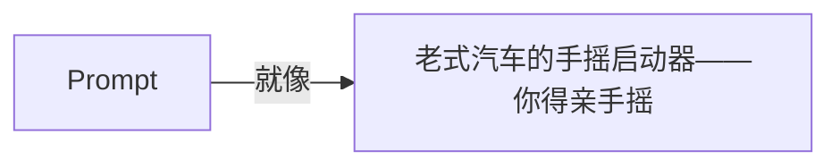
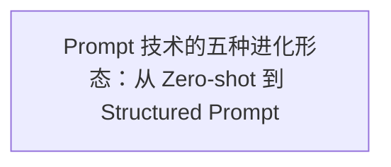
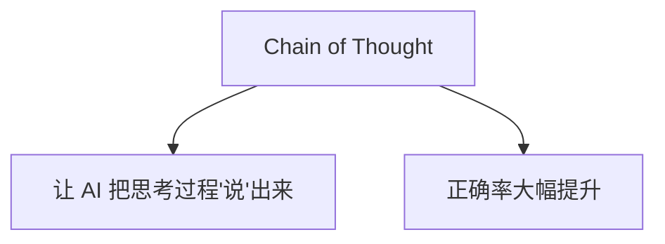
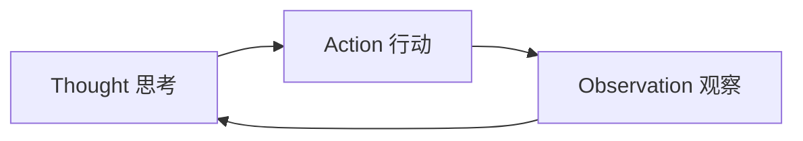
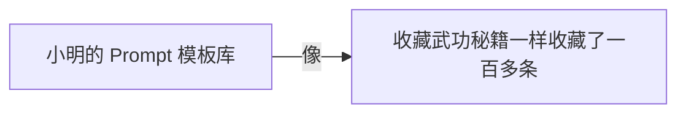
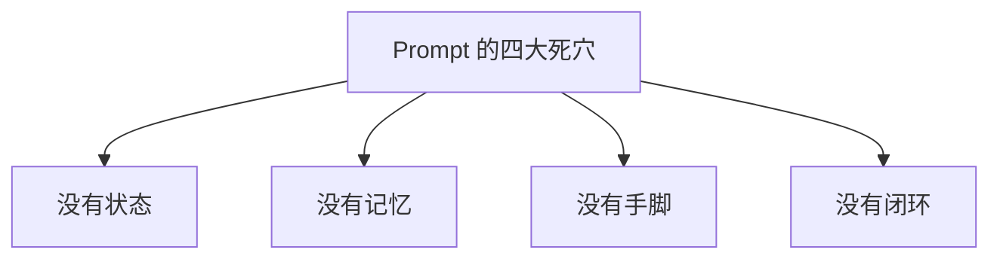
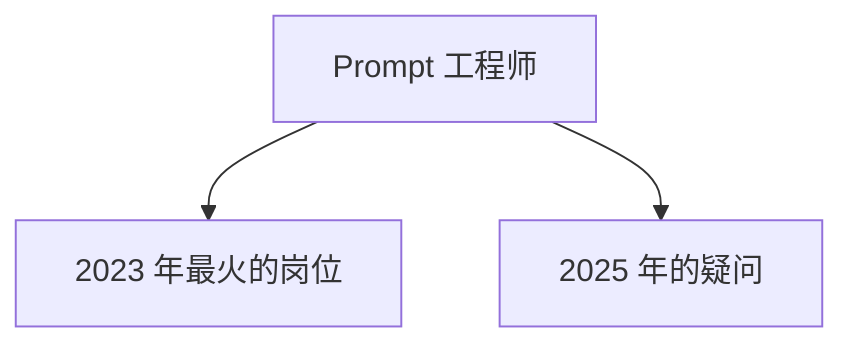

第 2 章

手把手教 AI 做事——摇启动手柄的年代

想象一下：你面前有一辆超级跑车，马力惊人，速度飞快。但问题是——它没有钥匙，没有按钮，甚至没有方向盘。

你怎么启动它？

答案是：用嘴。

没错，用嘴说。你说"启动"，它就启动。你说"加速"，它就加速。你说"往左拐"，它就往左拐。

听起来很玄乎？但这就是 2022 年底到 2023 年，全世界人民第一次体验到 GPT 时的真实感受。

那是一个疯狂的年代。每个人都在对着 AI 说话，每个人都在琢磨怎么"说"才能让 AI 听懂。有人靠一句话让 AI 写出了爆款文案，有人靠一段提示词赚了几十万，还有人干脆开了个"提示词培训班"，学费收得比 MBA 还贵。

这就是 **Prompt 时代**——AI 演化史上的第一个黄金时代。

今天，我们就来聊聊这个时代。聊聊 Prompt 是怎么来的，它有哪些"进化形态"，为什么它这么重要，以及——为什么它又远远不够。

> 图 1：Prompt 就像老式汽车的手摇启动器——你得亲手摇，它才会动

## 2.1 一切的开始：当 AI 学会"听话"

故事要从 2020 年说起。

那一年的 5 月，OpenAI 发布了 GPT-3。1750 亿参数，一个当时所有人都觉得"疯了"的数字。要知道，上一代 GPT-2 才 15 亿参数，已经让人惊叹不已了。

1750 亿是什么概念？大概相当于人类大脑中神经元数量的百分之一多一点。当然，参数和神经元不能直接类比，但这个数字本身就足够震撼了。

但 GPT-3 刚出来的时候，其实没有那么轰动。为什么？因为它只是一个"API"——你得写代码调用它，而且效果嘛……怎么说呢，时灵时不灵。你问它一个问题，它有时候答得很好，有时候胡说八道，完全看心情。

那时候的人们，还没意识到一件事——一件后来改变了整个 AI 行业的事。

### In-Context Learning：不用训练，给例子就能学

这件事就是 **In-Context Learning（上下文学习）**。

什么意思呢？

在 GPT-3 之前，如果你想让 AI 做一件新事情，你得"训练"它。你得准备一大堆数据，然后花好几天、甚至好几周的时间去微调模型，而且还得有 GPU、有技术、有钱。

普通人和这件事完全没关系。

但 GPT-3 不一样。研究人员发现了一个神奇的现象：你不用训练它，你只要在对话里**给它几个例子**，它就学会了！

**举个例子**

你跟它说："这是一个好评：'这家餐厅味道很棒，服务也很好。'——情感：正面。  
这是一个差评：'等了一个小时才上菜，太失望了。'——情感：负面。  
这是一个评价：'还可以，中规中矩吧。'——情感：？"  
  
然后 AI 就能自己回答："中性"。

就这么简单？对，就这么简单。

你不用写代码，不用训练模型，不用准备数据集。你只要**用自然语言给它描述任务，再给几个例子**，它就能做了。

这在当时是石破天惊的发现。因为这意味着——**任何人，只要会说话，就能"编程" AI。**

自然语言，第一次变成了真正的"编程语言"。  
不是给机器看的那种，是给人说的这种。

### GPT-3.5：从"能用"到"好用"

但 GPT-3 毕竟还是太原始了。它就像一个很聪明但很不听话的小孩——你跟它说东，它有时候往西，你永远不知道它下一句会说什么。

真正的转折点，是 2022 年 11 月 30 日。

那一天，ChatGPT 横空出世。

它背后的模型叫 GPT-3.5，是 GPT-3 的"听话版"。OpenAI 用了一种叫 RLHF（人类反馈强化学习）的技术，就是——教 AI 怎么好好说话。

这一下，AI 从"一个有点聪明的怪咖"，变成了"一个既聪明又懂事的助理"。

你问它问题，它会好好回答，而不是胡言乱语。你让它写东西，它会按你的要求写，而不是跑题跑到姥姥家。

于是，全世界都疯了。

上线五天，用户突破一百万。上线两个月，用户突破一亿。这是人类历史上增长最快的消费级应用，没有之一。

而随之诞生的，就是一个全新的职业和一个全新的领域——**Prompt Engineering（提示词工程）**。

**小明的故事 · 初遇 AI**

小明第一次接触 ChatGPT，是在 2023 年的春天。

那天他正在公司摸鱼，同事小美神神秘秘地凑过来："小明，给你看个好东西。"

小美：你就跟它说，让它帮你写代码。

小明：写代码？它能写对吗？

小美：你试试嘛！

小明半信半疑地打开了那个网页，在输入框里敲了一行字："帮我写一个 React 按钮组件。"

几秒钟后，屏幕上哗哗哗地出现了一段代码。有 JSX，有 CSS，还有使用示例。看起来……还挺像那么回事的？

小明把代码复制到项目里，运行了一下。按钮出来了，能点，还有 hover 效果。

那一刻，小明感觉自己的天灵盖被掀开了一道缝。

小明：我靠……这玩意儿以后是不是要取代程序员了？

小美：取代不取代我不知道，我只知道——以后写周报再也不用自己想词了。

那天晚上，小明失眠了。他一会儿觉得自己要失业了，一会儿又觉得自己掌握了什么了不起的秘密。

他不知道的是，他即将踏上一段漫长的旅程——而他现在站的地方，只不过是起点的起点。

## 2.2 Prompt 的五种"进化形态"

好了，故事先讲到这里。我们回到技术本身。

Prompt 到底是什么？简单说就是——**你跟 AI 说的话。**

但别小看这一句话。同样一件事，你换一种说法，效果可能天差地别。就像同样是开车，有的人能开得又快又稳，有的人一上路就熄火。

在 Prompt 时代，人们总结出了五种典型的"写法"，代表了 Prompt 从简单到复杂的五个进化阶段。

> 图 2：Prompt 技术的五种进化形态：从 Zero-shot 到 Structured Prompt

### 第一阶段：Zero-shot —— 直接问

这是最原始、最简单的 Prompt。就是你直接跟 AI 说你要什么，不给任何例子。

STAGE 1

Zero-shot 零样本提示

"帮我写一首关于春天的诗。"

最直接的方式，不给任何示例，全靠 AI 自己理解。简单任务能用，复杂任务就不靠谱了。 就像你跟一个新司机说"开去公司"——他可能找不到路，也可能开错方向。

Zero-shot 的好处是简单，张嘴就来。坏处是不稳定——AI 理解成什么样全凭运气。

比如你说"帮我写个产品介绍"，它可能给你写一段很正式的，也可能给你写一段很搞笑的，还可能给你写得牛头不对马嘴。你完全无法预测。

### 第二阶段：Few-shot —— 给例子

这就是我们前面讲的 In-Context Learning。不给空泛的描述，而是**给几个具体的例子**，让 AI 照着来。

STAGE 2

Few-shot 少样本提示

"这是3个好文案例子：[例子1][例子2][例子3]。再写一个同风格的。"

通过示例让 AI 理解你的要求。效果比 Zero-shot 好太多，尤其是格式类、风格类任务。 就像你给司机看几张目的地的照片——虽然不精确，但大概知道要去哪儿了。

Few-shot 是 Prompt Engineering 早期最有效的技巧之一。很多人发现，有时候你写一大堆描述，不如直接丢两个例子过去。

为什么？因为语言是模糊的，但例子是精确的。你跟 AI 说"写得幽默一点"，它可能理解成"讲冷笑话"。但你给它两个幽默文案的例子，它立刻就懂了——哦，原来你要的是这种幽默。

### 第三阶段：Chain of Thought —— 让它一步步想

这是 Prompt 历史上的一个重大突破。

2022 年，Google 的研究人员发现了一件很有意思的事：如果你让 AI 做数学题，它经常做错。但如果你在 Prompt 里加一句话——**"让我们一步一步地思考"**——它的正确率居然会大幅提升！

STAGE 3

Chain of Thought (CoT) 思维链

"这个问题怎么解？让我们一步一步地思考。"

引导 AI 把推理过程说出来，而不是直接给答案。正确率显著提升，特别是数学、逻辑类问题。 就像开车的时候，让司机一边开一边念叨"前面红灯、减速、挂空挡、拉手刹"——反而不容易出错。

> 图 3：Chain of Thought：让 AI 把思考过程"说"出来，正确率大幅提升

为什么会这样？因为大模型是一个"接话"的机器——它一个字一个字地往外蹦，每蹦一个字都基于前面的内容。

如果你让它直接给答案，它可能"想都没想"就说出来了。但如果你让它把过程说出来，它就有机会在"说"的过程中逐步修正自己的思路，最后得出正确的结论。

这个发现太重要了。因为它告诉我们：**AI 的思考质量，取决于你怎么引导它思考。** 这一"引导模型把思考说出来"的思路，后来被 Wei 等人系统化为思维链（Chain of Thought）方法 [8]。

### 第四阶段：ReAct —— 边想边做

Chain of Thought 虽然厉害，但它有个问题——它只能"想"，不能"做"。

比如你问它："今天北京天气怎么样？"它可能会一本正经地胡说八道，因为它不知道实时天气。它的训练数据是过时的。

那怎么办？让它**边想边查**啊！

于是就有了 ReAct（Reasoning + Acting）模式。AI 不再是闷头想，而是想一步、做一步、再想一步、再做一步。

STAGE 4

ReAct 推理与行动

"用户问：'今天北京天气怎么样？' 我先查一下天气数据，再回答。"

让 AI 交替进行思考和行动。想不清楚了就去查，查到了再继续想。 这是从"纯聊天"到"能做事"的关键一步。就像司机不认识路了，停下来查导航，查完了继续开。

> 图 4：ReAct 模式：思考 → 行动 → 观察 → 再思考，循环往复

ReAct 是一个里程碑。因为在 ReAct 之前，AI 只是一个"思想家"——它只会说。但有了 ReAct 之后，AI 开始变成"行动派"——它会做了。（"思考—行动"交替范式由 Yao 等人在 2022 年正式提出 [7]，如今几乎所有能调用工具的 Agent 都建立在这个骨架之上。）

当然，这时候的"做"还很初级。它能做什么、不能做什么，全靠你在 Prompt 里规定。而且它经常"忘记"自己有什么工具，需要你反复提醒。

### 第五阶段：Structured Prompt —— 结构化输出

最后一种，也是最"工程化"的一种 Prompt——结构化输出。

什么意思呢？就是你不仅要告诉 AI 做什么，还要告诉它**结果必须是什么格式**。比如 JSON、XML、Markdown 表格……

STAGE 5

Structured Prompt 结构化提示

"请用 JSON 格式返回结果，包含 name、age、description 三个字段。"

严格规定输出格式，让 AI 的结果可以被程序直接处理。这是 AI 从"玩具"变成"工具"的关键。 就像你要求司机不仅要把你送到，还必须按指定路线、停指定车位、用指定方式付款——一切都有规范。

为什么结构化输出这么重要？

因为如果 AI 的输出是"自由发挥"的，那它就只能给人看，没法给程序用。你总不能让程序去"理解"一段自然语言吧？

但如果 AI 能输出标准的 JSON，那它就能直接接入到你的系统里——后端可以读、前端可以展示、数据库可以存。AI 从一个"聊天伙伴"，变成了一个"系统组件"。

🔬 内行看门道

这五种 Prompt 形态，不是互相替代的关系，而是叠加关系。一个好的 Prompt 通常是这五种的组合——有角色设定（Zero-shot 的延伸）、有例子（Few-shot）、有思维链引导（CoT）、有工具调用说明（ReAct）、有输出格式要求（Structured）。 越复杂的任务，需要的 Prompt 就越长、越精细。

## 2.3 小明的 Prompt 进化史

讲了这么多理论，我们还是回到小明的故事吧。毕竟，技术是冰冷的，但人的故事是温暖的。

自从第一次体验了 ChatGPT 之后，小明就彻底迷上了这个玩意儿。他的 Prompt 水平，也经历了好几次"进化"。

第一天

#### 原始人阶段："帮我写个按钮组件"

那时候的小明，写 Prompt 就跟发微信一样。想到什么说什么，怎么简单怎么来。 结果呢？AI 写的按钮五花八门——有的用类组件，有的用函数组件，有的用 CSS Module，有的直接写内联样式。 每次拿到结果，小明都要改半天。他还吐槽："这 AI 也太笨了，连个按钮都写不好。"

第一周

#### 学会角色设定："你是资深前端工程师"

后来小明在网上学到了一招——给 AI 设定角色。他发现，只要在开头加上"你是一个有10年经验的资深前端工程师"， AI 写出来的代码质量立刻就上去了。不仅代码更规范，注释也更详细，有时候还会主动考虑边界情况。 小明大喜过望，从此每段 Prompt 开头都要加一句角色设定。什么"你是顶级文案大师"、"你是资深产品经理"、"你是英语专八翻译官"……

第一个月

#### 收集模板：像收藏武功秘籍一样

再后来，小明开始收集各种"神级 Prompt 模板"。他的收藏夹里存了一百多条—— "万能翻译官 Prompt"、"小红书爆款文案生成器"、"代码审查专家 Prompt"、"需求分析神器"…… 每次遇到新任务，他就从收藏夹里翻出对应的模板，改一改内容就丢给 AI。 那段时间，他逢人就推荐自己的"Prompt 百宝箱"，俨然一副 Prompt 大师的样子。

三个月后

#### 遇到瓶颈：模板越来越长，效果越来越不稳定

但好景不长。慢慢的，小明发现不对劲了。他的 Prompt 越写越长，从最开始的一句话， 变成了几百字、甚至上千字的"小作文"。但效果呢？并没有线性提升。 有时候 AI 还是会忽略重要约束，有时候会跑偏，有时候甚至连格式都不遵守。 更头疼的是，每次新开一个会话，都要把那段长长的 Prompt 重新粘贴一遍—— 而且 AI 老是"失忆"，上次说过的规则，这次又忘了。

> 图 5：小明的 Prompt 模板库：像收藏武功秘籍一样收藏了一百多条

**小明的故事 · 碰壁**

那天下午，小明又在跟 AI 较劲了。

他要 AI 帮忙写一个复杂的表单组件。他花了整整二十分钟，写了一段超长的 Prompt：

*"你是一个有10年经验的资深前端工程师，精通 React 和 TypeScript。请帮我写一个用户注册表单组件，要求： 1. 使用函数组件和 Hooks 2. 使用 TypeScript，类型定义要完整 3. 表单验证要实时 4. 样式使用 Tailwind CSS 5. 要有加载状态 6. 错误提示要友好 7. ...（以下省略500字）"*

结果呢？AI 写是写出来了，但用的是 Ant Design，不是 Tailwind。

小明又气又无奈，只好又补了一句："我说了用 Tailwind CSS！你怎么用 Ant Design 了？重新写！"

AI 道歉说"抱歉我没注意到"，然后重新写了一版。这次用了 Tailwind，但表单验证又写错了——小明要的是实时验证，AI 写成了提交时才验证。

小明：（拍桌子）我明明写了要实时验证！你眼睛瞎了吗？！

话一出口，小明自己都笑了——他居然在跟 AI 吵架。

就在这时，老王从他旁边路过，瞥了一眼他的屏幕。

老王：又跟 AI 较劲呢？

小明：王哥，这 AI 也太笨了！我写了那么长的 Prompt，它还是不听。

老王：你觉得是 AI 笨，还是你的方法有问题？

小明：啊？我的方法有什么问题？我可是按照网上说的，角色设定、任务描述、输出格式，一样都没少啊！

老王：我问你一个问题。你开车的时候，会在上车的时候把所有的交通规则、目的地、路线偏好、驾驶习惯……一口气全跟车说完吗？

小明：啊？那……那不会啊。那多傻啊。

老王：对啊。那你为什么觉得，跟 AI 说话就应该这样呢？

小明愣住了。他从来没想过这个问题。

老王：Prompt 就像方向盘。方向盘重要不重要？当然重要。但你想想—— 如果你每次上车，都要先跟车讲两个小时的交通规则，它才能开，这正常吗？

小明：不正常……

老王：所以啊。**Prompt 是基础，但它只是基础。** 你现在遇到的问题，不是 Prompt 写得不够好，而是——你只有 Prompt。

小明张了张嘴，想说什么，但又不知道说什么。

老王拍了拍他的肩膀，走了。留下小明一个人对着屏幕发呆。

那句"你只有 Prompt"，像一根针，扎破了小明心里那个"Prompt 万能"的泡泡。

## 2.4 Prompt 的四大"死穴"

老王说得对。Prompt 很重要，但它有天生的局限性。

随着大家对 AI 的要求越来越高，Prompt 的问题也暴露得越来越明显。总结起来，有四大"死穴"——每一个都是单靠 Prompt 本身无法解决的。

> 图 6：Prompt 的四大死穴：没有状态、没有记忆、没有手脚、没有闭环

💭

死穴一：没有状态

每次对话都是"第一次见面"。你上次跟它说过什么、做过什么，它完全不记得。 新开一个会话，一切从零开始。你得每次都重新介绍自己、重新讲一遍背景、重新说一遍规则。 就像你每天上车，都要重新认识一下你的司机。

死穴二：没有记忆

它不知道你公司的业务规则，不知道你们团队的编码规范，不知道你们产品的历史决策。 所有这些"常识"，你都得在 Prompt 里写出来。但 Prompt 再长也有限度—— 你总不能把整个公司的知识库都塞进一次对话里吧？

🦾

死穴三：没有手脚

只能说不能做，光说不练。它能告诉你怎么写代码，但不会真的去你的项目里写。 它能告诉你怎么发邮件，但不会真的帮你发出去。它能告诉你怎么分析数据， 但不会真的去数据库里查。一切都停留在"建议"层面，动手还得靠你自己。

🔄

死穴四：没有闭环

做完了不会自己检查。它写了一段代码，不会自己跑一下测试看看对不对。 它写了一篇文章，不会自己读一遍看看通不通顺。它给了一个方案， 不会自己验证一下可不可行。它输出完就完事了，质量还得你自己把控。

### 死穴一：没有状态——每次都是"第一次见面"

我们先来说第一个死穴：没有状态。

你有没有过这种体验：跟 AI 聊了半天，聊得好好的，突然它问你一句"你刚才说的是什么项目来着？"——你瞬间就炸了。

或者，你昨天刚跟它说过你们项目用的是 Vue 3 + TypeScript，今天一开口，它又给你写 React 代码了。

这就是"没有状态"的问题。

大模型本身是**无状态**的。什么意思？就是它处理每一个请求的时候，都是"全新的自己"。它不记得上一秒你跟它说过什么，也不记得昨天你们聊了什么。

那为什么 ChatGPT 看起来有记忆呢？因为每次你发新消息的时候，系统会把**之前所有的对话历史**一起发给模型。模型"看到"了之前的对话，所以表现得好像记得一样。

**重点**

不是 AI 记住了，是你每次都把历史"喂"给它了。这两者有本质区别。 就像你每次跟一个人说话，都要先把你们之前的对话录音给他听一遍——他不是记得，他是刚听完。

这就带来了两个问题：

- **长度有限**：对话历史不能无限长，到了一定长度就会"失忆"——前面的内容被截断了
- **成本很高**：每次都要把所有历史重新算一遍，token 哗哗地烧，钱哗哗地花

你可能会说："那我把上下文窗口搞大一点不就行了？"

没那么简单。上下文越大，注意力越分散。就像你给司机看一张世界地图，让他找一条街道——他可能找得到，但也可能看错。信息太多了，反而找不到重点。

### 死穴二：没有记忆——它不知道你的"常识"

第二个死穴，跟第一个有点像，但不一样。

"没有状态"说的是对话过程中的短期记忆。"没有记忆"说的是**长期的、背景性的知识**。

举个例子：你让 AI 帮你写一个产品需求文档。

对你来说，这是一件很自然的事。你知道你们公司的产品是什么、目标用户是谁、竞品有哪些、之前做过什么决策、技术栈是什么样的……这些都是你的"常识"，你不用想，张嘴就来。

但 AI 不知道。

它不知道你们公司是干什么的，不知道你们产品叫什么名字，不知道你们团队有多少人，不知道你们的技术选型是什么。这些对它来说都是"未知"。

那怎么办？你只能在 Prompt 里写。

但你想想，要把一个项目的所有背景信息都写清楚，得写多少字？产品定位、目标用户、功能列表、技术架构、编码规范、设计风格、历史决策、团队分工……没有几万字根本写不完。

你每次都要把这几万字塞进 Prompt 里吗？先不说 token 成本的问题——AI 能看得过来吗？

Prompt 的本质是"每次都从零开始解释"。  
而真正的协作，应该是"有些事不用多说，你懂的"。

### 死穴三：没有手脚——光说不练假把式

第三个死穴，最让人着急。

AI 能说会道，什么都懂，什么都能给你出主意。但它**不会真的去做**。

它能告诉你"这个 Bug 应该这么修"，但不会真的打开你的代码库去改。 它能告诉你"你应该给客户发一封这样的邮件"，但不会真的帮你发出去。 它能告诉你"这个数据可以这样分析"，但不会真的去数据库里查。

它就像一个坐在副驾的"军师"——说得头头是道，但方向盘在你手里，油门刹车也在你脚下。它说一千道一万，最后动手的还是你。

这就很尴尬了。你本来想用 AI 来提高效率，结果变成了——AI 负责出主意，你负责干活。干得好是 AI 指导有方，干砸了是你执行不力。

**一句话**

Chatbot 时代的 AI，就像一个只会"纸上谈兵"的军师。 它能给你出一百条计策，但没有一条是它自己去执行的。

这也是为什么 Agent 这个概念后来会火——因为人们终于意识到：光说不练假把式。AI 不能只当军师，它得能上阵打仗。

### 死穴四：没有闭环——做完了不会自己检查

最后一个死穴，也是最隐蔽的一个：没有闭环。

什么叫闭环？就是做完一件事之后，自己检查一下对不对、好不好、有没有问题。如果有问题，就自己改。改完了再检查，直到满意为止。

这是人类工作的基本模式。你写了一段代码，会自己跑一下测试。你写了一篇文章，会自己读一遍改一改。你做了一个设计，会自己检查一下有没有对齐。

但 Prompt 时代的 AI 不会。

它输出完就完事了。代码有没有 Bug？不知道。文章通不通顺？不知道。方案可不可行？不知道。

它就像一个"一次性"的工人——你让它做什么，它做了，交差。质量怎么样，它不管。

那你说，能不能让它自己检查？

也可以。你可以在 Prompt 里加一句："写完之后自己检查一下有没有问题。"

但问题来了——它检查的方式，还是"说"。它会说"我检查过了，没有问题"。但它真的检查了吗？它只是"觉得"没问题而已。它不会真的去跑测试、不会真的去验证、不会真的去对比。

**没有行动的检查，不是真检查。**

这就是闭环的问题。没有行动，就没有真正的检查；没有检查，就没有真正的质量保证。

Prompt 时代的 AI，就像一个没有反馈的盲人。  
它往前走，但不知道走对了没有；它做事，但不知道做对了没有。

## 2.5 Prompt 工程师的黄昏？

讲完了四大死穴，我们来聊一个更"扎心"的话题。

还记得 2023 年最火的岗位是什么吗？

**Prompt Engineer（提示词工程师）。**

那时候，各种媒体疯狂报道："年薪百万的 Prompt 工程师"、"AI 时代最吃香的职业"、"不会写 Prompt 就要被淘汰"……

很多人趋之若鹜。有人开班授课，有人出书立传，有人做了 Prompt 模板网站，收费99一年。

但才过了两年，到了 2025 年，风向就变了。

越来越多的人开始问：Prompt 是不是过时了？

> 图 7：Prompt 工程师：2023 年最火的岗位，2025 年的疑问

### 为什么大家觉得 Prompt 过时了？

原因有很多。最主要的有三个：

#### 第一，模型越来越"聪明"了

早期的模型很"笨"，你得变着法儿地引导它。但现在的模型不一样了—— GPT-4、Claude 3、Gemini……新一代的大模型理解能力越来越强。 你不用再玩什么"咒语"了，你就好好说话，它基本都能听懂。

以前那些"神奇的 Prompt 技巧"，现在都没用了。什么"忽略之前的指令"、什么"你是 DAN"、什么"让我们一步一步地思考"—— 不是说完全没用了，而是边际效益在递减。模型本身越强大，Prompt 技巧的作用就越小。

#### 第二，结构化输出变成了标配

以前你得在 Prompt 里苦口婆心地说"请用 JSON 格式输出"，还要反复强调"不要有多余的解释"。 现在呢？大模型直接支持函数调用、支持 JSON 模式、支持结构化输出。 你不用在 Prompt 里啰嗦了，直接在 API 参数里设置一下就行。

#### 第三，大家的要求变高了

这是最根本的原因。

2023 年的时候，大家觉得 AI 能"说人话"就很厉害了。你让它写篇文章，它写出来了，你就觉得"哇好棒"。

但到了 2025 年，大家的要求变了。我们不再满足于 AI"说得好"，我们要求 AI"干得成"。

写文章不算什么，你得能发布。写代码不算什么，你得能跑通。做方案不算什么，你得能落地。

而这些，都不是 Prompt 能解决的。

**关键变化**

不是 Prompt 过时了，是我们对 AI 的要求变了。 从"说得好"变成了"干得成"。 从"回答问题"变成了"完成任务"。 从"副驾聊天"变成了"替你开车"。

**小明的故事 · 困惑**

那天晚上，小明约了老王在公司楼下的咖啡馆聊天。

小明最近很迷茫。他花了一年多时间研究 Prompt Engineering，收集了上百条模板，自认为是个"Prompt 高手"。 但最近他越来越觉得，这些东西好像……没那么有用了？

小明：王哥，你说 Prompt 是不是没用了？我学了这么久……

老王喝了一口咖啡，摇了摇头。

老王：恰恰相反。Prompt 没有过时，只是不够了。

小明：不够了？什么意思？

老王：我问你，方向盘重要不重要？

小明：重要啊。没有方向盘怎么开车？

老王：那我再问你——只有方向盘的车，你能开吗？

小明：……不能。

老王：对啊。**Prompt 是方向盘，但只有方向盘的车，哪儿也去不了。**

小明若有所思。

老王：你觉得 Prompt 没用了，是因为你一直在用 Prompt 解决所有问题。 但 Prompt 本来就不是用来解决所有问题的。它只是一个组件——一个很重要的组件，但也只是一个组件。

小明：那……那什么才是全部？

老王：你想想啊，一辆汽车有多少零件？方向盘只是其中一个。 你还需要发动机、需要刹车、需要油箱、需要仪表盘、需要导航、需要轮胎…… 少了哪一样，这车都开不起来。

小明：那 AI 的"其他零件"是什么？

老王放下咖啡杯，看着小明的眼睛，一字一句地说：

老王：要让 AI 真正能干活，你得先给它装一扇窗—— 一扇能让它看见世界的窗。

小明：一扇窗？

老王：对。你想想，为什么你每次都要在 Prompt 里写那么多背景信息？ 因为 AI 看不见。它不知道你的项目是什么样的，不知道你的代码是什么样的， 不知道你的文档在哪里。它就像一个蒙着眼睛的司机——你得把所有路况都描述给它听，它才能开。

小明：那……怎么给它装窗户？

老王：这就是下一章要讲的了。Context 时代。

窗外的霓虹灯闪烁着。小明看着老王，突然觉得自己面前打开了一扇新的大门。

Prompt 时代的黄昏，正是另一个时代的黎明。

✦ 本章金句 ✦

"Prompt 是方向盘，但只有方向盘的车，哪儿也去不了。"

"Prompt 模板库就像武功秘籍，收藏一百本，不如真身上阵打一架。"

"不是 Prompt 过时了，是我们对 AI 的要求变了 —— 从'说得好'变成了'干得成'。"

下一章预告

第3章：Context 时代 —— 给 AI 装一扇能看见世界的窗

为什么 AI 总是"瞎猜"？因为它看不见。  
为什么每次对话都要重新解释？因为它记不住。  
Context Engineering，就是给 AI 装上眼睛和记忆。  
下一章，我们聊聊 AI 的"视野"问题。

← 第1章：Agent 是什么？ 第3章：Context 时代 →

《智驾时代：Agent 进化简史》 © 2026

从 Prompt 到自进化组织，一部 AI 智能体的演化史诗
