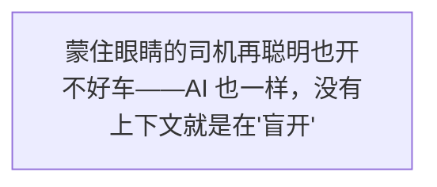
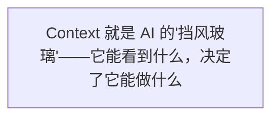
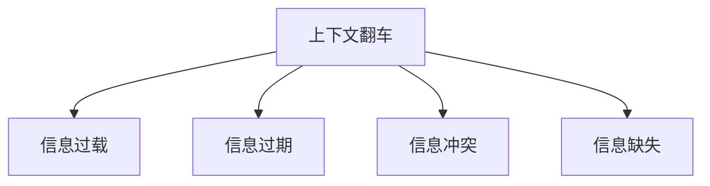
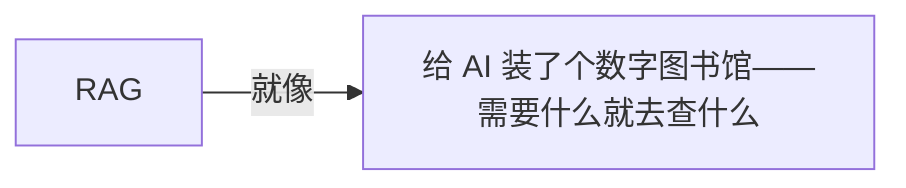
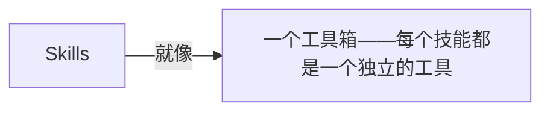

第 3 章

给 AI 一张地图 —— 视野决定能力

如果说 Prompt Engineering 教会了 AI "怎么说话"，那 Context Engineering 就是教会了 AI "怎么看世界"。

在上一章里，我们聊了 Prompt 的黄金时代。小明学会了怎么写提示词，怎么让 AI 听懂自己的需求。他一度以为，只要提示词写得足够好，AI 就能无所不能。

直到那一天，他遇到了一个让他彻底改观的问题。

那是一个普通的周三下午，小明对着电脑屏幕，眉头紧锁。他的项目里出了一个诡异的 Bug——页面在某些情况下会白屏，但刷新一下又好了。这个 Bug 时隐时现，像幽灵一样折磨了他整整两天。

他决定向 AI 求助。

## 3.1 一个意外的发现：同样的 Prompt，不同的结果

小明先打开了一个新的对话窗口，输入了他最习惯的提问方式：

📝 实验一

**提问：**"帮我修一下 Bug，页面有时候会白屏。"

AI 的回答很快出来了，洋洋洒洒写了一大堆：可能是 JavaScript 报错、可能是 CSS 加载问题、可能是网络请求失败、可能是内存泄漏……从前端到后端，从浏览器到服务器，列了十几种可能性。

看着这些"正确的废话"，小明叹了口气。这些可能性他都想到了，但关键是——到底是哪一个？

他不甘心，又开了一个新窗口。这次，他做了一件不一样的事：他把错误日志、相关的代码文件、甚至最近几次测试的结果，一股脑全贴了进去，然后问了同样的问题。

📝 实验二

**提问：**"这是控制台的错误日志、相关组件的代码、最近三次复现的测试结果，帮我修一下 Bug，页面有时候会白屏。"

这一次，AI 的回答完全不一样了。

它没有列十几种可能性，而是直接指出了问题所在：**在某个异步组件加载失败的情况下，错误边界（Error Boundary）没有正确处理，导致整个页面渲染崩溃。**它甚至给出了具体的修复代码，以及为什么会出现"刷新一下就好"的现象——因为刷新后缓存命中，组件加载成功了。

小明盯着屏幕，愣住了。

一模一样的问题，一模一样的 AI，为什么回答质量天差地别？

他把这个发现告诉了老王。老王听完，微微一笑，问了他一个问题：

老王

我问你，如果你是个修车师傅，有人过来跟你说"我的车有时候开不动"，你能直接告诉他问题出在哪吗？

小明

那肯定不行啊。至少得看看车长什么样、听听发动机声音、读一下故障码吧？

老王

对啊。那你凭什么觉得，AI 仅凭一句"页面白屏"就能找到 Bug？

小明

呃……我以为 AI 很聪明，应该什么都知道？

老王

聪明是一回事，能看到什么是另一回事。一个再聪明的修车师傅，你把他眼睛蒙起来，他也修不了车。AI 也一样。

AI 经常不是不会做，而是看错了世界。

老王的这句话，像一道闪电劈进了小明的脑子里。

他之前一直以为，AI 的能力取决于它有多"聪明"——也就是模型有多大、参数量有多少、训练数据有多全。但今天这个实验让他意识到，AI 能不能做好一件事，很多时候**不取决于它有多聪明，而取决于它能看到多少信息。**

同样一个 AI，同样一个问题，给它的信息不一样，它给出的答案质量就有天壤之别。

这，就是 Context（上下文）的力量。

> 图 1：蒙住眼睛的司机再聪明也开不好车——AI 也一样，没有上下文就是在"盲开"

## 3.2 Context 是什么？—— AI 的"挡风玻璃"

那天下午，老王给小明上了重要的一课。

他们坐在公司的休息区，老王端着一杯咖啡，慢悠悠地说：

老王

你还记得我之前跟你说的那个比喻吗？Agent 就像一辆智能汽车。

小明

记得记得！大模型是大脑，工具是手脚，Harness 是刹车。

老王

那 Context 是什么呢？

小明

嗯……是导航地图？

老王

比那更基础。Context 是**挡风玻璃**。

小明

挡风玻璃？

老王

对。想象一下：你坐在驾驶座上，透过挡风玻璃能看到什么，决定了你怎么开车。如果玻璃被糊住了，你只能看到前面一点点路，你敢开快吗？你敢变道吗？肯定不敢，因为你看不到周围的情况。

老王接着解释：Context 就是 AI 在做决策的时候，**这一轮能"看到"的所有信息。**

注意这个词——"这一轮"。AI 不是什么都能看到的，它的"视野"是有限的。每次它回答问题的时候，只能看到你给它的那点信息，再加上它自己训练时学到的知识。

> 图 2：Context 就是 AI 的"挡风玻璃"——它能看到什么，决定了它能做什么

### 为什么上下文窗口越大，AI 看起来越"聪明"

小明听到这里，恍然大悟：

小明

所以那些大模型厂商一直在比"上下文窗口"，从 4K 到 8K，到 32K，再到 128K，甚至 1M……就是在比谁的挡风玻璃更大？

老王

没错。你想啊，如果一辆车的挡风玻璃只有巴掌大，只能看到前面 10 米的路，那它开起来肯定战战兢兢的，遇到情况反应不过来。但如果挡风玻璃超大，能看到几公里之外的情况，那它开起来就从容多了，可以提前规划、提前避让。

小明

所以上下文越大越好？

老王

呵呵，你要真这么想，那就又掉坑里了。

### 但不是越大越好：信息越多，噪音也越多

老王给小明举了个例子：

假设你开车去一个陌生的地方。你有两个选择：

- **选择 A：**一块正常的挡风玻璃 + 一个精准的导航
- **选择 B：**一块 360 度全景玻璃，但上面贴满了小广告、新闻推送、朋友圈动态、股票行情……各种乱七八糟的信息

你选哪个？

小明

那肯定选 A 啊！B 那个玻璃信息虽多，但全是噪音，根本没法好好开车。

老王

Bingo！AI 也是一样的。上下文窗口大了，能装的信息多了，但如果这些信息里大部分是没用的噪音，反而会干扰 AI 的判断。它就像那个被贴满小广告的挡风玻璃——看起来信息很多，但真正重要的东西反而被淹没了。

**关键认知**

上下文的大小不是目的，**上下文的质量才是。**给 AI 1000 个无关的 token，不如给它 100 个精准的信息。Context Engineering 的本质，不是给 AI 更多信息，而是给 AI 对的信息。

小明若有所思地点点头。他之前一直以为，上下文越大越厉害，所以每次都恨不得把整个项目塞进去。现在他才明白，那可能是在帮倒忙。

上下文太少，AI 会瞎猜；  
上下文太多，AI 会走神；  
上下文太旧，AI 会开倒车。

## 3.3 Context Engineering 的三大核心问题

"既然 Context 这么重要，那怎么才能做好呢？"小明急切地问。

老王放下咖啡杯，竖起三根手指：

老王

Context Engineering 说复杂也复杂，说简单也简单。说到底就是三个问题：**放什么？放多少？什么时候放？**

这三个问题，就是 Context Engineering 的三大核心问题。每一个问题都值得细细琢磨。

### 问题一：放什么？—— 哪些资料要进上下文

这是最基础也是最重要的问题。你的上下文里应该放哪些信息？

小明一开始的做法是"想到什么放什么"——想起了错误日志就贴错误日志，想起了代码就贴代码。这样做的问题是：**信息很零散，而且经常漏掉关键信息。**

老王告诉他，一个好的上下文，应该包含这几类信息：

- **主事实（Ground Truth）：**最核心、最不能错的信息。比如用户的原始需求、项目的基本结构、关键的约束条件。这些是 AI 做决策的基础，必须放进去。
- **相关资料：**跟当前任务直接相关的信息。比如修 Bug 时的错误日志和相关代码，写文档时的参考资料和已有内容。相关性越强，优先级越高。
- **背景信息：**帮助 AI 理解语境的信息。比如项目的技术栈、团队的编码规范、之前做过的相关决策。这些信息能让 AI 的回答更贴合实际情况。
- **示例和格式：**如果你对输出格式有要求，最好给个例子。比如"输出成 JSON 格式，参考这个例子……"。有示例和没示例，输出质量差很多。

**小技巧**

判断一个信息要不要放进上下文，问自己一个问题：**"如果没有这个信息，AI 能正确完成任务吗？"**如果答案是"不能"或者"可能会错"，那就放进去；如果答案是"影响不大"，那就别放。

### 问题二：放多少？—— 上下文的"预算管理"

上下文不是无限的。不管是 8K 还是 128K，总有一个上限。而且，上下文越大，调用成本越高、响应速度越慢。

这就引出了第二个问题：**在有限的预算下，怎么分配空间？**

> 图 3：上下文就像一个"预算池"——你得精打细算，把空间留给最有价值的信息

老王给小明打了个比方：上下文就像你行李箱的空间。你去旅行，行李箱就那么大，你得决定带什么不带什么。

有的人什么都想带——衣服带十套、鞋子带五双、各种电器全都塞进去，结果箱子爆了，到了目的地发现真正需要的东西反而没地方放。

有的人则很精明——只带最必要的东西，每一样都有它的用途，箱子还有空余，旅途反而更轻松。

🔬 内行看门道

上下文的"成本"不止是钱的问题。研究表明，即使模型能支持很长的上下文，但它对**中间部分**的信息注意力会下降——也就是所谓的"lost in the middle"现象。信息放在开头和结尾，AI 记得更牢；放在中间，容易被忽略。所以，不是塞得越多越好，而是要精选+排序。

### 问题三：什么时候放？—— 一次性全给 vs 按需加载

第三个问题更有意思：信息是一开始就全部给 AI，还是用的时候再给？

小明想了想，说："当然是一开始全给啊，省得后面还要补。"

老王摇摇头："又错了。"

老王

你开车去一个陌生的城市，你会把整个城市的地图都打印出来铺在挡风玻璃上吗？

小明

那当然不会啊，那还怎么看路？导航都是显示当前位置附近的地图，需要的时候再放大缩小嘛。

老王

对嘛。AI 的上下文也是一个道理。**最好的方式不是一次性把所有信息都塞进去，而是按需加载——需要什么就调什么出来。**

小明

可是……AI 怎么知道什么时候需要什么信息呢？

老王

这就是 Context Engineering 最有意思的地方了。简单的做法是用关键词检索——AI 说它需要什么，你就去搜什么。高级的做法呢……我们后面再聊。

小明被吊足了胃口，但他知道老王卖关子的习惯——后面肯定有更精彩的内容。

## 3.4 小明的"上下文翻车"现场

理论归理论，实践起来又是另一回事。

在接下来的一周里，小明兴致勃勃地开始实践 Context Engineering。但他很快发现，说起来容易做起来难——他在上下文上翻的车，比他想象的多得多。

周五下午，他一脸沮丧地找到老王，给他看了自己的"翻车记录"。

> 图 4：上下文翻车现场：信息过载、过期、冲突、缺失——每一种都能让 AI "开沟里"

翻车一

#### 把整个代码库塞进去，AI 找不到重点

小明心想"信息越多越好"，于是把项目里十几个文件的代码全贴进去了，让 AI 帮忙优化性能。结果 AI 回答了一大堆，但说的全是表面问题——真正的性能瓶颈在一个很隐蔽的地方，AI 根本没注意到，因为信息太多了，它的注意力被分散了。

翻车二

#### 上下文过期了，AI 基于旧信息继续推理

小明让 AI 帮忙重构一个组件。一开始给了旧版本的代码，AI 给了重构方案。小明觉得不错，就让 AI 继续改。但中间他自己手动改了几个地方，没有告诉 AI。AI 还是基于之前的旧代码继续推理，结果改出来的东西跟最新的代码完全对不上。

翻车三

#### 上下文里有冲突信息，AI 自己打架

小明往上下文里放了两份文档：一份是产品需求文档，说"按钮要蓝色"；另一份是设计规范，说"主按钮要用品牌橙"。AI 看了之后纠结了半天，最后一会儿说用蓝色一会儿说用橙色——它自己先"打"起来了。

翻车四

#### 为了省 token，关键信息没放进去

这次小明吸取了教训，决定"精简"上下文。他觉得项目的技术栈文档不重要，就没放进去。结果 AI 写的代码用了一个项目里根本没有的库，小明照着改了半天，最后才发现——项目用的是 Vue，AI 写的是 React 代码。

老王看完小明的"翻车集锦"，笑得咖啡都差点喷出来。

老王

可以啊小明，你这一周就把 Context Engineering 的四大经典翻车现场都集齐了，效率挺高啊！

小明

王哥你就别调侃我了，快教教我怎么避免这些坑吧……

老王

别急，这些坑每个人都会踩。你现在踩过了，以后就知道绕着走了。我再给你讲一个进化的故事，听完你就明白该怎么应对了。

## 3.5 从 RAG 到 Skills：上下文的"进化论"

老王说，上下文管理不是一蹴而就的，它也经历了好几代的演化。就像汽车的导航系统，从最开始的纸质地图，到电子导航，再到实时路况导航，一直在进化。

Context Engineering 的演化，大致可以分为四个阶段：

📄

第一代

#### 手工粘贴：手动 CTRL+C / CTRL+V

最原始的方式。你觉得什么信息重要，就自己复制粘贴进去。简单直接，但完全依赖人的判断，效率低、容易漏、质量不稳定。小明最开始就是这个阶段。

第二代

#### RAG 检索：给 AI 装个图书馆

把所有资料提前存进一个"知识库"，AI 需要的时候，用关键词或语义搜索去库里找相关的信息，然后把找到的信息塞进上下文。这就是大家常说的 RAG（检索增强生成）。

📋

第三代

#### 规则文件：AGENTS.md / CLAUDE.md

有些信息每次都需要——比如项目规范、编码风格、目录结构。与其每次都检索，不如直接写在一个固定文件里，每次对话一开始就读取这个文件。就像汽车的用户手册，上车先看一遍，知道基本规则。

🧩

第四代

#### Skills + MCP：模块化、动态化

把知识打包成一个个"技能模块"，需要的时候才加载，不占地方。再通过 MCP 协议动态连接外部数据源——AI 不仅能看自己"车里"的信息，还能实时连到"云端"获取最新数据。

### RAG：给 AI 装了个图书馆

老王重点讲了讲 RAG，因为这是目前最主流的上下文管理方式。

RAG 的全称是 Retrieval-Augmented Generation，翻译过来叫"检索增强生成"。名字听起来很玄乎，其实原理很简单：

> 图 5：RAG 就像给 AI 装了个数字图书馆——需要什么就去查什么，查到了再用来回答问题

想象一下，你有一个巨大的图书馆，里面存了所有的文档、代码、知识。现在有人问了一个问题，你不用把整个图书馆都背下来，而是先去图书馆里找跟这个问题相关的几本书，翻一翻，找到答案了再回答。

RAG 就是干这个的：

- **存：**把所有资料切成一小块一小块的，存进向量数据库（就是那个"图书馆"）
- **搜：**用户提问后，先去向量数据库里搜索，找到跟问题最相关的几块内容
- **拼：**把搜到的内容和用户的问题拼在一起，组成完整的上下文
- **答：**把这个完整的上下文发给大模型，让它基于这些信息来回答

**为什么 RAG 这么火**

因为 RAG 完美解决了几个痛点：一是不用每次都把所有信息塞进上下文（省 token）；二是可以随时更新知识库（信息不会过期）；三是 AI 的回答有依据（可以追溯来源）。这也是为什么 2023 年 RAG 突然爆火，几乎成了 AI 应用的标配。

### AGENTS.md：每次上车先看"用户手册"

讲完 RAG，老王又给小明介绍了一个"小技巧"——项目规则文件。

很多 Agent 工具（比如 Claude Code、Cursor）都支持在项目根目录放一个特殊的文件，通常叫 `AGENTS.md` 或 `CLAUDE.md`。每次 AI 接手项目的时候，会先读这个文件，了解项目的基本规则。

这个文件里一般写什么呢？

- 项目是做什么的（一句话简介）
- 技术栈是什么（用什么框架、什么语言）
- 项目结构是怎样的（关键目录和文件）
- 编码规范是什么（命名风格、代码格式）
- 怎么跑测试、怎么启动、怎么构建
- 哪些东西不能碰（敏感文件、生产环境配置）
- 出了问题怎么排查（常见问题和解决方案）

老王

你别小看这个文件。我见过很多团队，就因为加了这么一个几十行的文件，AI 犯的低级错误直接少了 80%。

小明

这么神奇？不就是个说明文件吗？

老王

你想想，一个新同事加入团队，你是给他一本项目手册让他先看看，还是让他自己瞎摸索效果好？AI 就是那个新同事。你不告诉它规则，它就只能猜，猜对了是运气，猜错了是常态。

### Skills：模块化知识，按需加载

再往上进化，就是 Skills 了。

什么是 Skills？简单说就是**把知识打包成一个个独立的"技能包"，需要的时候才加载进来。**

> 图 6：Skills 就像一个工具箱——每个技能都是一个独立的工具，用的时候才取出来

老王给小明举了个例子：

你有一个 Agent，它有时候要写代码，有时候要写文档，有时候要做数据分析。如果把这些知识全都塞进上下文，那上下文就太臃肿了，而且大部分时候用不上。

但如果做成 Skills 呢？你就有三个技能包：

- **coding.skill** —— 包含编码规范、常用模式、测试方法
- **writing.skill** —— 包含文档模板、写作风格、格式要求
- **analysis.skill** —— 包含分析方法、数据口径、报表模板

AI 要写代码的时候，就加载 coding.skill；要写文档的时候，就加载 writing.skill。这样上下文里始终只有当前任务需要的知识，干净、精准、不臃肿。

**打个比方**

如果说 RAG 是图书馆，那 Skills 就是工具箱。图书馆里的书是"资料"，工具箱里的工具是"能力"。资料是用来查的，能力是用来干的。你不会把整个工具箱都揣兜里，但你需要什么工具，可以随时从里面取。

### MCP Servers：动态连接外部世界

最后，老王提到了一个更新的东西——MCP。

MCP 全称是 Model Context Protocol（模型上下文协议）。它就像是 AI 的"USB 接口"——通过这个接口，AI 可以动态连接到各种外部数据源，实时获取信息。

比如：

- 连接到你的数据库——AI 可以直接查表，不用你把数据导出来再粘贴
- 连接到你的代码仓库——AI 可以直接搜代码、看提交记录
- 连接到你的项目管理工具——AI 可以直接看任务列表、需求文档
- 连接到搜索引擎——AI 可以实时查最新的信息

老王

你看，上下文的演化其实就是一句话：**从"手动搬信息"到"自动找信息"，从"全量塞进去"到"按需取出来"。**

小明

听起来……越来越像 Agent 自己会管理上下文了？

老王

没错。这正是 Context Engineering 发展的方向——从人来管理上下文，逐步过渡到 AI 自己管理上下文。但在那之前，人得先把规则和系统搭好。

## 3.6 Context Engineering 的黄金法则

聊了这么多，老王给小明总结了四条 Context Engineering 的黄金法则。他说，不管技术怎么演化，这四条原则永远不会变。

> 图 7：好的上下文就像一个漏斗——输入的信息很多，但输出给 AI 的，必须是最精准的那部分

1

#### 不是越多越好，是刚刚好最好

很多人以为上下文越大越好，其实不然。信息太少，AI 会瞎猜；信息太多，AI 会被噪音干扰。最好的上下文，是**不多不少，刚刚好**——所有放进去的信息都是有用的，所有有用的信息都放进去了。 怎么判断"刚刚好"？看任务：如果任务很简单（比如翻译一句话），就不需要太多上下文；如果任务很复杂（比如重构一个模块），就需要更多的背景信息。

2

#### 主事实源和过程信息要分开

上下文里的信息，重要程度不一样。有些是"主事实"（Ground Truth）——比如用户的原始需求、项目的基本规则、权威的文档。这些是不能错的，错了整个方向就偏了。 还有一些是"过程信息"——比如 AI 自己的思考过程、中间产物、试错记录。这些是辅助性的，错了可以改。 管理上下文的时候，一定要把这两类信息分开。主事实要放在最显眼的位置，确保 AI 能看到、不会忘；过程信息可以精简、可以丢弃、可以覆盖。

3

#### 过期的上下文比没有上下文更危险

这是很多人容易忽略的一点。AI 不知道哪些信息是最新的，哪些已经过时了。如果你给它的是旧版本的代码、旧版本的需求、旧版本的数据，它会基于这些旧信息一本正经地胡说八道——而且看起来还特别有道理。 所以，**宁可信息少一点，也不能给错误的、过期的信息。**每次给 AI 上下文之前，先问自己一句：这些信息还是最新的吗？

4

#### 你想放大什么，就把什么放进上下文

最后这条很有意思。上下文不只是"提供信息"，它还是一个"放大器"——你放什么进去，AI 就会关注什么。你想让 AI 重视什么，就把什么放进上下文，而且放在显眼的位置。 比如你觉得代码质量很重要，就把编码规范放进上下文；你觉得测试很重要，就把测试要求放进上下文；你想让 AI 关注用户体验，就把用户反馈放进上下文。 **上下文就是 AI 的"注意力导向器"——你给它看什么，它就关注什么。**

Context Engineering 的本质，  
不是给 AI 更多信息，  
而是给 AI 对的信息。

### 小美也来了

正聊着呢，产品经理小美也凑了过来。她最近也在用 AI 写产品文档，但总是觉得 AI 写出来的东西"差点意思"。

小美

你们在聊什么呀？这么热闹。

小明

我们在聊 Context Engineering，就是怎么给 AI 喂信息。王哥讲得太有意思了，我感觉之前全用错了。

小美

这么厉害？那我也请教一个问题：为什么我让 AI 写产品文档，它写出来的总是很空、很泛，感觉套在哪里都能用，但又都不对？

老王

你给它看什么了？

小美

我就说"帮我写一个 XX 功能的产品需求文档"啊。

老王

那你没给它看用户画像、业务背景、竞品分析、之前的产品规划？

小美

啊……还要给这些啊？我以为它什么都知道呢。

老王

它知道的是通用的产品方法论，但它不知道你的业务、你的用户、你的产品定位。你不给它这些信息，它就只能给你一个通用模板——看起来很专业，但跟你的实际情况对不上。

小美

原来如此！我回去就把我们的产品资料都整理出来，喂给它！

看着小美兴冲冲地跑回去，小明心里也挺感慨的。原来不管是写代码还是写文档，Context Engineering 的道理都是相通的——**你给 AI 看什么样的世界，它就给你什么样的答案。**

## 本章小结

这一章，我们聊了 Context Engineering——也就是怎么给 AI 一张地图，让它"看得清"。

核心观点可以总结为以下几点：

- **AI 经常不是不会做，而是看错了世界。**给它的信息不一样，输出质量天差地别。
- **Context 就是 AI 的"挡风玻璃"——它这一轮能看到的所有信息。**视野越大，看起来越聪明，但不是越大越好，信息太多噪音也多。
- **Context Engineering 三大问题：放什么、放多少、什么时候放。**每一个都需要精心设计。
- **上下文的四种翻车：信息过载、信息过期、冲突信息、关键信息缺失。**每一种都能让 AI "开沟里"。
- **上下文的进化论：手工粘贴 → RAG 检索 → 规则文件 → Skills + MCP。**从手动到自动，从全量到按需。
- **四条黄金法则：刚刚好最好、主事实要分清、过期比没有更危险、你放什么就放大什么。**

**本章金句**

"AI 经常不是不会做，而是看错了世界。"  
"上下文太少，AI 会瞎猜；上下文太多，AI 会走神；上下文太旧，AI 会开倒车。"  
"Context Engineering 的本质，不是给 AI 更多信息，而是给 AI 对的信息。"

下章预告

### 只有挡风玻璃的车，你敢坐吗？

聊完 Context Engineering，小明感觉自己打开了新世界的大门。

他兴奋地对老王说：

"原来 Context 这么重要！那是不是只要把 Context 做好，AI 就能完美干活了？"

老王听到这句话，脸色突然沉了下来。

"小明，我问你一个问题。"老王的语气变得很严肃，"你见过只有挡风玻璃、没有刹车的车吗？"

小明愣了一下："没有刹车的车？那谁敢坐啊？"

老王点点头，目光变得深邃：

"那你觉得，一个能自己动手做事、却没有任何约束的 AI，你敢用吗？"

下一章，我们进入 Harness 时代——给 AI 装上刹车和方向盘。

← 第2章：Prompt 的黄金时代 第4章：Harness 时代 →

《智驾时代：Agent 进化简史》 © 2026

从 Prompt 到自进化组织，一部 AI 智能体的演化史诗
