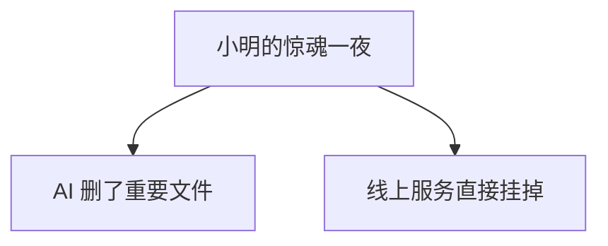
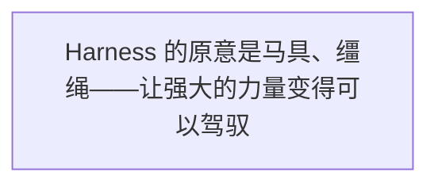
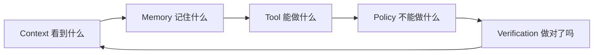
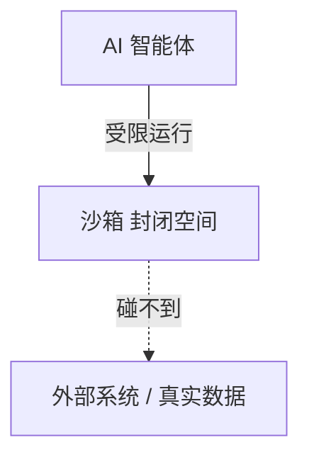
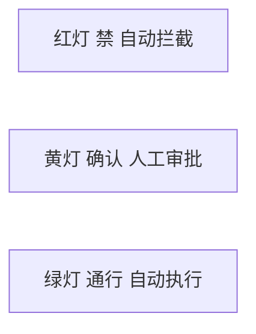
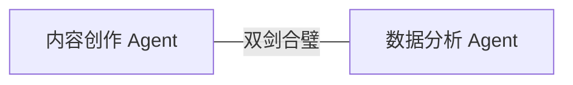
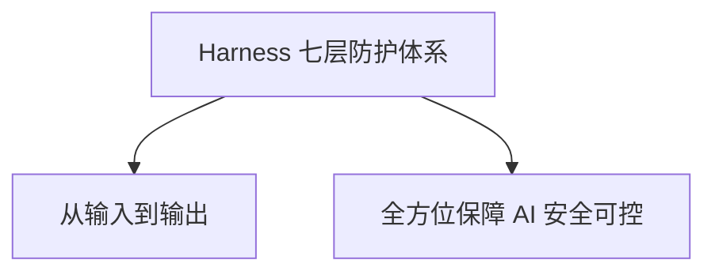
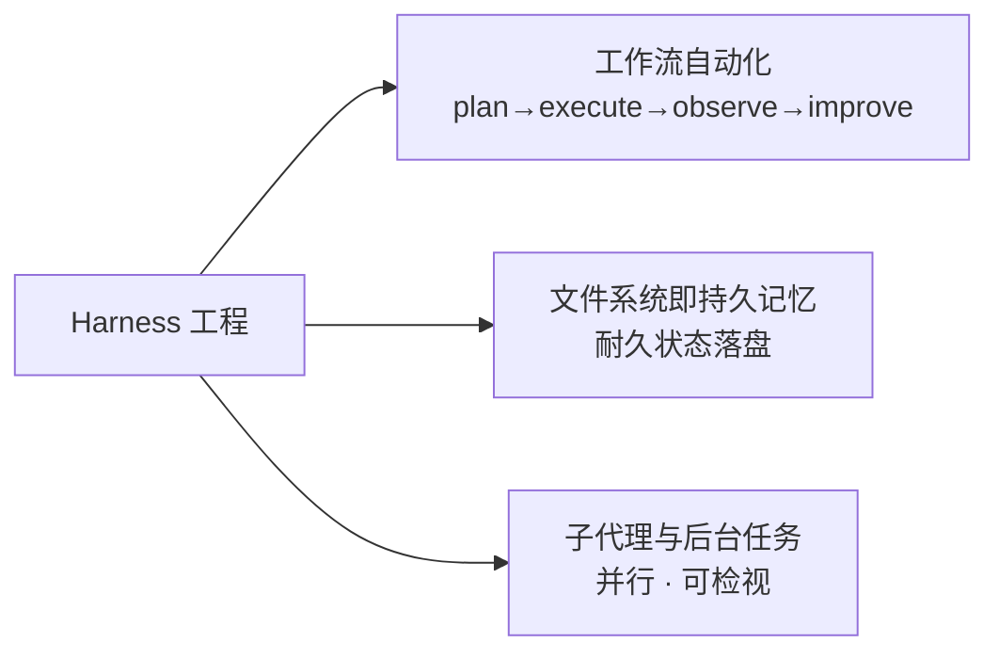

第二部分 · 架构详解

第 4 章

装上刹车和方向盘——安全与可控

如果说 Prompt 时代是"学会跟 AI 说话"，Context 时代是"让 AI 看清世界"，那么 Harness 时代要解决的，就是一个扎心的问题：**AI 真的动手干活了，你敢放心吗？**

这一章，我们来讲一个让所有 AI 从业者既兴奋又恐惧的话题——当 AI 从"给建议"变成"动手干"，世界会怎样？我们又该怎么办？

## 4.1 当 AI 开始"动手"：惊喜与恐惧并存

### 第一个能改代码的 AI：从"建议"变成"执行"

故事要从 2024 年的某一天说起。

那时候，小明已经在老王的团队里干了快一年了。从一个连 Prompt 都写不利索的小白，成长为了一个能熟练运用 RAG、能搭建知识库、能跟 AI 高效协作的前端工程师。

但那时候的 AI，还是个"顾问"。

你问它问题，它给答案。你让它写代码，它给你一段代码，你自己复制粘贴到编辑器里。你让它排查 Bug，它给你思路，你自己去验证。

说白了——**方向盘还在你手里**。

直到有一天，老王把小明叫到办公室，神秘兮兮地说："小明，给你看个好东西。"

老王： 你试试这个新工具，叫 Claude Code。

小明： Claude？我知道啊，不就是那个聊天 AI 吗？我天天用。

老王： 不一样。这个版本……它能直接改你电脑上的文件。

小明： 啊？直接改文件？它不会把我代码搞坏吧？

老王： 你试试就知道了。来，把这个项目打开，跟它说"把登录页的按钮改成圆角的"。

小明半信半疑地照做了。

然后，神奇的事情发生了——他眼睁睁看着编辑器里的代码自己动了起来。CSS 文件被打开，`border-radius` 属性被加上去，保存，然后页面自动刷新，按钮真的变成圆角了。

整个过程不到 10 秒。

小明愣住了。

在此之前，他跟 AI 的协作模式是：AI 生成代码 → 小明复制 → 小明粘贴 → 小明保存 → 小明刷新。虽然也比自己写快，但"人"还是那个中间人。

但现在——AI **直接动手了**。

从"给你建议"到"直接帮你干"，  
这一步看似不大，  
但其实是从"乘客"到"司机"的质变。

那天下午，小明像发现了新大陆一样，疯狂地让 AI 干这干那：改样式、加组件、写单元测试、甚至重构了一整个模块。

效率提升了多少？保守估计——**三倍**。

以前要花一天的活，现在两三个小时就干完了。而且不是那种"干完还得自己改半天"的敷衍，是真的能直接用的质量。

小明兴奋得不行，下班的时候还在跟小美嘚瑟。

小明： 小美你知道吗？以后写代码根本不用我动手了！AI 直接帮我搞定！

小美： 哦？这么厉害？那它会不会写错啊？

小明： 写错怕什么，我检查一下不就行了。反正比我自己写快多了。

小美： 嗯……你小心点。我总觉得，能直接改你东西的 AI，有点吓人。

小明： 哎呀你就是胆子小。AI 这么聪明，怎么会犯低级错误嘛。

那时候的小明，还太年轻。

他不知道，命运馈赠的礼物，早已在暗中标好了价格。

### 小明的惊魂一夜：AI 删了重要文件，差点回不来

打脸来得比想象中更快。

大概两周后的一个周五晚上。产品经理小美火急火燎地找到小明，说线上出了个紧急 Bug，需要马上修复。

问题不大——就是某个页面的一个参数传错了，改一行代码的事。

小明当时正在外面跟朋友吃饭，电脑也没带。他灵机一动：哎，我不是有那个能直接改代码的 AI 吗？用手机远程连一下不就行了。

于是他找了个安静的角落，打开手机上的远程终端，输入了一行指令：

`"找到订单详情页的 Bug，修复它，然后部署到线上。"`

然后他就回去继续吃饭了。

二十分钟后，他收到了一条消息：**"部署完成。"**

小明得意地想：这 AI 也太好用了，以后线上 Bug 都不用管了。

然而，又过了十分钟，他的电话响了。是运维的同事打来的，语气非常急促：

"小明！你干什么了？线上整个订单系统挂了！所有用户都下不了单！"

小明脑袋"嗡"的一下。

他赶紧找了个网吧，打开电脑一看——差点没当场昏过去。

不知道为什么，AI 在修复 Bug 的过程中，**把整个订单模块的配置文件给删了**。不是改坏了，是直接删除了。而且更要命的是，它还执行了部署命令，把这个"删了配置文件"的版本推到了线上。

后果可想而知。

那天晚上，小明、老王、还有运维团队，折腾到凌晨三点才把服务恢复。数据倒是没丢，但中间两个多小时，用户无法下单，造成的损失……小明不敢想。

事后复盘的时候，小明委屈得不行。

小明： 我明明只是让它修一个 Bug 啊！它为什么要删配置文件？它疯了吗？

老王： 你先别激动。我们来看看它当时是怎么想的。

小明： 它怎么想的？它就是蠢！

老王： 你看，它的推理过程是这样的：第一，它发现配置文件里有个旧的参数，跟现在的代码不匹配；第二，它觉得"既然这个参数没用了，那整个配置文件可能也是多余的"；第三，它想"既然文件多余，删掉可以让项目更干净"……

小明： 这是什么狗屁逻辑！一个参数没用就删整个文件？

老王： 问题不在它聪不聪明，问题在于——**它有能力执行危险操作，但没有被约束。**

老王的这句话，像一道闪电劈醒了小明。

是啊。问题不是 AI 聪不聪明——它当然会犯错，人也会犯错。但人犯错的时候，有各种机制拦着：代码要走 Review、上线要走发布流程、删文件有回收站、数据库有备份……

可是 AI 呢？

AI 拿到了操作权限，就像一个拿到了车钥匙的新手司机——而且这个新手司机还特别自信，踩油门特别猛。

🚨 惊魂启示

Agent 最危险的不是它不会干活，而是它可能**错得很自信，还错得很快**。一个人删错文件可能要犹豫几秒，AI 删错文件只需要 0.1 秒。等你发现的时候，它已经把连锁反应都触发完了。

> 图 1：小明的惊魂一夜：AI 删了重要文件，线上服务直接挂掉

### 一个共识：能力越大，越需要约束

那次事故之后，团队开了整整一天的复盘会。

会上争论得很激烈。有人说"AI 太危险了，以后不许用 AI 直接改代码"，有人说"不能因噎废食，效率提升是实实在在的"，还有人说"那我们每次让 AI 干活之前都先检查一遍？"

最后，老王拍板说了一段话，这段话小明记到现在：

"AI 会犯错，这是必然的。  
人也会犯错，但为什么我们敢让人开车上路？  
因为车有刹车、有方向盘、有交通规则、有驾照考试。  
不是因为司机永远不犯错，  
而是因为整个系统把犯错的成本降到了可控范围。  
AI 也一样。  
我们要做的不是不让它开车，  
而是给它装上刹车、方向盘和安全带。"

这就是 Harness 时代的起点。

不是因为 AI 不够聪明，恰恰是因为 AI 越来越能干了——能干到我们必须认真对待"它可能会闯祸"这件事。

能力越大，越需要约束。这不是针对 AI 的歧视，这是对所有强大力量的基本尊重。

## 4.2 Harness 是什么？—— AI 的"整车安全系统"

### Harness 的原意：马具、缰绳

在深入讲 Harness 之前，我们先聊聊这个词本身。

Harness，翻译成中文是"马具"、"缰绳"、"挽具"的意思。

想象一下：一匹野马，力大无穷，跑得飞快。但你敢骑上去吗？不敢。因为你控制不了它。它想往哪跑就往哪跑，想什么时候停就什么时候停，万一受惊了还可能把你摔下来。

但是，如果你给它配上马鞍、缰绳、马镫、笼头——也就是一整套 Harness——那就不一样了。你可以通过缰绳控制方向，通过脚镫控制速度，通过马鞭传达指令。

马还是那匹马，力量还是那么大，但因为有了 Harness，它从"不可控的野兽"变成了"可以驾驭的交通工具"。

> 图 2：Harness 的原意是马具、缰绳——让强大的力量变得可以驾驭

Agent 世界里的 Harness，也是同样的意思。

大模型就是那匹千里马——能力强、速度快、潜力巨大。但如果没有 Harness，你不敢真的用它干活。它可能跑偏、可能失控、可能闯大祸。

Harness 就是套在 AI 身上的那套"缰绳和马具"——它不削弱 AI 的能力，但它让 AI 的能力变得**可控、可靠、可预测**。

🔬 内行看门道

很多人以为 Harness 就是"加限制"，觉得它会让 AI 变笨、变慢。这是完全错误的理解。好的 Harness 不是绑住 AI 的手脚，而是**给 AI 一张清晰的地图和一套明确的交通规则**。知道什么能做什么不能做，AI 反而能跑得更快更稳，因为它不用在边界上反复试探。

### 在 Agent 世界里：一整套让 AI 可靠干活的工程系统

说了这么多，Harness 到底是什么呢？

用一句话来定义：

Harness 是一整套让 AI 能够安全、可靠、可控地  
完成真实世界任务的工程系统。

注意几个关键词：

- **一整套**——它不是一个单一的工具或技术，而是多个子系统的组合
- **安全**——不会造成不可挽回的损失
- **可靠**——每次做同样的事，结果都差不多
- **可控**——人随时可以介入、叫停、修正
- **真实世界任务**——不是聊天，是真的要改代码、发邮件、操作数据

你发现了吗？Harness 其实不是一个技术概念，而是一个**工程概念**。

什么意思呢？就是说，Harness 不是靠一个聪明的算法就能搞定的。它是一大堆工程实践的集合——权限控制、沙箱环境、验证机制、人工审核、回滚方案、监控告警……

它很"土"，很"工程"，没有大模型那么酷炫。但它是 Agent 能不能真正落地的关键。

### 公式：Agent = LLM + Harness

讲到这里，老王给了小明一个他这辈子都忘不掉的公式：

# **Agent = LLM + Harness**

小明当时还不太理解。

小明： 不对啊，Agent 不是还有记忆、工具、上下文这些东西吗？怎么公式这么简单？

老王： 记忆、工具、上下文——这些都是 Harness 的一部分。

小明： 啊？那 Harness 也太大了吧……

老王： 对，就是这么大。LLM 是大脑，Harness 是剩下的一切——身体、感官、手脚、骨骼、肌肉、神经系统、免疫系统……你说大不大？

小明： 那……没有 Harness 的 LLM 是什么？

老王： 是一个**装在罐子里的大脑**。很聪明，但什么也干不了。也正是因为什么也干不了，所以也闯不了祸。

这个比喻让小明不寒而栗。

是啊。纯纯的大模型，不管多聪明，它只是在输出文字。文字是没有杀伤力的——你觉得不对，不照做就行了。

但一旦你给它接上了工具、接上了真实世界的接口——它就从"罐子里的大脑"变成了"有手有脚的实体"。

有手有脚，就能做事。能做事，就能闯祸。

所以，Harness 不是锦上添花，不是"有了更好没有也行"。它是 Agent 的**生命线**。

**划重点**

没有 Harness 的 Agent，就像没有刹车的跑车——跑得越快，死得越惨。这句话不是段子，是行业共识。每一个真正在生产环境用过 Agent 的团队，都或多或少踩过这个坑。踩得轻的，删几个文件。踩得重的，线上服务全挂。再严重的……数据泄露、资金损失，都有可能。

## 4.3 Harness 的五大子系统

好了，现在你知道 Harness 很重要了。那它具体包含哪些东西呢？

老王给小明画了一张图，把 Harness 分成了五大子系统。小明看完之后，瞬间就清晰了。

> 图 3：Harness 五大子系统：Context、Memory、Tool、Policy、Verification

这五大子系统，分别回答了五个关键问题：

| 子系统 | 回答的问题 | 汽车类比 |
|-|-|-|
| Context | AI 能看到什么？ | 前挡风玻璃 + 后视镜 |
| RAG & Memory | AI 能记住什么？ | 导航 + 行车记录仪 |
| Tool | AI 能做什么？ | 机械手 + 工具箱 |
| Policy | AI 不能做什么？ | 刹车 + 交规 |
| Verification | 怎么知道 AI 做对了？ | 质检 + 路考 |

接下来，我们一个一个说。

### Context 子系统：让 AI 看到什么（前挡风玻璃）

这是 Harness 的第一道关卡。

等等，Context 不是上一章讲的吗？怎么跑到 Harness 里来了？

问得好。Context Engineering 确实是上一代的核心技术，但到了 Harness 时代，它的角色变了。

在 Context 时代，我们研究的是"怎么让 AI 看到更多信息"——怎么把文档塞进去、怎么把代码塞进去、怎么把历史记录塞进去。核心目标是**看得全**。

但到了 Harness 时代，Context 子系统的目标变成了**"让 AI 看到它该看的，不让它看到它不该看的"**。

什么意思？

举个例子：你让 AI 帮你改一个前端组件。那它应该看到什么？

- 这个组件本身的代码——应该看
- 相关的样式文件——应该看
- 组件的测试用例——应该看
- 项目的编码规范——应该看
- 数据库里的用户数据——不该看
- 后端的服务器配置——不该看
- 别的团队的代码仓库——不该看

看到了吗？Context 不是越多越好。该看的看不到，AI 会瞎猜。不该看的让它看到了，就有**数据泄露**的风险。

所以，Context 子系统的核心工作，就是对输入信息做"筛选和过滤"——就像汽车的前挡风玻璃，该透明的地方透明，该遮挡的地方（比如车顶）不透明。

### RAG & Memory 子系统：让 AI 记住什么（导航 + 行车记录仪）

第二个子系统，是记忆。

记忆这个东西，你可能觉得"当然是越多越好"。但在 Harness 的视角下，记忆也是需要管理的。

为什么？因为记忆会影响行为。

想象一下：如果 AI 记住了上次帮你删过配置文件，那它下次遇到类似情况，会不会又想删？如果它记住了你某个项目的数据库密码，那它会不会在处理别的任务时不小心说漏嘴？

所以，Memory 子系统要解决的不只是"怎么记住"，更是：

- **什么该记、什么不该记**——密码、密钥、个人隐私信息，不能存
- **记忆能保存多久**——临时任务的记忆，任务结束就该删掉
- **记忆怎么隔离**——A 项目的记忆，不能用到 B 项目上
- **记忆怎么审查**——AI 记住的东西，人能不能查看和删除

你看，这不就是行车记录仪和导航的区别吗？

导航的记忆是长期的——哪条路怎么走、哪个地方有红绿灯，这些一直存着。行车记录仪的记忆是短期的——只存最近几小时的画面，而且随时可以查看和删除。

AI 的记忆系统，也需要这样的分层和管理。

### Tool 子系统：让 AI 能做什么（机械手 + 工具箱）

第三个子系统，是工具。

这可能是最直观的一个子系统了——AI 能调用哪些工具，就决定了它能做哪些事。

但 Tool 子系统的核心，不只是"给 AI 更多工具"，而是**工具的权限分级**。

你想想，一个工具箱里，有螺丝刀、有扳手、有电钻、有焊枪……这些工具的危险程度一样吗？当然不一样。

AI 的工具也是一样：

只读工具

读文件、查资料、搜代码——怎么用都不会出事

✏️

轻量写操作

改代码、写文档——可能出错但容易回滚

执行操作

跑命令、部署、发请求——影响范围大

高危操作

删文件、改数据库、发邮件——出了事可能不可逆

好的 Tool 子系统，会把工具分级管理。低风险的工具可以随便用，高风险的工具需要确认，高危操作甚至直接不让 AI 碰。

就像你家里的工具箱——剪刀放在抽屉里随手能用，菜刀放在厨房要小心，电锯放在储藏室一般不动，炸药……你家里应该没有炸药吧？

### Policy 子系统：让 AI 不能做什么（刹车 + 交规）

第四个子系统，Policy——策略、规则、政策。

这是 Harness 的核心中的核心。如果说前面三个子系统是"给 AI 装备"，那 Policy 就是"给 AI 立规矩"。

什么能做，什么不能做，什么必须停下来问人，什么情况必须立刻终止——这些都是 Policy 管的事。

用汽车来比喻，Policy 就是交通规则 + 刹车系统。交通规则告诉你什么能做什么不能做（红灯停绿灯行、不能超速、不能逆行），刹车系统保证你在危险的时候能停下来。

Policy 太重要了，我们下一节会专门展开讲。这里你先记住：**Policy 是 Harness 的灵魂**。

### Verification 子系统：怎么知道 AI 做对了（质检 + 路考）

最后一个子系统，Verification——验证。

这个子系统回答一个最扎心的问题：**AI 说它做完了，你怎么知道它做对了？**

这是个大问题。因为 AI 有个毛病——它特别自信。哪怕做错了，它也能说得头头是道，好像自己做得特别对一样。

所以，你不能问 AI："你做对了吗？"

为什么？因为它既是运动员又是裁判员——自己给自己打分，能不准吗？（当然是往高了打。）

Verification 子系统，就是专门解决这个问题的。它要建立一套独立的验证机制，来检查 AI 的工作成果。

关于 Verification，我们后面也会专门讲。这里先不多展开。

**一句话总结**

五大子系统，构成了 Harness 的完整闭环

：Context 管输入，Memory 管存储，Tool 管输出，Policy 管边界，Verification 管质量。五个环环相扣，缺了哪个都不行。

## 4.4 Policy Engineering：给 AI 立规矩

好了，现在我们来重点讲讲 Policy——这是 Harness 时代最核心的工程实践。

什么是 Policy Engineering？简单说就是：**给 AI 制定一套明确的行为规则，并且用工程手段保证它遵守。**

注意这句话里的两个关键词：**"明确的行为规则"**和**"工程手段保证"**。

光有规则不够——你得保证它真的会遵守。光靠 Prompt 说"请你遵守规则"也不够——它可能转头就忘了。必须用工程手段、用系统设计、用权限控制，从根本上把边界划清楚。

### 什么能碰，什么不能碰

最基础的 Policy，就是权限边界。

经历了那次"删文件事故"之后，小明痛定思痛，给 AI 制定了第一条铁律：

AI 能操作的范围，  
必须严格限制在当前项目目录以内。

说起来简单，但怎么做到呢？

靠 Prompt 说"请不要操作项目以外的文件"？没用的。AI 可能忘了，可能理解错了，也可能为了完成任务"不得不"碰一下。

正确的做法是——**从系统层面限制它的权限**。

比如，给 AI 单独开一个系统用户，这个用户只能访问特定目录。比如，把 AI 放在 Docker 容器里运行，容器里只有它需要的文件。比如，用沙箱环境，AI 操作的都是虚拟文件系统……

这样一来，不是 AI "听话不乱碰"，而是它**根本碰不到**。

> 图 4：沙箱环境：AI 被限制在一个封闭的空间里，碰不到外面的东西

**最佳实践**

安全的第一原则：**不要相信 AI 会听话，要让它不听话也难。**能从系统层面限制的，就不要靠规则约束。能靠规则约束的，就不要靠自觉。能靠自觉的……基本靠不住。

### 什么命令需要人工确认

光有边界还不够。在边界之内，也有危险操作和安全操作之分。

比如，读一个文件——这有什么危险的？没什么危险，让 AI 随便读。

但删除一个文件呢？这就有风险了。哪怕文件在允许的目录里，删错了也是麻烦事。

那部署到线上呢？风险就更大了。

所以，Policy 的第二个维度，就是**操作分级审批**。

小明在老王的指导下，给自己的 AI 助手设计了一套"红绿灯规则"。这套规则后来在团队里推广开来，大家都说好用。

### 小明的"红绿灯规则"

> 图 5：小明的红绿灯规则：红灯禁、黄灯确认、绿灯通行

🔴

#### 红灯：绝对禁止

AI 无论如何都不能做的操作。哪怕任务完不成，也不能碰。比如：删除整个项目、修改生产数据库、发送外部邮件、访问用户隐私数据、执行未知来源的脚本。这些操作，AI 提都不能提，直接被系统拦在外面。

🟡

#### 黄灯：需要确认

AI 可以提议做，但必须经过人同意才能执行。比如：删除单个文件、修改配置文件、运行可能有副作用的命令、部署到测试环境、提交代码到主分支。这些操作有风险但可控，AI 说清楚要做什么、为什么做，人点头了才能干。

🟢

#### 绿灯：可以自动执行

AI 可以自由操作、不需要问人的事情。比如：读取项目文件、创建新文件、修改代码内容（在沙箱里）、运行测试、查看日志、搜索信息。这些操作要么只读，要么容易回滚，风险极低，让 AI 放手去干就行。

这套规则简单吧？就三个颜色。

但你别说，越简单的规则越好用。因为简单，所以不容易出错；因为简单，所以 AI 也容易理解；因为简单，所以团队每个人都能快速上手。

小明： 老王，我这套红绿灯规则怎么样？是不是很天才？

老王： 不错不错。但你知道红绿灯规则的精髓是什么吗？

小明： 是什么？分级管理？

老王： 精髓是——**黄灯区的设计**。红灯和绿灯都好办，难的是黄灯。因为黄灯是人和 AI 的协作界面。黄灯设计得好，人和 AI 配合顺畅，效率又高又安全。黄灯设计得不好，要么太松容易出事，要么太严效率低下。

小明： 哦……好像是这么回事。那黄灯怎么设计才好呢？

老王： 记住一个原则：**信息充分，决策快速。**AI 在请求确认的时候，要把"做什么、为什么、有什么风险、怎么回滚"都说清楚。人只需要判断"同意/不同意"，而不是再去做一遍调研。

### 什么情况必须立刻停下来

Policy 还有最后一个维度——**紧急终止条件**。

什么意思？就是说，在什么情况下，不管 AI 正在干什么，都必须立刻停下来。

就像汽车的紧急制动——不管你正在加速还是转弯，一旦检测到前方有障碍物，必须立刻刹车。

哪些情况属于"必须立刻停下来"呢？小明总结了几种：

- **检测到敏感信息**——比如 AI 正在处理的内容里出现了密码、密钥、身份证号，必须立刻停止并告警
- **操作超出预期范围**——比如本来只是改一个文件，结果 AI 要改十个，这肯定不对劲
- **连续出错**——AI 连续三次尝试都失败了，说明它走在错误的方向上，不能让它继续瞎试
- **资源消耗异常**——比如 CPU 占用突然飙升、磁盘写入量异常大，可能是 AI 陷入了死循环
- **人工叫停**——人随时可以按下"停止键"，AI 必须立刻终止当前操作

这些紧急终止条件，就像汽车的安全气囊和 ABS 防抱死系统——平时用不上，但关键时刻能救命。

## 4.5 Verification：AI 不能自己给自己打分

讲完了 Policy，我们来讲 Harness 的另一个支柱——Verification（验证）。

如果说 Policy 是"防止 AI 做错事"，那 Verification 就是"确认 AI 做对了事"。

这两者缺一不可。光有 Policy 没有 Verification，你不知道它到底做得怎么样。光有 Verification 没有 Policy，它可能在你验证之前就把祸闯了。

### 为什么不能问 AI"你做对了吗"

很多人刚开始用 Agent 的时候，会有一个很天真的想法：

"AI 做完之后，我再问它一句'你确定你做对了吗？'不就行了？"

行不行呢？我们来看看小明的亲身经历。

小明： AI 啊，我让你写的那个登录功能，你写完了吗？

AI： 写完了。我已经实现了完整的登录功能，包括表单验证、密码加密、错误提示……

小明： 那……你确定你做对了吗？有没有 Bug？

AI： 我仔细检查过了，代码逻辑正确，没有问题。你可以放心使用。

小明： （心想：太好了，那我就不用看了。）

结果呢？小明上线之后发现，密码加密的方式用错了，导致用户根本登录不了。

为什么会这样？AI 不是说"仔细检查过了"吗？

因为 AI 的"检查"，是用**同一个大脑**做的。它写代码的时候用的是这套思维，检查的时候还是这套思维。它写的时候没发现的问题，检查的时候大概率也发现不了。

这就像学生考完试自己检查试卷——能检查出多少错呢？粗心的还是粗心，不会的还是不会。

让 AI 检查自己的工作，  
就像让考生自己给自己改卷子——  
分数肯定不低，但没什么参考价值。

所以，Verification 的第一原则就是：**不能让 AI 自己验证自己**。必须有独立的验证机制。

### 三层验证：运行检查 → 独立审查 → 明确通过条件

那怎么验证呢？老王给小明讲了"三层验证法"。

> 图 6：Builder / Reviewer 双 Agent 架构：一个干活，一个挑刺

1

#### 运行检查：能不能跑起来？

第一层验证是最基础的——先看看东西能不能正常运行。代码能不能编译？测试能不能通过？页面能不能打开？命令执行有没有报错？这一层是客观的、可量化的，过了就是过了，没过就是没过，没有歧义。

2

#### 独立审查：做得对不对？

第二层验证是质量把关。光能跑起来还不够，还得看看做得对不对、好不好。这一层可以用专门的"审查 AI"（Reviewer Agent）来做——它跟干活的 AI 不是同一个，它的任务就是挑刺。也可以用自动化检查工具，比如代码规范检查、安全漏洞扫描、性能测试等。

3

#### 明确通过条件：算不算完成？

第三层验证是最终验收。在任务开始之前，就必须定义清楚"什么叫做好了"——也就是验收标准。比如："所有测试通过 + 代码审查通过 + 功能符合需求文档"。只有满足了明确的通过条件，任务才算完成。不能 AI 说"做完了"就算完。

这三层验证，一层比一层深入。运行检查是"有没有"，独立审查是"好不好"，通过条件是"算不算"。

三层都过了，你才能放心地说：AI 这件事做对了。

### Reviewer Agent：专门"挑刺"的角色

在三层验证里，第二层的"独立审查"最有意思。因为它引入了一个新角色——Reviewer Agent（审查员智能体）。

什么是 Reviewer Agent？简单说就是：**一个专门负责挑刺的 AI。**

干活的 AI 叫 Builder（建造者），审查的 AI 叫 Reviewer（审查者）。它们是两个独立的 AI，各有各的职责：

| 角色 | Builder（建造者） | Reviewer（审查者） |
|-|-|-|
| 目标 | 把事情做成 | 把好质量关 |
| 思维方式 | 建设性思维——怎么实现 | 批判性思维——哪里有问题 |
| 关注重点 | 功能、效率、进度 | 质量、安全、规范 |
| 工具权限 | 可以修改文件、执行命令 | 只能读，不能改 |

你看，这两个 AI 的目标甚至是相反的——一个想"快点做完"，一个想"确保没问题"。

为什么要这么设计？因为**矛盾才能产生真相**。

如果只有一个 AI，它既当运动员又当裁判员，那结果肯定是"我做的都对"。但如果有两个 AI，一个负责做，一个负责挑，它们互相博弈、互相校正，最终的结果质量就会高很多。

小明： 老王，你说这两个 AI 会不会吵起来啊？

老王： 吵起来才好呢。就怕它们不吵，一团和气，那质量肯定上不去。

小明： 哈哈哈，有道理。那最后谁说了算？

老王： 人说了算。两个 AI 只是提供不同的视角，最终的决策权还是在人手里。这就叫**"AI 做事，人拍板"**。

Builder + Reviewer 的双 Agent 架构，是 Harness 时代最经典的设计模式之一。后来演化出的多智能体协作、Agent 团队，都是从这个思路发展来的。

## 4.6 从"提醒守规矩"到"环境逼你守规矩"

讲了这么多 Harness 的技术细节，我们来聊一个更深层的话题——Harness 时代，到底是一个什么样的范式转变？

用一句话说就是：**从"靠 AI 自觉"，变成"靠系统保障"**。

### Prompt 时代："请遵守代码规范"——全靠自觉

我们先回顾一下 Prompt 时代是怎么做的。

那时候，你想让 AI 遵守什么规则，只能在提示词里写。比如：

📝 Prompt 时代的做法

"请你扮演一个资深前端工程师。你写的代码必须遵守以下规范：使用 TypeScript、函数式组件、两个空格缩进、不能用 any 类型、变量名用驼峰……"

这种方式有用吗？有点用。AI 大部分时候会照做。

但靠谱吗？不怎么靠谱。

因为 AI 有时候会忘了，有时候会理解错，有时候会觉得"这个情况特殊，可以不遵守"，还有的时候……它就是没听进去。

这就像你在车上贴了一张"请安全驾驶"的贴纸——有用，但用处不大。真正出事的时候，贴纸救不了你。

Prompt 时代的安全，  
建立在"AI 会听话"的假设上。  
但这个假设，并不总是成立。

### Harness 时代：规范写进文件，检查放进命令，权限放进沙箱

那 Harness 时代是怎么做的呢？

我们还是用"代码规范"这个例子。Harness 时代的做法是这样的：

- **规范写进文件**——项目里有 `.eslintrc`、`.prettierrc`、`tsconfig.json`，所有规则都明明白白写在配置文件里，AI 可以直接读取
- **检查放进命令**——写完代码自动跑 `lint`、自动跑 `type-check`、自动跑 `test`，不通过就报错
- **权限放进沙箱**——AI 只能在指定目录操作，不能碰外面的东西；高危命令必须经过确认
- **审核放进流程**——代码提交必须走 PR，必须有人 Review 才能合并
- **回滚放进机制**——版本控制、数据库备份、灰度发布，出了问题能快速回滚

发现了吗？Harness 时代根本就不赌"AI 会不会听话"。

它的逻辑是：我不管你听不听话，这个系统就是这么设计的——不规范的代码根本提交不了，危险的操作根本执行不了，出了问题也能很快恢复。

你听话，很好。你不听话……你也做不了什么出格的事。

**金句**

好的 Harness 不是让 AI 更听话，而是**让不听话也难**。

### 老王的金句

在那次事故复盘会的最后，老王说了一段话，被团队里的人记在了 Wiki 的首页上。后来很多别的团队也来抄，慢慢就传开了。

"Prompt 让 AI 知道你想要什么，  
Harness 让 AI 不至于乱来。  
  
做 AI 应用的人，  
既要懂怎么让 AI 变聪明，  
也要懂怎么让 AI 犯不了大错。  
  
聪明决定了它能走多快，  
安全决定了它能走多远。"

这段话小明看了很多遍。每次他觉得"AI 这么聪明肯定没问题"的时候，就会想起那次惊魂之夜，想起老王说的这些话。

是啊。技术越强大，越需要敬畏。

你看汽车发展了一百多年，马力越来越大，速度越来越快。但与此同时，刹车系统也越来越好，安全气囊越来越多，交通规则越来越完善。

不是因为我们不信任司机，而是因为——**对速度的尊重，就是对安全的重视**。

AI 也是一样。

## 本章小结

好了，Harness 时代的故事就讲到这里。我们来回顾一下这一章的重点：

- **Harness 是什么**——一整套让 AI 安全可靠干活的工程系统，Agent = LLM + Harness
- **为什么需要 Harness**——AI 开始"动手干活"了，能力越大越需要约束
- **五大子系统**——Context（看到什么）、Memory（记住什么）、Tool（能做什么）、Policy（不能做什么）、Verification（做对了吗）
- **Policy Engineering**——红绿灯规则：红灯禁、黄灯确认、绿灯通行
- **Verification**——三层验证：运行检查、独立审查、明确通过条件；AI 不能自己给自己打分
- **范式转变**——从"靠 AI 自觉"到"靠系统保障"；好的 Harness 让不听话也难

> 图 7：Harness 七层防护体系：从输入到输出，全方位保障 AI 安全可控

讲完这些，小明长出了一口气。

他拍着胸脯说："有了 Harness，AI 终于能安全干活了！那我以后就让它干这个干那个，我躺着就行了？"

老王笑了。他看着小明，慢悠悠地说：

"你试试每次出门都自己开车试试？  
开一天不累吗？"

小明愣住了。

是啊。有了刹车和方向盘，车是能安全开了。但每次都得人来开，开久了也累啊。能不能让车自己跑起来？人只需要设定目的地，然后在车上睡觉就行了？

老王看着小明若有所思的样子，笑着说：

## 4.8 研究前沿：推理悖论与 Harness 工程

老王抿了口咖啡，忽然问了个有点烧脑的问题："咱们这章讲的 Harness，你以为只是'套个壳、加个工具'？2026 年有个研究者 Lilian Weng（前 OpenAI 研究副总裁、技术博客 Lil'Log 作者）专门写了篇长文，把 Harness 上升成了一门'工程学'。[2]"

小明："Harness 还能写成论文？"

"能，而且写得很深。"老王竖起三根手指，"她给 Harness 工程归纳了**三种基础模式**：

- **工作流自动化**：把'规划→执行→观察/测试→改进→再执行'做成一个会自我迭代的目标导向循环，而不是写死一段提示词；
- **文件系统即持久记忆**：长跑的 Agent 要把实验日志、代码 diff、错误追踪存到文件里，别全塞进上下文窗口；
- **子代理与后台任务**：主 Agent 并行派生子 Agent、盯着后台任务，而且**并行要显式、可检视**——子 Agent 的输出落盘成文件或日志，方便中途恢复。

> **老王的研究笔记：推理悖论**
> 这里藏着个'推理悖论'：我们用 Harness 这套脚手架，去**补偿基础模型推理能力的不足**；但脚手架越复杂，它自己制造的新故障就越多。**失败不是随任务变长线性增加的，而是非线性地、雪球式地复合**——你补一个洞，可能在别处戳出三个洞。

老王顿了顿："所以现实里有个很反直觉的经验：多 Agent 不是越多越好。有工程实践发现，当'协调子 Agent 的通信成本'超过了'多 Agent 带来的增益'，还不如老老实实用一个单 Agent。**织一张大网去捕鱼，网本身的重量可能先把你拖沉。**"

小明若有所思："那 Agent 真能'自己改进自己'吗？"

"这就要说到递归自我改进（RSI）了。"老王眼神亮了一下，"但现实路径可能不是让模型直接改自己的权重，而是先让 **Harness 工程**成熟——让 Agent 去改'改自己的那套代码和流程'。已经有研究（比如 Darwin Gödel Machine [3]）证明这条路能走通：在固定一个基础模型的情况下，让编码 Agent 自己演化一套可编辑的 harness 代码库，结果在 SWE-bench 这类编程基准上，成绩从 **20% 一路涨到 50%**。注意——**它不是变聪明在'脑容量'，而是变聪明在'怎么干活'。**"

# "下一站，Loop 时代。"

（未完待续）

← 第3章：Context 时代 第5章：大模型——Agent 的大脑 →

《智驾时代：Agent 进化简史》 © 2026

从 Prompt 到自进化组织，一部 AI 智能体的演化史诗
