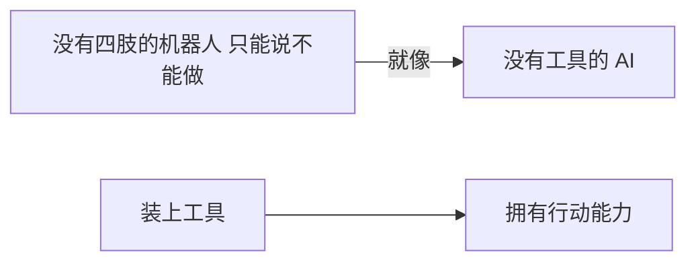
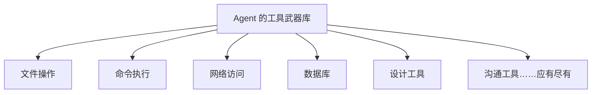
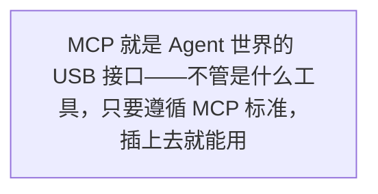
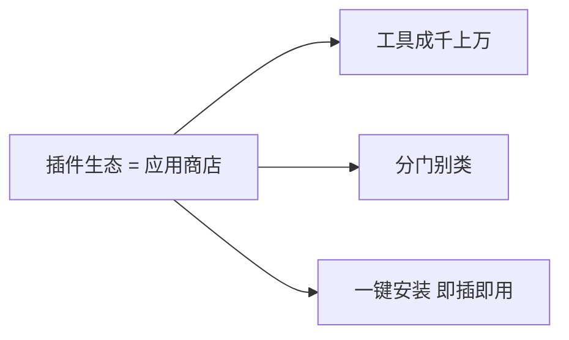
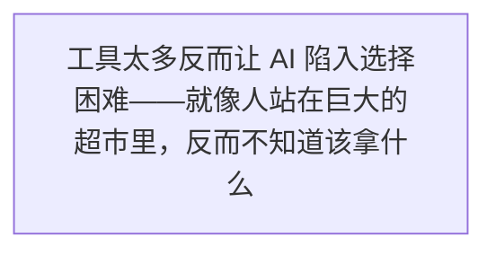
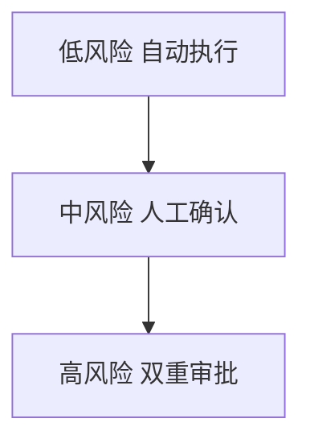

第 8 章

让 Agent 长出"手和脚"

如果说大模型是 Agent 的大脑，上下文是 Agent 的眼睛，那么工具就是 Agent 的手和脚。没有手脚，再聪明的大脑也只能纸上谈兵。

小明最近遇到了一个难题。

事情是这样的：公司要做一个新的内部工具，小美给他提了需求，说要让 AI 能够查询公司的 API 文档，然后自动生成接口调用代码。小明兴冲冲地用大模型搭了一个对话系统，结果一试——根本不行。

为什么？因为 AI 只会"说"，不会"做"。

你问它"用户服务的接口怎么调"，它能给你讲一堆 RESTful API 的理论，告诉你 GET 和 POST 的区别，甚至能写出一段示例代码。但它**不会真的去查**公司的 API 文档系统，不会去读最新的接口定义，更不会帮你把代码写进项目里。

就像一个军师，说起兵法头头是道，但你让他真的上战场打仗——他连刀都拿不动。

小明郁闷了好几天。直到老王端着茶杯走过来，悠悠地说了一句：

老王：

"光有大脑没用，你得给它装上手脚啊。"

小明：

"装手脚？什么意思？"

老王：

"你想想，人为什么能做事？因为有手有脚。手能拿东西、能写字、能操作工具。脚能走路、能去不同的地方。光有一个聪明的脑袋，躺在床上什么也干不了。AI 也是一样的道理。"

小明愣住了。他之前从来没这么想过。在他的认知里，AI 就是一个聊天机器人——你问它问题，它给你答案。至于答案对不对、能不能落地，那是你的事。

老王看他一脸懵逼，继续说道：

老王：

"你现在的 AI，就像一个没有四肢的人——脑子再聪明，也只能躺在床上给你出主意。你要让它真的能做事，就得给它装上工具。有了工具，它才能查资料、改文件、发邮件、跑命令。这才叫 Agent，不然就是个 Chatbot。"

小明恍然大悟。

是啊！他之前一直在琢磨怎么让 AI 更聪明、怎么写更好的提示词，但从来没想过——AI 根本就没有"做事"的能力。它只能输出文字，而文字只是建议，不是行动。

没有工具的 AI 是军师，有了工具的 AI 才是将军——  
军师出主意，将军真动手。

这个比喻一下子击中了小明。他迫不及待地追问：

小明：

"那怎么给 AI 装工具呢？我要写代码吗？怎么写？"

老王：

"别急，这事儿说简单也简单，说复杂也复杂。我们一步一步来。先从最基础的——Function Calling 说起。"

## 8.1 从"只说不做"到"说到做到"

在讲具体的技术之前，老王先给小明讲了一个故事。

说以前有个书生，读书万卷，博学多才。有人问他："你这么有学问，为什么不去建功立业呢？"书生叹了口气说："我也想啊，可是我手无缚鸡之力，连剑都提不起来，怎么上战场？"

早期的 AI 就是这样的书生。

它满腹经纶，上知天文下知地理，你问它什么都能给你讲出个一二三来。但你让它真的去做一件事——比如"帮我查一下昨天的销售数据"——它只会告诉你"你可以打开 Excel 文件，然后筛选昨天的日期，再求和"。

它**告诉你怎么做**，但它**不会自己去做**。

> 图 1：没有工具的 AI 就像没有四肢的机器人，只能"说"不能"做"；装上工具后，才真正拥有了行动能力

### 没有工具的 AI："纸上谈兵"的军师

老王让小明回想一下，平时用 ChatGPT 的时候，是不是这样的：

- 你问"这个 Bug 怎么修"，它给你一段分析和修复思路——但它不会真的打开你的代码去改
- 你问"帮我写封邮件"，它给你一段文字——但它不会真的帮你发出去
- 你问"今天天气怎么样"，它可能会说"我没有实时数据"——因为它不能自己去查
- 你问"这个方案可行吗"，它给你一堆优缺点分析——但它不会真的去跑个测试验证一下

小明连连点头。没错，他平时用 AI 就是这样的。AI 给建议，他来执行。AI 就像一个顾问，说的都对，但活儿还得自己干。

**本质区别**

Chatbot 的输出是**文字**——它只能"告诉你"。Agent 的输出是**行动**——它会"替你做"。这一字之差，就是两个时代的分界线。

### 有了工具的 AI："能征善战"的将军

那如果给 AI 装上工具，会变成什么样呢？

老王给小明描绘了这样一幅画面：

你说"帮我查一下昨天的销售数据"，AI 不会跟你废话，直接打开数据库，执行查询，生成一张报表，然后发到你的邮箱里。整个过程，你只需要说一句话。

你说"这个 Bug 帮我看看"，AI 直接打开代码库，找到报错的地方，分析原因，生成修复方案，跑一遍测试确认没问题，然后给你提交一个 Pull Request。

你说"帮我安排下周的项目评审会"，AI 直接查看所有人的日程，找到一个大家都有空的时间段，发出会议邀请，附上会议议程和相关文档。

看到了吗？这才是真正的"说到做到"。

小明：

"这也太爽了吧！那岂不是以后我只要动动嘴，活儿都让 AI 干了？"

老王：

"想得美。哪有那么简单。给 AI 装工具不是插个 U 盘那么容易的事。这里面有很多学问——用什么工具、怎么用、用错了怎么办、安全怎么保障……一步没做好，就可能出大问题。"

小明：

"啊？这么复杂吗？"

老王：

"你想想，给一个人一把刀，他可以切菜做饭，也可以伤到自己。工具本身没有对错，关键在于谁用、怎么用。AI 用工具也是一样的道理。不过你别怕，我们一步一步来，先从最基础的讲起。"

### 汽车比喻：从"乘客"到"司机"

讲到这里，老王又搬出了他的"智能汽车"比喻。

他说，你可以把没有工具的 AI 想象成一个坐在副驾的人。他能跟你聊天、能给你指路、能提醒你限速，但**方向盘不在他手里**，车还是你在开。

但如果给 AI 装上了工具——就好像它坐到了驾驶座上，手握方向盘，脚踩油门刹车。它不只是"说"往哪儿走，而是**真的在开车**。

这些工具是什么呢？

- 方向盘、油门、刹车——就像文件操作和命令执行的能力
- 导航系统——就像搜索和信息检索的能力
- 车载雷达和摄像头——就像感知外部环境的能力
- 车载通讯系统——就像发送消息和邮件的能力

没有这些，AI 再聪明，也只是个乘客。有了这些，它才能真正成为"司机"。

给 AI 装上工具，就像给汽车装上轮子和机械臂——  
终于能跑了，终于能干活了。

## 8.2 Function Calling：AI 的"第一个工具"

好了，概念讲完了，来点干货。

给 AI 装工具的第一步，也是最基础的技术，叫做 **Function Calling**（函数调用）。

小明一听"函数调用"，头就大了："函数？编程里的那个函数吗？"

老王笑着说："对，就是编程里的那个函数。但你别怕，原理其实很简单。我给你举个例子你就懂了。"

### 什么是 Function Calling？

想象一下这个场景：你跟一个智能助手说，"帮我查一下北京今天的天气。"

如果是普通的 Chatbot，它可能会说："抱歉，我没有实时天气数据。"或者给你编一个——那就更糟糕了。

但如果是支持 Function Calling 的 AI 呢？它的反应是这样的：

"嗯，用户想知道北京今天的天气。我脑子里没有实时数据，但我知道有一个叫 `get_weather` 的函数可以查天气。我需要调用这个函数，参数是城市='北京'，日期='今天'。"

然后它不会直接回答你，而是输出一个"调用指令"——告诉系统："我要调用 `get_weather` 函数，参数是北京、今天。"

系统收到这个指令，真的去调用天气 API，拿到数据，再把结果传回给 AI。AI 拿到真实的天气数据后，再用自然语言回答你："北京今天晴，气温 25 度，适合出行。"

> 图 2：Function Calling 工作原理：用户提问 → AI 判断需要调用工具 → 输出调用指令 → 系统执行函数 → 返回结果 → AI 组织回答

**一句话理解**

Function Calling 就是：AI 不直接回答问题，而是说"等一下，我先查一下"，然后调用一个函数拿到真实数据，再回来回答你。

### 工作原理："我要调用这个函数"

老王拿起笔，在白板上画了一张流程图，给小明仔细讲解。

Function Calling 的完整流程是这样的：

#### 第一步：定义工具

首先，你要告诉 AI："你有这些工具可以用。"每个工具都要有名字、描述和参数说明。比如查天气的工具：

📋 工具定义示例

**函数名：**get_weather  
**描述：**查询指定城市指定日期的天气信息  
**参数：**  
  • city（字符串）：城市名称，如"北京"、"上海"  
  • date（字符串）：查询日期，格式为 YYYY-MM-DD  
**返回：**天气状况、气温、湿度、风力等信息

#### 第二步：AI 判断要不要调用

当用户提问时，AI 会先想一想：这个问题我能不能直接回答？需要调用工具吗？调用哪个工具？参数是什么？

比如用户问"1+1等于几"，AI 直接就回答了，不需要调用工具。但如果用户问"北京今天几度"，AI 知道自己没有实时数据，就需要调用天气工具。

#### 第三步：输出调用指令

如果 AI 决定要调用工具，它不会输出文字回答，而是输出一段结构化的调用指令，大概长这样：

🤖 AI 输出

`{ "name": "get_weather", "arguments": { "city": "北京", "date": "2026-06-30" } }`

#### 第四步：系统执行函数

你的程序收到这个调用指令后，真的去执行对应的函数——调用天气 API、查数据库、读文件，等等。然后把执行结果返回给 AI。

#### 第五步：AI 组织回答

AI 拿到函数返回的真实数据后，用自然语言整理成通顺的回答，反馈给用户。

小明听完，眼睛亮了："原来这么简单啊！就是 AI 说要调用什么函数，程序去执行，再把结果给 AI。"

老王点点头："原理是简单，但里面的门道可不少。比如——AI 怎么知道什么时候该调用哪个工具？这就考验工具描述写得好不好了。还有，如果 AI 调用错了怎么办？参数传错了怎么办？这些都是要考虑的问题。"

### 最基础的三件套：搜索、计算、查天气

刚开始学 Function Calling 的时候，大家通常会从三个最基础的工具入手——被称为"入门三件套"：

搜索工具

让 AI 能搜索网页，获取最新信息，不再胡说八道

🧮

计算工具

让 AI 能做精确计算，不再出现 1+1=3 的低级错误

🌤️

天气工具

让 AI 能查实时天气，掌握真实世界的数据

为什么是这三个？因为它们完美展示了 Function Calling 的价值：

- **搜索**解决了"知识过时"的问题——AI 的训练数据有截止日期，但搜索可以拿到最新信息
- **计算**解决了"数学不好"的问题——大模型其实不擅长精确计算，但调用计算器就不会错了
- **天气**解决了"没有实时数据"的问题——AI 不知道现在外面多少度，但天气 API 知道

🔬 内行看门道

你发现了吗？Function Calling 的本质是——**把 AI 不擅长的事，交给专业的工具去做**。AI 负责"思考和判断"，工具负责"执行和计算"。这是一种分工合作，而不是让 AI 什么都自己来。

### 小明的第一个工具：查公司 API 文档

讲完理论，老王决定带小明动手实践一下。

"来，我们给你的 AI 装第一个工具——查询公司内部 API 文档的工具。"

小明兴奋极了。这正是他之前想做但做不到的事情。

老王带着他，一步一步来：

第一步，先写一个函数。这个函数接收一个接口名称，去公司的 API 文档系统里查，返回接口的详细信息——包括请求方式、参数列表、返回格式、示例代码等等。

第二步，把这个函数的信息告诉 AI。包括函数叫什么名字、是干什么的、接收什么参数、每个参数是什么意思。

第三步，写一段中间逻辑——当 AI 输出调用指令时，你的程序要能解析这个指令，去执行对应的函数，然后把结果塞回对话里，再让 AI 继续回答。

说起来简单，做起来小明还是踩了不少坑。比如一开始工具描述写得太模糊，AI 老是不知道什么时候该调用；比如参数类型没定义清楚，AI 经常传错格式。

折腾了一个下午，终于跑通了。

当小明输入"用户服务的登录接口怎么调？"，AI 没有直接瞎编，而是输出了一个调用指令，然后程序真的去查了 API 文档，返回了真实的接口信息，AI 再基于这些信息给出了准确的回答和示例代码。

那一刻，小明的心情——就像看着自己的孩子第一次学会走路一样。

小明：

"太神奇了！它真的去查了！不是瞎编的！是真的从文档系统里查出来的！"

老王：

"瞧你那没见过世面的样子。这才哪到哪？这只是一个工具而已。等你工具装多了，你才知道什么叫真正的厉害。"

## 8.3 工具的"武器库"

如果说 Function Calling 是给 AI 装了一只手，那各种各样的工具就是这只手上能拿的不同武器。

刀可以切菜，锤子可以钉钉子，扳手可以拧螺丝……不同的工具有不同的用途。给 AI 配的工具越多，它能做的事情就越多。

老王给小明展示了一个"工具武器库"的全景图。看完之后，小明的嘴就没合上过。

> 图 3：Agent 的工具武器库：文件操作、命令执行、网络访问、数据库、设计工具、沟通工具……应有尽有

### 第一类：文件操作——"翻箱倒柜"的能力

这是最基础也最重要的一类工具。如果 AI 连文件都不能读不能写，那它能干的事情就太有限了。

读取文件

查看文件内容，读代码、读文档、读配置

✏️

写入文件

创建新文件、保存生成的内容

修改文件

编辑已有文件、替换内容、插入代码

🗑️

删除文件

移除不需要的文件（高风险！）

📂

浏览目录

查看文件夹结构、列出文件列表

搜索文件

按名称或内容查找文件

你别小看这些文件操作。有了它们，AI 就能真正"进入"你的项目，读代码、改 Bug、写功能、重构……几乎所有开发工作都离不开文件操作。

小明插嘴："但是让 AI 随便改我的代码，不会出问题吗？"

老王点点头："问得好。这就是为什么后面要讲 Harness 和权限控制。文件操作，尤其是删除和修改，是高风险操作。但你不能因噎废食——关键是怎么管，而不是不让用。"

### 第二类：命令执行——"跑起来"的能力

如果说文件操作是"动手"，那命令执行就是"动脚"——让 AI 能真正跑起来。

🧪

运行测试

执行单元测试、集成测试，验证代码是否正确

🔨

构建项目

编译、打包、生成构建产物

部署发布

部署到测试环境、生产环境

📦

安装依赖

npm install、pip install 之类

代码检查

跑 Lint、做静态分析、检查代码规范

📊

数据分析

跑脚本、处理数据、生成报表

命令执行的能力让 AI 从"写代码的"变成了"能干活的"。写完代码跑一下测试，测试过了就部署上去——整个流程 AI 都能自己来。

**高风险提醒**

命令执行是**最高风险**的工具类别之一。一个 `rm -rf /` 就能把你整个系统删光。所以生产环境中，命令执行一定要有严格的沙箱隔离和人工确认机制。

### 第三类：网络访问——"看世界"的能力

联网能力让 AI 不再是"井底之蛙"。它能搜索最新信息、调用第三方 API、抓取网页数据……

🌐

网页搜索

Google、Bing 搜索，获取最新信息

📄

网页抓取

读取网页内容、提取信息

🔌

API 调用

调用各种第三方服务的 API

📥

下载文件

从网络下载资源和文件

有了网络访问能力，AI 的知识就不再受限于训练数据的截止日期。它能查到今天的新闻、最新的技术文档、实时的股票价格……

### 第四类：数据库——"挖数据"的能力

对于企业来说，数据库工具可能是最有价值的一类。让 AI 能直接查数据库、做分析、生成报表——这比雇十个数据分析师还划算。

数据查询

写 SQL、查数据、做统计

📊

数据分析

趋势分析、对比分析、漏斗分析

📈

生成报表

自动生成日报、周报、月报

✏️

数据操作

插入、更新、删除数据（高风险！）

想象一下，你只要说一句"帮我看看上个月的销售情况，跟大上个月对比一下，生成一份报表发给我"，AI 就自动查数据库、做分析、生成图表、发邮件——这效率提升何止十倍。

### 第五类：设计工具——"搞创作"的能力

不只是写代码和查数据，AI 还能做设计。

🎨

Figma 读取

读取设计稿、提取样式、生成代码

🖼️

图片生成

调用 DALL·E、Midjourney 生成图片

✂️

图片处理

裁剪、压缩、格式转换

现在的 AI 已经能做到"设计稿一键转代码"了——读取 Figma 设计，直接生成前端页面。虽然还达不到 100% 准确，但 80% 的基础工作能帮你搞定。

### 第六类：沟通工具——"传消息"的能力

最后一类，也是最容易被忽略的一类——沟通工具。让 AI 能替你发消息、发邮件、约会议……

📧

发送邮件

写邮件、发邮件、跟进回复

即时通讯

发微信、飞书、Slack 消息

📅

日程管理

创建会议、查看日程、预约时间

📋

任务管理

创建任务、分配负责人、更新状态

这类工具看似不起眼，但实际上能帮你节省大量的沟通时间。比如让 AI 帮你约个会——它会自动查看所有人的日程，找到空闲时间，发出邀请，甚至附上会议议程。

工具就像武器库——  
你给 AI 配什么样的装备，  
它就能打什么样的仗。

## 8.4 MCP：工具的"通用插座"

讲完了工具的种类，老王话锋一转，问了小明一个问题：

老王：

"我问你，如果我有 10 个工具，每个工具都要写一遍接入代码，告诉 AI 这个工具叫什么、参数是什么、怎么调用——你觉得麻烦吗？"

小明：

"10 个还好吧，写 10 次而已。"

老王：

"那如果是 100 个工具呢？1000 个呢？而且这些工具要在不同的 AI 产品里都能用——ChatGPT 里要用，Claude 里要用，你们自己的系统里也要用——难道每个产品都重新接一遍？"

小明：

"这……确实太麻烦了。那怎么办呢？"

老王笑了笑，说："这就是 MCP 要解决的问题。"

### 为什么需要 MCP？

在讲 MCP 是什么之前，老王先给小明讲了个历史故事。

很久以前，电脑上的外设接口是不统一的。打印机有打印机的接口，键盘有键盘的接口，鼠标有鼠标的接口，U盘有U盘的接口……每个设备都要有自己专门的接口和驱动程序。买个新设备，你得先装半天驱动，还不一定能用。

后来，USB 出现了。

USB 是什么？通用串行总线——说白了就是一个**统一的接口标准**。不管你是鼠标、键盘、U盘、打印机、移动硬盘……只要你支持 USB 标准，插上去就能用。不用装驱动（大部分时候），不用配置，即插即用。

MCP 就是 Agent 世界的 USB。

> 图 4：MCP 就是 Agent 世界的 USB 接口——不管是什么工具，只要遵循 MCP 标准，插上去就能用

### MCP 的核心理念：一次接入，到处可用

MCP 的全称是 Model Context Protocol（模型上下文协议）。它是由 Anthropic 提出的一个开放协议，目的是建立一个统一的工具接入标准。

核心理念很简单：**一次接入，到处可用。**

什么意思呢？就是说——

- 工具开发者：你只要按照 MCP 的标准写一个 MCP Server，你的工具就能在所有支持 MCP 的 AI 产品里用
- AI 产品方：你只要支持 MCP 协议，就能接入所有遵循 MCP 标准的工具，不用一个个去对接

**核心价值**

以前是"每个工具接 N 个平台，每个平台接 M 个工具"，总工作量是 N×M。有了 MCP 之后，总工作量变成了 N+M。这就是标准化的力量。

### MCP Server vs MCP Client：谁提供工具，谁使用工具

小明听得津津有味，但有个概念他有点晕："MCP Server 和 MCP Client 是什么关系？"

老王给他画了一张图：

MCP Client  
使用工具的一方

⟷

MCP Server  
提供工具的一方

⟷

实际工具  
数据库/API/文件

通过统一的 MCP 协议通信

**MCP Server**是提供工具的一方。比如，你想让 AI 能查你们公司的数据库，你就写一个 MCP Server，在里面定义好"查数据"这个工具。Server 负责真正去连数据库、执行查询、返回结果。

**MCP Client**是使用工具的一方。比如 Claude Code、ChatGPT、你们自己的 AI 产品——它们都是 MCP Client。Client 说"我要用查数据的工具，参数是 xxx"，Server 就去执行，然后把结果返回给 Client。

双方通过 MCP 协议通信——就像 USB 设备和电脑通过 USB 协议通信一样。两边只要遵循同一个协议，就能互相理解。

小明：

"哦！我懂了！MCP Server 就像一个带 USB 插头的设备，MCP Client 就像电脑上的 USB 接口。只要插头标准一样，不管什么设备，插上去就能用。"

老王：

"没错！就是这个意思。你这个比喻很到位。以前每个设备都要有专门的接口，现在有了 USB，统一了。MCP 也是一样——以前每个工具都要专门写接入代码，现在有了 MCP，统一了。"

MCP 是 Agent 世界的 USB 接口——  
一次接入，到处可用。

### MCP 不只是工具

讲到这里，老王补充了一句："不过你要知道，MCP 不只是用来接工具的。它的全称是 Model Context Protocol，核心是'上下文'。工具只是其中一种能力。"

小明又懵了："那还有什么？"

老王说："MCP 定义了三类核心能力："

- **Tools（工具）**：让 AI 能调用函数、执行操作——这是最常用的
- **Resources（资源）**：让 AI 能读取外部数据，比如文件、文档、网页内容
- **Prompts（提示模板）**：让 AI 能使用预设的提示词模板，快速完成特定任务

"所以准确地说，MCP 是 AI 和外部世界之间的一个通用接口标准。工具、数据、提示模板——都可以通过 MCP 来提供。"

小明点点头。他感觉自己又打开了一扇新的大门。

**本章金句**

MCP 的伟大之处不在于技术有多复杂，而在于它做了一件"正确的事"——建立标准。就像 USB、HTTP、TCP/IP 一样，一个好的标准能释放整个生态的创造力。

## 8.5 插件生态：工具的"应用商店"

有了统一的标准，接下来会发生什么？

老王给小明抛出了这个问题。小明想了想，说："会有越来越多的人做工具？"

"没错。"老王说，"当工具的接入成本趋近于零的时候，工具的数量就会爆炸式增长。于是就出现了——插件生态。"

### 从自己写工具到用别人的工具

老王说，工具的发展有三个阶段：

#### 第一阶段：自己写，自己用

就像小明刚才做的那样——需要什么工具，自己写一个。好处是完全可控，坏处是效率低，什么都得自己来。

#### 第二阶段：用别人写的工具

有人写了通用的工具，打包成插件，你拿来就能用。比如查天气的插件、搜 Google 的插件、读 PDF 的插件……不用自己写，装上就能用。

#### 第三阶段：形成生态

当工具足够多、用户足够多的时候，就形成了生态——有专门做工具的开发者，有分发工具的平台，有付费模式，有评价体系……就像手机的 App Store 一样。

> 图 5：插件生态就像应用商店——成千上万的工具，分门别类，一键安装，即插即用

### 各家的插件平台

老王给小明简单盘点了一下目前主流的插件平台：

#### ChatGPT Plugins

OpenAI 的插件生态，也是最早火起来的。ChatGPT 有一个插件商店，里面有几百个插件——订机票的、点外卖的、查股票的、算数学的……应有尽有。用户在 ChatGPT 里启用插件，AI 就能自动调用。

#### Claude Code MCP Plugins

Anthropic 走的是 MCP 路线。因为 MCP 是开放标准，任何人都可以开发 MCP Server，然后在 Claude Code 里配置使用。相比 ChatGPT 的封闭生态，MCP 更开放、更灵活。

#### 其他平台

还有很多其他的插件平台，比如 Gemini 的 Extensions、Microsoft Copilot 的 Plugins、国内的文心一言插件、通义千问插件……各家都在搭建自己的生态。

**趋势观察**

目前的插件生态有点像早年的手机应用市场——各家各搞各的，互不兼容。但长期来看，走向开放和统一是必然趋势。MCP 这样的开放标准，很可能成为未来的主流。

### 怎么选工具：安全第一，够用就好

讲到这里，小明已经摩拳擦掌了："那我赶紧去装它几十个插件！"

老王一把拉住他："别急别急。工具不是越多越好。这里面有讲究的。"

老王给了小明三条选工具的原则：

#### 原则一：安全第一

装插件之前，先想清楚：这个工具要访问什么数据？有什么权限？会不会把你的数据上传到第三方服务器？

比如一个"读文件"的插件——它能读你电脑上的所有文件吗？还是只能读指定目录的？如果它把你的机密文件偷偷传到别人的服务器上怎么办？

**安全警示**

安装不明来源的插件，就像安装不明来源的手机 App 一样危险。一定要从官方渠道安装，一定要看清楚权限要求。

#### 原则二：够用就好

别什么工具都装。你真正用得上的可能就那么三五个。装多了反而有副作用。

#### 原则三：来源可靠

优先选择官方或知名开发者出品的插件。那种名字花里胡哨、下载量很低、评价很少的，尽量别碰。

### 小明的踩坑：装了 20 个插件，结果 AI 傻了

小明嘴上答应着，心里却不以为然。趁老王不注意，他偷偷给自己的 AI 装了二十多个插件——什么查天气的、算数学的、搜新闻的、读 PDF 的、翻译的、生成图片的……

结果呢？

结果 AI 变傻了。

> 图 6：工具太多反而让 AI 陷入选择困难——就像人站在巨大的超市里，反而不知道该拿什么

怎么个傻法？小明问了一句"今天天气怎么样"，按理说应该调用天气插件对吧？结果 AI 先调用了搜索插件去搜"今天天气"，搜出来的结果不满意，又调用了另一个天气插件，然后又去搜了一下新闻……绕了一大圈，才给出答案。

还有一次，小明让它"帮我看看这个 PDF 里讲了什么"，结果 AI 一会儿调用 PDF 读取插件，一会儿调用翻译插件，一会儿又调用摘要工具……折腾了半天，效率还不如直接读。

更夸张的是，有一次小明问了一个简单的数学题，AI 居然调用了三个不同的计算插件，然后把三个结果对比了半天，才给出答案。

小明郁闷了。为什么工具多了，反而更慢更笨了？

老王：

"哈哈，被我说中了吧。我就知道你会犯这个错。"

小明：

"为什么呀？工具多了不是应该更厉害吗？怎么反而变笨了？"

老王：

"我问你，如果你面前摆着一百把不同的刀，让你切菜——你会不会先犹豫半天选哪一把？"

小明：

"呃……会吧。"

老王：

"这不就对了。AI 也是一样的。工具太多，它每次做决策的时候都要想：我该用哪个工具？用 A 还是用 B？还是两个都用？选择越多，决策成本越高。这就叫'选择 paralysis（瘫痪）'。"

工具不是越多越好，  
就像你不会把整个工具箱都揣在兜里出门。

小明恍然大悟。原来"多"不等于"好"。合适的才是最好的。

后来他把插件精简到了 5 个——搜索、文件读取、代码执行、数据库查询、发送邮件——都是平时最常用的。结果呢？AI 反而变得更聪明、更快、更准确了。

## 8.6 工具使用的"心法"

经过这件事，小明对工具有了更深的理解。但老王说，这还不够。要真正用好工具，还得掌握几条"心法"。

### 心法一：工具不是越多越好

这是第一条，也是最重要的一条。刚才小明已经用血泪教训验证过了。

老王给了一个经验数据：对于大多数场景，**5-10 个工具是最佳数量**。太少了不够用，太多了 AI 会混乱。

就像一个工匠，常用的工具就那么几件——锤子、螺丝刀、扳手、尺子。够用就行。真遇到特殊情况，再找特殊工具。

**实践建议**

定期清理你的工具列表。如果一个工具连续一个月都没被 AI 调用过，就删掉它。工具也要"断舍离"。

### 心法二：工具描述要清晰

第二条心法是：工具的描述一定要写清楚。

这是什么意思呢？AI 怎么知道什么时候该用哪个工具？靠的就是你给工具写的描述。描述写得好，AI 就能准确判断什么时候该调用。描述写得模糊，AI 就会乱用或者不用。

老王给小明举了个反面例子和正面例子：

**反面教材**

**工具名：**search  
**描述：**搜索信息

这个描述太模糊了。搜索什么信息？什么时候用？AI 根本搞不清楚。

**正面教材**

**工具名：**web_search  
**描述：**通过搜索引擎查询互联网上的最新信息。当用户的问题涉及实时数据、最新新闻、技术文档、产品信息等 AI 知识库中可能没有的内容时，使用此工具。  
**参数：**  
  • query（字符串，必填）：搜索关键词，要具体明确  
  • num_results（整数，可选）：返回结果数量，默认 5

这个描述就很清晰——AI 一看就知道什么时候该用、怎么用、参数怎么填。

小明连连点头。他想起自己第一次写工具的时候，描述就写得特别简单，结果 AI 老是搞错。原来是这个原因。

### 心法三：工具权限要分级

第三条心法，也是老王最强调的一条——工具权限一定要分级。

"什么叫分级？"小明问。

老王说："不是所有工具的风险等级都一样的。读一个文件的风险，和删一个文件的风险，能一样吗？跑一个测试的风险，和执行部署的风险，能一样吗？"

小明摇摇头："肯定不一样啊。"

"那当然不一样。所以我们要给工具分权限等级——不同等级的工具，有不同的使用规则。"

> 图 7：工具权限分级管理：从低风险到高风险，逐级增加人工确认和安全管控

老王给小明展示了一个四级权限体系：

L1

#### 低风险：只读操作

比如读文件、查数据、搜网页、看日程……这些操作不会改变任何东西，看看而已。AI 可以自动使用，不需要确认。

L2

#### 中风险：轻度写入

比如创建新文件、修改非关键配置、生成报表……这些操作会写入数据，但影响不大，可以撤回。AI 可以自动使用，但最好有日志记录。

L3

#### 高风险：关键操作

比如修改核心代码、删除文件、执行部署、发送正式邮件……这些操作影响较大，出错了会有损失。AI 必须先征求人类同意，确认后才能执行。

L4

#### 极高风险：不可逆操作

比如删除数据库、操作银行账户、发布生产环境、签署合同……这些操作一旦执行，后果严重且不可逆。绝对不能让 AI 自动执行，必须由人类手动操作。

**安全红线**

**L4 级别的操作，永远不要交给 AI 自动执行。**不管 AI 有多聪明、你有多信任它，涉及到钱、涉及到不可逆操作、涉及到重大决策的，一定要人来拍板。

### 老王的金句

讲完三条心法，老王总结了一句让小明记一辈子的话：

工具就像刀，  
切菜是它，伤人也是它。  
关键看谁用、怎么用。

小明反复品味着这句话。是啊，工具本身没有善恶，也没有对错。刀可以用来切菜做饭，也可以用来伤人。问题不在刀，而在用刀的人。

AI 工具也是一样的。搜索工具可以用来查资料，也可以用来搜隐私。文件操作可以用来改 Bug，也可以用来删库跑路。发邮件可以用来沟通工作，也可以用来发垃圾邮件。

关键不在于工具有多强大，而在于使用工具的规则有多完善。

### 本章小结

这一章讲了很多内容，老王帮小明梳理了一下：

- **工具是 AI 的手脚**——没有工具，AI 只能"说"不能"做"；有了工具，才能真正做事
- **Function Calling**——AI 调用函数的基础机制，让 AI 从"直接回答"变成"先查再答"
- **工具有六大类**——文件操作、命令执行、网络访问、数据库、设计工具、沟通工具
- **MCP 是通用标准**——就像 USB 接口，一次接入，到处可用
- **插件生态正在形成**——从自己写工具到用别人的工具，就像 App Store 一样
- **用好工具有三条心法**——数量要适度、描述要清晰、权限要分级

小明感觉自己收获满满。从一个只知道"AI 能聊天"的小白，到现在理解了工具、Function Calling、MCP、插件生态……他感觉自己离真正的 Agent 越来越近了。

他兴奋地对老王说：

小明：

"有了这么多工具，Agent 简直无所不能啊！"

老王听了，端起茶杯，冷冷地看了他一眼，说：

老王：

"无所不能？那你敢让它随便操作你的银行账户吗？"

小明一下子愣住了。

是啊……工具越强大，风险也越大。如果没有约束、没有控制、没有安全机制，那工具越厉害，出的事也越大。

就像一辆没有刹车的跑车——跑得越快，死得越惨。

那怎么给 Agent 装"刹车"呢？怎么确保它安全可靠地工作呢？怎么设定它的行为边界呢？

老王看着小明若有所思的样子，笑了笑：

老王：

"想知道答案？下一章，我们深入 Harness 的完整设计。"

**下一站：Harness 系统——给 Agent 装上刹车和方向盘。**

系好安全带，我们继续前进。

← 第7章：上下文工程 第9章：Harness 完整设计 →

《智驾时代：Agent 进化简史》 © 2026

从 Prompt 到自进化组织，一部 AI 智能体的演化史诗
