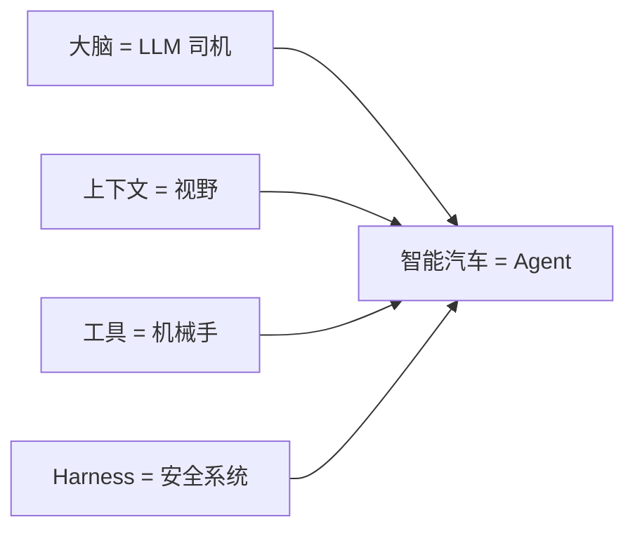
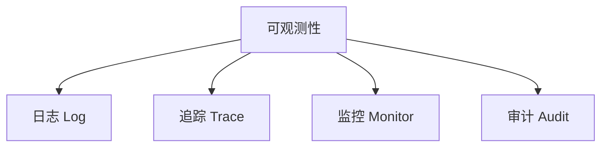
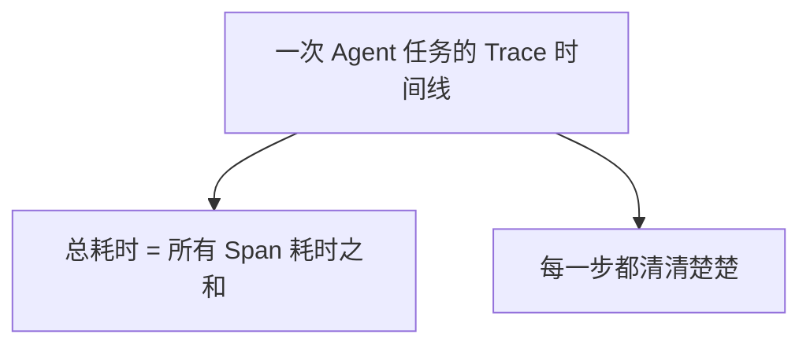
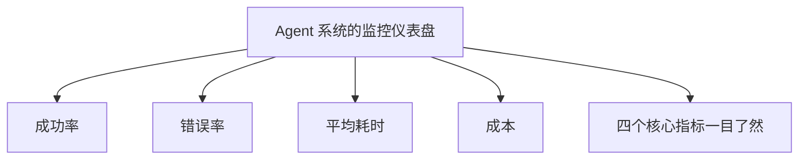
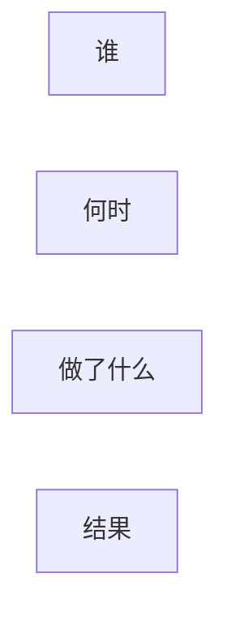
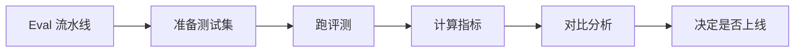
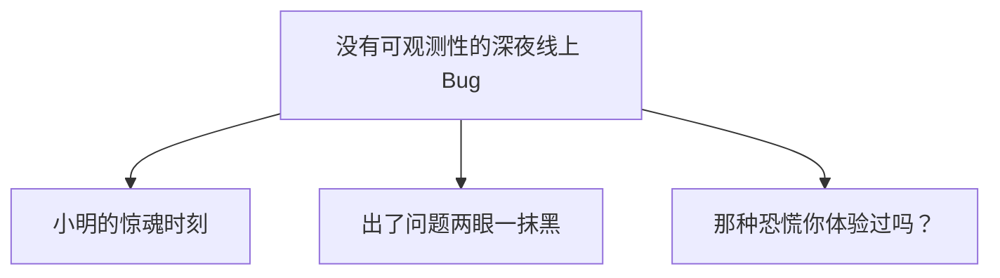

第 11 章

行车记录仪与黑匣子

凌晨两点，小明的手机突然响了。

是运维组的小张打来的，声音里带着明显的慌乱："明哥，不好了！线上的客服 Agent 出问题了，有用户反映说 AI 给了错误的退款建议，把客户惹毛了，现在正在投诉！"

小明一个激灵从床上弹起来，睡意全无。他打开电脑，连上 VPN，开始排查问题。

然而，他很快就陷入了一片茫然。

用户说 AI 给了错误建议——但 AI 到底说了什么？为什么会那么说？是 Prompt 写错了？还是 RAG 检索到了错误的文档？还是模型本身抽风了？又或者……根本就是用户自己操作错了？

小明翻了半天日志，只看到一行简单的记录："[2026-06-29 23:47:12] 用户 138\*\*\*\*5678 发起对话，Agent 已响应。"

没了。就这么一行。

用户问了什么？不知道。AI 回答了什么？不知道。中间调用了哪些工具？不知道。花了多少 Token？不知道。是哪个版本的 Prompt？还是不知道。

小明盯着屏幕，感觉自己像个交警——出了车祸，没有行车记录仪，没有监控，没有目击者。只有两辆车撞在一起，双方各执一词。

他长长地叹了口气，拿起手机给老王发了条消息："王哥，睡了吗？出事了……"

五分钟后，老王的电话打了过来。听完小明的描述，老王只说了一句话：

没有可观测性的 Agent 系统，就像闭着眼睛开车——  
你不知道自己在哪，也不知道什么时候会撞。

第二天早上，顶着黑眼圈的小明和老王坐在会议室里，面前的白板上写着四个大字：**可观测性。**

"小明，你知道为什么飞机要有黑匣子吗？"老王开门见山。

"因为万一出了事故，可以通过黑匣子的数据来调查原因。"小明揉了揉眼睛。

"没错。那你知道为什么汽车要装行车记录仪吗？"

"也是为了出了事故能定责……"小明忽然反应过来，"王哥，你的意思是，Agent 系统也需要'黑匣子'和'行车记录仪'？"

老王点点头，在白板上画了一辆车，然后在车顶上画了一个摄像头，又在车底画了一个方盒子。

> 图 1：Agent 系统就像一辆智能汽车：仪表盘告诉你现在怎么样，黑匣子记录下所有发生过的事

## 11.1 为什么可观测性这么重要？

### AI 是"黑盒子"，但系统不能是

"首先我们要搞清楚一个概念。"老王在白板上写了两个词：**黑盒**和**黑箱**。

"很多人搞混了这两个概念。他们说'AI 是黑盒子，所以 Agent 系统也是黑箱'——这是完全错误的。"

小明一脸困惑："这俩……不是一个意思吗？"

"当然不是。"老王摇摇头，"AI 模型本身确实是个黑盒子——你给它一个输入，它给你一个输出，但你很难说清楚它内部到底是怎么想的、为什么得出了这个结论。这叫**模型的不可解释性**。"

"但是——"老王话锋一转，"AI 是黑盒子，不代表你的系统也得是黑箱子。"

AI 可以是黑盒子，但系统不能是黑盒子。  
你可以不知道它怎么想的，但必须知道它做了什么。

老王举了个例子："就像人的大脑。你可能永远搞不懂一个人为什么会爱上另一个人——大脑的决策机制太复杂了。但你一定知道他做了什么——他送了花、约了会、表了白。这些行为是可观测的。"

"Agent 也是一样。你可能永远搞不懂大模型为什么会生成那句话——它内部的注意力机制、权重计算，复杂到没人能完全说清。但你**必须**知道它说了什么、调用了什么工具、改了什么文件、花了多少钱。这些系统行为是完全可以、也必须被记录下来的。"

小明恍然大悟："所以问题不是'AI 为什么这么想'，而是'AI 到底做了什么'——而后者是完全可控的。"

"完全正确。"老王一指白板，"这就是可观测性要解决的核心问题：**让 Agent 系统的每一个行为都有迹可循。**"

### 没有可观测性的三个后果

"那如果没有可观测性，会怎么样？"小明问。

"会出三种问题。"老王伸出三根手指。

😱

出了问题查不出

就像昨天晚上那样，用户投诉了，你根本不知道发生了什么，更别说定位和修复了

💰

花了多少钱算不清

大模型调用是按 Token 计费的，没有监控，月底账单出来你可能会吓一跳

📉

效果好坏凭感觉

"感觉 AI 变聪明了""好像没以前好用了"——凭感觉做决策，永远做不好

小明深以为然。昨天晚上那种"两眼一抹黑"的感觉，他这辈子都不想再体验了。

"那……可观测性具体包括哪些东西？"小明问。

老王笑了笑，在白板上画了三根柱子："可观测性有三大支柱——**日志、追踪、监控**。再加上审计和评估，就是一套完整的可观测体系了。"

> 图 2：可观测性三大支柱：日志（发生了什么）、追踪（怎么发生的）、监控（现在怎么样）

## 11.2 日志：Agent 的"行车记录仪"

### 记录什么？四类核心信息

"先说日志。日志就像行车记录仪——它记录了系统中发生的每一件事。"老王在白板上画了一个摄像头的图标。

"那 Agent 的日志应该记些什么呢？"小明掏出了笔记本。

"四类核心信息，一个都不能少。"老王掰着手指头数：

**输入（Input）**：用户说了什么、给了什么指令、上传了什么文件。这是一切的起点。

**输出（Output）**：AI 回复了什么、生成了什么内容、返回了什么结果。这是用户看到的东西。

**工具调用（Tool Calls）**：Agent 调用了哪些工具、参数是什么、返回了什么结果。这是 Agent"做事"的痕迹。

**错误（Errors）**：哪里出错了、错误信息是什么、堆栈跟踪是什么。这是排查问题的关键。

"就这四类？"小明觉得好像少了点什么。

"当然不止，还有一些辅助信息也很重要。"老王补充道：

- **时间戳**：精确到毫秒，知道每件事发生的时间
- **会话 ID**：同一次对话的所有日志能串起来
- **用户 ID**：是谁在跟 Agent 交互
- **模型版本**：用的是哪个模型、哪个版本的 Prompt
- **Token 用量**：输入多少 Token、输出多少 Token

**小明的笔记**

日志不是越多越好，但关键信息一个都不能少。记住一句话：**出问题的时候，你最想知道什么，就记什么。**

### 怎么记？结构化日志 vs 纯文本

"那日志应该写成什么样？就用 console.log 打印吗？"小明问。

老王摇摇头："如果你只是自己写着玩，console.log 没问题。但如果是生产系统，必须用**结构化日志**。"

"啥叫结构化日志？"

"就是用 JSON 格式来写日志，每条日志都是一个结构化的对象，而不是一段纯文本。"老王在白板上写了个例子：

📝 结构化日志示例

{  
  "timestamp": "2026-06-30T10:23:45.123Z",  
  "session_id": "sess_abc123",  
  "user_id": "user_xyz789",  
  "event": "tool_call",  
  "tool_name": "search_database",  
  "tool_params": {"query": "退款政策", "limit": 5},  
  "duration_ms": 234,  
  "status": "success",  
  "model": "gpt-4o",  
  "tokens": {"input": 450, "output": 120}  
}

"为什么要这么麻烦？"小明皱了皱眉头。

"因为方便查询啊。"老王说，"如果是纯文本日志，你想查'昨天调用 search_database 工具花了超过 500 毫秒的请求有多少个'——基本不可能。但如果是结构化的 JSON 日志，你只需要写一条查询语句，几秒钟就出结果了。"

"打个比方，纯文本日志就像把所有东西都扔进一个黑箱子里，找东西全靠翻。结构化日志就像给每件东西都贴了标签、分了类，想找什么一搜就到。"

### 日志级别：不是所有东西都要记

"那是不是所有信息都要记下来？"小明又问，"会不会太占空间了？"

"好问题。"老王点点头，"日志当然不是越多越好。什么都记，一来存储成本高，二来查询起来也慢。所以我们有**日志级别**这个概念。"

| 级别 | 用途 | 生产环境 | 举例 |
|-|-|-|-|
| ERROR | 错误信息 | 必须开 | 工具调用失败、模型报错 |
| WARN | 警告信息 | 建议开 | 重试了两次才成功、响应超时 |
| INFO | 关键操作 | 建议开 | 用户请求、工具调用、任务完成 |
| DEBUG | 调试信息 | 一般关闭 | 中间步骤、详细参数 |
| TRACE | 最细粒度 | 绝对关闭 | 每一步计算、每次网络请求 |

"一般来说，生产环境开到 INFO 级别就够了——错误、警告、关键操作都记下来。DEBUG 和 TRACE 只有在排查问题的时候才临时打开。"老王解释道。

### 注意隐私：不能什么都记

"最后，也是非常重要的一点——"老王的语气忽然严肃起来，"**日志里不能包含敏感信息。**"

"敏感信息？比如什么？"

"身份证号、手机号、银行卡号、密码、医疗记录……这些都是敏感信息。你不能把用户的手机号明文写在日志里，更不能把用户上传的身份证照片存到日志系统里。"

**隐私红线**

记录日志的时候，一定要对敏感信息做**脱敏处理**。比如手机号只保留前三位和后四位，中间用星号代替：138\*\*\*\*5678。这不仅是职业道德，更是法律要求——《个人信息保护法》了解一下。

小明吓出一身冷汗："我们现在的日志……好像没做脱敏……"

老王拍了拍他的肩膀："所以今天这节课，你上得值。赶紧回去补上。"

## 11.3 追踪：每一步花了多少时间和钱

### Trace：一次任务的完整链路

"日志解决的是'发生了什么'的问题。那如果我想知道'这件事是怎么一步步发生的、每一步花了多长时间'——光靠日志就不够了。"老王接着说。

"这时候就需要**追踪（Tracing）**了。"

"追踪？"小明不太明白。

"想象一下，你用导航 App 规划了一条从家到公司的路线。导航会告诉你：全程 15 公里，预计 30 分钟。其中——"

- 小区道路：2 公里，5 分钟
- 城市主干道：5 公里，10 分钟
- 高架路：6 公里，8 分钟
- 停车场：2 公里，7 分钟

"这就是追踪。"老王说，"它把一次完整的旅程（Trace）拆成了好几段（Span），每一段的耗时、距离、路况都清清楚楚。"

"放到 Agent 系统里，一次用户请求就是一个 Trace，中间的每一步操作就是一个 Span。"

> 图 3：一次 Agent 任务的 Trace 时间线：总耗时 = 所有 Span 耗时之和，每一步都清清楚楚

### Span：每一步操作的耗时和消耗

"那一个 Agent 请求，一般会有哪些 Span 呢？"小明问。

老王掰着手指头数：

**接收请求**：用户发来了消息，系统开始处理

**上下文组装**：从 RAG 检索相关文档，组装 Prompt

**LLM 调用**：调用大模型生成回复

**工具调用**：如果需要调用工具，执行工具函数

**结果处理**：把结果格式化，返回给用户

"每一个 Span 都要记录什么？"

"三件事：**花了多久**、**花了多少钱**、**成功还是失败**。"老王说，"耗时用毫秒表示，成本用 Token 或者钱表示，状态用 success/error 表示。"

🔬 内行看门道

在分布式追踪领域，有一个标准叫 OpenTelemetry（简称 OTel）。它定义了 Trace 和 Span 的标准格式，各种语言和框架都支持。如果你的团队要做可观测性，直接上 OTel 就对了，别自己造轮子。

### Token 统计：每轮花了多少钱

"说到钱——"小明眼睛一亮，"我一直很好奇，这个 Token 到底怎么算钱的？"

"这个问题问得好。"老王笑了，"很多人做 Agent 系统，一开始只关心效果好不好，完全不关心成本。结果月底账单一出来，直接傻眼。"

"大模型的计费方式一般是按 Token 算的，输入和输出分开计费。输入便宜，输出贵。比如 GPT-4o，输入可能是 5 美元一百万 Token，输出就是 15 美元一百万 Token。"

"那……一个 Agent 任务大概要花多少钱？"小明问。

"这就不好说了，取决于任务复杂度。"老王想了想，"简单的问答，可能几厘钱。复杂的任务——比如让 Agent 帮你写一个完整的功能，中间要查文档、要写代码、要跑测试、要反复修改——可能一次任务就花掉几美元甚至几十美元。"

"这么贵？！"小明惊呆了。

"所以 Token 统计非常重要。"老王严肃地说，"你得知道每一轮对话花了多少 Token、每个任务花了多少钱、每天总共花了多少。不然等你发现的时候，可能已经花了一套房的首付了——当然我说的是夸张了点，但账单超支是真的会发生的。"

 LLM 推理 · 25%

 工具调用 · 60%

 等待/其他 · 15%

### 小明的优化：60% 的时间花在等工具

说干就干。小明花了两天时间，给他们的客服 Agent 加上了追踪系统。

数据出来的那一刻，小明震惊了。

他一直以为 Agent 慢是因为大模型推理慢——毕竟大模型要生成那么多字，肯定要花时间嘛。结果数据显示，**LLM 推理只占总耗时的 25%，而工具调用占了 60%！**

"王哥，你看这个数据……"小明把追踪面板给老王看，"我们的 Agent 大部分时间不是在'思考'，而是在'等工具返回结果'。"

老王瞟了一眼，一点都不意外："很正常。很多人以为 Agent 的瓶颈在大模型，其实大部分生产系统的瓶颈都在工具调用上——数据库查询慢、第三方 API 响应慢、网络延迟……这些才是真正拖慢速度的元凶。"

"那怎么办？"

"对症下药啊。"老王说，"既然工具调用慢，那就优化工具。数据库加索引、API 加缓存、能并行的就并行调用——这不就是你们后端工程师的老本行吗？"

小明一拍脑袋："对啊！我怎么没想到！我一直在想怎么让大模型更快，结果问题根本不在大模型身上！"

没有追踪数据的优化，就像闭着眼睛开车——  
你以为自己在加速，其实可能在踩刹车。

后来，小明给几个最慢的工具加了缓存，又把几个可以并行的工具调用改成了并发执行。总耗时直接下降了 40%。而这一切，都始于那一套追踪系统。

## 11.4 监控：仪表盘上的"健康指标"

### 从"事后排查"到"实时感知"

"日志和追踪，都是'事后'看的——出了问题，去查日志，去看 Trace。"老王接着说，"但如果我们想**实时知道**系统现在怎么样呢？"

"那就需要监控了。"小明抢答。

"没错。"老王赞许地点点头，"监控就像汽车的仪表盘——车速多少、转速多少、油量多少、水温多少、有没有故障灯亮……你扫一眼就知道车的状态。"

> 图 4：Agent 系统的监控仪表盘：成功率、错误率、平均耗时、成本——四个核心指标一目了然

### 四个核心健康指标

"Agent 系统的监控，重点看四个指标。"老王伸出四根手指。

成功率

96.8%

有多少任务能成功完成。这是最核心的指标——成功率低了，什么都白搭。

错误率

3.2%

有多少任务出了错。错误率一定要分类型统计——是模型报错？工具报错？还是用户输入问题？

平均耗时

8.5s

一个任务平均要多久。用户的耐心是有限的，太慢了会流失。

日成本

\$234

每天花了多少钱。成本监控一定要实时，别等月底才发现超支了。

"这四个指标，就像汽车的速度表、转速表、油表、水温表——缺一不可。"老王说。

### 告警：出问题了及时通知人

"光有仪表盘还不够。"小明说，"你总不能让人 24 小时盯着仪表盘看吧？"

"说得对。所以我们需要**告警**。"老王在白板上画了个铃铛，"当指标异常的时候，系统自动通知人——发短信、打电话、发飞书消息，怎么都行，但一定要及时。"

"那怎么定义'异常'呢？"

"设阈值啊。比如——"

- 错误率超过 5%，触发警告
- 错误率超过 10%，触发严重告警
- 平均耗时超过 15 秒，触发警告
- 单日成本超过预算 120%，触发警告
- 连续 5 分钟没有任何请求，可能是服务挂了

**告警疲劳**

告警不是越多越好。如果一天几十条告警，大家就会麻木——"狼来了"说多了，真的狼来了反而没人信。告警一定要精准，只在真正需要人介入的时候才发。好的告警系统，一个月可能只响几次，但每次响都是真的有问题。

小明深以为然。他想起以前做后端的时候，有个项目的告警特别多，一天能收到上百条。到后来大家都把告警通知静音了，结果有一次真出了大问题，愣是过了半小时才有人发现。

## 11.5 审计：出了问题谁负责

### 审计日志：比普通日志更严格

"聊完了日志、追踪、监控——这三个是技术层面的可观测性。"老王话锋一转，"接下来我们聊聊更严肃的话题：**审计**。"

"审计？和日志有什么区别？"小明有点懵。

"好问题。很多人觉得审计就是日志，其实不是一回事。"老王摇摇头，"日志是给工程师排查问题用的，审计是给法务、合规、管理层用的。目的不一样，要求也不一样。"

> 图 5：审计日志：谁、什么时候、让 AI 做了什么、结果是什么——四条信息一个都不能少

"审计日志有几个特殊要求："

**不可篡改**：审计日志一旦写入，就不能修改、不能删除。不然还有什么公信力？

**长期保存**：普通日志可能存 30 天就删了，审计日志可能要存 3 年、5 年甚至更久

**完整记录**：不仅要记录"做了什么"，还要记录"谁让做的"、"什么时候做的"、"结果是什么"

**可追溯**：从任何一个结果出发，都能倒推回完整的过程链

### 追溯能力：从结果倒推过程

"什么叫'可追溯'？"小明问。

"打个比方。"老王说，"假设你们的客服 Agent 给用户退了一笔款，后来财务发现退多了。你能不能查清楚——"

- 这笔退款是谁发起的？（用户还是客服？）
- AI 为什么建议退这么多？（引用了哪条政策？）
- 中间调用了哪些工具？（查了订单？查了政策？）
- 最终是谁批准的？（AI 自动执行的？还是人工确认的？）
- 用的是哪个版本的系统？（Prompt 是哪一版？模型是哪个？）

"如果你能把这些问题都答上来，而且有证据，那就是可追溯的。如果答不上来——"老王摊摊手，"那出了问题，你只能自己背锅。"

小明打了个寒颤。他想到昨天晚上那起投诉——如果用户较真起来，说 AI 承诺了什么什么，他们根本拿不出证据反驳。

### 责任界定：AI 犯的错，算谁的？

"说到背锅——"小明犹豫了一下，"王哥，我一直想问一个问题：如果 AI 犯了错，到底算谁的？算开发团队的？算产品经理的？还是算用户自己的？"

老王沉默了几秒，然后说："这个问题，现在行业里也没有标准答案。但有几个原则是确定的。"

⚖️ 责任界定三原则

**第一，谁开发谁负责。**Agent 系统是你做的，出了问题你肯定跑不掉——哪怕是 AI"自己"犯的错。  
  
**第二，谁部署谁负责。**如果是企业把 AI 用到了自己的业务里，那企业要对最终结果负责。你不能说"这是 AI 干的，跟我没关系"——法律不认。  
  
**第三，谁受益谁负责。**如果 AI 帮你赚了钱，那它闯的祸你也得兜着。权利和义务是对等的。

"说白了，AI 只是工具。"老王总结道，"就像你开车撞了人，不能说'是车撞的，跟我没关系'。车是你开的，你就得负责。Agent 也是一样——它是你部署的、你使用的，出了问题你就得负责。"

"那……岂不是压力很大？"小明咽了口唾沫。

"压力大就对了。"老王笑了笑，"所以才需要审计日志啊。有了完整的审计记录，至少你能说清楚——当时发生了什么、为什么会这样、我们做了哪些防护措施。真要打起官司来，这些都是证据。"

### 合规要求：特殊行业的特殊规定

"最后，如果你做的是金融、医疗、法律这些特殊行业——"老王加重了语气，"那合规要求会更严格。"

"比如金融行业，所有涉及交易的操作，都必须有完整的审计记录，而且要保存至少 5 年。医疗行业更严，患者的健康信息绝对不能泄露，而且 AI 给出的诊断建议必须有医生复核签字。"

"这些行业的 Agent 系统，可观测可审计不是'锦上添花'，而是**准入门槛**。没有审计能力，你连上线的资格都没有。"

可观测性不是事后补救，  
而是从第一天就要建的基础设施——  
就像汽车不能等撞了才想起装行车记录仪。

## 11.6 Eval：怎么衡量 Agent 好不好

### 什么是 Eval？为什么需要它？

"前面讲的都是'系统运行的时候'怎么观测。"老王接着说，"那如果我想知道——这个 Agent 到底好不好用？比上一版是进步了还是退步了？这该怎么衡量？"

"凭感觉呗？"小明脱口而出，然后马上意识到不对，"不对不对，你刚才说过不能凭感觉。"

"哈哈，你反应还挺快。"老王笑了，"没错，不能凭感觉。你说'AI 变聪明了'，证据呢？你说'这个版本更好用'，好在哪里？好多少？这些都得有数据支撑。"

"这就是 **Eval（评估）**要解决的问题——用数据说话，客观地衡量 Agent 的能力和效果。"

小明挠挠头："可是……AI 这么主观的东西，怎么客观评估啊？比如写文案，有人觉得写得好，有人觉得写得烂，这怎么衡量？"

"好问题。"老王点点头，"Eval 确实是 Agent 领域最难的问题之一。但难不等于不能做。我们有一套方法论。"

> 图 6：Eval 流水线：准备测试集 → 跑评测 → 计算指标 → 对比分析 → 决定是否上线

### 测试集：准备一批标准化任务

"Eval 的第一步，是准备**测试集**。"老王说，"就是一批标准化的任务，每次评估都用同样的题目，这样结果才有可比性。"

"就像考试一样？每次都用同一张卷子，才能看出进步还是退步？"

"完全正确。"老王一拍桌子，"就是这个意思。你给学生考试，不能每次换不一样的卷子——这次考难了分数低，你不能说学生退步了。必须用同一套标准，才能客观比较。"

"那测试集里应该放些什么呢？"

"看你的 Agent 是做什么的。如果是客服 Agent，测试集就是各种典型的用户问题——"

- 简单问题："我的快递什么时候到？"
- 复杂问题："我买的衣服不合身，想换个尺码，但是订单已经发货了怎么办？"
- 边界问题："我想退一个一年前买的东西，可以吗？"
- 恶意问题："你们产品是垃圾，我要投诉到 315！"
- 越界问题："帮我查一下张三的购买记录。"

"测试集一定要覆盖各种场景——正常的、异常的、边界的、恶意的。而且每个测试用例都要有**标准答案**或者**评分标准**，不然你怎么判断对不对？"

### 指标：用数据说话

"有了测试集，接下来就是跑评测、算指标。"老王说，"常用的指标有这么几个："

| 指标 | 含义 | 怎么算 |
|-|-|-|
| 准确率 | 回答正确的比例 | 正确数 / 总数 |
| 完成率 | 成功完成任务的比例 | 完成数 / 总数 |
| 重试次数 | 平均每个任务要重试几次 | 总重试次数 / 任务数 |
| 人工介入率 | 多少任务需要人来兜底 | 人工介入数 / 总数 |
| 平均耗时 | 完成一个任务要多久 | 总耗时 / 完成数 |
| 平均成本 | 完成一个任务要花多少钱 | 总成本 / 完成数 |

"这些都是客观指标。但有些场景——比如文案创作、对话体验——很难用客观指标衡量，怎么办？"小明问。

"那就需要**人工评估**了。"老王说，"找一批人，按照统一的评分标准，给 AI 的输出打分。比如从 1 到 5 分，1 分是很差，5 分是很好。"

**进阶技巧**

人工评估成本高、速度慢。有一种方法叫"LLM 评 LLM"——用一个更强的大模型来给你要评估的 Agent 打分。速度快、成本低，但缺点是不太稳定，有时候大模型的评判标准会飘忽不定。所以通常的做法是：先用 LLM 做初筛，再把有争议的拿给人评。

### 持续评估：每次升级都要跑一遍

"Eval 不是做一次就完事了。"老王强调，"它是一个持续的过程。每次你改了 Prompt、换了模型、加了新工具、升级了系统——都要跑一遍 Eval，看看效果是变好还是变差了。"

1

代码变更

修改了 Prompt / 换了模型 / 加了工具 / 改了逻辑

2

跑 Eval

用测试集跑一遍新版本，生成评估报告

3

对比分析

和上一版本对比，哪些指标升了、哪些降了

4

决策上线

效果达标就上线，不达标就打回去改

"这就像软件的单元测试和集成测试。"小明恍然大悟，"以前写代码，每次改完都要跑测试，确保没引入 Bug。现在做 Agent，每次改完都要跑 Eval，确保效果没退化——本质上是一回事！"

"孺子可教。"老王笑着点点头，"很多人觉得 AI 是'玄学'，没法测试。其实不是的——只要你方法得当，AI 系统一样可以、也必须做质量保障。Eval 就是 Agent 时代的'单元测试'。"

## 11.7 可观测的最佳实践

### 五条黄金法则

"讲了这么多，最后给你总结几条最佳实践。"老王在白板上写下了五条。

> 图 7：没有可观测性的深夜线上 Bug：小明的惊魂时刻——出了问题两眼一抹黑，那种恐慌你体验过吗？

#### 1. 从第一天就开始记日志

"很多人觉得'先把功能做出来再说，日志以后再加'。大错特错。"老王摇摇头，"等你想加日志的时候，问题已经发生了，你根本没记录。而且，日志这东西，加的时候觉得麻烦，用的时候方恨少。"

"做 Agent 系统，第一天就要把日志框架搭好。哪怕只是个简单的 MVP，日志也不能少。"

#### 2. 关键操作必须留痕

"什么叫关键操作？"老王自问自答，"凡是会改变数据的、凡是会调用外部系统的、凡是涉及钱的——这些都是关键操作，必须有完整的日志记录。"

"比如 Agent 修改了数据库、发了一封邮件、下了一个订单、转了一笔账——这些操作，每一步都要有痕迹。不然出了问题，你连它干了什么都不知道。"

#### 3. 成本监控要实时

"大模型调用是真金白银在花钱。成本监控一定要**实时**，不能等月底账单出来才发现超支了。"

"最好的做法是：设一个每日预算，到了 80% 就告警，到了 100% 就自动降级或者停服。别心疼——真要是出了 bug 疯狂调用 API，一天烧光一个月预算都有可能。"

**真实案例**

有个创业团队，他们的 Agent 系统出了个死循环 bug——Agent 反复调用同一个工具，每次调用都消耗 Token。等他们发现的时候，已经跑了 6 个小时，烧掉了 8000 多美元。如果有实时成本监控和告警，这个问题几分钟就能发现。

#### 4. 出了问题先查日志，别瞎猜

"线上出了问题，人的第一反应是猜——'是不是模型又抽风了？''是不是 Prompt 写错了？''是不是第三方服务挂了？'"

"猜是最浪费时间的。正确的做法是：**先查日志，再看追踪，最后定位原因。**数据不会骗人，凭感觉猜大概率会猜错。"

小明脸一红。昨天晚上他就猜了半天——一会儿怀疑是模型问题，一会儿怀疑是 RAG 问题，结果查了半天，最后发现是运营同学改了知识库的一篇文档，把"7天无理由"改成了"30天无理由"，但系统里其他地方还是 7 天，导致 AI 给出了矛盾的建议。

如果有完整的日志和追踪，这个问题 5 分钟就能定位。结果他猜了两个小时。

#### 5. 可观测性是系统，不是功能

"最后一条——也是最重要的一条。"老王的语气格外认真，"可观测性不是你做完了系统再加的一个功能，而是**整个系统的一部分**。"

"你不能说'我先把 Agent 做出来，然后再加个监控'。就像你不能说'我先把车造出来，然后再装个刹车'。刹车是汽车的一部分，从设计第一天就要考虑进去。"

没有可观测性的 Agent 系统，  
就像闭着眼睛开车——  
你不知道自己开在哪，  
也不知道什么时候会撞。

老王放下笔，看着小明："记住这句话。以后每次做 Agent 项目，先想想——行车记录仪装了吗？黑匣子有了吗？仪表盘能用了吗？"

小明郑重地点点头。他已经在心里列好了一个清单：下周要做的第一件事，就是把日志系统补上，然后加追踪，然后上监控，然后搭 Eval 流水线……

## 本章小结

一周后，小明的客服 Agent 系统焕然一新。

日志系统上线了——每一次请求、每一次工具调用、每一个错误，都有完整的结构化记录。敏感信息全部脱敏，再也不用担心合规问题。

追踪系统上线了——每个任务的完整链路清清楚楚，哪一步慢了、哪一步贵了，一眼就能看到。小明还通过追踪数据优化了几个慢查询，整体速度提升了 40%。

监控仪表盘上线了——成功率、错误率、平均耗时、日成本，四个核心指标实时跳动。告警规则也配好了，有问题第一时间通知到人。

审计日志上线了——所有关键操作都有不可篡改的记录，存到了专门的审计存储里，保存期限 3 年。

Eval 流水线也搭起来了——小明整理了 200 个测试用例，每次发版前都跑一遍，确保效果不退化。

这一天，小明站在监控大屏前，看着那些跳动的数字和曲线，心里特别踏实。

他想起一周前那个惊魂的夜晚——那种两眼一抹黑的恐慌感，他再也不想体验了。

老王走过来，拍了拍他的肩膀："怎么样？现在心里有底了吧？"

"嗯！"小明用力点头，"以前总觉得可观测性是'锦上添花'，现在才知道——这是**生命线**。"

老王笑了："走，去会议室。小美也在，我们聊聊下一步。"

会议室里，小美已经在等他们了。白板上画着一张图——是 Agent 的架构图，从上到下列着所有组件：

大脑

大模型 / LLM

🧩

记忆

Memory / RAG

上下文

Context Engineering

工具

Tools / Plugins

Harness

驾驭系统

👥

子代理

Sub-agents

📹

可观测

Observability

小明长长地出了一口气："大脑、记忆、上下文、工具、Harness、子代理、可观测…… Agent 的零件终于都拆完了。"

老王笑着说："光说不练假把式。知道零件是一回事，能拼出一辆能跑的车，是另一回事。"

小美也笑了，她在白板上写下四个大字：

实战工坊

"下一部分，"老王说，"我们要亲手造几个 Agent。从最简单的个人助理，到能写代码的编程 Agent，再到能处理复杂任务的工作流 Agent——一个一个来，手把手教你拼出一辆属于你自己的'智能车'。"

小明的眼睛亮了起来。

学了这么多理论，看了这么多零件——终于可以上手了！

他摩拳擦掌，跃跃欲试。

**下一部分，实战工坊。我们要亲手造几个 Agent。**

**你，准备好了吗？**

← 第10章：子代理 第三部分：实战工坊 →

《智驾时代：Agent 进化简史》 © 2026

从 Prompt 到自进化组织，一部 AI 智能体的演化史诗
