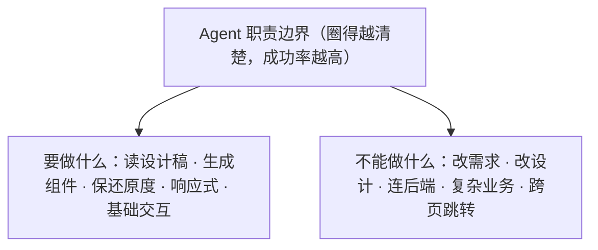

第三部分 · 实战工坊

    

第 12 章

    

    

从 Figma 到代码的端到端实现

  

  

    

      学了十一章的理论，小明终于忍不住了："老王，光说不练假把式，咱们能不能真刀真枪地干一个？"老王笑了笑："别急，这就带你上手。咱们从一个最常见的需求开始——把设计稿变成代码。"    

    

## 一、需求来了：小美要做一个活动页

    

周一早上九点，小明刚到公司，端着咖啡还没坐稳，小美就风风火火地冲了过来。

    

      

        小美：        小明！紧急需求！下周一要上线一个 618 活动页，设计稿已经在 Figma 里了，你看什么时候能出？      

      

        小明：        （差点把咖啡喷出来）等等，下周一？今天周一啊！你是说七天？      

      

        小美：        不是七天，是下周一上线！中间还要联调、测试、改需求……你懂的。      

      

        小明：        （内心崩溃）那……那我争取周五出初版吧……      

    

    

小美走后，小明瘫在椅子上，看着 Figma 里那密密麻麻的设计稿，长长地叹了口气。这个活动页可不简单：顶部导航、Hero Banner、倒计时、商品列表、优惠券、活动规则、底部 footer……大大小小十几个模块。

    

传统流程是什么样的？小明心里门儿清：

          

- **第一天**：设计师出图 → 前端开始搭骨架 → 写基础样式
-       
- **第二天**：逐个实现组件 → 发现设计稿有歧义 → 找设计师确认
-       
- **第三天**：继续写组件 → 设计师说这里要改 → 改完又说那里也要改
-       
- **第四天**：终于写完了 → 联调接口 → 数据格式不对 → 返工
-       
- **第五天**：调响应式 → 手机上样式崩了 → 继续改
-       
- **周末加班**：改需求、调细节、走测试流程
-         

"每次做活动页都像打仗一样。"小明自言自语，"要是能直接从 Figma 生成代码就好了……"

    

话音刚落，小明突然眼睛一亮。对啊！自己这阵子一直在研究 Agent，为什么不做一个 **"AI 网页设计师" Agent**，让它直接从 Figma 读取设计稿，然后自动生成 React 代码呢？

    

小明越想越兴奋，咖啡也不喝了，直接跑到老王的工位。

    

      

        小明：        老王老王！我有一个大胆的想法！      

      

        老王：        （慢悠悠地喝了口茶）说说看。      

      

        小明：        小美要做 618 活动页，我想做一个 Agent，让它直接读 Figma 设计稿，然后自动生成 React 代码！这样是不是几天的活儿几个小时就干完了？      

      

        老王：        （放下茶杯，眼神一亮）嗯……想法不错。那你打算怎么做？      

      

        小明：        我……我就告诉大模型"帮我把这个 Figma 设计稿转成 React 代码"，不就行了？      

      

        老王：        （哈哈大笑）小伙子，还是太年轻啊。你以为一句话就能搞定？那我问你：生成的代码用什么技术栈？样式用 CSS 还是 Tailwind？组件怎么拆分？命名规范是什么？响应式怎么做？      

      

        小明：        （被问懵了）这……这么多讲究啊？      

      

        老王：        那当然。造 Agent 就像造汽车，不是装个发动机就能跑的。来，我带你一步步来。咱们先从最基本的开始——**明确职责边界**。      

    

          

      AI 网页设计师：从 Figma 设计稿到 React 代码的神奇转换        

## 二、第一步：明确 Agent 的"职责边界"

    

老王拉过一块白板，拿起马克笔。

    

      

        老王：        做任何 Agent 之前，第一件事都不是写代码，而是想清楚——**这个 Agent 到底干什么，不干什么**。就像开车，你得先知道目的地在哪、车的性能边界在哪。      

      

        小明：        你的意思是，先给 Agent 画个圈？      

      

        老王：        对！而且这个圈要画得清清楚楚。很多人做 Agent 失败，就是因为期望太高——什么都想让它干，结果什么都干不好。      

    

    

老王在白板上画了一个大圆圈，然后在里面写了三行字。

> 图：Agent 的能力边界——职责越单一，成功率越高

    

### Agent 要做什么

          

- **读取 Figma 设计稿**：通过 Figma API 获取图层信息、样式数据、标注信息
-       
- **生成 React 组件**：将设计稿翻译成 React + TypeScript + Tailwind CSS 代码
-       
- **保证样式还原度**：颜色、字体、间距、布局要和设计稿尽量一致
-       
- **输出响应式布局**：桌面端、平板、手机都能正常显示
-       
- **基础可交互**：按钮有 hover 效果、轮播图能转、表单能输入
-         

### Agent 不能做什么

    

      禁区清单      

以下这些事情，绝对不能让 Agent 去碰：

              

- **改需求**：设计稿上写什么就做什么，不能自作主张改内容
-         
- **改设计**：不能觉得"这样更好看"就改设计稿的样式
-         
- **连后端接口**：只做前端页面，数据用 mock 数据代替
-         
- **复杂业务逻辑**：比如下单、支付、登录这些，通通不碰
-         
- **跨页面跳转**：只做单页，不做路由和多页面
-           

    

      

        小明：        为什么要限制这么多呀？让 Agent 多做点不好吗？      

      

        老王：        你想想，一个刚拿驾照的新手司机，你让他开卡车跑长途，能行吗？Agent 也一样，**职责越单一，成功率越高**。先让它把一件事做好，再慢慢加能力。      

      

        小明：        有道理……那怎么判断做得好不好呢？      

      

        老王：        问得好！这就是第三步——定义成功标准。没有标准，你怎么知道 Agent 做得好不好？      

    

    

### 定义成功标准

    

| 评估维度 | 合格标准 | 优秀标准 |
|-|-|-|
| 样式还原度 | > 80% | > 90% |
| 响应式布局 | 桌面端正常 | 手机/平板/桌面都正常 |
| 代码质量 | 能运行 | 结构清晰、可维护 |
| 组件拆分 | 有基本拆分 | 粒度合理、可复用 |
| 生成速度 | < 4 小时 | < 2 小时 |

    

小明看着白板上的内容，若有所思。原来做 Agent 不是拍脑袋就上，而是要先把边界和目标都想清楚。

    

      

从设计稿到代码，AI 不是来替代设计师的，而是来当"设计执行员"的。

    

    

## 三、第二步：搭建 Context —— 给设计师"看"对的东西

    

明确了职责边界，接下来就是给 Agent 准备"上下文"了。老王说，这就好比你雇了一个新的设计师，你得告诉他公司的设计规范、技术栈、代码风格，不然他干出来的活儿肯定不对路。

    

      

        老王：        小明，你说一个前端工程师拿到需求后，脑子里需要有哪些信息才能开始写代码？      

      

        小明：        嗯……设计稿肯定要有，然后技术栈是什么，用 React 还是 Vue？样式用什么方案？还有代码规范、文件结构……      

      

        老王：        没错！人需要知道的东西，Agent 也需要知道。这些就是它的"Context"。你不给它这些信息，它就只能瞎猜。      

    

          

      AGENTS.md：Agent 的"员工手册"，每次启动都先读一读        

### 设计规范：设计师的"审美基准"

    

老王说，设计规范是最重要的 Context。就像每个公司都有自己的设计语言，Agent 也得知道这个项目的"审美基准"。

          

- **颜色系统**：主色、辅助色、文字色、背景色、状态色……最好给出色值和用途
-       
- **字体规范**：标题用什么字体、正文用什么字体、字号层级、行高字重
-       
- **间距系统**：4px / 8px / 16px / 24px / 32px 的间距体系
-       
- **组件库**：有没有现成的组件库？Button、Card、Input 长什么样？
-       
- **圆角阴影**：圆角多大？阴影是什么风格？
-         

### 技术栈：工程师的"工具箱"

    

光有设计还不够，还得告诉 Agent 用什么技术来实现。

    

      

                                技术栈要求      

      

// 框架框架：React 18+语言：TypeScript样式：Tailwind CSS v3// 组件库UI 组件库：Ant Design 5.x图标：@ant-design/icons// 构建工具构建工具：Vite包管理：pnpm// 其他要求- 使用函数式组件 + Hooks- 使用 CSS Modules 或 Tailwind，不要用内联样式- 组件文件使用 .tsx 后缀- 类型定义要完整，不要用 any

    

    

### 代码规范：团队的"交通规则"

    

代码规范也很重要。没有规范，每个 Agent 写出来的代码风格都不一样，就像每个司机都按自己的习惯开车，路上非乱套不可。

          

- **文件结构**：组件放哪个目录？样式放哪里？类型定义在哪？
-       
- **命名规范**：组件用 PascalCase？变量用 camelCase？常量用 UPPER_SNAKE_CASE？
-       
- **注释要求**：什么地方需要加注释？注释格式是什么？
-       
- **导入顺序**：先 import 第三方库，再 import 内部组件？
-       
- **props 顺序**：className 放前面？key 放最前面？
-         

### 做成 AGENTS.md：每次启动都先读

    

      

        老王：        这些信息不能每次都临时写在 Prompt 里，太麻烦了。最好的方式是做成一个 **AGENTS.md** 文件，放在项目根目录。      

      

        小明：        AGENTS.md？这是什么文件？      

      

        老王：        就像项目的 README.md 是给人看的，AGENTS.md 就是专门给 Agent 看的"员工手册"。每次 Agent 启动，第一件事就是读这个文件，了解项目的所有规范。      

      

        小明：        哇，这个思路好！那里面都写什么？      

      

        老王：        来来来，我给你看一个模板。      

    

    

      

                                AGENTS.md      

      

\# AI 网页设计师 Agent 手册## 角色定位你是一名专业的前端开发工程师，擅长将 Figma 设计稿转换为高质量的 React 组件代码。## 核心原则1. 还原度优先：严格按照设计稿实现，不要自行修改设计2. 代码质量：结构清晰、命名规范、注释完整3. 用户体验：考虑响应式、可访问性、交互反馈## 技术栈- React 18 + TypeScript- Tailwind CSS v3- Ant Design 5.x- Vite 构建## 设计规范- 主色：#1677ff- 成功色：#52c41a- 警告色：#faad14- 错误色：#ff4d4f- 字体：-apple-system, BlinkMacSystemFont, "Segoe UI"- 基础字号：14px- 间距系统：4 / 8 / 12 / 16 / 24 / 32 / 48px## 文件结构\`\`\`src/  components/     # 可复用组件    Header/    Banner/    ProductList/    Footer/  pages/          # 页面组件  types/          # 类型定义  utils/          # 工具函数  assets/         # 静态资源\`\`\`## 代码规范- 组件名：PascalCase（如 ProductCard）- 函数/变量：camelCase（如 handleClick）- 常量：UPPER_SNAKE_CASE（如 MAX_COUNT）- 每个组件上方要有功能注释- props 要定义完整的 TypeScript 类型- 不要使用 any 类型

    

    

      

好的 AGENTS.md 胜过一百条临时 Prompt —— 它是 Agent 的"员工手册"。

    

    

## 四、第三步：装上工具 —— 设计师的"工具箱"

    

有了上下文，Agent 还需要工具。就像设计师需要 Figma、Photoshop、切图工具，前端工程师需要 VS Code、浏览器、调试工具。Agent 也得有自己的工具箱。

    

      

        

1

        

Figma API

        

读取设计稿的图层结构、样式属性、标注信息，是 Agent 的"眼睛"

      

      

        

2

        

文件操作

        

创建组件文件、写入代码、创建目录结构，是 Agent 的"手"

      

      

        

3

        

浏览器预览

        

生成完代码后打开浏览器预览效果，是 Agent 的"镜子"

      

      

        

4

        

图片下载

        

把设计稿里的图片素材下载到本地，是 Agent 的"搬运工"

      

    

    

### Figma API：Agent 的"眼睛"

    

Figma 提供了丰富的 API，可以读取设计稿的几乎所有信息。老王给小明列了几个最常用的：

          

- **GET /v1/files/:key**：获取整个文件的结构，包括所有页面、图层、组件
-       
- **GET /v1/files/:key/nodes**：获取指定节点的详细信息
-       
- **GET /v1/images/:key**：获取图层的图片导出地址
-       
- **GET /v1/files/:key/styles**：获取文件中定义的所有样式
-       
- **GET /v1/files/:key/components**：获取文件中的组件库
-         

      小技巧      

不要一次性把整个 Figma 文件都拉下来，数据量太大了。应该先获取文件结构，找到目标页面和 Frame，然后按需读取详细信息。就像人不会一上来就盯着整张设计稿看，而是先整体浏览，再聚焦细节。

    

    

### 文件操作：Agent 的"手"

    

Agent 生成了代码，总得写到文件里吧？这就需要文件操作工具了：

          

- **创建目录**：按 AGENTS.md 里定义的结构创建文件夹
-       
- **写入文件**：把生成的组件代码写入 .tsx 文件
-       
- **读取文件**：读取已有的文件，在上面修改而不是每次重写
-       
- **重命名/移动**：调整文件结构
-       
- **运行命令**：执行 npm run dev、npx tsc 等命令
-         

### 浏览器预览：Agent 的"镜子"

    

写完代码得看看效果对不对，这就需要浏览器预览工具了。老王说，高级一点的还能截图，然后和设计稿做像素级对比。

    

      

        小明：        还能像素级对比？这么厉害？      

      

        老王：        当然了。用 Playwright 或者 Puppeteer 打开页面截图，然后用像素对比工具和设计稿对比，就能算出还原度。这个我们后面讲质量保障的时候再说。      

    

    

## 五、第四步：设计工作流 —— 从设计稿到代码的完整链路

    

Context 有了，工具也有了，接下来就是最重要的一步——**设计工作流**。老王说，这就像汽车的导航系统，你得规划好从起点到终点的路线，不然 Agent 只会乱跑。

          

      从 Figma 设计稿到代码的四阶段工作流        

小明的"AI 网页设计师" Agent 采用了四阶段工作流，就像盖房子一样，先分析图纸、再拆解结构、然后逐个施工、最后整体装修。

    

      阶段一      

#### 分析设计稿：先看明白再动手

      

拿到设计稿的第一步不是写代码，而是"读"设计稿。Agent 需要先整体浏览一遍，搞清楚：

              

- 这个页面有哪些主要模块？（Header、Banner、商品列表、Footer……）
-         
- 整体布局是什么样的？（上下结构？左右分栏？栅格布局？）
-         
- 有哪些重复出现的元素？（按钮样式、卡片样式、标题样式……）
-         
- 哪些是图片？哪些是文字？哪些是图标？
-             

最后输出一份"设计稿分析报告"，列出模块清单和布局结构。

    

    

      

        小明：        这一步听起来有点多余啊，直接开始写不行吗？      

      

        老王：        你写代码之前不也得先看看设计稿、理理思路吗？人都需要想清楚再动手，AI 就不需要了？**越是复杂的任务，越需要先规划再执行**。上来就写，写到一半发现结构不对，返工更麻烦。      

      

        小明：        （摸摸头）好像是这么个道理……我以前也经常写着写着推翻重来。      

    

    

      阶段二      

#### 拆解组件：把大象装进冰箱分几步

      

分析完设计稿，第二步是把整个页面拆成一个个组件。就像乐高积木，先把积木块分好类，搭的时候才方便。

      

组件拆分的原则：

              

- **从大到小**：先拆大的区块（Header、Main、Footer），再拆小组件
-         
- **可复用优先**：重复出现的元素一定要抽成组件
-         
- **单一职责**：每个组件只做一件事
-         
- **合理粒度**：不要太大（一个组件几百行），也不要太碎（一个 div 一个组件）
-             

以 618 活动页为例，拆分结果大概是这样的：

      

| 层级 | 组件名 | 说明 |
|-|-|-|
| 页面级 | ActivityPage | 整个活动页，组合所有子组件 |
| 区块级 | Header / HeroBanner / ProductSection / CouponSection / Footer | 页面的主要区块 |
| 组件级 | ProductCard / CouponCard / CountDown / SectionTitle | 可复用的基础组件 |
| 元素级 | Button / Tag / Price | 最基础的 UI 元素 |

    

    

      阶段三      

#### 逐个实现：从大到小，先布局后细节

      

组件拆好了，就开始逐个实现了。实现顺序也有讲究：

              

- **先外后内**：先写页面整体布局和容器，再填内容
-         
- **先大后小**：先实现大的区块组件，再做小的元素组件
-         
- **先结构后样式**：先把 HTML 结构写对，再调 CSS 样式
-         
- **先静态后交互**：先做静态展示，再加动画和交互
-             

每实现一个组件，Agent 都会做一次"自检"：结构对不对？样式还原度够不够？有没有语法错误？确认没问题了再进入下一个。

    

    

      阶段四      

#### 整体联调：拼起来、调样式、做响应式

      

所有组件都写完了，最后一步是组装和联调。就像汽车组装完了还要上路测试一样。

              

- **组装页面**：把所有组件拼到 ActivityPage 里，看整体效果
-         
- **调整间距**：模块之间的间距、内边距，确保整体协调
-         
- **响应式适配**：调手机端、平板端的布局和样式
-         
- **交互联调**：轮播图、倒计时、弹窗等交互是否正常
-         
- **整体走查**：从头到尾过一遍，有没有遗漏或错位的地方
-           

    

## 六、第五步：质量保障 —— Reviewer Agent 来验收

    

四个阶段走完，代码就生成好了。但是——

    

      

        小明：        老王，代码生成好了，怎么知道它写得对不对呢？我总不能一行一行去看吧？      

      

        老王：        问得好！这就是为什么我们需要第二个 Agent —— **Reviewer Agent**（审查员）。专门负责检查 Builder Agent（建造者）的工作质量。      

      

        小明：        一个写代码，一个审代码？这也太像真实的开发流程了吧！      

      

        老王：        哈哈，Agent 的世界和人的世界是一样的。**Builder 决定速度，Reviewer 决定质量。速度和质量，一个都不能少。**      

    

          

      Builder 负责写，Reviewer 负责审，双 Agent 协作保证质量        

      

        

        

Builder Agent

        

建造者 · 负责生产

                  

- 读取 Figma 设计稿
-           
- 拆解组件结构
-           
- 编写 React 代码
-           
- 实现样式和布局
-           
- 组装完整页面
-               

      

        

        

Reviewer Agent

        

审查者 · 负责质量

                  

- 检查样式还原度
-           
- 检查代码质量
-           
- 检查响应式布局
-           
- 检查可访问性
-           
- 给出修改建议
-               

    

    

### 还原度检查：像素级对比

    

还原度是最重要的指标。Reviewer Agent 会用 Playwright 打开生成的页面截图，然后和 Figma 设计稿导出的图片做像素级对比。

          

      设计稿 vs 生成代码：像素级对比，还原度一目了然              

- **整体相似度**：两张图的像素重合度，越高越好
-       
- **颜色差异**：提取主要颜色，对比色值偏差
-       
- **布局差异**：检测元素位置、大小是否一致
-       
- **文字差异**：OCR 识别文字内容和字号
-         

      经验值      

像素对比不是越严越好。因为字体渲染、抗锯齿等原因，即使完全一样的设计，截图也会有细微差别。一般设置 95% 以上的相似度就算通过，差异区域要人工判断是不是真的有问题。

    

    

### 代码质量检查：机器也能 lint

    

除了视觉效果，代码本身的质量也要检查。这部分大多可以用工具自动完成：

          

- **ESLint**：检查代码规范和潜在 bug
-       
- **TypeScript 类型检查**：`npx tsc --noEmit` 检查类型错误
-       
- **可维护性评分**：用工具计算圈复杂度、代码重复率
-       
- **组件拆分合理性**：文件大小、props 数量是否合理
-       
- **注释完整度**：关键逻辑有没有注释
-         

### 响应式检查：多尺寸走查

    

现在的网页不可能只在电脑上看，手机、平板都得适配。Reviewer Agent 会模拟不同屏幕尺寸：

    

| 设备 | 宽度 | 检查要点 |
|-|-|-|
| 桌面端 | 1440px | 整体布局、间距、对齐 |
| 平板横屏 | 1024px | 栅格是否正常换行 |
| 平板竖屏 | 768px | 布局是否切换为单列 |
| 大屏手机 | 428px | 字号、间距是否适配 |
| 小屏手机 | 375px | 内容是否完整显示 |

    

### 人工确认：最后还是得人拍板

    

      

        小明：        有了 Reviewer Agent，是不是人就不用管了？      

      

        老王：        那可不行。AI 能检查像素、检查语法，但它没法判断"这个设计好不好看"、"这个交互顺不顺手"。**最后的决策权，还是得在人手里**。      

      

        小明：        那人主要干什么呢？      

      

        老王：        人干人最擅长的事——判断、决策、创意。比如：还原度 92%，能不能过？这个动画效果要不要加？这个组件拆分合不合理？这些都需要人来拍板。      

    

    

      

Builder 决定速度，Reviewer 决定质量。速度和质量，一个都不能少。

    

    

## 七、小明的踩坑与优化

    

理论讲完了，小明摩拳擦掌，开始动手实现。然而理想很丰满，现实很骨感。第一个版本跑下来，问题一大堆。

          

      踩坑不可怕，可怕的是踩了坑不优化        

### 坑一：Figma 图层命名不规范，AI 看不懂

    

      

坑一：图层命名混乱

      

设计稿里的图层名乱七八糟："Frame 123"、"Group 45"、"Rectangle 7"……AI 根本不知道哪个是标题、哪个是按钮、哪个是商品图片。结果生成的代码里，变量名都叫 frame123、group45，可读性极差。

    

    

      

        小明：        这设计师怎么这么不讲究啊，图层名都不改一下！      

      

        老王：        别怪设计师，很多公司都这样。图层命名规范是个好习惯，但不是所有人都有。我们要做的不是抱怨，而是想办法解决。      

      

        小明：        怎么解决？总不能让 AI 去猜吧？      

      

        老王：        猜也不是不行，但猜不准。更好的办法是**建立"组件映射表"**。      

    

    

**优化方案：组件映射表**

    

老王说，可以先让 Agent 分析设计稿里的元素，根据视觉特征（形状、颜色、文字内容）来判断它是什么组件，然后给它一个合适的名字。比如：

          

- 有圆角、有背景色、里面有文字 → 可能是 Button
-       
- 有图片、有标题、有价格 → 可能是 ProductCard
-       
- 大字号、粗体、在页面顶部 → 可能是标题
-       
- 小字号、灰色、在底部 → 可能是辅助文字
-         

当然，更靠谱的方式是推动设计团队使用规范的命名和组件库。这是个双赢的事——设计师自己找图层也方便，AI 生成代码也准确。

    

### 坑二：生成的代码太"重"，一堆没用的 div

    

      

坑二：Div 地狱

      

AI 生成的代码里充斥着大量无意义的 div 嵌套，一个简单的按钮外面套了三四层 div。就像俄罗斯套娃一样，打开一个还有一个。页面性能差，也没法维护。

    

    

      

        小明：        这 AI 也太笨了吧，一个 button 标签就能搞定的事，它给我写了五个 div！      

      

        老王：        这不能全怪 AI。Figma 里的图层本来就是一层层嵌套的，AI 照着图层结构翻译，自然就生成了一堆 div。关键是——**我们要教会 AI"语义化"和"精简结构"**。      

    

    

**优化方案：结构精简规则**

          

- **用语义化标签**：header、nav、main、section、footer、button、article……能用语义标签就不用 div
-       
- **扁平化结构**：能一层搞定的不要两层，减少不必要的嵌套
-       
- **合理使用 Flex/Grid**：布局用 Flex 或 Grid，不要用一堆 div 堆出来
-       
- **Reviewer 把关**：让 Reviewer Agent 专门检查"div 嵌套层数"，超过 5 层就报警
-         

### 坑三：字体和颜色总是有细微差别

    

      

坑三：像素级"差一点"

      

整体看着差不多，但仔细一看，颜色总是差那么一点点——设计稿是 #1677ff，生成的代码是 #1890ff；字号设计稿是 14px，生成的是 13.5px；间距设计稿是 16px，生成的是 15.875px……强迫症表示不能忍。

    

    

      

        小明：        为什么总是差一点啊？Figma API 读出来的数据不应该是精确的吗？      

      

        老王：        数据是精确的，但 AI 在生成代码的时候可能会"四舍五入"或者"近似处理"。比如它觉得 15.875px 不好看，就改成 16px 了。还有的情况是颜色值从 RGB 转 HEX 时精度丢失。      

      

        小明：        那怎么办？      

      

        老王：        两个办法：一是在 Prompt 里**明确要求精确还原数值**，二是加一个**像素对比后自动修正**的步骤——发现哪里不对，自动调整数值再生成。      

    

    

**优化方案：精确还原 + 自动修正**

          

- 在 AGENTS.md 里明确写："所有数值必须与设计稿完全一致，不得四舍五入或近似"
-       
- 建立设计 Token 映射：把设计稿中的颜色、字号、间距映射到项目的 Design Token 中
-       
- Reviewer 检测到差异后，自动计算修正值，让 Builder 重新生成
-       
- 多轮迭代：一次不对就改两次、三次，直到达到还原度标准
-         

      优化心得      

做 Agent 和做产品一样，不可能一步到位。关键是要有**迭代思维**——先用起来，发现问题，然后优化 Prompt、优化工具、优化流程。每踩一个坑，Agent 就变强一点。

    

    

## 八、成果展示：从设计稿到上线只用了 2 小时

    

经过几轮迭代优化，小明的"AI 网页设计师"终于跑通了。当小美把 618 活动页的 Figma 链接发过来时，小明深吸一口气，启动了 Agent。

          

      传统开发 3 天 vs AI 辅助 2 小时：效率的飞跃        

### 前后对比：以前要 3 天，现在 2 小时出初版

    

| 环节 | 传统方式 | AI 辅助 | 效率提升 |
|-|-|-|-|
| 分析设计稿 | 2 小时 | 5 分钟 | 24 倍 |
| 组件拆分 | 1 小时 | 3 分钟 | 20 倍 |
| 编写代码 | 16 小时 | 60 分钟 | 16 倍 |
| 样式调整 | 4 小时 | 30 分钟 | 8 倍 |
| 响应式适配 | 2 小时 | 20 分钟 | 6 倍 |
| **总计（初版）** | **约 3 天** | **约 2 小时** | **12 倍** |

    

      

        小明：        （看着屏幕上生成的页面，不敢相信）这……这就好了？才两个小时？      

      

        老王：        别高兴太早，这只是初版。你还得审核一遍，有问题的地方让它改。但就算加上审核修改，半天也绰绰有余了。      

      

        小明：        太牛了……以前做活动页我都要加班到吐，现在居然这么轻松？      

    

    

### 人的角色变了：从"写代码的"变成"审代码的"

    

效率提升的背后，是人的角色发生了变化。小明发现自己不再是那个天天写 HTML、调 CSS 的"码农"了，而是变成了一个**"AI 项目经理"**：

          

- **以前**：自己写代码 → 自己测试 → 自己改 bug → 加班到深夜
-       
- **现在**：给 Agent 派活儿 → 检查 Agent 的成果 → 告诉 Agent 哪里要改 → 拍板确认
-         

      

        小明：        老王，我突然觉得……我好像从一个"体力劳动者"变成了"脑力劳动者"？      

      

        老王：        （点点头）说得好。AI 接手的是那些重复的、机械的、有明确规则的工作，而人要做的是判断、决策、创意、把控方向。**不是人变懒了，而是人把精力放在了更有价值的事情上。**      

    

    

### 成本变化：开发成本降了，但设计规范的要求高了

    

不过老王也提醒小明，不要光看到好处，也要看到成本结构的变化。

    

      注意      

AI 不是免费的午餐。用 AI 降低了开发成本，但对**设计规范**的要求反而更高了。设计稿越规范、命名越清晰、组件库越完善，AI 生成的代码质量就越高。反之，如果设计稿乱七八糟，AI 也会跟着乱。

    

    

这就好比自动驾驶——路修得越好、标线越清晰、交通规则越完善，自动驾驶就越安全。如果路上坑坑洼洼、标线模糊、行人乱穿马路，再厉害的自动驾驶也白搭。

    

所以，引入 AI 网页设计师之后，团队反而要更加重视设计规范和组件库建设。这是一个**先投入、后收益**的过程。

        

      

下章预告

      

### 内容运营特工队

      

        618 活动页顺利上线，小明得意得不行。他一边喝着茶一边想：一个 AI 设计师就这么厉害！那如果我再做一个内容 Agent，让它负责写文案、做海报、发公众号，两个一起干活，是不是效率翻倍？      

      

        小明兴冲冲地跑去跟老王说自己的想法。老王笑了笑，说："两个一起干活是没问题，但你知道怎么让它们配合吗？是各干各的，还是有说有聊？谁来牵头？谁来兜底？出了问题谁负责？"      

      

        小明愣住了。他还真没想过这些……      

      

        *下一章，内容生产 + 数据分析双 Agent 协作。当多个 Agent 一起干活，会发生什么？*      

    

        

← 第11章：可观测性与审计 第13章：内容生产 + 数据分析双 Agent 协作 →          

  

  

    

《智驾时代：Agent 进化简史》 · AI观察室 出品

    

从 Prompt 到自进化组织，一部 AI 智能体的演化史诗

  
