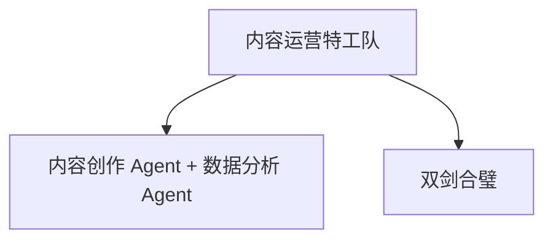
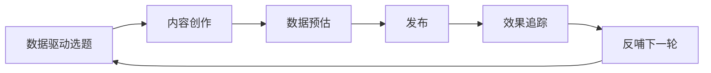
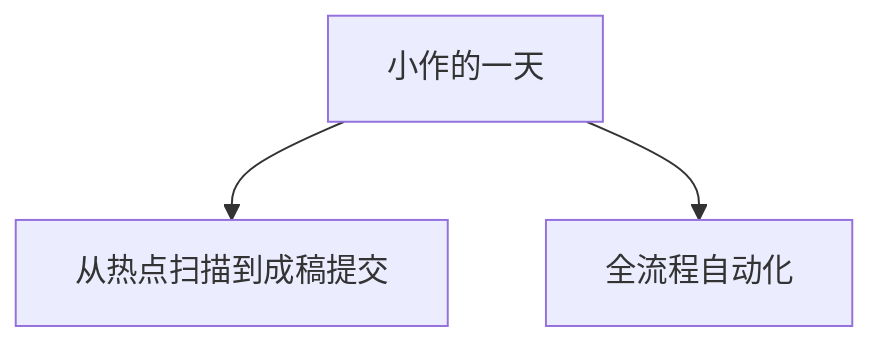
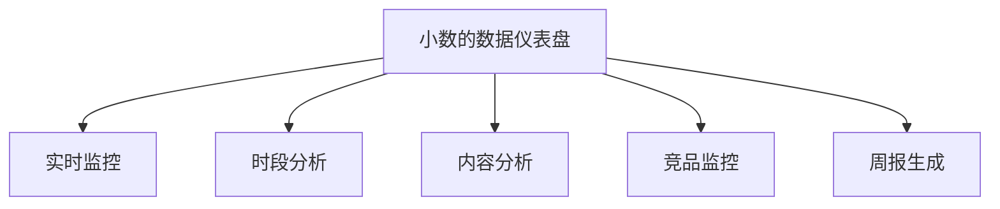
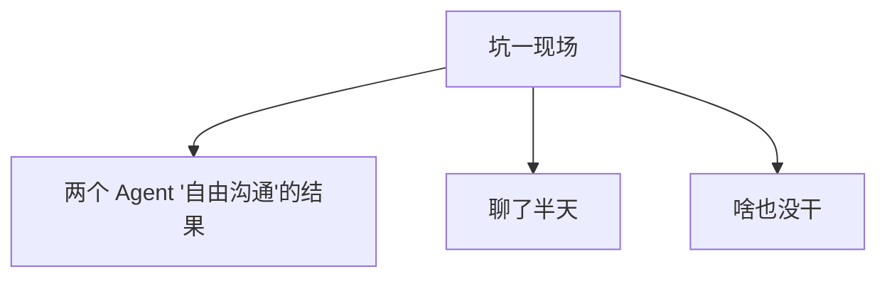
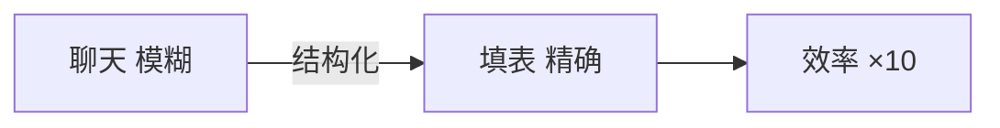
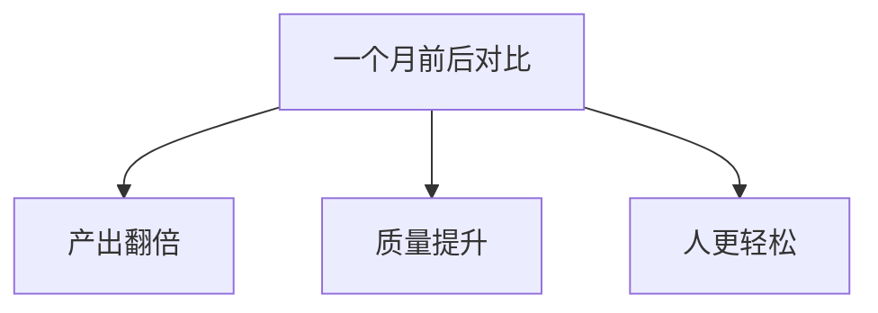

第 13 章

内容生产 + 数据分析双 Agent 协作

如果说上一章的 AI 网页设计师是"一辆车的旅行"，那这一章我们要玩点更刺激的——组建一支车队。

你有没有想过，当两个 Agent 一起干活的时候，会发生什么？

是 1+1=2？还是 1+1>2？又或者，两个"聪明人"在一起反而互相添乱，1+1<1？

这一章，我们就用一个真实的场景——内容运营——来看看双 Agent 协作到底是怎么回事。主角不是小明也不是老王，而是我们的老朋友小美。

你准备好了吗？故事开始了。

## 13.1 小美的新难题：内容运营人不够

周一早上九点，小美顶着两个黑眼圈冲进了公司。

她是公司的产品经理，但最近老板把内容运营的活儿也扔给了她。原因很简单——公司刚起步，预算有限，能省一个人是一个人。

于是，小美的日常变成了这样：

小美（自言自语）

"周一要写公众号推文，周二要做海报，周三要分析上周数据，周四要写短视频脚本，周五要做周报……"

"我一个人干三个人的活，工资还是一份的。这合理吗？这合理吗？！"

更让小美崩溃的是，她还得"凭感觉"做内容。

写什么主题？——看心情。

取什么标题？——哪个最像"爆款"用哪个。

什么时候发？——下班前发吧，大家摸鱼的时候看。

效果怎么样？——发完之后忐忑不安，每隔十分钟刷一次后台数据，像个等待考试成绩的学生。

这天中午，小美在食堂遇到了小明和老王。

小美

"唉，你们说……有没有什么办法能让我少干点活？我感觉自己快被榨干了。"

小明

"啊？你一个产品经理，干什么活把你累成这样？"

小美

"别提了。老板让我兼管内容运营，每天写公众号、做海报、分析数据……一个人干三个人的活，我都快成'三头六臂'了。"

小明

"（眼睛一亮）内容运营？那这事儿好办啊！用 Agent 啊！"

小美

"Agent？就是你之前跟我说的那个什么'智能车'？它能帮我写文章？"

小明

"写文章算什么！我跟你说，不止写文章，连数据分析都能搞定。你只需要……"

老王

"（打断小明）行了行了，你别瞎吹。小美，你先说说你的具体需求是什么？"

小美掰着手指头数：

- 每周至少 3 篇公众号文章，选题、写稿、排版、取标题一条龙
- 每天监控数据：阅读量、点赞、转发、评论，看看效果怎么样
- 每周做一次数据报告，分析什么内容受欢迎，什么没人看
- 最好还能……给我出出主意，下周写什么比较好

老王听完，摸着下巴想了想。

老王

"嗯……这个场景有意思。你要的不是一个 Agent，而是**两个**。"

小美

"两个？一个写内容，一个做分析？"

老王

"没错。而且这两个 Agent 不是各干各的，它们要互相配合——数据的给内容的出主意，内容的写完了数据的帮忙预估效果。"

小明

"哇！双 Agent 协作！这个我还没试过呢！"

小美

"（兴奋）那……那我岂不是可以从'写稿的'变成'管事儿的'？"

老王

"可以这么说。目标就是——**从选题到发布全流程，人只负责最后拍板**。"

小美眼睛亮了。那一刻，她仿佛看到了希望的曙光。

一个人干三个人的活，不是因为你能干，  
而是因为你还没学会让 AI 替你干。

> 图 1：内容运营特工队：内容创作 Agent + 数据分析 Agent，双剑合璧

## 13.2 角色设定：两个 Agent 的"分工协议"

说干就干。小明拉着小美，在老王的指导下，开始设计这个"内容运营特工队"。

第一步，也是最重要的一步——**先定分工**。

老王说，多 Agent 协作最容易犯的错误，就是上来就写代码、调接口，结果做到一半才发现"谁干什么"都没说清楚。两个 Agent 抢着干同一件事，或者都觉得"这事儿不归我管"。

**踩坑预警**

很多人搞多 Agent，上来就想"让它们自由沟通"。结果呢？两个 Agent 聊了半小时，一件正事没干。记住：**分工不清，协作不灵**。

经过一下午的讨论，他们给两个 Agent 定了清晰的角色。

✍️

小作

内容创作 Agent · 首席内容官

负责从选题到成稿的全流程内容生产。它的目标只有一个——写出读者爱看、数据好看的好内容。

热点追踪 选题策划 文章撰写 标题优化 排版建议 配图方案

📊

小数

数据分析 Agent · 数据洞察官

负责监控内容数据、分析效果、提供决策建议。它的目标是——让每一个决策都有数据支撑。

实时监控 数据分析 效果评估 选题建议 竞品监控 周报生成

小美看着这两个"虚拟员工"的介绍，忍不住笑了。

小美

"小作和小数……这名字还挺可爱的。那它们俩怎么配合呢？总不能各干各的吧？"

老王

"问得好。这就是多 Agent 协作的核心——**它们不是'聊天'，而是'交接'**。"

小明

"交接？什么意思？"

老王

"你想想，在公司里，两个同事配合工作，是天天在微信上聊天吗？不是。是通过**交接文档**——A 做完了，写个交接单给 B，B 接着干。"

小美

"（恍然大悟）哦！我明白了！就像我们公司的运营流程——策划写完方案交接给设计，设计做完图交接给开发，开发做完了交接给测试……"

老王

"没错！Agent 之间也是一样。你别让它们自由聊天，那样效率太低。你给它们定好**交接格式**——什么时候交、交什么、什么格式、谁来确认。"

金句 01

多 Agent 协作的关键，不是让它们"聊天"，  
而是让它们"交接"——清晰的交接格式比什么都重要。

于是，他们给小作和小数设计了三条"协作通道"：

### 通道一：数据驱动选题

每周一早上，小数会给小作发一份"选题建议书"。里面包含：上周什么类型的内容数据最好、最近有什么热点可以追、竞品在写什么、读者评论里提到了哪些话题。

小作根据这份建议，结合自己的热点扫描，确定本周的选题方向。

### 通道二：发布前数据预估

小作写完一篇文章后，不是直接发给小美，而是先"抄送"给小数。小数会根据历史数据，预估这篇文章的阅读量、转发率大概在什么水平，甚至给出"建议调整标题"、"这个角度可能不太受欢迎"之类的反馈。

小作根据小数的反馈，做最后一轮优化，然后才提交给小美审核。

### 通道三：发布后效果追踪

文章发布后，小数会实时监控数据。如果数据异常好——比如转发率特别高，小数会立刻通知小作："这个主题不错，可以再写几篇！"

如果数据异常差——比如打开率很低，小数也会通知小作："这个方向可能不太对，咱们调整一下。"

> 图 2：双 Agent 协作闭环：数据驱动选题 → 内容创作 → 数据预估 → 发布 → 效果追踪 → 反哺下一轮

数据 Agent 是内容 Agent 的"眼睛"，  
内容 Agent 是数据 Agent 的"手"。  
眼睛看到方向，手去执行。

## 13.3 小作的日常：一篇爆款是怎么诞生的

分工定好了，协作方式也想清楚了。接下来，我们来看看小作的一天是怎么度过的。

小美说，她以前写一篇公众号文章，从选题到发布至少要大半天。有时候为了想标题，能纠结一个小时。

那小作呢？它的效率怎么样？

小明给小作设定了一套"每日工作流"。我们跟着时间线看看：

☀️ 早上 9:00 — 热点扫描

扫描全网热点和行业动态

小作会自动访问各大科技媒体、行业公众号、热搜榜，抓取当天的热点话题。同时，它会结合小数昨天给的"选题建议"，筛选出跟公司业务相关的方向。  
  
这个过程大概需要 15 分钟。换成人的话，刷一圈下来，一上午就没了。

🌤️ 上午 10:00 — 选题会

确定 3 个备选选题，交给小数评估

小作从热点里挑出 5 个候选选题，加上自己的选题思路，打包发给小数。小数根据历史数据，给每个选题打分：预估阅读量、预估转发率、跟品牌调性的匹配度……  
  
最后选出 3 个得分最高的，作为本周的备选选题。

🌤️ 上午 10:30 — 立项

小美拍板，确定今天写哪篇

3 个选题推送到小美的手机上，每个选题都有：主题、角度、预估数据、风险提示。小美只需要选一个就行——就像皇帝翻牌子。  
  
以前小美得自己想选题，现在她只需要"选"选题。

☀️ 下午 2:00 — 写稿

写初稿 + 改 3 个版本的标题

选题确定后，小作开始写初稿。它会先列大纲，再填充内容，最后润色语言。一篇 2000 字的文章，大概 1 个半小时搞定。  
  
写完正文，它还会生成 5 个不同风格的标题——有悬念型的、有数字型的、有痛点型的——然后让小数用"标题吸引力模型"打分，选出前 3 名。

🌅 下午 4:00 — 排版 + 配图

自动排版 + 配图建议

小作会按照公司的排版规范，自动给文章分段、加粗重点、加引用框、插小标题。同时，它会根据文章内容，给出 3-5 张配图建议——包括图片的主题、风格、甚至具体的关键词。  
  
如果接入了 AI 画图工具，它甚至能直接把配图生成出来。

🌆 下午 5:00 — 提交审核

提交给小美最终审核

一篇完整的"待发布文章包"准备好了：正文、3 个备选标题、排版样式、配图建议、数据预估。  
  
小美只需要花 10-15 分钟过一遍，改改措辞、选个标题、确认发布时间——然后，就可以下班了。

> 图 3：小作的一天：从热点扫描到成稿提交，全流程自动化

小美

"等等等等……这也太爽了吧？那我干什么？我就每天下午 5 点花 10 分钟审一下？"

老王

"差不多是这个意思。不过你别高兴太早——审核这一步很关键。AI 写的东西可能有错别字、可能有事实错误、可能语气不对。**人的价值，就是在关键节点守住那条线**。"

小明

"对！就像自动驾驶汽车，平时它自己开，但遇到复杂路况，还是需要人类司机接管的。"

小美

"嗯……我懂了。我不是'被替代了'，而是从'写稿的'变成了'总编辑'——不干活了，改'把关'了。"

老王

"（笑）你这个总结很到位。AI 能写文章，但写不出品牌的灵魂；AI 能算数据，但算不出品牌的底线。**人的价值，就是在关键节点守住那条线**。"

金句 03

AI 能算数据，但算不出品牌的底线。  
人的价值，就是在关键节点守住那条线。

## 13.4 小数的日常：数据背后的秘密

说完了小作，我们再来看看它的搭档——小数。

如果说小作是"冲锋在前的战士"，那小数就是"坐镇后方的军师"。它不生产内容，但它决定了内容的方向。

小美说，她以前也看数据，但看来看去就那么几个数——阅读量多少、点赞多少、转发多少。看完之后呢？——"哦，知道了。"然后该干嘛干嘛。

"数据是看了，但没什么用。"小美如是说。

那小数能做什么不一样的呢？

### 实时监控：不止是"看数字"

小数会 24 小时监控所有内容的数据。但它不是傻盯着——它有一套"异常检测"机制。

**举个例子**

一篇文章发出去 2 小时，阅读量已经超过了上周平均水平的 2 倍——小数会立刻给小美发消息："这篇数据异常好，建议加推！"  
  
反过来，如果发出去 4 小时打开率还不到 5%——小数也会提醒："这篇数据偏低，可能标题有问题，要不要考虑改个标题重发？"

你看，这才是数据分析的价值——**不是告诉你"是什么"，而是告诉你"意味着什么"和"该怎么办"**。

### 时段分析：什么时候发效果最好

"公众号几点发最好？"——这可能是每个运营人都纠结过的问题。

有人说早上 8 点好，大家通勤路上看。有人说中午 12 点好，吃饭的时候刷手机。还有人说晚上 9 点好，睡前刷一刷。

公说公有理，婆说婆有理。

小数不会跟你"讲道理"——它直接拿数据说话。

它会统计过去 30 天所有文章的发布时间和对应的数据表现，然后算出"最优发布时间窗口"。而且它还会细分——不同类型的内容，最佳发布时间不一样。

**真实发现**

小美公司的数据显示：干货类文章周三下午 3 点发效果最好（上班族摸鱼学习），而观点类文章周五晚上 8 点发最好（周末前的放松时间，适合深度阅读）。  
  
这个结论，光靠"猜"是猜不出来的。

### 内容分析：什么主题读者最爱看

这是小数最核心的能力——它不只是看"哪篇数据好"，而是会分析"**为什么**这篇数据好"。

它会把文章拆成各种维度来分析：

- **主题维度**：技术干货？行业观点？产品介绍？用户故事？
- **标题维度**：数字型？悬念型？痛点型？对比型？
- **结构维度**：清单体？故事体？辩论体？
- **长度维度**：短文（1000字）？中篇（2000字）？长文（3000+字）？

然后它会告诉你："根据过去 3 个月的数据，'技术干货 + 数字标题 + 2000字左右'的组合，平均阅读量最高，转发率也最好。"

这就不是"凭感觉做内容"了——这是**数据驱动的内容生产**。

### 竞品监控：别人在写什么

做内容，不能闭门造车。你得知道同行在干什么。

小数会定期监控 10-20 个竞品账号，看看它们最近在发什么、哪些内容数据好、有什么新的玩法可以借鉴。

但注意——是"借鉴"，不是"抄"。小数会给小作提的建议是："竞品最近'AI 工具评测'这个方向数据不错，我们可以从另一个角度切入，做一个'小白使用指南'版本。"

### 每周报告：数据总结 + 下周建议

每周日晚上，小数会自动生成一份"内容运营周报"。里面包含：

- 本周数据总览：总阅读量、平均打开率、平均转发率……
- 数据趋势：跟上周比是涨了还是跌了？为什么？
- 最佳/最差内容：表现最好的 3 篇和最差的 2 篇，分析原因
- 下周建议：推荐的选题方向、建议调整的策略、需要注意的风险

这份周报，小美周一早上打开就能看。以前她得花大半天自己做，现在——点一下就有了。

> 图 4：小数的数据仪表盘：实时监控、时段分析、内容分析、竞品监控、周报生成

## 13.5 双 Agent 协作：1+1 > 2 的秘密

讲到这里，你可能会说："不就是一个写内容、一个看数据吗？有什么了不起的？"

哎，这你就错了。

小作和小数，不是简单的"分工"关系。它们是**互相赋能**的关系——你帮我变得更好，我帮你变得更准。

这才是多 Agent 协作真正的威力。

### 数据驱动选题：从"拍脑袋"到"有据可依"

以前小作写内容，选题全靠"我觉得读者会喜欢"。但"我觉得"有用吗？——十有八九不准。

现在不一样了。小数会告诉小作：

小数（虚拟）

"根据过去 30 天的数据，'Agent 实战案例'这个主题的平均阅读量比其他主题高 47%，转发率高 62%。建议本周重点投入。"

"另外，读者评论里反复提到'想知道具体怎么搭建'，说明实操类内容需求很大。"

"还有，竞品 XX 最近发了一篇《我用 AI 写了 100 篇文章》，数据爆了。我们可以从'踩坑经验'的角度切入，做一个差异化的版本。"

你看，这不是小数"替"小作做决定，而是小数给小作提供**情报支持**。小作有了这些情报，写出来的内容命中率自然就高了。

这就像打仗——侦察兵（小数）摸清楚了敌人的部署，前线指挥官（小作）才能打出精准的胜仗。

### 内容反哺数据：从"事后分析"到"实时迭代"

反过来，小作的内容也在给小数"喂数据"。

每发布一篇新文章，小数的数据库就多了一个数据点。数据越多，小数的分析就越准；分析越准，给小作的建议就越好；建议越好，小作写的内容数据就越好……

你发现了吗？这是一个**正向循环**！

**正向循环**

好内容 → 更多数据 → 更准的分析 → 更好的建议 → 更好的内容 → ……  
  
这个循环转起来之后，内容质量会越来越高，而且是**自动的、加速的**。

### 每周复盘会：两个 Agent 一起"开会"

最有意思的是"每周复盘会"。

每周一早上，小作和小数会"开个会"——当然不是真的聊天，而是按照预定的流程，做一次完整的复盘。

流程是这样的：

1. 小数先汇报：上周数据怎么样？哪些做得好？哪些做得不好？原因是什么？
2. 小作回应：好的地方继续保持，不好的地方我打算怎么改进？
3. 小数给出下周建议：推荐哪些选题方向、建议尝试什么新形式、需要注意什么。
4. 小作制定下周计划：写几篇、写什么、大概什么时候发。
5. 最后，生成一份"下周内容规划表"，发给小美确认。

小美说，她第一次看到这份"自动生成的周计划"的时候，鸡皮疙瘩都起来了。

小美

"太离谱了……我以前每周一开选题会，跟团队讨论一上午，最后定下来的东西还不如这个周全。"

老王

"所以你看，AI 不是来抢饭碗的。它是来把你从'低价值的重复劳动'里解放出来，让你去做更重要的事。"

小美

"那……我现在的价值是什么？"

老王

"你从'写内容的'变成了'**定方向的**'。具体写什么、怎么写，AI 来干。但**写不写、对不对、发不发**——你来拍板。"

小明

"对！就像智能汽车——开车的事交给 AI，但去哪儿、走哪条路、要不要停下来——还是人说了算。"

## 13.6 搭建过程：从零到一的步骤

讲了这么多好处，你肯定想问："说得这么热闹，到底怎么搭？难不难？"

老王说，搭建这样一个双 Agent 系统，说难也难，说简单也简单。关键是——**别急着写代码，先把流程想清楚**。

他们当时花了整整两天时间"纸上谈兵"，画流程图、定交接格式、写 Prompt，然后才开始动手搭。

具体怎么操作呢？一共分五步：

#### 第一步：分别定义两个 Agent 的职责和工具

先别急着搞"协作"，先把每个 Agent 单独的职责搞清楚。  
  
给小作定：它能干什么（写稿、取标题、排版）、不能干什么（不能自己发、不能编造数据）、有哪些工具可用（搜索工具、排版工具、图片生成工具）。  
  
给小数定：它要监控什么（阅读量、转发、评论）、分析什么（主题、标题、时段）、输出什么（日报、周报、选题建议）、有哪些工具可用（数据接口、统计工具、竞品监控工具）。  
  
**这一步的产出物是两份"岗位说明书"。**

#### 第二步：建立共享的"内容知识库"

两个 Agent 要协作，得有共同的"语言"和"记忆"。  
  
比如公司的品牌调性是什么？哪些话能说哪些不能说？历史上发过哪些文章？数据怎么样？竞品有哪些？……  
  
这些信息不能散落在各处，要统一放到一个"内容知识库"里。两个 Agent 都从这个库里取信息，这样它们说的就是"同一套话"，不会鸡同鸭讲。  
  
**这一步的产出物是一个共享的知识库（可以是向量数据库，也可以是一个文档库）。**

#### 第三步：设计协作接口和交接格式

这是最关键的一步——定义"交接格式"。  
  
小作给小数"递"东西，用什么格式？小数给小作"回"东西，又是什么格式？  
  
老王的建议是：**用 JSON，不要用自然语言**。因为自然语言太随意了，今天这么说明天那么说，Agent 容易理解错。JSON 是结构化的，字段固定、含义明确，不容易出岔子。  
  
举个例子，小数给小作的"选题建议书"，可以定义成这样的结构：选题名称、选题背景、预估数据、推荐角度、风险提示、参考资料。  
  
**这一步的产出物是"协作接口规范文档"。**

#### 第四步：设置人工审批节点

千万别搞"全自动"——出了事你担不起。  
  
在整个流程里，要设好"人工卡点"：选题要人确认、成稿要人审核、发布要人批准。这些卡点就是你的"刹车"和"方向盘"。  
  
而且，审批不能太复杂——就一个"过/不过"的选择，再加一个可选的修改意见。审批越简单，你越愿意用；越复杂，越容易变成摆设。  
  
**这一步的产出物是"审批流程清单"，明确每个节点谁来审、审什么、多久审完。**

#### 第五步：跑一周，根据真实数据调优

系统搭好了，别急着全量上线。先跑一周"试运行"。  
  
这一周里，你要仔细观察：哪里卡壳了？哪里出问题了？Agent 理解错了什么？交接格式有没有歧义？  
  
小明他们跑第一周的时候，每天都要改好几版 Prompt 和交接格式。比如一开始"选题建议书"里没有"风险提示"字段，结果小作选了一个争议性很大的话题，差点出事儿。后来赶紧加上了。  
  
**记住：第一个版本永远是"能用就行"，真正的优化在后面的迭代里。**

**老王的经验之谈**

很多人搭多 Agent 系统，一上来就追求"全自动"、"智能化"、"自由沟通"。结果就是——看起来很酷，实际上根本没法用。  
  
我给你的建议是：**先做"笨"的，再做"聪明"的**。先把流程定死、把格式定死、把交接定死，跑通了再说。等系统稳定了，再慢慢加灵活性。  
  
就像学开车，先学会直线行驶，再学变道，最后才是复杂路况。

## 13.7 踩坑与经验

说到这里，你可能觉得"双 Agent 协作"也太美好了吧？——两个 AI 帮你干活，你只需要最后拍个板。

哪有那么容易！

小明他们在搭这个系统的时候，踩了无数的坑。用小明的话说就是——"每一步都是坑，坑坑不一样。"

我们来听听他们踩过哪些坑，省得你再踩一遍。

坑一：两个 Agent "各说各话"，沟通不顺畅

一开始，小明让小作和小数"自由沟通"——小作写完了，直接把文章发给小数，小数想说什么就说什么。  
  
结果呢？两个 Agent 能"聊"起来，但效率极低。小作说"我觉得写得不错"，小数说"我觉得数据可能一般"，然后小作又说"那你觉得哪里需要改？"……来来回回扯半天，一句有用的都没有。  
  
更离谱的是，有一次它们居然聊起了"AI 会不会取代人类"这种哲学问题——完全跑偏了！

**解决方案：**取消"自由沟通"，改成"结构化交接"。定义清楚交接的格式、字段、含义。小作给小数的东西必须按格式填，小数给小作的反馈也必须按格式来。  
  
一句话——**别让它们聊天，让它们填表**。

坑二：内容 Agent 写得太"水"，凑字数

小作一开始写的文章，小美看完直摇头。  
  
"写得没错，但也没什么用。看起来满满当当，仔细一看全是废话。就像上学时写作文凑字数一样。"  
  
这是内容生成 Agent 的通病——它追求"完整性"和"流畅性"，但不追求"有用性"。它写了 2000 字，可能有用的信息只有 200 字。  
  
小明一开始想通过改 Prompt 来解决——"你要写得有深度、有干货、有洞见……"  
  
没用。AI 嘴上说"好的我会注意"，写出来还是那德行。

**解决方案：**给内容 Agent 加"质量检查"环节。  
  
具体做法：小作写完初稿后，先过一遍"质检清单"——有没有具体案例？有没有数据支撑？有没有可操作的建议？有没有重复啰嗦？  
  
而且，把"字数要求"改成"信息量要求"——不说"写 2000 字"，而是说"至少包含 5 个核心观点，每个观点配一个案例"。  
  
质检不过关的，打回去重写。

坑三：数据 Agent 分析了一堆，但都是废话

小数也不让人省心。  
  
一开始，小数的分析报告写得特别"漂亮"——各种图表、各种维度、各种数据。但小美看完的反应是："然后呢？"  
  
"阅读量上升了 15%——然后呢？我该怎么办？"  
  
"这个主题数据比较好——然后呢？我该多写这个主题？写多少？怎么写？"  
  
数据是有了，分析也有了，但**没有行动建议**。全是"正确的废话"。

**解决方案：**给数据 Agent 加"行动建议"要求。  
  
规则很简单——每一条分析结论后面，必须跟至少一条具体的行动建议。而且建议必须是可执行的，不能是"加强内容质量"这种空话。  
  
比如不说"这个主题数据好"，而是说"建议下周安排 2 篇这个主题的内容，角度分别是 X 和 Y，目标阅读量 XX+"。  
  
不给行动建议的分析，等于没分析。

> 图 5：坑一现场：两个 Agent "自由沟通"的结果——聊了半天，啥也没干

除了这三个大坑，还有一堆小坑：

- 知识库更新不及时，两个 Agent 说的信息对不上
- 审批节点太多，流程走不动，反而变慢了
- Agent 会"编数据"——明明没有的数，它张嘴就来
- 热点追得太猛，内容跟品牌调性脱节
- 标题党倾向严重——数据好看了，但品牌形象掉了

老王说，这些坑你几乎肯定会踩。重要的不是"不踩坑"，而是**踩了之后能快速调整**。

没有完美的系统，只有不断迭代的系统。  
第一个版本烂没关系，关键是你能不能把它越改越好。

> 图 6：结构化交接格式：把"聊天"变成"填表"，效率提升 10 倍

## 13.8 成果：一个人顶一个团队

说了这么多困难，最后我们来看看成果。

这套系统跑了一个月之后，效果怎么样？

用小美的话说就是——"我现在每天下午 5 点准时下班，老板还说我工作做得好。"

我们来看几组数据对比：

Before · 以前

2 篇 / 周

1 人 还得加班

靠感觉 选题凭经验

\~10% 爆款率

After · 现在

5 + 2 篇/条 · 周

1 人 准点下班

数据驱动 选题有依据

\~30% 爆款率 3 倍

> 图 7：一个月前后对比：产出翻倍、质量提升、人更轻松

### 产出提升：从"每周 2 篇"到"每周 5 篇 + 2 条短视频脚本"

以前小美一个人，拼尽全力每周也就写 2 篇公众号。现在呢？——5 篇公众号 + 2 条短视频脚本，还能腾出时间做别的。

而且质量没下降——反而上升了。因为每篇文章都有数据支撑、有多重质检、有专业优化。

### 质量稳定：爆款率提升 3 倍

什么叫"爆款"？小美公司的定义是——阅读量超过平均水平 2 倍就算爆款。

以前，大概每 10 篇里能出 1 篇爆款，全靠运气。

现在，大概每 3 篇里就有 1 篇爆款。不是运气好了，而是**选题命中率高了**——因为有小数在后面做数据支撑。

### 人的价值：从"写稿机器"变成"内容总监"

这一点是小美感触最深的。

小美

"以前我每天的工作就是——想选题、写稿子、改稿子、发稿子。感觉自己就是个'写稿机器'。"

"现在呢？我每天花 1 小时审核内容，剩下的时间都在想——我们的内容策略对不对？品牌调性有没有跑偏？用户的需求有没有变化？下季度的内容方向是什么？"

"我从'干活的'变成了'思考的'。这才是产品经理该干的事儿啊！"

老王

"（点头）这就是 AI 真正的价值——它不是来取代你的，而是来**升级**你的。把你从低价值的重复劳动里解放出来，让你去做更有价值的事。"

小明

"就像汽车取代了马车夫——但人没有失业，而是去做了更重要的事。马车夫变成了司机，司机变成了物流经理，物流经理变成了供应链总监……"

小美

"（眼睛亮晶晶的）所以……我现在是'内容总监'了？"

老王

"（笑）你可以这么理解。只不过你的团队不是人，是两个 AI Agent。"

**本章核心结论**

双 Agent 协作的关键不是"数量"，而是"分工"和"交接"。  
  
分工要清晰——谁干什么、不干什么，说清楚。  
交接要结构化——用固定格式传递信息，别让它们"自由聊天"。  
人的角色要升级——从"干活的"变成"把关的"和"定方向的"。  
  
做到这三点，1+1 就一定大于 2。

## 本章金句回顾

金句 01

多 Agent 协作的关键，不是让它们"聊天"，  
而是让它们"交接"——清晰的交接格式比什么都重要。

金句 02

数据 Agent 是内容 Agent 的"眼睛"，  
内容 Agent 是数据 Agent 的"手"。  
眼睛看到方向，手去执行。

金句 03

AI 能算数据，但算不出品牌的底线。  
人的价值，就是在关键节点守住那条线。

## 下一章预告

看着后台蹭蹭上涨的数据，小美兴奋得像个孩子。

小美

"两个 Agent 就这么厉害了！那如果我有 10 个 Agent，是不是能干 10 个人的活？"

老王

（摇摇头）"数量不是关键，关键是质量和可靠性。就像测试团队，人多不一定测的好，方法才重要。"

小明

"（好奇）测试团队？老王你是说……"

老王

"没错。下一章，我们来聊聊——如果用 Agent 做自动化测试，会怎么样？"

小明

"（眼睛一亮）自动化测试军团？！"

**下一章，实战三：自动化测试军团。**

当测试遇上 Agent，会擦出什么样的火花？几十个测试 Agent 同时跑，又会遇到什么新的问题？

我们下一章见分晓。

← 第12章：从 Figma 到代码的端到端实现 第14章：实战三：自动化测试军团 →

《智驾时代：Agent 进化简史》 © 2026

从 Prompt 到自进化组织，一部 AI 智能体的演化史诗
