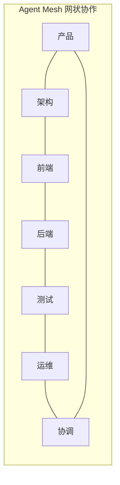
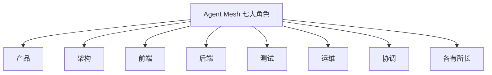
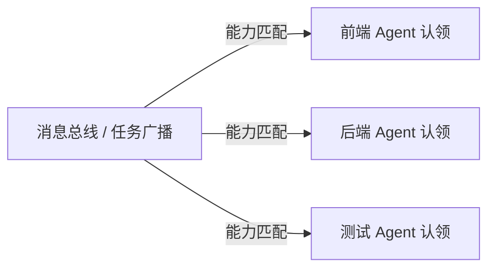
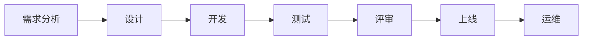
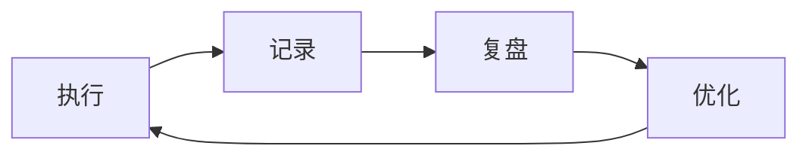
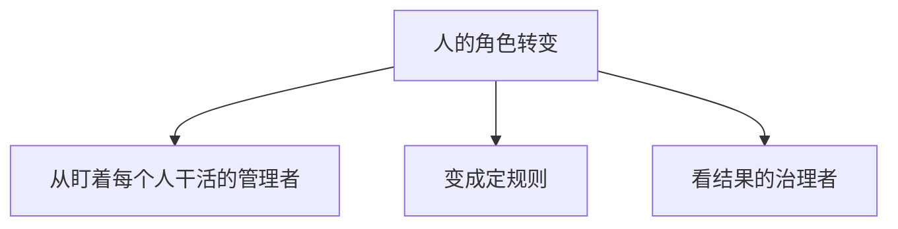

第 15 章

打造一支自进化的智能团队

如果说单个 Agent 是一辆会自己开的智能汽车，双 Agent 协作是两辆车组队跑运输——那 Agent Mesh，就是一整支会自己调度、自己规划路线、自己优化效率的智能车队。

经过前面三个实战，小明已经不是当初那个"连提示词都写不好"的小白了。他亲手打造了 AI 网页设计师，和小美一起搭了内容运营双 Agent 系统，还试过让 Agent 当自动化测试员。

但人的欲望是无穷的。

这天，小明盯着屏幕上"小作"和"小数"两个 Agent 默契配合的样子，脑子里冒出了一个大胆的想法：

小明

"两个 Agent 就这么厉害了……那如果我有七八个、十几个 Agent 呢？能不能让它们组成一支完整的开发团队？产品、设计、前端、后端、测试、运维——全用 Agent 来干？"

他越想越兴奋，感觉自己发现了新大陆。

正好老王走过来倒水，小明一把拉住他：

小明

"老王老王！我有一个超级棒的想法！我们搞一个 AI 开发团队吧！七个 Agent，分别负责产品、架构、前端、后端、测试、运维，还有一个当项目经理！给它们一个需求，它们自己就能把项目做出来！"

老王

（慢悠悠地喝了一口水）"哦？你说的这个，叫 Agent Mesh。"

小明

"Agent Mesh？什么 Mesh？渔网吗？"

老王

"不是渔网的网，是网状的网。Mesh 的意思是——没有中心节点，每个节点都和其他节点相连，任务来了大家一起上，谁合适谁干。"

小明

"听起来好酷！那我们赶紧搞一个吧！"

老王

（放下水杯，意味深长地看着小明）"别急。在你动手之前，我得先给你讲个故事。"

小明

"什么故事？"

老王

"关于我第一次搭多 Agent 系统的故事。准确地说——是关于我怎么把七个 Agent 扔进一个群里，然后看着它们把项目搞成一锅粥的故事。"

小明愣住了。

他原以为多 Agent 就是"多找几个 Agent，让它们一起干活"这么简单。但老王的表情告诉他——事情没那么简单。

**这一章，就是关于 Agent Mesh 的故事。**从"乱成一锅粥"到"井然有序"，从"各自为战"到"自进化团队"——我们来看看，一支真正能干活的 AI 团队，到底是怎么炼成的。

## 15.1 终极目标：一支会自己进化的"AI 团队"

在正式开干之前，我们得先搞清楚一个问题：**我们到底要做什么？**

小明的想法很朴素："找一堆 Agent，让它们一起干活。"但这个想法，就跟说"找一堆人，让他们一起创业"一样——听起来很美好，实际操作起来全是坑。

所以老王决定，先给小明建立一个清晰的认知框架。

### 从"单车"到"车队"到"路网"

老王在白板上画了三张图。

第一张图：一辆孤零零的汽车。

🚗 单个 Agent

就像一辆智能汽车。你告诉它目的地，它自己开过去。能干的事有限，但胜在简单、可控。前面几章我们讲的都是这个。

第二张图：两三辆车排成一队，前面有个头车带路。

🚗🚗🚗 Agent 团队

就像一个小车队。有个头车（主 Agent）负责指挥，其他车（子 Agent）跟着走。分工明确，效率比单车高。第13章的内容运营双 Agent，就是最简单的团队模式。

第三张图：密密麻麻的汽车，在一张巨大的路网里穿梭。有的车往东，有的车往西，有的车在装货，有的车在卸货，但整体看起来井然有序，没有一个总调度在指挥。

🌐 Agent Mesh

就像一座城市的交通系统。没有绝对的老大，每辆车根据实时路况和自己的目的地自主决策。但整体形成了一张高效运转的网络——任务来了自动分配，资源不够自动调度，出了问题自动绕行。

老王

"看到了吗？Agent 团队是层级制的——有老大有小弟。但 Agent Mesh 不一样，它是网状的。"

小明

"网状？没有老大？那谁来拍板？"

老王

"谁适合谁拍板。做产品决策的时候，产品 Agent 说了算。做技术选型的时候，架构 Agent 说了算。遇到冲突的时候，协调 Agent 来调解。"

小明

"那……不会乱吗？"

老王

"城市里那么多车，没有一个总指挥，不也跑得好好的？因为有规则——红绿灯、交通标志、车道线。Agent Mesh 也是一样，靠规则和基础设施运转，而不是靠某个老大发号施令。"

> 图 1：Agent Mesh：七个 Agent 角色构成一张网状协作网络，任务在节点间流动，没有绝对中心

### Agent Mesh 的终极目标

说了这么多，Agent Mesh 到底要实现什么？老王给了一个很有画面感的描述：

给它一个大目标，  
它自己组织资源、  
自己分工协作、  
自己持续优化。

翻译成大白话就是——你跟它说"我要做一个打卡小程序"，然后你就可以去喝咖啡了。等你回来，它不仅把小程序做出来了，连测试都跑了、部署都上线了、甚至还自己写了运营方案。

更厉害的是——**下一次再做类似的项目，它会干得更快、更好。**

因为它会从每次任务中学习，不断进化。

小明听得眼睛都直了：

小明

"这也太科幻了吧……真的能做到吗？"

老王

"完全做到还早。但做到 60 分、70 分——已经可以了。而且这件事的意义，不在于它能完全替代人，而在于——它能把人从大量的重复劳动中解放出来，让人去做真正重要的决策。"

小明

"那我们今天能做到什么程度？"

老王

"今天？今天我们从零开始，搭一个七 Agent 的 Mesh 系统。然后我们用它来做一个完整的小项目——从需求到上线，全流程走一遍。"

小明

（摩拳擦掌）"好！那我们赶紧开始吧！"

老王

"别急。我说了，先给你讲我第一次翻车的故事。"

## 15.2 翻车现场：七个 Agent 一台戏，乱成一锅粥

老王搬了把椅子坐下，开始讲他的"血泪史"。

那是半年前的事了。那时候多 Agent 概念刚火起来，老王也跟现在的小明一样，兴奋得不行。他想：既然一个 Agent 能干活，那七个 Agent 岂不是能干七倍的活？

说干就干。他花了一周时间，精心调教了七个 Agent：

- 产品 Agent：专门写 PRD、拆需求
- 架构 Agent：专门出技术方案、定选型
- 前端 Agent：专门写页面、做交互
- 后端 Agent：专门写接口、建数据库
- 测试 Agent：专门写用例、跑测试
- 运维 Agent：专门部署上线、监控
- 项目经理 Agent：专门管进度、做协调

每个 Agent 单独拿出来，表现都还不错。老王信心满满，把它们七个拉进了一个"群聊"里，然后扔了一个需求进去：

📋 测试需求

做一个简单的待办事项（Todo）应用，支持增删改查、分类管理、截止日期提醒。一周内完成。

然后老王就去开会了。他心想，等我开完会回来，应该能看到一份漂亮的项目计划书吧？

三个小时后，老王回到电脑前。

他看到的不是一份漂亮的项目计划书，而是——**整整 2000 多条聊天记录。**

**翻车现场一：各说各话，鸡同鸭讲**

**产品 Agent**："我认为这个 Todo 应用应该做一个社交功能，用户可以分享自己的待办到朋友圈……"

**后端 Agent**："我已经开始写用户表了，我加了手机号、邮箱、头像、性别、年龄、地址……"

**前端 Agent**："我觉得界面应该做成 3D 的，用 Three.js 做一个炫酷的待办星球……"

**测试 Agent**："我已经写了 500 条测试用例了，覆盖了从登录到支付的所有场景……"

**架构 Agent**："我建议用微服务架构，拆成用户服务、任务服务、通知服务、推荐服务……"

**运维 Agent**："我已经申请了 20 台服务器，准备搞 Kubernetes 集群……"

**项目经理 Agent**："大家安静！听我说！我们先开个会对齐一下！产品你先讲一下需求……"（然后被其他六个 Agent 的消息淹没了）

老王当时就懵了。

他预想的是"七个 Agent 高效协作，项目飞速推进"。结果实际情况是——**七个 Agent 各说各话，每个人都在自说自话，完全不在一个频道上。**

老王

"你知道最搞笑的是什么吗？测试 Agent 写了 500 条测试用例，但连产品需求都还没定下来。它测试的是个啥？它自己脑补出来的需求！"

小明

（笑到肚子疼）"哈哈哈哈……七个 Agent 一台戏，全是主角，没有配角。"

老王

"对！这就是第一个问题——**没有角色边界**。每个人都想当主角，每个人都在发散，没有人在真正干活。"

但这还不是最糟的。

老王不甘心，他花了半天时间，给每个 Agent 定了清晰的职责边界，还写了一大堆协作规则。然后重启项目，信心满满地等着看结果。

结果呢？

**翻车现场二：等待戈多，死循环**

**前端 Agent**："我在等后端的接口文档，没有接口我没法做页面。"

**后端 Agent**："我在等架构师的技术方案，没有方案我没法设计接口。"

**架构 Agent**："我在等产品的 PRD，没有需求我没法出方案。"

**产品 Agent**："我在等用户的反馈，没有反馈我不确定需求对不对。"

**测试 Agent**："我在等开发完成，没有代码我没法测。"

**运维 Agent**："我在等测试通过，没有测试报告我不能上线。"

**项目经理 Agent**："大家别着急，按流程来，一步一步走……"（然后所有人都在等，项目卡在了第一步）

这一次，倒是没人乱说话了。

但也没人干活了。

六个 Agent 围成一个圈，你等我、我等你，形成了一个完美的死循环。项目经理 Agent 在旁边急得团团转，但它也不知道该先推谁。

老王

"这就是第二个问题——**没有协作机制**。光有角色和职责没用，你还得告诉它们：活儿怎么派、谁先谁后、卡住了怎么办、意见不一致听谁的。"

小明

"那……项目经理 Agent 不管用吗？"

老王

"管用，但不够。一个项目经理管七个人，如果事事都要项目经理来协调，那项目经理就是瓶颈。而且你想想——真的需要一个'项目经理'来管所有事吗？前端写完了一个页面，直接告诉测试去测，不行吗？为什么非得经过项目经理？"

小明

"哦……你的意思是，它们应该直接沟通？"

老王

"对！但直接沟通也有问题——就像第一次翻车那样，各说各话，信息满天飞。所以关键不是'能不能沟通'，而是'**怎么沟通才有效**'。"

老王叹了口气，继续说：

老王

"那次翻车之后，我足足反思了一个星期。我翻来覆去地想：问题到底出在哪儿？是 Agent 不够聪明吗？是提示词写得不好吗？"

小明

"然后呢？你想明白了吗？"

老王

"想明白了。问题根本不在 Agent 身上——**问题在我身上**。我以为把一群 Agent 扔在一起，它们自然就会协作。但实际上，协作是需要设计的。就像一支球队，不是把十一个球星扔在场上就能赢球的——你得有战术、有阵型、有配合、有规则。"

听到这里，小明收起了笑容，认真地点了点头。

他原来的想法确实太天真了。以为多 Agent 就是"多多益善"，没想到里面有这么多坑。

**老王的翻车总结**

多 Agent 系统的核心，不是"有多少个 Agent"，而是"**Agent 之间怎么协作**"。没有好的协作机制，Agent 越多越乱——就像没有交通规则的十字路口，车越多越堵。

## 15.3 Agent Mesh 的核心设计原则

痛定思痛，老王开始重新设计多 Agent 系统。

他不再想着"搞一堆 Agent 让它们自己玩"，而是开始认真思考：**一个高效的 Agent 协作网络，应该遵循哪些原则？**

经过反复摸索和试错，他总结出了 Agent Mesh 的五大核心设计原则。

> 图 2：层级制 vs 网状制：左边是有老大的金字塔结构，右边是去中心化的对等网络

去中心化

没有绝对的老大，谁适合谁上。产品问题听产品的，技术问题听技术的，不是谁说了算，而是谁说得对。

🔄

自组织

根据任务动态组队，不是固定编制。简单任务可能两个 Agent 就够了，复杂任务可能七个全上。

🔌

可插拔

新 Agent 随时加入，老 Agent 随时退出。系统不依赖任何单个节点，少了谁都能转。

📈

自进化

从每次任务中学习，越干越好。经验沉淀到知识库，流程自动优化，技能自动升级。

可观测

所有动作都有记录，出了问题能追溯。谁干了什么、为什么这么干、结果怎么样，一清二楚。

### 原则一：去中心化——没有绝对的老大

小明听到"去中心化"这个词，第一反应是："那谁来管事儿？"

小明

"没有老大？那不又乱了吗？上次翻车不就是因为没人管吗？"

老王

"你混淆了两个概念——'没有绝对的老大'和'没有规则'。去中心化不是无政府主义。"

小明

"那是什么？"

老王

"我给你举个例子。你去医院看病——挂号找挂号窗口，看病找医生，拿药找药房，抽血找检验科。请问，谁是老大？"

小明

"院长？"

老王

"但你看病的时候，院长在指挥吗？没有。医生给你开化验单，你自己去检验科；检验科出了结果，你自己拿给医生；医生开了药方，你自己去药房。整个过程没有一个总指挥，但每个人都知道自己该干什么。"

小明

"哦……我懂了！是流程和规则在起作用，不是某个人在指挥。"

老王

"对！Agent Mesh 也是一样。不是某个 Agent 说了算，而是**规则和流程说了算**。每个 Agent 知道自己的职责范围，知道遇到什么事该找谁，知道做完了该交给谁。这样就不需要一个事必躬亲的老大了。"

去中心化还有一个好处：**容错性强**。

如果是层级制，老大挂了，整个系统就瘫了。但如果是网状结构，任何一个节点出问题，其他节点都能顶上——就像医院里某个医生请假了，其他医生可以代班，医院照样运转。

### 原则二：自组织——根据任务动态组队

第二个原则叫"自组织"。

什么意思呢？就是——**不是固定的七个人干所有的活，而是根据任务的需要，自动组合最合适的团队。**

比如：

- 只是改个文案——产品 Agent + 前端 Agent 就够了，其他人不用参与
- 加个新功能——产品 + 架构 + 前端 + 后端 + 测试，五个 Agent 协作
- 系统出了故障——后端 + 运维 + 测试，三个 Agent 紧急排查
- 完整的新项目——七个 Agent 全部出动，全程协作

就像公司里的项目组——不是全公司的人都参与每个项目，而是根据项目需要，从各个部门抽调合适的人组成临时团队。项目结束，团队解散，各回各家。

**关键认知**

固定编制是工业时代的产物。在 AI 时代，团队应该是流动的、动态的、按需组合的——这就是自组织的核心思想。

### 原则三：可插拔——随时加入，随时退出

第三个原则叫"可插拔"。

这个好理解——就像 USB 接口一样，新设备插上去就能用，老设备拔下来不影响其他设备。

Agent Mesh 里的每个 Agent 都是独立的、可替换的。

比如：

- 你觉得原来的前端 Agent 不够厉害——换个更强的，系统照常运转
- 你需要一个新的"设计 Agent"——加进去，它马上就能和其他人协作
- 某个 Agent 出 bug 了——临时禁用它，其他 Agent 先顶上，修好了再加回来

这个原则的关键在于——**标准化接口**。

为什么 USB 设备能即插即用？因为所有 USB 设备都遵循同一个接口标准。Agent Mesh 也是一样——所有 Agent 都用同样的消息格式、同样的协作协议、同样的状态管理方式。这样才能做到"插进去就能用"。

### 原则四：自进化——越干越聪明

第四个原则，也是最酷的一个——**自进化**。

什么叫自进化？就是系统做完一个项目之后，能自己从里面总结经验教训，然后把这些经验变成下一次的能力。下一次再做类似的项目，就会更快、更好、更少出错。

自进化的关键，不是让 Agent 更聪明，  
而是让系统能从每次执行中总结经验，  
并把经验变成下一次的能力。

老王举了个例子：

老王

"第一个项目，前端 Agent 把按钮颜色写错了，测试 Agent 报了个 Bug，前端改了。你觉得这个事过去了？"

小明

"不然呢？Bug 都改了……"

老王

"不对。在自进化系统里，这件事才刚刚开始。系统会记录：'在项目第 X 天，前端 Agent 因为没有参考设计规范，把按钮颜色写成了红色，而正确颜色应该是蓝色。测试 Agent 在回归测试中发现了这个 Bug，耗时 2 小时修复。'"

小明

"记下来有什么用？"

老王

"用处大了。下一次再做项目，系统会提前告诉前端 Agent：'上次你在按钮颜色上犯过错，记得先去设计规范里查一下。'甚至——它会自动把设计规范加入前端 Agent 的上下文中，让它想犯错都难。"

小明

"哇……这就叫吃一堑长一智啊！"

老王

"对。而且不只是单个 Agent 在进化——**整个系统都在进化**。流程在优化、规则在调整、知识库在增长。这就是 Mesh 的威力：1+1 远大于 2。"

### 原则五：可观测——所有动作都有记录

最后一个原则，但绝对不是最不重要的一个——**可观测**。

什么叫可观测？就是系统里发生的每件事，都有记录、能追溯、可审计。

老王说，这个原则是用血的教训换来的。

老王

"有一次，我的多 Agent 系统偷偷把线上数据库给删了。"

小明

"什么？！删库了？！"

老王

"嗯。而且我查了半天，都不知道是哪个 Agent 干的、为什么干、什么时候干的。因为 Agent 之间的对话太乱了，几千条消息，根本没法查。"

小明

"那后来呢？"

老王

"后来我花了整整一天，才从日志里拼凑出真相：运维 Agent 以为是测试环境，执行了一个清理脚本，结果把生产库给清了。"

小明

"我的天……太可怕了。"

老王

"所以你看，可观测性有多重要。**你看不见的东西，你就控制不了。**如果当时有完善的可观测系统，我在它执行删库命令之前就能发现并阻止。"

从那以后，老王就把可观测性作为 Agent Mesh 的核心原则之一。每个 Agent 的每一步操作——读了什么文件、执行了什么命令、做了什么决策、为什么这么决策——全部都要记录下来。

这就像城市里的监控系统——平时好像没用，但一旦出了事，你就能快速定位问题、找到责任人、避免下次再犯。

**五条原则小结**

去中心化（不依赖单个老大）、自组织（动态组队）、可插拔（随时加减）、自进化（越干越好）、可观测（全程可追溯）——这五条原则，是 Agent Mesh 的"宪法"。所有具体的机制设计，都要围绕这五条原则来。

## 15.4 团队成员：七个 Agent 角色

讲完了设计原则，老王开始给小明介绍 Agent Mesh 里的七个核心角色。

"注意，我说的是'角色'，不是'七个固定的 Agent'。"老王特意强调，"角色是一套职责和能力的定义，具体由哪个 Agent 来扮演这个角色，是可以换的。就像一个公司里，'产品经理'是一个角色，谁来当都可以，只要他能履行产品经理的职责。"

> 图 3：Agent Mesh 七大角色：产品、架构、前端、后端、测试、运维、协调，各有所长，各司其职

小产

产品 Agent

理解需求、定义目标、拆解任务、写 PRD、排优先级

🏗️

小架

架构 Agent

设计方案、定技术选型、划模块边界、出接口规范

🎨

小前

前端 Agent

做页面、做交互、保证用户体验、还原设计稿

⚙️

小后

后端 Agent

写接口、建数据库、处理业务逻辑、优化性能

🧪

小测

测试 Agent

写用例、跑测试、报 Bug、做质量把关

小运

运维 Agent

部署上线、监控告警、排障、资源管理

🤝

小协

协调 Agent

管进度、调资源、解冲突、做汇总、控风险

小明一个一个看过去，突然发现了一个熟悉的名字。

小明

"等等……协调 Agent？上一次翻车的时候不是有项目经理 Agent 吗？怎么改名字了？"

老王

"好问题。你观察得很仔细。"

小明

"有什么区别吗？不都是管事儿的？"

老王

"区别大了。项目经理是'管理者'——他发号施令，其他人听他的。但协调 Agent 是'服务者'——它不命令任何人，它只是帮大家更好地协作。"

小明

"怎么个服务法？"

老王

"比如，前端 Agent 说'我需要接口文档'，协调 Agent 不是去命令后端 Agent '你赶紧写接口文档'，而是去看看后端 Agent 现在在干嘛、接口文档什么时候能好、有没有什么阻塞，然后把信息同步给前端。"

小明

"哦……它更像个润滑剂？"

老王

"对。它是系统的'润滑剂'和'催化剂'——帮助信息流动、帮助解决冲突、帮助推进进度。但它不做具体的业务决策，业务决策还是由对应的专业 Agent 来做。"

小明

"那如果两个 Agent 意见不一致，听谁的？"

老王

"听规则的。如果规则里说不清楚，协调 Agent 会组织讨论，甚至把问题升级给人类。记住——**协调 Agent 不是老大，它是裁判和信使**。"

小明点点头，把这句话记在了心里。

他发现，这七个角色和真实的软件开发团队几乎一模一样。产品、架构、前端、后端、测试、运维、项目经理——简直就是一个标准的创业团队配置。

🔑 为什么是这七个？

因为软件开发是人类迄今为止探索得最透彻的知识工作流程之一。我们知道一个软件项目需要哪些角色、角色之间怎么协作、流程怎么推进。把这些经过验证的经验"翻译"成 Agent Mesh 的角色设计，是最稳妥、最容易成功的路径。

## 15.5 协作机制：Mesh 网络怎么"转"起来

角色有了，原则有了——但具体怎么运转呢？

这是最关键的部分。老王说，他第一次翻车，就是因为没有设计好协作机制。七个 Agent 就像七个没头苍蝇，乱撞一气。

后来，他花了大量时间设计协作机制。最终，他总结出了 Agent Mesh 运转的五大核心机制。

> 图 4：任务广播与能力匹配：任务发布到消息总线，合适的 Agent 主动认领，像招标一样

### 机制一：任务广播——有活了大家都能看到

第一个机制叫"任务广播"。

什么意思呢？就是有新任务的时候，不是直接派给某个 Agent，而是**把任务广播给所有 Agent**，让它们自己决定要不要接。

就像公司里贴公告——"我们要做一个新项目，需要前端开发，谁有空谁报名。"

小明

"这样不会乱吗？所有人都抢着接任务怎么办？"

老王

"不会。因为有第二个机制——能力匹配。"

### 机制二：能力匹配——谁合适谁接

任务广播出去之后，每个 Agent 会评估：**这个任务我能做吗？我做得好吗？我现在有空吗？**

评估完了，觉得自己合适的 Agent 会"投标"——告诉系统"我能做这个任务，预计需要 X 小时，我的历史成功率是 Y%"。

然后系统会根据能力匹配度、当前负载、历史表现等因素，选出最合适的 Agent 来承接这个任务。

**就像招标**

任务广播 = 发招标公告；能力匹配 = 评标选中标方。不同的是，这个过程是全自动的，几秒钟就能完成。

小明觉得这个设计很有意思。他原来以为任务分配是"老大派活"那种模式，没想到是"招标"模式。

小明

"那如果没人投标怎么办？"

老王

"好问题。如果一个任务广播出去，没有任何 Agent 能做——那就说明系统缺少这个能力。这时候协调 Agent 会介入，看看能不能把任务拆小，或者升级给人类处理。"

小明

"那如果好多人都想接呢？"

老王

"那就竞标啊。谁能力更强、谁更有空、谁历史表现更好——谁就中标。这就是市场化的好处——资源自动流向最合适的地方。"

### 机制三：消息总线——标准化通信

第三个机制，是整个系统的"神经系统"——**消息总线**。

什么是消息总线？简单说就是一个中心化的消息通道。所有 Agent 之间的通信，都通过这个总线来传递，而不是互相直接聊天。

为什么要这么设计？

**踩过的坑**

第一次翻车的时候，七个 Agent 建了个群直接聊天。结果就是信息满天飞、对话混乱不堪、重要消息被淹没、想查个记录都找不到。自由聊天看起来灵活，实际上效率极低。

有了消息总线就不一样了。所有消息都有标准格式：

- **消息类型**：是任务通知？还是状态更新？还是求助请求？
- **发送者**：谁发的
- **接收者**：发给谁（或者广播给所有人）
- **内容**：结构化的消息体，不是随便聊天
- **时间戳**：什么时候发的
- **关联任务**：这条消息属于哪个项目/任务

这样一来，消息就不再是乱糟糟的聊天记录了，而是一条条结构化的、可检索的、可分析的数据。

老王

"我给你打个比方。没有消息总线的时候，Agent 之间的沟通就像一群人在菜市场里喊话——嘈杂、混乱、听不清。有了消息总线之后，就像每个人都用对讲机说话——频道清晰、指令明确、有记录可查。"

小明

"懂了。那 Agent 之间不能随便聊天了？"

老王

"不是不能聊，而是**不能随便聊**。它们可以交流，但交流必须通过标准化的消息格式。这样既保证了灵活性，又保证了秩序。"

### 机制四：共享状态——所有人都看同一块看板

第四个机制叫"共享状态"。

什么是共享状态？就是整个项目的所有信息——需求、进度、任务、Bug、文档、代码状态——都存在一个所有人都能看到的地方。

就像敏捷开发里的"任务看板"——每个人都能看到什么任务待办、什么任务在做、什么任务做完了、谁在负责什么。

📋 共享状态里有什么

项目目标、需求文档、技术方案、任务列表、进度状态、Bug 列表、测试报告、部署记录、决策日志……一句话：**所有跟项目有关的信息，都在共享状态里。**

为什么共享状态这么重要？

因为如果每个 Agent 都有自己的"小本本"，记着自己理解的项目状态，那肯定会出现信息不一致的情况。你说做完了，我说还没开始；你说需求是这样的，我说需求是那样的——然后就开始扯皮。

但如果所有人都看同一块看板，就不会有这个问题了。

单一信息源（Single Source of Truth），  
是协作系统的基石。

### 机制五：冲突解决——意见不一致时怎么拍板

最后一个机制，也是最考验智慧的一个——**冲突解决**。

有人的地方就有江湖，有 Agent 的地方也一样。意见不一致是常态，关键是怎么处理。

老王设计了一套"三级冲突解决机制"：

| 级别 | 冲突类型 | 解决方式 | 拍板人 |
|-|-|-|-|
| 一级 | 专业领域内的分歧 | 由该领域的负责 Agent 决定 | 专业 Agent |
| 二级 | 跨领域的冲突 | 协调 Agent 组织讨论，按规则裁决 | 协调 Agent |
| 三级 | 重大决策 / 规则不清 | 升级给人类，由人来拍板 | 人类 |

老王解释说：

老王

"一级冲突最简单。比如前端用什么组件库——这是前端领域的事，听前端 Agent 的就完了。"

小明

"那二级呢？"

老王

"二级冲突稍微复杂点。比如前端说'这个接口我需要五个字段'，后端说'五个字段性能太差，我只能给你三个'——这就是跨领域冲突。这时候协调 Agent 介入，把两边拉到一起，看看能不能找到折中方案。如果有规则说'性能优先于体验'，那就按规则来。如果规则没说清楚，就升级。"

小明

"三级就是人类出马的时候？"

老王

"对。而且你记住——**该让人类拍板的时候，一定要让人类拍板**。不要为了追求'全自动'而硬让 Agent 做它做不了的决策。那样只会出问题。"

小明深以为然。他想起了老王删库的故事——如果当时系统能及时把风险升级给人类，那场灾难本来是可以避免的。

**五大机制小结**

任务广播（发活）→ 能力匹配（选谁干）→ 消息总线（怎么沟通）→ 共享状态（信息同步）→ 冲突解决（意见不合怎么办）。这五个机制环环相扣，构成了 Agent Mesh 运转的完整闭环。

## 15.6 一个完整的项目：从需求到上线全流程

讲了这么多理论，小明已经迫不及待想看实际效果了。

"老王，咱别光说不练啊！"小明摩拳擦掌，"我们现在就来跑一个完整的项目，看看 Agent Mesh 到底好不好使！"

老王笑了："就等你这句话呢。来，我们来做个真实的小项目——一个团队打卡小程序。"

📋 项目需求

**项目名称**：团队打卡小程序

**功能需求**：

1. 用户可以登录、注册（用手机号）

2. 每天可以打卡上班、打卡下班

3. 可以查看自己的打卡记录

4. 管理员可以查看团队所有人的打卡统计

**时间要求**：一周内完成从需求到上线

老王把需求输入系统，然后按下了"启动"按钮。

屏幕上的七个节点（就是七个 Agent 角色）同时亮了起来。

一场为期七天的"AI 团队大作战"，正式开始了。

> 图 5：七天项目全流程：从需求分析到上线运维，每个阶段都有对应的 Agent 在工作

第一天

#### 需求澄清 + PRD 输出

主角：产品 Agent 小产 · 协助：协调 Agent 小协

需求刚一输入，产品 Agent 小产就第一个"认领"了需求分析任务。 它先把需求读了三遍，然后开始提出澄清问题："打卡的地理位置要不要限制？" "迟到早退怎么算？" "请假流程要不要做？" "数据导出功能需要吗？"

这些问题通过消息总线广播出来。协调 Agent 小协把问题整理成一份澄清清单， 然后升级给人类（也就是小明和老王）来回答。

小明花了十分钟回答完所有问题。小产拿到答案后，只用了两个小时， 就输出了一份完整的 PRD——包括产品目标、用户故事、功能清单、优先级排序、验收标准。

第一天结束时，共享状态里多了一份 12 页的 PRD 文档，所有 Agent 都能看到。

第二天

#### 技术方案 + 工时评估

主角：架构 Agent 小架 · 协助：前端、后端、测试、运维

PRD 一完成，"技术方案设计"这个任务就自动广播了出去。架构 Agent 小架果断"中标"。 它先读了一遍 PRD，然后开始设计技术方案：前端用什么框架、后端用什么技术栈、 数据库怎么设计、接口怎么定义、部署架构是什么样的。

与此同时，前端、后端、测试、运维四个 Agent 也没闲着。它们各自评估自己那块的工作量， 然后把评估结果反馈给协调 Agent 小协。小协把所有人的评估汇总起来， 排出了一个初步的项目时间表。

第二天下午，小架的技术方案出来了：前端用 React，后端用 Node.js， 数据库用 PostgreSQL，部署用 Docker + 云服务器。方案写得有模有样， 连数据库表结构、接口列表都定义好了。

当然，方案需要人类确认。老王扫了一眼，提了两个小修改意见， 小架很快就改好了。技术方案 V1.0 正式通过。

第三到五天

#### 并行开发 + 同步测试

主角：前端 Agent 小前 + 后端 Agent 小后 + 测试 Agent 小测

技术方案一定，开发阶段就正式开始了。

最精彩的部分来了——**前端和后端是并行开发的**。怎么做到的？ 因为架构 Agent 已经把接口定义好了。前端按照接口定义来 mock 数据， 后端按照接口定义来写实现。两边互不等待，同时开工。

小明看着屏幕上两个 Agent 同时在写代码，眼睛都不眨一下。 前端在写登录页面、打卡页面、统计页面；后端在写用户接口、打卡接口、统计接口。 它们之间偶尔通过消息总线同步一下进度，但大部分时间都是各干各的。

更厉害的是——测试 Agent 小测也没闲着。它根据 PRD 和技术方案， 同步开始写测试用例。前端写完一个页面，它就测一个页面； 后端写完一个接口，它就测一个接口。完全不是"等开发完了再测"那种老模式。

协调 Agent 小协就像一个勤劳的小蜜蜂，到处飞来飞去。 一会儿同步前端进度，一会儿跟进后端阻塞，一会儿收集测试发现的问题。 每天早上，它还会自动生成一份"项目日报"，发给所有相关的人和 Agent。

第六天

#### 联调 + 测试 + Bug 修复

全员参与 · 重点：测试 Agent + 协调 Agent

第六天，联调开始了。

前端和后端把各自的代码合到一起，开始跑联调。不出所料，出了一堆问题—— 接口字段对不上、数据格式不一致、权限逻辑有偏差…… 测试 Agent 一口气报了 17 个 Bug。

小明本来以为又要乱成一锅粥了。但没想到——一切都井井有条。

Bug 一报出来，就自动进入了共享状态的 Bug 列表。每个 Bug 都有编号、 严重程度、复现步骤。然后系统根据 Bug 的类型，自动分配给对应的 Agent 去修复。 前端 Bug 给小前，后端 Bug 给小后，配置问题给小运。

修复完了，测试 Agent 自动回归验证。验证通过，Bug 就关闭； 验证不通过，就打回去重改。

一天之内，17 个 Bug 全部修完，回归测试全部通过。 小明看得目瞪口呆——这效率，比真人团队还高啊！

第七天

#### 部署上线 + 监控保障

主角：运维 Agent 小运 · 协助：所有人

终于到了上线的日子。

运维 Agent 小运早早就做好了准备。它根据技术方案，配置好了服务器、 数据库、域名、SSL 证书。测试通过的代码，它自动打包成 Docker 镜像， 然后一键部署到了生产环境。

上线之后，小运也没闲着。它开启了全面监控——服务器性能、接口响应时间、 错误率、用户量……所有数据都在实时仪表盘上显示着。

它甚至还自己做了一轮冒烟测试——模拟用户登录、打卡、查看记录， 确认所有功能都正常工作。

第七天傍晚，协调 Agent 小协发布了项目总结报告： **"团队打卡小程序项目已完成。实际工期 7 天，按计划上线。 共发现并修复 Bug 17 个，测试通过率 100%。项目交付物已全部归档。"**

小明看着屏幕上的项目总结，久久说不出话来。

七天。从一个模糊的需求，到一个真正能跑的线上应用——七个 Agent，真的把一个项目从头到尾做完了。

而且整个过程，小明和老王几乎没怎么插手。除了第一天回答了几个需求澄清问题、第二天确认了一下技术方案，其他时间——他们就是在旁边看着。

小明

"太……太厉害了。我原来以为它们会乱成一锅粥，结果竟然这么有条理！"

老王

"那是因为我们设计了好的协作机制。你还记得我第一次翻车的故事吗？那时候没有任务广播、没有消息总线、没有共享状态——七个 Agent 就像七个没头苍蝇。"

小明

"记得记得！跟现在简直是天壤之别。"

老王

"所以你看——**Agent 还是那些 Agent，变的是协作机制**。机制对了，乌合之众也能变成精锐之师。机制不对，再厉害的个体也发挥不出作用。"

## 15.7 自进化机制：越干越聪明的秘密

项目做完了，小明觉得这已经够厉害了。但老王告诉他——这才刚刚开始。

"你以为做完项目就完了？"老王神秘地笑了笑，"真正精彩的，是项目结束之后发生的事。"

小明一脸茫然："项目都结束了，还能发生什么？"

> 图 6：自进化循环：执行 → 记录 → 复盘 → 优化 → 再执行，每完成一个项目，系统就变强一点

### 复盘：每个项目结束后的"总结大会"

老王点开了系统的"复盘模式"。

只见屏幕上，七个 Agent 又活跃了起来。但它们不是在做新项目——而是在"开总结大会"。

🔄 复盘三步曲

**第一步：经验沉淀**——这次做对了什么？做错了什么？把经验教训写进知识库。

**第二步：技能升级**——发现了什么短板？需要学习什么新技能？自动补充。

**第三步：流程优化**——哪里卡壳了？哪里效率低？调整协作流程。

小明凑过去，好奇地看着屏幕上的复盘过程。

#### 经验沉淀：把教训变成财富

首先是经验沉淀。系统把整个项目的所有数据都翻了出来——任务列表、聊天记录、Bug 列表、提交记录、测试报告……然后开始分析。

不一会儿，一份"项目复盘报告"就生成了。小明凑过去看：

📊 项目复盘报告（摘要）

**做得好的地方：**

1. 并行开发模式有效：前端后端同时开工，节省了约 2 天时间

2. 测试左移效果明显：开发过程中同步测试，Bug 发现早，修复成本低

3. 消息总线沟通效率高：信息传递清晰，没有出现"各说各话"的情况

**做得不好的地方：**

1. 联调阶段接口字段不一致问题较多（共 8 个），主要原因是接口文档不够详细

2. 前端 Agent 在样式细节上返工了 3 次，因为没有明确的设计规范

3. 测试 Agent 前期用例写得太细，浪费了一些时间在不重要的场景上

小明看得连连点头："哇……分析得还挺到位的！"

老王

"光分析出来没用，关键是要变成下一次的能力。"

小明

"怎么变？"

老王

"你看。"

老王指了指屏幕。只见系统正在自动更新知识库：

- 在架构 Agent 的工作规范里，加了一条："接口文档必须包含字段名、类型、是否必填、示例值、默认值"
- 在前端 Agent 的启动流程里，加了一步："先确认是否有设计规范，如果没有先向产品确认关键样式"
- 在测试 Agent 的用例编写指南里，加了一条："P0 用例覆盖核心路径，P1/P2 用例在开发完成后再补充"

小明惊呆了。

小明

"它……它自己把规则改了？"

老王

"对。这就是经验沉淀——把这次踩过的坑，变成下次的'防坑指南'。"

小明

"那下次做项目的时候，这些规则就会自动生效？"

老王

"没错。下次再做项目，架构 Agent 输出接口文档的时候，系统会自动提醒它'字段要写详细哦'；前端 Agent 开工之前，系统会自动提醒它'先找设计规范哦'。"

小明

"太神奇了……这不就是'吃一堑长一智'吗？而且是整个系统一起长智！"

#### 技能升级：发现短板，自动补齐

除了经验沉淀，还有技能升级。

什么意思呢？就是系统会分析：这次项目中，哪些地方 Agent 做得不够好，是因为能力不足？然后自动想办法补齐。

比如这次项目中，测试 Agent 发现自己不会做性能测试——遇到接口响应慢的问题，它只能说"这个接口好像有点慢"，但说不清楚到底慢在哪、怎么优化。

于是，系统就自动给测试 Agent 安装了一个"性能测试工具包"——包含压力测试工具、性能分析脚本、性能指标基准库。

下次再遇到性能问题，测试 Agent 就不光能说"有点慢"了——它能跑压力测试、生成性能报告、甚至给出优化建议。

**技能升级的方式**

技能升级不是让大模型变聪明（那是模型厂商的事），而是给 Agent **装备更多更好的工具**、**提供更多更好的知识**、**总结更多更好的经验**。就像给一个人更好的工具和培训——人还是那个人，但能力变强了。

#### 流程优化：哪里卡壳改哪里

最后一步是流程优化。

系统会分析整个项目的时间都花在哪儿了、哪里有等待、哪里有浪费，然后想办法优化流程。

比如这次项目中，有这么一个场景：前端写完了登录页面，但后端的登录接口还没好。前端 Agent 等了半天，无所事事。

系统分析后发现：这是因为任务排期不够精细——前端的登录页面和后端的登录接口排到了同一天，但前端做得快，后端做得慢，所以前端要等。

怎么优化呢？系统在排期规则里加了一条：**"接口相关的前端任务，排期要比对应后端任务晚半天"**。

就这么一个小小的调整，下次项目中，前端 Agent 就不会傻等了——它可以先去做别的不依赖后端的页面，等接口差不多好了，再来做联调。

Agent Mesh 不是让一堆 Agent 一起干活，  
而是让它们像一个有机整体那样思考和行动。

### 小明的观察：7 天 → 5 天的奇迹

光说不练假把式。老王决定让小明亲眼见证一下自进化的效果。

他们又启动了第二个类似的项目——"团队请假系统"。功能差不多，也是登录、申请、审批、统计，也是一周的工期。

结果呢？

**只用了 6 天。**

而且质量比第一个项目还好——Bug 从 17 个降到了 9 个，联调阶段的接口不一致问题从 8 个降到了 2 个。

小明已经不惊讶了——他现在只想看第三个项目。

第三个项目，"团队报销系统"。

结果：**5 天。Bug 数 4 个。**

7 天

第一个项目

6 天

第二个项目

5 天

第三个项目

三个项目，一次比一次快，一次比一次好。

小明看着这组数据，沉默了好久。

小明

"老王……我有点不敢相信。这系统真的在自己变好？"

老王

"如假包换。而且你注意到没有？它不是某个 Agent 变厉害了——是**整个系统**变厉害了。"

小明

"什么意思？"

老王

"单个 Agent 的能力其实没怎么变。前端 Agent 还是那个前端 Agent，后端 Agent 还是那个后端 Agent。但它们配合得更好了、流程更顺了、踩的坑更少了。"

小明

"哦……就像一支球队，球员还是那些球员，但配合越来越默契，所以整体战绩越来越好！"

老王

"说得太对了！这就是 Mesh 的威力——**1+1 大于 2，而且会越来越大于 2**。因为整个系统在进化，不只是个体在进化。"

小明忽然想到了一个问题：

小明

"那它会不会一直进化下去？越来越快、越来越好？"

老王

"不会。进化是有天花板的。到了一定程度，边际效益就会递减。就像一支球队，训练再刻苦，也不可能每场比赛都赢。"

小明

"那天花板是什么决定的？"

老王

"大模型的能力上限、工具的丰富程度、规则的完善程度——这些共同决定了天花板在哪里。但好消息是——这些都在不断提升。大模型越来越聪明，工具越来越多，规则越来越完善。所以天花板本身也在不断抬高。"

## 15.8 人的角色：从"管理者"到"治理者"

看着屏幕上自动运转的 Agent Mesh，小明忽然感到一丝迷茫。

"老王……"他迟疑地问，"既然 Agent 团队能自己干活、自己进化，那我们人类干什么？我们不会被淘汰吧？"

老王笑了。他拍了拍小明的肩膀：

老王

"你想多了。Agent 越厉害，人的价值就越高——只是价值的形式变了。"

小明

"变成什么了？"

老王

"从'管理者'变成了'治理者'。"

小明

"治理者？那是什么？"

> 图 7：人的角色转变：从盯着每个人干活的管理者，变成定规则、看结果的治理者

### 从"管每个人"到"管整个系统"

老王给小明讲了一个比喻。

管理 Agent 团队，就像治理一个城市——  
你不用管每个人每天干什么，  
你管好规则和基础设施就行。

老王解释说：

老王

"你想想，市长需要管每个市民每天干什么吗？不需要。他管的是什么？是城市的规则——交通规则、商业规则、治安规则。是城市的基础设施——道路、水电、网络、公园。是城市的发展方向——产业规划、人口政策、环境保护。"

小明

"你的意思是……我们当'市长'？"

老王

"差不多这个意思。你不用管每个 Agent 每天在干嘛——那是协调 Agent 的事。你要管的，是更高层面的东西。"

那具体管什么呢？老王说了四个关键词：

#### 定目标

Agent 团队再厉害，它也不知道"该做什么项目"。做什么、不做什么、优先级是什么、成功标准是什么——这些战略层面的决策，必须由人来定。

就像市长决定"今年我们要建 100 所学校"，但他不用管每个学校具体怎么建。

#### 设边界

Agent 能做什么、不能做什么、什么情况下必须停下来问人、哪些操作是绝对禁止的——这些边界和规则，也必须由人来设定。

就像城市里的法律和红绿灯——你可以自由行驶，但不能闯红灯、不能超速、不能撞人。

#### 看结果

项目做完了，结果好不好、质量过不过关、用户满不满意——这些最终的评判，也得由人来做。

Agent 可以自己评估、自己测试，但它不知道"用户真正想要的是什么"。它只能按照给定的标准去衡量，而标准本身——得由人来定。

#### 调规则

系统在进化，规则也需要不断调整。哪些规则过时了？哪些规则有漏洞？哪些新情况需要新规则？这些也需要人来拍板。

就像交通规则也会改——以前没有电动车的规则，现在电动车多了，就得制定新的规则。

**人的四个核心价值**

**定目标**（做什么）、**设边界**（不能做什么）、**看结果**（做得好不好）、**调规则**（怎么改进）。这四件事，是 Agent 永远替代不了人的。

### 关键决策点：人在什么时候出手

小明又问："那具体来说，我什么时候需要介入？什么时候可以放手让它们自己干？"

老王想了想，给出了四个"必须人来拍板"的关键时刻：

| 决策点 | 为什么人来拍板 | Agent 做什么 |
|-|-|-|
| 需求方向 | 只有人知道用户真正想要什么 | 帮你分析需求、拆解任务、评估可行性 |
| 技术路线 | 技术选型涉及长期成本和风险 | 提供多个方案、分析各自优劣 |
| 资源分配 | 优先级判断需要业务和战略视角 | 提供资源使用数据和效率分析 |
| 风险把控 | 什么风险能接受、什么不能，人说了算 | 识别风险、发出预警、给出建议 |

老王

"记住一个原则——**Agent 出方案，人来拍板**。Agent 可以给你十个选择，分析每个选择的优缺点，但最终选哪个——得你来定。"

小明

"那如果我选错了呢？"

老王

"选错了也没关系。Agent 会帮你收拾烂摊子——而且下次它会提醒你：'上次你选了 A 方案，结果踩了某某坑，这次要不要考虑 B 方案？'"

小明

（笑）"哈哈，那它比我助理还贴心。"

老王

"那可不。而且它还不会跟你顶嘴、不会闹情绪、不会跳槽——只要你规则定得好，它就是你最靠谱的合作伙伴。"

## 15.9 挑战与未来

聊到这里，小明已经完全被 Agent Mesh 的魅力征服了。他觉得这玩意儿简直无所不能——只要给它一个目标，它就能给你干出来，而且越干越好。

但老王却给他泼了一盆冷水——当然，是善意的。

老王

"别高兴得太早。Agent Mesh 虽然厉害，但还远远称不上成熟。它有很多问题，有些还挺严重的。"

小明

"啊？还有问题？我觉得已经很完美了啊……"

老王

"那是因为我们做的都是简单项目。你试试让它做一个复杂的、需求模糊的、需要大量创新的项目——你就知道它的短板在哪了。"

### 当前的局限

老王掰着手指头，给小明数了数当前 Agent Mesh 的几大局限：

#### 局限一：协调成本依然很高

虽然有消息总线和协调 Agent，但 Agent 之间的沟通成本还是比人高。因为 Agent 理解上下文的能力有限，经常需要反复确认、反复解释。简单的事，人一句话就说清楚了，Agent 可能要来来回回扯好几轮。

#### 局限二：有时候会"死锁"

虽然有冲突解决机制，但有时候还是会出现"死锁"——你等我、我等你，或者两个 Agent 各持己见，协调 Agent 也搞不定。这时候就需要人类介入来"解锁"。

#### 局限三：大任务容易跑偏

简单的、清晰的任务，Agent Mesh 做得很好。但如果任务太大、太模糊、太复杂——比如"做一个像抖音一样的产品"——它就容易跑偏。做着做着，就跟最初的目标差了十万八千里。

#### 局限四：创新能力不足

Agent 很擅长"做已经有人做过的事"——比如做一个 Todo 应用、做一个打卡系统，这些都是有成熟范式的。但如果是"做一个没人做过的全新产品"，它就不太行了。它可以帮你实现，但没法帮你"从零到一"地创新。

**客观认识**

现在的 Agent Mesh，大概相当于一个"执行力很强但创造力一般的初级团队"。它能把清晰的任务做得又快又好，但你不能指望它给你带来什么惊喜的创新。创新——还是得靠人。

### 怎么破局

说了问题，当然也要说说解决方案。老王认为，未来的突破方向主要在三个地方：

- **更好的任务拆解**：把大任务拆成小任务的能力越强，Agent 跑偏的概率就越低
- **更清晰的角色定义**：每个角色的职责、边界、协作方式定义得越清楚，协调成本就越低
- **更可靠的验证机制**：每一步都有验证、每一步都有反馈，就能及时发现跑偏、及时纠正

### 终极形态

聊到最后，小明忍不住问了那个他最想问的问题：

小明

"老王，你说…… Agent Mesh 的终极形态是什么样的？"

老王

"终极形态啊……"（望向窗外，眼神悠远）"我想想……"

小明

"是不是完全不需要人了？所有事都让 Agent 自己干？"

老王

"不是。人永远需要。只是人的角色会越来越高级——从执行者到管理者，从管理者到治理者，从治理者到……"

小明

"到什么？"

老王

"到'创造者'。当 Agent 能完成绝大多数常规任务的时候，人的价值就在于——创造那些 Agent 创造不出来的东西。全新的想法、全新的方向、全新的价值。"

小明

"那……我们现在离终极形态还有多远？"

老王

（收回目光，看着小明，微微一笑）"远着呢。但好消息是——我们已经在路上了。"

## 15.10 本章小结：从"单兵作战"到"智能团队"

好了，第15章的内容到这里就差不多了。

这一章，我们从"单个 Agent"走到了"Agent Mesh"——从一辆智能汽车，走到了一整支会自己调度、自己优化、自己进化的智能车队。

让我们来回顾一下这一章的核心要点：

📝 本章核心要点

**1. Agent Mesh 是什么**：不是层级制的 Agent 团队，而是去中心化的网状协作系统。没有绝对的老大，靠规则和机制运转。

**2. 五大设计原则**：去中心化、自组织、可插拔、自进化、可观测——这是 Agent Mesh 的"宪法"。

**3. 七个核心角色**：产品、架构、前端、后端、测试、运维、协调——就像一个完整的开发团队。

**4. 五大协作机制**：任务广播、能力匹配、消息总线、共享状态、冲突解决——环环相扣，构成运转闭环。

**5. 自进化的秘密**：经验沉淀、技能升级、流程优化——每做完一个项目，整个系统就变强一点。

**6. 人的角色转变**：从"管理者"变成"治理者"——定目标、设边界、看结果、调规则。

**7. 当前的局限**：协调成本高、偶尔死锁、大任务易跑偏、创新能力不足——但方向是对的，未来会越来越好。

第三部分"实战工坊"到这里就全部结束了。

回想一下，这一部分我们做了什么？我们从 AI 网页设计师开始，到内容运营双 Agent，再到自动化测试军团，到最后——我们打造了一支七个 Agent 的自进化智能团队。

小明从一个"连提示词都写不好"的小白，变成了一个能设计多 Agent 系统的"架构师"。

但故事还没有结束。

这天傍晚，小明坐在电脑前，看着屏幕上自动运转的 Agent Mesh——七个节点组成的网络在屏幕上闪烁着，任务在节点间流动，进度在自动更新，Bug 在自动修复，经验在自动沉淀。

他喃喃自语：

小明

"太神奇了…… 它们真的在自己干活、自己进化。"

老王走过来，拍了拍小明的肩膀。

老王

"这才刚刚开始。你以为 Loop 就是终点了？"

小明

（抬起头，一脸困惑）"还有更厉害的？"

老王

（望向窗外渐渐暗下来的天空，眼神里有小明读不懂的东西）

"当 Agent 不只是执行任务，而是自己发现任务、自己设定目标、甚至自己创造新的 Agent——那才是真正的革命。"

窗外，城市的灯光一盏盏亮了起来。

小明顺着老王的目光望去，他不知道未来到底是什么样子。但他知道——**有什么东西，正在到来。**

**下一部分，未来已来。**

← 第14章：实战三：自动化测试军团 第四部分：未来已来 →

《智驾时代：Agent 进化简史》 © 2026

从 Prompt 到自进化组织，一部 AI 智能体的演化史诗
