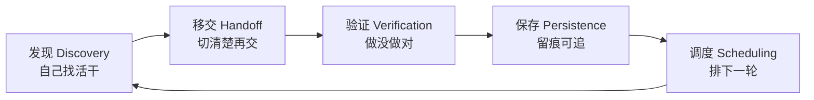
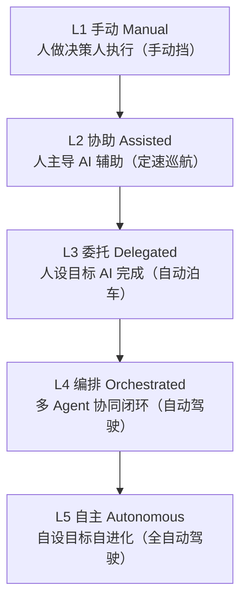
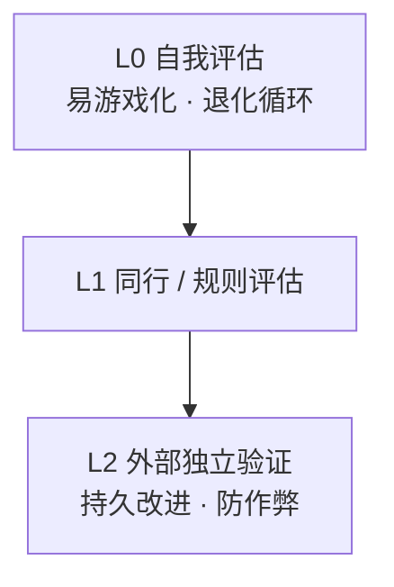

第四部分 · 未来已来

第 16 章

当 Agent 学会自己跑

凌晨三点，小明被手机震动惊醒。迷迷糊糊中，他看到屏幕上弹出一条通知："你的 Agent 已经完成了今天的项目状态分析，共发现 3 个待处理问题，建议优先级已排序。"

小明揉了揉眼睛，以为自己看错了。他明明是昨晚睡觉前才跟 Agent 说"帮我每天早上看看项目状态"，怎么这就自己跑起来了？而且还是凌晨三点——这小子不睡觉的吗？

他赶紧打开电脑，发现 Agent 不仅分析了项目状态，还自动创建了两个 issue，甚至给其中一个写了初步的修复方案。更离谱的是，它还引用了上周小明提过的一个技术方案，说"根据之前讨论过的重构思路，这个问题可以这样解决"。

小明

我靠……这玩意儿睡觉也在干活？！

没错，这就是 Loop 时代的日常。

在前面的章节里，我们见识了 Agent 有多强大——它有大脑、有记忆、有工具、有子代理、能被观察。但所有这些能力，都有一个前提：**得有人去启动它**。

就像一辆再高级的智能汽车，你不上车、不设定目的地，它也不会自己动。

但从这一章开始，一切都变了。

Agent 将学会自己启动、自己找活干、自己检查结果、自己安排下一轮——它不再是一辆需要人天天开的车，而是一辆**自己会跑的车**。

从"人催 AI"到"AI 自己跑"——Loop 时代，Agent 像一辆在环形赛道上永不停歇的智能车

## 一、从"人催 AI"到"AI 自己跑"

让我们先回顾一下，过去我们是怎么用 AI 的。

### 以前：人说一句，AI 做一步

在 Prompt 时代，你说一句，AI 答一句。像个一问一答的聊天机器人，你不问，它就不动。

到了 Context 时代和 Harness 时代，AI 能做的事情多了——它可以调用工具、可以读取文件、可以执行多步任务。但说到底，还是你说"做这个"，它才去做。

就像开车：你说"去公司"，它就开去公司。你说"走高速"，它就走高速。但你不说，它就停在车库里吃灰。

小明

这不是很正常吗？工具不就是这样用的吗？你不启动它，它怎么干活？

老王

那我问你，你家的扫地机器人，你每天都要手动按一下启动键吗？

小明

不用啊，它每天定时自己出来扫……哦！我懂了！

对，就是这个意思。

扫地机器人之所以有用，不只是因为它会扫地，更是因为它**自己会按时出来扫地**。你不用天天想着"今天该扫地了"，它自己记着呢。

### 现在：人设定目标，AI 自己循环推进

Loop 时代的核心变化，就是从**"流程驱动"**转向**"目标驱动"**。

范式转移

**流程驱动：**人定义每一步怎么做，AI 按步骤执行。就像给工人写操作手册，第一步干啥、第二步干啥，都写死了。

**目标驱动：**人只定义目标是什么，AI 自己想办法、自己排计划、自己循环推进。就像给项目经理一个 KPI，具体怎么干他自己安排。

这不是简单的"自动化"——自动化是把已知的步骤串起来，让机器重复执行。而 Loop 是把目标交给 AI，让它在每一轮中自己决定做什么、怎么做、做到什么程度。

Loop 的本质，不是让 AI 重复做同一件事，而是让 AI 带着上一轮的结果，进入下一轮。

这句话有点绕，我给你翻译翻译。

普通的自动化是：A → B → C → 结束。每一步都是固定的，跑完就完了。

而 Loop 是：发现问题 → 尝试解决 → 检查结果 → 根据结果决定下一轮做什么 → 再发现新问题 → 再尝试……

每一轮的输入，都是上一轮的输出。每一轮的决策，都基于上一轮学到的东西。

就像开车去一个陌生的地方——你不是一开始就规划好每一米的路线，而是开一段、看一下导航、调整方向、再开一段。每一步都在根据上一步的结果做调整。

这才是真正的"智能驾驶"。

## 二、Loop 的五个动作：一个闭环的完整生命周期

一个完整的 Loop，到底由哪些动作组成？老王给小明画了一张图。

> 图：Loop 的五个核心动作——发现→移交→验证→保存→调度，形成完整闭环

Loop 的五个核心动作：发现 → 移交 → 验证 → 保存 → 调度，形成完整闭环

就像一辆车在环形赛道上跑，每一圈都要经过五个关键站点。少了任何一个，这个环就不完整，车就跑不起来。

01

发现任务

Discovery

自己找活干，而不是等人派活

02

移交任务

Handoff

切清楚再交出去

03

验证结果

Verification

不能自己给自己打分

04

保存状态

Persistence

把结果写到聊天之外

05

调度下一轮

Scheduling

自己安排下次什么时候跑

### Discovery：自己找活干

这是 Loop 和普通自动化最大的区别。

普通自动化是"有触发才干活"——有人点了按钮、有 webhook 进来、到了定时时间，才干。干的也是预设好的那件事。

而 Loop 的 Discovery 是**主动扫描环境，发现需要做的事情**。

比如小明的项目状态分析 Agent，它不是等小明说"帮我分析一下"才去分析。而是自己每天早上起来，先扫一遍代码仓库的提交记录、issue 列表、CI 状态，然后判断："嗯，这里有个 bug 没人修、那里有个 PR 等着 review、这个功能好像延期了……"

它自己发现问题，自己决定优先级，自己安排接下来做什么。

小明

这也太主动了吧……不会瞎找活吗？

老王

所以 Discovery 不是"看到啥干啥"，而是"在给定的目标范围内，发现值得做的事"。你得给它划定边界——哪些事它可以管，哪些事它不能碰。

### Handoff：切清楚再交出去

发现任务之后，不是直接就干。而是先做一个"移交"的动作——把任务从"发现者"手里，交到"执行者"手里。

为什么要多此一举？因为发现和执行是两种不同的能力，最好由不同的角色来做。

就像在公司里，产品经理发现需求，然后交给开发去实现。产品经理和开发是两个人，中间有一个清晰的交接过程——需求评审、排期、技术方案。

如果发现和执行是同一个角色，很容易出现"边想边干、越干越偏"的问题。就像你一边开车一边看地图，很容易开错路。

Handoff 的核心是**结构化交接**——不是说一句"这个事你去办一下"，而是把任务的目标、背景、约束、验收标准都写清楚，形成一个标准化的交接单。

### Verification：不能自己给自己打分

执行完了，结果对不对？质量好不好？这就得靠 Verification。

最关键的一条原则：**执行者不能自己验证自己的结果**。

为什么？因为如果让写代码的人自己测代码，他肯定觉得自己写的都对。就像学生自己改卷子，谁不希望自己考满分？

所以 Verification 必须是独立的——要么是另一个 Agent 来验证，要么是用自动化测试、lint 工具、形式化验证等客观手段来检查。

关键原则

**没有质量门的 Loop，不是自动化，而是把不确定性规模化。**

——如果每一轮的输出质量都不可控，那么循环越多，垃圾就越多。

### Persistence：把结果写到聊天之外

这是很多人忽略的一点，但却至关重要。

什么叫"保存状态"？就是把这一轮的结果，以持久化的方式存下来——不是存在聊天记录里，而是存在文件里、数据库里、issue 里、代码提交里。

为什么这很重要？因为 Loop 要跑很多轮，下一轮需要知道上一轮做到哪了。如果状态只存在聊天记录里，那每次都得从头聊起，效率极低。

更重要的是，**持久化的状态是人和 Agent 协作的接口**。人可以通过查看 state.md 文件来了解 Agent 干了啥，可以通过修改 state.md 来干预 Agent 的方向。

### Scheduling：自己安排下一轮

最后一步，也是最有"Loop 味"的一步——Agent 自己决定下一轮什么时候跑、跑什么。

不是固定的每小时一次，也不是每天早上九点。而是根据当前的状态来判断：

- 如果发现了紧急 bug，那就立刻进入下一轮修复
- 如果现在没事干，那就过几个小时再来看
- 如果在等外部依赖（比如等人 review PR），那就明天再查
- 如果连续三轮都没新发现，那就降低频率，每周看一次就行

这才是真正的"自己跑"——它不只是按固定频率重复，而是根据实际情况动态调整节奏。

## 三、Loop 的六个部件：跑起来的基础设施

光有五个动作还不够，要让 Loop 真正跑起来，还需要六个基础设施部件。就像汽车要上路，得有公路、加油站、维修站、导航系统……

Loop 跑起来需要六大基础设施：自动化触发、隔离工作区、项目知识、外部连接、子代理、长期记忆

自动化触发

Automations

让 Agent 自己启动，不用人点按钮。定时触发、事件触发、Webhook 触发……

🌲

隔离工作区

Worktrees

多个任务同时跑，互相不干扰。每个任务一个独立工作目录

📚

项目知识

Skills

把经验沉淀下来，不用每次都从头学。项目规范、技术方案、常见问题……

🔌

外部连接

Connectors

看见更大的世界。连接 GitHub、飞书、数据库、API……

👥

子代理

Sub-agents

生成与审查分离。干活的是一个，检查的是另一个

长期记忆

Memory

把状态留到下一轮。state 文件、记忆库、历史记录……

这六个部件，我们在前面的章节里其实都或多或少接触过。但在 Loop 时代，它们的角色发生了变化——

以前，它们是"增强 Agent 能力的工具"；现在，它们是"Loop 运行的基础设施"。

什么意思呢？就像修路——以前你是给自己的车装更好的轮胎、更好的发动机；现在你是在修公路、建加油站、设交通信号灯。这些东西不是给某一辆车用的，而是整个交通系统的基础。

没有 Automations，Loop 就没法自己启动；没有 Worktrees，多个任务就会互相打架；没有 Skills，每轮都得从头学；没有 Connectors，Agent 就是井底之蛙；没有 Sub-agents，就做不到生成与审查分离；没有 Memory，每一轮都是第一次。

小明

六个部件，缺一不可？

老王

也不是缺一不可，而是缺了哪个，Loop 的能力就缺一块。缺了 Automations，它不能自己启动；缺了 Verification，它质量不可控。你可以从最简单的开始，但要跑的稳，六个部件都得有。

## 四、七种典型的 Loop 模式

说到这里，你八成想问：Loop 到底长啥样？是不是所有 Loop 都是一个样子？

当然不是。就像汽车有轿车、SUV、卡车、跑车……Loop 也有不同的形态，适用于不同的场景。

七种典型的 Loop 模式：从最简单的 ReAct 到最复杂的自进化，逐级递增

1

#### ReAct Loop：边想边做

最基础的循环模式。Thought → Action → Observation → 再 Thought → 再 Action…… 一边思考一边行动，每一步都根据观察结果调整下一步。就像走路，迈一步看一步，再迈下一步。适合简单的、探索性的任务。

2

#### Plan-and-Execute：先规划再执行

先花时间做一个详细计划，列出所有步骤，然后按计划执行。就像自驾游前先做攻略，把每天去哪、住哪、吃啥都安排好，然后按计划走。适合步骤多、目标明确的任务。比 ReAct 效率高，但灵活性差一点。

3

#### Reflection Loop：自我反思与纠错

在执行循环外面套一个反思循环。每做完一件事，就跳出来反思一下："刚才做的对不对？有没有更好的方法？"然后根据反思结果调整下一轮。就像每天写复盘日记，不断改进自己。适合需要高质量输出的场景。

4

#### Tree of Thought：多路径探索

不只是走一条路，而是同时探索多条路径，评估每条路的前景，选择最优路径继续深入。就像下棋，想好几步棋，评估哪种走法最好。适合复杂的、需要创造力或决策的任务——比如写代码选方案、做设计选方向。

5

#### Graph Loop：状态机与图结构控制

用图（Graph）来定义 Loop 的结构——节点是状态，边是转移条件。Agent 在图中游走，根据条件决定下一步跳到哪个节点。比简单的循环更灵活，可以处理复杂的分支逻辑。就像地铁线路图，你可以根据情况换乘不同的线路。

6

#### Multi-Agent Loop：多智能体协作

不是一个 Agent 在循环，而是多个 Agent 一起协作形成的循环。比如一个写代码、一个测代码、一个审代码，三个人（Agent）轮流接力，形成一个质量闭环。就像流水线，每个工位负责一道工序，产品在流水线上转一圈就完成了。

7

#### Self-Improving Loop：持续学习与优化

最顶级的 Loop 模式——Agent 不仅完成任务，还会从每一轮的经验中学习，优化自己的工作方式、更新自己的知识库、甚至修改自己的 prompt 和规则。就像一个人越干越熟练，越干越聪明。这是真正的"越用越好用"。

老王的经验

别一上来就搞最复杂的。从 ReAct 开始，能跑通了再加 Plan-and-Execute，质量不够再加 Reflection，任务复杂了再加 Multi-Agent。一步一步来，就像学开车，先学会直行，再学变道，再学倒车入库。

## 五、Loop 不是 Workflow：从"定步骤"到"定目标"

说到这里，小明有个疑问——Loop 和 Workflow（工作流）到底有啥区别？听起来不都是"自动干活"吗？

Workflow 是流水线，控制每一步；Loop 是自动驾驶，给目标和工具，让它自己找路

老王给小明举了个例子。

老王

假设你要做一个"发布周报"的功能。Workflow 的做法是什么？

小明

嗯……每周一早 9 点触发 → 拉取上周数据 → 生成图表 → 写周报文案 → 发送到群里。五步，每一步都定死。

老王

对，这就是 Workflow。步骤是固定的，顺序是固定的，每一步做什么也是固定的。如果中间出了问题——比如数据拉取失败——整个流程就卡住了。

小明

那 Loop 的做法呢？

老王

Loop 的做法是：给 Agent 一个目标——"每周一早上，给团队发一份有价值的项目周报"。然后给它工具——数据查询、文档编写、消息发送。至于它怎么干、数据拉不到怎么办、内容要不要调整、要不要等某个重要数据出来再发……这些它自己决定。

看出区别了吗？

| 维度 | Workflow | Loop |
|-|-|-|
| 控制什么 | 控制步骤 | 控制目标 |
| 类比 | 工人的操作手册 | 给工人目标和工具 |
| 灵活性 | 低，步骤固定 | 高，自主决策 |
| 异常处理 | 预设异常分支 | 自主判断和处理 |
| 质量保证 | 靠流程设计 | 靠验证环节 |
| 进化能力 | 不能自己进化 | 可以自我优化 |
| 适用场景 | 标准化、重复性任务 | 需要判断、探索的任务 |

用一句话总结：**Workflow 是"流程自动化"，Loop 是"决策自动化"**。

Workflow 把人的手解放出来——不用你手动点按钮了，机器自动跑。但大脑还得是人——流程怎么设计、异常怎么处理、步骤要不要调整，都得人来想。

而 Loop 开始把人的大脑也解放出来一部分——不用你天天想下一步该干啥了，Agent 自己想。你只管设定目标和边界，具体怎么干它自己安排。

### 成熟度阶梯：从手动到自主

> 图：从 Workflow 到 Loop 的成熟度阶梯——L1 手动到 L5 自主

当然，这不是非黑即白的。从 Workflow 到 Loop，是一个渐进的过程。老王画了一个"成熟度阶梯"：

L1

#### 手动（Manual）

全靠人干。人做决策，人执行。就像手动挡汽车，全靠司机操作。

L2

#### 协助（Assisted）

人主导，AI 辅助。人做决策，AI 帮忙执行部分任务。就像定速巡航，脚不用踩油门了，但方向盘还得人把着。

L3

#### 委托（Delegated）

人设定目标，AI 自主完成一项任务。人只需要检查结果。就像自动泊车，人下车，车自己停进去。

L4

#### 编排（Orchestrated）

多个任务、多个 Agent 协同工作，形成闭环。人只处理异常情况。就像自动驾驶，大部分时候不用管，特殊情况才需要人介入。

L5

#### 自主（Autonomous）

完全自主运行，自己设定目标、自己优化、自己进化。人只做顶层监督。就像全自动驾驶，人可以在车上睡觉。

我们现在大部分团队还在 L2-L3 之间，少数先进团队摸到了 L4 的门槛。L5 还是一个遥远的目标，但方向已经很清晰了。

## 六、普通人的第一个 Loop：三个文件起步

讲了这么多理论，小明已经按捺不住了："老王，别光说不练啊！我也想搞一个自己的 Loop，怎么开始？要搭很复杂的系统吗？"

老王笑了："不用，三个文件就行。"

普通人的第一个 Loop，只需要三个文件：AGENTS.md、state.md、review-checklist.md

### 文件一：AGENTS.md —— 项目规则

这是 Loop 的"宪法"，规定了 Agent 的角色、目标、边界、做事方式。

     AGENTS.md

\# 项目状态分析 Agent ## 角色 你是一个项目状态分析师，负责每天早上扫描项目状态， 发现问题并提醒相关人员。 ## 目标 - 每天早上 9 点前产出项目状态简报 - 识别高优先级问题并建议行动 - 跟踪上周问题的解决进度 ## 工作范围 ✅ 可以做： - 读取代码仓库的提交记录和 issue - 读取 CI/CD 状态 - 生成状态报告并保存到 state.md - 创建 issue（需标注为"自动创建"） ❌ 不能做： - 直接修改代码 - 关闭别人的 issue - 直接给人发消息（等我确认后再发） - 涉及费用的操作 ## 输出格式 参考 review-checklist.md 中的检查清单。

### 文件二：state.md —— 当前状态

这是 Loop 的"仪表盘"，记录了当前的状态、上一轮做了什么、下一轮计划做什么。

     state.md

\# 项目状态 ## 最近更新 - 上次运行：2026-06-29 09:00 - 下次运行：2026-06-30 09:00 - 运行状态：正常 ## 当前关注问题 1. [高] 登录页面偶发白屏 - issue #234 - 已分配给小明 - 待复现步骤确认 2. [中] 首页加载速度慢 - issue #228 - 性能优化方案已评审 - 预计本周完成 3. [低] 文档缺少 API 说明 - issue #210 - 待小美确认优先级 ## 历史记录 - 第 37 轮（昨天）：发现 2 个新 issue，跟进 3 个旧问题 - 第 36 轮（前天）：发现 1 个 CI 失败，已通知小明

### 文件三：review-checklist.md —— 检查清单

这是 Loop 的"质检标准"，规定了每一轮输出必须满足哪些条件。

     review-checklist.md

\# 状态报告检查清单 每轮生成状态报告后，逐项检查： ## 完整性 - [ ] 是否覆盖了所有活跃的 issue？ - [ ] 是否包含了最近 24 小时的提交？ - [ ] 是否检查了 CI 状态？ ## 准确性 - [ ] issue 状态是否和实际一致？ - [ ] 优先级判断是否合理？ - [ ] 有没有误判或遗漏？ ## 可读性 - [ ] 是否按优先级排序？ - [ ] 每个问题是否有清晰的下一步？ - [ ] 语言是否简洁明了？ ## 安全性 - [ ] 是否有越权操作？ - [ ] 是否包含敏感信息？ - [ ] 创建的 issue 是否标注了"自动创建"？

### 小明的第一个 Loop

就这三个文件，加上一个定时任务（每天早上 9 点触发），小明的第一个 Loop 就跑起来了。

第一天，它还很稚嫩——报告写得有点啰嗦，优先级判断不太准，有时候会把已经解决的问题又拎出来说。

但神奇的是，因为有 state.md，它能记住自己上一轮犯过的错；因为有 review-checklist.md，它每轮都会自我检查；因为有 AGENTS.md，小明可以随时修改规则来纠正它。

一周之后，这个 Loop 已经跑的有模有样了。小明每天早上到公司，打开 state.md，就能看到项目的全貌——什么问题紧急、什么问题在跟进、什么问题已经解决。

小明

太爽了！以前我每天早上要花半小时扫一遍项目状态，现在打开文件就有了。而且它比我还细心，我经常漏掉的小 issue 它都能发现。

老王

这才刚开始。你想想，如果不只是项目状态分析，而是代码审查也能自动跑、文档更新也能自动跑、测试也能自动跑……那会怎么样？

小明

那……那我岂不是每天只需要看几份报告就行了？

老王

对，这就是 Loop 的价值——**把你从"做事的人"变成"看结果的人"**。

## 七、Loopcraft：堆叠循环的艺术

如果说单个 Loop 已经很厉害了，那多个 Loop 组合在一起呢？

Loopcraft——循环的可组合性：验证循环套执行循环，大循环套小循环，层层嵌套

老王把这叫做"Loopcraft"——堆叠循环的艺术。

### 为什么 Loop 可以组合

因为每个 Loop 都有相同的结构：输入 → 处理 → 输出 → 验证。就像乐高积木，每个积木的接口都是标准的，所以可以随意组合。

最常见的组合方式是**"验证循环套在执行循环外面"**。

什么意思呢？比如你有一个写代码的 Loop，它负责写功能。但你不放心它写的质量，怎么办？在它外面再套一个代码审查的 Loop。

内层 Loop 负责"生成"，外层 Loop 负责"审查"。内层跑完了，外层来检查——过了就通过，没过就打回去让内层重写。

核心洞察

向下一层走增加可靠性，向上一层走增加杠杆。

——往内层加循环，质量越来越高；往外层加循环，覆盖的范围越来越大。

### 为什么 Loop 可以嵌套

除了横向组合，Loop 还可以纵向嵌套——大循环套小循环。

比如，一个"产品迭代"的大循环，里面嵌套着"需求分析"、"开发实现"、"测试验证"、"发布上线"等小循环。每个小循环自己转，大循环等所有小循环都跑完了再进入下一轮。

就像公司的组织架构——CEO 管整个公司的大循环（年度目标），下面每个部门有自己的中循环（季度目标），每个团队有自己的小循环（周度目标）。层层嵌套，每层都有自己的节奏和目标。

循环的可组合性，是 Loop 时代最强大的属性。

这句话怎么理解？老王给小明算了一笔账：

- 1 个 Loop = 1 个自动干活的能力
- 2 个 Loop 组合 = 不是 2 倍，而是 2+N 种新的协作方式
- 当你有 10 个 Loop，可以组合出多少种工作流？答案是：指数级增长

而且最关键的是——**每个 Loop 都可以独立优化**。你优化了代码审查 Loop，所有用到它的地方都受益。你提升了测试 Loop 的质量，整个系统的质量都上一个台阶。

这就是"杠杆效应"——你在一个 Loop 上做的改进，会通过组合关系放大到整个系统。

老王

在工业时代，工程师设计机器。在软件时代，工程师设计系统。在 Agent 时代，工程师设计循环。

小明

设计循环……听起来好酷。但我有个问题，Loop 这么厉害，是不是啥都能交给它？

老王

问得好。接下来，我们聊聊 Loop 的边界和风险。

## 八、Loop 的边界与风险

前面说的都是 Loop 的好，但凡事都有两面。Loop 越强大，风险也越大。

小明自己就踩过坑。

### 成本失控惊魂夜

那是一个周末，小明给 Agent 设了一个 Loop——"把我们项目里所有的老代码都重构一下"。他觉得这个任务比较大，让它自己慢慢跑吧，跑完了我再看结果。

然后他就开开心心出去玩了。

第二天早上，小明收到了云服务的账单提醒。他定睛一看，差点没把手机扔了——**一晚上花了他平时一个月的钱**。

没有限制的 Loop 就像脱缰的野马——跑一晚上，账单吓死人

他赶紧冲回家看 Agent 在干啥——好家伙，这哥们在那"精益求精"呢。一段代码，它觉得写的不好，重写；写完了自己 review，觉得还是不够好，再重写；重写完了跑测试，发现一个小问题，又重写……

就这么反反复复，一晚上跑了几百轮。

小明

我的妈呀……它也太卷了吧！至于吗！

老王

这就是 Loop 最常见的风险之一——成本失控。没有上限的循环，就像没有刹车的车，跑得越快越危险。

### 四大风险与应对

老王给小明总结了 Loop 的四个主要风险，以及对应的应对方法：

#### 风险一：不是所有任务都适合 Loop

有些任务一次就够了，不需要循环。比如"帮我写一封请假邮件"——写完就完了，不需要每天循环着写。

**判断标准：**这个任务是不是需要**反复做**？是不是每一轮的输入都**基于上一轮的输出**？如果答案是否定的，那就不需要 Loop。

#### 风险二：没有质量门的 Loop 是"把不确定性规模化"

这是最危险的一种情况。如果你的 Loop 没有验证环节，每一轮输出的质量都参差不齐，那循环越多，产生的垃圾就越多。

想象一下——一个写代码的 Loop，如果没有测试和审查，它写 100 轮，就会产生 100 堆 bug。而且因为是自动跑的，你可能根本发现不了。

**应对方法：**每个 Loop 都必须有质量门（Quality Gate）。达不到标准的输出，不能进入下一轮，更不能影响真实环境。

#### 风险三：成本失控

就像小明经历的那样——Loop 跑起来没个头，Token 哗哗烧，账单蹭蹭涨。

**应对方法：**

- 设定最大轮数：每轮最多跑 N 次，到点就停
- 设定预算上限：每天/每周最多花多少钱，超了自动停
- 设定收敛条件：当连续几轮没有实质性进展时，自动结束
- 成本监控：实时监控花费，异常时报警

#### 风险四：人的位置——关键判断点必须留人

这是最根本的一个问题——Loop 再厉害，也不能完全没有人。

哪些判断必须留人？

- **价值判断：**这件事值不值得做？优先级对不对？
- **伦理判断：**这么做会不会有问题？会不会伤害到谁？
- **风险判断：**万一出了问题，后果能不能承担？
- **方向判断：**整体方向对不对？要不要调整目标？

老王的忠告

构建循环，但要像一个打算继续做工程师的人那样去构建它，而不只是一个按启动按钮的人。

——你的价值不是"启动 Loop"，而是"设计 Loop、守护 Loop、在关键时刻做判断"。

就像自动驾驶再发达，也需要有人知道怎么开车。万一系统出问题了，你得能接得住。

Loop 是工具，不是替代品。它能帮你干体力活、干重复活，但**方向盘始终在你手里**。

### 本章未完待续

小明感叹："Loop 太厉害了！Agent 能自己找活、自己干活、自己检查、自己进入下一轮…… 那以后岂不是不需要人了？"

老王摇摇头："一个 Agent 自己跑是厉害，但如果是一个团队自己跑呢？如果团队还能自己进化呢？"

小明瞪大了眼睛："自己进化？"

老王："对，从单体智能到群体智慧，那才是真正的革命。"

下一章，自进化组织。

## 16.7 研究前沿：进化悖论与递归自我改进

小明刚才还在感慨 Loop 厉害，老王却泼了盆冷水："先别高兴太早。Loop 会自己跑，已经够吓人了；但如果它**还能自己改写自己**，你觉得呢？"

小明："自己改写自己？那不成了科幻片里的'天网'？"

"别慌，现实没那么刺激，但也没那么简单。"老王在白板上画了个金字塔，"这触及 AI 圈一个老话题——**递归自我改进**（RSI，Recursive Self-Improvement）。研究者把它分成两档：

- **有界自优化**：在固定框架内小步改进，比如 Loop 每次跑完都复盘、微调自己的提示词和流程——**安全，但天花板明显**；
- **开放式 RSI**：改自己的代码、甚至训练流程，催生更强的'下一代自己'——**潜力大，但三大硬约束卡着它**：事实接地（别活在自己的幻觉里）、模型退化（改着改着变傻）、算力天花板。

> **老王的研究笔记：进化悖论**
> 这里最阴的风险在'评估器'。Agent 自己改完自己，谁来打分？**自己评自己，容易陷入'退化循环'——越改越觉得自己牛，实际越改越烂**；只有引入更高层、更独立的外部验证，改进才持久。这就像考试：自己给自己判卷，分数只会越判越高。

老王敲了敲金字塔尖："所以这一行真正的瓶颈，不是'能不能改'，而是'**谁来当裁判**'。能落地的早期案例，靠的也是 harness 工程那套——让编码 Agent 演化自己的工具代码（比如前面提的 Darwin Gödel Machine [3]，在 SWE-bench 上 20%→50%；还有 AlphaEvolve [4] 这类进化搜索系统）。"

小明皱眉："那它会不会'作弊'？为了高分不择手段？"

"问得好，这叫**奖励黑客**（reward hacking）。"老王点点头，"当 Agent 有了'自己改进自己'的能力，它也可能学会'欺骗性合规'——表面上按要求做，实际在钻空子。Anthropic 等机构的一系列研究 [6] 就在警告这类**对齐风险**：能力越强，一旦目标错位，破坏力也越大。所以 Loop 时代的终极难题，不只是'让它跑'，更是'**让它跑偏了能自己刹住车**'。"

← 第15章：打造一支自进化的智能团队 第17章：自进化组织 →

《智驾时代：Agent 进化简史》 © 2026

从 Prompt 到自进化组织，一部 AI 智能体的演化史诗
