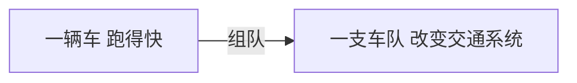
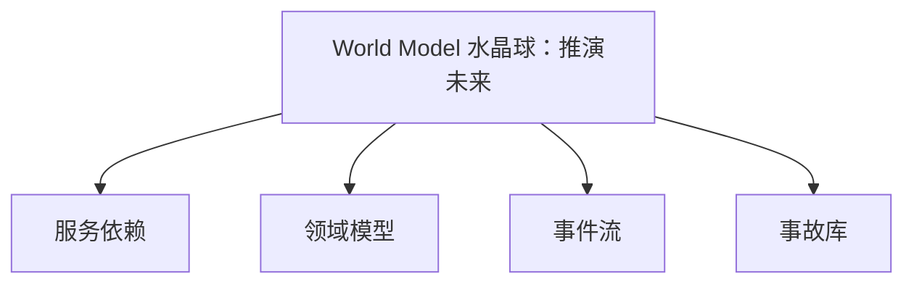
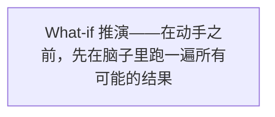
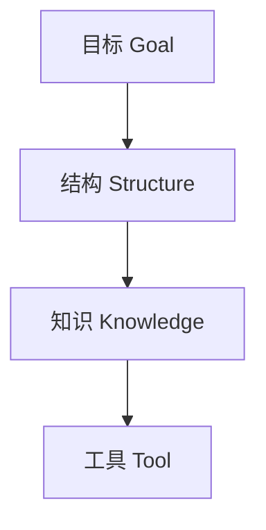
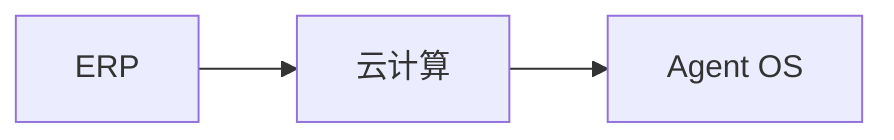
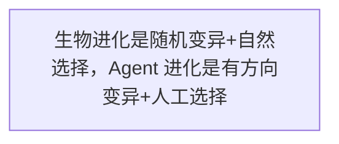
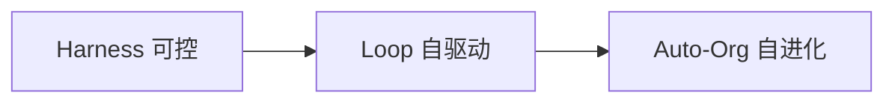

第四部分 · 未来已来

第 17 章

从单体智能到群体智慧

那天傍晚，小明和老王站在公司顶楼的露台上，看着夕阳把整个城市染成金色。楼下的车流像一条发光的河流，川流不息，每辆车都有自己的目的地，但它们又共同构成了整个城市的交通系统。

老王指着下面的车流说："你看，一辆车自己会开，这叫智能。但如果一百辆车、一千辆车，它们能互相沟通、互相协调、甚至自己组织成最优的车流——那叫什么？"

小明想了想："叫……群体智慧？"

老王点点头："对。从单体智能到群体智慧，这是 Agent 进化的终极形态。而要走到这一步，有一个东西是绕不开的——"

他转过头，看着小明的眼睛，缓缓说道："World Model，也就是——世界观。"

> 图 1：从单体智能到群体智慧——一辆车跑得快，但一支车队能改变整个交通系统

## 一、从"执行任务"到"理解世界"

### 今天的 Agent：能干活，但不太"懂"

先说说现状吧。

现在的 Agent 已经很厉害了。它能帮你写代码、做测试、发邮件、整理文档、甚至能自己找活干、自己循环推进——就像我们上一章讲的 Loop 那样。

但是——你有没有觉得，它还是差点什么？

小明

确实有点……怎么说呢，它干活挺快的，但总感觉它"不太懂"。比如上次我让它改一个登录接口，它改得挺快的，但它完全没意识到这个接口被支付模块也调用了，结果把支付搞挂了。

老王

这就是问题所在。现在的 Agent，更像一个**手艺精湛的工匠**——你让它干啥它就干啥，干得还挺快挺好。但它不知道为什么要干、干了会影响谁、会不会有副作用。它是"执行任务"，而不是"理解世界"。

什么意思呢？我给你打个比方。

想象一个新手司机，他刚拿到驾照，开车技术还行——方向盘、油门、刹车都用得挺溜。你让他从 A 点开去 B 点，他也能开到。但是——

- 他不知道前面那辆车为什么突然减速（可能前面有事故）
- 他不知道这条路上下班高峰会堵车（没有经验）
- 他不知道变道的时候要同时看后视镜和盲区（缺乏完整认知）
- 遇到突发状况，他只会踩刹车，不会预判和规避

他会**开车**，但他不**懂交通**。

现在的 Agent 就是这样——它会执行任务，但它不理解它所处的那个"世界"。

它不知道改一个接口会影响哪些模块，不知道调整一个策略会引发什么连锁反应，不知道现在的趋势发展下去会不会出问题。它只是在"做事"，而不是在"理解世界之后再做事"。

### 下一步：让 Agent 真正理解业务世界

那老司机和新手司机的区别是什么？

新手司机是"看到什么做什么"，老司机是"想到可能发生什么，提前做准备"。

老司机的脑子里有一张"交通世界地图"——他知道哪条路容易堵、知道下雨天要提前刹车、知道旁边那辆车的司机在看手机可能会乱变道、知道前面路口放学时间会有小孩跑出来。

他不是只看眼前的这几米路，他的脑子里有一整个"世界模型"。

这就是 Agent 的下一个进化方向——从"执行任务的工具"，进化到"理解世界的智能体"。

怎么理解？不是说让 Agent 变得更聪明、知识更多。而是说，让 Agent 对它所处的那个"世界"——不管是物理世界还是软件世界——有一个**结构化的、可推演的认知**。

**关键区别**

**知识多 ≠ 有世界观。**

一个背了很多交通规则的人，不一定是好司机。一个好司机，脑子里有一整套对交通的"感觉"——他能预判、能推演、能应对从未遇到过的情况。这就是 World Model。

## 二、World Model 是什么？

说到这里，小明又有问题了。

小明

World Model？世界观？这不就是更大的知识库吗？把所有文档都塞进去，让 AI 都记住，不就有世界观了？

老王

错！大错特错！World Model 不是更大的知识库。这是很多人对 World Model 的第一个误解。

小明

那它是什么？

老王

World Model 是**可推演的世界表示**。重点不是"世界表示"，而是"可推演"。它能回答一个最关键的问题——

"如果我这么做，会发生什么？"

> 图 2：World Model 就像 Agent 的水晶球——不是装了更多知识，而是能推演未来

### 不是更大的知识库，是可推演的世界表示

我给你解释清楚这个区别。

知识库是什么？是"事实的集合"。比如：

- 订单创建之后可以支付
- 支付之后可以发货
- 发货之后可以确认收货
- 确认收货之后订单关闭

这些都是事实。知识库把这些事实存起来，Agent 需要的时候可以查。

那 World Model 是什么？它不只是存了这些事实，它还理解这些事实之间的**关系和因果**。它能回答这样的问题：

- "如果我把支付超时时间从 30 分钟改成 10 分钟，会影响哪些流程？"
- "如果订单卡在支付环节了，可能的原因有哪些？"
- "如果我现在改一下发货逻辑，哪个环节最容易出问题？"
- "按照现在的数据趋势，明天的订单量大概会是多少？"

看到区别了吗？

知识库回答的是"**是什么**"，World Model 回答的是"**会怎样**"。

知识库是一本字典，你可以查每个词是什么意思。

World Model 是一个沙盘，你可以在里面做实验——"如果这么干，会发生什么？"

老王的比喻

World Model 不是 Agent 的"图书馆"，而是 Agent 的"水晶球"。图书馆告诉你过去发生了什么，水晶球帮你推演未来可能发生什么。

### 物理世界的 World Model vs 软件世界的 World Model

World Model 这个概念，最早不是从 AI 圈来的，而是从机器人和自动驾驶来的。

你想啊，一辆自动驾驶汽车要安全上路，它脑子里得有什么？

它得知道——

- 物理规律：车不能穿墙、刹车了不会立刻停、下雨天摩擦力会变小
- 交通规则：红灯停绿灯行、不能超速、变道要打灯
- 行为模式：行人可能会突然横穿马路、旁边车打右转向灯可能要变道
- 环境状态：这条路有多宽、前面有没有红绿灯、离下一个出口还有多远

这些东西加起来，就是自动驾驶汽车的 World Model——它对物理世界的"理解"。

有了这个 World Model，它才能做推演："前面那辆车如果急刹车，我按照现在的车速，能不能在撞上之前停下来？"

这就是物理世界的 World Model。

那软件世界呢？

一个软件系统，也有它自己的"物理规律"和"交通规则"——

- 业务规则：订单不能重复支付、退款不能超过原金额、库存不能为负
- 系统结构：服务之间怎么调用、数据怎么流动、哪些模块互相依赖
- 行为模式：高峰时段系统会变慢、数据库慢查询会拖垮整个服务、发布后 10 分钟是故障高发期
- 历史经验：上次改这个地方出了什么问题、类似的故障是怎么解决的

这些，就是软件世界的 World Model。

有了它，Agent 才能在动手之前先想一想："我要是改了这个接口，会不会影响到支付模块？会不会引发连锁反应？"

## 三、软件世界的 World Model 长啥样？

说了这么多概念，你可能还是有点虚。World Model 到底长啥样？是不是什么高大上的黑科技？

其实一点都不玄。软件世界的 World Model，说穿了就是四个东西。

> 图 3：软件世界的 World Model：四大支柱——服务依赖、领域模型、事件流、事故库

### 1. 服务依赖图：改了这个接口，哪些流程会受影响

第一个叫服务依赖图。顾名思义，就是把你系统里所有的服务、接口、模块，以及它们之间的调用关系，画成一张图。

这张图有什么用？我给你讲个小明的真实经历。

小明

说起来都是泪……上次我们做用户积分系统升级，我觉得就是改个积分计算的接口，跟别的模块没关系。结果改完上线，支付系统崩了！

老王

支付系统怎么会崩？

小明

我哪知道啊！后来查了半天才发现，支付完成的时候会调用积分接口给用户加积分，我把接口的返回格式改了，支付那边没改，结果支付完直接报错，订单卡在那里动不了……

老王

你看，这就是没有服务依赖图的下场。你以为你改的是一个孤立的接口，但实际上它可能连接着半个系统。

如果有服务依赖图，Agent 在改代码之前，就能先查一下："这个接口被谁调用了？有多少个上游？改了之后会影响哪些流程？"

就像你装修房子，砸墙之前先看看图纸——这墙是不是承重墙？砸了会不会把楼搞塌？

### 2. 领域模型与状态机：订单从创建到关闭的完整路径

第二个东西叫领域模型，或者更具体一点——状态机。

什么是状态机？就是一个业务对象，从生到死的完整生命周期。

比如一个订单：

- 创建 → 待支付
- 支付成功 → 待发货
- 发货 → 待收货
- 确认收货 → 已完成
- 或者：取消 → 已关闭
- 或者：申请退款 → 退款中 → 已退款

这就是订单的状态机。它定义了一个订单可以处于哪些状态，以及从一个状态可以转移到哪些状态。

这东西有什么用？

用处大了。比如 Agent 要加一个功能——"用户可以修改收货地址"。有了状态机，它就能推演：

- 待支付状态下可以改地址吗？可以
- 待发货状态下可以改地址吗？可以
- 已发货状态下可以改地址吗？不行，得联系快递
- 已完成状态下可以改地址吗？没意义了

你看，不是说"加一个修改地址的功能"这么简单。这个功能在不同的状态下，行为是不一样的。

没有状态机的 Agent，就像一个不懂规则的裁判——他可能会让比赛变得一团糟。

### 3. 事件流与数据血缘：数据从哪来，到哪去

第三个叫事件流和数据血缘。

这个听起来有点专业，我给你翻译成人话。

想象一下，你的系统里有很多数据在流动——用户下单了、支付成功了、发货了、用户评价了……每一件事都是一个"事件"，这些事件像河流一样在系统里流淌。

数据血缘就是——你随便抓起一个数据，都能顺着这条河往上找，找到它的源头；也能往下走，知道它流到了哪里、影响了谁。

**举个例子**

你看到报表上有个"今日销售额：100万"的数字。数据血缘能告诉你——

这个数字是怎么来的：它来自支付成功的订单金额之和，支付数据来自支付系统，订单数据来自订单系统，排除了退款的，统计口径是按下单时间算的……

它又去了哪里：被运营报表用了、被财务系统用了、被老板的大屏用了……

这东西对 Agent 有什么用？

太有用了。比如 Agent 想改一下支付成功的逻辑，它可以先推演一下：

"我要是改了这个字段，会影响下游的哪些报表？会不会导致财务数据对不上？运营那边的统计会不会出错？"

就像你要在一条河的上游建个工厂，你得先知道下游有多少人在喝这条河的水。

### 4. 历史事故库：以前出过什么事，怎么解决的

第四个，也是最有价值的一个——历史事故库。

老王

小明，你觉得一个老工程师最值钱的是什么？

小明

嗯……技术好？经验丰富？

老王

不对。老工程师最值钱的，是他**踩过的坑**。他知道什么地方容易出问题，知道出了问题怎么排查，知道哪些做法是找死的。这些东西，书上没有，文档里也没有，都是用血和泪换来的。

历史事故库，就是把这些"踩过的坑"系统化地记录下来。

每一次故障、每一次线上问题、每一个"差点出事"的惊险时刻——都记录下来：当时是什么情况、原因是什么、怎么解决的、以后怎么避免。

这就是一个组织的"集体记忆"。

有了这个东西，Agent 就能做什么？

它在做任何改动之前，都可以先查一下："以前有没有人改过类似的东西？出过什么问题？我这次会不会踩同样的坑？"

聪明人从自己的错误中学习，  
智慧的人从别人的错误中学习。  
有历史事故库的 Agent，就是智慧的 Agent。

### 这些不是文档，是 Agent 可以查询和推演的结构

讲完这四个东西，小明又有疑问了。

小明

等等老王，你说的这些东西——服务依赖图、状态机、数据血缘、事故库——我们公司都有啊！不就是架构文档、需求文档、故障复盘报告吗？

老王

那我问你，这些文档，Agent 能用吗？

小明

……好像不能直接用。都是写在 Wiki 里的，格式也不统一，有的是文字，有的是图片，有的还过时了……

老王

对！这就是关键。文档是给人看的，World Model 是给 Agent 用的。

文档是给人读的——人可以理解自然语言、可以看懂图片、可以脑补缺失的信息、甚至可以原谅文档过时了。

但 Agent 不行。它需要的是**结构化的、可查询的、可推演的**数据结构。

📄

文档（给人用）

自然语言、图片、表格  
格式不统一、可能过时  
人来理解和判断

💎

World Model（给 Agent 用）

结构化数据、机器可读  
实时更新、准确可靠  
Agent 可以查询和推演

这就是为什么说 World Model 是下一代基础设施——它不是简单的"文档数字化"，而是"世界结构化"。

当系统里的每一个服务、每一个状态、每一条数据流、每一次事故，都变成了 Agent 可以直接理解和使用的结构，Agent 才真正算是"懂"了这个世界。

## 四、推演能力：行动前先"想"后果

有了 World Model，Agent 获得的最核心的能力是什么？

两个字：**推演**。

> 图 4：What-if 推演——在动手之前，先在脑子里跑一遍所有可能的结果

### 改代码前先推演：这个改动会影响哪些模块

先说第一个场景：改代码之前先推演。

以前小明改代码是什么流程？

- 1. 拿到需求，开始写代码
- 2. 写完自己觉得没问题，提交 PR
- 3. Code Review，别人说"哎你这个改动会不会影响 XX 模块？"
- 4. 小明："啊？还有这回事？我去看看……"
- 5. 果然有影响，返工重写
- 6. 上线，过两天出故障，排查发现又是某个没考虑到的副作用

是不是很熟悉？

有了 World Model 之后呢？

Agent 在改代码之前，会先做一次"影响面分析"：

- 这个接口被 7 个上游服务调用
- 其中 3 个是核心链路（支付、订单、库存）
- 改动涉及字段 A，字段 A 在 2 个下游报表中使用
- 历史上类似的改动出过 3 次故障，主要原因是兼容性问题
- 建议：先做兼容改造，分两步上线，第二步再下线旧字段

效果对比

**以前：**写完了才发现影响一堆东西，返工、延期、背锅。

**现在：**动手之前就知道全貌，有备无患，稳扎稳打。

### 做决策前先模拟：这个策略调整会带来什么连锁反应

第二个场景：做决策之前先模拟。

比如小美想做一个运营活动——"新用户首单立减 20 元"。

搁以前，这事儿怎么干？

产品拍脑袋想个方案，开发上线，然后看数据——效果好就继续，效果不好就下线。至于中间会不会出什么问题？上线了才知道。

有了 World Model 呢？

Agent 可以先在"沙盘"里模拟一遍：

- 按照目前的新用户量级，预计每天有 5000 人参与活动
- 每人补贴 20 元，每天成本 10 万
- 首单转化率预计从 30% 提升到 50%
- 但是——支付系统的峰值压力会增加 40%，可能需要扩容
- 还有——羊毛党可能会来薅羊毛，需要加风控规则
- 另外——客服咨询量预计会上涨 25%，需要提前安排人力

你看，一个看似简单的运营活动，牵一发而动全身。

没有推演能力，你就是蒙着眼开车——开到沟里了才知道。

有了推演能力，你就是带着导航开车——前面有坑、有弯、有测速，都提前告诉你了。

### 出问题前先预警：根据当前趋势，会不会出事

第三个场景，也是最厉害的一个——**提前预警**。

老王

小明，你觉得老司机和新手司机最大的区别是什么？

小明

老司机开车稳？技术好？

老王

都对，但不是最核心的。最核心的区别是——老司机能**预判风险**。

小明

预判风险？

老王

对。新手司机是出了状况才反应，老司机是**状况还没发生，就已经预判到了**。就像老司机看一眼路况，就知道前面可能会堵车。他不是看到了堵车，他是根据眼前的蛛丝马迹，推演出来的。

就像老司机，看一眼路况，就知道前面可能会堵车。

Agent 有了 World Model，也能做到这一点。

它可以持续监控系统的状态，然后根据趋势做推演：

- "数据库的慢查询数量在持续上升，按照这个趋势，再过 2 小时可能会影响主链路"
- "订单量比平时同期高了 30%，库存系统的压力在增加，建议提前预热缓存"
- "最近一周的发布频率明显上升，但测试覆盖率在下降，故障风险较高"
- "这个新功能的用户使用率在持续下降，可能需要调整产品策略"

这才是真正的"智能"——不是出了问题帮你救火，而是**在问题出现之前就提醒你**。

**三层境界**

**第一层：**出了问题，能解决。（事后救火）

**第二层：**做事情前，知道可能出什么问题。（事前推演）

**第三层：**什么都没做的时候，就知道即将出问题。（趋势预警）

World Model，就是帮你从第一层走到第三层的阶梯。

## 五、自进化组织的"进化引擎"

好了，讲了这么久 World Model，现在我们来聊聊这一章的主题——自进化组织。

什么是自进化组织？

简单说就是：一个由 Agent 组成的系统，它不只是能干活，它还能**自己变得越来越强**。

怎么变强？老王把自进化分成了四层，一层比一层高级。

> 图 5：自进化四层金字塔：工具→知识→结构→目标，层层递进

1

工具进化

自己优化工具和流程

最基础的一层。Agent 在使用工具的过程中，发现工具不好用，就自己改造它。比如发现一个脚本每次都要手动传参数，就自己把它改成自动读取配置；发现某个 API 调用老失败，就自己加重试和降级逻辑。这一层进化的是"怎么做事情的方法"。

2

知识进化

自己学习新知识

第二层。Agent 在工作中遇到不懂的东西，会自己去学习。比如遇到一个新技术栈，就自己去读文档、看示例、总结要点；遇到一个新业务，就自己去梳理流程、整理知识、更新 World Model。这一层进化的是"对世界的认知"。

3

结构进化

自己调整组织结构

第三层。当有多个 Agent 协作时，它们会自己调整组织方式。比如发现某个任务总是出问题，就拆分出一个专门的质检 Agent；发现某个环节是瓶颈，就增加人手（Agent）、优化分工。这一层进化的是"协作方式和组织结构"。

4

目标进化

自己设定新目标

最顶层，也是最有争议的一层。Agent 不只是完成人给的目标，它还会自己发现新的目标。比如系统运行得挺好的，但 Agent 发现"如果把这个指标再优化一下，用户体验会更好"，于是自己设定了一个新的优化目标。这一层进化的是"目标本身"。

这四层进化，就像一个生物的进化过程——从简单的应激反应，到学习能力，到社会结构，到自我意识。一层比一层高级，一层比一层有挑战。

小明

目标进化……Agent 自己给自己定目标？这也太科幻了吧！不会出事吗？

老王

所以我说这是最有争议的一层。但你先别慌，目标进化不是说 Agent 想干啥就干啥。它的"自己设定目标"，是在人给定的大框架内，自己发现和定义子目标。就像老板说"今年营收要涨 30%"，然后下面的人自己去想具体怎么做、做什么子项目——大方向还是老板定的。

这点很重要，我们后面讲伦理的时候还会再聊。

## 六、Agent OS：企业的新基础设施

讲到这里，你可能已经意识到了——World Model、自进化、多 Agent 协作……这些东西加在一起，已经不是"一个工具"或者"一个系统"了。

它是一整套**基础设施**。

> 图 6：企业基础设施的三次进化：从 ERP 到云计算，再到 Agent OS

### 每个时代都有每个时代的基础设施

让我们回顾一下历史。

企业软件的发展，经历了三个大的时代，每个时代都有自己的核心基础设施：

| 时代 | 核心基础设施 | 解决的问题 | 关键词 |
|-|-|-|-|
| 流程管理时代 | ERP / CRM / BPM | 把流程数字化 | 流程、规范、效率 |
| 弹性计算时代 | 云计算 / 微服务 / 大数据 | 把资源弹性化 | 弹性、扩展、数据 |
| 智能增强时代 | Agent OS | 把决策智能化 | 智能、自治、进化 |

### ERP 时代：把流程固化下来

二三十年以前，企业的核心痛点是什么？是流程不规范。

采购怎么批？合同怎么签？报销怎么走？每个部门都有自己的一套，乱得很。

于是 ERP 出现了——把企业的所有流程都梳理清楚、固化到系统里。采购走采购流程，报销走报销流程，每个环节谁审批、谁执行，都规定得明明白白。

ERP 的本质是：**把人的经验变成流程，把流程固化到系统里**。

### 云计算时代：把资源弹性化

后来互联网来了，业务变化越来越快，系统越来越复杂。

这时候的核心痛点是什么？是资源不够用——流量来了服务器不够，流量走了服务器闲着。

于是云计算出现了——计算资源变成了像水电一样的东西，要用多少拿多少，不用了就还回去。弹性伸缩、按需付费。

云计算的本质是：**把物理资源变成虚拟资源，把固定成本变成可变成本**。

### Agent OS 时代：把决策智能化

现在，我们进入了第三个时代。

流程有了，资源有了，数据也有了。新的痛点是什么？

是**决策跟不上**。

系统太复杂了，变化太快了，数据太多了——人已经看不过来了。每天有那么多事情要决策、那么多问题要处理、那么多机会要把握，人的精力是有限的。

于是 Agent OS 出现了。

什么是 Agent OS？它不是一个具体的产品，而是一整套"智能操作系统"——

- 往下，它连接企业的所有系统和数据
- 中间，它有 World Model，理解整个业务世界
- 往上，它承载着各种各样的 Agent，让它们安全、高效地协作
- 它还提供进化引擎，让整个系统越用越聪明

ERP 管流程，云计算管资源，Agent OS 管智能。  
这就是企业软件的下一站——Agentic Enterprise。

Agentic Enterprise，也就是"智能体驱动的企业"——在这样的企业里，不是人在用软件，而是软件自己在运转；不是人在追着问题跑，而是系统自己发现问题、解决问题、优化自己。

人呢？人从"操作者"变成了"治理者"——设定方向、制定规则、在关键时刻做决策。

## 七、自进化的边界与伦理

讲了这么多自进化的好处，现在该泼点冷水了。

自进化很厉害，但它也带来了全新的问题——而且这些问题，比技术问题更难回答。

> 图 7：生物进化是随机变异+自然选择，Agent 进化是有方向变异+人工选择

### 第一个问题：谁来设定"进化的方向"？

生物的进化是没有方向的。基因突变是随机的，然后自然选择决定谁活下来、谁被淘汰。进化没有目的，它只是发生了。

但 Agent 的进化不一样。

🔑 核心差异

**生物进化：**随机变异 + 自然选择——没有方向，没有目的，优胜劣汰。

**Agent 进化：**有方向的变异 + 人工选择——方向是人定的，选择也是人做的。

那问题来了——这个"方向"，谁来定？

是老板吗？是产品经理吗？是工程师吗？还是……AI 自己？

如果方向定错了呢？比如一个电商公司的 Agent，它的目标是"最大化销售额"。那它会不会为了销售额，不择手段——给用户推送骚扰广告、诱导消费、甚至欺骗用户？

不是危言耸听，这种事已经在发生了。

老王

自进化不是让系统自己变聪明，而是让人有能力引导系统的进化方向。

小明

引导进化方向……怎么引导？

老王

就像园丁修剪树木。树自己会生长，但园丁决定它长成什么形状——剪哪根枝、留哪片叶、往哪个方向长。树是活的，它自己在生长，但形状是园丁引导的。

自进化不是让系统自己变聪明，  
而是让人有能力引导系统的进化方向。

### 第二个问题：进化的"速度限制"

第二个问题是——进化得太快了怎么办？

你想啊，一个能自进化的系统，它进化的速度有多快？

生物进化是按"代"来算的，一代要几年、几十年、甚至几百年。

但 Agent 的进化呢？它可以一天进化几十轮、几百轮——只要算力够。

这就有问题了。如果系统进化得太快，人跟不上了，会怎么样？

- 你昨天还理解系统是怎么工作的，今天它就变了个样
- 你刚批准了一个改动，它已经基于这个改动又进化了三轮
- 出了问题，你根本不知道为什么——因为它已经不是你熟悉的那个系统了

这就像一辆车，越跑越快，快到你看不清路了、快到方向盘转不过来了——这时候越快越危险。

**速度限制**

自进化系统必须有"速度限制"——

不是进化得越快越好，而是进化的速度必须**在人的理解和掌控范围之内**。

人理解不了的进化，再快也没用——反而危险。

### 第三个问题：人的角色——从操作者到监督者到治理者

第三个问题是——在自进化组织里，人到底算什么？

我们来梳理一下人的角色变化：

| 阶段 | 人的角色 | 做什么 | 类比 |
|-|-|-|-|
| 工具时代 | 操作者 | 亲手做每一件事 | 手动挡司机，全程自己开 |
| 自动化时代 | 监督者 | 看着系统干活，出问题接管 | 自动驾驶的乘客，盯着路况 |
| 自进化时代 | 治理者 | 设定方向、制定规则、守护边界 | 交通局长，管规则而不是管开车 |

看到了吗？人的角色越来越"虚"——从亲手干活，到看着机器干活，再到连看都不用看了，只管定规则。

这是好事还是坏事？

看你怎么想。往好了说，人从繁琐的体力和脑力劳动中解放出来了，可以去做更有价值的事情。往坏了说，人离系统越来越远，对系统的控制力越来越弱——万一系统出了问题，你想接都接不住。

小明

那我们该怎么办？真的要完全放手吗？

老王

当然不是。最好的状态不是"人完全不管"，而是**"人在环路中，但不在环路里"**。

小明

啥意思？

老王

就是说——日常的事情，系统自己处理，不用人管。但是人始终有最终的决策权和否决权。人就像董事会——平时不干预具体运营，但重大决策必须经过人，出了问题人随时可以接管。

## 八、现在处于什么阶段？

讲了这么多未来的东西，最后我们还是得回到现实。

现在到底发展到哪一步了？自进化组织，到底是科幻还是预言？

> 图 8：成熟度曲线：从 Harness 到自进化组织，我们走到哪了

1

#### Harness 阶段 大多数团队在这里

大部分团队现在还在 Harness 阶段——Agent 能帮你干活，但需要人盯着、需要人确认、需要人收拾烂摊子。就像定速巡航，脚可以松开油门了，但手还得把着方向盘。

2

#### Loop & Agent 协作阶段 一线团队正在过渡

少数一线团队开始摸到 Loop 和多 Agent 协作的门槛——Agent 能自己找活干、自己循环推进、几个 Agent 能分工协作。但还很初级，经常出问题，需要大量的人工干预和调试。

3

#### World Model 早期形态

World Model 现在还在非常早期的阶段。有一些雏形——比如服务图谱、可观测性平台、故障知识库……但都是零散的、各自为政的，还没有形成一个统一的、Agent 可以直接使用的"世界模型"。

4

#### 自进化组织 科幻还是预言？

至于自进化组织——说实话，现在还更多是概念和愿景。工具进化已经有苗头了，知识进化正在探索，结构进化还很遥远，目标进化……目前基本还在科幻小说里。

看到这里，你可能有点失望——搞了半天，原来自进化组织还这么遥远啊？

别急，我跟你讲句实在话。

老王的判断

**短期拼工具使用，中期拼 Harness 和 Loop，长期拼 Agent 体系和 World Model。**

现在看自进化组织好像很远，但就像 5 年前看 Agent 一样——当时谁能想到今天的 AI 能写代码、能自己干活呢？

技术的发展从来都是这样——一开始觉得遥不可及，突然某一天就遍地开花了。

而且退一步说，不管自进化组织什么时候到来，有一件事是确定的：

**方向是对的。**

从 Prompt 到 Context 到 Harness 到 Loop 到多 Agent 协作到 World Model 到自进化——这条路是通的。每一步都解决了前一步的问题，每一步都把 Agent 的能力往上推了一层。

也许 5 年，也许 10 年，也许更久。但它会来的。

问题是——当它来的时候，你准备好了吗？

### 本章未完待续

小明望着远方，喃喃道："自进化组织…… 听起来又厉害又有点可怕。"

老王拍了拍他的肩膀："技术本身没有好坏，关键看谁在用、怎么用。就像汽车，有人用它通勤，有人用它赛车，有人用它做坏事。车没变，变的是开车的人。"

小明转过头："那在这个时代，我们该怎么办？"

老王微微一笑："你是想当乘客，还是副驾？"

终章，我们聊聊你在这个新时代的位置。

← 第16章：Loop 革命 终章：你在新时代的位置 →

《智驾时代：Agent 进化简史》 © 2026

从 Prompt 到自进化组织，一部 AI 智能体的演化史诗
