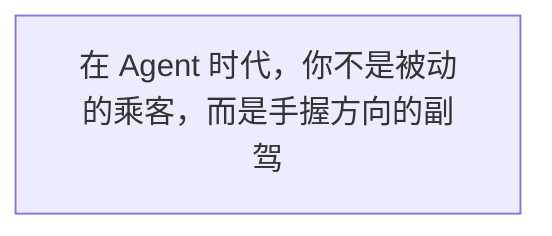
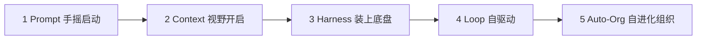
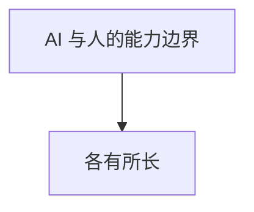
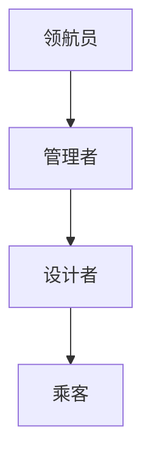
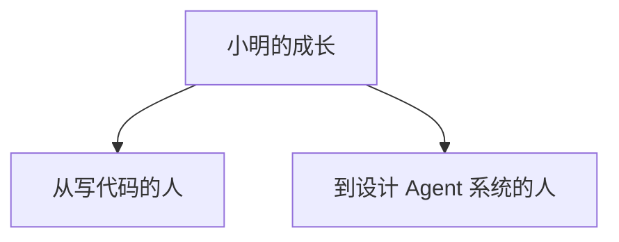
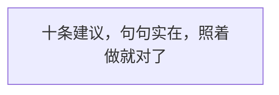
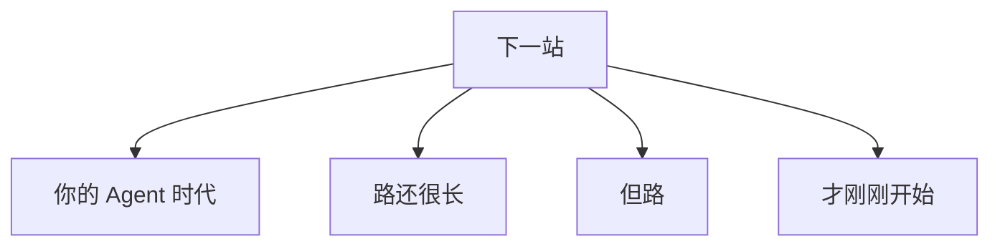
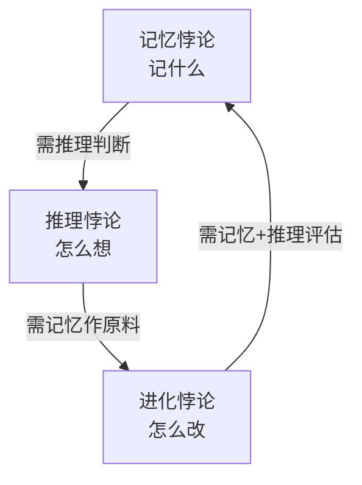

终 章

技术的终极意义，从来不是替代人，  
而是让人更像人。

— 第 18 章 · 全书完 —

写到这里，这本书已经接近尾声了。 从第一章的"Agent是什么"，到今天的最后一章，我们一起走过了一段不短的旅程。 如果你是从第一章一路读到这里的——谢谢你，你比很多人都走得更远。

在开始这最后一章之前，我想先跟你聊几句题外话。

不知道你有没有注意到一个现象：这两年，关于 AI 的讨论越来越两极分化了。

一拨人说——"AI 要取代所有人了！程序员要失业了！文案要失业了！设计师要失业了！"他们焦虑、恐慌，觉得天要塌下来了。

另一拨人说——"AI 就是个玩具！它只会胡说八道！它连简单的逻辑都搞不清楚！"他们不屑、嘲讽，觉得 AI 就是个噱头。

这两种人，我都见过很多。而且有趣的是，他们往往是同一拨人——去年还在说"AI 要逆天了"，今年就说"AI 也就那样"。

为什么会这样？

因为他们都把 AI 当成了一个"东西"——要么是无所不能的神，要么是一无是处的废物。

但如果你真的读完了这本书，你应该明白——AI 既不是神，也不是废物。 **AI 是一辆车。一辆需要人来驾驭的智能汽车。**

车不会自己决定去哪儿。车不会自己判断走哪条路更有价值。车不会为撞到人负责。

这些，都是人的事。

这最后一章，我们不讲技术了。 我们讲人。讲你。讲在这个 AI 飞驰的时代里，**人的价值到底在哪里**。

> 图 1：在 Agent 时代，你不是被动的乘客，而是手握方向的副驾

## 18.1 我们走了多远？——一本书的总结

在讲人的价值之前，我们先花一点点时间，回头看看我们这一路走过的路。

还记得第一章吗？我们说 Agent 就像一辆会自己开的智能汽车。从那时候起，我们就踏上了这段旅程。

### 从 Prompt 到 Loop：一辆车的进化史

最开始，我们讲的是 **Prompt 时代**。那时候的 AI，就像一辆刚学会启动的车——你得告诉它去哪儿、怎么走、走哪条路，每一步都要说得清清楚楚。你说一句，它动一下。

那时候大家最关心的是：怎么写提示词才能让 AI 听话？怎么让它输出的质量更高？Prompt Engineering 成了最热门的技能。

然后我们进入了 **Context 时代**。人们发现，光有指令不够，AI 还需要"看见"周围的环境。就像一辆车有了挡风玻璃和后视镜——它能看到路况了，就能开得更稳。

RAG、知识库、上下文窗口、Skills……这些都是为了让 AI "看得更清楚"。Context Engineering 成了新的关键词。

再然后是 **Harness 时代**。车能开了，但开得快了就容易出事。于是我们需要安全带、需要刹车、需要安全气囊、需要交通规则。

权限控制、行为约束、验证机制、人工接管点——这些 Harness 的组件，决定了 Agent 能不能真的用在生产环境里。

接下来是 **Loop 时代**。车不只是能开了，它还能自己判断路线、自己避开障碍、自己规划行程。它从"你指哪儿打哪儿"变成了"告诉你目的地，它自己开过去"。

观察、思考、行动、验证、调整——这个闭环，让 Agent 真正有了"自主"的味道。

最后是 **群体智能时代**。一辆车不够用了，我们需要一支车队。有的车负责探路，有的车负责运货，有的车负责维修，有的车负责指挥。它们互相协作，形成了一个 Agent Mesh。

> 图 2：从 Prompt 到 Agent Mesh：一本书的技术演化时间线

### 从"AI说"到"AI做"到"AI自己找事做"

如果用一句话来总结这整条演化路径，那就是——

从"AI 说"，到"AI 做"，再到"AI 自己找事做"。

第一代 AI，只会**说**。你问它问题，它给你答案。它说得再好听，也只是说说而已。真正要做事的，还是你。

第二代 AI，学会了**做**。它能调用工具、能执行操作、能完成具体的任务。你给它一个目标，它能真的去干。虽然干得可能不太好，但它至少开始动手了。

第三代 AI，开始**自己找事做**。它不只是执行你的指令，它还会观察环境、发现问题、主动行动。它像一个真正的助手——你没想到的，它帮你想到了；你没安排的，它帮你安排了。

这个演化的过程，速度快得惊人。

三年前，大家还在争论"Prompt 到底是不是一门真正的工程"。 两年前，大家开始讨论"Context Window 多大才够用"。 一年前，"Agent"还是一个小众的技术概念。 而今天，"Agent 团队"已经成了很多公司的标配。

### 技术在变，但人的角色一直在变

但是——我想请你注意一件事。

在整个演化过程中，**变化的不只是技术，还有人的角色**。

Prompt 时代，人的角色是"指令员"——你得学会怎么跟 AI 说话。 Context 时代，人的角色是"信息员"——你得学会给 AI 喂什么信息。 Harness 时代，人的角色是"安全员"——你得学会怎么给 AI 设规矩。 Loop 时代，人的角色是"设计师"——你得学会怎么设计 AI 的工作流。 群体时代，人的角色是"指挥官"——你得学会怎么组织一支 AI 团队。

你看，技术越进化，人需要做的事情就越少吗？

不。**人需要做的事情没变少，只是变了。**

从动手的事，变成了动脑的事。 从执行的事，变成了决策的事。 从具体的事，变成了方向的事。

这就是为什么我要写这最后一章。 因为很多人还没意识到——当 Agent 越来越能干的时候，**真正决定你价值的，已经不是你能干多少活，而是你能定多少方向**。

## 18.2 人的价值在哪里？

好，那我们来直面这个问题：**在 Agent 时代，人的价值到底在哪里？**

老王曾经跟小明说过一段话，我觉得特别好。在这里分享给你。

AI 能开得又快又稳，但去哪儿，得人说了算。

这句话听起来简单，但背后的道理很深。

我们来做一个对比：AI 擅长什么？人擅长什么？把这件事想清楚了，你就不会焦虑了。

> 图 3：AI 与人的能力边界：各有所长，各司其职

### AI 擅长的：重复劳动、信息处理、速度、规模

我们先说 AI 擅长什么。

**第一，重复劳动。** 同样的事情做一百遍、一千遍、一万遍，AI 不会累、不会烦、不会走神、不会出错（至少不会因为疲劳而出错）。写测试用例、生成报表、整理文档、回复常见问题——这些重复的事情，交给 AI 就对了。

**第二，信息处理。** AI 能在几秒钟内读完一本书、分析完几万条数据、对比几百个方案。它的信息吞吐量是人类的成千上万倍。你让它做调研、做汇总、做分类——它比任何人都快。

**第三，速度。** AI 不需要睡觉、不需要吃饭、不需要休息。它可以 24 小时不间断地工作。一个 Agent 一天干的活，可能顶一个人干一个月。

**第四，规模。** 一个人只能同时做一件事，但一百个 Agent 可以同时做一百件事。而且增加 Agent 的成本，比增加人的成本低得多。

这些都是 AI 的强项。而且我要告诉你——在这些领域，你**永远**比不过 AI。

别难过。这不是你的问题。这就像你跟汽车比跑步、跟计算器比算数、跟望远镜比看远方——你比不过，是正常的。

但这**不代表**你没有价值。

### 人擅长的：方向判断、价值取舍、创意、责任

那人类擅长什么呢？

**第一，方向判断。** AI 能告诉你走哪条路最快，但它不知道你**为什么**要去那个地方。它不知道你赶时间是为了见一个重要的人，还是为了参加一个重要的会。它不知道你宁愿绕路也要经过海边，因为你想看看日落。

**去哪儿**，这个问题只有人能回答。

**第二，价值取舍。** 生活中很多选择，不是"对与错"的选择，而是"好与更好"的选择。是花更多时间陪家人，还是花更多时间拼事业？是追求短期收益，还是长期价值？是稳妥一点，还是冒险一点？

这些取舍，AI 做不了。因为它不懂你心里那杆秤。

**第三，创意。** 我说的创意，不是"让 AI 生成一张图片"那种创意。我说的是真正的创意——从无到有地创造一个全新的东西。提出一个没人提过的问题。找到一个没人发现的角度。

AI 能组合已有的东西，但它很难真正"创造"出从未有过的东西。因为它所有的输出，都基于它见过的数据。而真正的创新，往往发生在数据之外。

**第四，责任。** 这是最最重要的一点。

AI 做了决策，谁负责？是写 Prompt 的人？是训练模型的人？还是使用 AI 的人？

答案很简单：**人负责。**

车撞了人，你不能说"是车自己开的"。Agent 出了错，你也不能说"是 AI 自己干的"。

最终的责任，永远在人身上。

而"愿意负责"这件事本身，就是一种巨大的价值。

老王金句

"在 Agent 时代，最值钱的不是你会写多少代码，而是你知道该往哪儿开。"

## 18.3 你是副驾，不是乘客

好了，现在我们来聊这一章的核心命题——**你是副驾，不是乘客**。

这句话是什么意思呢？

在 Agent 时代，我们每个人都要选择自己的角色。根据你对 AI 的掌控程度，我把人分成了四个层次。

> 图 4：角色金字塔：从乘客到领航员，你在哪一层？

领航员

设计整个系统的架构和方向

司机

自己设计 Loop 和 Harness

副驾

知道路怎么走，关键时刻能踩刹车

乘客

只会用 AI 生成内容，AI 说什么信什么

### 第一层：乘客

什么是乘客？

乘客就是——上车、坐下、玩手机、睡觉。车开到哪儿算哪儿。司机说"到了"，他就下车。

放到 AI 时代，乘客就是这样的人：

- 只会用 AI 生成内容，AI 说什么信什么
- 不知道 AI 是怎么工作的，也不想知道
- AI 生成的东西，他不检查就直接用
- 出了问题，他怪 AI "怎么这么笨"
- AI 进步了，他焦虑；AI 出错了，他嘲笑

乘客的问题在哪里？ 在于他**把自己的命运交给了别人**。

你可能会说："我只是用用 AI 而已，没那么严重吧？"

其实比你想的严重。

如果你只是用 AI 写个文案、画个图，那确实没什么。但如果你开始用 AI 做决策、做判断、做选择——而你自己连判断 AI 说得对不对的能力都没有——那你就真的把方向盘交出去了。

**把方向盘交出去的人，迟早会被带到沟里。**

### 第二层：副驾

什么是副驾？

副驾就是——坐在副驾驶座上，看着路、看着导航、看着仪表盘。他知道现在在哪儿、要去哪儿、走的哪条路。如果司机开错了，他会指出来。如果遇到危险，他能拉手刹。

放到 AI 时代，副驾就是这样的人：

- 知道 AI 的能力边界，知道它擅长什么、不擅长什么
- AI 生成的内容，他会检查、会验证、会修改
- 知道什么时候该相信 AI，什么时候该怀疑
- 关键时刻，能自己上手接管
- 对结果负责，而不是把锅甩给 AI

你是副驾，不是乘客。  
副驾知道路怎么走，关键时刻能踩刹车。

这就是为什么我把"副驾"作为这一章的标题。 因为我觉得，**这是每个人都应该达到的最低标准**。

你可以不是专家，你可以不会写代码，你可以不会设计 Agent 系统。但你至少要当一个合格的副驾——你得知道路怎么走，你得能在关键时刻踩刹车。

怎么才能当一个好副驾？ 很简单——**保持清醒，保持怀疑，保持判断**。

### 第三层：司机

什么是司机？

司机就是——手握方向盘、脚踩油门刹车的人。车怎么走、开多快、走哪条路，都是他说了算。他不只是知道路，他还能自己开。

放到 AI 时代，司机就是这样的人：

- 能自己设计 Agent 的工作流（Loop）
- 能搭建安全保障系统（Harness）
- 知道怎么给 Agent 喂正确的信息（Context）
- 能根据不同的任务调整 Agent 的配置
- 出了问题能排查、能调试、能修复

如果你是一个开发者、产品经理、或者任何需要深度使用 AI 的人，我建议你至少要达到"司机"这个层次。

因为当你能自己开车的时候，你才真正拥有了自由。你想去哪儿就去哪儿，想什么时候出发就什么时候出发。你不用等别人开车，也不用怕司机开错路。

### 第四层：领航员

什么是领航员？

领航员就是——不自己开车，但他决定整个车队的路线。他看地图、看天气、看路况，然后告诉车队：我们的目标是哪里，我们应该走哪条路，我们要避开哪些危险。

放到 AI 时代，领航员就是这样的人：

- 能设计整个 Agent 系统的架构和方向
- 知道什么样的问题适合用 Agent 解决，什么样的不适合
- 能组织多个 Agent 形成协作网络
- 能判断 AI 技术的发展趋势，提前布局
- 能平衡技术、业务、安全、成本之间的关系

领航员是最高层次的角色。他不需要写代码，但他需要有格局、有视野、有判断力。

你也许会嘀咕："那我想当领航员，是不是就不用学技术了？"

不是的。**最好的领航员，往往都是最好的司机出身。**

你连车都不会开，怎么知道哪条路好走、哪条路难走？你连 Agent 都没搭过，怎么知道系统该怎么设计？

所以，别急着当领航员。先从副驾做起，再当司机，等你开得足够多了，自然就知道怎么领航了。

### 你想当哪个？

说到这里，我想问你一个问题：**你想当哪个？**

乘客？副驾？司机？还是领航员？

没有标准答案。不是每个人都要当领航员，也不是每个人都适合当司机。

但我想告诉你一件事：

**你至少要当副驾。**

因为乘客的命运，掌握在别人手里。而副驾的命运，至少有一半掌握在自己手里。

在这个 AI 飞速发展的时代，当乘客是最危险的。你以为你在享受，其实你在失控。

别当乘客。当副驾。

如果你有更大的野心——当司机，当领航员——那就更好了。

## 18.4 普通人的成长路径

好，既然我们要成长，那具体该怎么走？

很多人一上来就说："我要做 Agent 系统！我要搞 AI 创业！"结果折腾了半天，连 Prompt 都写不好。

别急。饭要一口一口吃，路要一步一步走。

我给你画了一条普通人的成长路径，一共五个阶段。你可以对照一下，看看自己现在在哪个阶段，下一步该往哪儿走。

> 图 5：从 Prompt 到 Agent 团队：五个阶段，一步一个脚印

第一阶段

#### 学会用 Prompt —— 握好方向盘

这是一切的起点。你要学会怎么跟 AI 说话——怎么说清楚你的需求、怎么引导 AI 输出你想要的结果、怎么避免 AI 胡说八道。 别小看 Prompt，很多人用了一两年 AI，Prompt 还是写得一塌糊涂。 把 Prompt 练扎实了，后面的路才好走。

第二阶段

#### 学会做 Context —— 给对的信息

光有指令不够，你还得给 AI 提供正确的上下文。就像开车得有挡风玻璃——你得让 AI "看见"它需要知道的信息。 这一阶段你要学习的是：怎么整理知识库、怎么做 RAG、怎么筛选有效的信息、怎么控制上下文的质量和成本。 Context 是杠杆——同样的 AI，给的 Context 不一样，结果天差地别。

第三阶段

#### 学会搭 Harness —— 建安全系统

当你开始让 AI 真的做事的时候，安全就成了头等大事。 这一阶段你要学习的是：怎么设置权限、怎么加验证机制、怎么设计人工接管点、怎么监控 AI 的行为。 记住：Harness 永远比功能重要。没有刹车的车，跑得越快越危险。

第四阶段

#### 学会设计 Loop —— 让它自己跑

当你有了方向（Prompt）、有了视野（Context）、有了安全（Harness），你就可以开始设计真正的 Agent Loop 了。 这一阶段你要学习的是：怎么设计观察-思考-行动的循环、怎么定义目标和终止条件、怎么让 Agent 自己发现问题和修正错误。 到了这一步，你就从"用 AI 的人"变成了"造 Agent 的人"。

第五阶段

#### 学会建 Agent 团队 —— 组队干活

一个 Agent 的能力是有限的，但一支 Agent 团队的潜力是无限的。 这一阶段你要学习的是：怎么给不同的 Agent 分配角色、怎么让它们互相协作、怎么设计通信机制、怎么管理整个团队的产出和质量。 到了这一步，你就是一个真正的"AI 指挥官"了。

划重点

别急，一步一步来。你不需要一天就到达第五阶段。但你至少要知道，路是这么走的。

我见过太多人，一上来就想搞"多智能体系统"，结果连单个 Agent 都玩不转。这就像你连自行车都不会骑，就想开 F1——不是不可能，但大概率会摔得很惨。

踏踏实实，一步一步来。每一步都走扎实了，后面的路自然就顺了。

而且我要告诉你——哪怕你只走到第二阶段（学会做 Context），你已经比 90% 的人强了。

因为大多数人，连第一阶段（写好 Prompt）都还没做到呢。

## 18.5 不会被替代的三种能力

聊完成长路径，我们来聊一个大家最关心的问题：**什么能力，是 AI 永远学不会的？**

说实话，这个问题我想了很久。

前几年大家说"AI 不会创意"，结果 AI 能画图、能写小说、能作曲。 后来大家说"AI 不会逻辑"，结果 AI 能做数学题、能写代码、能推理。 再后来大家说"AI 不会情感"，结果 AI 能安慰人、能写情书、能当心理医生。

好像每一条"人类专属"的防线，都在被 AI 一点点突破。

那到底有没有 AI 永远学不会的东西？

我认为有。而且有三种。

> 图 6：小明的成长：从写代码的人，到设计 Agent 系统的人

判断力

知道什么重要、什么不重要  
在模糊中做出选择

✨

品味

知道什么是好、什么是坏  
在众多选项中挑出最好的

责任感

为结果负责，为决策负责  
愿意承担后果

### 判断力：知道什么重要，什么不重要

第一种能力，是**判断力**。

什么是判断力？就是在信息不完整、结果不确定的时候，你依然能做出选择的能力。

AI 擅长的是"在给定条件下找最优解"——你把规则说清楚，把目标说明白，它能帮你找到最好的方案。

但现实生活中的大多数问题，是**没有给定条件的**。

你不知道所有的信息。你不确定规则会不会变。你甚至连目标是什么，都得自己想清楚。

这时候，就需要判断力了。

判断力不是"正确答案"，而是"在不确定中做选择"的能力。

判断这件事值不值得做。判断这个人值不值得信任。判断这个方向值不值得投入。

AI 能给你数据、给你分析、给你建议。但**拍板的那一刻，只能是人**。

### 品味：知道什么是好，什么是坏

第二种能力，是**品味**。

什么是品味？不是说你会不会穿衣服、会不会喝咖啡。我说的品味，是一种"辨别好坏"的直觉。

同样是一篇文章，有的人觉得写得真好，有的人觉得一般般。 同样是一个设计，有的人觉得太丑了，有的人觉得还行。 同样是一段代码，有的人说写得真漂亮，有的人说能跑就行。

这就是品味的差距。

品味这个东西，AI 学不会。因为品味不是从数据里学来的，它是从**经历**里长出来的。

你见过好的东西，你才知道什么是好。你做过好的东西，你才知道怎么做到好。你踩过坑、犯过错、失败过，你才知道什么是真的好，什么只是看起来好。

品味是时间的产物。它藏在你读过的书、走过的路、见过的人、做过的事里面。

这些，AI 没有。

### 责任感：为结果负责，为决策负责

第三种能力，是**责任感**。

这是最最最重要的一种能力。

什么是责任感？就是"这件事我担着"的勇气。

做成了，不居功自傲。做砸了，不推诿甩锅。

AI 永远不会有责任感。因为它不需要为任何事情负责。

它生成了错误的信息，它不会道歉。它做出了错误的决策，它不会内疚。它造成了损失，它不会赔偿。

这些，都得人来扛。

而愿意扛事的人，永远是稀缺的。

你想想看——在你的团队里，最受信任的人是谁？不一定是技术最好的那个，也不一定是最聪明的那个。往往是那个**靠谱**的人——交给他的事，你放心。出了问题，他扛着。

这种靠谱，就是责任感。

在 Agent 时代，责任感会变得越来越珍贵。因为当 AI 能做的事情越来越多，**愿意为结果负责的人，就越来越值钱**。

判断力、品味、责任感——  
这三种能力，AI 永远学不会。

## 18.6 给初学者的十条建议

好了，道理讲了很多。最后，我给你一些具体的、可以马上动手的建议。

如果你是一个刚接触 AI、刚接触 Agent 的初学者，这十条建议，希望你能记住。

> 图 7：十条建议，句句实在，照着做就对了

1

别焦虑没用，动手最重要

每天刷十条"AI 要取代人"的新闻，不如动手用一次 AI。焦虑解决不了任何问题，行动才是最好的解药。路是一步一步走出来的，不是想出来的。

2

从一个小场景开始，别上来就搞大系统

别一上来就想做"通用人工智能"。先找一个你工作或生活中的具体小问题——比如整理周报、回复邮件、生成测试用例——用 AI 把它解决了。小成功积累多了，自然能做大事。

3

Prompt 是基础，永远不过时

别觉得 Prompt 太简单、太初级就不学。Prompt 是你跟 AI 沟通的语言。连话都说不清楚，还怎么一起干活？把 Prompt 练到炉火纯青，你会发现很多问题根本不需要复杂的 Agent。

4

Context 是杠杆，选对了事半功倍

同样的 AI，给的 Context 不一样，结果天差地别。学会筛选信息、整理知识、构建上下文，是提升 AI 产出质量性价比最高的方法。记住：垃圾进，垃圾出。

5

安全第一，Harness 永远比功能重要

在让 Agent 做任何有风险的事情之前，先把安全措施做好。权限控制、验证机制、回滚方案——这些东西平时看不见，出了事就是救命稻草。宁可功能少一点，也要安全多一点。

6

人在环里，别轻易放手

Human in the Loop——让人参与到 Agent 的工作流中。关键决策、重要节点、风险操作，一定要有人审核和确认。别想着"全自动化"，那是终极目标，不是起点。

7

记录和复盘，从失败中学

Agent 出错了，别骂一句"AI 真笨"就完事了。记录下来：它为什么出错？是 Prompt 的问题？还是 Context 的问题？还是 Harness 没做好？每一次失败都是进步的机会。

8

关注成本，别让账单吓一跳

Agent 跑起来是要花钱的——API 调用、计算资源、存储……一个失控的 Loop，一晚上就能烧掉你几千块。养成看账单的习惯，做好成本控制。便宜的方案，往往才是可持续的方案。

9

跟人交流，别闭门造车

AI 发展太快了，你一个人追不上。加入社区、关注大佬、跟同行交流——你遇到的 99% 的问题，别人早就遇到过了。别自己瞎琢磨，站在别人的肩膀上，才能看得更远。

10

保持好奇，但保持警惕

对新技术保持好奇心，愿意尝试、愿意学习。但同时也要保持警惕——不盲目崇拜，不全盘接受，永远有自己的判断。好奇让你前进，警惕让你不翻车。

这十条建议，说难不难，说简单也不简单。

如果你能做到一半，你已经超过大多数人了。 如果你能全部做到，恭喜你——你在这个时代，一定不会混得太差。

## 18.7 下一站：你的 Agent 时代

好了，讲到这里，这本书的技术内容就全部结束了。

但我想告诉你——**这不是终点，这是起点**。

你想想看，我们现在处在什么位置？

Agent 技术才刚刚开始。就像汽车刚发明的时候——跑起来哐哐响、经常熄火、路也不好走、加油也不方便。那时候的人，可能想象不到一百年后的今天，汽车已经成了每个人生活的必需品。

Agent 也是一样。

今天的 Agent，还很初级。它会犯傻、会出错、会跑偏、会卡住。你可能经常觉得"这东西也太笨了"。

但它会进化的。而且进化的速度，会比你想象的快得多**。

> 图 8：下一站：你的 Agent 时代——路还很长，但路，才刚刚开始

三年后，Agent 可能会像今天的手机一样普及。每个人都有自己的 AI 助手，帮你处理工作、安排生活、管理信息。

五年后，Agent 团队可能会成为公司的标配。每个部门、每个团队、甚至每个人，都有自己的 AI 小分队。

十年后，我们可能已经生活在一个完全不同的世界里。很多今天你觉得"必须人来做"的事情，到那时候可能都由 Agent 完成了。

但——

不管技术怎么进化，有一件事不会变：

人永远是那个定方向的人。

AI 能开车，但它不知道为什么要去那个地方。 Agent 能做事，但它不知道为什么要做这件事。 技术能跑很快，但它不知道该往哪儿跑。

这些，永远是人的事。

### 小明的新旅程

故事讲到最后，我们再回来说说小明。

还记得第一章的小明吗？一个普通的前端工程师，每天写着重复的代码，对未来有点迷茫，对 AI 有点好奇，又有点恐惧。

那时候的他，觉得 Agent 是一个很遥远、很高深的东西。他觉得那是架构师、是算法工程师、是大牛们才玩得转的东西。

但现在呢？

小明已经不是当年的小明了。

他学会了写好 Prompt，能让 AI 帮他快速生成代码原型。 他学会了构建 Context，能把项目的知识库整理得井井有条。 他学会了搭建 Harness，能在关键节点加上安全校验。 他学会了设计 Loop，能让 Agent 自动完成一整套工作流。 他甚至开始尝试组建 Agent 团队，让不同的 Agent 分工协作。

更重要的是——**他从一个"写代码的人"，变成了一个"设计 Agent 系统的人"**。

他不再担心 AI 会抢他的饭碗。因为他知道，AI 只是工具。而他，是驾驭工具的人。

他的价值，不再是"能写多少行代码"，而是"知道该让 Agent 做什么、怎么做才对、出了问题怎么解决"。

小明的故事，还在继续。

而你的故事呢？

## 18.8 写给未来的你

这本书读到这里，就要说再见了。

在结束之前，我想跟未来的你说几句话。

### 一年后，你会在哪里？

一年后的今天，你会在哪里？

你可能已经熟练掌握了 Agent 的使用，工作效率提升了好几倍。 你可能已经搭建了自己的 Agent 团队，在做一些以前想都不敢想的事情。 你可能已经转行做了 AI 相关的工作，在新的领域里如鱼得水。

也可能——你还在原地踏步。

书买了没看，课买了没听，工具收藏了一堆但一个都没用起来。

一年时间，说长不长，说短不短。 但足以让一个人发生脱胎换骨的变化。

我希望一年后的你，会感谢今天的自己——感谢今天的你翻开了这本书，感谢今天的你开始了行动，感谢今天的你没有选择躺平。

### 三年后，这个行业会变成什么样？

三年后的 AI 行业，会是什么样子？

说实话，我不知道。

三年前，没人想到 AI 会发展得这么快。 三年后，也没人知道 AI 会变成什么样。

但我知道一件事：**变化会越来越快，而且快到你无法想象**。

今天你觉得很厉害的技术，三年后可能已经过时了。 今天你觉得很稳固的职位，三年后可能已经不存在了。 今天你觉得很安全的技能，三年后可能已经没用了。

在这样的时代里，最安全的策略是什么？

不是学一个不会过时的技能——因为没有不会过时的技能。 而是**学会学习本身**。

学会怎么快速上手新东西。学会怎么在变化中找到方向。学会怎么在不确定中做出判断。

这，才是真正的"铁饭碗"。

### 十年后，我们的生活会有什么不同？

十年后呢？

十年后的世界，可能已经跟今天完全不一样了。

可能我们每个人都有一个专属的 AI 助理，从早到晚帮我们处理各种事情。 可能大部分重复性的工作都已经被 AI 取代了，人们有更多的时间去做自己真正想做的事。 可能教育、医疗、交通、娱乐——每个行业都被 AI 彻底改变了。

但我相信，有些东西永远不会变。

不会变的东西

**创造的快乐**——从无到有做出一个东西的满足感，是任何 AI 都给不了的。

**连接的温暖**——跟家人、朋友、爱人在一起的感觉，是任何技术都替代不了的。

**意义的追求**——人活着是为了什么？这个问题，只有人自己能回答。

无论技术怎么变，人的价值不变。

因为人的价值，从来不是"你能做多少事"。 而是"你是谁"——你是一个有判断力、有品味、有责任感的人。 你是一个能创造、能连接、能追求意义的人。

这些，是 AI 永远拿不走的东西。

技术的终极意义，  
从来不是替代人，  
而是让人更像人。

小明合上笔记本，窗外的天已经亮了。

他想起老王说过的那句话。

他打开电脑，新的一天开始了。

这一次，他不是一个人在战斗。

他的身边，有一整支 Agent 团队。

而他，是副驾。

## 18.9 研究前沿：三重悖论——记忆、推理、进化为何难分难解

写到这里，我想跟你聊一个站在 2025 年之后、很多研究者才开始真正重视的观察。前面几章咱们拆了五代演化，也补了记忆、Harness、Loop 三个研究前沿——但你发现没有，它们**根本拆不开**。

有个很深刻的总结，叫 **"三重悖论"**：

- **记忆悖论**：Agent 记越多越糊涂，记忆的核心是"选择"而非"存储"；
- **推理悖论**：用 Harness 脚手架补模型推理的不足，但脚手架越复杂故障越多；
- **进化悖论**：Agent 想自己改进自己，但"谁当裁判"这道关过不去。

> **老王临别的研究笔记**
> 这三者的深层关系是一个**循环依赖**：记忆要记什么，得靠**推理**来判断；推理要把信息喂进去，又得靠**记忆**当原料；而进化想持续改进，必须靠记忆和推理一起当"评估器"。**你优化其中任何一个，都会被另外两个的不足抵消**——这就是为什么成熟智能体的真正瓶颈，已经不在'模型本身'，而在模型之外的这三件事上。

小明听完，沉默了一会儿："所以……Agent 的尽头，不是某个超级模型，而是一套会记、会想、还会自己纠偏的系统？"

"对。"老王笑了，"而且别忘了安全那一维——当 Agent 能自己改自己，'别让它夺走人的掌控权'（研究者叫'去赋能' disempowerment）也卷进了这个循环里。这就是为什么这本书从头到尾拿'智能车'打比方：**真正的自动驾驶，不是引擎多猛，而是刹车、方向盘、雷达、还有那个永远在副驾上、随时能接管的人，一个都不能少。**"

路还很长。

但路，才刚刚开始。

— 全书完 —

← 返回目录 下一本书预告：AI Native 团队打造指南 →

《智驾时代：Agent 进化简史》 © 2026

从 Prompt 到自进化组织，一部 AI 智能体的演化史诗
